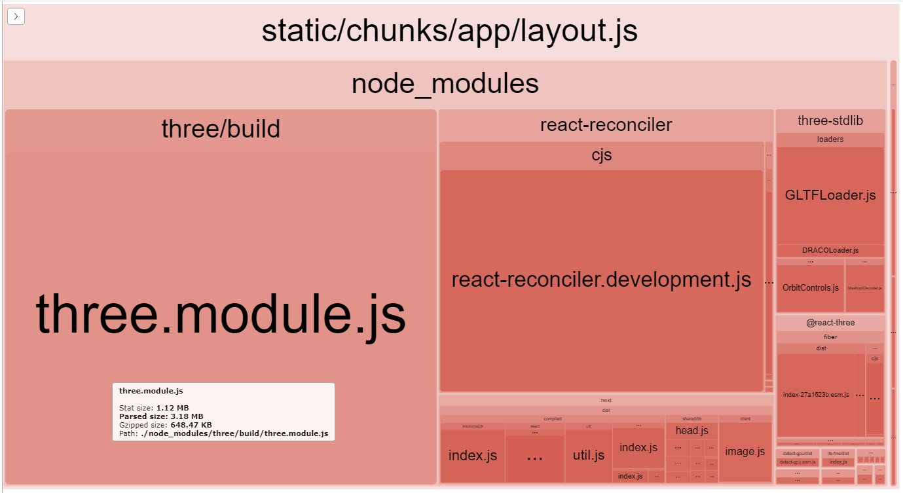
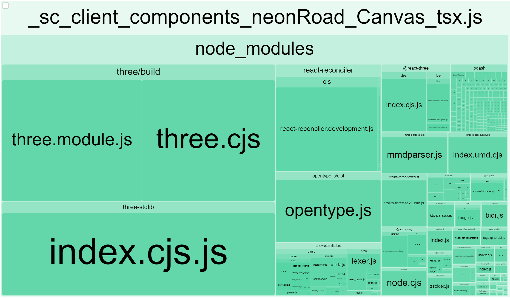
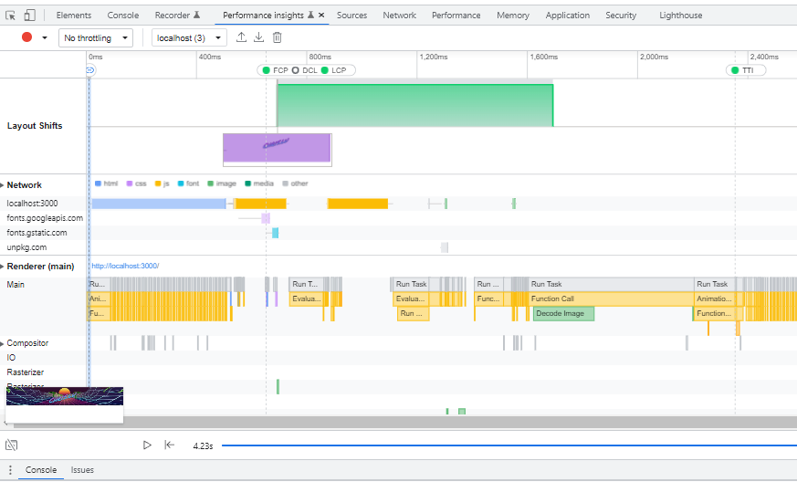
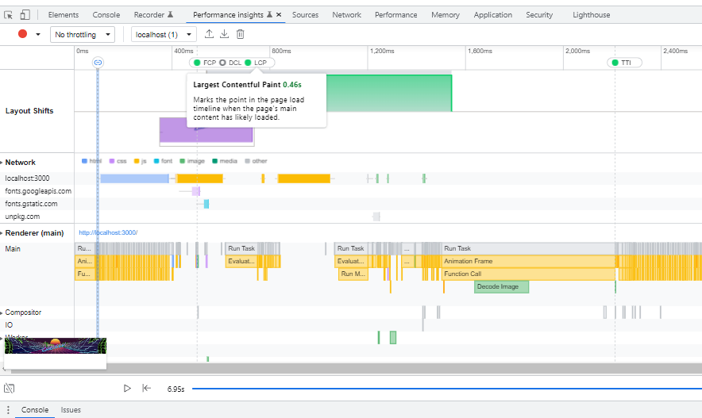

# Neon Road

## inspiration

80s 3D scenes inspiration (with code):

this is the first retrowave scene I found while googling for inspiration to build a 3d 80s scene using three.js: <https://github.com/Moukrea/retrowave-scene>
later I found another good example (with code) of what I wanted to achieve: <https://codepen.io/prisoner849/pen/PvdEMP>
and finally this is the blog post I took a lot of inspiration from, by looking at his code line by line, I used a similar codebase to make the first version of the animation as it was the closest to what I wanted to achieve, three.js vaporware scene tutorial: <https://blog.maximeheckel.com/posts/vaporwave-3d-scene-with-threejs/>
too late for me (but maybe not for me), after I had finished my animation, I found another great example done with three fiber: <https://betterprogramming.pub/synthwave-scene-my-coolest-three-js-project-yet-6359c38dfd08>

80s style and more inspiration (visual):

here is animation done in html and css (no webgl) by [Jane Ori](https://github.com/JaneOri): <https://codepen.io/propjockey/pen/VwKQENg>
80s art by James White: <https://signalnoise.com/>
80s art by Romain Trystram: <https://romaintrystram.myportfolio.com/projects>
VSCode Synthwave theme: <https://github.com/robb0wen/synthwave-vscode>
Synthwave Music by Karl Casey aka "White Bat" on Bandcamp: <https://karlcasey.bandcamp.com/>
Github skyline website: <https://skyline.github.com/>

## must read

three.js and react fiber tutorial: <https://www.smashingmagazine.com/2020/11/threejs-react-three-fiber/>

nextjs and react three fiber setup example repository: <https://github.com/pmndrs/react-three-next>

react three fiber documentation: <https://docs.pmnd.rs/react-three-fiber/api/objects>

an important page to read from the documentation is the **scaling performance** section: <https://docs.pmnd.rs/react-three-fiber/advanced/scaling-performance>
and another important documentation page is the **performance pitfalls** section: <https://docs.pmnd.rs/react-three-fiber/advanced/pitfalls>

react three fiber camera explained: <https://youtu.be/Isr-hIveUK0>
react three fiber orbit controls documentation: <https://sbcode.net/react-three-fiber/orbit-controls/>

react three fiber examples repository (each repository branch is a different example): <https://github.com/Sean-Bradley/React-Three-Fiber-Boilerplate>
another three fiber examples repository (with demo page linked in readme): <https://github.com/onion2k/r3f-by-example>

a lot of good examples of what can be done using "react three drei": <https://github.com/pmndrs/drei#index> and here is their Storybook examples page: <https://drei.pmnd.rs/>
here is a good list of performance related tools that "react three drei" offers: <https://github.com/pmndrs/drei#performance>

nice codesandbox "space shooter" game example that uses three fiber to import 3d models as well as sprites: <https://codesandbox.io/s/b7e01?file=/src/App.js:1392-1405>

another nice codesandbox showing the usage of shadows: <https://codesandbox.io/s/elastic-cache-p325m?file=/src/App.js:631-640>

you will find a lot of outdated tutorials on the web that got written prior to version 8, to convert the info of those to modern R3F (react three fiber): <https://docs.pmnd.rs/react-three-fiber/tutorials/v8-migration-guide#react-native-support>

check out the [GLTF models chapter](#gltf-experiments) for more links to must reads about GLTF files

here is a nice tool I found (but that I didn't try out), which makes npm packages out of your GLSL files (shaders): <https://github.com/glslify/glslify>, they have a website listing all available packages (there are a lot of interesting ones that might be useful to you): <http://stack.gl/packages/>

## installed these dependencies

install three.js (<https://github.com/mrdoob/three.js/>):

`npm i three --save-exact`

install react three fiber (<https://github.com/pmndrs/react-three-fiber>):

`npm i @react-three/fiber --save-exact`

install react three drei (<https://github.com/pmndrs/drei>):

`npm i @react-three/drei --save-exact`

react three fiber a11y (accessibility package for react three fiber: <https://docs.pmnd.rs/a11y/introduction>):

`npm i @react-three/a11y --save-exact`

Note: removed it, the animation has no clickable content, this package seemed to not add any value for such an animation

## colors I used

for the terrain (used in the grid image):

road lines pink: `ff00aa`
mountain lines blue: `00feff`
road surface: `0e0226`
mountain surface: `040728`

the css gradient I did to fill the sun SVG image:

`background: linear-gradient(90deg, rgba(255,233,21,1) 0%, rgba(255,208,31,1) 20%, rgba(252,167,25,1) 35%, rgba(249,113,25,1) 50%, rgba(249,85,48,1) 65%, rgba(245,61,93,1) 80%, rgba(255,0,170,1) 100%);`

## optimizing images

!important: when changing the colors of the grid PNG image, to optimize its size, you need to switch the color mode to **Indexed** and set the amount of colors to a minimum, in my case I set it to **4**

To optimize  the SVG I used this tool: <https://svgoptimizer.com/>
I used this online tool to optimize  the PNGs: <https://compresspng.com/> and <https://tinypng.com/>

Note: I used tinypng for the fallback image, it seemed to produce a smaller file than compresspng and the quality seemed a bit better, for the other files I used compresspng

## firefox SVG size bug

instead of displaying the svg sun firefox was showing a black square, I checked the firefox network tab and the svg had a size but when hovering over the line of the svg it showed no image and a size of 0x0, in chrome the svg got displayed with no problem

firefox bug report: <https://bugzilla.mozilla.org/show_bug.cgi?id=700533> and seems to be related to: <https://github.com/whatwg/html/issues/3510>

my initial SVG image had a viewbox defined but no width or height attribute

I fixed the problem by adding a width and height attribute:

```xml
<svg width="1220" height="1220" viewBox="0 0 1220 1220">
```

## gltf experiments

* creative commons licensed palm tree model: <https://sketchfab.com/3d-models/tree-palm-556752eb551d4ee7b342092c3bd3ed5e>
* gltf tutorial: <https://docs.pmnd.rs/react-three-fiber/tutorials/loading-models>
* gltf loader example: <https://sbcode.net/react-three-fiber/gltfloader/>
* mesh border tutorial: <https://blender.stackexchange.com/questions/163539/how-do-i-add-a-3d-border-on-all-edges-of-a-mesh>
* uv images and maps: <https://medium.com/@matthewmain/how-to-import-a-3d-blender-object-into-a-three-js-project-as-a-gltf-file-5a67290f65f2>
* blender gltf docs: <https://docs.blender.org/manual/en/2.82/addons/import_export/scene_gltf2.html>
* online gltf viewer to test exports: <https://gltf-viewer.donmccurdy.com/>

important! to convert a gltf model into a react component for easy usage (as mentioned in <https://docs.pmnd.rs/react-three-fiber/tutorials/loading-models#loading-gltf-models-as-jsx-components>), use this online tool: <https://gltf.pmnd.rs/>, or it can be used on the command line, the github repository is here: <https://github.com/pmndrs/gltfjsx>

another useful resource is this GLTF mesh optimizer called "gltf pack": <https://github.com/zeux/meshoptimizer/releases>

## font for text

for the text I used react three drei's Text element: <https://github.com/pmndrs/drei#text>

for the font, using the google URL that was fetching a woff2 file didn't work

so instead I downloaded the font from google fonts: <https://fonts.google.com/specimen/Permanent+Marker>

the downloaded zip contains a ttf file, which worked with drei's Text

## transform of the text

to transform the text I wanted to achieve something similar then what I would achieve in HTML using the [CSS skew function](https://developer.mozilla.org/en-US/docs/Web/CSS/transform-function/skew)

to do so I used threeJS makeshear: <https://threejs.org/docs/#api/en/math/Matrix4.makeShear>

## analyze the bundle size

install the next.js bundle analyzer using this command:

`npm install @next/bundle-analyzer --save-dev --save-exact`

then we edit the `next.config.mjs` file and change it to this:

```js
import WithBundleAnalyzer from '@next/bundle-analyzer'
import { PHASE_DEVELOPMENT_SERVER } from 'next/constants.js'

const nextConfig = (phase) => {

    const withBundleAnalyzer = WithBundleAnalyzer({
        enabled: phase === PHASE_DEVELOPMENT_SERVER ? true : false,
        //openAnalyzer: false,
    })

    /** @type {import('next').NextConfig} */
    const nextConfig = {
        experimental: {
            appDir: true,
        },
        images: {
            formats: ['image/avif', 'image/webp']
        },
    }

    return withBundleAnalyzer(nextConfig)

}

export default nextConfig
```

now we start the dev server and after that the analyzer will automatically open one or more pages in our browser with an analysis of the javascript chunks of our app

in the layout.js file chunk, we can see that three.js takes a lot of space and that it is 1.12MB heavy in development and would still be 648KB heavy if gzipped



to optimize the layout.tsx file size and load all the scripts used by our three.js animation in an async way, we create a container which we set as client component

we then use [next/dynamic](dynamic) which is the next.js of [react lazy](https://reactjs.org/docs/code-splitting.html#reactlazy) and which works like an [javascript dynamic import](https://developer.mozilla.org/en-US/docs/Web/JavaScript/Reference/Operators/import):

```ts
'use client'

import dynamic from 'next/dynamic'
// in this dynamic import case it is important to set "ssr: false"
// as in the NeonRoadCanvas component we use window
// else you get "window is not defined"
const NeonRoadCanvas = dynamic(() => import('./Canvas'), {
    ssr: false,
    loading: () => <span style={{ color: 'white', fontSize: '30px' }}>Loading...</span>,
})

const Container: React.FC = () => {

    return (
        <>
            <NeonRoadCanvas />
        </>
    )
}

export default Container
```

now we run the analyzer again and we notice that the layout.tsx is now super small (just a few kb), but this time we have a new file containing all the three.js libraries:



if we now compare the first version without lazy loading we see that the LCP is at 700ms:



after we have added the lazy loading the LCP drops to 460ms:



here is a good article from web.dev that explains what LCP is, that will show you that it is a metric used by core web vitals and why it matters: <https://web.dev/optimize-lcp/>

## failed bloompass experiment(s)

here is some code I tried to make the bloom effect work, the results were not good so I removed it:

```ts
import { extend, Object3DNode } from '@react-three/fiber'
import { Effects } from '@react-three/drei'
import { UnrealBloomPass } from 'three-stdlib'

extend({ UnrealBloomPass })

// https://docs.pmnd.rs/react-three-fiber/tutorials/typescript#extending-threeelements
declare module '@react-three/fiber' {
    // eslint-disable-next-line @typescript-eslint/naming-convention
    interface ThreeElements {
        unrealBloomPass: Object3DNode<UnrealBloomPass, typeof UnrealBloomPass>
    }
}

<Effects disableGamma>
    <unrealBloomPass threshold={0.9} strength={10} radius={0.5} />
</Effects>
```

New try:

in canvas.tsx

```ts
import { useRef, Suspense } from 'react'
import { PerspectiveCamera, PCFSoftShadowMap } from 'three'
import { EffectComposer, Bloom } from '@react-three/postprocessing'

<meshStandardMaterial
    map={floorTexture}
    displacementMap={displacementMap}
    displacementScale={displacementScale}
    roughness={0.1}
    metalness={0.6}
    emissiveMap={displacementMap}
    emissive={'white'}
    emissiveIntensity={1}
    toneMapped={true}
/>
```

in meshes.tsx:

```ts
<Suspense fallback={null}>
    <EffectComposer>
    <Bloom luminanceThreshold={0.9} />
    </EffectComposer>
</Suspense>
```

## performance tuning

performance monitor <https://github.com/pmndrs/drei#performancemonitor> can be used to check the performance and apply changes based on the returned value, like for example disable antialiasing

we could also check the user preference for animation speed <https://docs.pmnd.rs/a11y/access-user-preferences> and if low animations are requested we could reduce the speed of movement inside of useFrame

if the user browser tells us that saveData is enabled `navigator?.connection?.saveData`, we could not run the animation and instead just display the fallback image

### detect the GPU / is mobile for performance tuning

```ts
import { useDetectGPU } from '@react-three/drei'
const gpuInfo = useDetectGPU()
console.log('useDetectGPU: ', gpuInfo)
```

### create a custom animation loop

```ts
// animation request animation frame
const requestAnimationFrameRef = useRef(null)
const animationTimestampRef = useRef(0)

// visibility API
const animate = useRef(true)

const setAnimate = useCallback(() => {
    animate.current = !document.hidden
}, [document.hidden])

useEffect(() => {
    // https://developer.mozilla.org/en-US/docs/Web/API/Page_Visibility_API
    document.addEventListener('visibilitychange', setAnimate)
    return () => {
        document.removeEventListener('visibilitychange', setAnimate)
    }
})

useEffect(() => {
    requestAnimationFrameRef.current = requestAnimationFrame(loop)
    return () => {
        cancelAnimationFrame(requestAnimationFrameRef.current)
    }
}, [animate])

// custom loop
function loop(timeStamp: number) {

    // only animate if visible
    if (!animate.current) {
        requestAnimationFrameRef.current = requestAnimationFrame(loop)
        return
    }

    // if elapsed time < 60 frames per second => skip
    const framesPerSecond = 1000 / 30

    if ((timeStamp - animationTimestampRef.current) < framesPerSecond) {
        requestAnimationFrameRef.current = requestAnimationFrame(loop)
        return
    }

    animationTimestampRef.current = timeStamp

    three.advance(timeStamp/1000)

    requestAnimationFrameRef.current = requestAnimationFrame(loop)

}
```

Note: calling state.clock.getDelta() flushes the clock back to 0, source: <https://github.com/pmndrs/react-three-fiber/discussions/1991#discussioncomment-1962835>

A good video that explains delta time: <https://www.youtube.com/watch?v=yGhfUcPjXuE>

custom three fiber loop sources:

<https://discourse.threejs.org/t/how-we-can-stop-useframe-animation-in-react-three-fiber/41968/2>
<https://docs.pmnd.rs/react-three-fiber/advanced/scaling-performance>

### chrome memory and energy saver

if chrome goes into energy or memory saver mode, what happens to the animation, does it slow down, stop completly, what happens when the chrome energy saver mode ends?

to look up chrome discards and manually trigger them (also useful to toggle the energy saver mode) open this in tab:

<chrome://discards/>

sources:

<https://developer.chrome.com/blog/memory-and-energy-saver-mode>
<https://web.dev/articles/monitor-total-page-memory-usage>

## TODOs

* make chris.lu text clickable to return home via react router and accessible using <https://docs.pmnd.rs/a11y>?
* add post processing effects? <https://github.com/pmndrs/postprocessing>, if so then using performance monitor would be good <https://vercel.com/blog/building-an-interactive-webgl-experience-in-next-js#3.-optimize-performance>
* loading animation?
* if mouse over animation and mouse to right or left, make the camera move using OrbitControls? or maybe like in this example with onMouseMove: <https://codesandbox.io/embed/troika-3d-text-via-react-three-fiber-ntfx2?fontsize=14>, but restrict the zoom as well as movement to only go slight to left / right / top / bottom? make the map slightly turn to the right and left when moving to make it more 3d? useFrame has a **mouse** parameter see: <https://codesandbox.io/s/r3f-mouse-8d3ho>
* add audio player <https://github.com/chrisweb/web-audio-api-player> and some creative commons or copyright free synthwave songs to animation
* control animation speed based on peeks height using <https://github.com/chrisweb/waveform-data-generator>
* in this article <https://www.gatsbyjs.com/blog/performance-optimization-for-three-js-web-animations/> I read about a feature called saveData, should try to use it `navigator?.connection?.saveData`
* check for user preference for animation(s) should be low (via three fiber accessibility package > user preferences > <https://docs.pmnd.rs/a11y/access-user-preferences>), then set the framerate to very low value
* based on the performance monitor <https://github.com/pmndrs/drei#performancemonitor> value, change the gl antialias value, decrease the animation speed and change the canvas dpr value? I think gl can be accessed in useframe: `useFrame(({ gl }) => { })`
* firefox accessibility says canvas is clickable and has no alt text, but setting aria attributes on canvas element has them moved to container div by three fiber
* check if changing rendering performance setting is needed when mobile is detected
* check if the shadows settings (camera) can be tweaked for better performance
* add the accessibility package & set it up
