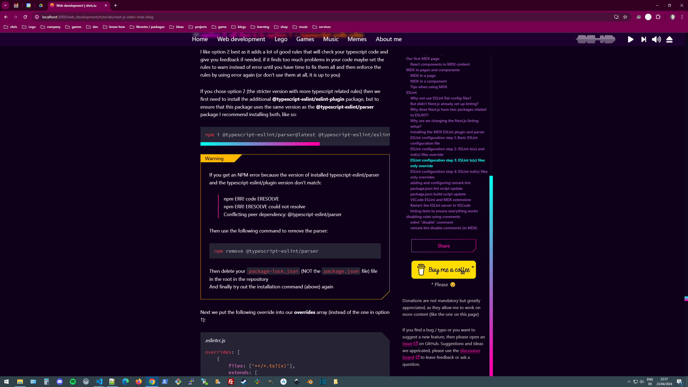

next chapters?

* \[DONE] setting up vercel account
* \[DONE] vercel preview (staging environment) with github commit triggers auto deploy
* \[DONE] CSP
* \[DONE] articles (pages) using MDX (@next/mdx)
* \[DONE] eslint for MDX
* next/mdx "mdx-components" file
* optimizing images with next/image
* all the MDX plugins
* metadata
* [experimental rust compiler](https://nextjs.org/docs/app/building-your-application/configuring/mdx#using-the-rust-based-mdx-compiler-experimental)
* layout
* navigation / next/link
* styling
* optimizing fonts with next/font
* SEO (metadata)
* github: pull request from preview into main branch (automatically link / close tickets)
* vercel analytics
* vercel prod release (custom domain)


### MDX code blocks

[rehype pretty code](https://www.npmjs.com/package/rehype-pretty-code) is a rehype plugin for markdown that adds "VSCode like" code highlighting to your code blocs and the best part is it has support support for VSCode themes

in this example we will use the great VSCode theme [SynthWave '84](https://github.com/robb0wen/synthwave-vscode)

Note: **rehype pretty code** uses shiki <https://shiki.matsu.io/> under the hood

first let's create a demo page, with the following markdown content:

````md
    # first article

    this is the code block:
    
    ```js
    function helloWorld() {
        // this is a comment
        console.log('Hello World!')
    }
    ```
````

now run the dev server and look at the code block, you will see that the markdown code block syntax got converted into an html \<pre> tag with an \<code class="language-js"> html tag inside, but there is no syntax colored highlighting ye, this is why we will now add the *rehype pretty code*\* plugin

let's install the **rehype pretty code** package, by using this command:

```shell
npm i rehype-pretty-code shiki --save-exact
```

Note: now we need to get the **VSCode "SynthWave '84" theme** from their github repository, we could either download it manually and put the theme json file into a folder, but what works too is to use npm to get it for us and put it into our `node_modules` directory

next we run the following command to add the repository **VSCode "SynthWave '84" theme** to our package.json dependencies list:

```shell
npm i https://github.com/robb0wen/synthwave-vscode.git
```

this will add the theme to our `node_modules` directory and create the following entry in our package.json:

```shell
  "dependencies": {
    "synthwave-vscode": "github:robb0wen/synthwave-vscode",
  },
```

unfortunatly as of now the json file of the VSCode "SynthWave '84" theme has some errors (the errors are a few extra commas at the end of lines which make the JSON invalid), this is why we add a package called [jsonrepair](https://www.npmjs.com/package/jsonrepair) to fix the errors:

```shell
npm i jsonrepair --save-exact
```

next we edit our next.config.mjs file to add the plugin to the next/mdx configuration, like so:

```js
import createMdx from '@next/mdx'
import rehypePrettyCode from 'rehype-pretty-code'
import { readFileSync } from 'fs'
import { jsonrepair } from 'jsonrepair'

const nextConfig = (/*phase*/) => {

    const themeJsonPath = new URL('./node_modules/synthwave-vscode/themes/synthwave-color-theme.json', import.meta.url)

    // get the json theme
    const themeJsonContent = readFileSync(themeJsonPath, 'utf-8')

    // fix errors in the json
    const themeJsonContentFixed = jsonrepair(themeJsonContent)

    // https://rehype-pretty-code.netlify.app/
    /** @type {import('rehype-pretty-code').Options} */
    const rehypePrettyCodeOptions = {
        // VSCode "SynthWave '84" theme
        theme: JSON.parse(themeJsonContentFixed),
        // Keep the background or use a custom background color?
        keepBackground: true,
        tokensMap: {
            'function': 'entity.name.function',
            'string': '.constant.numeric.decimal.js',
            'key': '.meta.object-literal.key',
        },
        defaultLang: {
            block: "plaintext",
            inline: "plaintext",
        },
    }

    const withMDX = createMdx({
        extension: /\.mdx?$/,
        options: {
            remarkPlugins: [],
            rehypePlugins: [[rehypePrettyCode, rehypePrettyCodeOptions]],
        },
    })

    /** @type {import('next').NextConfig} */
    const nextConfig = {
        experimental: {
            // experimental support for next.js > 13 app directory
            appDir: true,
            // experimental use rust compiler for MDX
            mdxRs: false,
        },
        // file formats for next/image
        images: {
            formats: ['image/avif', 'image/webp']
        },
        // TODO: is this needed for app directory
        // Configure pageExtensions to include md and mdx
        pageExtensions: ['ts', 'tsx', 'js', 'jsx', 'md', 'mdx'],
    }

    return withMDX(nextConfig)
    //return withBundleAnalyzer(withMDX(nextConfig))

}

export default nextConfig
```

Note: all "visitor" hooks you see in the **rehypePrettyCodeOptions** have been added so that we have classNames when one of those features is present, for example if you highlight a row the hook will ensure that the line has a class named **highlightedLine** which will help us to style the features in the next step

Tip: in CSS3 pseudo elements like **before** and **after** have two colons, so `::before` and `::after` (in CSS2 they only have one colon), check out the [MDN ::before page](https://developer.mozilla.org/en-US/docs/Web/CSS/::before) for further details

next we add the following css to our `global.css` file:

```css
[data-rehype-pretty-code-fragment] {
    margin: var(--main-spacing) 0;
}

pre {
    margin: 0;
    padding: calc(var(--main-spacing) / 2) 0;
    /* max width = 100vw - (2 x main padding) */
    max-width: calc(100vw - (2 * 2rem));
    overflow: auto;
    /* https://developer.mozilla.org/en-US/docs/Web/CSS/white-space-collapse */
    white-space-collapse: preserve;
    /* https://developer.mozilla.org/en-US/docs/Web/CSS/text-wrap */
    text-wrap: nowrap;
}

/* recommended by https://rehype-pretty-code.netlify.app/ */
pre>code {
    display: grid;
}

code {
    font-family: var(--codebloc-font-family);
    counter-reset: line;
}

[data-line-numbers]>[data-line]::before {
    counter-increment: line;
    content: counter(line);
    display: inline-block;
    width: 1rem;
    margin-right: 2rem;
    text-align: right;
    color: #999999;
}

[data-line-numbers-max-digits='2']>[data-line]::before {
    width: 2rem;
}

[data-line-numbers-max-digits='3']>[data-line]::before {
    width: 3rem;
}

[data-line] {
    padding: 0 calc(var(--main-spacing) / 2);
    line-height: 1.4;
    border-left-width: 2px;
    border-left-style: solid;
    border-left-color: transparent;
}
```

this is the base css for our code blocks, some css is to style the **pre** and **code** elements, the rest is to style the data attributes that rehype pretty code will add by default

next we add even more css, but this time the css we add is to style the custom css classes we added in the next config file, in the rehype pretty code options

```css
.highlightedLine {
    background-color: #494365;
    border-left-color: var(--primary-light-color);
}

.highlightedWord {
    background-color: #493c86;
}

.highlightedChars {
    background-color: #6f5886;
    border-radius: 4px;
    padding: 0px 4px;
}

.highlightedChars[data-chars-id="special"] {
    background-color: #623c86;
}

.codeBlockTitle {
    background-color: #262335;
    padding: calc(var(--main-spacing) / 3) calc(var(--main-spacing) / 2);
    --cornerSideLength: 25px;
    /* next line is a hack: in chrome a small line sometimes appears */
    will-change: transform;
    clip-path:
        polygon(0 0,
            calc(100% - var(--cornerSideLength)) 0,
            100% var(--cornerSideLength),
            100% 100%,
            0 100%);
}

.codeBlockCaption {
    background-color: #262335;
    padding: calc(var(--main-spacing) / 3) calc(var(--main-spacing) / 2);
    --cornerSideLength: 25px;
    text-align: end;
    font-size: medium;
    clip-path:
        polygon(0 0,
            100% 0,
            100% 100%,
            var(--cornerSideLength) 100%,
            0 calc(100% - var(--cornerSideLength)));
}
```

Note: that for the code element I use the attribute selector \[data-line-numbers], this ensures that we only display line numbers for code blocks where you used **showLineNumbers**, if showLineNumbers is set rehype pretty code will add the data attribute **data-line-numbers** else it won't

now run the dev server again and look at the what got generated this time, you will see that the same html \<pre> tag and html \<code class="language-js"> tag are there (with an attribute that defines which theme is being used) but inside of those two we now have a bunch of span tags with style attribute for the text color

now what can you do with all this:

take this code for example

```js title="./test.js" showLineNumbers /console/
function helloWorld() {
    // this is a comment
    let greeting = 'Hello World!'
    console.log(greeting)
}
```

here we define several things, of course we start by setting the language, in this case our code is written in javascript so we set it to **js**, for typescript code we would use **ts**, for typescript with jsx (react) **tsx** and for javascript + jsx (react) **jsx**, of course there are a ton of other languages that are supported too

next we set a title and as title we use the path to the file (from which we took the code that is in the code block)

then we use the option showLineNumbers which turns the line numbers on the right on

and finally we tell it to highlight the characters "console" in our code

TODO: example to tell showLineNumbers to start with number 10, like so showLineNumbers{10}

here is another code block example:

```tsx {3} /helloWorld/#special caption="tsx"
function helloWorld() {
    // this is a comment
    let greeting = 'Hello World!'
    console.log(greeting)
}
```

this time we set the language to tsx (typescript + jsx)

next we tell it to hightlight the entire 3 row, you could also use {2-3} to highlight the rows from 2 to 3, or to highlight several rows you could use {1,3,5} to highlight the first, third and fifth row

then we tell it to highlight the characters "helloWorld" but we also tell it to use the css class "special", if you look at the css we added earlier:

```css
.highlightedChars {
    background-color: #6f5886;
    border-radius: 4px;
    padding: 0px 4px;
}

.highlightedChars[data-chars-id="special"] {
    background-color: #623c86;
}
```

we have the base class **highlightedChars** for every characters we highlight, but we also have an additional entry where we use an additional data attribute selector and say that if the id equals special we want to use another background color

then in our code block options we also used the id **special**, this way you can create an infinite amount of css variations for your character highlights

next we used the caption option, this is the similar to the title with the difference that it is under the code block instead of above, as the caption text we set tsx to indicate in what language the code in the code block is using, but of course you can use the caption part for what ever you want

now we are done with the code blocks, but there is one last thing we can do use rehype pretty code and that is style inline code, so code inside of our article text, for example let assume we have the following MDX content:

> \[!NOTE]\
> you will notice that the generated HTML has put our inline code into a `<code>` element but the code has no styling, this is because the code highliter package does not know which language to use

there are two ways to define the language, one way is to add a default language to the configuration of the **rehype pretty code** plugin, like so:

```mjs
TODO: code example
```

you don't need to add a default language and also when the inline code is not the default language, then this option won't solve our problem, this is why there is a second way of telling the plugin what language the code is in

the second option is to add a hint for what language styling we want to use inside of curly brackets at the end of our inline code, like so:

```mdx
Lorem ipsum dolor sit amet, `helloWorld(){:tsx}`. Praesent vehicula sem ac erat sagittis, eget dapibus eros cursus.
```

as you can see this works, our inline code has been highlighted and the colors are correct, but what if instead of **helloworld()** we use **helleworld** so just the function name without the brackets at the end:

```mdx
Lorem ipsum dolor sit amet, `helloWorld{:tsx}`. Praesent vehicula sem ac erat sagittis, eget dapibus eros cursus.
```

now even though we specified the language, the color is wrong, this is because based on the little bit of code the highlighter can not now that it is actually a function and instead assumes it is a variable

to fix this and tell the highlighter explicitly that this is a function, we need to use a **.token** instead of the language, like so:

```mdx
Lorem ipsum dolor sit amet, `helloWorld{:.function}`. Praesent vehicula sem ac erat sagittis, eget dapibus eros cursus.
```

and the color is fixed.

Now you might wonder how do you know what each and every token is, well at the top of this chapter we included a vscode json theme, in that json file there is a section called **tokenColors** and in that list are all the tokens and their color settings

I will make a short list here with the most common token (for javascript / typescript), if you need one that is not listed here you need to look it up in your theme json file:

* function: .entity.name.function
* comment: .comment
* string: .string.quoted
* variable: .variable
* number: .constant.numeric.decimal.js
* Object property: .meta.object-literal.key

TODO:

* check out my examples page: <http://localhost:3000/web_development/test>
* add not about rehype pretty code token maps in rehypePrettyCodeOptions:

```js
tokensMap: {
    'function': 'entity.name.function',
    'string': '.constant.numeric.decimal.js',
    'key': '.meta.object-literal.key',
},
```

* make a tip box explaining that if you want to use html comments in code boxes you need to encode the html entities or the comment will not show, the browser considers it a real html comment if not encoded, so `<` needs to be encoded as `&lt;` and `>` encoded as `&gt;`, like so `&lt;!-- MY HTML COMMENT --&gt;`
* check out what shiki transformers are <https://shiki.style/guide/transformers#transformers>, can they be useful for our blog <https://www.npmjs.com/package/@shikijs/transformers>

> [!TIP]  
> You can use language aliases like js and jsx, ts and tsx and also md and mdx, but for example esm is not a supported alias, you can check out the full list of languages / aliases by looking at the [shiki languages file](https://github.com/shikijs/shiki/blob/d5b04703e6237ad660e7d9ab0e6025f10b5c2e95/packages/shiki/src/assets/langs-bundle-full.ts)

read more:

[rehype "pretty code plugin" npm page](https://www.npmjs.com/package/rehype-pretty-code)
[rehype "pretty code plugin" project website & documentation](https://rehype-pretty-code.netlify.app/)
["shiki" project website](https://shiki.matsu.io/)
["SynthWave '84" VSCode theme github repository](https://github.com/robb0wen/synthwave-vscode)

TODO: if code block titles for filenames are not supported out of the box by **rehype pretty code** then add this <https://www.npmjs.com/package/rehype-code-titles>

## table of contents plugin

we are going to add a plugin to automatically turn our headings (h1, h2, h3, h4, h5, h6 elements) into a table of contents for each of our mdx pages (articles)

I tried out several remark and rehype toc plugins, none of which were suitable for my use case, I will still list them here maybe they are good for your use case and you want to use them, I will also explain a bit why I chose not to use them:

[remark-toc](https://www.npmjs.com/package/remark-toc), I disliked that the only way to insert the toc was by placing a heading into the page, I did not what to have a heading over my toc as my toc will be placed aside the article, also this is a markdown plugin and when I placed the toc placeholder after some jsx it would not find the placeholder to insert the toc
[remark-mdx-toc](https://www.npmjs.com/package/remark-mdx-toc), it will output the toc result, but as I want to use mdx pages as is and are not importing the mdx page into a typescript page where I can interact which the result of a plugin, this solution was not suitable for my use case
[@jsdevtools/rehype-toc](https://www.npmjs.com/package/@jsdevtools/rehype-toc), this plugin is not a remark but a rehype plugin, which is not a problem, as long as it does why I need it to do, unfortunatly this plugin does not use a placeholder to let you decide where to place the toc, it only allows you to use configuration options to place the toc relative to the position of your body element or a main element in your document, both options did not work for me as I wanted my toc to be inside of an aside element that itself is inside of an article element

I also checked out what solution that frameworks like [docusaurus](https://docusaurus.io/docs/next/markdown-features/toc) and [gatsby](https://www.gatsbyjs.com/plugins/gatsby-remark-table-of-contents/) use to create a table of contents (toc)

As I wasn't able to find a plugin that was suitable for my use case, I decided it was time for me to learn how to create remark plugins and build one myself, my remark plugin is called [remark-table-of-contents](https://www.npmjs.com/package/remark-table-of-contents) and can be found on [npmjs.com](https://www.npmjs.com/), you can check out the source code in it's [repository on github](https://github.com/chrisweb/remark-table-of-contents), it is a remark plugin that takes all headers of a markdown document and turns them into a "table of contents" (TOC)

install the plugin using this command to install the **remark-table-of-contents** package:

```shell
npm i remark-table-of-contents --save-exact
```

TODO: add remark-table-of-contents configuration example (next.config.mjs)

```mjs
import createMdx from '@next/mdx'
import { remarkTableOfContents } from 'remark-table-of-contents'

const nextConfig = (/*phase*/) => {

    // https://github.com/chrisweb/remark-table-of-contents#options
    const remarkTableOfContentsOptions = {
        placeholder: '[!TOC]',
        containerAttributes: {
            id: 'articleToc',
        },
        navAttributes: {
            'aria-label': 'table of contents'
        }
    }

    const withMDX = createMdx({
        extension: /\.mdx?$/,
        options: {
            remarkPlugins: [[remarkTableOfContents, remarkTableOfContentsOptions]],
            rehypePlugins: [],
        },
    })

    /** @type {import('next').NextConfig} */
    const nextConfig = {
        experimental: {
            mdxRs: false,
        },
        pageExtensions: ['ts', 'tsx', 'js', 'jsx', 'md', 'mdx'],
    }

    return withMDX(nextConfig)

}

export default nextConfig
```

TODO: add example of how to use toc and maybe add a screenshot so that readers can visualize the result

```mdx
[!TOC]

<article>

# 1

Lorem ipsum dolor sit amet, consectetur adipiscing elit.

## 1.1

Phasellus egestas vitae ligula sed mattis. 

</article>
```

read more:

* [remark-table-of-contents](https://www.npmjs.com/package/remark-table-of-contents)
* [unified documentation "creating a plugin with unified (remark / rehype plugins)"](https://unifiedjs.com/learn/guide/create-a-plugin/)

## rehypeSlug and rehypeAutolinkHeadings plugins

To improve our headings even more we are going to add another two plugins, [rehype-slug](https://www.npmjs.com/package/rehype-slug) and [rehype-autolink-headings](https://www.npmjs.com/package/rehype-autolink-headings)

**rehype-slug** will automatically generate IDs for each of our headings, if rehype-slug encounters headings with duplicate titles it will create unique IDs for us by appending a number at the end of the ID
**rehype-autolink-headings** will add links to the heading itself inside of our heading elements, it will make our headings look like this `<h1 id="heading-id"><a href="#heading-id"></a></h1>`, meaning that rehype-autolink-headings provides similar functionality to what you may know from GitHub or npm, where an anchor is added to headings, when you hover over a heading you will see a link icon appear on the left, now when you move the the mouse cursor over that icon it will become a pointer indicating that you can click it, when you click on it the browser address bar will switch to the page URL and include the ID of the heading, if you then share the URL (containing the heading ID) with someone else and they navigate to that URL then their browser will point (scroll down) to the particular heading in the page

here is an an image to show you how these bookmark links (anchor links) look like in a github readme:


Note: the two plugins are rehype plugins meaning they will alter the HTML markup and not the markdown itself, to understand better what MDX plugins are and what the differencies between remark and rehype are, check out the chapter [what is MDX (behind the scenes](#what-is-mdx-behind-the-scenes) and [using plugins to extend MDX](#using-plugins-to-extend-mdx)

first lets install the two new dependencies:

```shell
npm i rehype-slug --save-exact
```

```shell
npm i rehype-autolink-headings --save-exact
```

next we will modify the next.config.mjs file to import both plugins and then add them to rehypePlugins array, like so:

```js
import createMdx from '@next/mdx'
import { remarkTableOfContents } from 'remark-table-of-contents'
import rehypeAutolinkHeadings from 'rehype-autolink-headings'
import rehypeSlug from 'rehype-slug'

const nextConfig = (/*phase*/) => {

    // https://github.com/chrisweb/remark-table-of-contents#options
    const remarkTableOfContentsOptions = {
        containerAttributes: {
            id: 'articleToc',
        },
        navAttributes: {
            'aria-label': 'table of contents'
        }
    }

    // https://github.com/rehypejs/rehype-autolink-headings#api
    const rehypeAutolinkHeadingsOptions = {
        properties: {
            ariaHidden: true,
            tabIndex: -1,
            class: 'headingAnchor',
        },
        content: fromHtmlIsomorphic(
            '<svg xmlns="http://www.w3.org/2000/svg" height="24" width="24" viewBox="0 0 24 24" class="icon iconLink"><path d="M11 17H7q-2.075 0-3.537-1.463Q2 14.075 2 12t1.463-3.538Q4.925 7 7 7h4v2H7q-1.25 0-2.125.875T4 12q0 1.25.875 2.125T7 15h4Zm-3-4v-2h8v2Zm5 4v-2h4q1.25 0 2.125-.875T20 12q0-1.25-.875-2.125T17 9h-4V7h4q2.075 0 3.538 1.462Q22 9.925 22 12q0 2.075-1.462 3.537Q19.075 17 17 17Z" style="fill:#fff;"/></svg></span>',
            { fragment: true }
        ).children,
    }

    const withMDX = createMdx({
        extension: /\.mdx?$/,
        options: {
            remarkPlugins: [[remarkTableOfContents, remarkTableOfContentsOptions]],
            rehypePlugins: [rehypeSlug, [rehypeAutolinkHeadings, rehypeAutolinkHeadingsOptions]],
        },
    })

    /** @type {import('next').NextConfig} */
    const nextConfig = {
        experimental: {
            // experimental support for next.js > 13 app directory
            appDir: true,
            // experimental use rust compiler for MDX
            mdxRs: false,
        },
        // file formats for next/image
        images: {
            formats: ['image/avif', 'image/webp']
        },
        // Configure pageExtensions to include md and mdx
        pageExtensions: ['ts', 'tsx', 'js', 'jsx', 'md', 'mdx'],
    }

    return withMDX(nextConfig)

}

export default nextConfig
```

Note: the order in which you add those two plugins to your configuration matters, rehype-slug needs to come first because it adds IDs to the headings and then you can add rehype-autolink-headings which will use those IDs and turn the headings in autolinked headings

when using the default options **rehype-autolink-headings** will add the following span `<span class="icon icon-link"></span>` inside of the link of each heading, we want to do the same thing that github does for their readme headings, which means we are going to replace the span with an SVG

Note: using rehype-autolink-headings options you can configure the behavior of the links it is creating, in this example we only use two options but if want to know which options are available, I recommend to quickly check out the ["rehype-autolink-headings" readme](https://github.com/rehypejs/rehype-autolink-headings) to at least know which options are available

there are many ways that lead to rome, but here is my suggestion to add an link icon for the autolink heading:

First I we need an SVG icon, when I need an icon I like to check out Google's [Material Symbols](https://fonts.google.com/icons) collection, the entire collection of icons is available as font on <https://fonts.google.com/icons> and there you can also visualize and search for material symbols, I found one called "Link" but as far as I could see you can't just get the SVG file from there, so I headed over to github, into the [material icons/symbols repository](https://github.com/google/material-design-icons/) directory, from there I opened the **symbols** directory, then **web**, here are all the material web symbols, I then downloaded the Link SVG ([/link/materialsymbolsoutlined/link\_24px.svg](https://github.com/google/material-design-icons/blob/master/symbols/web/link/materialsymbolsoutlined/link_24px.svg)) and finally opened it in vscode, this is the original source of that file:

```xml
<svg xmlns="http://www.w3.org/2000/svg" height="24" width="24"><path d="M11 17H7q-2.075 0-3.537-1.463Q2 14.075 2 12t1.463-3.538Q4.925 7 7 7h4v2H7q-1.25 0-2.125.875T4 12q0 1.25.875 2.125T7 15h4Zm-3-4v-2h8v2Zm5 4v-2h4q1.25 0 2.125-.875T20 12q0-1.25-.875-2.125T17 9h-4V7h4q2.075 0 3.538 1.462Q22 9.925 22 12q0 2.075-1.462 3.537Q19.075 17 17 17Z"/></svg>
```

I slightly changed the SVG code to this:

```xml
<svg xmlns="http://www.w3.org/2000/svg" height="24" width="24" viewBox="0 0 24 24" class="icon iconLink"><path d="M11 17H7q-2.075 0-3.537-1.463Q2 14.075 2 12t1.463-3.538Q4.925 7 7 7h4v2H7q-1.25 0-2.125.875T4 12q0 1.25.875 2.125T7 15h4Zm-3-4v-2h8v2Zm5 4v-2h4q1.25 0 2.125-.875T20 12q0-1.25-.875-2.125T17 9h-4V7h4q2.075 0 3.538 1.462Q22 9.925 22 12q0 2.075-1.462 3.537Q19.075 17 17 17Z"/></svg>
```

in the updated SVG I added the view box **0 0 24 24** attribte and a class attribute with our two classes **icon iconLink**

because our SVG for the heading anchor is HTML we are going to add another package called [hast-util-from-html-isomorphic](https://www.npmjs.com/package/hast-util-from-html-isomorphic) to our project, which we will use to transform the HTML to a hast node before passing it to **rehype-autolink-headings** via the options

next we add the some options for the **rehype-autolink-headings** plugin to our `next.config.mjs` file:

```js
import createMdx from '@next/mdx'
import { remarkTableOfContents } from 'remark-table-of-contents'
import rehypeAutolinkHeadings from 'rehype-autolink-headings'
import { fromHtmlIsomorphic } from 'hast-util-from-html-isomorphic'
import rehypeSlug from 'rehype-slug'

const nextConfig = (/*phase*/) => {

    // https://github.com/chrisweb/remark-table-of-contents#options
    const remarkTableOfContentsOptions = {
        containerAttributes: {
            id: 'articleToc',
        },
        navAttributes: {
            'aria-label': 'table of contents'
        }
    }

    // https://github.com/rehypejs/rehype-autolink-headings#api
    const rehypeAutolinkHeadingsOptions = {
        properties: {
            ariaHidden: true,
            tabIndex: -1,
            class: 'headingAnchor',
        },
        content: fromHtmlIsomorphic(
            '<svg xmlns="http://www.w3.org/2000/svg" height="24" width="24" viewBox="0 0 24 24" class="icon iconLink"><path d="M11 17H7q-2.075 0-3.537-1.463Q2 14.075 2 12t1.463-3.538Q4.925 7 7 7h4v2H7q-1.25 0-2.125.875T4 12q0 1.25.875 2.125T7 15h4Zm-3-4v-2h8v2Zm5 4v-2h4q1.25 0 2.125-.875T20 12q0-1.25-.875-2.125T17 9h-4V7h4q2.075 0 3.538 1.462Q22 9.925 22 12q0 2.075-1.462 3.537Q19.075 17 17 17Z" style="fill:#fff;"/></svg></span>',
            { fragment: true }
        ).children,
    }

    // https://github.com/rehypejs/rehype-autolink-headings#api
    const rehypeAutolinkHeadingsOptions = {
        properties: {
            ariaHidden: true,
            tabIndex: -1,
            class: 'headingAnchor',
        },
        content: fromHtmlIsomorphic(
            '<svg xmlns="http://www.w3.org/2000/svg" height="24" width="24" viewBox="0 0 24 24" class="icon iconLink"><path d="M11 17H7q-2.075 0-3.537-1.463Q2 14.075 2 12t1.463-3.538Q4.925 7 7 7h4v2H7q-1.25 0-2.125.875T4 12q0 1.25.875 2.125T7 15h4Zm-3-4v-2h8v2Zm5 4v-2h4q1.25 0 2.125-.875T20 12q0-1.25-.875-2.125T17 9h-4V7h4q2.075 0 3.538 1.462Q22 9.925 22 12q0 2.075-1.462 3.537Q19.075 17 17 17Z"/></svg>',
            { fragment: true }
        ).children,
    }

    const withMDX = createMdx({
        extension: /\.mdx?$/,
        options: {
            remarkPlugins: [[remarkTableOfContents, remarkTableOfContentsOptions]],
            rehypePlugins: [rehypeSlug, [rehypeAutolinkHeadings, rehypeAutolinkHeadingsOptions]],
        },
    })

    /** @type {import('next').NextConfig} */
    const nextConfig = {
        experimental: {
            // experimental support for next.js > 13 app directory
            appDir: true,
            // experimental use rust compiler for MDX
            mdxRs: false,
        },
        // file formats for next/image
        images: {
            formats: ['image/avif', 'image/webp']
        },
        // Configure pageExtensions to include md and mdx
        pageExtensions: ['ts', 'tsx', 'js', 'jsx', 'md', 'mdx'],
    }

    return withMDX(nextConfig)

}

export default nextConfig
```

first we have added an import for the **fromHtmlIsomorphic** function from the **hast-util-from-html-isomorphic** package and then we used the **properties** option add **headingAnchor** class to the anchor itself, we use it in the next step to position the anchor and we used the **content** option to replace the default span with our Link SVG we downloaded in the previous step, to transform the HTML of our SVG into a hast node we use **fromHtmlIsomorphic** function from the **hast-util-from-html-isomorphic** package

now we are going to edit our `global.css` file, most of it is needed to currectly position the heading anchor icon on the left of the heading(s), I took a lot of inspiration from github (yeah ok I just copied their css, but hey why re-invent the wheel):

```css
.headingAnchor {
    display: flex;
    align-items: center;
    margin-left: -28px;
    margin-right: 4px;
}

.icon {
    display: inline-block;
    overflow: visible;
    fill: #fff;
}

.iconLink {
    visibility: hidden;
}

@media (hover: none) {
    .iconLink {
        visibility: visible;
    }
}

h1:hover .headingAnchor .iconLink,
h2:hover .headingAnchor .iconLink,
h3:hover .headingAnchor .iconLink,
h4:hover .headingAnchor .iconLink,
h5:hover .headingAnchor .iconLink,
h6:hover .headingAnchor .iconLink {
    visibility: visible;
}
```

Note: as you can see we added a special media query **hover: none**, this is for mobile, where hover is not possible, so if it is a mobile device we always show the anchor, on desktop it is only visible when you hover over the heading itself

also make sure your heading are set to **display: flex** (same as the .headingAnchor class):

```css
h1,
h2,
h3,
h4,
h5,
h6 {
    display: flex;
    font-weight: var(--main-fontWeight-headline);
    line-height: var(--main-lineHeight-headline);
    margin: 0 0 0.35em 0;
    /* add a scroll margin because of the top navbar */
    /* fixes the scrollIntoView position */
    /* https://developer.mozilla.org/en-US/docs/Web/CSS/scroll-margin-top */
    scroll-margin-top: 80px;
}
```

TODO: not on accessibility: [Are your Anchor Links Accessible?](https://amberwilson.co.uk/blog/are-your-anchor-links-accessible/)

read more:

* ["rehype-slug" npm page](https://www.npmjs.com/package/rehype-slug)
* ["rehype-autolink-headings" npm page](https://www.npmjs.com/package/rehype-autolink-headings)
* ["hast-util-from-html-isomorphic" npm page](https://www.npmjs.com/package/hast-util-from-html-isomorphic)

## GitHub markdown plugins

there is more than just one plugin related to GitHub markdown:

* [remark-gfm plugin](https://www.npmjs.com/package/remark-gfm)
* [rehype "GitHub" plugins repository](https://github.com/rehypejs/rehype-github)

the **remark-gfm plugin** transforms GitHub Flavored Markdown (GFM) into HTML, the remark-gfm plugin will add the same features to your MDX pages that GitHub has introduced in their own GitHub Flavored Markdown (GFM), it has support for **autolink literals**, **footnotes**, **strikethrough**, **markdown tables**, **tasklists**, ...

Note: if you are cusrious to know what github uses on their own website checkout the GitHub [cmark-gfm repository](https://github.com/github/cmark-gfm) repository, which is a fork of the CommonMark reference implementation

**rehype "GitHub" plugins repository** is a collection of plugins, some are remark plugins but most are rehype plugins, this repository for example contains **rehype-github-color** which will add a color preview rectangle to your hex color codes, check out the repository for a full list of plugins it has to offer

### "remark-gfm" plugin

warning: the latest version of remark-gfm is version 4.0.0 but that version is as of now (11.10.2023) not compatible with the latest version of @next/mdx which currently is 13.5.4, the only solution at the moment is to downgrade remark-gfm which means you should use remark-gfm 3.0.1 (as mentioned in this [github remark-gfm ticket #57](https://github.com/remarkjs/remark-gfm/issues/57)), if you use remark-gfm v4 you will see the following error:

> TypeError: page.mdx:TypeError: Cannot read properties of undefined (reading 'inTable')

by adding the [remark "GitHub Flavored Markdown" (GFM) plugin](https://www.npmjs.com/package/remark-gfm) we extend the syntax features provided by the original markdown with the extensions (for autolink literals, footnotes, strikethrough, tables, tasklists) to markdown that you may know from github (for example when writing an issue or a discussion post on github)

Note: if you use **remark-gfm** and if you haven't already transformed your next.config.js to a next.config.mjs (ESM version) you will need to do so now, because as mentioned in their [install instrcutions](https://github.com/remarkjs/remark-gfm#install) the **remark-gfm** package is ESM only

first let's install the **remark-gfm** package, by using this command:

```shell
npm i remark-gfm --save-exact
```

next we edit our next.config.mjs file to add the plugin to the next/mdx configuration, like so:

```js
import remarkGfm from 'remark-gfm'

const nextConfig = (/*phase*/) => {

    // to use the bundle analyzer uncomment the following lines
    // then uncomment the return to use withBundleAnalyzer
    /*const withBundleAnalyzer = WithBundleAnalyzer({
        enabled: phase === PHASE_DEVELOPMENT_SERVER ? true : false,
        openAnalyzer: false,
    })*/

    const withMDX = createMdx({
        extension: /\.mdx?$/,
        options: {
            // If you use remark-gfm, you'll need to use next.config.mjs
            // as the package is ESM only
            // https://github.com/remarkjs/remark-gfm#install
            remarkPlugins: [remarkGfm],
            rehypePlugins: [],
            // If you use `MDXProvider`, uncomment the following line.
            // providerImportSource: "@mdx-js/react",
        },
    })

    /** @type {import('next').NextConfig} */
    const nextConfig = {
        experimental: {
            // experimental support for next.js > 13 app directory
            appDir: true,
            // experimental use rust compiler for MDX
            mdxRs: false,
        },
        // file formats for next/image
        images: {
            formats: ['image/avif', 'image/webp']
        },
        pageExtensions: ['ts', 'tsx', 'js', 'jsx', 'md', 'mdx'],
    }

    return withMDX(nextConfig)
    //return withBundleAnalyzer(withMDX(nextConfig))

}

export default nextConfig
```

TODO: to be continued

let's add some "GitHub Flavored Markdown" (GFM) examples to mdx document:

```md
~~strikethrough~~

[ ] checkbox
```

## example of my rehype github alerts plugin

here is even an example of a code block as well as a blockquote inside an alert:



> [!TIP]
> when adding **github alerts** you use square braquets (`[!ALERT_TYPE]`), however in VSCode (if you have link validation enabled) then the markdown language service will assume this is an invalid link <QUOTE_VSCODE_ERROR>, and show an error <SCRENNSHOT_HERE>, to exclude the alerts from validation put a backslash (`\`) in front of the square braquets, like so `\[!NOTE]` and the error will be gone <SCRENNSHOT_2_HERE>

## remark emoji

should I use https://www.npmjs.com/package/remark-emoji
OR use https://github.com/rehypejs/rehype-github/tree/main/packages/emoji

emoji cheat sheet: https://github.com/ikatyang/emoji-cheat-sheet/blob/master/README.md


#### custom component to highlight the currently active heading in the table of contents

In a previous post we added a remark plugin that generates a toc, now we are going to create a custom component that will use the [Intersection Observer API](https://developer.mozilla.org/en-US/docs/Web/API/Intersection_Observer_API) to check which heading is currently visible in our viewport (screen) and then mark it as active in the table of contents

First add an observer to our headings we will create a custom react hook at `hooks/useObserver.tsx`, with the following code:

```tsx
import { useEffect, useState, useRef } from 'react'

export function useObserver(elementsToObserve: string, rootMargin: string) {

    const [activeIdState, setActiveIdState] = useState('')
    const observerRef = useRef<IntersectionObserver>()

    useEffect(() => {

        const handleObsever = (entries: IntersectionObserverEntry[]) => {

            entries.forEach((entry) => {
                if (entry?.isIntersecting) {
                    
                    setActiveIdState(entry.target.id)
                }
            })
        }

        if (observerRef !== undefined) {
            observerRef.current = new IntersectionObserver(handleObsever, {
                rootMargin: rootMargin
            })

            const elements = document.querySelectorAll(elementsToObserve)

            elements.forEach((elem) => observerRef.current.observe(elem))
        }

        return () => {
            observerRef.current?.disconnect()
        }
    }, [elementsToObserve, rootMargin])

    return { activeIdState }

}
```

now that we have our custom hook lets create our custom component at `components/headings/Observer.tsx`, with the following code:

```tsx
'use client'

import { ErrorBoundary } from 'react-error-boundary'
import { useObserver } from '../../hooks/useObserver'
import { ReactNode, ReactElement, Children, isValidElement, cloneElement, MouseEvent } from 'react'

interface IProps {
    id?: string
    children?: ReactNode | ReactNode[]
}

const findFirstNodeThatMatchesType = (children: ReactNode, type: string): ReactElement => {

    const childrenArray = Children.toArray(children)

    for (const child of childrenArray) {
        if (isValidElement(child)) {
            if (child.type === type) {
                return child
            }
        }
    }

}

const findFirstNodeThatHasProp = (children: ReactNode, prop: string): ReactElement => {

    const childrenArray = Children.toArray(children)

    for (const child of childrenArray) {
        if (isValidElement(child)) {
            if (prop in child.props) {
                return child
            }
        }
    }

}

const onClickLinkHandler = (event: MouseEvent<HTMLAnchorElement>) => {

    event.preventDefault()

    const targetUrl = event.currentTarget.href
    const targetId = targetUrl.slice(targetUrl.indexOf('#'))
    const heading = document.querySelector(targetId)

    if (heading) {
        heading.scrollIntoView({
            behavior: 'smooth',
        })
    }
}

const findAndTransformRows = (children: ReactNode, activeIdState: string, level = 0): ReactNode => {

    const ulChildInput = findFirstNodeThatMatchesType(children, 'ul')

    let ulChildOutput: ReactNode

    if (ulChildInput !== undefined) {

        level++

        const liChildrenInput = ulChildInput.props.children

        const liChildrenOutput = liChildrenInput.map((liChild: ReactNode, index: number) => {

            if (isValidElement(liChild)) {
                if (liChild.type === 'li') {

                    const liChildLinkInput = findFirstNodeThatHasProp(liChild.props.children, 'href')
                    const liChildLinkId = liChildLinkInput.props.href.slice(1)
                    const moreRows = findAndTransformRows(liChild.props.children, activeIdState, level)

                    const clonedLinkChild = cloneElement(liChildLinkInput, {
                        ...liChildLinkInput.props,
                        className: 'a',
                        onClick: onClickLinkHandler,
                    })

                    const clonedLiChild = cloneElement(liChild, {
                        ...liChild.props,
                        key: liChild.key !== null ? liChild.key : level + '_' + index,
                        className: activeIdState === liChildLinkId ? 'active' : 'not-active',
                        children: moreRows ? [clonedLinkChild, moreRows] : clonedLinkChild
                    })

                    return clonedLiChild
                }
            }

            return liChild

        })

        ulChildOutput = cloneElement(ulChildInput, {
            ...ulChildInput.props,
            children: liChildrenOutput
        })

    }

    return ulChildOutput

}

const HeadingsObserver: React.FC<IProps> = (props): JSX.Element => {

    const { activeIdState } = useObserver('h1, h2, h3, h4, h5, h6', '-20% 0% -35% 0px')
    const navChild = findFirstNodeThatMatchesType(props.children, 'nav')
    const toc = findAndTransformRows(navChild.props.children, activeIdState)

    console.log(props)

    return (
        <>
            <ErrorBoundary fallback={<aside {...props}><div className="error">Toc error</div></aside>}>
                <aside {...props}>
                    <nav {...props.children[0].props}>
                        {toc}
                    </nav>
                </aside>
            </ErrorBoundary>
        </>
    )
}

export default HeadingsObserver
```

next we need to edit the `mdx-components.tsx` file, like so:

```tsx
export function useMDXComponents(components: MDXComponents): MDXComponents {
    return {
        aside: ({ children, id, ...props }) => (
            <>
                {props.id === 'articleToc' ? (
                    <HeadingsObserver {...props}>
                        {children}
                    </HeadingsObserver>
                ) : (
                    <aside {...props}>
                        {children}
                    </aside>
                )}
            </>
        ),
        ...components,
    }
}
```

we have used [JSX conditanal rendering](https://react.dev/learn/conditional-rendering) to check if the aside is the one of the toc, if it is we use our component if it is not we render a basic aside

now it time to modify the styling and placement of our \**table of contents* by adding some css into `app/layout.module.css` file:

```css
```

read more:

* [react "custom hooks" documentation](https://react.dev/learn/reusing-logic-with-custom-hooks)
* [react "JSX conditanal rendering" documentation](https://react.dev/learn/conditional-rendering)
* [MDN "Intersection Observer API" documentation](https://www.smashingmagazine.com/2021/07/dynamic-header-intersection-observer/)
* [Smashing Magazine "Intersection Observer API" article](https://www.smashingmagazine.com/2021/07/dynamic-header-intersection-observer/)

#### custom component for images using next/image

a plugin (or via custom component) that allows you to use [next/image](https://nextjs.org/docs/app/api-reference/components/image) for images

also it should allow to set image height and width (next to the alt text) via a markdown style image, instead of having to use the html img element

<https://www.codeconcisely.com/posts/nextjs-image-in-markdown/>

read more:

* [next.js "next/image" documentation](https://nextjs.org/docs/app/api-reference/components/image)

### styling loading page and buttons

nice loading animation (pure css) <https://codepen.io/amit_sheen/pen/JjBLaGG> for nextjs loading.tsx
button click effect: <https://codepen.io/nourabusoud/pen/ypZzMM>


## vercel analytics

next you can enable [vercel analytics](https://vercel.com/docs/concepts/analytics/audiences/quickstart) for your project, by visiting your dashboard and then clicking on top on the **analytics** tab

Note: apparently vercel analytics is GDPR compliant (without cookie banner requirement), read more on their [privacy policy explanation page in the documentation](https://vercel.com/docs/concepts/analytics/privacy)

after enbabling vercel anayltics for your project you need to add their ([vercel analytics on github](https://github.com/vercel/analytics)) package to your project

read more: <https://vercel.com/docs/concepts/analytics/audiences/quickstart>

## adding environment variables

## checking out vercel env variables locally

Note: when using vercel, you add env variables to the project via the vercel web interface, you don't create local `.env.*` files manually
also to check out your env variables (that you have added to the project via the vercel web interface) locally, you use their cli command `vercel env pull`

Note: if using vercel and also next.js, you don't need to use their cli command vercel dev as next dev does already handle serverless on localhost: <https://vercel.com/blog/vercel-dev>

## metadata support and SEO optimization

<https://nextjs.org/blog/next-13-2#built-in-seo-support-with-new-metadata-api>

## adding Icon pack (free fontawesome regular)

this will add the fontawesome SVG icons core which is required for all versions of fontawesome:

```shell
npm i @fortawesome/fontawesome-svg-core --save-exact
```

then this is the "free solid" icons package:

```shell
npm i @fortawesome/free-solid-svg-icons --save-exact
```

you can search for icons using the tags ["free" + "solid"](https://fontawesome.com/v6/search?o=r\&m=free\&s=solid) on the fontawesome search page

to check out the different styles just change the tags used above

and finally the fontawesome react component:

```shell
npm i @fortawesome/react-fontawesome --save-exact
```

Note: I read that their react component has support for react forwardRef, which is great as it might be useful in the future

to use fontawesome in our project we first edit the main layout.tsx file and add the following lines to include the fontawesome css:

```ts
import '@fortawesome/fontawesome-svg-core/styles.css'
import { config } from '@fortawesome/fontawesome-svg-core'
// disable the fontawesome feature which adds a style tag with the css inside to a page
// this is not needed as we also import the css into our project and next.js will bundle it
config.autoAddCss = false
```

then in our component we add the following code to use an icon:

```ts
import { FontAwesomeIcon } from '@fortawesome/react-fontawesome'
import { faPlay, faPause, faForwardStep } from '@fortawesome/free-solid-svg-icons'
```

read more:

[fontawesome add icons with react documentation](https://fontawesome.com/v6/docs/web/use-with/react/add-icons)

## waveform command

node cli ./downloads Double\_Dragon\_Neon\_City\_Streets\_1\_-\_Jake\_Kaufman mp3 50 local json false

## TODOs

* build authentification: <https://authjs.dev/>, can have a look at how
* add all sorts of meta data to head.tsx <https://github.com/whoisryosuke/r3f-next-starter/blob/main/src/components/dom/Header.tsx>, also check out <https://beta.nextjs.org/docs/guides/seo>, create a chapter "head.js: SEO and metadata", also check out <https://beta.nextjs.org/docs/api-reference/metadata#generatemetadata>
* improve accessibility: <https://vercel.com/blog/improving-the-accessibility-of-our-nextjs-site>
* add tests <https://2022.stateofjs.com/en-US/libraries/testing/>
* optimize the images of the documentation (readme.md)
* add "protect main branch" instructions to github chapter
* add a chapter (in next.js config page) about "react strict mode in nextjs" [Next.js "reactStrictMode" documentation](https://nextjs.org/docs/pages/api-reference/next-config-js/reactStrictMode) [react.dev "StrictMode" documentation](https://react.dev/reference/react/StrictMode)

## future articles

* view transitions:
  <https://developer.chrome.com/docs/web-platform/view-transitions/>
  <https://developer.mozilla.org/en-US/docs/Web/API/View_Transitions_API>
  <https://www.w3.org/TR/css-view-transitions-1/>
  <https://caniuse.com/mdn-api_viewtransition>
* setup cronjobs on vercel <https://vercel.com/docs/cron-jobs>
* vercel rollback a deployment <https://vercel.com/docs/cli/rollback>
* revert a schema change with planetscale <https://planetscale.com/blog/behind-the-scenes-how-schema-reverts-work>

mdx component for images:

the solution I chose has the advantage that:

* you DON'T need to import all images for each page manually, you don't need to use an image html element in markdown or even the next/image component in mdx and set all the attributes like width, height, loading,   fetchpriority, ... for each image
* you JUST drag and drop an image in VSCode into your markdown and you are done

we will use:

1. [rehype-mdx-import-media](https://www.npmjs.com/package/rehype-mdx-import-media) will take the path and do an import (don't use [remark-mdx-images](https://github.com/remcohaszing/remark-mdx-images) it is deprecated)
1. because the image is now an import, next/image will be able to define the height and width, which means we can always use the placeholder=blur feature

I use 3 default configurations for images:

* only the banner (images on top of pages) have the priority set, meaning their [fetchpriority attribute](https://developer.mozilla.org/en-US/docs/Web/API/HTMLImageElement/fetchPriority) is set to high, they are responsive images, they fill 100% of their container width
* photo and screenshot are also responsive images, they fill 100% of their container width, but have no priority set, meaning that the [loading attribute](https://developer.mozilla.org/en-US/docs/Web/Performance/Lazy_loading) gets set to lazy
* the last one is a fallback for all other images, the size if those images is their actual size, but their is also a maxWodth set to 100% to make them responsive for mobile screens

import Image, { ImageProps } from 'next/image'

const ImageArticle: React.FC<ImageProps> = (props): JSX.Element => {

```tsx
let placeholder = true

// something is odd here, but I have not found the reason yet
// src is either of type string or StaticImport and somehow ts
// thinks that when it is of type StaticImport that the object
// has no properties
// @ts-expect-error: because the library definition is wrong
if (props.src?.src.slice(-3) === 'gif') {
    placeholder = false
}

return (
    <>
        {props.alt.startsWith('banner') ? (
            <Image
                style={{
                    width: '100%',
                    height: 'auto',
                }}
                sizes="100vw"
                priority
                placeholder={ placeholder ? 'blur' : 'empty' }
                //quality={90} // default is 75
                {...(props as ImageProps)}
            />
        ) : (props.alt.startsWith('photo') || props.alt.startsWith('screenshot')) ? (
            <Image
                style={{
                    width: '100%',
                    height: 'auto',
                }}
                sizes="100vw"
                placeholder={ placeholder ? 'blur' : 'empty' }
                {...(props as ImageProps)}
            />
        ) : (
            <Image
                style={{
                    maxWidth: '100%',
                    height: 'auto',
                }}
                placeholder={ placeholder ? 'blur' : 'empty' }
                {...(props as ImageProps)}
            />
        )}
    </>
)

}

export default ImageArticle
```

Accessibility

alt is now required so make sure you pass a good value

to learn how to write good alt texts for images check out these [w3c "Resources on Alternative Text for Images" list](https://www.w3.org/WAI/alt/)

edit the Next.js config

```mjs
        // file formats for next/image
        images: {
            formats: ['image/avif', 'image/webp'],
        },
```

NextJS lazy loads image components by default, so you don’t need to do anything special.

It is advised to disable lazy-loading for images above the fold, though. To do this, you can set the loading priority higher, or switch to eager loading:

```tsx
<Image
  src="/foo.png"
  loading="eager"
  priority={true}
/>
```

placeholder

The placeholder helps to reduce layout shifts that occur when there is no reserved space for an image that has not been loaded yet, by filling the space the image will take when loaded using the placeholder
without a placeholder the space the image will use would be non existing but then when the image has finished loading the page layout would shift, which could be bad for the user visiting your page as the layout shift could happen at the same moment the user tries to interact with your page and hence cause a misclick
There is a cumulative layout shift (CLS) metric in Core Web Vitals that tracks the amount of shifts that occur, the more layout shifts the less stable a page is considered to be, if there are a lot of shift you will get a low core web vitals score, indicating there is room for improvement

[web.dev "Cumulative Layout Shift (CLS)" documentation](https://web.dev/articles/cls)


### optimizing images with next/image

images go into the public directory, but `public` is not part of the src path, only what comes after

so an image called `foo.jpg` located in `/public/images/` would have an src like this: `/images/foo.jpg`

Note: if you used next/image prior to **next.js 13** you might want to check out the migration guide as there are some major changes as to how some options work: <https://nextjs.org/docs/messages/next-image-upgrade-to-13>

for the layout header, we will add a fallback image for the canvas element, the goal is to use the [css property object fit](https://developer.mozilla.org/en-US/docs/Web/CSS/object-fit) to make it as large as the canvas container:

```ts
<Image
    src="/assets/images/neonroad/fallback-min.png"
    alt="Chris.lu header image, displaying an 80s style landscape and sunset"
    fill
    style={{objectFit:'cover'}}
    sizes="100vw"
    priority
    quality={80}
/>
```

if now open the page in your browser and inspect the html you will see that next.js add a lot of different srcset attributes to the img tag

Note: when you start your server with `npm run dev`, next.js will automatically create files with different dimensions of your image and store them into the directory `\.next\cache\images`

our original image is a PNG image, so it's quite heavy, because modern browser support formats like [AVIF](https://developer.mozilla.org/docs/Web/Media/Formats/Image_types#avif_image) or [WebP](https://developer.mozilla.org/docs/Web/Media/Formats/Image_types#webp_image) we want next.js to convert our original file into these formats and depending on what format the browser supports we want next.js to either ship .avif files to the user (best compression / smallest size) or else ship .webp files (good compression / smaller size) and only if none of those two is formats is supported it should ship .png files (worst compression / bigger size)

to add support for webp and avif we need to add the following code to our next.config.js:

```js
const nextConfig = () => {

    /** @type {import('next').NextConfig} */
    const nextConfig = {
        experimental: {
            // experimental support for next.js > 13 app directory
            appDir: true,
        },
        // file formats for next/image
        images: {
            formats: ['image/avif', 'image/webp']
        },
    }

    return nextConfig

}

export default nextConfig
```

no need to change any code of the `<Image>` component we added previously, next.js will handle the conversion to the different formats automatically now that we have added them to the configuration file and will store the different versions into `\.next\cache\images`

Note: next/image uses sharp <https://www.npmjs.com/package/sharp> to convert images to other formats

Note: when using next/image for the first time, check out the browser dev tools console, next.js might give you tips about how to improve the usage you make of it, for example if your image is on top of the page but you have not set the attribute ["priority"](https://beta.nextjs.org/docs/api-reference/components/image#priority) then next.js will tell you to do so:

> Image with src "/assets/images/neonroad/fallback-min.png" was detected as the Largest Contentful Paint (LCP). Please add the "priority" property if this image is above the fold.

read more:

* next.js next/image documentation: <https://beta.nextjs.org/docs/api-reference/components/image>
* use avif in next.js: <https://avif.io/blog/tutorials/nextjs/>

### optimizing fonts with next/font

next.js 13.2 has some next/font improvements: <https://nextjs.org/blog/next-13-2#other-improvements>

read more:

[next.js next/font beta documentation](https://beta.nextjs.org/docs/optimizing/fonts)

### setting up vercel account

vercel website: <https://vercel.com/>
vercel is free for personal prjects, like your blog: <https://vercel.com/pricing>

first one your dashboard: <https://vercel.com/dashboard>, if haven't connected your git account (github, gitlab, ...) do that first

click on "Add new project", then select your git account

now for the repositories you can chose to enable vercel on all of them or just a selection (I chose to select which ones I want to use with vercel as I have a bunch of accounts which are either forks, own packages or just experiments I created)

then click on "Install"

on the next page, click the "import" button next to the project you want to set up

Note: if like me in this project, you use next.js, vercel will set up your project using default values for projects using next.js with will reduce the time you spend on configuring the next step

now you must configure the project, you will notice that most values have default values but feel free to edit them if you need to

when I look at the "Build and Output Settings" section, I see vercel says they will use "npm install" by default to install the projects dependencies, I'm a bit surprised that they don't use `npm ci` [(npm ci documentation)](https://docs.npmjs.com/cli/commands/npm-ci)

TODO: for now I did not change the install command to `npm ci`, I let the default value, I will do a deployment and see if I can see in the logs which command is really being used

one section we will need to make some changes at some point is the [environment variables section](https://vercel.com/docs/concepts/projects/environment-variables), but for now we have no environment variables, so we skip it for now

finally click on "Deploy"

wait for the deployment to finish

if the deployment was successfull it will show you a preview image of the homepage, click on that image to visit your deployment

## vercel preview (staging environment)

if you have a repository with a **main** and do a commit vercel will do a new deployment of your production environment

some people like to live dangerously:


it is useful to have **preview** deployments, so that you can check out changes you made before pushing those into production

to have vercel create **preview** deployments we create a new branch in our repository and call it **preview**, then we switch to that branch in VSCode

now every change we do, we commit it into our **preview** branch, this will trigger a **preview** deployment by vercel

open your repository on github and now on the right side you should see a section environments, you now have two environments listed here, **production** and **preview**


click on **preview** to go to the deployments history page, there you can click on **View deployment** and then you can test the deployment

## github: pull request from preview into main branch (automatically link / close tickets)

if everything is ok, you need to merge the changes from your **preview** branch into the **main** branch, or even better do a [PR (pull request)](https://docs.github.com/en/pull-requests/collaborating-with-pull-requests/proposing-changes-to-your-work-with-pull-requests/creating-a-pull-request)

go to your repository on github, if you are on the **main** branch switch to the **preview** branch

if you did a commit not long ago github will automatically show a message on top "preview had recent pushes", if that the case click on **Compare and pull request**, if the latest commits are a bit older you will have a button **Pull request** on the top right side of your branch files list, click it to go to the PR page

github creates a PR brings you to the PR page

first add a good title to describe what is in the PR

then you can add an optional description

Note: to [automatically link your PRs to one or more tickets](https://docs.github.com/en/issues/tracking-your-work-with-issues/linking-a-pull-request-to-an-issue), edit the PR description, type hashtag and then select your ticket from the list or manually type #TICKET\_NUMBER

Note: if you want the linked ticket to get automatically **closed** by the PR, put a word like **closes** or **fixes** (for a full list of keywords check out the [github "ticket linking" documentation page](https://docs.github.com/en/issues/tracking-your-work-with-issues/linking-a-pull-request-to-an-issue#linking-a-pull-request-to-an-issue-using-a-keyword)) in front of the #TICKET\_NUMBER in your PR description, so for example `fixes #1`, then after doing the PR the ticket will get automatically set to **closed** by github


if you are part of a team and want to have other people check out your PR, you also assign one or more reviewers on the right side of the PR page

when your PR is ready to get merged into the **main** branch, click the button **Merge pull request** on the bottom of the page

Note: after the PR is done, if you listed your ticket(s) in the description of the PR, then on the page of your ticket you will see that it automatically got linked to your PR and if you used one of the keywords that automatically closes the ticket then you will notice that it also got closed


now that the PR into the **main** branch is done, vercel will do a new production deployment for you

## metadata

[Next.js "metadata" documentation](https://nextjs.org/docs/app/api-reference/functions/generate-metadata)

### favicon and web app icon(s)

[Next.js "app icon(s)" documentation](https://nextjs.org/docs/app/api-reference/file-conventions/metadata/app-icons)
[Apple "web application icon" documentation](https://developer.apple.com/library/archive/documentation/AppleApplications/Reference/SafariWebContent/ConfiguringWebApplications/ConfiguringWebApplications.html)

### web app manifest

[MDN "manifest shortcuts" documentation](https://developer.mozilla.org/en-US/docs/Web/Manifest/shortcuts)
[web.dev "manifest" documentation](https://web.dev/articles/add-manifest)
[MDN "CSP manifest-src" documentation](https://developer.mozilla.org/en-US/docs/Web/HTTP/Headers/Content-Security-Policy/manifest-src)

### opengraph

> \[!MORE]\
> [The Open Graph protocol website](https://ogp.me/)\
> [Facebook "Sharing Debugger" website](https://developers.facebook.com/tools/debug/)

#### opengraph image

> \[!WARN]\
> If like me you are on the vercel free plan (Hobby plan), be careful to not use images that are very heavy or use a lot of images (or other assets like fonts) in your og image script, because functions have a limit of 1MB, so if your PNG background image is 1.5 MB you will get this error during the build process: "Error: The Edge Function "web\_development/opengraph-image" size is 1.68 MB and your plan size limit is 1 MB. Learn More: <https://vercel.link/edge-function-size>", in case you wonder Hobby: 1 MB, Pro: 2 MB, Enterprise: 4 MB

[Next.js "opengraph image" documentation](https://nextjs.org/docs/app/api-reference/file-conventions/metadata/opengraph-image)
[Vercel "OG image generation" documentation](https://vercel.com/docs/functions/og-image-generation)
[Vercel "OG image examples" documentation](https://vercel.com/docs/functions/og-image-generation/og-image-examples)
[Satori documentation](https://github.com/vercel/satori#documentation)
[Vercel "OG image" playground](https://og-playground.vercel.app/)
