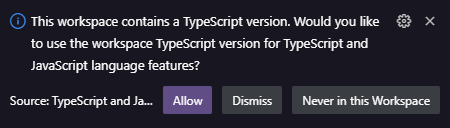
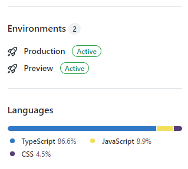
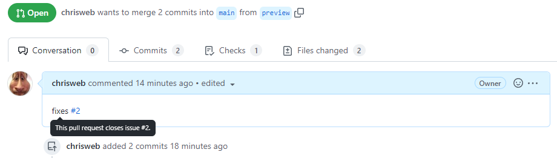
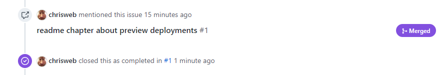
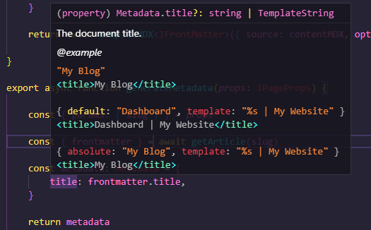
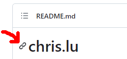
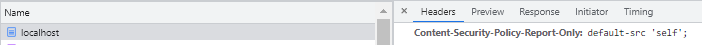
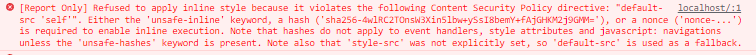
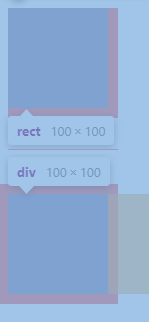

# chris.lu

this series of articles will showcase how to build a blog using [Next.js](https://nextjs.org/) version 13 and up as our rendering framework as well as the [React](https://reactjs.org/) version 18 and up as our frontend framework and focus on using new features like "next.js app directory", "React Server Components", "React Streaming Components", "React Suspense"

both [React](https://reactjs.org/) and [Next.js](https://nextjs.org/) are very popular in the javascript community, based on the latest results from the **state of js survey** that got released in january 2023 and is based on a survey they did at the end of november 2022. This time almost 40k developers from around the world participated and based on their feedback react is in 2022/2023 the most used frontend framework: ["state of js survey results: frontend frameworks"](https://2022.stateofjs.com/en-US/libraries/front-end-frameworks/) and next.js is the most used rendering framework ["state of js survey results: frontend frameworks"](https://2022.stateofjs.com/en-US/libraries/rendering-frameworks/)

## history

### react history

the react team released the [RFC: React Server Components](https://reactjs.org/blog/2020/12/21/data-fetching-with-react-server-components.html) as well as an experimental demo of React Server Components (RSC) in december 2020

the next announcement regarding server components came as part of a blog post announcing the release of [React v18.0](https://reactjs.org/blog/2022/03/29/react-v18.html), the react team mentions that the feature is considered experimental but also that they plan to release the server components in one of the next minor versions of react 18

### next.js history

in may 2022 the next.js team released the [Layouts RFC](https://nextjs.org/blog/layouts-rfc) and sketched out their ideas for server components, but also improved data fetching and things like nested layouts, alongside the RFC posted on their blog they opened a [github discussion regarding the layouts RFC](https://github.com/vercel/next.js/discussions/37136)

Question(s): regarding the new layouts system, the RFC mentioned it would be nice to have a feature that allows to "preserve the state on navigation", did they include this? if so how does it work

Glossary:

* URL Path: Part of the URL that comes after the domain.
* URL Segment: Part of the URL path delimited by slashes

Note: this series of articles will focues on the new `app` directory and server components, I will not go into much into detail describing how to use the "classic" next.js `pages` directory and the "classic" data fetching methods like `getStaticProps`, `getServerSideProps` or even the legacy `getInitialProps`, but I might mention them and compare them to the "new way of doing things" to give you an idea of how we did things until today and how we will now do things starting tomorrow ;) like this little recap that follows

recap of the 1st and 2nd generation of data fetching in next.js:

* first there was `getInitialProps`, with **getInitialProps** the first page would render on the server and so getInitialProps would be called on the server, then if visiting another page using next/link or next/router that page would get build in the client, so any code in getInitialProps would get executed on the client side, this meant that you had to be aware if you were currently on the server and could use server side code to make a direct data fetch call to the database or if you were in the client and hence fetch the data via an ajax call to an API endpoint you would also need to code, besides that it was also important to be careful about how and what packages you were importing as you might use a package when getInitialProps is executed on the server but then that code would also be bundled into the client to be imported too when getInitialProps runs in the client, to avoid that you would need to exclude packages from the client by either using dynamic imports encapsulated into conditions that check if the code is being executed on the server or client or by using plugins that exclude those "server only" packages at build time. read more: [next.js getInitialProps documentation](https://nextjs.org/docs/pages/api-reference/functions/get-initial-props)
* the newer `getServerSideProps` (which first appeared in march 2020 with [Next.js 9.3](https://nextjs.org/blog/next-9-3)) and is an async function that fetches the data and populates the props object of your page function and works differently then getInitialProps, same as with getInitialProps for the first page the code gets executed on the server and the data is being returned directly to the code of the page, but if you visit a second page getInitialProps will again get executed on the server and the data it returns will get sent as JSON to the client where again it gets used by the page code, this means using getServerSideProps instead of getInitialProps eliminated two pain points, first you did not have to care about your imports anymore as next.js would exclude those packages for you from client code automatically and the second one being that you did not have to create an API for client side data fetching anymore as next.js would go and call getServerSideProps on the server and then fetch the data as JSON for you. read more: [next.js getServerSideProps documentation](https://nextjs.org/docs/pages/building-your-application/data-fetching/get-server-side-props)
* `getStaticProps` appeared alongside getServerSideProps, the difference between the two is that getServerSideProps disables ["Automatic Static Optimization"](https://nextjs.org/docs/pages/building-your-application/rendering/automatic-static-optimization) but getStaticProps does not, getStaticProps it is a method that you would use to fetch data not at "runtime" but at "build time", so when a user visits a page no data call is being made, all data got already fetched at build time (and the page props have been put in a static json file), which means for any request being made by a user your data won't change, this can be very interesting to build pages that load super fast as they use data that does not change between two builds, however getStaticProps has a feature so that you can "revalidate" data in the background, this is what gets used by "[Incremental Static Regeneration](https://nextjs.org/docs/pages/building-your-application/data-fetching/incremental-static-regeneration)" and allows you to update the static data you got at build time. read more: [next.js getStaticProps documentation](https://nextjs.org/docs/pages/building-your-application/data-fetching/get-static-props)

in october 2022 the next.js team released [Next.js 13](https://nextjs.org/blog/next-13) which included the first version of the new `app` directory and two months later in december 2022 [Next.js 13.1](https://nextjs.org/blog/next-13-1) which brought a lot of improvements for the new app directory but also for middlewares and next.js memory consumption, then in february 2023 we got [Next.js 13.2](https://nextjs.org/blog/next-13-2) which brought the new Metadata API for built SEO support and MDX support, in april 2023 we got [Next.js 13.3](https://nextjs.org/blog/next-13-3) which brought improvements for SEO tools like the [Metadata Files API](https://nextjs.org/docs/app/api-reference/file-conventions/metadata) and automatically generated OpenGraph Images, in may 203 we got [Next.js 13.4](https://nextjs.org/blog/next-13-4) which was the first version of next.js 13 version in which the **App Router** is considered being **stable** (meaning it has left beta)

add some next js 14 specific info (what is new): <https://dev.to/usulpro/save-time-and-stay-informed-9-must-know-updates-in-nextjs-v14-5fnp>

TODO: rework the react and nextjs history chapters and add another chapter chapter "what's new in xxx" which explicitly lists the new features, for nextjs make a note box to let people know about codemods (if they migrate): https://nextjs.org/docs/pages/building-your-application/upgrading/codemods

## image(s) manipulation

converting images to AVIF and WEBP and thumbnails

<https://www.npmjs.com/package/sharp>

## blog

### create a new repository on github

use github to create a new repository for your project

also let github create a README.md a LICENSE as well as a default .gitignore file for you

Note: if you chose "node" as template for the `.gitignore` it will create a quite large gitignore file that contains patterns for lots of common frameworks used when working with nodejs, one of them being next.js, which means the `.next` directory will get excluded if you use this gitignore, the other rules are less useful in our case but also do no harm, so you don't really need to touch that file, also in case you wonder, yes the .gitignore file should get commited

now you can check out your project locally, typing the following command into favorite command line tool / terminal:

```shell
git clone git@github.com:MY_GITHUB_USERNAME/MY_REPOSITORY_NAME.git
```

### initialize project

Note: install nodejs: the **next.js 13** "app directory features" require nodejs v16.8.0 or later


run the following command to have npm guide you step by step through the creation of your `package.json` file:

```shell
npm init
```

anser the question that get displayed in your command line, when this is done npm will create a `package.json` in the root of your project for you


#### use create next app to create a basic project

TODO: ...

#### next.js npm scripts

add the next.js scripts to the `package.json` file, which is in the root of the project:

```json
{
  "scripts": {
    "dev": "next dev",
    "build": "next build",
    "start": "next start",
    "lint": "npx eslint ./"
  }
}
```

TODO: do I really need to add those manually, I mean create next app should be handling this 

those 4 scripts are the npm commands we will later in this tutorial use to execute different task, like:

`npm run dev`: to start the development server
`npm run build`: to make a production build
`npm run start`: to start the server on a production server using the build we made with the previous command
`npm run lint`: to run a linting script that will scan our code and help us find problems in our code

#### enable the app directory in the next.js configuration file

then we create the next.js configuration `next.config.js` file, in the root of the project:

```js
/** @type {import('next').NextConfig} */
const nextConfig = {
    experimental: {
        appDir: true,
    },
}

module.exports = nextConfig
```

not much in there right now, for the moment we only add one line in the experimental block to enable the app dir which is still experimental (in beta at the time 01.01.2003)

Note: **next.js 13** got released at the end of 2022 and even though it included a lot of improvements for existing features it also now includes the new `app` directory which is what we will use in this toturial, as the next.js team reminds as at several places this feature will evolve and get improved a lot over the coming months, the next.js team added it to **next.js 13** so that developers can start playing with it and to hopefully gather a lot of good feedback from the community but they also made it clear that you probably shouldn't use this in production just yet and wait a little bit longer for it to mature

#### convert the next.js configuration to an ES module

if you prefer to keep using the CommonJS (CJS) style configuration this is fine as long as you don't use any packages that are [ESM only](https://gist.github.com/sindresorhus/a39789f98801d908bbc7ff3ecc99d99c), I personally prefer [ECMAScript modules (ES modules / ESM)](https://nodejs.org/api/esm.html) so I decided to convert my `next.config.js` into a `next.config.mjs`

Note: later in this project we will use an [ESM only](https://gist.github.com/sindresorhus/a39789f98801d908bbc7ff3ecc99d99c) package and at that point is will be mandatory to convert the next.js configuration to an ESM

to do so change the next.config file extension from `.js` to `.mjs` and then change the file content to this:

```js
const nextConfig = () => {

    /** @type {import('next').NextConfig} */
    const nextConfig = {
        experimental: {
            appDir: true,
        },
    }

    return nextConfig

}

export default nextConfig
```

read more:

* next.js configuration documentation: <https://nextjs.org/docs/api-reference/next.config.js/introduction>
* ESM only packages: <https://gist.github.com/sindresorhus/a39789f98801d908bbc7ff3ecc99d99c>

### install first dependencies

install react and next.js

```shell
npm i react@latest react-dom@latest next@latest --save-exact
```

install typescript and types:

```shell
npm i typescript@latest @types/react @types/react-dom @types/node --save-dev --save-exact
```

of course if you prefer to use [pNpM](https://pnpm.io/) or [Yarn](https://yarnpkg.com/) as your package managers to install the dependencies above, feel free to do so they are great tools too, I for my part prefer to use npm so this is what you will see in this tutorial but the install commands of [pNpM install](https://pnpm.io/cli/install) or [yarn install](https://yarnpkg.com/getting-started/usage) are very similar


### our first page

first we create the app directory in the root of our project, by using the following command or by using your IDE:

```shell
mkdir app
```

inside of the `app` directory create a first page called `page.tsx` and put the following content into it:

```tsx
export default function Homepage() {
    return <main>Hello, World!</main>
}
```

Note: you will see in VSCode that the `<main>` element is underlined and shows an error, ignore this for now, it will go away in the next step as soon as next.js has created the typescript configuration file for us

Note: did you notice how our first page is called `page.tsx` but the function itself has as name `Homepage`, if you worked with next.js before you might be used to create files for pages where the file name and the function were both identical and represented the content of that page, this isn't the case anymore, in the app directory every file containing UI code of a page is always called `page.tsx`

TODO: probably here would be a good place to explain the new routing system and how URL segments get matched to files in the new app directory

Note: now we could create two more initial files ourself `head.tsx` and `layout.tsx`, but wait because we can also let next.js do it for us and that's the option I will chose here because I want to see what initial code next.js puts into them

in your command line tool (or a vscode terminal), type this command to start the development server:

```shell
npm run dev
```

when you do this for the first time a lot of things will happen:

* because next.js has detected that `page.tsx` is a typescript file, it will display a message, saying that:

> We detected TypeScript in your project and created a tsconfig.json file for you.

so next.js automatically created a `tsconfig.json` file but also a `next-env.d.ts` for us in the root of our project to configure typescript for us

Note: learn more about next.js typescript support and the two files I just mentioned, check out their ["next.js TypeScript documentation page"](https://nextjs.org/docs/basic-features/typescript)

Note: also good to know is that starting with version 12 next.js typescript compilation is now much faster thx to ["SWC"](https://swc.rs/), which is now the new next.js compiler, for a bit of history and more in depth information check out their ["next.js compiler documentation page"](https://nextjs.org/docs/advanced-features/compiler)

* you will notice that in your terminal a message appeared telling you that:

> info  - VS Code settings.json has been created for Next.js' automatic app types, this file can be added to .gitignore if desired

this vscode "workspace settings" file got created in a directory called `.vscode` and the file is called `settings.js`, it contains workspace specific configuration instructions for your VSCode IDE, as next.js tells you, it is up to you if you add them to .gitignore to ensure they don't get shared with other people using your repository, I usually however share mine, I think it can be helpful if the entire team working on a project uses the same IDE configuration

* because of that new VSCode settings file next.js just created, a notification will appear in your VSCode, saying that it detected that you installed typescript in the current workspace and will ask you if you allow it to use that version instead of it's own typescript version that is bundled into vscode, so we click on "Allow"



this notification is related to a new typescript plugin the next.js team created and which is included in the release of **next.js 13**, here is a little quote from their [next.js 13.1 blog post](https://nextjs.org/blog/next-13-1):

> We've built a new TypeScript plugin that provides suggestions for page and layout configuration options and provides helpful usage hints around Server and Client Components

## customizing the tsconfig.json

### path alias for our components

there is a nice feature in typescript that lets you create aliases for pathes that you often

in tsconfig.json

```json
{
    "compilerOptions": {
        "paths": {
            "@components/*": [
                "./components/*"
            ],
        },
    },
}
```

this allows you to import your components that are located in /PROJECT_ROOT/components using the new alias (no need to know the exact relative path anymore)

```ts
import NavigationLink from '@components/navigation/Link'
```


Read more:

* check out the [youtube video "Next.js 13: Prevent Common Mistakes w/ New TypeScript Plugin"](https://www.youtube.com/watch?v=pqMqn9fKEf8) from [Delba](https://twitter.com/delba_oliveira) which is part of the next.js developer experience team giving more info about what the new plugin is and what it does
* [next.js "using the typeScript plugin" beta documentation](https://beta.nextjs.org/docs/configuring/typescript#using-the-typescript-plugin)

* but this is not all next.js does for us, because now if you visit the your first page by using the URL `http://localhost:3000`, next.js will also create the two files, `head.tsx` and `layout.tsx`, that I mentioned ealier, inside of the `app` directory

the `head.tsx` next.js created for us, looks like this:

```typescript
export default function Head() {
    return (
        <>
            <title></title>
            <meta content="width=device-width, initial-scale=1" name="viewport" />
            <link rel="icon" href="/favicon.ico" />
        </>
    )
}
```

the `layout.tsx` next.js created for us, looks like this:

```typescript
export default function RootLayout({
    children,
}: {
    children: React.ReactNode
}) {
    return (
        <html>
            <head />
            <body>{children}</body>
        </html>
    )
}
```

layout:

with the pages directory in previous next.js version, you had the possibility to wrap the `children` property of your `_app.tsx` with a layout component to then have that layout being applied to every page, but the disadvantage was that it would then be used by every single page in your pages directory, all other solutions involved writing more code, for example by adding custom code inside of your _app.tsx that would check which route you were on and based on that switch to another layout, or you could have imported different layouts in every page file and wrap you page into those layout components

with the new layout system it is much easier to have different layouts for different segments of your website

layouts will apply to the segment they are in and all segments nested below that, which brings us to another feature which is that now it is possible to have a cascade of layouts where one layout from a child segment is encapsulated into the layout of the parent segment


Server Components and Client Components:

TODO: need to segment this main chapter into smaller sub chapters

all files inside app directory are by default "React Server Components" and hence will be rendered on the server

but you can also have files in the app directory that are client components

which finally means you can have both server and client components in a component tree

Note: for more info and good diagrams that help you understand how client and server components can be mixed can be found in the [next.js (beta) documentation "Rendering Fundamentals"](https://beta.nextjs.org/docs/rendering/fundamentals)

TODO: show an example with a console log, show that the console log appears in the terminal but not in the console logs of your browser developer tools

so may wonder but when do I need to define a client component as being a client component? well there are several things that when added to a component will have next.js tell you that those can't be used in client components, like when using reacts local state, or react context or a clickHandler on a button

hmmm weird this page <https://beta.nextjs.org/docs/rendering/server-and-client-components#convention> contradicts the previous statement, as it says only hooks in the code will force you to mark a component as client component:

> You only need to mark components as 'use client' when they use client hooks such as useState or useEffect. It's best to leave components that do not depend on client hooks without the directive so that they can automatically be rendered as a Server Component when they aren't imported by another Client Component. This helps ensure the smallest amount of client-side JavaScript.

TODO: do an example of a component that is a server component, then add for example an onClick handler and demonstrate the next.js message that says that you need to turn the component into a client component, is it really only hooks that trigger this message and things like onClick are listed in this table <https://beta.nextjs.org/docs/rendering/server-and-client-components#when-to-use-server-vs-client-components> to explain that an onclick would never get "clicked" on the server by a user???

Question(s): if my component is not in the app directory and has no statement "use client", but I import it inside of a Server Component, do I still get the error that server components can not use XY?

TODO: show example of question above, where the component is in components directory and being imported inside of server component, but there is no error, because as it is not in the app directory it is not getting treated as server component but a client component

as I mentioned above you can mix server and client components, for example if you explicitly state that component is a client component but then inside of it use a server component or vice versa

so a component with no statement, a component located into a segment directory if loaded by a client component will also be considered being a client component without having to explicitly add the 'use client' statement on top

TODO: show example of server component, show it printing a message in the terminal, then re-use it but his time being imported into a client component and it just works (no need to add 'use client' statement) and show that now the message appears in the browser console and not the server anymore

Question(s): how to add a server component into a client component (if next.js then thinks it also a client component), is there a 'use server' statement?

Note: to learn more about the advantages of server components, check out the [next.js documentation "Why Server Components?"](https://beta.nextjs.org/docs/rendering/server-and-client-components#why-server-components)

server components can NOT get IMPORTED into client components, you ALWAYS need to pass them as children prop from within a server component down to the client component that will use it: <https://beta.nextjs.org/docs/rendering/server-and-client-components#importing-server-components-into-client-components>

TODO: to answer the question above, show example code of passing a server component via the children prop into a client component (that client component needs to be inside of a server component)

Is next.js 13 Isomorphic and do I even want it to be Isomorphic:

Note: to be honest I find all this quite complex, I don't like having to remember all the time that I need to do something in a specific way for it to work based on the environment where I'm, this adds complexity when creating components and also forces me to do some refactoring when I convert a component from a server component to a client component or vice versa and suddenly I need to remove the async await I could previously use, I like to be able to always do the same thing and be sure I will get the best result, I don't want to also have to wonder if my component is a server component inside a client component then I will fetch data so I need to pass it via children to client side components

to me this is not "Isomorphic" at all, I personally expect from a modern framework to be Isomorphic, you should be able to reuse most of your code on server side as well as the client side and only have a few files that function as adapters and do something different based on the environment, like having a getData function for both on the server and the client side, but inside getData you check the environemnt and based on the result you either do a browser fetch request using an API URL if you are in the client or if you are on the server you use the database adapter to make a direct database query without passing through an API, same would get done for caching, for example you would be able to cache data queries with a unique function that you can use the same way on the server side as well as the client, the cache function would use an adapter that caches data for example using the localstorage if you are in the client and if on server another adapter that caches or retrieves the data from for example a redis database

can we solve this headache by using the new next.js fetch? if so, this would mean we need an API! I don't mind needing an API, we would need one anyway for POST, PUT, PATCH and DELETE methods that client side code would call to execute actions, what is also nice is that the features like being able to use the `loading.tsx` file in your segment directory is not lost and still gets used when making a server side fetch, but finally all this all means that we never make any component function async and also not use await inside of it, but instead always use the new react `use` hook, only if we do all of this then we come very close to a real Isomorphic experience where we don't need to think about the question is this a component I can import or a component I need to pass via the `children` prop

the problem with fetching data in the client, is that after fetching the data from API, it is the client which needs to do the rendering job to produce the final html, so we lose the SSR benefit where the client gets the html pre-rendered and just needs to hydrate it, next.js in their documentation explicitly mentions that fetching in the client should get avoided: <https://beta.nextjs.org/docs/rendering/server-and-client-components#data-fetching>, you can compare this to have someone deliver to you you all the ingredients to cook your meal but you still need to do the cooking vs having someone deliver to you a pre-cooked meal that you just need to heat before you can eat it

so unfortunatly to not lose the SSR benefit, if we are in a situation where a client component makes use of a server component, then we have to pass it to the client component via the `children`

having to pass components via children however reminds me a lot to ugly and code intensive **props drilling** problem we had before react introduced react context

TODO: It might be better to put all this into a separate blog post, outside of the scope of this tutorial and then link to it

Question(s): what would be nice is that if the framework when encountering a server component inside a client component, would not consider it a client component but instead pre-render it automatically on the server for you and send the html to the client component to then get hydrated

Question(s): can streaming fix some of these problems? make it easier for the devs?

next problem, apparently you can't just pass any props from a server to a client component, they need to be serializable: <https://beta.nextjs.org/docs/rendering/server-and-client-components#passing-props-from-server-to-client-components-serialization>, which means that a function for example can't be passed from a server component to a client component

because some components can be used ONLY on the server or ONLY in the client, next.js added two new optional packages you need to import into your component: <https://beta.nextjs.org/docs/rendering/server-and-client-components#keeping-server-only-code-out-of-client-components-poisoning>

Question(s): what happens if you put a useState hook into a page.tsx or layout.tsx? next.js recommends to seperate such code and externalize it into client components: <https://beta.nextjs.org/docs/rendering/server-and-client-components#moving-client-components-to-the-leaves>

third party packages that use client only hooks, can't be used in server components as is, you need to wrap them into a client component and re-export them before using them in your server component: <https://beta.nextjs.org/docs/rendering/server-and-client-components#third-party-packages>

similar problem with context, context can not be used as is in server components, so you need to put the provider into a client component that has the 'use client' statement and then you can use that component inside of your server component: <https://beta.nextjs.org/docs/rendering/server-and-client-components#using-context-in-client-components>

and also same problem for third party providers: <https://beta.nextjs.org/docs/rendering/server-and-client-components#rendering-third-party-context-providers-in-server-components>

for sharing data between multiple server components you need to use a pattern like **singletons** to make it work: <https://beta.nextjs.org/docs/rendering/server-and-client-components#sharing-data-between-server-components>

TODO: for this a good example is the database file we already share between files in the api routes

TODO: explain why the package **server only** can be useful <https://beta.nextjs.org/docs/rendering/server-and-client-components#keeping-server-only-code-out-of-client-components-poisoning>

TODO: optimization, explain it is important to only have client components in the leaves, the more server components the more pre-rendering will happen, the faster the page will load <https://beta.nextjs.org/docs/rendering/server-and-client-components#moving-client-components-to-the-leaves>

TODO: explain that a common problem due to the new **'use client'** directive, is that lots of npm packages don't have it, the solution is to encapsulate those third party tools into a wrapper component of your own that has the **'use client'** directive and which imports and re-exports the third party component <https://beta.nextjs.org/docs/rendering/server-and-client-components#third-party-packages>


data fetching:

you can fetch data directly inside of your "Server Component" function, so now there is NO need to use an extra async function like getServerSideProps or getStaticProps anymore (also there is no need to try to use them, they are not supported in the app directory anymore, in the pages directory on the other hand nothing changed in that regard)

a big novelty for server components versus client components, is that in server components you can use await, this means you declare that the function is async and then use await inside of it, so now we can do "await getSomeData()" inside components, compared to previously where we would have created a seperate function to fetch data and put that data into local react state of our component

TODO: show example of async component function with an await, that calls an /library/fetch file which returns some dummy json data

in clients you still can't use async / await but in client components there is another novelty which is called the "use" hook, this hook is still very experimental and the [proposed RFC](https://github.com/acdlite/rfcs/blob/first-class-promises/text/0000-first-class-support-for-promises.md) has not even be merged into the official RFCs repository yet

Note: more info about the new react hook "use()" can be found in the [next.js "use in Client Components" documentation page](https://beta.nextjs.org/docs/data-fetching/fetching#use-in-client-components) or the [proposed RFC](https://github.com/acdlite/rfcs/blob/first-class-promises/text/0000-first-class-support-for-promises.md) (careful these informations can change as any moment and some of it might not be true anymore in a few weeks, I will update this part as the situation evolves)

```typescript
import { use } from 'react'
```

from the next.js documentation:

> When a route is loaded, the Next.js and React runtime will be loaded, which is cacheable and predictable in size. This runtime does not increase in size as your application grows. Further, the runtime is asynchronously loaded, enabling your HTML from the server to be progressively enhanced on the client

Question(s): what exactly is the runtime? how is it loaded asynchronously? Isn't it bundled like everything else?

so sharing data between server components, as mentioned in the previous chapter, can't be done via context, so the previous chapter recommended using a pattern for example like the **singleton** pattern, but an alternative when fetching data is to use fetch, if we do the same fetch in several server components next.js will cache the result and only a single query will be made: <https://beta.nextjs.org/docs/rendering/server-and-client-components#sharing-fetch-requests-between-server-components>, there are more details about this caching on this page: <https://beta.nextjs.org/docs/data-fetching/fundamentals#automatic-fetch-request-deduping> which says that the caching technique being used is called **deduping** and it is mentioned that this works on both the server and in the client, on the server the fetch result is cached until the request is done and on the client it is cached until the page is reloaded, which means on the client if using navigate and then fetching again will use the data from cache and not trigger a new API request


rendering:

there are two environments where your application code can be rendered, the client and the server, you can choose the rendering environment at the component level, a server component is rendered on the server and a client component in the client

read more: [BETA Next.js documentation: Rendering Fundamentals](https://beta.nextjs.org/docs/rendering/fundamentals)

similar to what we were achieving getServerSideProps and getStaticProps, with **next.js 13's** app directory, you have two main options, **dynamic rendering** and optimized **static rendering**

Note: next.js will try to make static rendering happen as much as possible, for example by default fetch requests will be cached (TODO: need to verify this, if using a fetch and not opt out of caching, will the page be static, meaning the fetch is done at build time???) (more about this in the TODO: link to **caching** chapter), but similar exceptions to what we have in the pages directory, there are things that will force next.js out of static rendering, one of these is if you use the hook **useSearchParams** (more about this in the TODO: link to **searchParams** chapter)

weird, the [rendering](https://beta.nextjs.org/docs/rendering/fundamentals#dynamic-rendering) doc says:

> With Dynamic Rendering, both Server and Client Components are rendered on the server at request time.

Question(s): I don't get it, why it says client side components are rendered on the server

with dynamic rendering client components are prerendered on the server: <https://beta.nextjs.org/docs/rendering/static-and-dynamic-rendering>

Question(s): what is "prerendering", how does it differ from "rendering", how is it better than no prerendering at all

TODO: can we analyze what is in next.js bundle files sent to the client, can we look at what a prerendered component looks like in terms of code, is for example the jsx already turned into html?... this next.js page <https://nextjs.org/learn/basics/data-fetching/pre-rendering> is for nextjs pages, but it explains what nextjs means by "prerendering" and it also explains how to check if prerendering happen, so this is worth reading before making an example that shows and explaisn prerendering


TODO:

check out these articles to better explain rendering especially SSR pre-rendering

<https://nextjs.org/learn/foundations/how-nextjs-works/rendering>
<https://nextjs.org/learn/basics/data-fetching/two-forms>
<https://nextjs.org/learn/basics/data-fetching/pre-rendering>
<https://nextjs.org/docs/basic-features/pages#pre-rendering>


routes:

you can create static route segments, like /users but same as with pages you can also create dynamic routes like [id], to get the dynamic value you use the "params" prop

Question(s): do ["catch all"](https://nextjs.org/docs/routing/dynamic-routes#catch-all-routes) routes (that have 3 dots: [...id]) and ["optional catch all"](https://nextjs.org/docs/routing/dynamic-routes#optional-catch-all-routes) routes (that have 2 square brackets [[...id]]) still work in the app directory???

next.js created a layout file for us in the root segment, but if inside of that segment we add a new segment /posts/[id] then this page will use the same layout, the best here is that all data that is being fetched in the layout is not getting refetched when you **navigate** from one to another

TODO: show an example with just "a href" links, which reload the entire page and then an example which uses next/link, explain that when I say **"navigate"** I mean by using **next/link** and NOT a conventinal **html anchor element**, show clearly that the data query in the layout is not being executed twice, just the main content (children of layout) are being updated

TODO: add an extra sub-chapter to explain how **statically typed links** work: <https://nextjs.org/blog/next-13-2#statically-typed-links>


loading:

Note: next.js loading uses a react suspense boundary under the hood, meaning that loading.tsx is a suspense boundary wrapped around your page.tsx

you can now create new loading files and these files have an error prop that contains details about the error

Question(s): are loading scripts also getting used by nested segments, like with layouts or do you need a loading script in each segment?

TODO: create a small demo by creating a loading file and adding a setTimeout to our library/fetch that returns the dummy json

read more:

* [next.js loading UI documentation](https://beta.nextjs.org/docs/routing/loading-ui)
* [next.js loading.js documentation](https://beta.nextjs.org/docs/api-reference/file-conventions/loading)
* [react beta docs suspense documentation](https://beta.reactjs.org/reference/react/Suspense)


error:

Note: similar to loading.tsx which use react suspense boundaries under the hood, the error.tsx file uses react error boundaries under the hood

similar as loading, you can create error files

Question(s): error files can only be client components???

TODO: also check out how error bounderies work: 

read more: 

* [next.js error file convention documentation](https://beta.nextjs.org/docs/api-reference/file-conventions/error)
* [next.js error handling documentation](https://beta.nextjs.org/docs/routing/error-handling)
* [react error boundery documentation](https://reactjs.org/docs/error-boundaries.html)
* [react beta docs catching rendering error with an error boundary documentation](https://beta.reactjs.org/reference/react/Component#catching-rendering-errors-with-an-error-boundary)


put your components into a seperate `components` directory or alongside the page files inside of the route segment directory:

prior to next.js 13's release or if you worked previously with create react app and did not use next.js at all, like me you might be used to put all components into a directory called `components`

Note: putting a compenentX.tsx file into the `pages` directory would not be wise as next.js will consider every .tsx file to be a page

if you use the new next.js 13 however, you can now put all your components into segment directories, this means you can put all your UI components and even your test files into the same directory as your page.tsx, only the page.tsx file will be handled as page by next.js and every other file except those that have reserved names like loading.tsx or error.tsx will be considered being components

so is a seperate components directory still needed and advisable or should you now get rid of the components directory and put all components into segment directories along with your page files?

you could also do both, put some components that are being used by only one page into the pages segment directory and all other components that are being used by more than one page into the components directory

it is as you prefer, for the moment as next.js is very new there is not yet really a trend which shows us which solution is the most popular

I for my part prefer a seperate components directory that acts as a library for all my components, for several reasons:

* because some components will be used by more than one page, so putting them into a segment directory alongside a page but getting imported by another page in another directory seems weird to me
* you could argue that doing both, putting the components used by a page alongside the page into the same directory and all other components that are being used by more than just one page into a components directory, but the disadvantage I see here is that often you will create a component and at first it will be used by one page so you will put it alongside the page but then later on you discover that another page will benefit from using it too and then you need to move it and refactor the import pathes, this is something I want to avoid
* TODO: not sure about this? -> all components that are in the app directory are considered being server components by default, so does that mean all components that are not in the app directory are considered being client components by default, meaning you don't have to explicitly add the 'use client' statement on top of each file? the other way around, if you have a component outside of the app directory and you want it to be a server component, how do you communicate that to next.js 13???
* all files in the components directory will have react only code and no have any next.js specific code
* it will hopefully be easier in the future to re-use or share the components


caching:

TODO: <https://beta.nextjs.org/docs/data-fetching/fundamentals#caching-data>

this page <https://beta.nextjs.org/docs/routing/fundamentals#server-centric-routing-with-client-side-navigation> mentions:

> Additionally, as users navigate around the app, the router will store the result of the React Server Component payload in an in-memory client-side cache. The cache is split by route segments which allows invalidation at any level and ensures consistency across concurrent renders. This means that for certain cases, the cache of a previously fetched segment can be re-used, further improving performance.

read more: <https://beta.nextjs.org/docs/data-fetching/caching>

// Generates statically like getStaticProps.
fetch(URL, { cache: 'force-cache' });

// Generates server-side upon every request like getServerSideProps.
fetch(URL, { cache: 'no-store' });

// Generates statically but revalidates every 20 seconds
fetch(URL, { next: { revalidate: 20 } });

Note: if you use fetch with no options, the default value for cache will be force-cache(?) TODO: need to confirm that

TODO: need to verify this, if using a fetch and not opt out of caching, will the page be static, meaning the fetch is done at build time???, need to test this with some examples using a version deployed to vercel, to use a real prod build for testing / verification

TODO: check out the next.js 13.2 improvements: <https://nextjs.org/blog/next-13-2#nextjs-cache>


revalidating:

<https://beta.nextjs.org/docs/data-fetching/revalidating>


streaming:

from the ["next.js 13 blog post"](https://nextjs.org/blog/next-13):

> the app/ directory introduces the ability to progressively render and incrementally stream rendered units of the UI to the client

I let you check out the [next.js "what is Streaming?" documentation section](https://beta.nextjs.org/docs/data-fetching/streaming-and-suspense) it is very informative about what limitations SSR has and why streaming is good solution


TODO: Web fetch() API ???
https://beta.nextjs.org/docs/data-fetching/fundamentals, also interesting the new server actions: https://nextjs.org/docs/app/building-your-application/data-fetching/forms-and-mutations
TODO: client components
TODO: list all reserved next.js file names:
layout.tsx
page.tsx
loading.tsx
error.tsx
template.tsx (similar to layouts, but the difference is that on navigation a new instance is being created)
head.tsx
not-found.tsx
are there more?

TODO: increase dev server speed with turbopack, add the option `--turbo` to `next dev` in the package json scripts
https://nextjs.org/docs/advanced-features/turbopack
Question(s): is turbo also used for build command? I mean prod build, same as for dev?


add authentification using next-auth
the session provider that was previously in _app now goes into the root layout
the login button component which has a clickHandler must have a "use client" statement if it is located inside of the app dirctory or get moved to the components directory

use jest to write some tests
jest seems to have the biggest user base right now if you look at the ["state of js 2022 survey results"](https://2022.stateofjs.com/en-US/libraries/testing/)


### optimizing images with next/image

images go into the public directory, but `public` is not part of the src path, only what comes after

so an image called `foo.jpg` located in `/public/images/` would have an src like this: `/images/foo.jpg`

Note: if you used next/image prior to **next.js 13** you might want to check out the migration guide as there are some major changes as to how some options work: <https://nextjs.org/docs/messages/next-image-upgrade-to-13>

for the layout header, we will add a fallback image for the canvas element, the goal is to use the [css property object fit](https://developer.mozilla.org/en-US/docs/Web/CSS/object-fit) to make it as large as the canvas container:

```ts
<Image
    src="/assets/images/neonroad/fallback-min.png"
    alt="Chris.lu header image, displaying an 80s style landscape and sunset"
    fill
    style={{objectFit:'cover'}}
    sizes="100vw"
    priority
    quality={80}
/>
```

if now open the page in your browser and inspect the html you will see that next.js add a lot of different srcset attributes to the img tag

Note: when you start your server with `npm run dev`, next.js will automatically create files with different dimensions of your image and store them into the directory `\.next\cache\images`

our original image is a PNG image, so it's quite heavy, because modern browser support formats like [AVIF](https://developer.mozilla.org/docs/Web/Media/Formats/Image_types#avif_image) or [WebP](https://developer.mozilla.org/docs/Web/Media/Formats/Image_types#webp_image) we want next.js to convert our original file into these formats and depending on what format the browser supports we want next.js to either ship .avif files to the user (best compression / smallest size) or else ship .webp files (good compression / smaller size) and only if none of those two is formats is supported it should ship .png files (worst compression / bigger size)

to add support for webp and avif we need to add the following code to our next.config.js:

```js
const nextConfig = () => {

    /** @type {import('next').NextConfig} */
    const nextConfig = {
        experimental: {
            // experimental support for next.js > 13 app directory
            appDir: true,
        },
        // file formats for next/image
        images: {
            formats: ['image/avif', 'image/webp']
        },
    }

    return nextConfig

}

export default nextConfig
```

no need to change any code of the `<Image>` component we added previously, next.js will handle the conversion to the different formats automatically now that we have added them to the configuration file and will store the different versions into `\.next\cache\images`

Note: next/image uses sharp <https://www.npmjs.com/package/sharp> to convert images to other formats

Note: when using next/image for the first time, check out the browser dev tools console, next.js might give you tips about how to improve the usage you make of it, for example if your image is on top of the page but you have not set the attribute ["priority"](https://beta.nextjs.org/docs/api-reference/components/image#priority) then next.js will tell you to do so:

> Image with src "/assets/images/neonroad/fallback-min.png" was detected as the Largest Contentful Paint (LCP). Please add the "priority" property if this image is above the fold.

read more:

* next.js next/image documentation: <https://beta.nextjs.org/docs/api-reference/components/image>
* use avif in next.js: <https://avif.io/blog/tutorials/nextjs/>

### optimizing fonts with next/font

next.js 13.2 has some next/font improvements: <https://nextjs.org/blog/next-13-2#other-improvements>

read more:

[next.js next/font beta documentation](https://beta.nextjs.org/docs/optimizing/fonts)

### state management

here are the libraries I consider using:

jotai: <https://github.com/pmndrs/jotai>
zustand: <https://github.com/pmndrs/zustand>
recoil: <https://github.com/facebookexperimental/Recoil>

here is a comparison of the 3: <https://npmtrends.com/jotai-vs-recoil-vs-zustand>

### setting up vercel account

vercel website: <https://vercel.com/>
vercel is free for personal prjects, like your blog: <https://vercel.com/pricing>

first one your dashboard: <https://vercel.com/dashboard>, if haven't connected your git account (github, gitlab, ...) do that first

click on "Add new project", then select your git account

now for the repositories you can chose to enable vercel on all of them or just a selection (I chose to select which ones I want to use with vercel as I have a bunch of accounts which are either forks, own packages or just experiments I created)

then click on "Install"

on the next page, click the "import" button next to the project you want to set up

Note: if like me in this project, you use next.js, vercel will set up your project using default values for projects using next.js with will reduce the time you spend on configuring the next step

now you must configure the project, you will notice that most values have default values but feel free to edit them if you need to

when I look at the "Build and Output Settings" section, I see vercel says they will use "npm install" by default to install the projects dependencies, I'm a bit surprised that they don't use `npm ci` [(npm ci documentation)](https://docs.npmjs.com/cli/commands/npm-ci)

TODO: for now I did not change the install command to `npm ci`, I let the default value, I will do a deployment and see if I can see in the logs which command is really being used

one section we will need to make some changes at some point is the [environment variables section](https://vercel.com/docs/concepts/projects/environment-variables), but for now we have no environment variables, so we skip it for now

finally click on "Deploy"

wait for the deployment to finish

if the deployment was successfull it will show you a preview image of the homepage, click on that image to visit your deployment

### introduction to planetscale

planetscale is a MySQL database platform for serverless apps

it's databases are powered by [Vitess](https://github.com/vitessio/vitess) a MySQL cloud database that is today opensource and got developped by youtube in 2011 for their own needs and is being used there since then

they offer a generous free tier for hobbyists and two paid plans for enterprise use


### setting up planetscale account

planetscale website: <https://planetscale.com/>
planetscale is free for "hobby" projects, like your personal blog: <https://planetscale.com/pricing>

go to your planetscale account and create your first database

enter a name and chose a default region for your first database (idially a location close to your own location)

now on top you will see a button that reads "initializing" with a loading spinner, wait for it to finish

Note: we don't define a schema just yet, we will come to that in a bit

## connecting planetscale to vercel

after you have created a plantscale account and set up the database for your project head back to your [vercel dashboard](https://vercel.com/dashboard)

Note: [vercel integrations](https://vercel.com/docs/integrations) let you connect third party tools to your vercel account

in the top navigation bar click on the **settings** tab and then in the left navighation click on **integrations**, ot in this case as we know what we want to add we can also directly visit the plantscale integration page: <https://vercel.com/integrations/planetscale>

now in the top right of the page click on the button "Add integration"

select the vercel account you want to connect planetscale to and then click on "continue"

on the next step, select "Specific Projects" and chose the project you want to connect planetscale to

next click on "Add Integration"

on the next step, on the "Vercel" side is a field named "Framework" with 3 options, "General" "Nodejs" and "Prisma", which have an impact on what environment variables will be created for you in the vercel environment variables interface

Note: when using planetscale in combination with vercel, you add planetscale as an "integration" in your vercel account and then you don't need to set up the env variables by yourself, vercel will automatically get them from planetscale for you

we are not going to use Prisma as ORM for now, so as framework we chose "Nodejs", we are actually going to use the planetscale javascript database driver to connect to our database which supports ["database URLs"](https://github.com/planetscale/database-js#database-url) which is what vercel is going to set up as environment variable for us when chosing "Nodejs" as framework, you could also use "General", the only difference is that instead of one environment variable containing everything it will setup multiple variables (username, password, host), you can chose that option if you prefer, I for my part prefer to have all in one database URL

Note: personally I think any ORM is overkill for small projects, they add overhead to queries and there is a lot to learn before you know exactly how to make good use of it, this is why I like to start with a basic mysql client and regular mysql queries before going over to using something more complex but if you prefer to go straight to using Prisma, fell free to do so

Note: the plantscale repository on github: <https://github.com/planetscale/database-js>

now click on the button "Connect database", you will see a message successfully connected and then "installation process" will start, don't close the window but instead wait for the installation to finish (the window will close itself when the installation is done)

read more:

* integrate plantscale with vercel (by vercel): <https://vercel.com/integrations/planetscale>
* integrate plantscale with vercel (by plantscale): <https://planetscale.com/docs/tutorials/deploy-to-vercel>

## creating a database using the planetscale interface

Note: you can import an existing database, if you wish to do so follow the [planetscale database imports guide](https://planetscale.com/docs/imports/database-imports), but as we are working on the new project we will use the planetscale web interface to create a new database and tables

go to your planetscale account and then click on "Console" in the top navigation bar

Note: we earlier created a database, for that database planetscale has created a "default" branch called **main**, this branch should be selected by default in the console

next click on **connect**

<https://app.planetscale.com/chrisweb/chris-lu/console>
<https://planetscale.com/docs/onboarding/create-a-database>
<https://github.com/planetscale/docs/blob/main/docs/onboarding/create-a-database.md>
<https://planetscale.com/docs/tutorials/planetscale-quick-start-guide#getting-started-%E2%80%94-planetscale-cli>

## vercel preview (staging environment)

if you have a repository with a **main** and do a commit vercel will do a new deployment of your production environment

some people like to live dangerously:


it is useful to have **preview** deployments, so that you can check out changes you made before pushing those into production

to have vercel create **preview** deployments we create a new branch in our repository and call it **preview**, then we switch to that branch in VSCode

now every change we do, we commit it into our **preview** branch, this will trigger a **preview** deployment by vercel

open your repository on github and now on the right side you should see a section environments, you now have two environments listed here, **production** and **preview**



click on **preview** to go to the deployments history page, there you can click on **View deployment** and then you can test the deployment

## github: pull request from preview into main branch (automatically link / close tickets)

if everything is ok, you need to merge the changes from your **preview** branch into the **main** branch, or even better do a [PR (pull request)](https://docs.github.com/en/pull-requests/collaborating-with-pull-requests/proposing-changes-to-your-work-with-pull-requests/creating-a-pull-request)

go to your repository on github, if you are on the **main** branch switch to the **preview** branch

if you did a commit not long ago github will automatically show a message on top "preview had recent pushes", if that the case click on **Compare and pull request**, if the latest commits are a bit older you will have a button **Pull request** on the top right side of your branch files list, click it to go to the PR page

github creates a PR brings you to the PR page

first add a good title to describe what is in the PR

then you can add an optional description

Note: to [automatically link your PRs to one or more tickets](https://docs.github.com/en/issues/tracking-your-work-with-issues/linking-a-pull-request-to-an-issue), edit the PR description, type hashtag and then select your ticket from the list or manually type #TICKET_NUMBER

Note: if you want the linked ticket to get automatically **closed** by the PR, put a word like **closes** or **fixes** (for a full list of keywords check out the [github "ticket linking" documentation page](https://docs.github.com/en/issues/tracking-your-work-with-issues/linking-a-pull-request-to-an-issue#linking-a-pull-request-to-an-issue-using-a-keyword)) in front of the #TICKET_NUMBER in your PR description, so for example `fixes #1`, then after doing the PR the ticket will get automatically set to **closed** by github



if you are part of a team and want to have other people check out your PR, you also assign one or more reviewers on the right side of the PR page

when your PR is ready to get merged into the **main** branch, click the button **Merge pull request** on the bottom of the page

Note: after the PR is done, if you listed your ticket(s) in the description of the PR, then on the page of your ticket you will see that it automatically got linked to your PR and if you used one of the keywords that automatically closes the ticket then you will notice that it also got closed



now that the PR into the **main** branch is done, vercel will do a new production deployment for you

## articles (pages) using MDX (@next/mdx)

As a developer using markdown to format content makes sense, as most of are probably used to using it when formatting our project readmes, or when writing comments or documentation, this is why I chose to use mdx for my nextjs blog project

Most things worked as intended and I was able to quickly set up a working prototype, but there are some [open MDX tickets in the nextjs issues list on github](https://github.com/vercel/next.js/issues?q=is%3Aissue+is%3Aopen+label%3A%22area%3A+MDX%22), I recommend checking them out briefly to have an idea of what might not work or just have a look at the list when you have the feeling something is not working as it should

### what is MDX (behind the scenes)

[markdown](https://en.wikipedia.org/wiki/Markdown) is a markup language that can be used to format raw text, it was developed in 2004 by John Gruber in collaboration with Aaron Swartz, [MDX](https://mdxjs.com/) is an extension of **markdown**, MDX means [markdown](https://daringfireball.net/projects/markdown/syntax) + [JSX](https://react.dev/learn/writing-markup-with-jsx)

MDX supports all markdown formatting elements that are also supported markdown and even more formatting elements are available if you use plugins that add new elements like for example [GFM (github flavored markdown)](https://github.github.com/gfm/) plugins

The big difference between **markdown** and **MDX**, is that **MDX** allows you to use [JSX](https://react.dev/learn/writing-markup-with-jsx) in your **markdown** content, meaning you can import and add JSX components (in our case React components) in your MDX content, for example add a react component that is a comment section at the end of each article, or create a 3D animation using react three fiber and insert that react component in one of your articles, ...

Note: when I mention MDX in the following pages, I'm referring to MDX 3 the current version of MDX, the latest major release is MDX3 (october 24 2023), the [MDX v3 release blog post](https://mdxjs.com/blog/v3/) contains an overview of the few breaking changes and improvements, you can check the full [MDX 3.0.0 changelog](https://github.com/mdx-js/mdx/releases/tag/3.0.0) on the github releases page and if you are migrating from the previous version you may want to have a look at the [MDX v2 to v3 migration guide](https://mdxjs.com/migrating/v3/)

All transformations happen thanks to utilities built on top of [unified](https://unifiedjs.com/), it is the core project used to transforms content with ASTs, the [unified github repository](https://github.com/unifiedjs/unified) gives us the following description:

> unified is an interface for parsing, inspecting, transforming, and serializing content through syntax trees

The specifications are all managed by the [syntax-tree organisation on github](https://github.com/syntax-tree) which is part of the **unified** collective, this is the home for several **syntax tree** specifications, the base syntax tree is called [unist](https://github.com/syntax-tree/unist), **unist** is a universal syntax tree specification, it is part of the family of syntax trees called **Abstract Syntax Trees**s hence the abreviation **AST**s, on top of unist you have the other syntax trees that we are interested in, the first one is called [MDAST](https://github.com/syntax-tree/mdast) this is the specification that represents markdown in a syntax tree and the second one is called [HAST](https://github.com/syntax-tree/hast) which is the specification that represents HTML in a syntax tree, but because we use MDX and not pure markdown, the two systax trees **MDAST** and **HAST** have supersets, the superset of **MDAST** is called [MDXAST](https://github.com/mdx-js/specification#mdxast) and the superset of **HAST** is called [MDXHAST](https://github.com/mdx-js/specification#mdxhast)

**MDAST** and **HAST** are the syntax tree specifications, but the actual tools are [remnark](https://github.com/remarkjs/remark) which is a tool that transforms markdown with plugins and [rehype](https://github.com/rehypejs/rehype) which is a tool that transforms HTML with plugins

MDX supports both **remark** and **rehype** plugins, more about plugins in the ["using plugins to extend MDX" chapter](#using-plugins-to-extend-mdx)

Note: if you want to experiment with MDX content there is a great tool called [MDX playground](https://mdxjs.com/playground/), you can experiment with MDX content and it will help you visualize how MDX content gets transformed from MDAST (markdown AST) to HAST (HTML AST) to ESAST (javascript / JSX)

read more:

* [markdown website by its author John Gruber (aka daringfireball)](https://daringfireball.net/projects/markdown/syntax)
* [MDX website](https://mdxjs.com/)
* [markdown wikipedia page](https://en.wikipedia.org/wiki/Markdown)
* [react.dev "Writing Markup with JSX" documentation](https://react.dev/learn/writing-markup-with-jsx)
* [GFM (GitHub Flavored Markdown) specification](https://github.github.com/gfm/)
* [unified (js) website](https://unifiedjs.com/)
* [unified github repository](https://github.com/unifiedjs/unified)
* [syntax-tree organisation on github](https://github.com/syntax-tree)
* [unist specification github repository](https://github.com/syntax-tree/unist)
* [MDAST specification github repository](https://github.com/syntax-tree/mdast)
* [HAST specification github repository](https://github.com/syntax-tree/hast)
* [MDX specification (mdx-js) github repository](https://github.com/mdx-js/specification)
* [MDXAST chapter in the mdx-js specification](https://github.com/mdx-js/specification#mdxast)
* [MDXHAST chapter in the mdx-js specification](https://github.com/mdx-js/specification#mdxhast)
* [remnark github repository](https://github.com/remarkjs/remark)
* [rehype github repository](https://github.com/rehypejs/rehype)
* [MDX playground](https://mdxjs.com/playground/)

### MDX packages

Note: I think that every time you have to decide what framework you will use for your next project or what package to use to solve a problem or build a new feature, it is important that you take some time and do several prototypes using the different options you have, after that it will be much easier to decide which one suits your use case best and this is what we are about to do here, we will experiment with 3 ways of rendering MDX content and after that it will be easier to chose which one suits our use case best

In my examples I will focus on showing you how to handle MDX content in next.js but other frameworks have their own MDX integrations

There are a lot of different MDX packages available for next.js, no matter if you use [@next/mdx](https://www.npmjs.com/package/@next/mdx), [next-mdx-remote](https://www.npmjs.com/package/next-mdx-remote) or [contentlayer](https://www.npmjs.com/package/contentlayer) by using the next.js specific package called [next-contentlayer](https://www.npmjs.com/package/next-contentlayer), they all have in common that they are based on [@mdx-js/mdx](https://www.npmjs.com/package/@mdx-js/mdx)

Other frameworks have MDX packages too, for example Astro has [@astrojs/mdx](https://github.com/withastro/astro/tree/main/packages/integrations/mdx/) and Remix devs often use [mdx-bundler](https://www.npmjs.com/package/mdx-bundler) and Gatsby has [gatsby-plugin-mdx](https://www.npmjs.com/package/gatsby-plugin-mdx)

Of course you don't need to use any of those packages, I recommended you do as they are well engineered and will save you a lot of time, but if for some reason you want to create your own solution then you can do this too, a little introduction to how to do that can be found in the **Deep Dive: How do you transform markdown into HTML?** section of the [next.js "Markdown and MDX" documentation](https://nextjs.org/docs/app/building-your-application/configuring/mdx#deep-dive-how-do-you-transform-markdown-into-html)

I have created tutorials that show 3 different ways of creating an **article page** that will display MDX content:

* [option 1](#option-1-multiple-pagetsx-files-one-static-route-per-article): multiple page.tsx files, one static route per article
* [option 2](#option-2-multiple-pagemdx-files-one-static-route-per-article): multiple page.mdx files, one static route per article
* [option 3](#option-3-one-pagetsx-file-one-dynamic-route-segment-for-all-articles): one page.tsx file, one dynamic route segment for all articles

### getting started (only for option 1 and 2 NOT 3)

Note: the prerequisites listed in this chapter are only for option 1 and 2, for option 3 we will use other packages and DON'T need the steps mentioned in this chapter

to render our MDX content we will use the [next.js @next/mdx package](https://beta.nextjs.org/docs/guides/mdx)

first we will add the `@next/mdx` package our next.js project, this package will add support for mdx files to our next.js project, execute the following command in your VSCode terminal:

```shell
npm install @next/mdx --save-exact
```

then we need to update the content our `next.config.mjs` file, to this:

```mjs
import createMdx from '@next/mdx'

const nextConfig = () => {

    const withMDX = createMdx(/*{
        extension: /\.mdx?$/,
        options: {
            // If you use remark-gfm, you'll need to use next.config.mjs
            // as the package is ESM only
            // https://github.com/remarkjs/remark-gfm#install
            remarkPlugins: [
                //remarkGfm,
            ],
            rehypePlugins: [],
            // If you use `MDXProvider`, uncomment the following line.
            // providerImportSource: "@mdx-js/react",
        },
    }*/)

    /** @type {import('next').NextConfig} */
    const nextConfig = {
        experimental: {
            // experimental support for next.js > 13 app directory
            appDir: true,
            // experimental use rust compiler for MDX
            mdxRs: true,
        },
        // file formats for next/image
        images: {
            formats: ['image/avif', 'image/webp']
        },
        // configure pageExtensions to include md and mdx
        pageExtensions: ['ts', 'tsx', 'js', 'jsx', 'md', 'mdx'],
    }

    return withMDX(nextConfig)

}

export default nextConfig
```

Note: as you can see in this configuration we have not only enabled the new but still experimental `app` directory but we have also added `mdxRs: true`, this tells next.js that we would like to use the new but also still experimental rust compiler for our MDX content, you can disable this if you prefer, if you wish to do so you might want to read my post about ["disabling the experimental rust compiler for MDX content"](#disabling-the-experimental-mdx-rust-compiler-mdxrs)

TODO: in next config, do I need to configure pageExtensions for MDX to work in app directory, or is this just for pages directory???

now we need to add two more files to make MDX work with server components

add another file into the root of your project called `mdx-components.tsx` with the following content

```tsx
import type { MDXComponents } from 'mdx/types'

// This file allows you to provide custom React components
// to be used in MDX files. You can import and use any
// React component you want, including components from
// other libraries.

// This file is required to use MDX in `app` directory.
export function useMDXComponents(components: MDXComponents): MDXComponents {
    return {
        // Allows customizing built-in components, e.g. to add styling.
        // h1: ({ children }) => <h1 style={{ fontSize: "100px" }}>{children}</h1>,
        ...components,
    }
}
```

Note: it is important you add the `mdx-components.tsx` to your project for MDX files to work in the app directory, if you don't add it you will get this error:

> Module not found: Can't resolve 'next-mdx-import-source-file'

Note: Also after adding this file or in the future after making changes to it, you always need to restart the dev server for the changes to take effect (next.config.mjs changes will trigger a server reload in the latest next.js versions but this file will not)

(??? is this still needed, it is not in the nextjs documentation anymore) and then in the root of the project create a directory called `types` and inside of it add a file called `mdx.d.ts` with the following content:

```ts
// types/mdx.d.ts
declare module '*.mdx' {
    let MDXComponent: (props) => JSX.Element
    export default MDXComponent
}
```

#### option 1: multiple page.tsx files, one static route per article

in the `app` directory, create a new directory called `articles` and then inside that another directory `option1`, to end up with the following structure:

```shell
─ app
├─ articles
  ├─ option1
```

then inside of the `option1` directory, we create a file that we call `content.mdx`, which will contain some MDX formatted content, so that we can then import it into our page

```md
# Hello, World!

## option 1

*italic*

**bold**

***bold and italic***

> quote

[link](https://chris.lu)

* foo
* bar
* baz


```

next inside of that same `option1` directory, we will now create a regular `page.tsx` file that will import the `content.mdx` file we just created

```tsx
import ContentMDX from './content.mdx'

export default function Article() {

    return (
        <>
            <ContentMDX />
        </>
    )
}
```

if your dev server is not yet running, use the following command in the VSCode terminal (or use your preferred command line tool):

```shell
npm run dev
```

now in your browser navigate to <http://localhost:3000/articles/option1> and you should see our MDX page getting displayed, with **option 1** as subtitle

Note: this is an easy solution that is similar to option 3 but requires less code, one downside of this option is that you will end up having to create one page.tsx for each article, each of these page.tsx will be in a different directory but they all will contain the exact same code (except for the import path of the MDX content that will always point to a different file), if your blog is small and you write few articles a year this is not a problem, but if you use this technique for something that has hundreds of pages and then you need to update code in the page.tsx file for some reason, then this might require a considerable amount of effort (even if you use exclude some of the code into reusable components and even if the refactoring is done with a tool, that does update the code for you, in each of the page.tsx files)

TODO: actually there might be an "option 4", to use a dynamic route and only one page.tsx, if the route is dynamic we can not "import" like in option 2, also dynamic imports don't seem to work and next dynamic also doesn't work (create examples to show why it doesn't work / maybe open next/mdx ticket to ask why next/dynamic doesn't work), but what about using a dynamic route and then read the md content using readFileSync from nodejs??? 

#### option 2: multiple page.mdx files, one static route per article

what we did in previous **option 1** example, is what you will currently find in the [next.js MDX beta documentation](https://beta.nextjs.org/docs/guides/mdx), but in **option 2** we will create an even simpler version

if you didn't already in the previous option, in the `app` directory, create a new directory called `articles`

in the `articles` directory, create a new directory called `option2`

```shell
─ app
├─ articles
  ├─ option2
```

inside of the `option2` directory, create a file called `page.mdx` and insert the following MDX content:

```md
# Hello, World!

## option 2

*italic*

**bold**

***bold and italic***

> quote

[link](https://chris.lu)

* foo
* bar
* baz


```

now in your browser navigate to <http://localhost:3000/articles/option2> and you should see our MDX page getting displayed, with **bar** as subtitle

Note: this is an even easier solution and one that requires even less code than what we just saw in option 1, one downside to this solution is the same thing I mentioned in option 1, if you want to add a feature to your article pages, then you will need to do some refactoring in each page, the second downside to this solution is that if you want to add metadata to your files, or already have existing MDX files using a YAML front-matter, then there is no way to parse that metadata, instead you need to use the next.js MDX metadata technique, more about [MDX content metadata](#mdx-content-metadata) in the next chapter

#### disabling the experimental mdx rust compiler (mdxRs)

in the [getting started chapter](#getting-started-only-for-option-1-and-2-not-3) we enabled the new SWC rust compiler for MDX in `next.config.mjs` by setting the experimental option `mdxRs` to `true`

if however you run into a bug (remember that compiler is not stable yet) then you might want to disable it and use webpack instead

to disable the mdx rust compiler, in `next.config.mjs` you need to remove the option `mdxRs` or set its value to `false`:

```mjs
    const nextConfig = {
        experimental: {
            // experimental use rust compiler for MDX
            mdxRs: false,
        },
    }
```

Warning: ~~as this is a configuration change, don't forget to stop and re-start the dev server after saving the config file, if you look at the terminal you will see the following message in your terminal as a reminder to do so~~:

> Found a change in next.config.mjs. Restart the server to see the changes in effect.

As of now there is apparently no need anymore to restart the server manually, which is great 🙂, it will now restart automatically, the line in the terminal now says:

> Found a change in next.config.mjs. Restarting the server to apply the changes...

TODO: the failing if no loader is installed, I need to verify this, I wrote this a long time ago, this might be fixed in new versions:

however if you disable `mdxRs` so that next.js does not use the rust based SWC compiler, then next.js will silently fail, this is because if you don't use SWC for compilation then next.js will use webpack, but there is no webpack loader plugin installed for MDX, to do so run the following command:

```shell
npm i @mdx-js/loader --save-exact
```

then we try to start the dev server again:

```shell
npm run dev
```

and this time the dev server should start without any problem

read more:

* [@mdx-js/loader documentation](https://www.npmjs.com/package/@mdx-js/loader)


#### code box styling using components (only for option 1 and 2 NOT 3)

#### option 1: meta data (@nextjs/mdx alternative to front-matter)

TODO: we need to differentiate between static and dynamic meta data

next we will use the new metadata API that got introduced in [next.js 13.2](https://nextjs.org/blog/next-13-2) at the end of february 2023, to pass some of our values we get from front-matter to next.js metadata

Note: the new metadata API replaces the previous app directory **head.js** file that got introduced in next.js 13 but is now deprecated, if you used an earlier version of next.js prior to v13.2 then check out the [next.js "head.js" beta documentation](https://beta.nextjs.org/docs/api-reference/file-conventions/head) in which the next.js team has added a lot of migration examples

first we are going to add a new import:

```tsx
import type { Metadata } from 'next'
```

the type we just imported is a next.js metadata interface to describe all the metadata fields that can be set, it will add [type safety for metadata](https://beta.nextjs.org/docs/api-reference/metadata#types) to our typescript code

next to tell next.js what a page (or layout) metadata is, you need to export an async function called `generateMetadata` and inside of it we need to fetch out front-matter using `compileMDX`, but we also use `compileMDX` inside of the page function called `Article`, this is why we refactor our code a bit and put a big chunk of the code that was in our `Article` function into a seperate function so that we can re-use it in both the `Article` function as well as the `generateMetadata` function

```tsx
const getArticle = async (slug: string) => {

    const fileName = slug + '.mdx'

    const directoryPath = dirname(fileURLToPath(import.meta.url))

    const filePath = join(directoryPath, fileName)

    const contentMDX = fs.readFileSync(filePath, 'utf8')

    const mdxOptions = {
        parseFrontmatter: true,
    }

    const mdxComponents = {
        h1: (props: React.PropsWithChildren) => (
            <h1 {...props} className="foo">
                {props.children}
            </h1>
        ),
    }

    return await compileMDX<IFrontMatter>({ source: contentMDX, options: mdxOptions, components: mdxComponents })

}
```

next we refactor our `Article` function to make use of the new `getArticle` function:

```tsx
export default async function Article(props: IPageProps) {

    const { params: { slug } } = props

    const { content } = await getArticle(slug)

    return (
        <>
            {content}
        </>
    )
}
```

and now we can finally add the `generateMetadata` function to our `/app/articles/[slug]/page.tsx` file:

```tsx
export async function generateMetadata(props: IPageProps) {

    const { params: { slug } } = props

    const { frontmatter } = await getArticle(slug)

    const metadata: Metadata = {
        title: frontmatter.title,
    }

    return metadata

}
```

read more:

* [next.js 12 documentation "mdx page metadata"](https://nextjs.org/docs/advanced-features/using-mdx#frontmatter)

#### option 1: head element metadata

#### option 2: head element metadata

Note: in option 1 we imported the Metadata type for type safety, but in option 2 we only have mdx file and no typescript file, so we don't import it (MDX is **markdown + jsx (javascript)** and not **markdown + typescript**)

you can add an export of a **metadata** object to mdx pages, similar to what we did in option 1 when we added it to our tsx page

let's edit our `/app/articles/option2/page.mdx` and add the metdata object:

```md
export const metadata: Metadata = {
    title: 'foo',
    description: 'bar',
    openGraph: {
        type: 'article',
        title: 'foo',
        description: 'bar',
        url: 'https://article.url',
        images: [
            {
                url: 'https://article.url/image',
                width: 800,
                height: 600,
            },
        ],
        publishedTime: '2023-01-01T00:00:00.000Z',
        modifiedTime: '2023-01-02T00:00:00.000Z',
        locale: 'en-US',
        tags: ['tag1', 'tag2', 'tag3']
    },
}

# Hello, World!

## option 2

*italic*

**bold**

***bold and italic***

> quote

[link](https://chris.lu)

* foo
* bar
* baz


```

now in your browser navigate to <http://localhost:3000/articles/option2> then use the inspect tool of your browsers developer tools to have a look at the HTML code and you see the following **title** and **meta tags** in the `<head>` element of the page:

```html
<title>foo</title>
<meta name="description" content="bar"/>
<meta property="og:title" content="foo"/>
<meta property="og:description" content="bar"/>
<meta property="og:url" content="https://article.url/"/>
<meta property="og:locale" content="en-US"/>
<meta property="og:image" content="https://article.url/image"/>
<meta property="og:image:width" content="800"/>
<meta property="og:image:height" content="600"/>
<meta property="og:type" content="article"/>
<meta property="article:published_time" content="2023-01-01T00:00:00.000Z"/>
<meta property="article:modified_time" content="2023-01-02T00:00:00.000Z"/>
<meta property="article:tag" content="tag1"/>
<meta property="article:tag" content="tag2"/>
<meta property="article:tag" content="tag3"/>
```

read more:

* [opengraph protocol website](https://ogp.me/)
* [online opengraph generator for some types](https://webcode.tools/generators/open-graph)
* [next.js "metadata API" beta documentation](https://beta.nextjs.org/docs/api-reference/metadata)

#### option 3: one page.tsx file, one dynamic route segment for all articles

Note: for this option we will NOT need all the steps mentioned in the chapter [getting started (only for option 1 and 2 NOT 3)](#getting-started-only-for-option-1-and-2-not-3), so for option 3 there is NO need to install `@next/mdx` and also not need to change `next.config.mjs` or create a file called `mdx-components.tsx`, for now if your goal is to compare the 3 options next to each other you don't need to remove those option 1 & 2 prerequisites, but if at some point you decide that your choice is option 3, then you can remove the `@next/mdx` package using `npm remove @next/mdx`, revert back the changes we did in `next.config.mjs` and also delete the file `mdx-components.tsx`

if you didn't already in one of the previous options, in the `app` directory, create a new directory called `articles`

inside of the `articles` directory, we will now create another directory using the **dynamic segment** technique, to do so create a directory and name it `[slug]`, the square parenthesis tell next.js this is a dynamic route and NOT a static segment

Glossary: a slug is a clean version of the article title, it is search engine-friendly, which means it is good for SEO and also serves as a unique identifier of the page, if you want more details, check out the [MDN slug definition and rules](https://developer.mozilla.org/en-US/docs/MDN/Writing_guidelines/Writing_style_guide#slugs)

now inside of the `[slug]` directory create a new file called `page.tsx`, with the following content:

```tsx
interface IProps {
    params: {
        slug: string
    }
}

export default function Article(props: IProps) {

    const { params: { slug } } = props

    return (
        <>
            <span>{slug}</span>
        </>
    )
}
```

now you can try it out for yourself, in your browser navigate to <http://localhost:3000/articles/option3> and you should see **option3** getting displayed, this is good as it means our slug (dynamic route segment) works

to test our slug we used **option3** as value in the URL, but you can replace that value by whatever you want and it will get displayed on the screen, meaning our slug can by anything

the good thing about option 1 and 2 is that both are static pages as there is nothing dynamic in the code, the route is static and the content too, in this example however the slug segment is dynamic

we are currently using `npm run dev` as we are developping locally, but the moment we want to deploy our blog in prod we will have to do a  build of our app using the command `npm run build` (or this is the command our CI/CD tool will use), lets stop the dev server for a moment and instead lets run the build command locally to see the output:

```shell
Route (app)                                Size     First Load JS
┌ ○ /                                      0 B                0 B
├ λ /articles/[slug]                       152 B          68.1 kB
├ ○ /articles/option1                      152 B          68.1 kB
└ ○ /articles/option2                      0 B                0 B
```

you will notice that in front of route `/articles/[slug]` there is this symbol **λ** but our previous two examples have the symbol **○** in front of their URL, this means that both pages, that we created in option 1 and 2 will be generated at build time using a technique called **static site generation (SSG)**, but NOT our slug page, which will get generated at runtime using a technique called **server side rendering (SSR)**, meaning it will get generated on each request

next.js opted out of generation at build time and instead decided to use generation at runtime, because at build time it did not know what values for our slug would be, all next.js could see at build time was that slug was undefined, it did not know one potential value for our slug would be option3

this is a problem, because we don't want the server to have to regenerate the page every time a user visits it, because this would harm the performance of our server especially if a lot of people visit the page at the same time, so what we want is getting back **static site generation (SSG)** so that the page can be built again at build time and then served very quickly to the user at runtime, hence keeping the performance of our server low even if the page gets visited a lot

Note: if you have created a page in the past using react create app, you have created an app that was using **client side rendering (CSR)**, which means that for each on each request the client recieves the javascript code you wrote using react components, it then needs to parse and execute that javascript to then be able to build the page (the html code, css and client javascript) on the client side, if the browser runs on a device that is slow this will take some time, if instead of that you use **server side rendering (SSR)** then the javascript code will get parsed and executed on each request but on the server side by a powerful server and the resulting html (+ js + css) is then sent to the client which only has to display it, this usually results smaller page loading times **SSR > CSR**, but you are still doing a lot of work on each request on the server side, this is why **static site generation (SSG)** is even better, because with **static site generation (SSG)** you do the work only once at build time and then for on each request the server only has to send back the already generated html (+ js + css) to the client, meaning the server has less work to do and can deliver responses much faster, this is why **SSG > SRR**, you can then further increase the delivery by putting the static content that got created at build time onto a **content delivery network (CDN)**, meaning your server has even less work to do and because **CDNs** are optimised for fast static content delivery and because they consist of a group of geographically distributed servers that are closer to the user, this will result in yet another speed boost 🚀

to do that we need to use a function called `generateStaticParams` that is provided by next.js 13, to be used in pages of the `app` directory and which will offer us a way to tell next.js during the build process, what the values of our slug are, meaning we will generate a static list of the values for our slug

Note: if you used the `pages` directory before, you might have heard of / used a function called `getStaticPaths`, well `generateStaticParams` is the equivalent of it but for the `app` directory, if you want to learn more about their differencies, I recomend you check out the [migration guide](https://beta.nextjs.org/docs/upgrade-guide#dynamic-paths-getstaticpaths) which does a great job at explaining them

let's update our page code and add the `generateStaticParams` function to it:

```tsx
interface IProps {
    params: {
        slug: string
    }
}

export default function Article(props: IProps) {

    const { params: { slug } } = props

    return (
        <>
            <span>{slug}</span>
        </>
    )
}
```

now let's run the build again to see what the output is this time:

```shell
Route (app)                                Size     First Load JS
┌ ○ /                                      0 B                0 B
├ ● /articles/[slug]                       152 B          68.1 kB
├   └ /articles/option3
├ ○ /articles/option1                      152 B          68.1 kB
└ ○ /articles/option2                      0 B      
```

as you can see, we previously had the **λ** representing **server side generation (SSR)** but now we have a filled circle **●** symbol, that symbol is similar to the hollow circle **○** symbol we have for **static site generation (SSG)** like option 1 and option 2 but a bit different, the difference is that this symbol indicates that the **static site generation (SSG)** will be used for every slug that is know at build time (every slug that will get returned by generateStaticParams) but for every other slug that will only be known at runtime it will use **server side generation (SSR)**, this is because some apps might have a mix of both, some pages for which the slug was known at build time but also some other pages for which the slug will only exist at runtime

we however don't want to use the default behavior where our page uses **SSR** as fallback for pages that couldn't get generated using **SSG**, in our case we prefer to always return a **404** page if a slug is not in the return value provided by `generateStaticParams`, to do that we need to modify our page.tsx and add a configuration option called [dynamicParams](https://beta.nextjs.org/docs/api-reference/segment-config#dynamicparams)

```tsx
interface IPageProps {
    params: {
        slug: string
    }
}

export const dynamicParams = false

export async function generateStaticParams() {

    return [{ slug: 'option3' }]

}

export default function Article(props: IPageProps) {

    const { params: { slug } } = props

    return (
        <>
            <span>{slug}</span>
        </>
    )
}
```

if you want to try this out, first set `dynamicParams` to `true` (or comment it out because true is the default value anyway) and then if your dev server is not yet running use the command `npm run build` in your VSCode terminal, then in your browser navigate to <http://localhost:3000/articles/option4> and you will see that **option4** gets displayed because it got server side generated, now uncomment or set `dynamicParams` to `false` again and finally reload the page <http://localhost:3000/articles/option4> and you will see that now it displays the default `404` page, because there is not **option4** slug in the array that gets returned by `generateStaticParams`

#### generate a list of MDX files

now of course this is not quite the end yet, as we don't want to maintain the list of slugs manually, but instead want to use a script that will fetch the list of MDX files and then genrate a list of slugs

Note: I compared 3 glob libraries, [fast-glob](https://www.npmjs.com/package/fast-glob) vs [glob](https://www.npmjs.com/package/glob) vs [globby](https://www.npmjs.com/package/globby), I checked out other projects like [docusaurus](https://github.com/facebook/docusaurus) which uses globby, [astro](https://github.com/withastro/astro) uses fast-glob, [gatsby](https://github.com/gatsbyjs/gatsby) seems to use both glob and globby depending on where you look and finally [remix](https://github.com/remix-run/remix) seems to use either fast-glob or glob depending at where you look at, so I think you can't really go wrong whatever of these 3 libraries you chose to use, I decided I would use globby for this project, you can check out the following two comparison I did using npmtrends and npmcompare and if you want feel free to chose another library:

* [npmtrends.com: fast-glob vs glob vs globby](https://npmtrends.com/fast-glob-vs-glob-vs-globby)
* [npmcompare.com: fast-glob vs. glob vs. globby](https://npmcompare.com/compare/fast-glob,glob,globby)

first we are going to add [globby](https://www.npmjs.com/package/globby) as new dependency

```shell
npm i globby --save-exact
```

next we need to create a MDX file with some content, inside of the `[slug]` directory create a new file called `option3.mdx`, where it's name is equivalent to our slug, with the following content:

```md
# Hello, World!

## option 3

*italic*

**bold**

***bold and italic***

> quote

[link](https://chris.lu)

* foo
* bar
* baz


```

then we add 3 new imports into our `/app/articles/[slug]/page.tsx` file:

```tsx
import { fileURLToPath } from 'url'
import { dirname } from 'path'
import { globby } from 'globby'
```

the 2 first imports we do, `fileURLToPath` and `dirname` are node.js modules, the 3rd import is the globby package we just installed

and finally we update the `generateStaticParams` function in `/app/articles/[slug]/page.tsx` file to be like this:

```tsx
export async function generateStaticParams() {

    const contentDirectory = dirname(fileURLToPath(import.meta.url))

    const files = await globby('*.mdx', { cwd: contentDirectory })

    return files.map((file) => {
        const slug = file.replace('.mdx', '')
        return {
            'slug': slug,
        }
    })

}
```

the code update we did in `generateStaticParams`, `import.meta.url` contains the full URL to the current file, `fileURLToPath` converts the URL to a path and finally `dirname` converts the full path to just the directory path without the filename itself, which in our case will produce something like `REPOSITORY_ROOT_PATH\app\articles\[slug]` on windows and `REPOSITORY_ROOT_PATH/app/articles/[slug]` on Mac and Linux (the only difference is that if you are windows the path will contain `\` **(backslashes)** and on Mac and Linux it will use the Posix format that uses `/` **(forward slashes)**)

next we use `globby` which will return a list of all files that are in `contentDirectory` and match the `*.mdx` glob. the result is an array of filenames

we finally iterate over the list of files to get our slug, which is equivalent to the filename without the file extension

try it out for yourself, ensure the dev server is running and then in the browser navigate to <http://localhost:3000/articles/option3> and you should again see option3 (the slug and mdx file name) getting displayed, which means we now successfully created a dynamic list of static pathes, you can add more `.mdx` files to the folder, each filename will be become a new slug

#### loading the MDX file content and converting it

next we want to load the file content and convert the MDX, to make the conversion we will use a package called [next-mdx-remote](https://www.npmjs.com/package/next-mdx-remote), so lets first install it using the following command:

```shell
npm i next-mdx-remote --save-exact
```

now in our `/app/articles/[slug]/page.tsx` file, we add two more imports and edit the second import to also get the join function from path module:

```tsx
import { fileURLToPath } from 'url'
import { dirname, join } from 'path'
import fs from 'fs'
import { globby } from 'globby'
import { MDXRemote } from 'next-mdx-remote/rsc'
```

the first import we added (on line 3) is because we will use the **filesystem (fs)** native module from nodejs to get the file content and the second import we added (on line 5) is the **MDXRemote** function from the **next-mdx-remote** remote package, which is a react component that will render our file content and finally we will also get the **join** function from the **path** module to create the directory path 

next we will edit the `Article` function to be like this:

```tsx
export default async function Article(props: IPageProps) {

    const { params: { slug } } = props

    const fileName = slug + '.mdx'

    const directoryPath = dirname(fileURLToPath(import.meta.url))

    const filePath = join(directoryPath, fileName)

    const contentMDX = fs.readFileSync(filePath, 'utf8')

    return (
        <>
            {/* @ts-expect-error Server Component */}
            <MDXRemote source={contentMDX} />
        </>
    )
}
```

the first part is unchanged, we take the `slug` that is in the page props

then we convert the `slug` into a file name by adding the **mdx** extension

then we create a variable containing the `directoryPath` (same as we did in the `generateStaticParams` function, which is why we could refactor this later on so that both functions use the same variable instead of creating it twice, but for now to better understand what the code does I like to keep it there as is)

next we create `filePath` which is nothing else then combining the `directoryPath` and the `fileName`

then we use the node.js filesystem module to fetch the content of the file (as our file is encoded in 'utf-8' we let node.js know that this is the encoding it should use)

and finally the we use the `MDXRemote` component from the **next-mdx-remote** package to render the MDX content that we pass to it via the source prop

above the `MDXRemote` component line I added a comment **@ts-expect-error Server Component** that tells typescript to ignore errors in the following line, this is because MDXRemote is a component that returns an async JSX Element and when used in a server component like we do here, typescript will throw an error:

> 'MDXRemote' cannot be used as a JSX component.
> Its return type is not a valid JSX element.

there is a ticket currently open (as of 03.02.2023) in the next.js repository on github because of this problem: <https://github.com/vercel/next.js/issues/42292>, the problem is mentioned in the [next.js "async/await in Server Components" beta docs](https://beta.nextjs.org/docs/data-fetching/fetching#asyncawait-in-server-components) too, it is a types problem and the react and typescript teams are working on a solution, as soon as it is fixed this line will not be needed anymore

try it out for yourself, ensure the dev server is running and then in the browser navigate to <http://localhost:3000/articles/option3>, you will now see the MDX content we have put in the `option3.mdx` file getting loaded and rendered

Note: this option is similar to option 1, but the main difference is that instead of multiple page.tsx (or multiple page.mdx as we had in option 2) and multiple static routes (one segment directory for each page) in this option we end up having one page.tsx and then use a dynamic route which allows us to display an unlimited amount of articles, so on the one hand this option needs more code but on the other hand it needs less files (the more files you have the bigger a difference this will make), the biggest advantage of this option however, is as the name suggest it, that the MDX content can be remote, by that I mean the MDX content does not have to be located in the app directory (which is a limitation of option 1 & 2) but instead it can be located in a folder anywhere on your server or you could even replace the `readFileSync` function we used to get the content from a file by a call to a database and get the content from there

Read more:

* [next-mdx-remote documentation](https://github.com/hashicorp/next-mdx-remote#readme)
* [next.js page params and searchParams documentation](https://beta.nextjs.org/docs/api-reference/file-conventions/page#params-optional)
* [next.js dynamic segments documentation](https://beta.nextjs.org/docs/routing/defining-routes#dynamic-segments)
* [next.js generate static params documentation](https://beta.nextjs.org/docs/api-reference/generate-static-params)
* [next.js "dynamicparams" segment configuration documentation](https://beta.nextjs.org/docs/api-reference/segment-config#dynamicparams)


#### option 3: defer hydration when using MDXRemote

it is possible defer hydration of the content (in the client) and immediately serve the static markup, we can use **MDXRemote** `lazy` prop, but be aware that because of the hydration delay, means that interactivity for any dynamic content within your MDX content will be delayed too, if you use few react components this might not be a problem at all, if you however use components that are heavy and take some time until they are hydrated then this optimization might not be a good idea

```tsx
<MDXRemote source={contentMDX} lazy />
```

#### option 3: adding metadata (using front matter data)

in the **option 3** exxample above we used the `<MDXRemote />` component, which is a quick and easy solution, but if you have YAML front-matter in your file and want to use that, then you need to use the `compileMDX` function instead

first let's add some front-matter to our MDX file `/app/articles/[slug]/option3.mdx`

```md
---
title: foo
author: bar
publishDate: 2023-01-20 18:00:00 +00:00
lastUpdateDate: 2023-01-21 11:00:00 +00:00
---

# Hello, World!

## option 3

*italic*

**bold**

***bold and italic***

> quote

[link](https://chris.lu)

* foo
* bar
* baz


```

next we replace the import of the `MDXRemote` component with the import of the `compileMDX` function in our `/app/articles/[slug]/page.tsx` file:

```tsx
import { compileMDX } from 'next-mdx-remote/rsc'
```

below the import (in the same file), we add a new interface for out front-matter:

```tsx
interface IFrontMatter {
    title: string
    author: string
    publishDate: Date
    lastUpdateDate: Date
}
```

then we need edit the `Article` function in the file `/app/articles/[slug]/page.tsx` once more:

```tsx
export default async function Article(props: IPageProps) {

    const { params: { slug } } = props

    const fileName = slug + '.mdx'

    const directoryPath = dirname(fileURLToPath(import.meta.url))

    const filePath = join(directoryPath, fileName)

    const contentMDX = fs.readFileSync(filePath, 'utf8')

    const mdxComponents = {
        h1: (props: React.PropsWithChildren) => (
            <h1 {...props} className="foo">
                {props.children}
            </h1>
        ),
    }

    const mdxOptions = {
        parseFrontmatter: true,
    }

    const { content, frontmatter } = await compileMDX<IFrontMatter>({ source: contentMDX, options: mdxOptions, components: mdxComponents })

    console.log('frontmatter: ', frontmatter)

    return (
        <>
            {content}
        </>
    )
}
```

in this update we first added an `mdxOptions` object in which we set `parseFrontmatter` to **true** to enable front-matter parsing

then we used the `compileMDX` function, to which we passed the `source` and `components` that we were already using as props for `<MDXRemote>`, but now we also pass our new `options` object, we also use our `IFrontMatter` interface to ensure the returned front-matter is typed

finally we replaced `<MDXRemote>` with `{content}`, which is the react element that got returned from `compileMDX`

ensure you saved the `page.tsx` and that the dev server is running, then check out your terminal and you will see a console log output that should look like this:

```shell
frontmatter:  {
  title: 'foo',
  author: 'bar',
  publishDate: 2023-01-20T18:00:00.000Z,
  lastUpdateDate: 2023-01-21T11:00:00.000Z
}
```

this shows us that our front-matter is now getting parsed

next we will use the new metadata API that got introduced in [next.js 13.2](https://nextjs.org/blog/next-13-2) at the end of february 2023, to pass some of our values we get from front-matter to next.js metadata

Note: the new metadata API replaces the previous app directory **head.js** file that got introduced in next.js 13 but is now deprecated, if you used an earlier version of next.js prior to v13.2 then check out the [next.js "head.js" beta documentation](https://beta.nextjs.org/docs/api-reference/file-conventions/head) in which the next.js team has added a lot of migration examples

first we are going to add a new import:

```tsx
import type { Metadata } from 'next'
```

the type we just imported is a next.js metadata interface to describe all the metadata fields that can be set

next to tell next.js what a page (or layout) metadata is, you need to export an async function called `generateMetadata` and inside of it we need to fetch out front-matter using `compileMDX`, but we also use `compileMDX` inside of the page function called `Article`, this is why we refactor our code a bit and put a big chunk of the code that was in our `Article` function into a seperate function so that we can re-use it in both the `Article` function as well as the `generateMetadata` function

```tsx
const getArticle = async (slug: string) => {

    const fileName = slug + '.mdx'

    const directoryPath = dirname(fileURLToPath(import.meta.url))

    const filePath = join(directoryPath, fileName)

    const contentMDX = fs.readFileSync(filePath, 'utf8')

    const mdxOptions = {
        parseFrontmatter: true,
    }

    const mdxComponents = {
        h1: (props: React.PropsWithChildren) => (
            <h1 {...props} className="foo">
                {props.children}
            </h1>
        ),
    }

    return await compileMDX<IFrontMatter>({ source: contentMDX, options: mdxOptions, components: mdxComponents })

}
```

next we refactor our `Article` function to make use of the new `getArticle` function:

```tsx
export default async function Article(props: IPageProps) {

    const { params: { slug } } = props

    const { content } = await getArticle(slug)

    return (
        <>
            {content}
        </>
    )
}
```

and now we can finally add the `generateMetadata` function to our `/app/articles/[slug]/page.tsx` file:

```tsx
export async function generateMetadata(props: IPageProps) {

    const { params: { slug } } = props

    const { frontmatter } = await getArticle(slug)

    const metadata: Metadata = {
        title: frontmatter.title,
    }

    return metadata

}
```

here we are using the title that is defined in our front-matter and pass it to the next.js metadata object

if you now visit our option3 article page <http://localhost:3000/articles/option3> and use your browsers inspect tool, you will see that in the `<head>` of the HTML document there is now a title tag containing the title we set in front-matter

because of the next.js metadata type we have imported we now have type safety and get nice tooltips in VSCode with lots of useful information, as you can see in the next screenshot:



Read more:

* [next-mdx-remote "front-matter" documentation](https://github.com/hashicorp/next-mdx-remote#readme)
* [next.js "metadata API" beta documentation](https://beta.nextjs.org/docs/api-reference/metadata)
* [MDX options](https://mdxjs.com/packages/mdx/#compilefile-options)


#### the option I prefer

I prefer option XY, because ...

TODO: at some point I could add a "the hidden option 4" chapter about using a **remote source** (dynamic imports of mdx files via **react lazy** or **next/dynamic** or even getting MDX content from a database) and **dynamic routing** like in we did in option 3 but use **@next/mdx** for the rendering instead of **next-mdx-remote**

TODO: a chapter about metadata for option 1 & 2

### option 1 & 2: metadata using next/mdx

next/mdx itself has no support YAML front-matter built in, but instead it supports exporting a **meta** object that contains your metadata

```tsx
export const meta = {
    title: 'foo'
    author: 'bar'
}
```


we had to create a utils/filesystem.ts that got used by generateStaticParams to tell next.js what the different articles URLs (route segments) are, for example when we do a production deployment or locally run `npm run build`, so that next.js can create a static page on build time for each article

TODO: benchmark performance of the 3 options above, are there any differencies??? some use the examples above to do benchmarks, using a version deployed to vercel, to use a real prod build for testing / verification and not a local dev build as the dev build will not have the pre-built static versions of pages

TODO: ensure all images in mdx files use next/image and all internal links use next/link

to make slugs I found two libraries <https://www.npmjs.com/package/github-slugger> and <https://www.npmjs.com/package/@sindresorhus/slugify>

for the code highlighting one option is <https://www.npmjs.com/package/highlight.js>


## (content) directory for all MDX files (for option 1/2/3 ???)

before we create the page, in the `/app/articles/[slug]/` directory, create a new directory called `(content)`, to end up with the following directories structure:

```shell
─ app
├─ articles
  ├─ [slug]
    ├─ (content)
```

Note: did you notice the parenthesis around the content directory name, no this is mistake, this is what next.js calls [route groups](https://beta.nextjs.org/docs/routing/defining-routes#route-groups), in our use case we use this technique to add a directory to store our mdx files but because this is a route group it will not affect the URL structure as other directories without parenthesis would do, to test this you can go to <https://localhost:3000/(content)> and you will see that you get a 404 meaning no route got found for that URL

Note: you have other options to store your MDX files of course, you could create a directory at the root of your project if you prefer and not use the route groups techniqu

## MDX directories naming convention

Note: as **naming convention** for our markdown files, we will use a format where the first part is the publication date, for the date we will use the YYYY-MM-DD format because according to the international ISO 8601 standard, this allows files to be sorted into chronological order and avoids confusion when national conventions vary, then after the date we will put a slugified (cleaned up) version of the article's title, where all spaces are replaced by underscores

Note: I think I just inventied the adjective [**slugified**](https://www.google.com/search?q=%22slugified%22) /ˈslʌɡɪfʌɪd/ in the note above 😂

## add a layout for all our article page

TODO: add a layout file, to be used by all of the pages, so that every article has the same layout


## using plugins to extend MDX

The two mains flawors of plugins supported by MDX are [remark](https://www.npmjs.com/package/remark) plugins and [rehype](https://www.npmjs.com/package/rehype) plugins

the difference between the two is that:

quote from the remark readme:

> remark is a tool that transforms markdown with plugins. These plugins can inspect and change your markup

quote from the rehype readme:

> rehype is a tool that transforms HTML with plugins. These plugins can inspect and change the HTML

this means that **remark** plugins will transform your markdown (mdx) before it gets compiled into HTML, while **rehype** plugins will transform the compiled HTML before it gets rendered in the browser

you will sometimes find plugins for **remark** and  that do the same thing, for example a plugin that would make a table of contents by listing all headings in your content, if it is a **remark** plugin it would search for headings `# foo`, `## bar`, `### baz`, while a similar **rehype** plugin would look for headings `<h1>foo</h1>`, `<h2>bar</h2>`, `<h3>baz</h3>`

Note: not all **remark** plugins will work with MDX, because MDX is not just markdown, for example one difference is that HTML tags in markdown are just HTML, but in MDX they are not HTML, they look like HTML but are actually JSX, this means that if the remark plugin finds for example a `<div>` tag and the content is markdown then the type will be 'html', if however the content is MDX then the type would be 'mdxJsxFlowElement'

read more:

* [list of rehype plugins](https://github.com/rehypejs/rehype/blob/main/doc/plugins.md#list-of-plugins)
* [list of remark plugins](https://github.com/remarkjs/remark/blob/main/doc/plugins.md#list-of-plugins)


### MDX code blocks

[rehype pretty code](https://www.npmjs.com/package/rehype-pretty-code) is a rehype plugin for markdown that adds "VSCode like" code highlighting to your code blocs and the best part is it has support support for VSCode themes

in this example we will use the great VSCode theme [SynthWave '84](https://github.com/robb0wen/synthwave-vscode)

Note: **rehype pretty code** uses shiki <https://shiki.matsu.io/> under the hood

first let's create a demo page, with the following markdown content:

```md
    # first article

    this is the code block:
    
    ```js
    function helloWorld() {
        // this is a comment
        console.log('Hello World!')
    }
    ```
```

now run the dev server and look at the code block, you will see that the markdown code block syntax got converted into an html &lt;pre&gt; tag with an &lt;code class="language-js"&gt; html tag inside, but there is no syntax colored highlighting ye, this is why we will now add the *rehype pretty code** plugin

let's install the **rehype pretty code** package, by using this command:

```shell
npm i rehype-pretty-code shiki --save-exact
```

Note: now we need to get the **VSCode "SynthWave '84" theme** from their github repository, we could either download it manually and put the theme json file into a folder, but what works too is to use npm to get it for us and put it into our `node_modules` directory

next we run the following command to add the repository **VSCode "SynthWave '84" theme** to our package.json dependencies list:

```shell
npm i https://github.com/robb0wen/synthwave-vscode.git
```

this will add the theme to our `node_modules` directory and create the following entry in our package.json:

```shell
  "dependencies": {
    "synthwave-vscode": "github:robb0wen/synthwave-vscode",
  },
```

unfortunatly as of now the json file of the VSCode "SynthWave '84" theme has some errors (the errors are a few extra commas at the end of lines which make the JSON invalid), this is why we add a package called [jsonrepair](https://www.npmjs.com/package/jsonrepair) to fix the errors:

```shell
npm i jsonrepair --save-exact
```

next we edit our next.config.mjs file to add the plugin to the next/mdx configuration, like so:

```js
import createMdx from '@next/mdx'
import rehypePrettyCode from 'rehype-pretty-code'
import { readFileSync } from 'fs'
import { jsonrepair } from 'jsonrepair'

const nextConfig = (/*phase*/) => {

    const themeJsonPath = new URL('./node_modules/synthwave-vscode/themes/synthwave-color-theme.json', import.meta.url)
    //const themeJsonPath = new URL('./synthwave84.json', import.meta.url)

    // get the json theme
    const themeJsonContent = readFileSync(themeJsonPath, 'utf-8')

    // fix errors in the json
    const themeJsonContentFixed = jsonrepair(themeJsonContent)

    const rehypePrettyCodeOptions = {
        // VSCode "SynthWave '84" theme
        theme: JSON.parse(themeJsonContentFixed),

        // keep the SynthWave '84 background or use a custom background color?
        keepBackground: true,

        // "visitor" hooks to customize the html output
        onVisitLine(element) {
            // prevent lines from collapsing in `display: grid` mode, and
            // allow empty lines to be copy/pasted
            if (element.children.length === 0) {
                element.children = [{ type: 'text', value: ' ' }]
            }
        },
        onVisitHighlightedLine(element) {
            if (typeof element.properties.className === 'undefined') {
                element.properties.className = []
            }
            element.properties.className.push('highlightedLine')
        },
        onVisitHighlightedWord(element) {
            if (typeof element.properties.className === 'undefined') {
                element.properties.className = []
            }
            element.properties.className.push('highlightedWord')
        },
        onVisitHighlightedChars(element) {
            if (typeof element.properties.className === 'undefined') {
                element.properties.className = []
            }
            element.properties.className.push('highlightedChars')
        },
        onVisitTitle(element) {
            if (typeof element.properties.className === 'undefined') {
                element.properties.className = []
            }
            element.properties.className.push('codeBlockTitle')

        },
        onVisitCaption(element) {
            if (typeof element.properties.className === 'undefined') {
                element.properties.className = []
            }
            element.properties.className.push('codeBlockCaption')
        },
    }

    const withMDX = createMdx({
        extension: /\.mdx?$/,
        options: {
            remarkPlugins: [],
            rehypePlugins: [[rehypePrettyCode, rehypePrettyCodeOptions]],
        },
    })

    /** @type {import('next').NextConfig} */
    const nextConfig = {
        experimental: {
            // experimental support for next.js > 13 app directory
            appDir: true,
            // experimental use rust compiler for MDX
            mdxRs: false,
        },
        // file formats for next/image
        images: {
            formats: ['image/avif', 'image/webp']
        },
        // TODO: is this needed for app directory
        // Configure pageExtensions to include md and mdx
        pageExtensions: ['ts', 'tsx', 'js', 'jsx', 'md', 'mdx'],
    }

    return withMDX(nextConfig)
    //return withBundleAnalyzer(withMDX(nextConfig))

}

export default nextConfig
```

Note: all "visitor" hooks you see in the **rehypePrettyCodeOptions** have been added so that we have classNames when one of those features is present, for example if you highlight a row the hook will ensure that the line has a class named **highlightedLine** which will help us to style the features in the next step

next we add the following css to our `global.css` file:

```css
[data-rehype-pretty-code-fragment] {
    margin: var(--main-spacing) 0;
}

pre {
    margin: 0;
    padding: calc(var(--main-spacing) / 2) 0;
    /* max width = 100vw - (2 x main padding) */
    max-width: calc(100vw - (2 * 2rem));
    overflow: auto;
    /* https://developer.mozilla.org/en-US/docs/Web/CSS/white-space-collapse */
    white-space-collapse: preserve;
    /* https://developer.mozilla.org/en-US/docs/Web/CSS/text-wrap */
    text-wrap: nowrap;
}

/* recommended by https://rehype-pretty-code.netlify.app/ */
pre>code {
    display: grid;
}

code {
    font-family: var(--codebloc-font-family);
    counter-reset: line;
}

[data-line-numbers]>[data-line]::before {
    counter-increment: line;
    content: counter(line);
    display: inline-block;
    width: 1rem;
    margin-right: 2rem;
    text-align: right;
    color: #999999;
}

[data-line-numbers-max-digits='2']>[data-line]::before {
    width: 2rem;
}

[data-line-numbers-max-digits='3']>[data-line]::before {
    width: 3rem;
}

[data-line] {
    padding: 0 calc(var(--main-spacing) / 2);
    line-height: 1.4;
    border-left-width: 2px;
    border-left-style: solid;
    border-left-color: transparent;
}
```

this is the base css for our code blocks, some css is to style the **pre** and **code** elements, the rest is to style the data attributes that rehype pretty code will add by default

next we add even more css, but this time the css we add is to style the custom css classes we added in the next config file, in the rehype pretty code options

```css
.highlightedLine {
    background-color: #494365;
    border-left-color: var(--primary-light-color);
}

.highlightedWord {
    background-color: #493c86;
}

.highlightedChars {
    background-color: #6f5886;
    border-radius: 4px;
    padding: 0px 4px;
}

.highlightedChars[data-chars-id="special"] {
    background-color: #623c86;
}

.codeBlockTitle {
    background-color: #262335;
    padding: calc(var(--main-spacing) / 3) calc(var(--main-spacing) / 2);
    --cornerSideLength: 25px;
    clip-path:
        polygon(0 0,
            calc(100% - var(--cornerSideLength)) 0,
            100% var(--cornerSideLength),
            100% 100%,
            0 100%);
}

.codeBlockCaption {
    background-color: #262335;
    padding: calc(var(--main-spacing) / 3) calc(var(--main-spacing) / 2);
    --cornerSideLength: 25px;
    text-align: end;
    font-size: medium;
    clip-path:
        polygon(0 0,
            100% 0,
            100% 100%,
            var(--cornerSideLength) 100%,
            0 calc(100% - var(--cornerSideLength)));
}
```

Note: that for the code element I use the attribute selector [data-line-numbers], this ensures that we only display line numbers for code blocks where you used **showLineNumbers**, if showLineNumbers is set rehype pretty code will add the data attribute **data-line-numbers** else it won't

now run the dev server again and look at the what got generated this time, you will see that the same html &lt;pre&gt; tag and html &lt;code class="language-js"&gt; tag are there (with an attribute that defines which theme is being used) but inside of those two we now have a bunch of span tags with style attribute for the text color

now what can you do with all this:

take this code for example

```js title="./test.js" showLineNumbers /console/
function helloWorld() {
    // this is a comment
    let greeting = 'Hello World!'
    console.log(greeting)
}
```

here we define several things, of course we start by setting the language, in this case our code is written in javascript so we set it to **js**, for typescript code we would use **ts**, for typescript with jsx (react) **tsx** and for javascript + jsx (react) **jsx**, of course there are a ton of other languages that are supported too

next we set a title and as title we use the path to the file (from which we took the code that is in the code block)

then we use the option showLineNumbers which turns the line numbers on the right on

and finally we tell it to highlight the characters "console" in our code

here is another code block example:

```tsx {3} /helloWorld/#special caption="tsx"
function helloWorld() {
    // this is a comment
    let greeting = 'Hello World!'
    console.log(greeting)
}
```

this time we set the language to tsx (typescript + jsx)

next we tell it to hightlight the entire 3 row, you could also use {2-3} to highlight the rows from 2 to 3, or to highlight several rows you could use {1,3,5} to highlight the first, third and fifth row

then we tell it to highlight the characters "helloWorld" but we also tell it to use the css class "special", if you look at the css we added earlier:

```css
.highlightedChars {
    background-color: #6f5886;
    border-radius: 4px;
    padding: 0px 4px;
}

.highlightedChars[data-chars-id="special"] {
    background-color: #623c86;
}
```

we have the base class **highlightedChars** for every characters we highlight, but we also have an additional entry where we use an additional data attribute selector and say that if the id equals special we want to use another background color

then in our code block options we also used the id **special**, this way you can create an infinite amount of css variations for your character highlights

next we used the caption option, this is the similar to the title with the difference that it is under the code block instead of above, as the caption text we set tsx to indicate in what language the code in the code block is using, but of course you can use the caption part for what ever you want

now we are done with the code blocks, but there is one last thing we can do use rehype pretty code and that is style inline code, so code inside of our article text, for example let assume we have the following MDX content:

> [!NOTE]  
> you will notice that the generated HTML has put our inline code into a `<code>` element but the code has no styling, this is because the code highliter package does not know which language to use

there are two ways to define the language, one way is to add a default language to the configuration of the **rehype pretty code** plugin, like so:

```mjs
TODO: code example
```

you don't need to add a default language and also when the inline code is not the default language, then this option won't solve our problem, this is why there is a second way of telling the plugin what language the code is in

the second option is to add a hint for what language styling we want to use inside of curly brackets at the end of our inline code, like so:

```mdx
Lorem ipsum dolor sit amet, `helloWorld(){:tsx}`. Praesent vehicula sem ac erat sagittis, eget dapibus eros cursus.
```

as you can see this works, our inline code has been highlighted and the colors are correct, but what if instead of **helloworld()** we use **helleworld** so just the function name without the brackets at the end:

```mdx
Lorem ipsum dolor sit amet, `helloWorld{:tsx}`. Praesent vehicula sem ac erat sagittis, eget dapibus eros cursus.
```

now even though we specified the language, the color is wrong, this is because based on the little bit of code the highlighter can not now that it is actually a function and instead assumes it is a variable

to fix this and tell the highlighter explicitly that this is a function, we need to use a **.token** instead of the language, like so:

```mdx
Lorem ipsum dolor sit amet, `helloWorld{:.entity.name.function}`. Praesent vehicula sem ac erat sagittis, eget dapibus eros cursus.
```

and the color is fixed.

Now you might wonder how do you know what each and every token is, well at the top of this chapter we included a vscode json theme, in that json file there is a section called **tokenColors** and in that list are all the tokens and their color settings

I will make a short list here with the most common token (for javascript / typescript), if you need one that is not listed here you need to look it up in your theme json file:

* function: .entity.name.function
* comment: .comment
* string: .string.quoted
* variable: .variable
* number: .constant.numeric.decimal.js
* Object property: .meta.object-literal.key


read more:

[rehype "pretty code plugin" npm page](https://www.npmjs.com/package/rehype-pretty-code)
[rehype "pretty code plugin" project website & documentation](https://rehype-pretty-code.netlify.app/)
["shiki" project website](https://shiki.matsu.io/)
["SynthWave '84" VSCode theme github repository](https://github.com/robb0wen/synthwave-vscode)

TODO: if code block titles for filenames are not supported out of the box by **rehype pretty code** then add this <https://www.npmjs.com/package/rehype-code-titles>

## table of contents plugin

we are going to add a plugin to automatically turn our headings (h1, h2, h3, h4, h5, h6 elements) into a table of contents for each of our mdx pages (articles)

I tried out several remark and rehype toc plugins, none of which were suitable for my use case, I will still list them here maybe they are good for your use case and you want to use them, I will also explain a bit why I chose not to use them:

[remark-toc](https://www.npmjs.com/package/remark-toc), I disliked that the only way to insert the toc was by placing a heading into the page, I did not what to have a heading over my toc as my toc will be placed aside the article, also this is a markdown plugin and when I placed the toc placeholder after some jsx it would not find the placeholder to insert the toc
[remark-mdx-toc](https://www.npmjs.com/package/remark-mdx-toc), it will output the toc result, but as I want to use mdx pages as is and are not importing the mdx page into a typescript page where I can interact which the result of a plugin, this solution was not suitable for my use case
[@jsdevtools/rehype-toc](https://www.npmjs.com/package/@jsdevtools/rehype-toc), this plugin is not a remark but a rehype plugin, which is not a problem, as long as it does why I need it to do, unfortunatly this plugin does not use a placeholder to let you decide where to place the toc, it only allows you to use configuration options to place the toc relative to the position of your body element or a main element in your document, both options did not work for me as I wanted my toc to be inside of an aside element that itself is inside of an article element

I also checked out what solution that frameworks like [docusaurus](https://docusaurus.io/docs/next/markdown-features/toc) and [gatsby](https://www.gatsbyjs.com/plugins/gatsby-remark-table-of-contents/) use to create a table of contents (toc)

As I wasn't able to find a plugin that was suitable for my use case, I decided it was time for me to learn how to create remark plugins and build one myself, my remark plugin is called [remark-table-of-contents](https://www.npmjs.com/package/remark-table-of-contents) and can be found on [npmjs.com](https://www.npmjs.com/), you can check out the source code in it's [repository on github](https://github.com/chrisweb/remark-table-of-contents), it is a remark plugin that takes all headers of a markdown document and turns them into a "table of contents" (TOC)

install the plugin using this command to install the **remark-table-of-contents** package:

```shell
npm i remark-table-of-contents --save-exact
```

TODO: add remark-table-of-contents configuration example (next.config.mjs)

```mjs
import createMdx from '@next/mdx'
import { remarkTableOfContents } from 'remark-table-of-contents'

const nextConfig = (/*phase*/) => {

    // https://github.com/chrisweb/remark-table-of-contents#options
    const remarkTableOfContentsOptions = {
        placeholder: '[!TOC]',
        containerAttributes: {
            id: 'articleToc',
        },
        navAttributes: {
            'aria-label': 'table of contents'
        }
    }

    const withMDX = createMdx({
        extension: /\.mdx?$/,
        options: {
            remarkPlugins: [[remarkTableOfContents, remarkTableOfContentsOptions]],
            rehypePlugins: [],
        },
    })

    /** @type {import('next').NextConfig} */
    const nextConfig = {
        experimental: {
            mdxRs: false,
        },
        pageExtensions: ['ts', 'tsx', 'js', 'jsx', 'md', 'mdx'],
    }

    return withMDX(nextConfig)

}

export default nextConfig
```

TODO: add example of how to use toc and maybe add a screenshot so that readers can visualize the result

```mdx
[!TOC]

<article>

# 1

Lorem ipsum dolor sit amet, consectetur adipiscing elit.

## 1.1

Phasellus egestas vitae ligula sed mattis. 

</article>
```

read more:

* [remark-table-of-contents](https://www.npmjs.com/package/remark-table-of-contents)
* [unified documentation "creating a plugin with unified (remark / rehype plugins)"](https://unifiedjs.com/learn/guide/create-a-plugin/)

## rehypeSlug and rehypeAutolinkHeadings plugins

To improve our headings even more we are going to add another two plugins, [rehype-slug](https://www.npmjs.com/package/rehype-slug) and [rehype-autolink-headings](https://www.npmjs.com/package/rehype-autolink-headings)

**rehype-slug** will automatically generate IDs for each of our headings, if rehype-slug encounters headings with duplicate titles it will create unique IDs for us by appending a number at the end of the ID
**rehype-autolink-headings** will add links to the heading itself inside of our heading elements, it will make our headings look like this `<h1 id="heading-id"><a href="#heading-id"></a></h1>`, meaning that rehype-autolink-headings provides similar functionality to what you may know from GitHub or npm, where an anchor is added to headings, when you hover over a heading you will see a link icon appear on the left, now when you move the the mouse cursor over that icon it will become a pointer indicating that you can click it, when you click on it the browser address bar will switch to the page URL and include the ID of the heading, if you then share the URL (containing the heading ID) with someone else and they navigate to that URL then their browser will point (scroll down) to the particular heading in the page

here is an an image to show you how these bookmark links (anchor links) look like in a github readme:



Note: the two plugins are rehype plugins meaning they will alter the HTML markup and not the markdown itself, to understand better what MDX plugins are and what the differencies between remark and rehype are, check out the chapter [what is MDX (behind the scenes](#what-is-mdx-behind-the-scenes) and [using plugins to extend MDX](#using-plugins-to-extend-mdx)

first lets install the two new dependencies:

```shell
npm i rehype-slug --save-exact
```

```shell
npm i rehype-autolink-headings --save-exact
```

next we will modify the next.config.mjs file to import both plugins and then add them to rehypePlugins array, like so:

```js
import createMdx from '@next/mdx'
import { remarkTableOfContents } from 'remark-table-of-contents'
import rehypeAutolinkHeadings from 'rehype-autolink-headings'
import rehypeSlug from 'rehype-slug'

const nextConfig = (/*phase*/) => {

    // https://github.com/chrisweb/remark-table-of-contents#options
    const remarkTableOfContentsOptions = {
        containerAttributes: {
            id: 'articleToc',
        },
        navAttributes: {
            'aria-label': 'table of contents'
        }
    }

    // https://github.com/rehypejs/rehype-autolink-headings#api
    const rehypeAutolinkHeadingsOptions = {
        properties: {
            ariaHidden: true,
            tabIndex: -1,
            class: 'headingAnchor',
        },
        content: fromHtmlIsomorphic(
            '<svg xmlns="http://www.w3.org/2000/svg" height="24" width="24" viewBox="0 0 24 24" class="icon iconLink"><path d="M11 17H7q-2.075 0-3.537-1.463Q2 14.075 2 12t1.463-3.538Q4.925 7 7 7h4v2H7q-1.25 0-2.125.875T4 12q0 1.25.875 2.125T7 15h4Zm-3-4v-2h8v2Zm5 4v-2h4q1.25 0 2.125-.875T20 12q0-1.25-.875-2.125T17 9h-4V7h4q2.075 0 3.538 1.462Q22 9.925 22 12q0 2.075-1.462 3.537Q19.075 17 17 17Z" style="fill:#fff;"/></svg></span>',
            { fragment: true }
        ).children,
    }

    const withMDX = createMdx({
        extension: /\.mdx?$/,
        options: {
            remarkPlugins: [[remarkTableOfContents, remarkTableOfContentsOptions]],
            rehypePlugins: [rehypeSlug, [rehypeAutolinkHeadings, rehypeAutolinkHeadingsOptions]],
        },
    })

    /** @type {import('next').NextConfig} */
    const nextConfig = {
        experimental: {
            // experimental support for next.js > 13 app directory
            appDir: true,
            // experimental use rust compiler for MDX
            mdxRs: false,
        },
        // file formats for next/image
        images: {
            formats: ['image/avif', 'image/webp']
        },
        // Configure pageExtensions to include md and mdx
        pageExtensions: ['ts', 'tsx', 'js', 'jsx', 'md', 'mdx'],
    }

    return withMDX(nextConfig)

}

export default nextConfig
```

Note: the order in which you add those two plugins to your configuration matters, rehype-slug needs to come first because it adds IDs to the headings and then you can add rehype-autolink-headings which will use those IDs and turn the headings in autolinked headings

when using the default options **rehype-autolink-headings** will add the following span `<span class="icon icon-link"></span>` inside of the link of each heading, we want to do the same thing that github does for their readme headings, which means we are going to replace the span with an SVG

Note: using rehype-autolink-headings options you can configure the behavior of the links it is creating, in this example we only use two options but if want to know which options are available, I recommend to quickly check out the ["rehype-autolink-headings" readme](https://github.com/rehypejs/rehype-autolink-headings) to at least know which options are available

there are many ways that lead to rome, but here is my suggestion to add an link icon for the autolink heading:

First I we need an SVG icon, when I need an icon I like to check out Google's [Material Symbols](https://fonts.google.com/icons) collection, the entire collection of icons is available as font on <https://fonts.google.com/icons> and there you can also visualize and search for material symbols, I found one called "Link" but as far as I could see you can't just get the SVG file from there, so I headed over to github, into the [material icons/symbols repository](https://github.com/google/material-design-icons/) directory, from there I opened the **symbols** directory, then **web**, here are all the material web symbols, I then downloaded the Link SVG ([/link/materialsymbolsoutlined/link_24px.svg](https://github.com/google/material-design-icons/blob/master/symbols/web/link/materialsymbolsoutlined/link_24px.svg)) and finally opened it in vscode, this is the original source of that file:

```xml
<svg xmlns="http://www.w3.org/2000/svg" height="24" width="24"><path d="M11 17H7q-2.075 0-3.537-1.463Q2 14.075 2 12t1.463-3.538Q4.925 7 7 7h4v2H7q-1.25 0-2.125.875T4 12q0 1.25.875 2.125T7 15h4Zm-3-4v-2h8v2Zm5 4v-2h4q1.25 0 2.125-.875T20 12q0-1.25-.875-2.125T17 9h-4V7h4q2.075 0 3.538 1.462Q22 9.925 22 12q0 2.075-1.462 3.537Q19.075 17 17 17Z"/></svg>
```

I slightly changed the SVG code to this:

```xml
<svg xmlns="http://www.w3.org/2000/svg" height="24" width="24" viewBox="0 0 24 24" class="icon iconLink"><path d="M11 17H7q-2.075 0-3.537-1.463Q2 14.075 2 12t1.463-3.538Q4.925 7 7 7h4v2H7q-1.25 0-2.125.875T4 12q0 1.25.875 2.125T7 15h4Zm-3-4v-2h8v2Zm5 4v-2h4q1.25 0 2.125-.875T20 12q0-1.25-.875-2.125T17 9h-4V7h4q2.075 0 3.538 1.462Q22 9.925 22 12q0 2.075-1.462 3.537Q19.075 17 17 17Z"/></svg>
```

in the updated SVG I added the view box **0 0 24 24** attribte and a class attribute with our two classes **icon iconLink**

because our SVG for the heading anchor is HTML we are going to add another package called [hast-util-from-html-isomorphic](https://www.npmjs.com/package/hast-util-from-html-isomorphic) to our project, which we will use to transform the HTML to a hast node before passing it to **rehype-autolink-headings** via the options

next we add the some options for the **rehype-autolink-headings** plugin to our `next.config.mjs` file:

```js
import createMdx from '@next/mdx'
import { remarkTableOfContents } from 'remark-table-of-contents'
import rehypeAutolinkHeadings from 'rehype-autolink-headings'
import { fromHtmlIsomorphic } from 'hast-util-from-html-isomorphic'
import rehypeSlug from 'rehype-slug'

const nextConfig = (/*phase*/) => {

    // https://github.com/chrisweb/remark-table-of-contents#options
    const remarkTableOfContentsOptions = {
        containerAttributes: {
            id: 'articleToc',
        },
        navAttributes: {
            'aria-label': 'table of contents'
        }
    }

    // https://github.com/rehypejs/rehype-autolink-headings#api
    const rehypeAutolinkHeadingsOptions = {
        properties: {
            ariaHidden: true,
            tabIndex: -1,
            class: 'headingAnchor',
        },
        content: fromHtmlIsomorphic(
            '<svg xmlns="http://www.w3.org/2000/svg" height="24" width="24" viewBox="0 0 24 24" class="icon iconLink"><path d="M11 17H7q-2.075 0-3.537-1.463Q2 14.075 2 12t1.463-3.538Q4.925 7 7 7h4v2H7q-1.25 0-2.125.875T4 12q0 1.25.875 2.125T7 15h4Zm-3-4v-2h8v2Zm5 4v-2h4q1.25 0 2.125-.875T20 12q0-1.25-.875-2.125T17 9h-4V7h4q2.075 0 3.538 1.462Q22 9.925 22 12q0 2.075-1.462 3.537Q19.075 17 17 17Z" style="fill:#fff;"/></svg></span>',
            { fragment: true }
        ).children,
    }

    // https://github.com/rehypejs/rehype-autolink-headings#api
    const rehypeAutolinkHeadingsOptions = {
        properties: {
            ariaHidden: true,
            tabIndex: -1,
            class: 'headingAnchor',
        },
        content: fromHtmlIsomorphic(
            '<svg xmlns="http://www.w3.org/2000/svg" height="24" width="24" viewBox="0 0 24 24" class="icon iconLink"><path d="M11 17H7q-2.075 0-3.537-1.463Q2 14.075 2 12t1.463-3.538Q4.925 7 7 7h4v2H7q-1.25 0-2.125.875T4 12q0 1.25.875 2.125T7 15h4Zm-3-4v-2h8v2Zm5 4v-2h4q1.25 0 2.125-.875T20 12q0-1.25-.875-2.125T17 9h-4V7h4q2.075 0 3.538 1.462Q22 9.925 22 12q0 2.075-1.462 3.537Q19.075 17 17 17Z"/></svg>',
            { fragment: true }
        ).children,
    }

    const withMDX = createMdx({
        extension: /\.mdx?$/,
        options: {
            remarkPlugins: [[remarkTableOfContents, remarkTableOfContentsOptions]],
            rehypePlugins: [rehypeSlug, [rehypeAutolinkHeadings, rehypeAutolinkHeadingsOptions]],
        },
    })

    /** @type {import('next').NextConfig} */
    const nextConfig = {
        experimental: {
            // experimental support for next.js > 13 app directory
            appDir: true,
            // experimental use rust compiler for MDX
            mdxRs: false,
        },
        // file formats for next/image
        images: {
            formats: ['image/avif', 'image/webp']
        },
        // Configure pageExtensions to include md and mdx
        pageExtensions: ['ts', 'tsx', 'js', 'jsx', 'md', 'mdx'],
    }

    return withMDX(nextConfig)

}

export default nextConfig
```

first we have added an import for the **fromHtmlIsomorphic** function from the **hast-util-from-html-isomorphic** package and then we used the **properties** option add **headingAnchor** class to the anchor itself, we use it in the next step to position the anchor and we used the **content** option to replace the default span with our Link SVG we downloaded in the previous step, to transform the HTML of our SVG into a hast node we use **fromHtmlIsomorphic** function from the **hast-util-from-html-isomorphic** package

now we are going to edit our `global.css` file, most of it is needed to currectly position the heading anchor icon on the left of the heading(s), I took a lot of inspiration from github (yeah ok I just copied their css, but hey why re-invent the wheel):

```css
.headingAnchor {
    display: flex;
    align-items: center;
    margin-left: -28px;
    margin-right: 4px;
}

.icon {
    display: inline-block;
    overflow: visible;
    fill: #fff;
}

.iconLink {
    visibility: hidden;
}

@media (hover: none) {
    .iconLink {
        visibility: visible;
    }
}

h1:hover .headingAnchor .iconLink,
h2:hover .headingAnchor .iconLink,
h3:hover .headingAnchor .iconLink,
h4:hover .headingAnchor .iconLink,
h5:hover .headingAnchor .iconLink,
h6:hover .headingAnchor .iconLink {
    visibility: visible;
}
```

Note: as you can see we added a special media query **hover: none**, this is for mobile, where hover is not possible, so if it is a mobile device we always show the anchor, on desktop it is only visible when you hover over the heading itself

also make sure your heading are set to **display: flex** (same as the .headingAnchor class):

```css
h1,
h2,
h3,
h4,
h5,
h6 {
    display: flex;
    font-weight: var(--main-fontWeight-headline);
    line-height: var(--main-lineHeight-headline);
    margin: 0 0 0.35em 0;
    /* add a scroll margin because of the top navbar */
    /* fixes the scrollIntoView position */
    /* https://developer.mozilla.org/en-US/docs/Web/CSS/scroll-margin-top */
    scroll-margin-top: 80px;
}
```


read more:

* ["rehype-slug" npm page](https://www.npmjs.com/package/rehype-slug)
* ["rehype-autolink-headings" npm page](https://www.npmjs.com/package/rehype-autolink-headings)
* ["hast-util-from-html-isomorphic" npm page](https://www.npmjs.com/package/hast-util-from-html-isomorphic)

## GitHub markdown plugins

there is more than just one plugin related to GitHub markdown:

- [remark-gfm plugin](https://www.npmjs.com/package/remark-gfm)
- [rehype "GitHub" plugins repository](https://github.com/rehypejs/rehype-github)

the **remark-gfm plugin** transforms GitHub Flavored Markdown (GFM) into HTML, the remark-gfm plugin will add the same features to your MDX pages that GitHub has introduced in their own GitHub Flavored Markdown (GFM), it has support for **autolink literals**, **footnotes**, **strikethrough**, **markdown tables**, **tasklists**, ...

Note: if you are cusrious to know what github uses on their own website checkout the GitHub [cmark-gfm repository](https://github.com/github/cmark-gfm) repository, which is a fork of the CommonMark reference implementation

**rehype "GitHub" plugins repository** is a collection of plugins, some are remark plugins but most are rehype plugins, this repository for example contains **rehype-github-color** which will add a color preview rectangle to your hex color codes, check out the repository for a full list of plugins it has to offer

### "remark-gfm" plugin

warning: the latest version of remark-gfm is version 4.0.0 but that version is as of now (11.10.2023) not compatible with the latest version of @next/mdx which currently is 13.5.4, the only solution at the moment is to downgrade remark-gfm which means you should use remark-gfm 3.0.1 (as mentioned in this [github remark-gfm ticket #57](https://github.com/remarkjs/remark-gfm/issues/57)), if you use remark-gfm v4 you will see the following error:

> TypeError: page.mdx:TypeError: Cannot read properties of undefined (reading 'inTable')

by adding the [remark "GitHub Flavored Markdown" (GFM) plugin](https://www.npmjs.com/package/remark-gfm) we extend the syntax features provided by the original markdown with the extensions (for autolink literals, footnotes, strikethrough, tables, tasklists) to markdown that you may know from github (for example when writing an issue or a discussion post on github)

Note: if you use **remark-gfm** and if you haven't already transformed your next.config.js to a next.config.mjs (ESM version) you will need to do so now, because as mentioned in their [install instrcutions](https://github.com/remarkjs/remark-gfm#install) the **remark-gfm** package is ESM only

first let's install the **remark-gfm** package, by using this command:

```shell
npm i remark-gfm --save-exact
```

next we edit our next.config.mjs file to add the plugin to the next/mdx configuration, like so:

```js
import remarkGfm from 'remark-gfm'

const nextConfig = (/*phase*/) => {

    // to use the bundle analyzer uncomment the following lines
    // then uncomment the return to use withBundleAnalyzer
    /*const withBundleAnalyzer = WithBundleAnalyzer({
        enabled: phase === PHASE_DEVELOPMENT_SERVER ? true : false,
        openAnalyzer: false,
    })*/

    const withMDX = createMdx({
        extension: /\.mdx?$/,
        options: {
            // If you use remark-gfm, you'll need to use next.config.mjs
            // as the package is ESM only
            // https://github.com/remarkjs/remark-gfm#install
            remarkPlugins: [remarkGfm],
            rehypePlugins: [],
            // If you use `MDXProvider`, uncomment the following line.
            // providerImportSource: "@mdx-js/react",
        },
    })

    /** @type {import('next').NextConfig} */
    const nextConfig = {
        experimental: {
            // experimental support for next.js > 13 app directory
            appDir: true,
            // experimental use rust compiler for MDX
            mdxRs: false,
        },
        // file formats for next/image
        images: {
            formats: ['image/avif', 'image/webp']
        },
        pageExtensions: ['ts', 'tsx', 'js', 'jsx', 'md', 'mdx'],
    }

    return withMDX(nextConfig)
    //return withBundleAnalyzer(withMDX(nextConfig))

}

export default nextConfig
```

TODO: to be continued

let's add some "GitHub Flavored Markdown" (GFM) examples to mdx document:

```md
~~strikethrough~~

[ ] checkbox
```

## remark emoji

should I use https://www.npmjs.com/package/remark-emoji
OR use https://github.com/rehypejs/rehype-github/tree/main/packages/emoji

emoji cheat sheet: https://github.com/ikatyang/emoji-cheat-sheet/blob/master/README.md


### MDX custom components introduction

in MDX every HTML-like tag is a JSX compoennt, so even a `<div>` or `<h1>` heading is a JSX component

you can tell MDX to use one of your custom components for the HTML-like tags you use in your content, a list of which tags are supported can be found in the [MDX "table of components" documentation](https://mdxjs.com/table-of-components/)

here is the quick example of a custom components for all our h1 elements (more on this in the following chapter(s)):

```tsx
    const mdxComponents = {
        h1: (props) => (
            <h1 className="foo" {...props}>
                {props.children}
            </h1>
        ),
    }
```

in a previous chapter we added the **remark GFM** plugin, if you did this in your project too, then there are even more HTML-like tags you can replace with custom components, the list is at the end of the [MDX "table of components" documentation](https://mdxjs.com/table-of-components/) page

TODO: need to verify if the next example even works

of course besides the HTML-like tags supported by MDX (or remark GFM) you can add any other custom tag you want to the custom components configuration and assign it any custom component you want

```tsx
    import type { MyComponent } from 'components/MyComponent'

    const mdxComponents = {
        MyComponent: MyComponent
    }
```

or you can use a variant of the previous example called [shortcodes](https://mdxjs.com/blog/shortcodes/), the difference is that you don't assign your component to a tag, but just import the component, add it to the custom components object and then you use it as is in your content

```tsx
    import type { MyComponent } from 'components/MyComponent'

    const mdxComponents = {
        MyComponent
    }
```

and then in your MDX content you use it like this:

```md
    <MyComponent />
```

TODO: hmmmm I have a problem, if I create a simple test component:

```tsx
interface IProps {
    children?: React.ReactNode
}

const Test: React.FC<IProps> = (props): JSX.Element => {

    console.log(props)

    return (
        <>
            <p>{props.children}</p>
        </>
    )
}

export default Test
```

and then add it to the mdxComponents as shortcode:

```tsx
import Test from './components/test/Test'

export function useMDXComponents(components: MDXComponents): MDXComponents {
    return {
        // Allows customizing built-in components, e.g. to add styling.
        Test,
        ...components,
    }
}
```

then I have a type error:

```shell
Type 'FC<IProps>' is not assignable to type 'NestedMDXComponents | Component<any>'.
  Type 'FunctionComponent<IProps>' is not assignable to type 'FunctionComponent<any>'.
    Type 'ReactNode' is not assignable to type 'Element'.
      Type 'string' is not assignable to type 'ReactElement<any, any>'.ts(2322)
types.d.ts(11, 5): The expected type comes from this index signature.
```

removing the return type for useMDXComponents is the only solution I found so far (but it is obviously not a real solution)

```tsx
export function useMDXComponents(components: MDXComponents) {
```

TODO: need to investigate why React.FC and MDXComponents seem to be incompatible

#### custom components when using @next/mdx

We are now going to explore what custom components are, MDX is markdown + JSX which means you can import any react (custom) component and then use it in your content

with @next/mdx there are two ways of using custom components in MDX content:

* the first one is to simply import a react component inside an mdx page, same as you would do in a typescript (javascript) page, this solution is good if you have a very specific component that you only want to use in one page, if you want to re-use a component over and over again (for example in all or most of your pages) than the second option is probably better
* the second option is to use a file called `mdx-components.tsx` which needs to be at the root of your project, this means that if you want to use a component in every page it is best to add it to your `mdx-components.tsx` because then you will not have to import it in every page, just add your component to the mdx-components file and it will be available in every mdx page of your project

Note: we already created the `mdx-components.tsx` earlier, because if you don't create it but run the dev server to compile an mdx page then next.js will complain the file is missing, in that file you specify which tags will get replaced by what components

let's edit our `mdx-components.tsx` and change the code to this:

```tsx
import type { MDXComponents } from 'mdx/types'

// This file is required to use MDX in `app` directory.
export function useMDXComponents(components: MDXComponents) {
    return {
        // Allows customizing built-in components, e.g. to add styling.
        h1: (props) => (
            <h1 className="foo" {...props}>
                {props.children}
            </h1>
        ),
        ...components,
    }
}
```

here we have created a simple custom component for **h1 headers**, now every h1 HTML-like tag that we will use in our MDX content will have a class called foo

of course you can extend `MDXComponents` and add as much custom components as you wish to alter how your content will get rendered, you can of course also create external files for each component, import them and then use them in `MDXComponents`

try it out for yourself, ensure the dev server is running and then in the browser navigate to <http://localhost:3000/articles/option3>, then use your browser developper tools inspect tool and you will see that the `<h1>` element now has a **class** attribute containing the value `foo`

#### custom components when using next-mdx-remote

Note: in next.js a file called `mdx-components.tsx` is being used to manage custom components in MDX content, when using **next-mdx-remote** however this is done creating an `mdxComponents` object and then passing it to the `MDXRemote` component

we are again going to edit `Article` function in the file `/app/articles/[slug]/page.tsx`:

```tsx
export default async function Article(props: IPageProps) {

    const { params: { slug } } = props

    const fileName = slug + '.mdx'

    const directoryPath = dirname(fileURLToPath(import.meta.url))

    const filePath = join(directoryPath, fileName)

    const contentMDX = fs.readFileSync(filePath, 'utf8')

    const mdxComponents = {
        h1: (props: React.PropsWithChildren) => (
            <h1 className="foo" {...props} >
                {props.children}
            </h1>
        ),
    }

    return (
        <>
            {/* @ts-expect-error Server Component */}
            <MDXRemote source={contentMDX} components={mdxComponents} />
        </>
    )
}
```

here we have created a simple custom component for **h1 headers** inside of an `mdxComponents` object, now every h1 HTML-like tag that we will use in our MDX content will have a class called foo

we then pass the `mdxComponents` object to the `MDXRemote` component

of course you can extend `mdxComponents` and add as much custom components as you wish to alter how your content will get rendered, you can of course also create external files for each component, import them and then use them in `mdxComponents`

try it out for yourself, ensure the dev server is running and then in the browser navigate to <http://localhost:3000/articles/option3>, then use your browser developper tools inspect tool and you will see that the `<h1>` element now has a **class** attribute containing the value `foo`

Read more:

* [MDX HTML elements that can be replaced with custom components](https://mdxjs.com/table-of-components/)

#### custom component to highlight the currently active heading in the table of contents

In a previous post we added a remark plugin that generates a toc, now we are going to create a custom component that will use the [Intersection Observer API](https://developer.mozilla.org/en-US/docs/Web/API/Intersection_Observer_API) to check which heading is currently visible in our viewport (screen) and then mark it as active in the table of contents

First add an observer to our headings we will create a custom react hook at `hooks/useObserver.tsx`, with the following code:

```tsx
import { useEffect, useState, useRef } from 'react'

export function useObserver(elementsToObserve: string, rootMargin: string) {

    const [activeIdState, setActiveIdState] = useState('')
    const observerRef = useRef<IntersectionObserver>()

    useEffect(() => {

        const handleObsever = (entries: IntersectionObserverEntry[]) => {

            entries.forEach((entry) => {
                if (entry?.isIntersecting) {
                    
                    setActiveIdState(entry.target.id)
                }
            })
        }

        if (observerRef !== undefined) {
            observerRef.current = new IntersectionObserver(handleObsever, {
                rootMargin: rootMargin
            })

            const elements = document.querySelectorAll(elementsToObserve)

            elements.forEach((elem) => observerRef.current.observe(elem))
        }

        return () => {
            observerRef.current?.disconnect()
        }
    }, [elementsToObserve, rootMargin])

    return { activeIdState }

}
```

now that we have our custom hook lets create our custom component at `components/headings/Observer.tsx`, with the following code:

```tsx
'use client'

import { ErrorBoundary } from 'react-error-boundary'
import { useObserver } from '../../hooks/useObserver'
import { ReactNode, ReactElement, Children, isValidElement, cloneElement, MouseEvent } from 'react'

interface IProps {
    id?: string
    children?: ReactNode | ReactNode[]
}

const findFirstNodeThatMatchesType = (children: ReactNode, type: string): ReactElement => {

    const childrenArray = Children.toArray(children)

    for (const child of childrenArray) {
        if (isValidElement(child)) {
            if (child.type === type) {
                return child
            }
        }
    }

}

const findFirstNodeThatHasProp = (children: ReactNode, prop: string): ReactElement => {

    const childrenArray = Children.toArray(children)

    for (const child of childrenArray) {
        if (isValidElement(child)) {
            if (prop in child.props) {
                return child
            }
        }
    }

}

const onClickLinkHandler = (event: MouseEvent<HTMLAnchorElement>) => {

    event.preventDefault()

    const targetUrl = event.currentTarget.href
    const targetId = targetUrl.slice(targetUrl.indexOf('#'))
    const heading = document.querySelector(targetId)

    if (heading) {
        heading.scrollIntoView({
            behavior: 'smooth',
        })
    }
}

const findAndTransformRows = (children: ReactNode, activeIdState: string, level = 0): ReactNode => {

    const ulChildInput = findFirstNodeThatMatchesType(children, 'ul')

    let ulChildOutput: ReactNode

    if (ulChildInput !== undefined) {

        level++

        const liChildrenInput = ulChildInput.props.children

        const liChildrenOutput = liChildrenInput.map((liChild: ReactNode, index: number) => {

            if (isValidElement(liChild)) {
                if (liChild.type === 'li') {

                    const liChildLinkInput = findFirstNodeThatHasProp(liChild.props.children, 'href')
                    const liChildLinkId = liChildLinkInput.props.href.slice(1)
                    const moreRows = findAndTransformRows(liChild.props.children, activeIdState, level)

                    const clonedLinkChild = cloneElement(liChildLinkInput, {
                        ...liChildLinkInput.props,
                        className: 'a',
                        onClick: onClickLinkHandler,
                    })

                    const clonedLiChild = cloneElement(liChild, {
                        ...liChild.props,
                        key: liChild.key !== null ? liChild.key : level + '_' + index,
                        className: activeIdState === liChildLinkId ? 'active' : 'not-active',
                        children: moreRows ? [clonedLinkChild, moreRows] : clonedLinkChild
                    })

                    return clonedLiChild
                }
            }

            return liChild

        })

        ulChildOutput = cloneElement(ulChildInput, {
            ...ulChildInput.props,
            children: liChildrenOutput
        })

    }

    return ulChildOutput

}

const HeadingsObserver: React.FC<IProps> = (props): JSX.Element => {

    const { activeIdState } = useObserver('h1, h2, h3, h4, h5, h6', '-20% 0% -35% 0px')
    const navChild = findFirstNodeThatMatchesType(props.children, 'nav')
    const toc = findAndTransformRows(navChild.props.children, activeIdState)

    console.log(props)

    return (
        <>
            <ErrorBoundary fallback={<aside {...props}><div className="error">Toc error</div></aside>}>
                <aside {...props}>
                    <nav {...props.children[0].props}>
                        {toc}
                    </nav>
                </aside>
            </ErrorBoundary>
        </>
    )
}

export default HeadingsObserver
```

next we need to edit the `mdx-components.tsx` file, like so:

```tsx
export function useMDXComponents(components: MDXComponents): MDXComponents {
    return {
        aside: ({ children, id, ...props }) => (
            <>
                {props.id === 'articleToc' ? (
                    <HeadingsObserver {...props}>
                        {children}
                    </HeadingsObserver>
                ) : (
                    <aside {...props}>
                        {children}
                    </aside>
                )}
            </>
        ),
        ...components,
    }
}
```

we have used [JSX conditanal rendering](https://react.dev/learn/conditional-rendering) to check if the aside is the one of the toc, if it is we use our component if it is not we render a basic aside

now it time to modify the styling and placement of our **table of contents* by adding some css into `app/layout.module.css` file:

```css

```

read more:

* [react "custom hooks" documentation](https://react.dev/learn/reusing-logic-with-custom-hooks)
* [react "JSX conditanal rendering" documentation](https://react.dev/learn/conditional-rendering)


#### custom component for images using next/image

a plugin (or via custom component) that allows you to use [next/image](https://nextjs.org/docs/app/api-reference/components/image) for images

also it should allow to set image height and width (next to the alt text) via a markdown style image, instead of having to use the html img element

<https://www.codeconcisely.com/posts/nextjs-image-in-markdown/>

read more:

* [next.js "next/image" documentation](https://nextjs.org/docs/app/api-reference/components/image)

#### custom component for links using next/link


read more:

* [next.js "next/link" documentation](https://nextjs.org/docs/app/api-reference/components/link)


## MDX VSCode plugin

<https://github.com/mdx-js/vscode-mdx>
<https://marketplace.visualstudio.com/items?itemName=unifiedjs.vscode-mdx>


## styling

### ui / styling framework choice

#### mui (react material ui styled components) (evaluation)

In my previous projects I have used [**material ui (mui)**](https://mui.com/material-ui/getting-started/overview/) which is a popular react UI framework, I have loved how quickly I could build interfaces and forms and how well documented the project is

However as of right now, several css-in-js projects are not working out of the box with the new **server components**, which in documented in the [next.js 13 "css-in-js" beta docs](https://beta.nextjs.org/docs/styling/css-in-js)

Material ui uses the css-in-js library called [emotion](https://emotion.sh/docs/introduction) which as of now (05.03.2023) does not fully work with server components and especially streaming

* [material ui ticket "Improve Next.js 13 support"](https://github.com/mui/material-ui/issues/34905)
* [emotion ticket "Plans to support Next.js 13 - /app directory"](https://github.com/emotion-js/emotion/issues/2928)

seems to have problems with **next.js 13**: <https://github.com/mui/material-ui/issues/34905>
mostly because of CSS in JS <https://beta.nextjs.org/docs/styling/css-in-js> server side rendering (SRR) with **emotion**: <https://github.com/emotion-js/emotion/issues/2928>, the biggest problem seems to be if your app uses streaming of components

so right now MUI is a problem, because of their style engine **emotion** which has trouble to create the css on runtime when using streaming

a former contributor of emotion explains why they moved away from emotion to use sass modules (css modules + sass): <https://dev.to/srmagura/why-were-breaking-up-wiht-css-in-js-4g9b>

mui is discussing adding a new engine: <https://github.com/mui/material-ui/issues/34826>
the author of mui thinks static extration would be best, but static extraction got removed from emotion: <https://github.com/emotion-js/emotion/blob/main/docs/extract-static.mdx>
static css extraction explained: <https://andreipfeiffer.dev/blog/2021/css-in-js-styles-output>

using tailwind css would be a solution, as it doesn't have the problems that css-in-js libraries have and there is a mui documentation page about using tailwind, but this does not mean tailwind is replacing emotion as a peer dependency of mui, you just have it alongside mui: <https://mui.com/material-ui/guides/interoperability/#tailwind-css>

here is a very long, but interesting article about what kind of css experiments the author of tailwind did before he created tailwind: <>

why I'm not a tailwind fan because I don't like class composition, if I look at tailwind ui and I see that to style a button they add like 15 classes which you need to know exactly which one does what (so have a good understanding or each class) then this makes me feel like a team using this would not be hyper productive

as the author of mui mentioned in a [comment](https://github.com/mui/material-ui/issues/34826#issuecomment-1284567364), mui needs a package that supports css static generation, to be able to move away from the emotion css in js generated at runtime (or emotion adds static css generation to their library, but as far I as I know the latest info I have is that they don't plan on adding static generation as a feature in emtion), the feature for static generation in mui got added to the list of TODOs in the [mui 6 discussion on github](https://github.com/mui/material-ui/issues/30660), one such css package which supports static generation and much more is [panda css](https://panda-css.com/), panda css is from the [chakra ui](https://chakra-ui.com/) team as you can see on the [panda css github repository](https://github.com/chakra-ui/panda) which is under the [chakra ui organisation](https://github.com/chakra-ui), so maybe chakra ui would be an alternative to mui today, because mui 6 is not going to be released anytime soon

The PR with an [example of mui with nextjs 13 app directory](https://github.com/mui/material-ui/pull/37315) has been merged, but I did not check it out yet, questions I'm asking myself are the ones mentioned above, so is this client components only or also server components, does this solve the problems of runtime generated css in combination with streaming, does this mean we do not have to wait for a static genrated solution (mui 6) and can use this today? meaning this solution works today but static generation could still be an improvement in terms of loading speeds


#### css modules (my current choice)

this is why I have decided that for now I would use the [css modules](https://github.com/css-modules/css-modules), many frameworks have built-in support for css modules like [Create React App](https://create-react-app.dev/docs/adding-a-css-modules-stylesheet/), [Gatsby (css modules support)](https://www.gatsbyjs.com/docs/how-to/styling/css-modules/) or [Remix (css modules support)](https://remix.run/docs/en/1.14.0/guides/styling#css-modules) and so does [Next.js (css modules support)](https://beta.nextjs.org/docs/styling/css-modules)

in one of the following chapters I will do a deeper dive into how to use css modules with examples

#### other UI frameworks comparison

if you prefer to use something else than css modules, here is a comparison of some popular react UI frameworks (@blueprintjs/core vs @chakra-ui/react vs @mui/joy vs @mui/material vs @nextui-org/react vs antd vs react-bootstrap vs semantic-ui-react): <https://npmtrends.com/@blueprintjs/core-vs-@chakra-ui/react-vs-@mui/joy-vs-@mui/material-vs-@nextui-org/react-vs-antd-vs-react-bootstrap-vs-semantic-ui-react>, you might also want to have a look at tailwind UI (which is not a package so I can't compare it to the others in same way): <https://tailwindui.com/documentation>

read more:

* [next.js 13 "css-in-js" beta documentation](https://nextjs.org/docs/app/building-your-application/styling/css-in-js)

#### global styles

you can not put global styles into css modules as css modules will locally scope CSS, so all your **gloabl** css should go into a global styles file, you can give that file whatever name you want

if you try to use an element name as selector in css modules you will get the following error:

> Syntax error: Selector "html" is not pure (pure selectors must contain at least one local class or id)

Note: the other way arround works however, meaning you can put class or ID selectors in global.css, for example if you define a class for all links in your app, you can do so in global.css

first we create a global styles file `global.css` in our `app` directory and add the following content:

```css
/* https://developer.mozilla.org/en-US/docs/Web/CSS/Using_CSS_custom_properties */
:root {
    --main-background-color: black;
    --main-text-color: white;
    --main-font-family: 'Consolas, \'Courier New\', monospace';
    --box-background-color: '#19161a';
    
}

html {
    /* https://developer.mozilla.org/en-US/docs/Web/CSS/font-smooth */
    -webkit-font-smoothing: antialiased;
    -moz-osx-font-smoothing: grayscale;
    /* https://developer.mozilla.org/en-US/docs/Web/CSS/text-size-adjust */
    -webkit-text-size-adjust: 100%;
    text-size-adjust: 100%;
}

body {
    /* remove any margin that browsers add to body */
    margin: 0;
    /* default values */
    background-color: var(--main-background-color);
    color: var(--main-text-color);
    font-family: var(--main-font-family);
}

@media print {
    body {
        background-color: white;
    }
}
```

as you can see at the top of the file I have first defined some common values using [custom properties (css variables)](https://developer.mozilla.org/en-US/docs/Web/CSS/Using_CSS_custom_properties) that I intend to re-use several times in different classes inside of the pseudo-class `:root` which is a container for global custom properties

then in the css ruleset for the `body` element, I have used the `var()` function to set the value of some properties to the value of my [custom property (css variable)](https://developer.mozilla.org/en-US/docs/Web/CSS/Using_CSS_custom_properties)

Note: using custom properties (css variables) will make it easier to change a value in the future in just one place, instead of having to go through the entire css file and find all the places I need to update that value

as you can see those are just some default values for common things like text or background color, a default font family and some extra properties for the **html** element that you usually can find in base css (css reset) rulesets of ui frameworks

next we will import that file into our main layout file `/app/layout.tsx`:

```tsx
import './global.css'
```

read more:

* [next.js "global styles" beta documentation](https://beta.nextjs.org/docs/styling/global-styles)
* [MDN "Using CSS custom properties (variables)" documentation](https://developer.mozilla.org/en-US/docs/Web/CSS/Using_CSS_custom_properties)
* [MDN "CSS" documentation](https://developer.mozilla.org/en-US/docs/Web/CSS)
* [normalize.css (a good css reset example)](https://github.com/necolas/normalize.css)

#### css modules

##### css modules features

* the most important feature of css modules is that it will automatically create unnique class names for you, for even if you have two modules that each uses a different css module but have the same class names, there will be no clashes because css modules has converted the class name to something unique for us, the format it will use is as follows: `[filename]\_[classname]\_\_[hash]`
* if you don't want the css modules to create unique class names for you, you have the option to set a **stable** class name: <https://www.gatsbyjs.com/docs/how-to/styling/css-modules/#enabling-user-stylesheets-with-a-stable-class-name>
* css modules allow you to do composition by using the compose keyword, this works like an import in javascript and allows you to include one css module into another css module
* you don't have to call your css module styles.module.css, this is just an example, you can replace the first part **styles** by whatever you want
* you can use css modules everywhere, they are not just for pages and work outside of the app or pages directories too, which means that each component in your components directory can have their own css module, for example if you have a component in /components/UI/Button.tsx then next to it you can have a corresponding css module /components/UI/button.module.css

read more:

[css modules documentation about "composition"](https://github.com/css-modules/css-modules#composition)

##### css modules in action

Note: for [naming](https://github.com/css-modules/css-modules#naming) classes the css modules team recommends using camelcase, a class name with a hyphen (kebab-case) is possible but you will need to put the name into square braquests

to get started we create a file `styles.module.css` in our `app` directory and add the following content:

```css
.layoutNavbar {
    position: fixed;
}

.layoutHeader {
    width: '100vw';
    height: 'calc(100vh/2)';
    max-width: '100%';
    position: 'relative';
}
```

next we will import our css module into our main layout file `/app/layout.tsx`:

```tsx
import styles from './styles.module.css'
```

and then we will use the layoutNavbar class from our css module by passing it to the className attribute of our nav element:

```tsx
import styles from './styles.module.css'

export default function RootLayout({
    children,
}: {
    children: React.ReactNode
}) {

    return (
        <html lang="en">
            <head />
            <body>
                <nav className={styles.layoutNavbar}>

                </nav>
                <main>{children}</main>
            </body>
        </html>
    )
}
```

if you want to use the element **id** instead of a **class** to style an element, do this:

```tsx
<nav id={styles.myIdStyle}>
```

and in the css module you add:

```css
#myIdStyle {
    position: fixed;
}
```

read more:

* [css modules github repository](https://github.com/css-modules/css-modules)
* [css modules "naming" documentation](https://github.com/css-modules/css-modules#naming)
* [next.js "css modules" beta documentation)](https://beta.nextjs.org/docs/styling/css-modules)

### hex to rgb and rgb to hex

I found this [google search color convertor widget](https://g.co/kgs/EaqMkb), you might want to bookmark it too, it allows you to convert colors from formats like rgb to hex and vice versa (and other formats), which can be useful for working with colors in stylesheets and for example needing to quickly convert a hex color to a rgba value

### main blog navigation

in this chapter we will create a react navigation component for our next.js blog

#### navigation component features

* we want it to be responsive
  * on desktop:
    * we want it to a regular navbar on top of every page inside our header element
    * on mobile:
      * we want to use a hamburger menu button that on click will toggle the open / close mode of our navigation panel
      * on open we want the panel to slide in from top to bottom and on close we want it to slide back from bottom to top
      * we want to leave a little bit of space on the bottom so that if the user clicks outside of the panel it gets closed
      * we want the panel to be swipeable, so that when the user swipes up it closes the panel
      * we want that on click on link that the page gets loaded and the navigation panel gets closed
      * we want to use a css class to style a link differently if the link is the current page which is open

TODO: add and explain the code as well as the new onClickOutside hook

!important: this example is for the new next.js (>= 13) app router and not the pages router, <https://nextjs.org/docs/app/building-your-application/routing#the-app-router>, meaning that we will use 'next/navigation' (for /app) and NOT 'next/router' (for /pages)

source for the hamburger css styling & animation: ["CSS-animated hamburger icons" github repository](https://github.com/jonsuh/hamburgers)

share the ref from the navigation **useClickOutside** hook with **react swipeable**: <https://github.com/FormidableLabs/react-swipeable#how-to-share-ref-from-useswipeable>

I read this article titled ["Don’t Use ARIA Menu Roles for Site Nav"](https://adrianroselli.com/2017/10/dont-use-aria-menu-roles-for-site-nav.html), which basically says that if you can not ensure you do all the aria things right then it is better to not add any aria at all, if you check out the [aria "Menu and Menubar Pattern" page](https://www.w3.org/WAI/ARIA/apg/patterns/menubar/) you will see that there are indeed a lot of rules to follow and if you do one or more wrong then you might do more harm than good, this is why as of now I decided not to add any aria, but if you think otherwise then please lets dicuss this using the [discussion board of the chris.lu repository on github](https://github.com/chrisweb/chris.lu/discussions)

read more:

* ["CSS-animated hamburger icons" github repository](https://github.com/jonsuh/hamburgers)

## planetscale staging environment

> plantscale lets you branch your production database to create a staging environment for testing out schema changes

## planetscale serverless javascript database driver

<https://planetscale.com/blog/introducing-the-planetscale-serverless-driver-for-javascript>
<https://github.com/planetscale/f1-championship-stats>
<https://github.com/planetscale/database-js>

## vercel analytics

next you can enable [vercel analytics](https://vercel.com/docs/concepts/analytics/audiences/quickstart) for your project, by visiting your dashboard and then clicking on top on the **analytics** tab

Note: apparently vercel analytics is GDPR compliant (without cookie banner requirement), read more on their [privacy policy explanation page in the documentation](https://vercel.com/docs/concepts/analytics/privacy)

after enbabling vercel anayltics for your project you need to add their ([vercel analytics on github](https://github.com/vercel/analytics)) package to your project

read more: <https://vercel.com/docs/concepts/analytics/audiences/quickstart>

## adding environment variables

## checking out vercel env variables locally

Note: when using vercel, you add env variables to the project via the vercel web interface, you don't create local `.env.*` files manually
also to check out your env variables (that you have added to the project via the vercel web interface) locally, you use their cli command `vercel env pull`

Note: if using vercel and also next.js, you don't need to use their cli command vercel dev as next dev does already handle serverless on localhost: <https://vercel.com/blog/vercel-dev>


## add authentification, sign up, activation, re-sending activation and lost password

blitz is a framework on top of next.js, check out their login, sign up, lost password forms and pages, maybe they did things I missed or are better than my implementation: <https://github.com/blitz-js/blitz/commit/6ec020c6d67d18c074d4064c2a4d63bfa9c83d5c>


## CSP (content security policy)

Note: I expected that I could add the CSP rules via the metadata object, for example via the main layout.tsx file in the root of the `app` directory, but this does not seem to be the case in next.js, if you want to add a CSP policy you do it via the next.config file, which means the CSP rule will not use an html `<meta>` element, but instead will be added to the **HTTP response headers**:

```tsx
const ContentSecurityPolicy = `
  default-src 'self';
`

const nextConfig = (/*phase*/) => {

    const nextConfig = {
        ContentSecurityPolicy: {
            //key: 'Content-Security-Policy',
            key: 'Content-Security-Policy-Report-Only',
            value: ContentSecurityPolicy.replace(/\s{2,}/g, ' ').trim()
        }
    }

    return nextConfig

}

export default nextConfig
```

the CSP rule `default-src 'self'` that we have defined for now is very simple and very restrictive, it will block every request for files not hosted on the same domain as our main page itself

Note: as you might have noticed, I used **Content-Security-Policy-Report-Only** instead of just **Content-Security-Policy**, this is because for now I don't want to enforce any rules, I just want to test the rules, later when I have verified that the rules are correct, I will switch to **Content-Security-Policy** to enforce them

now if you look at **network tab in the developer tools** of your browser, you will see that in the "localhost" page response there is our new header:



if you then take a look at the **console tab in the developers tools** of your browser, you will notice a bunch of errors that all start with **[Report Only]**:



> [Report Only] Refused to apply inline style because it violates the following Content Security Policy directive: "default-src 'self'". Either the 'unsafe-inline' keyword, a hash ('sha256-4wlRC2TOnsW3Xin5lbw+ySsI8bemY+fAjGHKM2j9GMM='), or a nonce ('nonce-...') is required to enable inline execution. Note that hashes do not apply to event handlers, style attributes and javascript: navigations unless the 'unsafe-hashes' keyword is present. Note also that 'style-src' was not explicitly set, so 'default-src' is used as a fallback.

this error tells us that our **inline style(s)** violate our CSP, to lift the ban on **inline style(s)** we have several options, we the rule use **unsafe-inline** but this would allow all inline styles and hence reduce the security increase we gained by using a CSP, so it is better to online allow the inline styles we know are safe and which have been created by us and not another source, this is done by using a **nonce**

Note: it is important that we **nonce** we use is dynamic and hence change for every page request, if we use a static one (by for example creating one and then store it in an env file for use in every request), then an attacker could steal our nonce and use it in his own inline styles that he is injecting in our code

TODO: continue this chapter
<https://developer.mozilla.org/en-US/docs/Web/HTTP/Headers/Content-Security-Policy/style-src#unsafe_inline_styles>
<https://github.com/vercel/next.js/commit/c1b2b3f91fd8b858e76353a631c7890a95db6875#diff-3861ba614175e73a7d699fdec42765310799a4416a44597a78da5d2d2e066aec>
<https://stackoverflow.com/questions/67001167/add-nonce-to-style-inline>
<https://github.com/vercel/next.js/discussions/18451>
<https://mui.com/material-ui/guides/content-security-policy/>


TODO: here is an interesting example that shows how to configure CSP on local dev, make an example using the phase in next.config: <https://github.com/vercel/next.js/commit/c1b2b3f91fd8b858e76353a631c7890a95db6875#diff-3861ba614175e73a7d699fdec42765310799a4416a44597a78da5d2d2e066aec>
TODO: next.js seems to have a built in test for malformed CSP strings, make an example that triggers this error: <https://github.com/vercel/next.js/commit/c6ef857d5792bc201c85e73ebaea8f6b83cdf643>

TODO: mui 5 seems to have problems with CSP: <https://github.com/mui/material-ui/issues/19938>

read more:

* [next.js documentation "advenced features: security headers"](https://nextjs.org/docs/advanced-features/security-headers)
* [MDN: CSP (Content Security Policy) documentation](https://developer.mozilla.org/en-US/docs/Web/HTTP/CSP)
* [MND "CSP: style-src: Unsafe inline styles"](https://developer.mozilla.org/en-US/docs/Web/HTTP/Headers/Content-Security-Policy/style-src#unsafe_inline_styles)

## github actions

this seems to be an interesting github action, using lighthouse: <https://github.com/lfre/lightkeeper>

use github codeql? <https://docs.github.com/en/code-security/code-scanning/automatically-scanning-your-code-for-vulnerabilities-and-errors/about-code-scanning-with-codeql>, it is used by mui: <https://github.com/mui/material-ui/blob/master/.github/workflows/codeql.yml>

github action to compare next.js bundle size: <https://jeffchen.dev/posts/Measuring-Bundle-Sizes-With-Next-js-And-Github-Actions-Part-2/>

## metadata support and SEO optimization

<https://nextjs.org/blog/next-13-2#built-in-seo-support-with-new-metadata-api>

## app directory api routes

TODO: is this really a full replacement for api routes?

<https://beta.nextjs.org/docs/routing/route-handlers#static-and-dynamic-route-handlers>

## turbopack

TODO: chapter about [turbopack](https://turbo.build/pack) support

Note: warning! turbopack is alpha, so not even beta yet, a lot of things will change until the first stable release, so things might break over time and some features might have bugs, be unstable or just slow

TODO: sub chapter to explain how to use loaders with turbopack: <https://nextjs.org/blog/next-13-2#custom-file-transformation-with-webpack-loaders>, explore what loaders there are for things that we use like MDX, ...?

TODO: benchamerk using the mdx loader compared to not using it, is it faster and how much faster is it

Read more:

* [next.js 13 turbopack documentation](https://beta.nextjs.org/docs/configuring/turbopack)

## layout / blog design

### scrollbar styling

#### the w3c standard way

scrollbar style the w3c standard way:

edit the global.css file and add the following css to the styles of the html element:

```css
html {
    /* scrollbar styling (w3c standard) */
    scrollbar-width: auto;
    /* scrollbar-color: the first color is for the thumb of the scrollbar and the second color for the track */
    scrollbar-color: var(--primary-light-color) var(--main-background-color);
}
```

Note: by default the scrollbar color and width needs to added to **html** element, not the **body**
Note: if you just a first color for the **thumb** and no second color for the **track** of the scrollbar, the scrollbar will not be styled at all
Note: setting a **width** in **pixel** or **rem** had **no effect** on the width and firefox reported that it is an **invalid value**, only the values **auto, thin and none** seem to be valid and useful, however firefox also lists the following values **inherit, initial, revert, revert-layer and unset** as valid too
Note: as mentioned in the w3c document, setting the scrollbar width value to thin can cause accessibility issues, so be careful if you intend to set the width to that value
Note: previously it was valid to use as values **dark** or **light** for the scrollbar-color, which was a sort of **auto** bad based on the OS user preference for light or dark mode, but this option got removed and firefox for example reports that this is  an **invalid value**

* [w3c: CSS Scrollbars Styling Module Level 1](https://www.w3.org/TR/css-scrollbars-1/)
* [MDN "CSS Scrollbars" documentation](https://developer.mozilla.org/en-US/docs/Web/CSS/CSS_Scrollbars)
* [MDN "scrollbar width" documentation](https://developer.mozilla.org/en-US/docs/Web/CSS/scrollbar-width)
* [can I use "scrollbar width"](https://caniuse.com/mdn-css_properties_scrollbar-width)
* [MDN "scrollbar color" documentation](https://developer.mozilla.org/en-US/docs/Web/CSS/scrollbar-color)
* [can I use "scrollbar color"](https://caniuse.com/mdn-css_properties_scrollbar-color)

#### the webkit prefix way

styling the scrollbar for browsers that support the webkit prefix is done using the pseudo classes **::-webkit-scrollbar**

edit the global.css file and add the following css to it:

```css
/* scrollbar styling (webkit vendor prefix) */
html::-webkit-scrollbar {
    width: .5rem;
}

html::-webkit-scrollbar-thumb {
    background: linear-gradient(var(--primary-light-color) 0%, var(--secondary-light-color) 100%);
}
```

Note: you can really crazy things by playing around with the webkit-scrollbar options, for example check out this [nyan nyan car scrollbar codepen](https://codepen.io/chriscoyier/pen/wQgXPV), which is an example from the corresponding article ["The Current State of Styling Scrollbars in CSS (2022 Update)"](https://css-tricks.com/the-current-state-of-styling-scrollbars-in-css/) by Chris Coyier from css tricks

read more:

* [MDN "::-webkit-scrollbar" documentation](https://developer.mozilla.org/en-US/docs/Web/CSS/::-webkit-scrollbar)
* [can I use "webkit scrollbar"](https://caniuse.com/mdn-css_selectors_-webkit-scrollbar)

### custom cursor image(s)

edit the global.css file and add the following css to it:

```css
/* cursor styling */
html {
    cursor: url(/assets/cursors/secondary_mouse_default.cur), default;
}

a {
    cursor: url(/assets/cursors/secondary_mouse_pointer.cur), pointer;
}
```

colors used for the cursors located in `/public/assets/cursors/`:

primary cursor:
border: FF00E7
fill: FF00E7 (opacity 0.5)
shadow: FF92F5

secondary cursor:
border: 00FEFF
fill: 00FEFF (opacity 0.5)
shadow: 00B4B5

read more:

* [MDN "cursor" documentation](https://developer.mozilla.org/en-US/docs/Web/CSS/cursor)
* [can I use "css3 cursor"](https://caniuse.com/css3-cursors)

### futuristic / scifi boxes and buttons with angled corners

by default any css element like a box or button will have "square" corners which consist of 2 lines at a "right angle" (90 degrees), to make a square corner round is fairly easy, using the css property [border-radius](border-radius) we can create button or box with rounded (circular or even elliptical) corners, but it is much harder to make corners that are made out of more complex shapes

during my research on the web I found a lot of articles in blogs and stackoverflow, describing a multitude of ways to create html boxes or buttons which have their edges cut off at an angle of 45 degrees, in the following examples we will see 3 techniques achieve that effect and a few more chapters will describe how to add an optional border as well as a glow effect on the outside and also inside

because there are a lot of different techniques to create buttons or boxes which have one or more of their corners "cut off" at an angle of 45 degrees, it is important to understand their pros and cons, because some are more modern then others so it is important to look at what features they use and check if those features are available in the browsers you intend to support, some can only be used for one or two corners but not all four corners, some techniques use an image so they might have an impact on loading times (because of the size of the image and eventually because they add a request), some will not yield nice results if you want to add shadow (for the glow effect) or a border... this is why I tried to explain the pros and cons of each technique I chose and also often link to <https://caniuse.com/> pages to check out the browser compatibility of the features that are being used

I'm not sure what term to use to describe the shape of those corners that are cut off at an angle of 45 degrees, I saw a lot of names being used while doing my research, some call those corners **notched** corners like [Chris Coyier in his article at css-tricks.com](https://css-tricks.com/notched-boxes/), but I also saw the term **bevelled** corners or even **slanted** corners in questions on [stackoverflow.com](https://stackoverflow.com/)... I decided to call them "angled corners" because the [W3C CSS4 "Backgrounds and Borders" document](https://drafts.csswg.org/css-backgrounds-4/#corner-shaping) has a section about a new **css "corner-shape" property** (that will hopefully be part of CSS4 sometime in the future) in which they use the term **angle**, this is why in the following chapters I will call them **angled corners**

As you can see my naming choice comes from a draft document describing new features that might get released as part of CSS4, I say might because it is not sure that the css **corner-shape** property will even make it, as of now (may 2023) it is still in the draft, but few years ago there was a discussion in the W3C mailinglist where members had doubts that this is a feature was worth the effort (you can read more about this in [Lea Verous article "border-corner-shape is in danger"](https://lea.verou.me/2013/03/border-corner-shape-is-in-danger-and-you-can-help/)), also as of today this is just a draft an no browser has an implementation of the css **corner-shape** property

read more:

* [W3C "CSS Backgrounds and Borders Module Level 4" draft](https://drafts.csswg.org/css-backgrounds-4/)

#### button or box with angled corner(s) using pure css

1) this first technique does not work for every situation, for example if the background behind the box (or button) is not a solid color but for example an image

the second major disadvantage is that you can only use this technique if you want a button or box that has 1 or 2 **angled corners**, you can use the **pseudo element ::after** for one corner and then the **pseudo element ::before** for the second corner, but there is NO pseudo element to do the third of fourth corner

the advantage however of this technique is that it works in every browser, even very old IE (internet explorer) verions, as we can see on [can I use "::after pseudo-element content"](https://caniuse.com/css-gencontent), which makes this technique more suitable for example when doing the design of a newsletter that will be sent by mail, because a lot of mail clients or services have html and css engines that often a lot less powerfull and modern compared to browsers

here is the css that will be needed

```css
.container {
    background-color: black;
}

.btn {
    height: 40px;
    width: 200px;
    background-color: #f0f;
    position: relative;
    display: flex;
    align-items: center;
    justify-content: center;
    color: #fff;
    font-size: 16px;
    font-weight: 700;
    letter-spacing: 2px;
    line-height: 1;
    text-decoration: none;
    text-transform: uppercase;
}

.btn::after {
    position: absolute;
    content: '';
    border-bottom: 60px solid black;
    border-left: 60px solid transparent;
    bottom: -1px;
    right: -1px;
}
```

and this is the html for our button (or box)

```html
<a class="btn" href="/">Button text</a>
```

this technique uses a css **pseudo element** called [::after](https://developer.mozilla.org/en-US/docs/Web/CSS/::after), we will style that pseudo element so that it creates a triangle that will have as background color the same color as the container in which our button is located, this is why it looks like the corner is cut off even though it is just a triangle with the same color as the container background

read more:

* [MDN "::after" documentation](https://developer.mozilla.org/en-US/docs/Web/CSS/::after)
* [can I use "::after"](https://caniuse.com/css-gencontent)

if we want we can change the background color on hover, by making use of the css **pseudo class** [:hover](https://developer.mozilla.org/en-US/docs/Web/CSS/:hover):

```css
.btn:hover {
    background-color: #fc2a6e;
}
```

read more:

* [MDN ":hover" documentation](https://developer.mozilla.org/en-US/docs/Web/CSS/:hover)

we can also use an image as background for our box (or button) instead of just a solid color, by replacing the [background-color](https://developer.mozilla.org/en-US/docs/Web/CSS/background-color) with [background-image](https://developer.mozilla.org/en-US/docs/Web/CSS/background-image):

```css
.btn {
    height: 40px;
    width: 200px;
    background-image: url('https://picsum.photos/200/40?grayscale&blur=2');
    position: relative;
    display: flex;
    align-items: center;
    justify-content: center;
    color: #fff;
    font-size: 16px;
    font-weight: 700;
    letter-spacing: 2px;
    line-height: 1;
    text-decoration: none;
    text-transform: uppercase;
}
```

read more:

* [MDN "background-color" documentation](https://developer.mozilla.org/en-US/docs/Web/CSS/background-color)
* [MDN "background-image" documentation](https://developer.mozilla.org/en-US/docs/Web/CSS/background-image)

and finally we can also use a css gradiant as background if we want to:

```css
.btn {
    height: 40px;
    width: 200px;
    background: linear-gradient(90deg, rgba(131,58,180,1) 0%, rgba(253,29,29,1) 50%, rgba(252,176,69,1) 100%);
    position: relative;
    display: flex;
    align-items: center;
    justify-content: center;
    color: #fff;
    font-size: 16px;
    font-weight: 700;
    letter-spacing: 2px;
    line-height: 1;
    text-decoration: none;
    text-transform: uppercase;
}
```

read more:

* [MDN "css gradiant" documentation](https://developer.mozilla.org/en-US/docs/Web/CSS/CSS_Images/Using_CSS_gradients)


#### button or box using an SVG as background-image to create angled corners

2) using a SVG as background image, works especially well for buttons with a fixed size

Note: this technique is quite complex and will require some time to get it done, so it is for sure not the easiest and fastest solution, but one big advantage is that your SVG image can have an as complex shape as you wish, in this example we will just cut out one corner of the rectangle but you could create an SVG with a much more complex shape, the second advantage of this technique is that it will always work even in older browser (yes even IE 9) as long as the browser or webview has support for the css property **background-image** and the css file scheme **data URL**

this solution is also quite lightweight, as you can use SVG images that are just a few 100 bytes heavy, for example the [cyberounk website](https://www.cyberpunk.net/) uses that technique for some of their buttons

they also use another clever technique, which is to set the SVG as data URLs, which means there is no extra request to fetch the image as it is bundled with the original html

read more:

* [can I use "background-image"](https://caniuse.com/mdn-css_properties_background-image)
* [can I use "data URL (scheme: CSS files)"](https://caniuse.com/mdn-http_data-url_css_files)

#### create an SVG background with a angled corner

to create an SVG rectangle with a corner that is cut off (at an 45 degree angle on the bottom right side), I used an opensource vector image design tool called [inkscape](https://inkscape.org/), if you want to do this too but don't know inkscape yet, here are the steps:

* open inkscape, by default a new **document** will be opened
* now use the **create rectangles and squares** tool on the right side of inkscape (shortcut key: `R`) to create a rectangle (after selecting the rectangle tool, but before drawing the rectangle, you can chose a **color** at the bottom, but it doesn't really matter which fill color you use because you can change it later in the html file manually too using any css color you like), for more details about this step check out the [inkscape "squares and rectangles" documentation](https://inkscape-manuals.readthedocs.io/en/latest/squares-and-rectangles.html), after drawing the rectangle you can adjust the **width** and **height** on top by setting the values manually where it says "Change W: H:", but before you do you probably want to change the "units" from "mm" (millimeter) to "px" (pixel), for this example I will set the size to 200 px width and 40 px height
* then we need to create a triangle to the corner we want to cut out, the easiest way I have found is to create a square, so let's use the use agian the**create rectangles and squares** tool from the right side of inkscape (shortcut key: `R`), to draw a perfect square press the `ctrl` key and then start drawing, it doesn't matter what size it is yet, we will adjust that in a bit anyway, but you might want to chose a color at the bottom of inkscape that is different then the color you used for the rectangle to make it easier to better differentiate both shapes from each other, now use the **select and transform objects** tool (shortcut key: `S`) and click on your triangle to select it, then on top on inkscape in the navigation open **Path** and click on **Object to path**,  next on the right side of inkscape select the **Edit paths by nodes** tool (shortcut key: `N`) and if the rectangle is not selected yet click on it, you will see 4 nodes on each corner of the sqaure, first step is to click on the node you want to delete, then press the keys `ctrl + delete` (hold `ctrl` and press `delete`), the last thing we need to do is set the size of our triangle, to do so on the right of inkscape use the **select and transform objects** tool (shortcut key: `S`) and click on the triangle, then on top of inkscape you will see that you can change the X and Y position as well as the H (height) and W (width) dimensions of the selected object, first change change the "units" from "mm" (millimeter) to "px" (pixel), then use the input field **W:** to set the width (I set it to 20 px for mine) and **H:** to set the height (I set mine to 20 px)
* another way to draw a triangle is to use the **Draw Bezier curves and straight lines** tool (shortcut key: `B`) to create a triangle for the corner you want to cut off, to get a 45 degrees angle, click somewhere inside of the document to start drawing the line, then hold the `ctrl` key to move in 15 degrees steps, now look at the bottom of inkscape and you will see it displays the current angle (line segment: 45 degrees), then click a second time to draw the 45 degrees line, then close the triangle, this part is a bit tricky as you need to draw two perfect sides, an horizontal (adjacent side) and one vertical (opposite side), to do so make sure you are pressing the `ctrl` key while drawing, you can now also chose a color, chose what ever color you want by it is best to use one that is different to the one you used for your rectangle to better differentiate both shapes from each other
* now use the **select and transform objects** tool (shortcut key: `S`) and click on the triangle, then move the triangle over the rectangle (don't bother positioning it exactly yet)
* now to position the triangle perfectly inside of the rectangle, first use the **select and transform objects** tool (shortcut key: `S`) and use it to select both shapes, now in the inkscape top navigation open **Object** menu and then click on **Align and distribute** (shortcut: `shift + ctrl + A`), then on the right side of inkscape you will have a new tab with alignment options, chose the ones you want to align the triangle inside of the rectangle to where you want to have it, I used **Align right edges** to put it on the right and then also **Align bottom edges** to move it to the bottom (bottom right)
* next in the inkscape top navigation open **Path** and then click on **Division** (shortcut: `ctrl + /`)
* next use the **select and transform objects** tool (shortcut key: `S`) tool again, first click somewhere on the document, then click onto the reactangle, then move the reactangle away from triangle, you will see that the triangle got cut out of the rectangle
* now click on the triangle and then press the `delete` key on your keyboard to delete it
* next in the inkscape top navigation open **Edit** and then click on **Resize Page to Selection** (shortcut: `shift + ctrl + R`) so that you have a viewbox that is exactle the size of your rectangle
* finally click in the inkscape top navigation open **File** and then click on **Save As** (shortcut: `shift + ctrl + S`)

read more:

* [inkscape "a beginners guide" documentation](https://inkscape-manuals.readthedocs.io/en/latest/index.html)

#### optimize SVG file

after creating an SVG file using inkscape (or any other tool you prefer) we get an SVG like the following:

```xml
<?xml version="1.0" encoding="UTF-8" standalone="no"?>
<!-- Created with Inkscape (http://www.inkscape.org/) -->

<svg
   width="52.916668mm"
   height="10.583333mm"
   viewBox="0 0 52.916668 10.583333"
   version="1.1"
   id="svg10708"
   inkscape:version="1.2.2 (732a01da63, 2022-12-09)"
   sodipodi:docname="cyberButton.svg"
   xmlns:inkscape="http://www.inkscape.org/namespaces/inkscape"
   xmlns:sodipodi="http://sodipodi.sourceforge.net/DTD/sodipodi-0.dtd"
   xmlns="http://www.w3.org/2000/svg"
   xmlns:svg="http://www.w3.org/2000/svg">
  <sodipodi:namedview
     id="namedview10710"
     pagecolor="#ffffff"
     bordercolor="#000000"
     borderopacity="0.25"
     inkscape:showpageshadow="2"
     inkscape:pageopacity="0.0"
     inkscape:pagecheckerboard="0"
     inkscape:deskcolor="#d1d1d1"
     inkscape:document-units="mm"
     showgrid="false"
     inkscape:zoom="0.914906"
     inkscape:cx="291.83326"
     inkscape:cy="207.67161"
     inkscape:window-width="2560"
     inkscape:window-height="1377"
     inkscape:window-x="-8"
     inkscape:window-y="-8"
     inkscape:window-maximized="1"
     inkscape:current-layer="layer1" />
  <defs
     id="defs10705" />
  <g
     inkscape:label="Layer 1"
     inkscape:groupmode="layer"
     id="layer1"
     transform="translate(-27.762354,-93.409087)">
    <path
       id="path10938"
       style="fill:#ff00ff;fill-rule:evenodd;stroke-width:0"
       d="m 27.762354,93.409087 v 10.583333 h 47.625 l 5.291667,-5.291667 v -5.291666 z" />
  </g>
</svg>
```

there is a lot of markup in here that is probably useful for inkscape but not for us

to optimize the SVG that is currently > 700 bytes, we can use a tool like the very good [SVGO: SVG optimizer](https://github.com/svg/svgo), you can use it as command line tool but there also an ["SVGO's Missing GUI" online version hosted on github pages](https://jakearchibald.github.io/svgomg/)

after opening our SVG in SVGOMG online, we can see in the bottom right that the optimization will bring the 700 bytes file down to just a bit over 200 bytes (which is quite an optimization as it is now 3 times smaller), finally save the optimized file locally by clicking on the download button in the bottom right

if you now open the file again you will see that the markup has been reduced to almost a bare minimum:

```xml
<svg xmlns="http://www.w3.org/2000/svg" width="200" height="40" viewBox="0 0 52.917 10.583"><path d="M27.762 93.41v10.582h47.625l5.292-5.291v-5.292z" style="fill:#f0f;fill-rule:evenodd;stroke-width:0" transform="translate(-27.762 -93.41)"/></svg>
```

there is just one small adjustement you can do manually, which is to remove the 2 attributes **width** , **height** from the SVG tag, because we won't need them as we will set the size in our css, which gives us something like this:

```xml
<svg xmlns="http://www.w3.org/2000/svg" viewBox="0 0 52.917 10.583"><path d="M27.762 93.41v10.582h47.625l5.292-5.291v-5.292z" style="fill:#f0f;fill-rule:evenodd;stroke-width:0" transform="translate(-27.762 -93.41)"/></svg>
```

TODO: explain how to install SVGO as dev dependency and then use it on command line (maybe as part of a CI/CD process)

read more:

* [SVGO: Node.js-based (command line) tool for optimizing SVG vector graphics](https://github.com/svg/svgo)
* ["SVGO's Missing GUI" online version hosted on github pages](https://jakearchibald.github.io/svgomg/)

#### change the fill color of the SVG background image

as I mentioned earlier it doesn't matter what color you use in inkscape or whatever tool you have used to create the SVG shape, because it is very easy to set that color to something else manually

check out the SVG markup and you will see there is a `style` attribute, inside of it you have a `fill` property with the value `#f0f`, this is a hex color code for the color we chose in the design tool

all we to do is replace the current hex color code `#f0f` with our new color code `#ff00aa`

```xml
<svg xmlns="http://www.w3.org/2000/svg" viewBox="0 0 52.917 10.583"><path d="M27.762 93.41v10.582h47.625l5.292-5.291v-5.292z" style="fill:#ff00aa;fill-rule:evenodd;stroke-width:0" transform="translate(-27.762 -93.41)"/></svg>
```

#### use a gradiant as SVG fill

TODO: example how to add a gradiant via fill

read more:

* [MDN "Gradients in SVG" documentation](https://developer.mozilla.org/en-US/docs/Web/SVG/Tutorial/Gradients)

#### URL encode the SVG markup

next we have to URL encode the SVG markup so that we can use it in our css file

to encode the SVG markup, open the optimized version from the previous chapter and then use a tool called ["URL-encoder for SVG" online](https://yoksel.github.io/url-encoder/) which is hosted on github pages and it's source is in this github repository ["URL-encoder for SVG" repository](https://github.com/yoksel/url-encoder)

Note: you could also use any url encode tool instead, like "Eric Meyers URL Decoder/Encoder" [Eric Meyer's online URL encode](https://meyerweb.com/eric/tools/dencoder/) but the tool mentioned above does a bit more then just url encoding your SVG, it will for example replace double quotes with single quotes before encoding, which will result in a slightly smaller result (as single quotes don't need to get encoded, compared to double quotes wo do need), the is also a bit more readable which is something I like

```xml
%3Csvg xmlns='http://www.w3.org/2000/svg' viewBox='0 0 52.917 10.583'%3E%3Cpath d='M27.762 93.41v10.582h47.625l5.292-5.291v-5.292z' style='fill:%23ff00aa;fill-rule:evenodd;stroke-width:0' transform='translate(-27.762 -93.41)'/%3E%3C/svg%3E
```

read more:

* ["URL-encoder for SVG" online](https://yoksel.github.io/url-encoder/)
* [Eric Meyer's online URL encode](https://meyerweb.com/eric/tools/dencoder/)

#### css background image data url

next step we can finally do the css for our button, the first thing we do is create the **background-image** property, which should look like this:

```css
.btn {
    background-image: url("data:image/svg+xml;charset=utf-8,URL_ENCODED_SVG_MARKUP");
}
```

now take the URL encoded SVG markup and replace the placeholder **URL_ENCODED_SVG_MARKUP** with it, so that you end up with this:

```css
.btn {
    background-image: url("data:image/svg+xml;charset=utf-8,%3Csvg xmlns='http://www.w3.org/2000/svg' viewBox='0 0 52.917 10.583'%3E%3Cpath d='M27.762 93.41v10.582h47.625l5.292-5.291v-5.292z' style='fill:%23ff00aa;fill-rule:evenodd;stroke-width:0' transform='translate(-27.762 -93.41)'/%3E%3C/svg%3E");
}
```

read more:

* [MDN "data URLs (scheme: CSS files)" documentation](https://developer.mozilla.org/en-US/docs/Web/HTTP/Basics_of_HTTP/Data_URLs)
* [can I use "data URL (scheme: CSS files)"](https://caniuse.com/mdn-http_data-url_css_files)

#### button styles (css)

next we add some more properties to fully style our button

```css
.btn {
    background-image: url("data:image/svg+xml;charset=utf-8,%3Csvg%20xmlns%3D%22http%3A%2F%2Fwww.w3.org%2F2000%2Fsvg%22%20viewBox%3D%220%200%2052.917%2010.583%22%3E%3Cpath%20d%3D%22M27.762%2093.41v10.582h47.625l5.292-5.291v-5.292z%22%20style%3D%22fill%3A%23ff00aa%3Bfill-rule%3Aevenodd%3Bstroke-width%3A0%22%20transform%3D%22translate(-27.762%20-93.41)%22%2F%3E%3C%2Fsvg%3E");
    height: 40px;
    width: 200px;
    background-position: 50%;
    background-repeat: no-repeat;
    background-size: 100% 100%;
    position: relative;
    display: flex;
    align-items: center;
    justify-content: center;
    color: #fff;
    font-size: 16px;
    font-weight: 700;
    letter-spacing: 2px;
    line-height: 1;
    text-decoration: none;
    text-transform: uppercase;
}
```

#### button html markup

the markup for our button will be fairly simple, lets use something like this:

```html
<a class="btn" href="/">Button text</a>
```

#### button on mouse hover effect

to add a hover effect to the button we are going to use the `:hover` css pseudo-class

but to achieve the color change there are several options

the problem with our current use of css property `background-image` makes it impossible to alter the `fill` color of the SVG image with css, because the SVG itself is already inlined in our css, here are some solutions to still change the color on hover:

option A: in first option to change the SVG color on hover, we will use **css filters** to achieve the same result as if we would have changed the SVG fill color

the hex code for the background color that we want to have when hovering over the button is: `#fc2a6e`

Note: you can apply css filters to an element using two properties, the first one is simply called **filter** and applies the filter effect to the element itself, the other property used to apply filters is callled **backdrop-filter** and will apply the filter to what is behind your element but only within your elements bounding box, in the following examples we will only make use of the **filter** property but it is good to know **backdrop-filter** exists as it can come in handy in some other situations

in this example we will use an online tool called [css color filter generator](https://angel-rs.github.io/css-color-filter-generator/) that will transform our hex color code into a series of filters, the result that we will get by combining multiple filters will be equivalent or at least very similar to our hex color, I used the color `#fc2a6e` as input and the result was the following:

```css
.btn:hover {
    filter: brightness(0) saturate(100%) invert(27%) sepia(76%) saturate(3476%) hue-rotate(325deg) brightness(101%) contrast(98%);
}
```

what is not ideal with this solution, is that the color that's gets generated by mixing several filters might not be 100% accurate, as you can see when using the **css color filter generator** is that **loss** value on the bottom, this indicates how much the color produced by the filters is deviating from your original colors, the color we use when NOT in hover mode for example (`#ff00aa`) has zero loss when transformed into filters, same is true for example if your color is black (`#000`) or white (`#fff`), but it is not be the case for any color, the color we chose for the hover effect (`#fc2a6e`) has a slight loss, it means it is not perfect but also not that bad so it won't be noticable to the human eye

to give you another example, try out this the color `#923737` and you will have a high chance that the result you get has quite a high loss value, meaning the result is far from perfect, in that case hit the **Get Filter!** button again and you will see that it generates new variants using different values for the filters, it you hit the button several times you might end up with a version that is quite good, but for some colors it just is impossible to get a combination of filters that will result in something that has zero loss

option B: we URL encode our SVG image markup again and then add it as background-image but this timne using the css pseudo class :hover:

we replace the `background-image` on hover with the same SVG image but switch it's fill color set to another color, here is the SVG we previously created but I replaced the fill color another color:

```xml
<svg xmlns="http://www.w3.org/2000/svg" viewBox="0 0 52.917 10.583"><path d="M27.762 93.41v10.582h47.625l5.292-5.291v-5.292z" style="fill:#fc2a6e;fill-rule:evenodd;stroke-width:0" transform="translate(-27.762 -93.41)"/></svg>
```

then we urlencode our SVG, same as we did the first time using a tool called ["URL-encoder for SVG" online](https://yoksel.github.io/url-encoder/) and put it into our **on hover** css rule:

```css
.btn:hover {
    background-image: url("data:image/svg+xml;charset=utf-8,%3Csvg xmlns='http://www.w3.org/2000/svg' viewBox='0 0 52.917 10.583'%3E%3Cpath d='M27.762 93.41v10.582h47.625l5.292-5.291v-5.292z' style='fill:%23fc2a6e;fill-rule:evenodd;stroke-width:0' transform='translate(-27.762 -93.41)'/%3E%3C/svg%3E");
}
```

because in this case the image is very small in size (200 bytes), this solution is acceptable, for SVGs that are much bigger this solution does not seem ideal as most of the SVG markup is duplicated and only the SVG fill color changes

option C: solves the problem of having the SVG twice in our css styles, by using a different technique to add the SVG to our button (or box), instead of using the css property `background-image`, we use the css property `mask-image`, the catch here is that you lose support for older browsers (like internet explorer) and some mobile browsers, you can have a look at the compatibility on the [can I use "css property: mask-image"](https://caniuse.com/mdn-css_properties_mask-image) website

when using a **mask-image** instead of a **background-image**, the advantage is that we can set the background-color to whatever we want, because our SVG is just being used as a mask and not an image, hence we can change the background color on hover to whatever we want, the result is the same as with option A but we are using less code to achieve it

the css code we will use is almost identical to option A, but we replaced `background-image` with `mask-image`:

```css
.btn {
    mask-image: url("data:image/svg+xml;charset=utf-8,%3Csvg xmlns='http://www.w3.org/2000/svg' viewBox='0 0 52.917 10.583'%3E%3Cpath d='M27.762 93.41v10.582h47.625l5.292-5.291v-5.292z' style='fill:%23fc2a6e;fill-rule:evenodd;stroke-width:0' transform='translate(-27.762 -93.41)'/%3E%3C/svg%3E");
    height: 40px;
    width: 200px;
    background-position: 50%;
    background-repeat: no-repeat;
    background-size: 100% 100%;
    position: relative;
    display: flex;
    align-items: center;
    justify-content: center;
    color: #fff;
    font-size: 16px;
    font-weight: 700;
    letter-spacing: 2px;
    line-height: 1;
    text-decoration: none;
    text-transform: uppercase;
}
```

for the hover effect, all we need to do is set the background color to something else (no need to repeat the mask line), which gives us the following css:

```css
.btn:hover {
    background-color: #fc2a6e;
}
```

option D: the last option I want to share, removes the SVG from the css and instead places it into the html, this makes the solution less flexible, because depending on where in your project you want to have the button using the SVG as background-image, you might end up having to put the SVG into the html of multiple pages, if you have a global layout file however put it in there to fix that problem, or another alternative would be to put the SVG into a file, this would add a request to your page loading, which again is not ideal, but at least if you use the SVG file in several pages and use good cache headers, then it will be cached by the browser on not produce a multitude of requests

we put the SVG into our html, inside of the html code for our button:

```html
<a class="btn" href="/">
    <svg xmlns="http://www.w3.org/2000/svg" viewBox="0 0 52.917 10.583"><path d="M27.762 93.41v10.582h47.625l5.292-5.291v-5.292z" style="fill:#ff00aa;fill-rule:evenodd;stroke-width:0" transform="translate(-27.762 -93.41)"/></svg>
    <span class="btn-text">Button text</span>
</a>
```

and we add some css to style the button:

```css
.btn {
    height: 40px;
    width: 200px;
    position: relative;
    display: flex;
    align-items: center;
    justify-content: center;
    color: #fff;
    font-size: 16px;
    font-weight: 700;
    letter-spacing: 2px;
    line-height: 1;
    text-decoration: none;
    text-transform: uppercase;
}

.btn-text {
    position: absolute;
}
```

now because the SVG is inlined in our html (and not used as background-image in our css), we can use css to change the **fill** color, like so:

```css
.btn:hover #svgPath {
    fill: #fc2a6e;
}
```

if you are using a react component, you need to convert the style string to an object:

```jsx
<a className={styles.btn} href="/">
    <svg xmlns="http://www.w3.org/2000/svg" viewBox="0 0 52.917 10.583"><path d="M27.762 93.41v10.582h47.625l5.292-5.291v-5.292z" style={{
        fill: '#ff00aa',
        fillRule: 'evenodd',
        strokeWidth: 0,
    }} transform="translate(-27.762 -93.41)" id="svgPath" /></svg>
    <span className={styles.btnText}>Button text</span>
</a>
```

if you are using css modules, you need to use the .btn class that the css module will generate, so the css is a bit different:

```css
.btn {
    height: 40px;
    width: 200px;
    position: relative;
    display: flex;
    align-items: center;
    justify-content: center;
    color: #fff;
    font-size: 16px;
    font-weight: 700;
    letter-spacing: 2px;
    line-height: 1;
    text-decoration: none;
    text-transform: uppercase;
}

.btnText {
    position: absolute;
}

.btn svg path {
    fill: #ff00aa;
    fill-rule: evenodd;
    stroke-width: 0;
}

.btn:hover svg path {
    fill: #fc2a6e;
    transition: all ease 0.3s;
}
```

and the jsx when using css modules would look like this:

```jsx
<a className={styles.btn} href="/">
    <svg xmlns="http://www.w3.org/2000/svg" viewBox="0 0 52.917 10.583"><path d="M27.762 93.41v10.582h47.625l5.292-5.291v-5.292z" transform="translate(-27.762 -93.41)" id="svgPath" /></svg>
    <span className={styles.btnText}>Button text</span>
</a>
```

read more:

* [MDN ":hover css pseudo-class" documentation](https://developer.mozilla.org/en-US/docs/Web/CSS/:hover)
* [MDN "css property: mask-image" documentation](https://developer.mozilla.org/en-US/docs/Web/CSS/mask-image)
* [can I use "css property: mask-image"](https://caniuse.com/mdn-css_properties_mask-image)

#### boxes or buttons with angled corners using css only

3.1) this technique uses only css features to create a box or button with corners at an angle of 45 degrees

Note: this technique is quite easy compared to any other solution, it is very lightweight as you just need to add a few lines of css to your project, a small disadvantage is that it will not work in IE (internet explorer) but it will work in any modern browser, the biggest disadvantage of this solution is that your box (or button) can not have a css border (there is however a trick to make this work, which we will see in the next example after this one), if you add a css border property you will see that the borders shape will be a rectangle (or square) because it gets applied to the shape of the html element, this means the css border is not following our angled corner

first we need to create a polygon shape and this is the tricky part, a very easy way to create a css polygon shape is to use this great tool by Bennett Feely called **Clippy**, there is an [online version of Clippy](https://bennettfeely.com/clippy/) and the source code of the project can be found in the [clippy repository on github](https://github.com/bennettfeely/Clippy), but you can of course read the [MDN "css polygon()" documentation](https://developer.mozilla.org/en-US/docs/Web/CSS/basic-shape/polygon) and do it manually if you prefer

to create the shape you want using clippy follow the following few steps:

* first click on the right side where all the example shapes are listed on the one at the bottom called **Custom Polygon**
* then click in the middle of the screen to add a first dot
* now add more dots, you need to add at least 3 but you can add more if you want (just put the dots roughly where you want them, don't try to move them yet though, for now just place them)
* when you have the shape you wanted hover over the first dot you added, it will display a **checkmark** icon, click the checkmark icon to leave the current "creation" mode and go into "edit" mode
* when in "edit" mode you can move the dots around to ajoust their position to fit your needs, hover over a dot and you cursor will turn into a hand, click it and drag the dot to where you want to have it
* you can delete dots if your polygon consits of more than 3 dots, to do so click on the dot and then click on the **X** icon to delete that dot (you can delete dots until you reach the minimum of 3 dots)
* finally copy the result `clip-path: polygon(YOUR_VALUES);` that is displayed on the bottom of the page

there is just one detail I didn't like, which is that my triangle was not a perfect triangle with two equal sides because I had clicked it together manually, the polygon I did was like this:

```css
clip-path: polygon(0% 0%, 100% 0%, 100% 72%, 76% 100%, 0% 100%);
```

as you can see one side starts at `72%` and the other at `76%`, this is why after doing your polygon using **clippy** you might want to manually adjust the values, in my case I could set both to `75%` to make them equal like this:

```css
clip-path: polygon(0% 0%, 100% 0%, 100% 75%, 75% 100%, 0% 100%);
```

the drawback is that when using percentages and setting both points to 75%, this will only result in a triangle if the shape is a square, I however wanted to apply it to a rectangle, also in my use case I wanted the triangle to always be the same size no matter what the width of the button (or box) is

this is why I decided to replace the percentage values with a static value for the two equal sides of my triangle, in my case the desired result is a triangle where the **opposite** and **adjacent** sides are both 20px, meaning I needed the point to be at 100% minus 20px, I used the css calc function to do the math for me:

```css
clip-path: polygon(0% 0%, 100% 0%, 100% calc(100% - var(--cornerSideLength)), calc(100% - var(--cornerSideLength)) 100% 100%, 0% 100%);
```

I then added my clip path polygon to the css of the button:

```css
.btn {
    --cornerSideLength: 20px;

    clip-path:
        polygon(0 0,
            100% 0,
            100% calc(100% - var(--cornerSideLength)),
            calc(100% - var(--cornerSideLength)) 100%,
            0 100%);

    background-color: #ff00aa;
    height: 40px;
    width: 200px;
    position: relative;
    display: flex;
    align-items: center;
    justify-content: center;
    color: #fff;
    font-size: 16px;
    font-weight: 700;
    letter-spacing: 2px;
    line-height: 1;
    text-decoration: none;
    text-transform: uppercase;
}
```

next we just need to create an html button (you can use a div or a real button element, I will use a link element for this example):

```html
<a class="btn" href="/">Button text</a>
```

the above clip path we used, was to cut out the **bottom / right** corner, this is the css we used:

```css
.btn {
    --cornerSideLength: 20px;

    clip-path:
        polygon(0 0,
            100% 0,
            100% calc(100% - var(--cornerSideLength)),
            calc(100% - var(--cornerSideLength)) 100%,
            0 100%);
}
```

as you can see our polygon has 5 points, each point consists of two coordinates **X** and **Y**

the first point 0 0 means we start at the top left, which is X = 0px and Y = 0px

now for the second point, we go to 100% of the width of the element minus the length of the corner we want to cut out, which we set to 20px via the **cornerSideLength** css variable and down 0px from the top, so for the second point X = 100% - 20px and Y = 0

then we go to the third point, we draw to 100% of the width but 20px down from the top, which is X = 100% and Y = 20px

for the fourth point we go to bottom right, which is X = 100% and Y = 100%

then the last point, the fifth one, we go to the bottom left, which is X = 0px and Y = 100%

from the fifth point the clip path will automatically go back to the first one, no need to specity a sixth point as the polygon will automatically get closed

if instead of cutting out the bottom / right, you prefer to cut out the **top / right** corner you would use this clip-path instead:

```css
.btn {
    --cornerSideLength: 20px;

    clip-path:
        polygon(0 0,
            calc(100% - var(--cornerSideLength)) 0,
            100% var(--cornerSideLength),
            100% 100%,
            0 100%);
}
```

to cut out the **bottom / left** corner you would use this clip-path:

```css
.btn {
    --cornerSideLength: 20px;

    clip-path:
        polygon(0 0,
            100% 0,
            100% 100%,
            var(--cornerSideLength) 100%,
            0 calc(100% - var(--cornerSideLength)));
}
```

and to cut out the **top / left** corner you would use this clip-path:

```css
.btn {
    --cornerSideLength: 20px;

    clip-path:
        polygon(var(--cornerSideLength) 0,
            100% 0,
            100% 100%,
            0 100%,
            0 var(--cornerSideLength));
}
```

read more:

* [online CSS clip-path maker tool: "Clippy"](https://bennettfeely.com/clippy/)
* ["Clippy" repository on github](https://github.com/bennettfeely/Clippy)
* [MDN "css property: clip-path" documentation](https://developer.mozilla.org/en-US/docs/Web/CSS/clip-path)
* [MDN "css polygon()" documentation](https://developer.mozilla.org/en-US/docs/Web/CSS/basic-shape/polygon)
* [MDN "css calc()" documentation](https://developer.mozilla.org/en-US/docs/Web/CSS/calc)
* [can I use "css property: clip-path"](https://caniuse.com/mdn-css_properties_clip-path_basic_shape)
* [can I use "css polygon()"](https://caniuse.com/mdn-css_types_basic-shape_polygon)
* [can I use "css calc()"](https://caniuse.com/calc)

#### boxes or buttons with angled corners using css only (with fake border)

3.2) this technique is very similar to the previous one, the only difference is that we will use **2 html elements**, one inside of the other and the one inside will be slightly smaller than the one that is the **container**, this way we create a fake border, this is a nice technique to add a border to an element that uses the `clip-path` css property

Note: the only thing this solution lacks is support for the glow effect, so if you want a border and a glow effect around the shape itself too, then this solution will not be enough but the next chapter will show you how to also add a glow effect

first we add new class for our button container:

```css
.btn-container {
    --cornerSideLength: 20px;

    clip-path:
        polygon(
            0 0,
            100% 0,
            100% calc(100% - var(--cornerSideLength)),
            calc(100% - var(--cornerSideLength)) 100%,
            0 100%
        );

    background-color: #ff00aa;
    height: 40px;
    width: 200px;
    position: relative;
    display: flex;
    align-items: center;
    justify-content: center;
    color: #fff;
    font-size: 16px;
    font-weight: 700;
    letter-spacing: 2px;
    line-height: 1;
    text-decoration: none;
    text-transform: uppercase;
}
```

then we add the class for the second element, here we reduce the height and width by 2px each, because the element is centered inside of the container this will result in a border of 1px on the top, bottom, left and right:

```css
.btn {
    --cornerSideLength: 20px;

    clip-path:
        polygon(
            0 0,
            100% 0,
            100% calc(100% - var(--cornerSideLength)),
            calc(100% - var(--cornerSideLength)) 100%,
            0 100%
        );

    background-color: #ff00aa;
    height: 38px;
    width: 198px;
    position: relative;
    display: flex;
    align-items: center;
    justify-content: center;
}
```

TODO: need to overhaul this example, it has fixed with and height, which works for some cases but not all, a much better approach is to use 100% for outer element and a padding of 1 px for inner element, to create the border like so:

```css
.markdown-alert {
    margin: var(--main-spacing) 0;
    position: relative;
    display: flex;
    align-items: center;
    justify-content: center;
    padding: 1px;
    background-color: var(--tertiary-light-color);
    --cornerSideLength: 25px;
    clip-path:
        polygon(
            0 0,
            100% 0,
            100% calc(100% - var(--cornerSideLength)),
            calc(100% - var(--cornerSideLength)) 100%,
            0 100%
        );
}

.makrdown-alert-fake-border {
    width: 100%;
    height: 100%;
    position: relative;
    display: flex;
    align-items: center;
    justify-content: center;
    background-color: var(--main-background-color);
    --cornerSideLength: 25px;
    clip-path:
        polygon(
            0 0,
            100% 0,
            100% calc(100% - var(--cornerSideLength)),
            calc(100% - var(--cornerSideLength)) 100%,
            0 100%
        );
}
```

and here is the html markup, the link element becomes the container and inside of it we add a div:

```html
<a class="btn-container" href="/">
    <div class="btn">Button text</div>
</a>
```

#### boxes or buttons with angled corners using css only (with fake border and a glow effect on the outside)

3.3) this technique is very similar to both previous ones, the only difference is that we will use 3 html elements and we will add a glow effect on the outside of the border (that just we added in the previous chapter), the glow effect will follow the shape of clip-path and not the rectangular shape of the html element you are using

Note: if you would try to use the css [box-shadow](https://developer.mozilla.org/en-US/docs/Web/CSS/box-shadow) to create the glow effect, then you would not get the result you want, this is because **box-shadow** will be applied to the rectangular shape of your html element, we however want to apply a glow effect to the shape we have crated using **clip-path**, this is why we can NOT use **box-shadow** but instead will use a **filter** called **drop-shadow**

the technique to add a glow effect in this example uses a **css filter** property to apply the **css drop-shadow()** to the element, so as long as the browser or webview supports those two (as well as the things mentioned in the two previous chapters) then there will be no problem, this however means it will not work in IE (internet explorer) but it will work in any modern browser or webview

```css
.btn {
    --cornerSideLength: 20px;

    clip-path:
        polygon(
            0 0,
            100% 0,
            100% calc(100% - var(--cornerSideLength)),
            calc(100% - var(--cornerSideLength)) 100%,
            0 100%
        );

    background-color: #060406;
    height: 38px;
    width: 198px;
    position: relative;
    display: flex;
    align-items: center;
    justify-content: center;
}

.btn-border {
    --cornerSideLength: 20px;

    clip-path:
        polygon(
            0 0,
            100% 0,
            100% calc(100% - var(--cornerSideLength)),
            calc(100% - var(--cornerSideLength)) 100%,
            0 100%
        );

    background-color: #ff00aa;
    height: 40px;
    width: 200px;
    position: relative;
    display: flex;
    align-items: center;
    justify-content: center;
}

.btn-outer-shadow {
    filter: drop-shadow(0px 0px 6px #ff00aa);
    color: #fff;
    font-size: 16px;
    font-weight: 700;
    letter-spacing: 2px;
    line-height: 1;
    text-decoration: none;
    text-transform: uppercase;
}
```

```html
<a class="btn-outer-shadow" href="/">
    <div class="btn-border">
        <div class="btn">Button text</div>
    </div>
</a>
```

read more:

* [MDN "css filter property" documentation](https://developer.mozilla.org/en-US/docs/Web/CSS/filter)
* [MDN "drop-shadow() css function" documentation](https://developer.mozilla.org/en-US/docs/Web/CSS/filter-function/drop-shadow)
* [can I use "css property: filter"](https://caniuse.com/mdn-css_properties_filter)
* [can I use "filter-function: drop-shadow()"](https://caniuse.com/mdn-css_types_filter-function_drop-shadow)

#### boxes or buttons with angled corners using css and SVG filter(s) (with fake border and a glow effect on the outside as well as the inside)

3.4) this is again an evolution of what you saw in the previous examples, we are again going to have a border and a glow effect on the outside, but this time we add a second glow effect on the inside, to make it look like the border is glowing on both sides

Note: as we already saw in the previous example, we unfortunately can NOT use the css property **box-shadow**, even though css **box-shadow** can produce a shadow (or in our case a glow effect) on the outside as well as on the inside (if you use the **inset** keyword to make the shadow appear inside of the element), we can't use the **box-shadow** property because it gets applied to the rectangular shape of the element itself and does NOT follow the shape that we defined using clip path, this is why in the previous example we used the css filter function called **drop-shadow()** which has the advantage that it follows the shape defined by the clip path, unfortunately with **drop-shadow()** the drawback is that it has no support for **inset** (only **box-shadow** supports **inset**), this makes it unsuitable for this example where we want to have both a glow effect on the outside as well as the inside (and not just on the outside)

this is why in this example we will see yet another technique to add a glow effect, this time (for the inner glow) we will use something called an **SVG filter**, **SVG filters** are amazing to create very complex effects that go beyond what the few default css filter funtions can do, because inside of an SVG filter you can combine several so called **filter primitives** together to create really spectacular effects 🤩, thare are a bunch of filter primitives to chose from, like [feGaussianBlur](https://developer.mozilla.org/en-US/docs/Web/SVG/Element/feGaussianBlur) (fe = "filter effect"), [feTurbulence](https://developer.mozilla.org/en-US/docs/Web/SVG/Element/feTurbulence), [feMorphology](https://developer.mozilla.org/en-US/docs/Web/SVG/Element/feMorphology), ...

SVG filters can be used inside of SVG images but the best part is that they can also be used in your css and get applied to html elements 🔥

because the SVG filter can be complex to understand, I will create it step by step and try to explain what each step does until we have a complete filter

read more:

* [MDN "SVG filter effects" documentation](https://developer.mozilla.org/en-US/docs/Web/SVG/Tutorial/Filter_effects)
* [w3c "Filter Effects Module Level 1" working draft](https://www.w3.org/TR/filter-effects-1/)

##### step by step guide to create an SVG filter, that can be used as css filter, to produce an inner shadow (or glow effect) that follows the shape defined in clip path

step1: I create a simple html document with an SVG containing a **green** rectangle with a width and height of 100 pixel as well as a **blue** div that has a width and height of 100px too:

```css
svg {
  width: 150px;
  height: 150px;
}
```

```html
<svg xmlns="http://www.w3.org/2000/svg" viewBox="0 0 150 150">
    <rect width="100" height="100" fill="green" />
</svg>
<div style="width: 100px; height: 100px; background-color: blue;"></div>
```

Note: The SVG rectangle is the same size as the div, but I made the **viewbox** a bit bigger so that later we can see when something gets painted outside of the rectangle (for example if your shape and the svg itself are the same size and you add a shadow then you won't see the shadow), if the rectangle and the viewbox were the same size you could miss some details, this is why I always start with a big viewbox and adjust the size at the end as one of my last steps

Note: SVGs (as the name suggests) are scalable, this means that even if you double the size of an SVG it will still be sharp and not get all blurry like other types of images, this is because SVG images are not composed of pixels but of shapes that have coordinates and dimensions, you might have noticed that on the svg element itself we have defined a [viewbox](https://developer.mozilla.org/en-US/docs/Web/SVG/Attribute/viewBox) with 4 values, the first 2 values are the coordinates of the top left position of your viewport (min-x and min-y) and the other 2 values are the width and height of the viewport, every shape you will draw inside of the SVG will have coordinates and dimensions too, the units used by those coordinates and dimensions are not automatically equal to pixels or millimeters, how big a unit is depends on the size at which you display the SVG, this means that if you have an SVG with a viewbox that is a height of 100 units and a width of 100 units but the height and width attributes of the SVG element (or the width and height of the SVG that you define in your css rules) are 200px by 200px, then 1 unit in your SVG will be 2 pixel, if then you increase the height and width of the SVG to be 500x500 pixels then each unit of your SVG (with a viewbox or 100x100) will be euqal to 5 pixel

read more:

* [MDN "SVG viewbox" documentation](https://developer.mozilla.org/en-US/docs/Web/SVG/Attribute/viewBox)

step2: next we add [defs](https://developer.mozilla.org/en-US/docs/Web/SVG/Element/defs) element inside our SVG and inside the defs we add a basic SVG [filter](https://developer.mozilla.org/en-US/docs/Web/SVG/Element/filter) element, inside of the **filter** element we add an [feGaussianBlur](https://developer.mozilla.org/en-US/docs/Web/SVG/Element/feGaussianBlur) **filter primitive**:

```html
<svg xmlns="http://www.w3.org/2000/svg" viewBox="0 0 150 150">
    <defs>
        <filter id="mySVGFilter">
            <feGaussianBlur stdDeviation="12" />
        </filter>
    </defs>
    <rect width="100" height="100" fill="green" />
</svg>
<div style="width: 100px; height: 100px; background-color: blue;"></div>
```

we have added a `<defs>` element to our SVG, the **defs** element is used by SVGs to store graphical objects that get added at a later time, which means they don't get rendered instantly, this is why even though we added the filter it does not yet get rendered

inside of the **defs** element we have added a `<filter>` element, we have also given our **SVG filter** an ID `mySVGFilter` so that we can reference it later on

inside of the **filter** element we have used the `<feGaussianBlur>` **filter primitive**, this primitive is used to blur an image, which is what we are using here to create a "fake" glow effect

as you can see we also used an attribute in our **feGaussianBlur** filter primitive called [stdDeviation](https://developer.mozilla.org/en-US/docs/Web/SVG/Attribute/stdDeviation), which is used to define the amount of deviation we want our blur effect to have, the higher the number the more blurry the result will be

Note: another attribute you can use to change what the **feGaussianBlur** filter will produce, is the [in](https://developer.mozilla.org/en-US/docs/Web/SVG/Attribute/in) attribute, I didn't explicitly set it here because by default it will be set to **SourceGraphic** which is exactly what we want in this case, it can however be set to other values like for example **SourceAlpha** or **BackgroundImage**, ... **in** accepts as value the result of a previous filter, which can lead to very interesting result, but as we don't need it in our case I will not dive depper, if however you want to know more about it I recommend you read the [MDN "in attribute" documentation](https://developer.mozilla.org/en-US/docs/Web/SVG/Attribute/in) and change the values to to something else to see how it impacts the filter result

read more:

* [MDN "SVG defs element" documentation](https://developer.mozilla.org/en-US/docs/Web/SVG/Element/defs)
* [MDN "SVG filter element" documentation](https://developer.mozilla.org/en-US/docs/Web/SVG/Element/filter)
* [MDN "SVG feGaussianBlur filter primitive" documentation](https://developer.mozilla.org/en-US/docs/Web/SVG/Element/feGaussianBlur)
* [MDN "stdDeviation attribute" documentation](https://developer.mozilla.org/en-US/docs/Web/SVG/Attribute/stdDeviation)
* [MDN "in attribute" documentation](https://developer.mozilla.org/en-US/docs/Web/SVG/Attribute/in)

step 3: we now apply the **filter** (`mySVGFilter`) to both the SVG rectangle and the div element:

```html
<svg xmlns="http://www.w3.org/2000/svg" viewBox="0 0 150 150">
    <defs>
        <filter id="mySVGFilter">
            <feGaussianBlur stdDeviation="12" />
        </filter>
    </defs>
    <rect width="100" height="100" fill="green" filter="url(#mySVGFilter)" />
</svg>
<div style="width: 100px; height: 100px; background-color: blue; filter: url(#mySVGFilter);"></div>
```

we have used our new filter inside of the rectangle using the filter attribute `filter="url(#mySVGFilter)"` and we also used it for our div by using the **css filter property** like so `filter: url(#mySVGFilter);`, as value we use the css **url()** function to "link" to the **SVG filter**, this is the trick to use **SVG filters** within your **css** and apply them to **html elements**

Note: if you now look at the result you might be a bit surprised by the result, both the SVG rectangle and the div have increased in size, we will fix this in the next step

read more:

* [MDN "SVG filter attribute" documentation](https://developer.mozilla.org/en-US/docs/Web/SVG/Attribute/filter)
* [MDN "css filter property" documentation](https://developer.mozilla.org/en-US/docs/Web/CSS/filter)
* [MDN "css url function" documentation](https://developer.mozilla.org/en-US/docs/Web/CSS/url)

step 4: ajust the size of the filter to match the dimensions of the graphic it gets applied to:

if we use the inspect tool from our browser dev tools, we can see very well that the the SVG rectangle only got bigger on the right side and the bottom, while the div got bigger on all 4 sides:



the size has increased because every SVG filter has a [filter region](https://www.w3.org/TR/filter-effects-1/#FilterEffectsRegion) and as we can see that **filter region** is not equal to the size of our rectangle or our div, this is because in the specifications the filter region is said to have a **width and a height** that are **120%** of the width and the height of the element it gets applied to, the specs also mention that the default values for the **x** and **y** coordinates of the filter region are **-10%**

if the filter region has a width and height of **120%**, this means that for our div the filter region is on each side **10%** bigger than the **bounding box** of our div (blue rectangle)

for the SVG (green rectangle) this is a bit more complex as two other values come into play, those 2 other values are the x and y coordinates of the **filter region**, the w3c specifications says that the default values for **x and y** are **-10%**, this is why you can only see the blur effect partially on left side as well as the top of the rectangle, because half of it is outside of the **viewbox**

this means if you don't set the values, the **filter** will have these default values:

`x="-10%" y="-10%" width="120%" height="120%"`

Note: the **feGaussianBlur** filter we used, will blur the edge of the shape, half the blue effect will be outside of the bounding box of the element to which the filter got applied and the other half of the blue effect will be inside of the bounding box, for our purpose we only need the inner part of the blur, this is what will result in something that looks like a glow effect, the part outside of the bounding box is not usefull for our use case so we will get rid of it, by changing the default values of the filter region dimensions and coordinates

next we change the filter dimensions and coordinates, like so:

```html
<svg xmlns="http://www.w3.org/2000/svg" viewBox="0 0 150 150">
    <defs>
        <filter id="mySVGFilter" x="0%" y="0%" width="100%" height="100%">
            <feGaussianBlur stdDeviation="12" />
        </filter>
    </defs>
    <rect width="100" height="100" fill="green" filter="url(#mySVGFilter)" />
</svg>
<div style="width: 100px; height: 100px; background-color: blue; filter: url(#mySVGFilter);"></div>
```

now both our rectangles have again their original dimensions of 100x100 pixels, the blur effect outside of the elements bounding box is now hidden and what is left is the glow inside of the bounding box

read more:

* [w3c "filter effects region" specification](https://www.w3.org/TR/filter-effects-1/#FilterEffectsRegion)

step 5: add a border and change the color of the glow effect

first we will add a **red** border to both our rectangles, there are lots of different techniques you can use, the most obvious maybe would be to use the stroke attribute for the SVG rectangle and border attribute for the div rectangle

there is however another solution, which is to create a fake border by placing a slightly bigger rectangle around our initial rectangle, this solution has the advantage that because we use another element (surrounding our rectangle) the gaussian blur will be using the background color of that element, lets give it a try:

```html
<svg xmlns="http://www.w3.org/2000/svg" viewBox="0 0 150 150">
    <defs>
        <filter id="mySVGFilter" x="0%" y="0%" width="100%" height="100%">
            <feGaussianBlur stdDeviation="12" />
        </filter>
    </defs>
    <rect width="120" height="120" fill="red" />
    <rect width="100" height="100" fill="green" x="10" y="10" filter="url(#mySVGFilter)" />
</svg>
<div style="width: 100px; height: 100px; padding: 10px; background-color: red">
  <div style="width: 100px; height: 100px; background-color: blue; filter: url(#mySVGFilter);"></div>
</div>
```

for the green SVG rectangle, we have put another red rectangle before (SVG shapes are being drawn in the order in which they are defined) that is 10 pixel larger on each side and we had to adjust the position of the green rectangle by 10 pixel on the top and left accordingly to center it

for the blue div rectangle we used a second red div as parent and used a padding to center it

before our glow was using the white background color of the body element of our html document, now by placing another element around our rectangle(s) and setting it's color to red, we have achieved to have a glow effect that goes from red to the color of our rectangle and have created a fake border at the same time

Note: if you would want to just change the color of the glow but not have a border you would just make both rectangle the exact same size

Note: I saw other example on the web that didn't use a second rectangle but instead used the [feFlood](https://developer.mozilla.org/en-US/docs/Web/SVG/Element/feFlood) SVG filter primitive to alter the color of what is surrounding the graphic and hence alter the color of glow (or shadow), which is a great idea as you don't have to add an extra element and do everything inside of the filter, however my tests showed that very often the color of the flood would get discolored by the blur, for example the a red flood would produce a very orange looking glow instead of a red glow like intended, this is why I chose to not use that technique and instead have one more element

step 6: increase the intensity of the glow effect

what we have now is already very close to what our end result has to look like, however because we cut half of the blur off, we have lost a bit of intensity, if we want to have the same glow we achieved earlier using the css filter function **drop-shadow()**, this means we need to increase the amount of glow our filter produces, to make that happen we will add another filter primitive called [feMorphology](https://developer.mozilla.org/en-US/docs/Web/SVG/Element/feMorphology) to our filter

**feMorphology** is a filter primitive that you can use to erode or dilate the source

we will add that primitive just before the **feGaussianBlur** because we want to **dilate** the blurred color glow we achieved to create using **feGaussianBlur**, this will give our blur effect a slight boost, like so:

```html
<svg xmlns="http://www.w3.org/2000/svg" viewBox="0 0 150 150">
    <defs>
        <filter id="mySVGFilter">
            <feFlood flood-color="red" result="floodFilterPrimitive" />
            <feComposite operator="out" in="floodFilterPrimitive" in2="SourceGraphic" />
            <feMorphology operator="dilate" radius="1" />
            <feGaussianBlur stdDeviation="9" />
        </filter>
    </defs>
    <rect width="100" height="100" fill="green" filter="url(#mySVGFilter)" />
</svg>
<div style="width: 100px; height: 100px; border-radius: 0px; background-color: blue; filter: url(#mySVGFilter);"></div>
```

Note: as I mentioned before **feMorphology** can be used to erode or dilate the result, the attribute used to define what if it will be eroded or dilated is called [operator](https://developer.mozilla.org/en-US/docs/Web/SVG/Attribute/operator), it's default value is **dilate**, this is why in our case we can omit to set it explicitly

as you can see we also used an attribute in our **feMorphology** filter primitive called [radius](https://developer.mozilla.org/en-US/docs/Web/SVG/Attribute/radius), which is used to define the x and y **radius** of the morphology effect, in our case we used only one value which means both the x and y radius have the value 6, the higher the number the more dilated (or eroded if you chose that operator) the result will be

read more:

* [MDN "feMorphology" documentation](https://developer.mozilla.org/en-US/docs/Web/SVG/Element/feMorphology)
* [MDN "operator attribute" documentation](https://developer.mozilla.org/en-US/docs/Web/SVG/Attribute/operator)
* [MDN "radius attribute" documentation](https://developer.mozilla.org/en-US/docs/Web/SVG/Attribute/radius)


#### boxes or buttons with angled corners using css and SVG filter(s) (with fake border and a glow effect on the outside as well as the inside) (part2)

now that we have seen a step by step guide on how to create the inner glow SVG filter, let's apply the filter to our html element and produce the final result of a box (or button) with a border and a glow effect on the outside as well as the inside


text neon glow:

<https://css-tricks.com/how-to-create-neon-text-with-css/>
<https://codepen.io/FelixRilling/pen/oNNLMb>
<https://codepen.io/GeorgePark/pen/MrjbEr>

lots of text effect example: <https://www.designyourway.net/blog/yes-you-can-actually-make-these-text-effects-in-css/>

## music player

<https://github.com/chrisweb/web-audio-api-player/>

```shell
npm i web-audio-api-player --save-exact
```

TODO: finish audio player ui

for the icons I have chosen to use the ones from <https://fontawesome.com/v6/docs/web/use-with/react/add-icons>

TODO: fix problem that on mobile no sound plays until user interaction, the play for the animation needs to have a direct impact on the play of the player

## audio player for header animation

either the files will be regular fetch requests or maybe use HLS

<https://github.com/video-dev/hls.js/issues/1713>
<https://github.com/video-dev/hls.js/issues/1713>
<https://caniuse.com/mediasource>
<https://caniuse.com/?search=hls>
<https://www.npmjs.com/package/fluent-ffmpeg>
<https://www.npmjs.com/package/hls.js/v/canary>

## adding Icon pack (free fontawesome regular)

this will add the fontawesome SVG icons core which is required for all versions of fontawesome:

```shell
npm i @fortawesome/fontawesome-svg-core --save-exact
```

then this is the "free solid" icons package:

```shell
npm i @fortawesome/free-solid-svg-icons --save-exact
```

you can search for icons using the tags ["free" + "solid"](https://fontawesome.com/v6/search?o=r&m=free&s=solid) on the fontawesome search page

to check out the different styles just change the tags used above

and finally the fontawesome react component:

```shell
npm i @fortawesome/react-fontawesome --save-exact
```

Note: I read that their react component has support for react forwardRef, which is great as it might be useful in the future

to use fontawesome in our project we first edit the main layout.tsx file and add the following lines to include the fontawesome css:

```ts
import '@fortawesome/fontawesome-svg-core/styles.css'
import { config } from '@fortawesome/fontawesome-svg-core'
// disable the fontawesome feature which adds a style tag with the css inside to a page
// this is not needed as we also import the css into our project and next.js will bundle it
config.autoAddCss = false
```

then in our component we add the following code to use an icon:

```ts
import { FontAwesomeIcon } from '@fortawesome/react-fontawesome'
import { faPlay, faPause, faForwardStep } from '@fortawesome/free-solid-svg-icons'
```

read more:

[fontawesome add icons with react documentation](https://fontawesome.com/v6/docs/web/use-with/react/add-icons)


## waveform command

node cli ./downloads Double_Dragon_Neon_City_Streets_1_-_Jake_Kaufman mp3 50 local json false


## TODOs

* build authentification: <https://authjs.dev/>, can have a look at how 
* add all sorts of meta data to head.tsx <https://github.com/whoisryosuke/r3f-next-starter/blob/main/src/components/dom/Header.tsx>, also check out <https://beta.nextjs.org/docs/guides/seo>, create a chapter "head.js: SEO and metadata", also check out <https://beta.nextjs.org/docs/api-reference/metadata#generatemetadata>
* improve accessibility: <https://vercel.com/blog/improving-the-accessibility-of-our-nextjs-site>
* add tests <https://2022.stateofjs.com/en-US/libraries/testing/>
* optimize the images of the documentation (readme.md)
* add "protect main branch" instructions to github chapter
* add a chapter (in next.js config page) about "react strict mode in nextjs" [Next.js "reactStrictMode" documentation](https://nextjs.org/docs/pages/api-reference/next-config-js/reactStrictMode) [react.dev "StrictMode" documentation](https://react.dev/reference/react/StrictMode)


## future articles

* view transitions:
<https://developer.chrome.com/docs/web-platform/view-transitions/>
<https://developer.mozilla.org/en-US/docs/Web/API/View_Transitions_API>
<https://www.w3.org/TR/css-view-transitions-1/>
<https://caniuse.com/mdn-api_viewtransition>
* setup cronjobs on vercel <https://vercel.com/docs/cron-jobs>
* vercel rollback a deployment <https://vercel.com/docs/cli/rollback>
* revert a schema change with planetscale <https://planetscale.com/blog/behind-the-scenes-how-schema-reverts-work>
