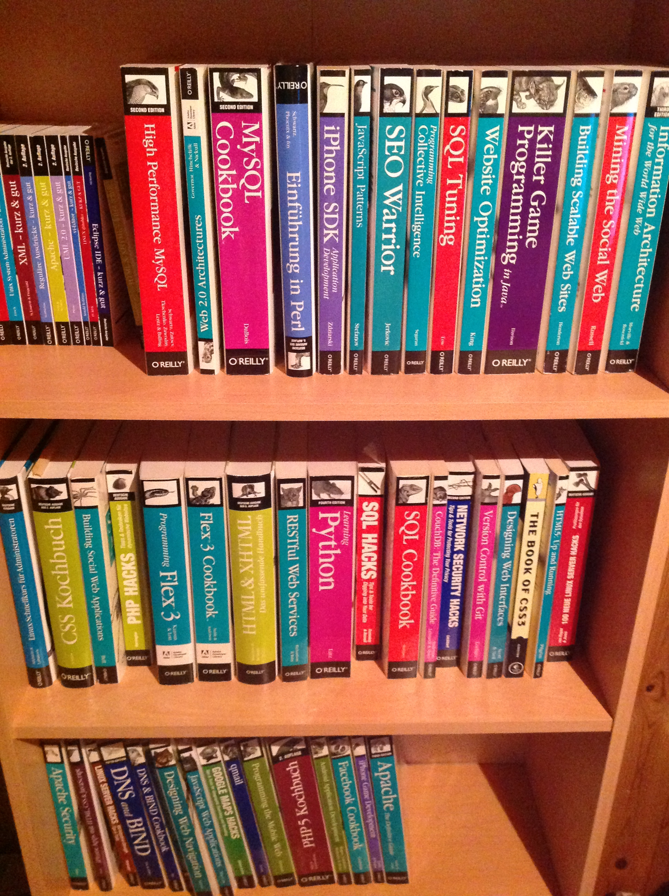
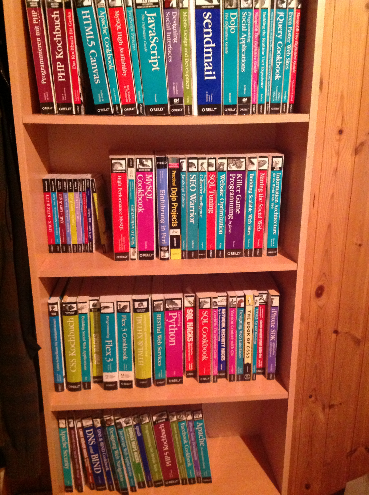

<aside>
%toc%
</aside>

<article>

# About me

It's a me, ChrisWeb!

## Early Programming Days

As I described in my [games](/games) section, I started programming at a young age with an Amstrad CPC computer and because I loved to play games at some point I wondered if I could learn to make my own games 👾, so I bought my first programming books about making games in [BASIC](https://en.wikipedia.org/wiki/BASIC) and started typing the several pages long examples from the book into files, I would then copy them to Floppy disks 😲 and share them with friends to see of they enjoyed playing them as much as I did

A few years later I got my first PC and started using [Pascal](https://en.wikipedia.org/wiki/Pascal_(programming_language)), I remember one of the first games I did on my own had very basic vector graphics and was a bit like an [Out Run](https://en.wikipedia.org/wiki/Out_Run) game but in space, so instead of a car you were piloting a spaceship, you had to shoot and destroy incoming asteroids, I enjoyed programming it as well as playing it.

## First Website on GeoCities

When I got my second PC it came with a modem, which meant I now had access to internet, it was mind blowing

That's when I discovered that a new service had just been founded called [GeoCities](https://en.wikipedia.org/wiki/GeoCities), little did I know that this was going to be the start of my web development journey. I started learning HTML and later [DHTML](https://en.wikipedia.org/wiki/Dynamic_HTML), which consisted of learning how to use [&lt;blink&gt;](https://en.wikipedia.org/wiki/Blink_element), `
` and how to add a small image (that repeats itself indefinitely) as background 😂. To get an idea of what we were building check out this [geocities archive](https://geocities.restorativland.org/).

## TombRaider.net and dropping out of school

I had read news in gaming magazines about an upcoming game called [Tomb Raider](https://en.wikipedia.org/wiki/Tomb_Raider_(1996_video_game)) starring [Lara Croft](https://en.wikipedia.org/wiki/Lara_Croft) a female Indiana Jones like character. It seemed to be a promising game and so I searched for available domains, of course tombraider.com had already been registered developers of Tomb Raider but I was extremely lucky to be able to register tombraider.net 🙂.

> [!NOTE]  
I was able to find traces of my [tombraider.net website from april 1999](https://web.archive.org/web/20000510125725/http://www.tombraider.net/) in the [internet archive](https://archive.org/), but unfortunately none of the images got saved 😥

On tombraider.net I had a "music box" (similar to the jukebox I now have on this blog) but the music tracks were midi songs, back in the days you could use the `<embed>` element to add midi (.mid) music to your website, today browser don't support it anymore so I had to convert the songs to ogg / mp3 to be able to post them here. I was able to retrieve two Tomb Raider midi files from the internet archive, originally composed by [Nathan McCree](https://en.wikipedia.org/wiki/Nathan_McCree):

    

        <figure>
            <figcaption>Tombraider 1 inspired midi song:</figcaption>
            <audio controls>
                <source src="/assets/music/tombraider_net/sound06.ogg" type="audio/ogg" />
                <source src="/assets/music/tombraider_net/sound06.mp3" type="audio/mp3" />
            </audio>
            <a href="/assets/music/tombraider_net/sound06.mid">Original midi file download</a>
        </figure>
    

    

        <figure>
            <figcaption>Tombraider 2 inspired midi song:</figcaption>
            <audio controls>
                <source src="/assets/music/tombraider_net/sound07.ogg" type="audio/ogg" />
                <source src="/assets/music/tombraider_net/sound07.mp3" type="audio/mp3" />
            </audio>
            <a href="/assets/music/tombraider_net/sound07.mid">Original midi file download</a>
        </figure>
    

Here is the third song I was able to retrieve, it is so melancholic, maybe I was anticipating what mood I would be in 20 years later when reviewing my past work:

    

        <figure>
            <figcaption>Evening Falls (by Etherea):</figcaption>
            <audio controls>
                <source src="/assets/music/tombraider_net/sound02.ogg" type="audio/ogg" />
                <source src="/assets/music/tombraider_net/sound02.mp3" type="audio/mp3" />
            </audio>
            <a href="/assets/music/tombraider_net/sound02.mid">Original midi file download</a>
        </figure>
    

I even found a comment I always putting in my code: `&lt;!-- MADE WITH NOTEPAD 1.0 --&gt;{:.comment}` 😋

The popularity of the website kept increasing and generating traffic. A year later, just before the release of the second Tomb Raider game, I got in contact with people from GX Media, an American start up operating gamers.com as well as GX Network, an advertising platform for gaming websites. After adding their banner code to tombraider.net I started getting checks every month.

Getting paid to create and operate a gaming website on my own was a dream come true. Because of that and because at that time web development wasn't really something you could learn at school I decided to drop out of high school during my final year. Yes my parents were less enthusiastic than I was, to say the least but they still supported me.

After the third Tomb Raider game the number of visits started dropping and so did the numbers on the checks.

## Nonprofit Work and Personal Challenges

Around that time I met some people that were active in Nonprofit organizations and they had planned to rent a house near where I was living to move in together and build a community of like-minded people. I decided to join them to create a Nonprofit organization so that I could contribute my skills in web development to help them promote their ideas. At first I used [Delphi](https://en.wikipedia.org/wiki/Delphi_(software)) to create a no-code windows software that allowed non developers to organize content without having any HTML skills, when done a click on the publish button would convert the navigation and pages into HTML documents, ready to be published on a server. After a while I started using [PHP](https://en.wikipedia.org/wiki/PHP) to make the pages more dynamic and add tools like discussion boards to the pages.

This period included ups and downs, with financial struggles leading to a return to my parents home. I was depressed 😢

## Getting back up

I had lost some confidence in myself, but my passion for web development was intact, I spent my days expanding my skill set in various programming languages and web development tools, here is what my bookshelves looked like at that time

    

        
    

    

        
    

My increased skill set is what eventually helped me to secure my first "real" job as web developer.

## The green triangle

My second job started with a very funny moment. At that time I was very interested in learning how to create better and more intuitive interfaces using HTML pages using CSS and Javascript. I applied for a web designer position at a big media house and the task during the interview was to build a website for a fictional gardening company called "the green triangle". My Photoshop skills clearly were not up to the task and my green triangle in the top right of the page led to both the interviewer and me laughing at the result for several minutes. They were however impressed by the amount and quality of code I had written and asked me to apply again for another PHP developer position that had not been published yet, I applied the next week and this time I got the job.

## Jamendo

At jamendo.com I spent the first two years helping to transition the backend to [Zend Framework](https://github.com/zendframework/zf1) and the frontend to [Backbone.js](https://github.com/jashkenas/backbone). I was very interested in the product (I mean who doesn't like music 😉) and kept on bringing up ideas for new features.

After two years I transitioned into a product management role. We introduced a new concept of music communities so that instead of having one global charts page, each music genre community would have their own charts, curated playlists, trending section we used a ranking algorithm that would calculate a score for each new song based on user interactions like reviews and likes it had recieved, but then also divide that score by the amount of days passed since the release, so that newer songs had a chance to climb up in the trending list. We also did smaller adjustments like merging the like and bookmark buttons into a single ❤️ (heart) button. We spent a lot of time creating prototypes, analyzing data to be able to make decisions based on numbers and not solely on our opinions. After the initial release I learned valuable lessons about user engagement and product evolution.

## Clubee.com and COVID-19 Challenges

As a CTO at Clubee.com, I navigated the challenges posed by the COVID-19 pandemic, adapting to remote work and maintaining productivity were challenging tasks. We even transformed our after work events to online events where everyone in the team would prepare their favorite drink at home and then join the others in online team games. Clubee was a start up and some better known agile methodologies didn't work well so we transitioned to something heavily inspired by the [shape up](https://basecamp.com/shapeup) methodology where a multidisciplinary team consisting of product management, design and web development would work on the specs of a new feature and in parallel the development team would work on the execution, with a period in between to improve things and iron out some bugs that had surfaced.

## Sabbatical and Current Projects

I have taken a sabbatical to update my skills once again but also to develop new projects, like an Android and iOS app called [Beavo](https://beavo.com), it is a web app for for Beach Volleyball players using [React](https://react.dev/) and [Capacitor.js](https://capacitorjs.com/), that I did for a friend. I used Xcode Cloud to create a CI/CD pipeline that will automatically build the app and distribute it to testers, each time there is a new pull request into the GitHub repository.

I rebuilt my personal blog using [Next.js](https://nextjs.org/) and focused on [MDX](https://mdxjs.com/) (markdown) content formatting to create a static blog, which lead to the creation of 2 new open source plugins [remark-table-of-contents](https://github.com/chrisweb/remark-table-of-contents) and [rehype-github-alerts](https://github.com/chrisweb/rehype-github-alerts). I also updated my [web-audio-api-player](https://github.com/chrisweb/web-audio-api-player) project which is powering the jukebox on top of this blog and had a lot of fun working on the header ("Press Start" in the top header to see the animation) using [React-three-fiber](https://docs.pmnd.rs/react-three-fiber/getting-started/introduction) a React renderer for three.js (WebGL).

I read countless articles and watched educational videos on YouTube about about web development and game development (using [Godot Engine](https://godotengine.org/)) and contributed to open-source projects on GitHub, fixing bugs and helping improve documentation, for example latest PR for Next.js [Next.js PR #61412](https://github.com/vercel/next.js/pull/61412) just got accepted recently

To be continued...

</article>
