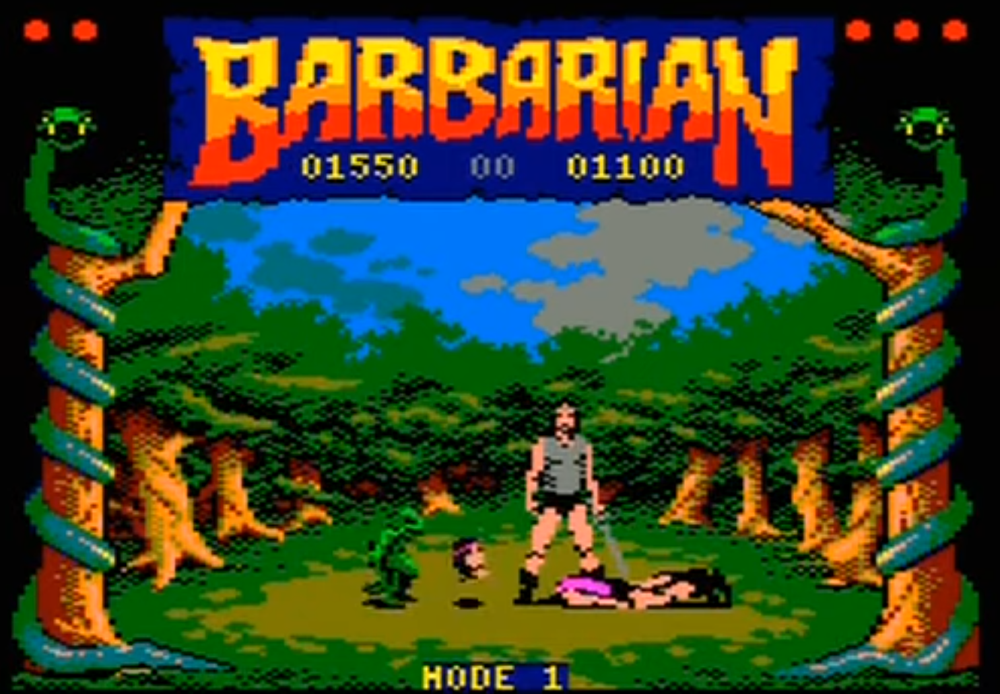

%toc%

<article>

# Games

## Amstrad CPC 6128

I played my first games on an [Amstrad CPC 6128](https://en.wikipedia.org/wiki/Amstrad) when I was around 9 years old , the Amstrad had a CTM 644 color monitor, a disk drive, it also came with a Joystick but no mouse, everything including playing games was done solely using the keyboard and eventually the Joystick. The Amstrad CPC 6128 even came with a TV tuner that you could place below the screen and which allowed me to also watch TV 🤯.

Some of the games I remember playing on my Amstrad were:

    

        
        [Barbarian](https://en.wikipedia.org/wiki/Barbarian:_The_Ultimate_Warrior) was actually a quite brutal game, as the goal was to chop off the head of the enemy and after you did a green goblin came into the screen, kicked the head out of the screen and then dragged the body out of the screen too 😲
    

    

        
        [Zombi](https://en.wikipedia.org/wiki/Zombi_(1986_video_game)) was the first game ever to be released by UbiSoft
    

    

        
        [Cauldron](https://en.wikipedia.org/wiki/Cauldron_(video_game))
    

    

        
        [Commando](https://en.wikipedia.org/wiki/Commando_(video_game))
    

## Super Nintendo (SNES)

Then a few years later I got my first console the [The Super Nintendo Entertainment System](https://en.wikipedia.org/wiki/Super_Nintendo_Entertainment_System#:~:text=The%20Super%20Nintendo%20Entertainment%20System,and%201993%20in%20South%20America.) (SNES), I was fortunate to have siblings, which meant that I most of the time there was someone around to play games like Mario Kart with me, here are a few games I can remember playing on my SNES:

    

        
        [Super Mario World](https://en.wikipedia.org/wiki/Super_Mario_World) was my first SNES game
    

    

        
        [Super Mario Kart](https://en.wikipedia.org/wiki/Super_Mario_Kart) was probably the game I played the most on my SNES due to it's split screen mode(s), one mode was obviously racing but there was also a second mode called "Battle Mode" which took places in arenas and in which you had to pop the 3 balloons on the other players karts before they could pop yours, this was so much fun
    

    

        
        [Street Fighter II](https://en.wikipedia.org/wiki/Street_Fighter_II)
    

    

        
        [F-Zero](https://en.wikipedia.org/wiki/F-Zero_(video_game))
    

    

        
        [Star Fox](https://en.wikipedia.org/wiki/Star_Fox_(1993_video_game))
    

## My first PC (486)

My first PC ever had a [Intel 486DX2-66](https://en.wikipedia.org/wiki/I486) processor and this was the golden age of [DOS games](https://en.wikipedia.org/wiki/MS-DOS), it was also great period for adventure games, I probably played every 80s and early 90s adventure game LucasArts and Sierra would produce

## Nintendo 64

After the SNES the next console I got was the [Nintendo 64](https://en.wikipedia.org/wiki/Nintendo_64), what suprised me most when I played the first N64 games like Mario Kart 64 in comparison with the SNES version from 5 years before

    

        
        [Super Mario 64](https://en.wikipedia.org/wiki/Super_Mario_64)
    

    

        
        [Mario Kart 64](https://en.wikipedia.org/wiki/Mario_Kart_64)
    

    

        
        [The Legend of Zelda: Ocarina of Time](https://en.wikipedia.org/wiki/Street_Fighter_II)
    

    

        
        [GoldenEye 007](https://en.wikipedia.org/wiki/GoldenEye_007_(1997_video_game))
    

## Dreamcast (SEGA)

Another few years later I bought the [SEGA Saturn](https://en.wikipedia.org/wiki/Saturn), I had spent some time in amusement arcades and played games like SEGA Rally and Daytona a lot but putting coins into the machine to be able to play seemed to get very costly over time, so when SEGA released a console where I could play those games at home it was a dream come true for me, I didn't have a lot of SEGA Saturn games but here are the ones I remember most vividly:

    

        
        [Sega Rally Championship](https://en.wikipedia.org/wiki/Sega_Rally_Championship)
    

    

        
        [Virtua Cop](https://en.wikipedia.org/wiki/Virtua_Cop) the game came with a light gun called the [SEGA Virtua Gun](https://en.wikipedia.org/wiki/Light_gun), it was like playing an arcade game at home
    

    

        
        [Daytona USA](https://en.wikipedia.org/wiki/Daytona_USA)
    

    

        
        [Virtua Fighter 2](https://en.wikipedia.org/wiki/Virtua_Fighter_2)
    

</article>
