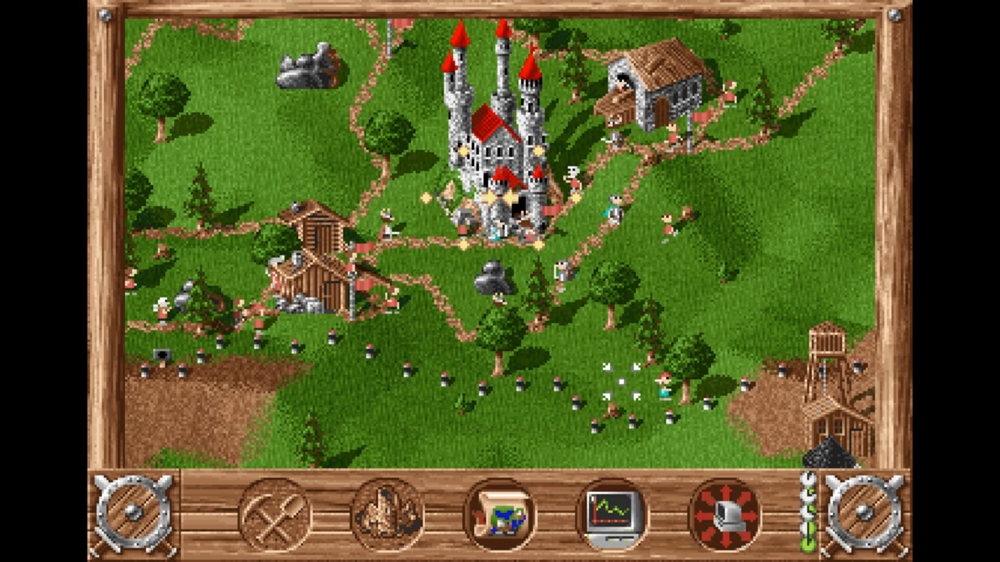
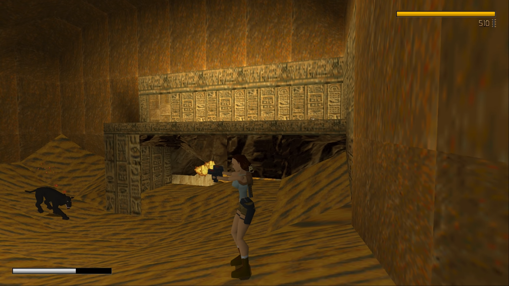
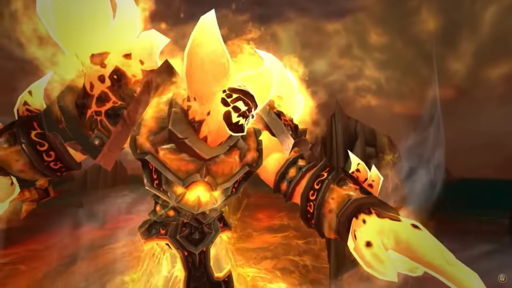
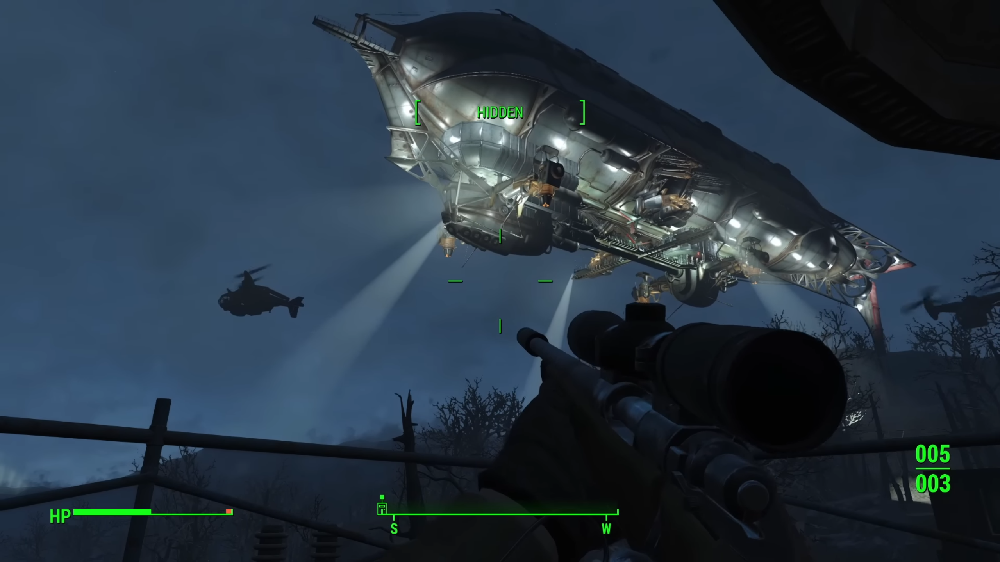

import styles from './page.module.css'

%toc%

<article className={styles.games}>

# Games

## Amstrad CPC 6128

I played my first games on an [Amstrad CPC 6128](https://en.wikipedia.org/wiki/Amstrad) when I was around 9 years old , the Amstrad had a CTM 644 color monitor, a disk drive, it also came with a Joystick but no mouse, everything including playing games was done solely using the keyboard and eventually the Joystick. The Amstrad CPC 6128 even came with a TV tuner that you could place below the screen and which allowed me to also watch TV 🤯.

Some of the games I remember playing on my Amstrad were:

    

        
        [Barbarian](https://en.wikipedia.org/wiki/Barbarian:_The_Ultimate_Warrior) was actually a quite brutal game, as the goal was to chop off the head of the enemy and after you did a green goblin came into the screen, kicked the head out of the screen and then dragged the body out of the screen too 😲
    

    

        
        [Zombi](https://en.wikipedia.org/wiki/Zombi_(1986_video_game)) was the first game ever to be released by UbiSoft
    

    

        
        [Cauldron](https://en.wikipedia.org/wiki/Cauldron_(video_game))
    

    

        
        [Commando](https://en.wikipedia.org/wiki/Commando_(video_game))
    

    

        
        [Out Run](https://en.wikipedia.org/wiki/Out_Run)
    

## Super Nintendo (SNES)

Then a few years later I got my first console the [The Super Nintendo Entertainment System](https://en.wikipedia.org/wiki/Super_Nintendo_Entertainment_System) (SNES), I was fortunate to have siblings, which meant that I most of the time there was someone around to play games like Mario Kart with me, here are a few games I can remember playing on my SNES:

    

        
        [Super Mario World](https://en.wikipedia.org/wiki/Super_Mario_World) was my first SNES game
    

    

        
        [Super Mario Kart](https://en.wikipedia.org/wiki/Super_Mario_Kart) was probably the game I played the most on my SNES due to it's split screen mode(s), one mode was obviously racing but there was also a second mode called "Battle Mode" which took places in arenas and in which you had to pop the 3 balloons on the other players karts before they could pop yours, this was so much fun
    

    

        
        [Street Fighter II](https://en.wikipedia.org/wiki/Street_Fighter_II)
    

    

        
        [F-Zero](https://en.wikipedia.org/wiki/F-Zero_(video_game))
    

    

        
        [Star Fox](https://en.wikipedia.org/wiki/Star_Fox_(1993_video_game))
    

## My first PC (i486)

My first PC ever had a [Intel 486DX2-66](https://en.wikipedia.org/wiki/I486) processor and this was the golden age of [MS-DOS games](https://en.wikipedia.org/wiki/MS-DOS), it was also great period for [adventure games](https://en.wikipedia.org/wiki/Adventure_game), I probably played every 80s and early 90s adventure game [LucasArts](https://en.wikipedia.org/wiki/Lucasfilm_Games) and [Sierra](https://en.wikipedia.org/wiki/Sierra_Entertainment) would produce but I also loved playing strategy, city builder and simulation games

    

        
        [King's Quest I](https://en.wikipedia.org/wiki/King%27s_Quest_I) was a leap forward compared to earlier adventure games, not only because it was using bitmap graphics (instead of vector graphics) but due to its graphics being partially animated, it was still a text adventure game which means that you had to type in the commands, like **climb rope** or **give cheese to rat** to control the main character of the game
    

    

        
        [Maniac Mansion](https://en.wikipedia.org/wiki/Maniac_Mansion) was another leap forward and the first game using the LucasArts [SCUMM](https://en.wikipedia.org/wiki/SCUMM) game engine, it was the first point-and-click adventure game I ever played
    

    

        
        [The Secret of Monkey Island](https://en.wikipedia.org/wiki/The_Secret_of_Monkey_Island) Monkey Island 1 & 2 are still today my two favorite adventure games of all times
    

    

        
        [Monkey Island 2: LeChuck's Revenge](https://en.wikipedia.org/wiki/Monkey_Island_2:_LeChuck%27s_Revenge)
    

    

        
        [Lemmings](https://en.wikipedia.org/wiki/Lemmings_(video_game))
    

    

        
        [Maniac Mansion II: Day of the Tentacle](https://en.wikipedia.org/wiki/Day_of_the_Tentacle)
    

    

        
        [The Settlers](https://en.wikipedia.org/wiki/The_Settlers) (german: Die Siedler)
    

    

        
        [Doom](https://en.wikipedia.org/wiki/Doom_(1993_video_game)) Years after first playing this game I remember still coming back to build custom levels, it was a lot of fun and I think I spent more time [modding doom](https://en.wikipedia.org/wiki/Doom_modding) than I actually spent playing it
    

    

        
        [UFO: Enemy Unknown](https://en.wikipedia.org/wiki/X-COM:_UFO_Defense) (X-COM: UFO Defense in the US) This game had such an amazing intro (video below)
    

    

        
        [Pizza Connection](https://en.wikipedia.org/wiki/Pizza_Tycoon) (Pizza Tycoon in the US)
    

    

        
        [Theme Park](https://en.wikipedia.org/wiki/Theme_Park_(video_game))
    

    

        
        [The Clou!](https://en.wikipedia.org/wiki/The_Clou!) (german: Der Clou!) The mix of genres in this game was what I liked most, the first part was like classical adventure game in which you were wandering through the city of London trying to recruit members for your crew but there was also a second part that was a strategy-like top-down view of buildings and it was used plan and later execute burglaries
    

    

        
        [The Settlers II: Veni, Vidi, Vici](https://en.wikipedia.org/wiki/The_Settlers_II) (german: Die Siedler II)
    

    

        
        [Command & Conquer](https://en.wikipedia.org/wiki/Command_%26_Conquer)
    

    

        
        [Warcraft II: Tides of Darkness](https://en.wikipedia.org/wiki/Warcraft_II:_Tides_of_Darkness)
    

Video (with sound) of the intro of X-COM: UFO Defense:

<video controls preload="none" title="X-COM: UFO Defense Intro" poster="/assets/images/app/games/x-com_ufo_defense_intro_poster.jpg">
  <source src="/assets/video/app/games/x-com_ufo_defense_intro_vp9.webm" type="video/webm" />
  <source src="/assets/video/app/games/x-com_ufo_defense_intro_h264.mp4" type="video/mp4" />
  
Your browser doesn't support HTML5 video.

</video>

## Nintendo 64

After the SNES the next console I got was the [Nintendo 64](https://en.wikipedia.org/wiki/Nintendo_64), what suprised me most when I played the first N64 games like Mario Kart 64 in comparison with the SNES version from 5 years before

    

        
        [Super Mario 64](https://en.wikipedia.org/wiki/Super_Mario_64)
    

    

        
        [Mario Kart 64](https://en.wikipedia.org/wiki/Mario_Kart_64)
    

    

        
        [The Legend of Zelda: Ocarina of Time](https://en.wikipedia.org/wiki/Street_Fighter_II)
    

    

        
        [GoldenEye 007](https://en.wikipedia.org/wiki/GoldenEye_007_(1997_video_game))
    

## SEGA Saturn

Another few years later I bought the [SEGA Saturn](https://en.wikipedia.org/wiki/Saturn), I had spent some time in amusement arcades and played games like SEGA Rally and Daytona a lot but putting coins into the machine to be able to play seemed to get very costly over time, so when SEGA released a console where I could play those games at home it was a dream come true for me, I didn't have a lot of SEGA Saturn games but here are the ones I remember most vividly:

    

        
        [Sega Rally Championship](https://en.wikipedia.org/wiki/Sega_Rally_Championship)
    

    

        
        [Virtua Cop](https://en.wikipedia.org/wiki/Virtua_Cop) the game came with a light gun called the [SEGA Virtua Gun](https://en.wikipedia.org/wiki/Light_gun), it was like playing an arcade game at home
    

    

        
        [Daytona USA](https://en.wikipedia.org/wiki/Daytona_USA)
    

    

        
        [Virtua Fighter 2](https://en.wikipedia.org/wiki/Virtua_Fighter_2)
    

## My 2nd PC (Pentium Pro + Modem)

My second PC had an Intel [Pentium Pro](https://en.wikipedia.org/wiki/Pentium) processor and also had [3dfx Voodoo](https://en.wikipedia.org/wiki/3dfx) graphics card 🤯, I also bought it because after having used Windows 3.1 for 4 years it was time to get new hardware and start using [Windows 95](https://en.wikipedia.org/wiki/Windows_95), but the most spectacular change for me was that I finallay was able to persuade my parents to let me buy a 28.8 kbit/s dial-up [modem](https://en.wikipedia.org/wiki/Modem) to be able to access the internet and play multiplayer games, for my parents it was the start of a period when they would hear sounds like "beeep bluurp bop" modem sounds when they picked up the phones handset to call someone and me losing my connection to the [battle.net](https://en.wikipedia.org/wiki/Battle.net) servers, at some point I got a faster 56 kbit/s modem which was a spectacular upgrade in terms of connection speed

    

        
        [Tomb Raider](https://en.wikipedia.org/wiki/Tomb_Raider_(1996_video_game)) or the day I fell in love with Lara Croft 😊
    

    

        
        [Diablo](https://en.wikipedia.org/wiki/Diablo_(video_game)) was my first [online game](https://en.wikipedia.org/wiki/Online_game), it was mindblowing for me to be able to connect to [battle.net](https://en.wikipedia.org/wiki/Battle.net) using my modem and by able to play with other gamers from all over the world
    

    

        
        [Half-Life](https://en.wikipedia.org/wiki/Half-Life_(video_game))
    

    

        
        [SimCity 3000](https://en.wikipedia.org/wiki/SimCity_3000)
    

    

        
        [Grand Theft Auto Vice City](https://en.wikipedia.org/wiki/Grand_Theft_Auto:_Vice_City)
    

    

        
        [Unreal Tournament 2004](https://en.wikipedia.org/wiki/Unreal_Tournament_2004) Capture the flag (CTF) was by far my favorite multiplayer mode, the rush you got when taking the flag and knowing you had to travel all the way back without getting killed and before the enemy team takes your flag was epic, I also liked a lot that unlike other FPS games UT2004 had vehicles, racing with the Manta through maps, then make a jump and come crashing down on an enemy player made me smile every time 😅
    

## My 3rd PC (Pentium 4 / Windows XP)

My 3rd PC had a Pentium 4 processor with Windows XP, the windows 95/98 days were finally over and I finally got faster Internet connection (ADSL / ISDN). I bought this PC because I knew World of Warcraft was about to get released and I kept this PC for a very long period of time because the only game I was playing was WoW and I didn't need another PC, I however kept upgrading it, adding more Ram, adding a second Hard disk drive and after a few years I also replaced the graphics card, in the end I think I kept using this PC for more than 8 years

    

        
        [World of Warcraft](https://en.wikipedia.org/wiki/World_of_Warcraft) (WoW) was mindblowing, it was the first MMO I had ever played. I remember the first time I arrived in Stormwind City and saw all the other players running around, those were no NPCs like in other games, those were real people sitting behind their computer just like me, it felt so good to be surrounded by other players and be able to interact with them, yes some quests were repetitive and the grind was real but I enjoyed doing quests that were telling us more about the fantastic warcraft storyline we had been enjoying while playing the previous strategy games
    

    

        
        [The Burning Crusade](https://en.wikipedia.org/wiki/World_of_Warcraft:_The_Burning_Crusade) would finally allow us to march through the the Dark Portal, the expansion came out at a perfect time because a lot of things you could do in WoW were starting to feel excessivly repetitive and the expansion did not disappoint, it brought two new playable races the Draenei of the Alliance and the Blood Elves of the Horde, a new PvP Arena System and a lot of new content to explore, it was great to have new content to enjoy with people I had been playing with for some time
    

    

        
        [Wrath of the Lich King](https://en.wikipedia.org/wiki/World_of_Warcraft:_Wrath_of_the_Lich_King) meant we had to get ready for the new snowy region called Northrend, by know I had made a lot of friends in the game and had spent several years in the same alliance, together we had slayn countless raid bosses to get the best possible gear in the game, after having watched the trailer countless times (blizzard cinematics are the best I have ever seen) we were more than ready to face the Lich King and his minions
    

    

        
        [Cataclysm](https://en.wikipedia.org/wiki/World_of_Warcraft:_Cataclysm) was the last expansion I played and would mark the end of an epic journey that lasted over 6 years, I'm not exactly sure what made me quit but I guess one day I just woke up and decided for myself that it was enough 😉
    

## My 4th PC (Intel Core i7 / Windows 10)

I got my 4th PC in 2014, I bought an Intel Core i7-5960X processor and an Asus RAMPAGE V EXTREME board, 32 GB of Ram, a 512GB SSD, 2 AsusSTRIX GTX980 graphics cards (connected via an SLI bridge) and an Asus ROG PG278Q 27 inch / 144Hz gaming monitor

My 4th PC was a dream come true, I had worked very hard the past years and had just gotten a new job so I thought I had earned a reward, I didn't just buy very expensive parts but also built a custom liquid cooling system to cool the processor, the Ram and of course the dual graphics cards, then I also bought blue lights and several white and blue spray cans to spray the black inside of the tower, the graphics cards back plates as well as the PSU, here are some pics I took back then:

    

        
    

    

        
    

    

        
    

    

        
    

    

        
    

As of today (01.01.2024) I still use it 👾, it is now 10 years old but for the kind of games I play it is enough, I plan on buying a new PC at some point but have not made any plans yet

    

        
        [Fallout 3](https://en.wikipedia.org/wiki/Fallout_3) is my favorite Fallout game so far, the story and atmosphere were great
    

    

        
        [Left 4 Dead 2](https://en.wikipedia.org/wiki/Left_4_Dead_2) is a game I had a lot of fun playing with my co-workers
    

    

        
        [Battlefield Bad Company 2](https://en.wikipedia.org/wiki/Battlefield:_Bad_Company_2) more specifically the Vietnam expansion, is the Battlefield game I liked more than the others, doing kamikaze dives into the enemy camp using the helicopter and then going on a rampage was fun for me (and maybe a bit less for the others that had joined me in the helicopter not knowing what I was up to), it is also the only FPS I remember not being too bad as a Sniper
    

    

        
        [Civilization V](https://en.wikipedia.org/wiki/Civilization_V) is the one Civilization game I played the most, not sure it is the best but for sure it is the one I had the most free time to play, I have enjoyed the Civilization and Colonization series since the first games released and still like them today
    

    

        
        [Fallout 4](https://en.wikipedia.org/wiki/Fallout_4) was not the best Fallout but the one I played the most, for the simple reason that I spent countless hours building my own Vault or Settlement, to then have a place to display all the comic books and Power Armors I had collected
    

    

        
        [XCOM 2](https://en.wikipedia.org/wiki/XCOM_2)
    

    

        
        [Stardew Valley](https://en.wikipedia.org/wiki/Stardew_Valley)
    

    

        
        [Rimworld](https://en.wikipedia.org/wiki/RimWorld)
    

    

        
        [Anno 1800](https://en.wikipedia.org/wiki/Anno_1800)
    

I haven't played a lot of games lately, when I play it is often on my iPad while also bing watching a TV series, some games which I bought or planned on buying were disappointing (to say the least) like Fallout 76 and City Skylines 2 to just name a few...

However several smaller games like DAVE THE DIVER, Katana ZERO, DREDGE, Graveyard Keeper... that I mostly watched others play on Twitch have reignited my desire to create my own game some day, which is why I also spend more and more time watching solo game devs build their dream game on Twitch and Youtube, I however currently don't have enough money aside to be able to spend 3-4 working on a project like that, so who knows what will happen next... to be continued

</article>
