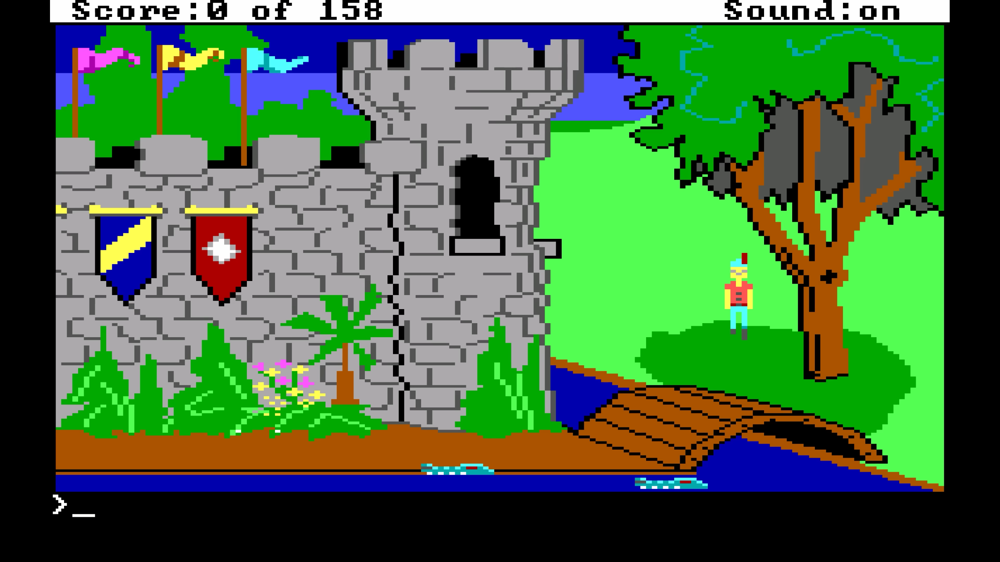

%toc%

<article>

# Games

## Amstrad CPC 6128

I played my first games on an [Amstrad CPC 6128](https://en.wikipedia.org/wiki/Amstrad) when I was around 9 years old , the Amstrad had a CTM 644 color monitor, a disk drive, it also came with a Joystick but no mouse, everything including playing games was done solely using the keyboard and eventually the Joystick. The Amstrad CPC 6128 even came with a TV tuner that you could place below the screen and which allowed me to also watch TV 🤯.

Some of the games I remember playing on my Amstrad were:

    

        
        [Barbarian](https://en.wikipedia.org/wiki/Barbarian:_The_Ultimate_Warrior) was actually a quite brutal game, as the goal was to chop off the head of the enemy and after you did a green goblin came into the screen, kicked the head out of the screen and then dragged the body out of the screen too 😲
    

    

        
        [Zombi](https://en.wikipedia.org/wiki/Zombi_(1986_video_game)) was the first game ever to be released by UbiSoft
    

    

        
        [Cauldron](https://en.wikipedia.org/wiki/Cauldron_(video_game))
    

    

        
        [Commando](https://en.wikipedia.org/wiki/Commando_(video_game))
    

## Super Nintendo (SNES)

Then a few years later I got my first console the [The Super Nintendo Entertainment System](https://en.wikipedia.org/wiki/Super_Nintendo_Entertainment_System) (SNES), I was fortunate to have siblings, which meant that I most of the time there was someone around to play games like Mario Kart with me, here are a few games I can remember playing on my SNES:

    

        
        [Super Mario World](https://en.wikipedia.org/wiki/Super_Mario_World) was my first SNES game
    

    

        
        [Super Mario Kart](https://en.wikipedia.org/wiki/Super_Mario_Kart) was probably the game I played the most on my SNES due to it's split screen mode(s), one mode was obviously racing but there was also a second mode called "Battle Mode" which took places in arenas and in which you had to pop the 3 balloons on the other players karts before they could pop yours, this was so much fun
    

    

        
        [Street Fighter II](https://en.wikipedia.org/wiki/Street_Fighter_II)
    

    

        
        [F-Zero](https://en.wikipedia.org/wiki/F-Zero_(video_game))
    

    

        
        [Star Fox](https://en.wikipedia.org/wiki/Star_Fox_(1993_video_game))
    

## My first PC (i486)

My first PC ever had a [Intel 486DX2-66](https://en.wikipedia.org/wiki/I486) processor and this was the golden age of [MS-DOS games](https://en.wikipedia.org/wiki/MS-DOS), it was also great period for [adventure games](https://en.wikipedia.org/wiki/Adventure_game), I probably played every 80s and early 90s adventure game [LucasArts](https://en.wikipedia.org/wiki/Lucasfilm_Games) and [Sierra](https://en.wikipedia.org/wiki/Sierra_Entertainment) would produce

    

        
        [King's Quest I](https://en.wikipedia.org/wiki/King%27s_Quest_I) was a leap forward compared to earlier adventure games, not only because it was using bitmap graphics (instead of vector graphics) but due to its graphics being partially animated, it was still a text adventure game which means that you had to type in the commands, like **climb rope** or **give cheese to rat** to control the main character of the game
    

    

        
        [Maniac Mansion](https://en.wikipedia.org/wiki/Maniac_Mansion) was another leap forward and the first game using the LucasArts [SCUMM](https://en.wikipedia.org/wiki/SCUMM) game engine, it was the first point-and-click adventure game I ever played
    

    

        
        [The Secret of Monkey Island](https://en.wikipedia.org/wiki/The_Secret_of_Monkey_Island) Monkey Island 1 & 2 are still today my two favorite adventure games of all times
    

    

        
        [Monkey Island 2: LeChuck's Revenge](https://en.wikipedia.org/wiki/Monkey_Island_2:_LeChuck%27s_Revenge)
    

    

        
        [Maniac Mansion II: Day of the Tentacle](https://en.wikipedia.org/wiki/Day_of_the_Tentacle)
    

    

        
        [The Settlers](https://en.wikipedia.org/wiki/The_Settlers) (german: Die Siedler)
    

    

        
        [UFO: Enemy Unknown](https://en.wikipedia.org/wiki/X-COM:_UFO_Defense) (X-COM: UFO Defense in the US) This game had such an amazing intro (video below)
    

    

        
        [Pizza Connection](https://en.wikipedia.org/wiki/Pizza_Tycoon) (Pizza Tycoon in the US)
    

    

        
        [Theme Park](https://en.wikipedia.org/wiki/Theme_Park_(video_game))
    

    

        
        [The Clou!](https://en.wikipedia.org/wiki/The_Clou!) (german: Der Clou!) The mix of genres in this game was what I liked most, the first part was like classical adventure game in which you were wandering through the city of London trying to recruit members for your crew but there was also a second part that was a strategy-like top-down view of buildings and it was used plan and later execute burglaries
    

    

        
        [The Settlers II: Veni, Vidi, Vici](https://en.wikipedia.org/wiki/The_Settlers_II) (german: Die Siedler II)
    

    

        
        [Warcraft II: Tides of Darkness](https://en.wikipedia.org/wiki/Warcraft_II:_Tides_of_Darkness)
    

Video (with sound) of the intro of X-COM: UFO Defense:

<video controls preload="none" title="X-COM: UFO Defense Intro" poster="/assets/images/app/games/x-com_ufo_defense_intro_poster.jpg">
  <source src="/assets/video/app/games/x-com_ufo_defense_intro_vp9.webm" type="video/webm" />
  <source src="/assets/video/app/games/x-com_ufo_defense_intro_h264.mp4" type="video/mp4" />
  
Your browser doesn't support HTML5 video.

</video>

## Nintendo 64

After the SNES the next console I got was the [Nintendo 64](https://en.wikipedia.org/wiki/Nintendo_64), what suprised me most when I played the first N64 games like Mario Kart 64 in comparison with the SNES version from 5 years before

    

        
        [Super Mario 64](https://en.wikipedia.org/wiki/Super_Mario_64)
    

    

        
        [Mario Kart 64](https://en.wikipedia.org/wiki/Mario_Kart_64)
    

    

        
        [The Legend of Zelda: Ocarina of Time](https://en.wikipedia.org/wiki/Street_Fighter_II)
    

    

        
        [GoldenEye 007](https://en.wikipedia.org/wiki/GoldenEye_007_(1997_video_game))
    

## My 2nd PC (Pentium Pro + Modem)

My second PC had an Intel [Pentium Pro](https://en.wikipedia.org/wiki/Pentium) processor, I bought it because after having used Windows 3.1 for 4 years it was time to get new hardware and start using [Windows 95](https://en.wikipedia.org/wiki/Windows_95), but the most spectacular change for me was that I finallay was able to persuade my parents to let me buy a 28.8 kbit/s dial-up [modem](https://en.wikipedia.org/wiki/Modem) to be able to access the internet and play multiplayer games, for them it was the start of a period when they would hear sounds like "beeep bluurp bop" modem sounds when they picked up the phones handset to call someone and me losing my connection to the [battle.net](https://en.wikipedia.org/wiki/Battle.net) servers

    

        
        [Diablo](https://en.wikipedia.org/wiki/Diablo_(video_game)) was my first [online game](https://en.wikipedia.org/wiki/Online_game), it was mindblowing for me to be able to connect to [battle.net](https://en.wikipedia.org/wiki/Battle.net) using my modem and by able to play with other gamers from all over the world
    

## SEGA Saturn

Another few years later I bought the [SEGA Saturn](https://en.wikipedia.org/wiki/Saturn), I had spent some time in amusement arcades and played games like SEGA Rally and Daytona a lot but putting coins into the machine to be able to play seemed to get very costly over time, so when SEGA released a console where I could play those games at home it was a dream come true for me, I didn't have a lot of SEGA Saturn games but here are the ones I remember most vividly:

    

        
        [Sega Rally Championship](https://en.wikipedia.org/wiki/Sega_Rally_Championship)
    

    

        
        [Virtua Cop](https://en.wikipedia.org/wiki/Virtua_Cop) the game came with a light gun called the [SEGA Virtua Gun](https://en.wikipedia.org/wiki/Light_gun), it was like playing an arcade game at home
    

    

        
        [Daytona USA](https://en.wikipedia.org/wiki/Daytona_USA)
    

    

        
        [Virtua Fighter 2](https://en.wikipedia.org/wiki/Virtua_Fighter_2)
    

</article>
