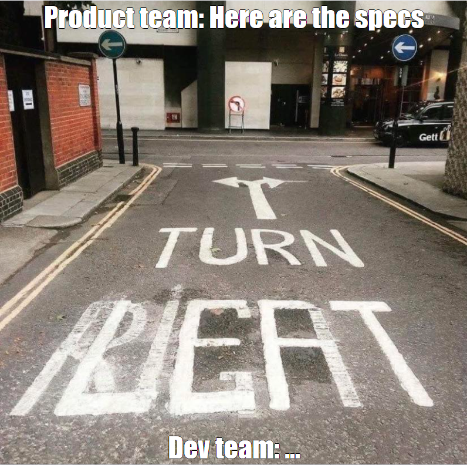
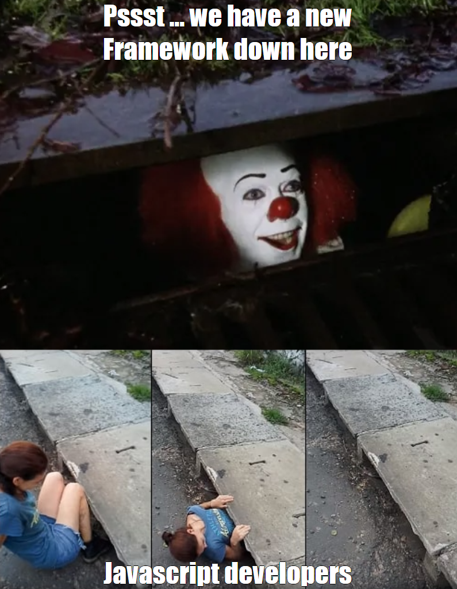
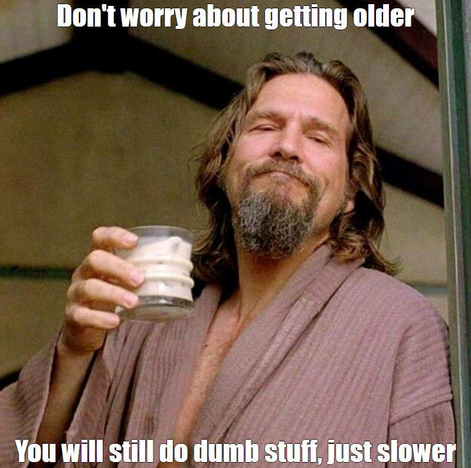

%toc%

<article>

# Memes

The internet is for memes 😋

## web development memes

    

        
    

    

        
    

    

        
    

    

        ![meme, Dev: "[10, 1, 3].sort()", Javascript: "[1, 10, 3]"](../../public/assets/images/app/memes/dev_javascript_meme.png)
        For an explanation and more Javascript WTFs, check out: [https://github.com/denysdovhan/wtfjs](https://github.com/denysdovhan/wtfjs?tab=readme-ov-file#default-behavior-arrayprototypesort)
    

    

        
    

    

        
    

## random memes

    

        
    

    

        
    

</article>
