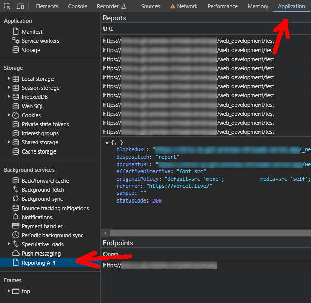
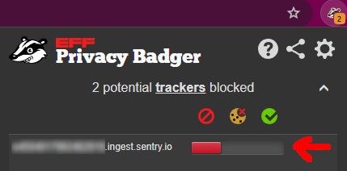

<aside>
%toc%
</aside>

<article>

# Content Security Policy (CSP)

**Content Security Policy (CSP)** is important as it can help you prevent cross-site scripting (XSS), clickjacking, and other code injection attacks resulting from the execution of malicious content. That malicious content can be hiding in remote code from a banner ads system you included into your app or is for example hidden in a client package from a compromised NPM account. Using the Content-Security-Policy HTTP header to limit fetching resources only from sources you explicitly declared can mitigate the risks related to content injection attacks.

## the state of violations reporting (as of february 2024)

This chapter contains mostly theory about the CSP reporting that I found while doing my research, if you are interested in that sort of content read on, if you want the TLDR then [skip to the next chapter](#logging-csp-violations-using-sentryio)

CSP violations can not only be seen in the console, as this would limit us to only see violations that occur when we (the developers) visit the app ourself, but what about violations that happen when a user visits our project, for such cases you can use CSP violations reporting, however how CSP violation reports work has changed over the years, the w3c has released several iterations of their Content Security Policy recommendations / working drafts:

* in the [CSP level 1](https://www.w3.org/TR/2012/CR-CSP-20121115/) & [CSP level 2](https://www.w3.org/TR/CSP2/) recommandations, CSP violations get reported using a [report-uri](https://developer.mozilla.org/en-US/docs/Web/HTTP/Headers/Content-Security-Policy/report-uri) reporting directive, if we look at [caniuse report-uri](https://caniuse.com/?search=report-uri) page we can see that it is supported by all major browsers, the major downside of this feature is that it will make a request per violation, meaning that if you have a violation like that occurs several dozen times on a page then the browser will spam your logging endpoint with reports
* [CSP level 3](https://www.w3.org/TR/CSP3/) introduces a new [report-to](https://developer.mozilla.org/en-US/docs/Web/HTTP/Headers/Content-Security-Policy/report-to) **reporting directive** and the w3c has marked the report-uri directive as deprecated, if we look at [caniuse report-to](https://caniuse.com/?search=report-to) however we see that firefox does not yet support the directive (their ticket ["CSP: Implement report-to"](https://bugzilla.mozilla.org/show_bug.cgi?id=1391243) is quite old but some ago they seemed to have started working on it) and safari only started to support it with v16.4 (released March 27, 2023)

But wait, there is more...

## report-to != Report-to

In the previous chapter we saw the CSP directive **report-to** but when reading about CSP you might also encounter a **Report-to** header, the difference between the header and the directive is the first letter of the header is a capital **R** while the directive has a small **r**

The **Report-to** header is part of an initial Reporting API draft by the w3c, more about the reporting API in the next chapter...

## Reporting API

Initially CSP would use a single header which included a directive to instruct the browser where to send reports, but the w3c introduced something new called the **Reporting API** which describes a new header that can be used to make reports. This header is NOT just to send CSP violations reports but covers a wide range of use cases, for example it can be used to send [Permissions-Policy](https://developer.mozilla.org/en-US/docs/Web/HTTP/Headers/Permissions-Policy) reports, reports regarding deprecated browser features your code might be using, but also reports about browser crashes and more...

The first draft of the **Reporting API (v0)** included a **Report-to header** and [chrome version 69](https://chromestatus.com/feature/4672626140119040) was the first browser to ship with support for this new feature, but after a while the w3c team decided to rename the header and so in the [w3c "Reporting API v1" working draft](https://www.w3.org/TR/reporting-1/) they renamed the Report-to header to **Reporting-Endpoints** and [chrome 96](https://chromestatus.com/feature/5712172409683968) is the first browser to support the ship support for Reporting-Endpoints. There is a very good article on [developer.chrome.com](https://developer.chrome.com/) you may want to read with lots of additional information about the new Reporting API Endpoints titled [Monitor your web application with the Reporting API](https://developer.chrome.com/docs/capabilities/web-apis/reporting-api)

> [!MORE]  
> [chrome developer "Monitor your web application with the Reporting API" article](https://developer.chrome.com/docs/capabilities/web-apis/reporting-api)  
> [MDN "Reporting API" documentation](https://developer.mozilla.org/en-US/docs/Web/API/Reporting_API)  
> [caniuse "Reporting API" page](https://caniuse.com/?search=Reporting%20API)  
> [w3c "Reporting API v1" working draft](https://www.w3.org/TR/reporting-1/)  
> [chromium "Reporting API" readme](https://chromium.googlesource.com/chromium/src/+/HEAD/net/reporting/README.md)  

## logging CSP violations

## logging CSP violations using Sentry.io

#### Sentry.io does not support report-to / Report-to yet

**report-to** is not yet supported by sentry.io, there are several open tickets related to this, one of them is [issue #10202](https://github.com/getsentry/sentry/issues/10202)

Regarding the **Reporting API** there is also no support in Sentry as of now (february 2023), but it seems they are inclined to work on it: [Sentry issue #38940 "Reporting-API" support](https://github.com/getsentry/sentry/issues/38940) or this one from 2017 [issue #5471](https://github.com/getsentry/sentry/issues/5471)

#### Sentry.io may filter reports coming from localhost

Your localhost requests might get filtered by Sentry.io if you or a team member have enabled that feature, if you use **report-uri** you will see the successful requests in the Network tab but they won't show up in Sentry.io

If you want to **report-uri** CSP reports from localhost, visit Sentry.io, then go to 

TODO: finish this chapter, add screenshots

## CSP debugging

### report-uri works in localhost but report-to does NOT

When using **report-uri**, reporting violations works locally (localhost) as well as in preview / production (secure context / https URL)

When using **report-to**, reporting violations will NOT work on localhost (in chrome), which is surprising as localhost usually is considered a secure context (if you know why please let me know using the [chris.lu github discussions](https://github.com/chrisweb/chris.lu/discussions))

In staging (preview) / production environements however the **report-to** will work (tested on chrome) as long as those environments use an SSL certificate (https URL) and are considered secure contexts

#### report-uri requests show up in the Network tab

When using **report-uri**, you can inspect requests using the developer tools **Network tab** like any other POST request made by your app

#### report-to requests are Not in the Network but the Application tab

When using **report-to**, you won't see any entries in your developer tools **Network** tab, this is because a background service does the request(s) and not the website (your code)

To see the requests open your developer tools, then click on the **Application** tab and then on the left list under **Background services** click on **Reporting API**:

### adblockers may block CSP violation logging services

If you are using report-uri and your logging tool does not recieve the reports then they might be **blocked**, to verify if the requests are blocked, open your browsers developer tools and then go into the Network and check if their **status is blocked**, in which case you probably have an adblocker extension installed that is blocking the requests, I for example use [Privacy Badger](https://privacybadger.org/) and have to allow the domain in the extension settings

so make sure to either whitelist the Sentry.io CSP reporting URL or disable the adblocker for your domain or even diable it completly until you are done testing

</article>