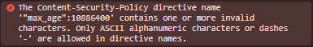
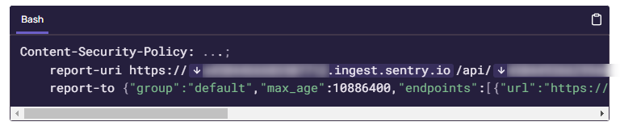

<aside>
%toc%
</aside>

<article>

# Content Security Policy (CSP)


**Content Security Policy (CSP)** is important as it can help you prevent cross-site scripting (XSS), clickjacking, and other code injection attacks resulting from the execution of malicious content. That malicious content can be hiding in remote code from a banner ads system you included into your app or is for example hidden in a client package from a compromised NPM account.

Using the Content-Security-Policy HTTP header to limit fetching resources only from sources you explicitly declared can mitigate the risks related to content injection attacks. OWASP has an interesting [OWASP "Content Security Policy (CSP)" cheat sheet](https://chromium.googlesource.com/chromium/src/+/HEAD/net/reporting/README.md) page with examples that show you what kind of malicious atttacks the different CSP directives can help prevent

> [!MORE]  
> [MDN "Content Security Policy (CSP)" documentation](https://developer.mozilla.org/en-US/docs/Web/HTTP/CSP)  
> [Wikipedia "Content Security Policy (CSP)" page](https://en.wikipedia.org/wiki/Content_Security_Policy)  
> [OWASP "Content Security Policy (CSP)" cheat sheet](https://chromium.googlesource.com/chromium/src/+/HEAD/net/reporting/README.md)  

## CSP policy using a meta element or header

There are two ways to define **CSP directives**, either you use a **header** sent by your server or you use the **meta element** in your html

A basic meta element to configure a CSP policy would look like this:

```html
<meta
    http-equiv="Content-Security-Policy"
    content="img-src 'self';" />
```

The header is often the preferred way of as it supports sending reports which is something that can't be done using the meta element

A very basic [Content-Security-Policy](https://developer.mozilla.org/en-US/docs/Web/HTTP/Headers/Content-Security-Policy) header looks like this:

```shell
Content-Security-Policy: img-src 'self'
```

So far we used the Content-Security-Policy header but there is a second header [Content-Security-Policy-Report-Only](https://developer.mozilla.org/en-US/docs/Web/HTTP/Headers/Content-Security-Policy-Report-Only) that can be used, the difference is that when using Content-Security-Policy the browser will enforce the policy, if using Content-Security-Policy-**Report-Only** the browser will only report violations but NOT enforce them

```shell
Content-Security-Policy-Report-Only: img-src 'self'
```

## CSP directives

The **default-src directive** is a fallback that gets used everytime a [fetch directive](https://developer.mozilla.org/en-US/docs/Glossary/Fetch_directive) for a resource type is missing, for a complete list check out the [MDN "CSP: default-src" documentation](https://developer.mozilla.org/en-US/docs/Web/HTTP/Headers/Content-Security-Policy/default-src)

I saw countless CSP examples (for beginners) that would set the **default-src** to **'self'**, my personal recommendation is set the default-src to **none** or even better don't set it at all (which is equivalent to setting it to none), meaning that it will disallow any source for any content type, which means you use a **secure by default** approach instead of an open everything by default one, like this:

```shell
Content-Security-Policy: default-src 'none'
```

Then I would check which violations get listed in your console log and then one by one use directives to fix the violations one resource type at a time, for example a policy to allow images from the same origin as the html document would look like this:

```shell
Content-Security-Policy: default-src 'none'; img-src 'self'
```

For a website that has images, javascript and css and where the javascript code needs to make requests to a remote API (api.example.com) I would use this basic CSP policy:

```shell
Content-Security-Policy: default-src 'none'; img-src 'self'; script-src 'self'; style-src 'self'; connect-src https://api.example.com
```

Not all policy directives are fetch directives, check out this [MDN directives documentation](https://developer.mozilla.org/en-US/docs/Web/HTTP/Headers/Content-Security-Policy#directives) for a full list

## the state of violations reporting (as of february 2024)

CSP violations can not only be seen in the console, as this would limit us to only see violations that occur when we (the developers) visit the app ourself, but what about violations that happen when a user visits our project, for such cases you can use CSP violations reporting

However how CSP violation reports work has changed over the years, the w3c has released several iterations of their Content Security Policy recommendations / working drafts and then even created a drafts for something called the Reporting API which is a new header dedicated to sending reports to an endpoint

* in the [CSP level 1](https://www.w3.org/TR/2012/CR-CSP-20121115/) & [CSP level 2](https://www.w3.org/TR/CSP2/) recommandations, CSP violations get reported using a [report-uri](https://developer.mozilla.org/en-US/docs/Web/HTTP/Headers/Content-Security-Policy/report-uri) reporting directive, if we look at [caniuse report-uri](https://caniuse.com/?search=report-uri) page we can see that it is supported by all major browsers
* [CSP level 3](https://www.w3.org/TR/CSP3/) introduces a new [report-to](https://developer.mozilla.org/en-US/docs/Web/HTTP/Headers/Content-Security-Policy/report-to) **reporting directive** and the w3c has marked the report-uri directive as deprecated, if we look at [caniuse report-to](https://caniuse.com/mdn-http_headers_content-security-policy_report-to) however we see that firefox does not yet support the directive, they actually now do have support for it but it is behind a feature flag (their ticket ["CSP: Implement report-to"](https://bugzilla.mozilla.org/show_bug.cgi?id=1391243) is quite old but some ago they seemed to have started working on it) and safari only started to support it with v16.4 (released March 27, 2023), chrome on the other hand has had support for report-to since [version 69](https://chromestatus.com/feature/4672626140119040)

### report-uri

**report-uri** is a directive used to tell the browser where to send CSP violation reports, the w3c has marked it as deprecated but as of today this is still the only reporting mechanism that most SAAS logging services support and also the only directive supported by all major browsers

A Content Security header that uses the report-uri directive looks like:

```shell
Content-Security-Policy: ...;
    report-uri https://csp-logging.example.com
```

> [!MORE]  
> [MDN "CSP: report-uri" documentation](https://developer.mozilla.org/en-US/docs/Web/HTTP/Headers/Content-Security-Policy/report-uri)  
> [caniuse "report-uri" page](https://caniuse.com/mdn-http_headers_content-security-policy_report-uri)  
> [w3c "CSP level 1" working draft](https://www.w3.org/TR/2012/CR-CSP-20121115/)  
> [w3c "CSP level 2" working draft](https://www.w3.org/TR/CSP2/)  

### report-to != Report-to

If like me you read some documents about CSP you might find that there are two report-to, **report-to** (with a small first letter **r**) refers to the directive, this report-to directive can point to a Reporting API header, in the first version (v0) of the reporting API that header was called **Report-to** (with a capital **R**)

The **report-to** directive is part of the w3c [CSP level 3](https://www.w3.org/TR/CSP3/) reference and is still valid today

The **Report-to** header however, is part of an initial draft by the w3c for the [reporting API v0](https://www.w3.org/TR/2016/WD-reporting-1-20160407/#header), however this draft is now obsolete, if you see this header in a documentation it means that it is outdated

In the new [w3c "Reporting API v1" working draft](https://www.w3.org/TR/reporting-1/) the Report-to header got replaced by a header that is now called **Reporting-Endpoints**

### Reporting API

The **Reporting API** describes a new header that tells the browser which endpoint(s) should get used to send the reports

This header is NOT just to send CSP violations reports but covers a wide range of use cases, for example it can be used to send [Permissions-Policy](https://developer.mozilla.org/en-US/docs/Web/HTTP/Headers/Permissions-Policy) reports, reports regarding deprecated browser features your code might be using, but also reports about browser crashes and more...

#### Reporting API v0

The first [reporting API v0 draft](https://www.w3.org/TR/2016/WD-reporting-1-20160407/#header) of the **Reporting API (v0)** included a new **Report-to** header

[chrome version 69](https://chromestatus.com/feature/4672626140119040) was the first browser to ship with support for the **Report-to** header and based on [caniuse "Report-to header"](https://caniuse.com/mdn-http_headers_report-to) neither Firefox nor Safari support it (yet)

An example of the Reporting API v0 (**deprecated**) using the report-to directive would look like this:

```shell
Content-Security-Policy: ...;
    report-uri https://csp-logging.example.com;
    report-to {"group":"default","max_age":10886400,"endpoints":[{"url":"https://csp-logging.example.com"}],"include_subdomains":true}
```

and using the Report-to header, like this:

```shell
Content-Security-Policy: ...;
    report-to default
Report-to: {"group":"default","max_age":10886400,"endpoints":[{"url":"https://csp-logging.example.com"}],"include_subdomains":true}
```

Chrome does not support this syntax anymore, and print a series of errors in your console:



Did you notice the **max_age** key in the Report-to json, this tells the browser for how long you want to cache the endpoint information, meaning that if the next page (as long as the origin is the same) wants to make a report you don't need to specify the endpoint again and can just use it in the directive, this feature however got dropped in the v1 specs of the reporting API

#### Reporting API v1

After a while the w3c team decided to rename the header and so in the [w3c "Reporting API v1" working draft](https://www.w3.org/TR/reporting-1/) they renamed the Report-to header to **Reporting-Endpoints**

[chrome 96](https://chromestatus.com/feature/5712172409683968) is the first browser to ship support for the **Reporting-Endpoints** header

> [!NOTE]  
> There is a very good article on developer.chrome.com you may want to read with lots of additional information about the new Reporting API Endpoints titled [Monitor your web application with the Reporting API](https://developer.chrome.com/docs/capabilities/web-apis/reporting-api) and they also have a [Reporting API v0 to v1 migration guide](https://developer.chrome.com/blog/reporting-api-migration)  

An example of a header using the new Reporting-Endpoints header for CSP violations:

```shell
Content-Security-Policy: ...;
    report-to default
Reporting-Endpoints: default="https://csp-logging.example.com"
```

You can specify more then one endpoint if you need to:

```shell
Reporting-Endpoints: default="https://csp-logging.example.com", second-endpoint="https://csp-logging2.example.com"
```

> [!MORE]  
> [chrome developer "Monitor your web application with the Reporting API" article](https://developer.chrome.com/docs/capabilities/web-apis/reporting-api)  
> [MDN "Reporting API" documentation](https://developer.mozilla.org/en-US/docs/Web/API/Reporting_API)  
> [caniuse "Reporting API" page](https://caniuse.com/?search=Reporting%20API)  
> [w3c "Reporting API v1" working draft](https://www.w3.org/TR/reporting-1/)  
> [chromium "Reporting API" readme](https://chromium.googlesource.com/chromium/src/+/HEAD/net/reporting/README.md)  

## logging CSP violations

A lot of the paid SAAS Error Monitoring services can also be used to log CSP violations, [Sentry.io CSP logging documentation](https://docs.sentry.io/product/security-policy-reporting/), [raygun.com](https://raygun.com/documentation/language-guides/browser-reporting/crash-reporting/csp/) or [datadoghq.com](https://www.datadoghq.com/blog/content-security-policy-reporting-with-datadog/)

An alternative is to host a logging tool on your own infrastructure, for example Mozilla published an opensource [CSP logging service called "CSP Logger"](https://github.com/mozilla/csp-logger) on GitHub that is written in Javascript

Or you could write your own CSP logging endpoint and store the reports in a database but then you probably will also need an admin interface to filter and analyze the reports

> [!MORE]  
> [Mozilla "CSP Logger" repository](https://github.com/mozilla/csp-logger)  

### logging CSP violations using Sentry.io

Sentry.io can be used to log CSP violations and will add those to your project issues

Sentry.io also supports [Certificate Transparency](https://developer.mozilla.org/en-US/docs/Web/Security/Certificate_Transparency) reports logging and [HTTP Public Key Pinning (HPKP)](https://developer.mozilla.org/en-US/docs/Glossary/HPKP), however both those features are now obsolete

> [!MORE]  
> [Sentry.io "Security Policy Reporting" documentation](https://docs.sentry.io/product/security-policy-reporting/)  

#### Sentry.io does not support report-to / Report-to yet

**report-to** is not yet supported by sentry.io, there are several open tickets related to this, one of them is [issue #10202](https://github.com/getsentry/sentry/issues/10202)

Regarding the **Reporting API** there is also no support in Sentry as of now (february 2023), but it seems they are inclined to work on it: [Sentry issue #38940 "Reporting-API" support](https://github.com/getsentry/sentry/issues/38940) or this one from 2017 [issue #5471](https://github.com/getsentry/sentry/issues/5471)

#### outdated Sentry.io documentation

As of now (february 2023) Sentry.io has an example which uses report-to as a fallback for report-uri but it is based on the reporting API v0:



If you use their example you will get errors in chrome since v96, for more about this check out the [Reporting API v0](#reporting-api-v0) chapter of this post

You could however alter their example and update it to the [Reporting API v1](#reporting-api-v1) standard, but if you do you will face another problem, which is that Sentry.io does not support it, so chrome would see you have a report-to header and send a report to Sentry.io, this reporting would fail and then chrome would not fallback to report-uri

> [!TIP]
> if you log CSP violations with Sentry.io today I recommend only using the report-uri directive and not add a fallback

#### Sentry.io may filter reports coming from localhost

TODO

Your localhost requests might get filtered by Sentry.io if you or a team member have enabled that feature, if you use **report-uri** you will see the successful requests in the Network tab but they won't show up in Sentry.io

If you want to **report-uri** CSP reports from localhost, visit Sentry.io, then go to 

TODO: finish this chapter, add screenshots

## CSP debugging

### report-uri works in localhost but report-to does NOT

When using **report-uri**, reporting violations works locally (localhost) as well as in preview / production (secure context / https URL)

When using **report-to**, reporting violations will NOT work on localhost (in chrome), which is surprising as localhost usually is considered a secure context (if you know why please let me know using the [chris.lu github discussions](https://github.com/chrisweb/chris.lu/discussions))

In staging (preview) / production environements however the **report-to** will work (tested on chrome) as long as those environments use an SSL certificate (https URL) and are considered secure contexts

#### report-uri requests show up in the Network tab

When using **report-uri**, you can inspect requests using the developer tools **Network tab** like any other POST request made by your app

#### report-to requests are Not in the Network but the Application tab

When using **report-to**, you won't see any entries in your developer tools **Network** tab, this is because a background service does the request(s) and not the website (your code)

To see the requests open your developer tools, then click on the **Application** tab and then on the left list under **Background services** click on **Reporting API**:


### adblockers may block CSP violation logging services

If you are using report-uri and your logging tool does not recieve the reports then they might be **blocked**, to verify if the requests are blocked, open your browsers developer tools and then go into the Network and check if their **status is blocked**, in which case you probably have an adblocker extension installed that is blocking the requests, I for example use [Privacy Badger](https://privacybadger.org/) and have to allow the domain in the extension settings


so make sure to either whitelist the Sentry.io CSP reporting URL or disable the adblocker for your domain or even diable it completly until you are done testing

</article>
