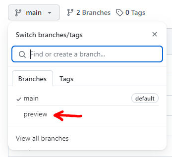

%toc%

<article>

# GitHub

[GitHub](https://github.com) is a web-based platform where you can upload your code into repositories. There is a free tier and a paid tier, but the free tier is not limited in time and gives you more than enough to get started.

GitHub makes code collaboration easy, which is why many open-source tools use it. GitHub utilizes Git, a distributed version control system, as its underlying technology to manage code repositories. This means that you can, for example, fork any repositories (make a copy of a public repository that will be stored in your account). You can modify the fork's code locally, and when you are done, you commit your changes to your fork on GitHub. Then, on GitHub, you can create a pull request to ask the original repository owner if they want to merge the code changes you made in your fork.

Besides hosting code GitHub also has other features like [GitHub Discussion](https://docs.github.com/discussions) which are forums you can enable for each of your repositories, [GitHub Issues](https://docs.github.com/issues/tracking-your-work-with-issues/about-issues) a ticket system to manage bug reports and feature requests, [GitHub Projects](https://docs.github.com/issues/planning-and-tracking-with-projects/learning-about-projects/about-projects) a tool to organize tickets, [GitHub Actions](https://docs.github.com/actions) to automate software workflows to do continuous integration (CI) and continuous deployment (CD), [GitHub Pages](https://docs.github.com/pages) is a hosting service where you can publish a static website for your project, [Codespaces](https://github.com/features/codespaces) which is a VSCode IDE in the cloud you can access via your browser and a bunch more features.

GitHub has a (free) [Basics](https://github.com/pricing) plan for developers who want to start a side project or just experiment with the service. The plan includes unlimited public and private repositories, 60 hours of CodeSpaces usage, 2000 execution minutes for GitHub Actions, and more.

There are alternatives to GitHub on the web, for example [GitLab](https://about.gitlab.com/) and [Bitbucket](https://bitbucket.org/)

> [!TIP]  
> There is a blog post series on [GitHub for beginners](https://github.blog/tag/github-for-beginners/) that you might want to check out, and there is also the [GitHub documentation portal](https://docs.github.com) if you want to learn more about GitHub  

> [!MORE]  
> [GitHub documentation portal](https://docs.github.com)  
> [GitHub pricing overview](https://github.com/pricing)  
> [GitHub pricing calculator](https://github.com/pricing/calculator)  

## Create an account (sign up)

To **sign up** on GitHub visit [github.com](https://github.com/) and click on "Sign Up"

Then, enter your email address, choose a strong password, and choose a username that has not yet been taken.

You will then get a mail with a code, copy the code, and enter it on the next step of the account creation on github.com

Then, answer the few questions they ask you or click on **Skip personalization** at the bottom of the page. When asked about the tools you plan on using, they ask this to know what plan is best for you. As you are new to GitHub, the free plan will be more than enough. This is why I would only check the first two checkboxes for **Collaborative coding** and **Automation and CI/CD**

Then click on **Continue for free**

> [!TIP]  
> The free GitHub plan is more than enough for a single developer. You get unlimited public and private repositories. The only features you don't get are mostly features needed when working in a team. Don't hesitate to start with the free plan. If you realize you need more later, you can still upgrade at that time.

> [!MORE]  
> [GitHub pricing](https://github.com/pricing)  

## Create a repository

If you have no repository yet, after creating an account on GitHub, you will land on your dashboard page, where GitHub will suggest that you create one.

If you have already created a repository in the past, click on your Avatar picture on the top right of the page and then on **Your repositories**, then click on the green **New** button on the top right.

Enter a **Repository name**, for example, **"nextjs-blog"**. Then, you can choose to make it private or keep it public.

> [!TIP]  
> I usually chose **public** because, at some point, you will probably want to share your work with others to ask for help or show them how cool your new project is. Also, if you are searching for a job having several projects, you worked on your GitHub account shows your potential future employer what a motivated dev you are

Next, you will have a checkbox for **Add a README file**. I recommend you DO NOT check this if you intend to use [Create Next App](https://www.npmjs.com/package/create-next-app) to set up a Next.js project as it will create a README.md itself and if it finds a README.md, it will ask you to delete it first, if however you don't use Next.js then feel free to check this box to have GitHub automatically create a new README.md file for your project

> [!TIP]  
> I always use the projects `README.md` file to document all the things I do in that project, for example, add a chapter to describe how to set up a local development version of your project, or for example, document the commands that can be used to do things like starting the local development server, you can also add notes about problems you faced and how you solved them
>
> In the future, you will be happy to have all that information regarding your project in one place, and if you share the project with someone else in the future, it will help them get started without having to ask you lots of questions or dig through code and configuration files to understand how your project is set up

Next, you have a select box called **Add .gitignore**. Click on it and then search for **Node** (which is the Node.js template for gitignore files). Finally, click on **Node** to select it.

> [!NOTE]
> If you chose **node** as a template for the `.gitignore` file, it will create a quite large `.gitignore` file that contains patterns for lots of common frameworks used when working with Node.js, one of them being Next.js
>
> This means that, for example, the `.next` directory (which contains temporary files that get created by the linting and compiling tools used by Next.js as well as the local development build of your project) will get excluded from commits (which is what we want, there is no need to share your own local build with others or have a copy in your repository)
>
> Another directory that will get excluded is the **node_modules** directory, which will contain local copies of all the packages you download from npm
>
> Finally, the other rules are less or not all useful in our case as they are for other frameworks like Nuxt.js or Astro, but they also do no harm, so you don't really need to touch that file to remove those rules

> [!TIP]  
> `.gitignore` files specify which files and directories should be excluded from tracking in a Git repository, meaning they will NOT be committed to your repository. Oh, and in case you wonder, yes, the .gitignore file itself should get committed (unlike the `.next` directory, which should not)

Next, you have another select box to **Chose a license**. You can skip this if you want, but if you want a license and are unsure which one, it is safe to choose the **MIT** license. It is a very popular license used by a lot of javascript projects. For example, here is the [MIT license page of Next.js](https://github.com/vercel/next.js/blob/canary/license.md), and here is the [MIT license page of React](https://github.com/facebook/react/blob/main/LICENSE)

> [!TIP]  
> I usually pick the **MIT** license if it is a project that I want to share but also keep the copyright or pick the **creative commons zero** ([CC0](https://creativecommons.org/public-domain/cc0/)) license, which is a license that defines that you are waiving your copyright rights and hence the code will be in the public domain

You are finally done. Now click on **Create repository** to create your new repository.

GitHub will now have created a repository for you with a .gitignore, a LICENSE, and, if you chose that option, a README.md file.

> [!MORE]  
> [github "Creating an account on GitHub" documentation](https://docs.github.com/en/get-started/quickstart/creating-an-account-on-github)  
> [github "Creating a new repository" documentation](https://docs.github.com/en/repositories/creating-and-managing-repositories/creating-a-new-repository)  
> [open source initiative MIT license page](https://opensource.org/license/mit/)  
> [creative commons zero (CC0) page](https://creativecommons.org/public-domain/cc0/)  

## Switch branches

GitHub will always show you the default branch of a repository first. Usually, that branch is called **main** (unless you changed it to something else; in the past, that branch was called master)

To switch to another branch, click on the branches dropdown (under the repository name) and select the branch you want to switch to. In this example, I will switch to a branch I named **review** (which is my simple git flow is the branch in which I commit code that is not ready yet to go into production)

</article>
