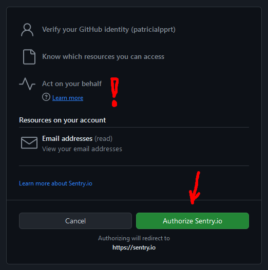

%toc%

<article>

# Sentry.io


Sentry.io is a cloud-based error monitoring service that helps developers capture and log errors (including stack traces and request information) in real-time (when they occur in production). They support a wide range of languages and frameworks through their ["sentry-*" opensource SDKs](https://github.com/getsentry) that are hosted on GitHub (the error logging SDKs for javascript, React, Capacitor, Next.js, and many more have an MIT license, but not all sentry packages do, for example, the [self-hosted version](https://develop.sentry.dev/self-hosted/) of sentry uses a license called [FSL](https://github.com/getsentry/fsl.software/tree/main) that is NOT an OSI-approved license). Beyond error tracking, Sentry also offers [performance monitoring](https://docs.sentry.io/product/performance) features as well as a feature called [Sessions Replays](https://sentry.io/for/session-replay/), which lets you capture and then replay the user interactions that happened before the error occurs, making it easier to reproduce an error and more.

Sentry.io has a (free) [Developer](https://sentry.io/pricing/) plan for developers who want to start a side project or just experiment with the service. The plan includes logs for up to 5000 errors, 10,000 performance metrics, and more.

> [!MORE]  
> [Sentry.io documentation](https://docs.sentry.io/)  
> [Sentry.io pricing](https://sentry.io/pricing/)  

## Create an account (sign up)

* Go to [sentry.io](https://sentry.io) and then click on **Get Started**
* Next, they ask you to create an account. You can do so using your email address, or you can connect via your account from a git provider. I chose GitHub (but feel free to click on Google or Azure DevOps if you already have such an account). I'm surprised they don't offer you to connect using [GitLab](https://about.gitlab.com/) or [Bitbucket](https://bitbucket.org/) 😲) as I intended to connect my GitHub account at some point anyway, as there are some features like converting an error log into a ticket that I want to try out (I usually try not to connect too many accounts which each other as a breach into one of them could potentially give the attacker access to the services that are linked to it too, but in this case, I chose to because in the next step, we need to connect our GitHub account anyway and allow Sentry.io to create tickets on GitHub for me)
  * for a guide about creating a GitHub account, check out my chapter [Create a GitHub account (sign up)](/web_development/posts/github#create-an-account-sign-up) in the GitHub post
* next, a pop-up window will open, asking you to authorize Sentry.io; there is one request they do, which is called [Act on your behalf](https://docs.github.com/en/apps/using-github-apps/authorizing-github-apps#about-github-apps-acting-on-your-behalf), this means that Sentry.io will be able to do tasks on your repositories, this is needed so that Sentry.io can, for example, help open / update issues in your repositories



* click on **Authorize Sentry.io**, and you will get redirected to Sentry.io
* on the next page, they ask us if we already have a Sentry.io account; if you do follow their instructions in the message, however, if, like me, you don't have an account yet, click on **New Account**
* next, we get another form (almost done... yeah yeah 😂); enter a user name for Sentry.io (you can either use your full name, or as I did, use your GitHub username, or use any display name you like, if already or later plan to work in a team, then I recommend you chose a name they will recognize)
* then you need to choose an **organization name**, and the placeholder of the field says company name; however, even if the name is **required**, it does NOT mean you can NOT sign up as an individual; organizations in Sentry.io are like organizations on GitHub, they don't solely represent companies but it can be any group you want, as I have no organization on GitHub either I just **MY_USER_NAME-projects as name**
* then check the mandatory terms checkbox
* for the email updates, choose whatever you prefer
* finally click on **Continue**

Next, we have finally arrived on their welcome page. You can either click on **Start** (which I recommend you do, but more on that in the next chapter) to get a guided tour on how to set up the sentry or your team, or you can click on the link below to skip the onboarding.

> [!MORE]  
> [sentry.io "Get Started" documentation](https://docs.sentry.io/product/sentry-basics/)  
> [GitHub "About GitHub Apps acting on your behalf" documentation](https://docs.github.com/en/apps/using-github-apps/authorizing-github-apps#about-github-apps-acting-on-your-behalf)  

## Create a Sentry.io project

If you just finished the previous chapter and clicked on **Start**, then you will have come to a page where you get asked to choose your main framework, else go to your Sentry.io account and on the left, click on **Projects** and then **Create project**

Choose whatever framework you like (during onboarding, you can only add one at a time. However, you will later be able to add more if you want. For example, add sentry for a PHP Backend API, sentry for React for your frontend code, and sentry for iOS and Android for your apps, if that's, is your technology stack)

Next, I chose an alert frequency. I kept the default value **Alert me on every new issue** (you can change this later)

Then you can **Name your project and assign a team to it**. I again kept the default values.

Finally, click on **Create Project**

Now click on **Configure SDK**

## Sentry.io SDK for Next.js installation

You can use the Sentry Wizard or follow their manual [setup toturial](https://docs.sentry.io/platforms/javascript/guides/nextjs/manual-setup/). I chose to use the Wizard as it guides you through setting up Sentry. I will also install some test files to ensure everything is working. If you chose manual, you may want to copy the DSN they give you at the end of the page (a Sentry DSN is an API key you will use when setting up your SDK)

> [!TIP]  
> Before using the wizard, I recommend committing your latest changes (if you haven't already) and doing a last sync before launching the sentry wizard, this way you will be able to see what stuff Sentry.io will add to your project, and you will see what got changed in existing files like the next.config.mjs file

In your VSCode terminal (or your preferred command line tool), type the following command:

```shell
npx @sentry/wizard@latest -i nextjs
```

Or, if you prefer to use the wizard without sending telemetry data to sentry.io (usage statics and crash reports), then add the `--disable-telemetry` option to the command, like so:

```shell
npx @sentry/wizard@latest -i nextjs --disable-telemetry
```

First, you will get asked if you accept installing the sentry wizard npm package. Press `y` to accept and press `Enter` to move on

After the installation, the wizard will automatically get launched, and it will start asking you questions about your setup preferences: 

**Are you using Sentry SaaS or self-hosted Sentry?** You probably want to choose **Sentry SaaS (sentry.io)** like I did (but if you are a company, though you might want to look at the hosted version), then press `Enter`.

**Do you already have an account?** chose **Yes** (if you did follow the previous chapter or already had an account before), then press `Enter` (or choose **No** if you have no account yet and follow the [account creation](#create-an-account-sign-up) process)

Then, the sentry wizard will ask you to log in, which will open the sentry login page in your default browser. Log into your account, then go back to your terminal.

**Select your Sentry project**, choose your Sentry Project from the list (when using the wizard, Sentry will have automatically created a project for the SDK you chose earlier for you; if, however, you don't see a Project listed here, you can check out the [Create a Sentry.io project](#create-a-sentryio-project) chapter to create a project first)

Now, Sentry will install the latest Sentry SDK for Next.js.

**Do you want to route Sentry requests in the browser through your NextJS server to avoid ad blockers?** Sentry wants to know if it should route its requests through your Next.js server. By doing so, Sentry attempts to bypass the block lists of adblocker addons that are installed in some browsers. This means Sentry will first send the client-side requests to a URL on your server, and then your server will forward the request to the Sentry API. I personally chose **Yes** as I want to increase the chance of getting bug reports but feel free to answer **No** if, for example, you don't want to have the extra traffic (on your server backend) that this redirect will cause

**Do you want to create an example page** chose **YES** (we will later use it to test the Sentry setup, and then we will delete it)

**Are you using a CI/CD tool to build and deploy your application?** chose **YES** (if you are using Vercel, GitHub actions, or any other CI/CD deployment tool); If you do NOT use one,  choose **NO**)

The Sentry.io Wizard will give you a **SENTRY_AUTH_TOKEN** string if you choose yes. If you use a CI/CD for your deployments, copy the token, and save it in a secure location, you will need this token later if, for example, you set up a custom GitHub action. You will want to add that token environment variable to your GitHub secrets. If you use another CI/CD service, check out their documentation to learn how to use that token to upload source maps to Sentry automatically.

CI/CD tools can authenticate themselves to Sentry.io using the **SENTRY_AUTH_TOKEN** environment variable and then use the Sentry.io API to automatically upload the source maps of your build to Sentry.io. Later, if there is a bug report on Sentry.io, it will be able to use the source maps instead of the minified build files to show you where the error occurred.

**Did you configure CI as shown above?** chose **YES**

After answering all questions, the Sentry SDK will edit your next.config.mjs file with sentry-specific configuration options, and it will have added several sentry.*.config files (to the root of your project) that contain environment-specific configurations

> [!NOTE]  
> If you use Vercel for your deployments, then you don't need to set the **SENTRY_AUTH_TOKEN** yourself; you can use the [Sentry integration for Vercel](https://vercel.com/integrations/sentry), which will set the Vercel environment variables for you  

Next, as suggested by the wizard at the end of the installation process, it is recommended to start the development server using the `npm run dev` command, and then we visit the Sentry example page in our browser at [http://localhost:3000/sentry-example-page](http://localhost:3000/sentry-example-page)

On that page, hit the **Throw Error!** button and then click on the link just below to **visit your Sentry projects issues page**

Now wait for the backend and frontend errors to appear (this can take a few minutes, which is a good time to refresh your cup of coffee ☕ (or whatever beverage you prefer))

As soon as the two errors appear, feel free to click on them and have a look at what error logging on Sentry.io looks like

Before we commit/sync all the changes Sentry.io did in our project, **delete** the `app\sentry-example-page\` folder, including the `page.jsx` **test page**, and then also delete the `app\api\sentry-example-api\` folder including the `route.js` **API test route** file that Sentry.io created to test the error logging, you will not need them anymore.

## Sentry.io for Next.js configuration

Sentry.io can be customized a lot and has several places to change the default configuration.

Sentry wizard has edited our `next.config.mjs`, and it should now look like this:

```js title="next.config.mjs"
import { withSentryConfig } from '@sentry/nextjs'

/** @type {import('next').NextConfig} */
const nextConfig = {
    poweredByHeader: false,
};

export default withSentryConfig(nextConfig, {
    // For all available options, see:
    // https://github.com/getsentry/sentry-webpack-plugin#options

    org: "YOUR_ORGANISATION_NAME",
    project: "YOUR_PROJECT_NAME",

    // Only print logs for uploading source maps in CI
    silent: !process.env.CI,

    // For all available options, see:
    // https://docs.sentry.io/platforms/javascript/guides/nextjs/manual-setup/

    // Upload a larger set of source maps for prettier stack traces (increases build time)
    widenClientFileUpload: true,

    // Transpiles SDK to be compatible with IE11 (increases bundle size)
    transpileClientSDK: true,

    // Route browser requests to Sentry through a Next.js rewrite to circumvent ad-blockers.
    // This can increase your server load and your hosting bill.
    // Note: Check that the configured route will not match with your Next.js middleware, otherwise reporting of client-
    // side errors will fail.
    tunnelRoute: "/monitoring",

    // Hides source maps from generated client bundles
    hideSourceMaps: true,

    // Automatically tree-shake Sentry logger statements to reduce bundle size
    disableLogger: true,

    // Enables automatic instrumentation of Vercel Cron Monitors. (Does not yet work with App Router route handlers.)
    // See the following for more information:
    // https://docs.sentry.io/product/crons/
    // https://vercel.com/docs/cron-jobs
    automaticVercelMonitors: true,
})
```

> [!NOTE]  
> By default, the options that the wizard set for us are good enough. As soon as you have the time, I recommend checking out the [Extend your Next.js Configuration](https://docs.sentry.io/platforms/javascript/guides/nextjs/manual-setup/#extend-your-nextjs-configuration) Sentry.io documentation, which explains what each option does

Another file that got added to the root of our project is `sentry.client.config.ts`, which is used to configure Sentry.io for **client components**. Check out the [Next.js SDK Configuration Options](https://docs.sentry.io/platforms/javascript/guides/nextjs/configuration/options/) documentation for more details about each option. I slightly modified my configuration file to be like this:

```ts title="sentry.client.config.ts" showLineNumbers {3-12} {18} {23} {27} {38}
import * as Sentry from '@sentry/nextjs'

let replaysOnErrorSampleRate = 0
let tracesSampleRate = 0.1

if (process.env.NODE_ENV === 'production') {
    replaysOnErrorSampleRate = 1
}

if (process.env.NODE_ENV === 'development') {
    tracesSampleRate = 0
}

Sentry.init({
    dsn: 'YOUR_SENTRY_DSN_URL',

    // Adjust this value in production, or use tracesSampler for greater control
    tracesSampleRate: tracesSampleRate,

    // Setting this option to true will print useful information to the console while setting up Sentry.
    debug: false,

    replaysOnErrorSampleRate: replaysOnErrorSampleRate,

    // This sets the sample rate to be 10%. You may want this to be 100% while
    // in development and sample at a lower rate in production
    replaysSessionSampleRate: 0,

    // You can remove this option if you're not planning to use the Sentry Session Replay feature:
    integrations: [
        Sentry.replayIntegration({
            // Additional Replay configuration goes in here, for example:
            maskAllText: true,
            blockAllMedia: true,
        }),
    ],

    environment: process.env.NODE_ENV ? process.env.NODE_ENV : '',
})
```

Lines 3-12: I added two variables for the **replaysOnErrorSampleRate** and the **tracesSampleRate**, replaysOnErrorSampleRate I set to zero by default to not produce replays when not in production, then line 6-8 I added a check to verify if the current environment is **production** and if it is I tell Sentry to always make a replay if there is an error (be careful with this option, in the free plan you only have 50 replays per month, which is why I only turn it on in production, also in development it is usually the developer themself that triggers the error so there is not really a need for a replay), the tracesSampleRate I set it to 0.1, meaning 10% of the traces will get sent to Sentry but then line 10-12 I disable them in development (this is to ensure no performance metrics are getting calculated when the app is running on a local computer, to check local performance it is preferred to use the developer tools), you may want a lower or higher value depending on what plan you are on and then check if you reach your limits or not and then adjust over time

Line 27: I completely disabled **replaysSessionSampleRate**, meaning there will be no replays being made when there is no error; the free plan has 50 replays per month, and I prefer to keep all the replays for cases where there is a bug

Line 38: I pass the environment to Sentry, meaning Sentry will know if the environment is preview or production (that value is based on the Vercel environment on which Next.js got deployed)

> [!WARN]  
> If you copy paste the `sentry.client.config.ts` above into your project make sure you update the **YOUR_SENTRY_DSN_URL** placeholder with your own Sentry DSN  

`sentry.edge.config.ts` are the options for when Next.js uses the [Vercel Edge Network](https://vercel.com/docs/edge-network/overview). I kept that file, but feel free to adjust any values to fit your use case.

`sentry.server.config.ts` is again similar to the previous two, just this one is specifically for Next.js server-side options. I also kept this file as is

There is, however, one option in the server configuration that is commented out that you might want to consider. The option lets you use the [Spotlight js](https://spotlightjs.com/) package by Sentry. If you're going to use it, I recommend checking out the documentation to [install and setup Spotlight in a Next.js project](https://spotlightjs.com/setup/nextjs/)

> [!MORE]  
> [Sentry.io "Extend your Next.js Configuration" documentation](https://docs.sentry.io/platforms/javascript/guides/nextjs/manual-setup/#extend-your-nextjs-configuration)  
> [Sentry.io "Next.js SDK Configuration" documentation](https://docs.sentry.io/platforms/javascript/guides/nextjs/configuration/options/)  
> [Spotlight js "Using Spotlight with Next.js" documentation](https://spotlightjs.com/setup/nextjs/)  

### Sentry v8 update

On [May 13, 2024 Sentry released v8](https://github.com/getsentry/sentry-javascript/releases/tag/8.0.0) of their Javascript SDK, version 8 now makes use of the [Next.js "Instrumentation"](https://nextjs.org/docs/app/building-your-application/optimizing/instrumentation) to integrate monitoring and logging tools into a Next.js app

However as of now (1 day after the first release) the [documentation](https://docs.sentry.io/platforms/javascript/guides/nextjs/manual-setup/#create-client-initialization-config-file) and [Wizard](https://github.com/getsentry/sentry-wizard) have not been fully updated yet ([Issue #12044](https://github.com/getsentry/sentry-javascript/issues/12044)), so if after using the Wizard and the starting the development server (using npm run dev) you get the following message(s) in your terminal (command line tool):

> \[@sentry/nextjs] It appears you've configured a `sentry.server.config.ts` file. Please ensure to put this file's content into the `register()` function of a Next.js instrumentation hook instead. To ensure the correct functionality of the SDK, `Sentry.init` must be called inside `instrumentation.ts`. Learn more about setting up an instrumentation hook in Next.js: https://nextjs.org/docs/app/building-your-application/optimizing/instrumentation. You can safely delete the `sentry.server.config.ts` file afterward.
> \[@sentry/nextjs] It appears you've configured a `sentry.edge.config.ts` file. Please ensure to put this file's content into the `register()` function of a Next.js instrumentation hook instead. To ensure the correct functionality of the SDK, `Sentry.init` must be called inside `instrumentation.ts`. Learn more about setting up an instrumentation hook in Next.js: https://nextjs.org/docs/app/building-your-application/optimizing/instrumentation. You can safely delete the `sentry.edge.config.ts` file afterward.

Then, you need to do a little bit of manual work to fully upgrade to **Sentry v8** and support **Next.js "Instrumentation"**. This is because the Sentry Wizard has not yet been fully updated yet. It will create an instrumentation.ts file, but it will import the two configuration files instead of putting the content of those 2 configuration files into the instrumentation.ts file.

First, open the `instrumentations.ts` file in the root of your project and then open the 2 Sentry configuration files `sentry.edge.config.ts` and `sentry.server.config.ts` (that are also in the root of your project) as well.

Now copy the **Sentry.init** code of the `sentry.edge.config.ts` file and replace the `await import('./sentry.edge.config')` in the `instrumentations.ts` file with the code you just copied, then do the same with the `sentry.server.config.ts`, next add `import * as Sentry from '@sentry/nextjs'` on top of the `instrumentations.ts` file and finally remove the **async** from the `export function register() {` line.

When done, your final `instrumentations.ts` file should look like this:

```ts title="instrumentation.ts"
import * as Sentry from '@sentry/nextjs'

export function register() {
    if (process.env.NEXT_RUNTIME === 'nodejs') {
        Sentry.init({
            dsn: 'YOUR_SENTRY_DSN_URL',

            // Adjust this value in production, or use tracesSampler for greater control
            tracesSampleRate: 1,

            // Setting this option to true will print useful information to the console while setting up Sentry.
            debug: false,

            // Uncomment the line below to enable Spotlight (https://spotlightjs.com)
            // spotlight: process.env.NODE_ENV === 'development',

        })
    }

    if (process.env.NEXT_RUNTIME === 'edge') {
        Sentry.init({
            dsn: 'YOUR_SENTRY_DSN_URL',

            // Adjust this value in production, or use tracesSampler for greater control
            tracesSampleRate: 1,

            // Setting this option to true will print useful information to the console while setting up Sentry.
            debug: false,
        })
    }
}
```

> [!WARN]  
> If you copy paste the `sentry.client.config.ts` above into your project make sure you update the **YOUR_SENTRY_DSN_URL** placeholder with your own Sentry DSN  

One final step is to delete both the `sentry.edge.config.ts` and `sentry.server.config.ts` files, as they are no longer needed.

Congratulations 🎉 you just upgraded to Sentry v8

If you liked this post, please consider making a [donation](https://buymeacoffee.com/chriswwweb) ❤️ as it will help me create more content and keep it free for everyone

#### Sentry v7 to v8 migration

If you had Sentry v7 already installed in your project and now want to upgrade to Sentry v8, I recommend you use the [Sentry migration codemod](https://docs.sentry.io/platforms/javascript/migration/v7-to-v8/#migration-codemod) which will automatize the upgrading process and hence simplify the migration process a lot

> [!MORE]  
> [Sentry.io "Migration Codemod to migrate from 7.x to 8.x" documentation](https://docs.sentry.io/platforms/javascript/migration/v7-to-v8/#migration-codemod)  

## Investigating Sentry.io dropped requests

When trying to log my CSP reports in Sentry.io, I could see that some reports got dropped, but the stats page did not give me the exact reason.

To find the exact reason why a request was dropped, you can use the Sentry.io API.

To get some data about the events, you can use Curl to make the following request:

```shell
curl https://sentry.io/api/0/organizations/{organization_slug}/stats-summary/ \
 -H 'Authorization: Bearer <auth_token>'
```

You will, however, need an auth token, which you can get to create a custom **integration** for your organization, like so:
 
* to get an auth token, go to "Settings", then in the section "Developer Settings," click on "Custom Integrations"
* then click on "Create New Integration", choose "Create Internal Integration", and click on "Next"
* then add a project name, and then under "Permissions" for "Issue & Event", choose "Read" then click on "Save Changes"
* then, on the Integration page, scroll down and click on "New Token", copy the token (you will need it later to make API requests), and then click on "Done"
* finally, click on save changes

Now that you have your auth token, you can make an API call like this (replace MY_ORGANIZATION with the name of your organization on Sentry.io and replace xxx111 at the end with your actual auth token):

```shell
curl 'https://sentry.io/api/0/organizations/MY_ORGANIZATION/stats-summary/?field=sum(times_seen)&statsPeriod=24h' -H 'Authorization: Bearer xxx111'
```

On Mac / Linux, use the **terminal** or your favorite command line tool to execute the command. On Windows, I recommend using **Git Bash**

This will hopefully help you understand if your requests got filtered, were invalid, or if there was another reason why they got dropped.

> [!MORE]  
> [Sentry.io "Sentry API organization events" documentation](https://docs.sentry.io/api/organizations/retrieve-event-counts-for-an-organization-v2/)  

## Disable the "reports from localhost" filter

If you want to disable (or re-enable) the Sentry.io reports from the localhost filter, do this:

* visit Sentry.io and log in
* in the left navigation on the bottom, click on **Settings**
* then, in the Settings navigation on the left, click on **Projects**
* click on the project name
* then in navigation on the left, under **PROCESSING**, click on **Inbound Filters**
* on that page, there is an option called **Filter out events coming from localhost**. Disable that option to not filter reports coming from localhost anymore

</article>
