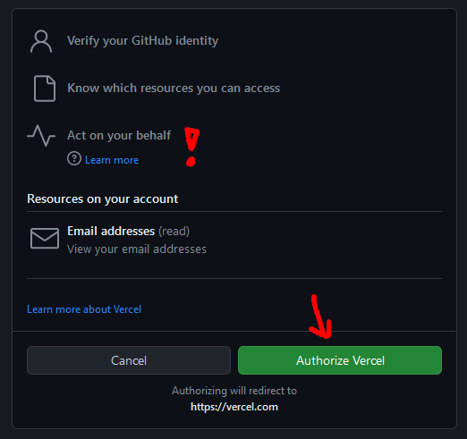
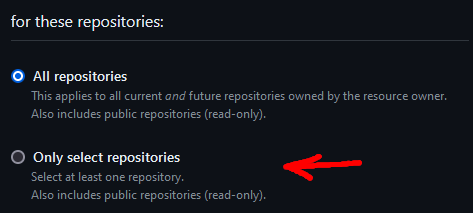
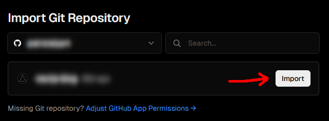

%toc%

<article>

# Vercel.com

**Vercel.com** is a cloud platform that automates building, deploying, and scaling of your Javascript project. Vercel can be set up to watch your GitHub repository and every time you merge a pull request it can trigger a new build process. When the build process is done it will automatically deploy the code (depending on the branch it will either deploy it as a staging or production version).

Vercel has a (free) [Hobby](https://vercel.com/pricing) plan, for developers that want to start a side project or just experiment with the service, it includes 6000 minutes of build execution for Automatic CI/CD deployments, 100 GB of bandwidth usage and more

> [!MORE]  
> [Vercel documentation](https://vercel.com/docs)  
> [Vercel pricing](https://vercel.com/pricing)  

## Create an account (sign up)

* visit [vercel.com](https://vercel.com/)
* click on **Sign Up** in the top right
* Select the [Hobby](https://vercel.com/pricing) plan
* then a field pops up asking you for your name, enter a name (you can either use your full name, or as I did use your GitHub username, or use any display name you like, if already or later plan to work in a team, then I recommend you chose a name they will recognize)
* next they ask you to connect your git provider (or use your email address, by clicking on "Continue with Email") to create a new account, I intended to connect GitHub account so I clicked on the GitHub button (or click on [GitLab](https://about.gitlab.com/) or [Bitbucket](https://bitbucket.org/) if that is the git provider hosting your code), I usually try to not connect too much accounts which each other as a breach into one of them could potentially give the attacker access to the services that are linked to it too, but in this case I chose to because in the next step we need to connect our GitHub account anyway and allow Vercel to access repositories
  * for a guide about creating a GitHub account check out my chapter [Create a GitHub account (sign up)](/web_development/posts/github#create-an-account-sign-up) in the GitHub post
* next a pop up window will open, asking you to authorize Vercel, there is one request they do which is called [Act on your behalf](https://docs.github.com/en/apps/using-github-apps/authorizing-github-apps#about-github-apps-acting-on-your-behalf), this means that Vercel will be able to do tasks on your repositories, this is needed so that Vercel can fetch your code after you made a new commit or pull request and deploy the code on their servers (you will later get asked to give access to one or more repositories, meaning you can define which repositories Vercel can access and which not)

* click on **Authorize Vercel** and you will get redirected to your new vercel account dashboard

> [!MORE]  
> [vercel.com "Create an Account" documentation](https://vercel.com/docs/accounts/create-an-account)  
> [GitHub "About GitHub Apps acting on your behalf" documentation](https://docs.github.com/en/apps/using-github-apps/authorizing-github-apps#about-github-apps-acting-on-your-behalf)  

## Add a new project (repository)

If you are not yet on the **new project** page, in the top left navigation click on **Overview** and then below on the right click on **Add New...** and select **Project**

### Install GitHub on Vercel

On this page you will have a Box with the title **Import Git Repository**, if you already installed GitHub in the past then you will see a list of repositories and in that case you can jump to the next chapter [Import a Repository](#import-a-repository) (if you already installed GitHub but the repository is missing in the list then click on the **Adjust GitHub App Permissions** link to add access to that repository)

Because we have already linked our GitHub account when signing up we also have **GitHub** button, click on the button to start the process

Next Vercel will open a modal asking you to give access to one or more repositories, I recommend giving only access to the repository in which you store the code you want to deploy, to do so click on the radio button next to **Only select repositories**

Now click on the **Select repositories** select box and select your git repository

Finally click on **Install** at the bottom of the modal

### Import a Repository

Back on the new project page, you will now see that your repository has been added to the **Import Git Repository** list, click on **Import** button on the right of your repository name

Now you will be on a new page **Configure Project**, you can change the **Project Name** of the project (I left it as is, as I like it to match the name of my repository)

Next you can chose a **Framework Preset**, select **Next.js** (or the framework you chose for your project)

The next option **Root Directory** you can leave it as is (if you use a monorepo that host multiple projects you may want to set the root to the directory in which you placed your project)

The **Build and Output Settings** we also don't need to touch it, as we chose a **Framework Preset** earlier these values are already set (if you know what you are doing and depending on what Framework you chose you may want to adapt those values)

The **Environment Variables** is something we have no use for just yet, it is however an interesting feature that let's you add environment variables to your project (instead of having an .env file in your project, you set the key value pair here and can later download a copy of those variables into your development environment)

Finally click on **Deploy** (unfortunatly the only way to **save** the imported project is to click deploy which will start a deployment, you may however not be ready to make your first deployment and maybe your main branch is still empty and your code is in another branch, this doesn't matter, still proceed and click Deploy, if the main branch is empty the deployment will just fail but your project will be saved, you can also click on **Cancel Deployment** if you want)

</article>