import { sharedMetaDataArticle } from '@/shared/metadata-article'

export const metadata = {
    title: frontmatter.title,
    keywords: frontmatter.keywords,
    alternates: {
        canonical: frontmatter.permalink,
    },
    openGraph: {
        ...sharedMetaDataArticle.openGraph,
        images: [{
          type: "image/png",
          width: 1200,
          height: 630,
          url: '/web_development/og/posts_vscode/opengraph-image'
        }],
        url: frontmatter.permalink,
        section: frontmatter.section,
        publishedTime: frontmatter.published,
        modifiedTime: frontmatter.modified,
        tags: frontmatter.keywords,
    },
}

%toc%

<article>

# VSCode


**VSCode** (Visual Studio Code) is a versatile Integrated Development Environment (IDE). VSCode is amazing to develop projects using Javascript / Typescript (and HTML, CSS) but it supports a wide range of other languages. I like VSCode because it has a lot of great features like smart code completion called [Intellisense](https://code.visualstudio.com/docs/editor/intellisense), code [refactoring](https://code.visualstudio.com/docs/editor/refactoring)...

VSCode also comes with great [debugging](https://code.visualstudio.com/docs/editor/debugging) tools, meaning you can debug your frontend but also backend code within VSCode. For example, managing breakpoints is similar to debugging using the Chrome developer tools debugging tools. The [VSCode debugger](https://code.visualstudio.com/docs/editor/debugging) launch configuration json file (launch.json) makes it very easy to adapt the **debugger** to any project, and the debugger **launch.json** can then be shared as part of your git repository, to make it very easy for other developers that will work on your project, and that also use VSCode, to use the debugger without having to configure it themselves

What is also great is that VSCode has [integrated source control (git) support](https://code.visualstudio.com/docs/sourcecontrol/overview). To just name a few, **Staging**, **switching** between branches, and **pushing** are all supported by VSCode, meaning we will be able to push our commits directly to GitHub from within VSCode with just one click. It also makes resolving conflicts and merging very easy using its visual diff (as opposed to using git in the terminal or any other command line tool, which is another option if you prefer).

VSCode also has an [extensions marketplace](https://code.visualstudio.com/docs/editor/extension-marketplace), which means that if one feature is not in VSCode core, you will probably find an extension that suits your needs.

> [!NOTE]  
> VSCode (the project itself) is open source, and everyone can access and contribute to its source code in the [VSCode GitHub repository](https://github.com/microsoft/vscode). The source code is licensed using the MIT license. VSCode, the build you download from Microsoft, uses the [Microsoft Software License](https://code.visualstudio.com/license).
>  
> It is similar to how Chrome (not open source) is the Chromium (open source) build from Google, which contains proprietary pieces, like the Chrome logo image, but also pre-installed extensions or codecs that are not part of Chromium, the fully open source variant.
>  
> So if you want an opensource version of the VSCode build, I recommend you check out [VSCodium](https://vscodium.com/) instead

> [!MORE]  
> [VSCode documentation](https://code.visualstudio.com/docs)  
> [VSCode youtube channel](https://www.youtube.com/@code)  

## Installation

Head over to the [VSCode download page](https://code.visualstudio.com/Download) and download the latest version for your operating system (OS)

## Turn on settings sync (using your GitHub account)

Click on the **Accounts** icon on the left in the **Activity bar** (if you have already customized VSCode, your Activity bar might be in another location)

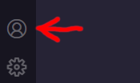

* now click on **Backup and Sync Settings...**
* then, on the top center of your VSCode, click on the **Sign in**
* then chose the option **Sign in with GitHub**
* this will open a window in your default browser; log in to your GitHub account via the web (if you are not already logged in)
* after you have logged in, the second step on GitHub will ask you to **Authorize GitHub for VS Code** (if you haven't already done so previously); click on the green **Authorize Visual-Studio-Code** button to accept
* then a modal box will appear in your browser asking you to open VSCode again (now that the GitHub login and authorization process is done, this will bring you back into VSCode)
* that's it; you have connected your GitHub account in VSCode

If this is the first time you install VSCode, you will see a modal box in the right corner asking you if you want to sync your settings in the cloud. Click on the **Turn on Settings Sync...** button. Doing so will allow VSCode to synchronize your VSCode settings across multiple devices (for example, between your desktop computer and your laptop)

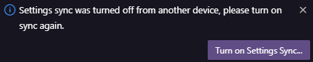

## Cloning your GitHub repository in VSCode

There are several ways to clone a git (GitHub/GitLab/…) repository in VSCode. I will describe three options. The first two are simple and very similar. For those two, I will use the integrated VSCode source control tool. For the third option, I will use the terminal (you can use any command-line tool you prefer).

**Option 1**: using the the **welcome** screen

* if you just opened VSCode you will see a **welcome** screen, click on **Clone git repository...**

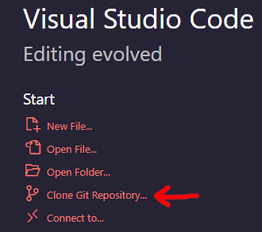

**Option 2**: using the the **Source Control** tool

* click on the **Source Control** icon on the left in the **Activity bar** (if you have already customized VSCode, your Activity bar might be in another location) or use the keyboard shortcut `Ctrl+Shift+G` (macOS: `⇧⌘G`, Linux: `Ctrl+Shift+G`)


* then click on **Clone Repository**

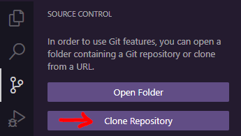

Option 1 & 2 next steps:

* then click on **Clone from GitHub**

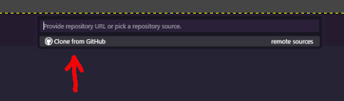

**If you are not yet logged in with your GitHub account:**

* VSCode will ask you to allow it, to sign you in with GitHub:

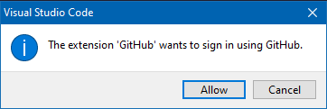

* click on the **Allow** button
* this will open a window in your default browser; log in to your GitHub account via the web (if you are not already logged in)
* after you have logged in, the second step on GitHub will ask you to **Authorize GitHub for VS Code** (if you haven't already done so previously); click on the green **Authorize Visual-Studio-Code** button to accept
* then a modal box will appear in your browser asking you to open VSCode again (now that the GitHub login and authorization process is done, this will bring you back into VSCode)

**As soon as you are logged in with your GitHub account:**

* in VSCode on top, you will now see a list of all your GitHub repositories; select your repository from the list
* now choose a local directory in which you will save the clone of your repository (something like /users/YOUR_USERNAME/my_github_projects, no need to create a directory with the project name; VSCode will do that when cloning the repository), then click on **Select as Repository Destination**
* then, in the bottom right, you will see a modal box showing you that the cloning process is underway
* when the cloning is done, VSCode will ask you if you want to open the cloned repository; click on **Open** to open it in the current VSCode or click on **Open in New Window** to open another VSCode instance

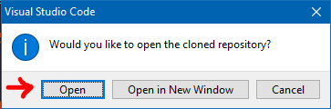

* next, (if you still need to trust that directory) you will see the following modal box asking you **do you trust the authors of the files in this directory**? Because all the projects in the parent directory are our own, we will check the box next to **Trust the authors...** and then click on **Yes, I trust the authors** (if it is a third-party project you are cloning then the VSCode recommends not to trust it and only enable those extra features if you need them. Storing third-party projects (you have cloned) in a directory separate from your own projects is recommended. Of course, all the usual security recommendations to protect your computer apply too, like ensuring you have an antivirus installed, ...)

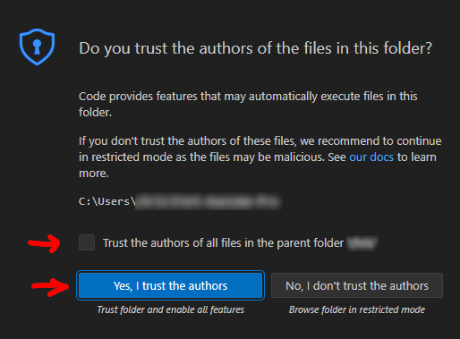

> [!TIP]  
> To learn more about "workspace security", I recommend reading the [VSCode "Workspace Trust" documentation](https://code.visualstudio.com/docs/editor/workspace-trust)

**Option 3**: cloning a repository using the VSCode terminal (or your preferred command line tool):

* the third option is to visit [GitHub](https://github.com/)
* then, on the top right click on your Avatar image
* in the side menu, click on **Your repositories**
* then click on the name of your repository
* now, on the top right of your repository page, there is a green dropdown button labeled **Code**
* click on it and then click on the **HTTPS** tab
* copy the **https** URL
* now go back to VSCode
* open a terminal view; if you don't know how check out the [VSCode terminal](#open-a-vscode-terminal) chapter, and if you prefer to use another command line tool, feel free to do that
* go into the directory in which you want to store a local copy of your projects, for example, by using this command: `cd MY_PATH_TO_MY_REPOSITORIES`
* then type the following command to clone the repository: `git clone THE_REPOSITORY_URL_YOU_COPIED_ON_GITHUB`
* now click on the **Source Control** icon on the left in the **Activity bar** (if you have already customized VSCode, your Activity bar might be in another location) or use the keyboard shortcut `Ctrl+Shift+G` (macOS: `⇧⌘G`, Linux: `Ctrl+Shift+G`)
* then click on **Open Folder** and select the folder into which you just cloned your repository

Congratulations 🎉 you now have a local copy of your GitHub repository

> [!MORE]  
> [VSCode "git source control" documentation](https://code.visualstudio.com/docs/sourcecontrol/intro-to-git)  

## Open a folder in VSCode

* On the welcome screen, click on **Open Folder**; if you have no welcome screen, you can also (on top) click on **File** and then **Open Folder**; another option to open a folder is to use the keyboard shortcut `Ctrl+O` (macOS: `⌘O`, Linux: `Ctrl+O`)
* Chose the same folder you chose when cloning your GitHub repository (if you followed the chapter [Cloning your GitHub repository in VSCode](#cloning-your-github-repository-in-vscode), it should be something like /users/YOUR_USERNAME/my_github_projects/MY_PROJECT) and then click on **Select folder**
* If successful, you should now be able to see a list of files on the left

## Open a file in VSCode

To open a file, click on it in the list of files in the left sidebar.

If you click once on a filename, you will notice that the filename in the tab is written in **italic**. This is because if you click only once on a filename, VSCode will open it in **preview mode**, meaning that if you do nothing and click on another filename, then VSCode will close the file and instead open the new file you just clicked on. This is nice if you quickly want to lock at the content of some files and don't want to end up with dozens of open files that you then need to close manually.

To ensure a file stays open, click twice on the name. You will notice that the filename on top is no longer in italics. Now, if you click on another file, the previous one will NOT get closed automatically.

An alternative way for the file to stay open is to click on the name once and then start editing it. As soon you start editing it, the name on top will go from italic to regular, and the file will not get closed automatically anymore.

## Save a file in VSCode

The easiest way to save a file in VSCode is to use the keyboard shortcut `Ctrl+S` (macOS: `⌘S`, Linux: `Ctrl+S`). Another way is to click on **File** in the top navigation and then **Save**

> [!MORE]  
> [VSCode "Editing basics" documentation](https://code.visualstudio.com/docs/editor/codebasics)  

## Comment out / uncomment code

One of the must used shortcuts is probably the **comment out / uncomment toggle shortcut**

* first select the code you want to comment out or uncomment
* then either use the shortcut `Ctrl+#` (macOS: `⌘#`, Linux: `Ctrl+#`)
* or if you prefer using the command, [open the commend palette](#vscode-command-palette), start typing `Toggle Line Comment` until the command appears in the list and then select it.

VSCode will **comment out** out the select lines of code if they are NOT commented out yet, if they are commented out VSCode will uncomment them

VSCode will try to use language specific comments, meaning it will for example use `<!-- HTML comments -->` in HTML and `// single-line comments` in javascript (typescript). 

> [!NOTE]  
> If you prefer using a multi-line comment, then use the related **toggle block comment** command shortcut `Ctrl+Shift+A` (macOS: `⇧⌘A`, Linux: `Ctrl+Shift+A`).

## Open a VSCode terminal

VSCode has a terminal (command line tool) that, by default, is closed. To open the terminal, click on **View** in the top navigation bar and then **Terminal**

Or use the keyboard shortcut `` Ctrl+` `` (macOS: `` ⌃` ``, Linux: `` Ctrl+` ``)

The third option is to use the command palette, [open the commend palette](#vscode-command-palette), start typing `view toggle terminal` until the command appears in the list and then select it.

> [!MORE]  
> [VSCode "terminal" documentation](https://code.visualstudio.com/docs/terminal/basics)  

## VSCode command palette

To open the VSCode command palette, use the keyboard shortcut `Ctrl+Shift+p` (macOS: `⇧⌘P`, Linux: `Ctrl+Shift+P`)  

Or you can use the VSCode navigation on top, click on **View**, and then click on **Command Palette...**

> [!MORE]  
> [VSCode "User Interface > Command Palette" documentation](https://code.visualstudio.com/docs/getstarted/userinterface#_command-palette)  

## VSCode diff (compare) two files

It is easy to compare two files using a diff in VSCode.

On the right make sure the file explorer is open

Then right click on a file and select **Select for Compare**

Then right click on another file and choose **Compare with Selected**

This will open a nice diff panel with both files next to each other, the changes in both files will be highlighted and you have action buttons to revert changes

### files are in the wrong order

You can easily swap both files by using the **Swap Left and Right Side** button on the top right of the diff panel (it is a button with an icon that has a top arrow pointing to the right and and below an arrow pointing to the left):

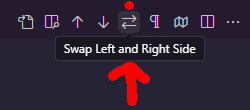

You can also achieve this by using the [VSCode command palette](#vscode-command-palette), when open start typing **Compare** and then select the **Compare: Swap Left and Right Editor Side** command (command is only available when a diff panel is open)

## VSCode typescript version

To be able to switch to the **workspace typescript** version, you need first to open a typescript file (if you are currently in a NON-Typescript file like the README.md, then the VSCode command palette will NOT show you the option). It doesn't matter which typescript file you open. Just open the first one you see

Next, open the VSCode command palette (if you don't remember how to do it, check out the [VSCode command palette](#vscode-command-palette) chapter above)

Then, in the command palette, type `TypeScript Version` and click on **TypeScript: Select TypeScript Version...**

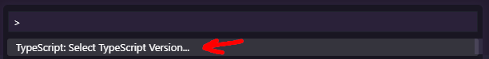

Finally select **workspace version**

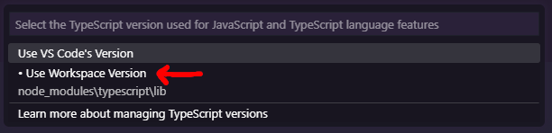

## VSCode settings

### Open the settings

To access the VSCode settings, click on **File** in the top navigation bar, then click on **Preferences** and select **Settings**

Or use the keyboard shortcut `Ctrl+,` (macOS: `⌘,`, Linux: `Ctrl+,`)

The third option is to use the command palette, use the keyboard shortcut `Ctrl+Shift+p` (macOS: `⇧⌘P`, Linux: `Ctrl+Shift+P`) to open the command palette and then type `preferences: open settings`

> [!MORE]  
> [VSCode "settings" documentation](https://code.visualstudio.com/docs/getstarted/settings)  

### edit settings (user/workspace)

To edit settings first [open the settings UI or file version](#open-the-settings)

You have two types of settings:

**user settings:** will apply to all your projects; these settings are saved in the computer user directory; these settings get synchronized between all VSCode tools where you are signed in

user settings locations:

* **Windows**: %APPDATA%\Code\User\settings.json.  
* **macOS**: $HOME/Library/Application\ Support/Code/User/settings.json.  
* **Linux**: $HOME/.config/Code/User/settings.json.  

**workspace settings:** will only apply to the project (workspace) that is currently open in VSCode; those settings get saved into a `settings.json` file that is located in a `.vscode` directory of your project (workspace), meaning that you can commit that directory with your source code to share the settings with others

Two tabs at the top of the settings page allow you to switch between user and workspace settings.

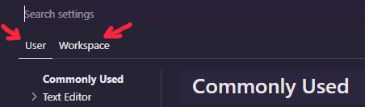

On the top right, you have an icon to switch between the UI version of the settings and the settings file.

If you are in the UI version, you will see an icon to switch to the file version:

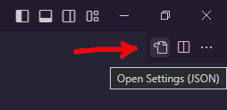

And if you are in the file version, you will see an icon to switch to the UI version:

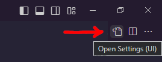

> [!MORE]  
> [VSCode "settings sync" documentation](https://code.visualstudio.com/docs/editor/settings-sync)  

## VSCode indentation

My editor keep replacing tabs with 2 spaces instead of 4

So I checked my default VSCode **user** settings (if you don't know how to access the **user** settings, have a look at the previous chapter)

I searched for the keyword **"Editor"** and saw that the **"Editor: Tab Size"** was already set to **4** (spaces) and **"Editor: Insert Spaces"** was enabled

But when scrolling further down I noticed that there is an option that can overwrite both, it is called **"Editor: Detect Indentation"** and is enabled by default, here is what it does:

> Controls whether Editor: Tab Size and Editor: Insert Spaces will be automatically detected when a file is opened based on the file contents.

So I disabled this option, then went back to my file, did a right and chose **Format Document** (you can also use the shortcut `Shift+Alt+F` (macOS: `⇧⌥F`, Linux: `Ctrl+Shift+I`) instead) and this time my indentation was what I expected

If you prefer to change this option on a workspace level, then edit your settings.json that is in the .vscode folder at the root of your project and add:

```json
{
    "editor.detectIndentation": false
}
```

## VSCode themes

The VSCode appearance can be easily customized using themes. My personal favorite is [SynthWave '84](https://marketplace.visualstudio.com/items?itemName=RobbOwen.synthwave-vscode)

If you haven't found your perfect theme yet, I recommend checking out [vscodethemes.com](https://vscodethemes.com/), where you can browse and preview a lot of great themes for VSCode

> [!MORE]  
> [VSCode "themes" documentation](https://code.visualstudio.com/docs/getstarted/themes)  
> [vscodethemes.com](https://vscodethemes.com/)  

### Manually adjust theme colors

You can change VSCode theme colors per user or project in the VSCode settings. If you don't know yet how to open the settings for a user/workspace, then check out the [VSCode settings](#vscode-settings) chapter

For a complete list of items that can be customized, check out the [VSCode theme color](https://code.visualstudio.com/api/references/theme-color) reference page

> [!MORE]  
> [VSCode "theme color" reference](https://code.visualstudio.com/api/references/theme-color)  

#### Changing the VSCode scrollbar color

I wanted to change the color of the main scrollbar as it was barely detectable when very small. If you want to do the same, here is how to do it:

Open the VSCode settings (keyboard shortcut `Ctrl+,` (macOS: `⌘,`, Linux: `Ctrl+,`)) and then type **workbench color** in the settings search field.

First, make sure that the **User** tab is selected at the top right and not the **Workspace** if you want to change the colors regardless of what workspace (project) is open.

Then under **Workbench: Color Customizations** click on **Edit in settings.json**

To customize the VSCode scrollbar colors, we have 4 options we can customize, for example like so:

```json
"workbench.colorCustomizations": {
    // https://code.visualstudio.com/api/references/theme-color#scrollbar-control
    "scrollbar.shadow": "#4d0033",
    "scrollbarSlider.activeBackground": "#fc00a8f5",
    "scrollbarSlider.background": "#b40078",
    "scrollbarSlider.hoverBackground": "#942870"
},
```

I chose those colors as they work well with the [SynthWave '84](https://marketplace.visualstudio.com/items?itemName=RobbOwen.synthwave-vscode) and have a high contrast value, but of course, feel free to adjust them to whatever you like best

Even though VSCode is written in Javascript and hence uses CSS for styling, the only formats that are supported by default are #RGB, #RGBA, #RRGGBB and #RRGGBBAA (where AA is the alpha value, **ff** is fully opaque and **00** fully transparent), there are however extensions that allow you to use for example gradients, I however found this [stackoverflow anser](https://stackoverflow.com/a/75739431/656689) that recommends using the [Custom CSS and JS Loader](https://marketplace.visualstudio.com/items?itemName=be5invis.vscode-custom-css) extension to achieve just that

> [!MORE]  
> [VSCode "Custom CSS and JS Loader" extension](https://marketplace.visualstudio.com/items?itemName=be5invis.vscode-custom-css)  

## VSCode (ESLint) output channel

To view the content of the **output** in VSCode, you have two options:

Option 1: On the bottom right of VSCode, there are curly brackets (`{}`); click on them, and it will open a little modal:

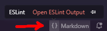

Then click on **Open ESLint Output**

Option 2: Press `Ctrl` + `Shift` + `p` to open the VSCode command palette and then type **eslint**

Now choose **ESLint: Show Output Channel**

Both options will open the output channel, showing you all ESLint-related messages.

If you see that line, it means the ESLint server is running in your workspace:

> \[Info  - 8:41:03 PM] ESLint server is running.

## VSCode extensions view

To change the eslint extension settings, click on the "Extensions" icon on the right:

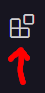

Or press `Ctrl` + `Shift` + `X`

### Installing an extension

Follow the steps in the previous chapter to open the Extensions view

Then on top you have an input field, type the name of the extension you want find into that field, or if you prefer use the [extensions marketplace website](https://marketplace.visualstudio.com/) to find the extension you want to install

Then VSCode will list all extensions related to your keyword

Next on the bottom right each extension (that is not yet installed) will have an **Install** button, click on the button to install the extension

## VSCode MDX and markdown extensions

The chapters about the [VSCode MDX extension](/web_development/posts/mdx#vscode-extensions) and the VSCode markdownlint extension are in the [MDX post](/web_development/posts/mdx)

## VSCode markdown (and MDX) features

The following chapter contain tips about **VSCode features** that will make working with markdown (like your README.md) files in VSCode easier and faster

### easy way to add images to MDX content (using VSCODE)

A great feature of VSCode is that adding images to MDX (or markdown) content is very easy.

All you need to do is select the file in the explorer on the right, drag it over the MDX (or markdown) document, press `Shift`, and drop the file into the document where you want it to be displayed; VSCode will automatically generate the markdown image syntax for you and add the correct path.

> [!TIP]  
> To select the image and be able to drag it into the document, click on the image using the left mouse button and **keep it pressed**, then move the file over the document at the position where you want to insert it, then press `Shift` and finally release the mouse button to drop it
>  
> [VSCode version 1.89 (April 2024)](https://code.visualstudio.com/updates/v1_89#_image-previews-in-markdown-path-completions) added a new preview feature for images in markdown documents, if you hover over the image it will show you a preview
>  
> If you want to see the original image, press `Ctrl` and then do a single left click on the image path, which will open the image in the preview window

When you drop an image into a markdown (MDX) document, VSCode will automatically generate the correct markdown image code and insert the relative path to the image. Now, if you want, you can manually add an alt text and/or a title, which gives you something like this:

```md

```

### VSCode fix for markdown highlighting in mdx files

Depending on your theme, markdown highlighting will be broken when viewing the content of MDX files.

This is due to a problem where not all themes are up to date and have colors set for MDX. For example, I use the [SynthWave '84](https://marketplace.visualstudio.com/items?itemName=RobbOwen.synthwave-vscode), which I like a lot. Unfortunately, all my content in MDX files is just getting displayed using the standard text color.

If you have this problem too, there is a little trick you can apply, which is to tell VSCode via the `.vscode/settings.json` file to use the **markdown** VSCode language service for MDX files instead of **mdx**

If you have already set custom settings for your VSCode workspace, then you will have a `.vscode` folder in your project root. If not, create that folder. Inside that folder, you will have a `settings.json` file. If that file is not there, create it.

Then edit the `.vscode/settings.json` file and add the following setting for **files.associations**:

```json title=".vscode/settings.json"
{
    "files.associations": {
        "*.mdx": "markdown"
    },
}
```

This should fix the colors for markdown highlighting in mdx files

### VSCode markdown (and MDX) preview

Because I work a lot with markdown (and MDX), I like the markdown preview feature in VSCode.

> [!NOTE]  
> Make sure you have a markdown (*.md) file open when doing this, or the icon will not show up  

To preview your markdown, click on the icon at the top right of the IDE, which consists of two panels and a magnifying glass.

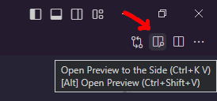

This will display your Markdown document side by side with the preview. You can edit your Markdown, which will update the preview in real-time.

When opening an MDX file, you will notice there is no preview icon in the top left. This is because VSCode separates markdown from MDX. There is, however, a trick to make it work, which is to set the language service to markdown for the .mdx extension:

(Same as we did in the previous chapter) we need to edit the `.vscode/settings.json` file and add the following settings for **files.associations**:

```json title=".vscode/settings.json"
{
    "files.associations": {
        "*.mdx": "markdown"
    },
}
```

Now save the settings file and open a .mdx file. You should now have the preview icon.

> [!NOTE]  
> Of course, you will only see markdown and HTML in the preview. It will, however, NOT preview React components you might have imported into your MDX document. For that, we need to wait for a VSCode MDX preview feature, but even though React components are not getting displayed, I like the preview feature to quickly check if my markdown syntax is ok, and maybe you do too 😉

### VSCode markdown headings links

To add links to headings inside a document, just use the default syntax for links, meaning you start with square brackets (`[]`), and between them, you add the link text (`[LINK_TEXT]`) then after the square brackets you use add regular brackets (`()`) for the path, as path start by typing a number sign (`#`) and a modal will open listing all your headline IDs, just chose the ID you want the link to point to and it will get inserted for you

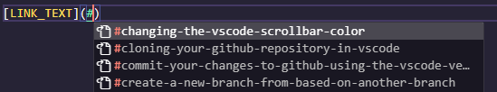

You can also link to headings in other documents. To do so, follow the previous steps, but instead of adding a single number sign (`#`) inside of the regular brackets (`()`), you insert 2 number signs, like this (`(##)`). This will again open a modal, but this time, it will list the heading IDs of the current file as well as those found in other files.

#### renaming headings (links)

To change a heading and update all the links pointing to it, just click inside the heading or link path and press `F2`. It will open a modal with the current heading title, modify it, and then press `ENTER`

> [!MORE]  
> [VSCode "Rename headers and links" documentation](https://code.visualstudio.com/docs/languages/markdown#_rename-headers-and-links)  

## VSCode git support

If you like to use git commands then you can do so using the VSCode built in **terminal** support (you might want to read the [open a VSCode terminal](#open-a-vscode-terminal) chapter first)

The first alternative to using the terminal (or any other command line tool) is to use the VSCode **command palette** (you might want to read the [VSCode command palette](#vscode-command-palette) chapter first)

The third option is to the VSCode **Source Control** tools. I find the [source control graph](https://code.visualstudio.com/docs/sourcecontrol/overview#_source-control-graph) very useful to quickly get an overview of the incoming (and outgoing) commits. I also like to be able to just do a quick commit by clicking a button.

> [!MORE]  
> [VSCode "source control" documentation](https://code.visualstudio.com/docs/sourcecontrol/overview)

### Switching between branches

Click on the **Source Control** icon on the left in the **Activity bar** (if you have already customized VSCode, your Activity bar might be in another location) or use the keyboard shortcut `Ctrl+Shift+G` (macOS: `⇧⌘G`, Linux: `Ctrl+Shift+G`)


* on the bottom left, you will have your current branch that you are currently on; if you have not yet created a new branch, it will probably be called "main"

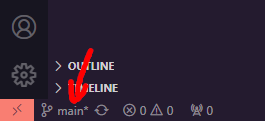

* click on the branch name to open the branch options on top of VSCode; here, you can now choose a branch that you want to switch to (local branches have a branch icon in front of their name, branches that are on GitHub (remote branches that are in the cloud) have a cloud icon in front of their name and are called **origin**/branch_name)
  * why do I see some branch names twice? This is because a branch that, for example, got created by another developer will be listed as origin/BRANCH_NAME; when you check out the origin/BRANCH_NAME, it will now exist both locally as **BRANCH_NAME** and also remotely (on GitHub) as **origin/BRANCH_NAME**, hence it will be twice in the list
  * a branch that only exists in the remote repository (on GitHub) or a branch you created locally but did not yet push to the remote repository will only have one entry in the list

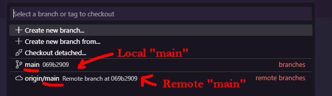

### Creating a new branch

On the bottom left, you will have your current branch that you are currently on. If you have not yet created a new branch, it will probably be called "main"

Click on the branch name to open the options (on top of the IDE).


Now you have two options when it comes to creating branches: creating a new empty branch or creating a new branch based on what is in another branch (making a copy)

#### Create a new (empty) branch

This will open the branch options on top of VSCode. Then click on **+ Create new branch** to create a new (empty) branch.

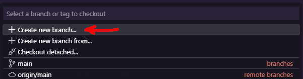

Then, enter a name for that new branch, and you are done.

#### Create a new branch from (based on) another branch

This will open the branch options on top of VSCode. Then click on **+ Create new branch from...** to create a new branch by copying an existing branch.

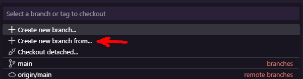

* First, select which branch you want to use to create the new branch
* then enter a name for that new branch

Now that the new branch has been created, I recommend you publish it immediately (push it to the remote repository) by clicking on the cloud icon next to its name at the bottom left of VSCode.

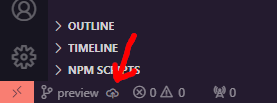

### Rename the current git branch

To rename the current **local** branch (the one currently being displayed in the bottom left), press `Ctrl` + `Shift` + `p` to open the VSCode command palette, then type **Git** and choose **Git: Rename Branch...**

> [!TIP]  
> To rename another branch (other than the current one), first switch to the branch you want to rename and then follow the steps listed above

### Commit your changes to GitHub using the VSCode version control tool

Click on the **Source Control** icon on the left in the **Activity bar** (if you have already customized VSCode, your Activity bar might be in another location) or use the keyboard shortcut `Ctrl+Shift+G` (macOS: `⇧⌘G`, Linux: `Ctrl+Shift+G`)


* you will now see that all the files in which you made changes are listed in the category **Changes**
* if you double click on a filename, it will open a **diff** view in VSCode that allows you to see what has changed between the current version and the previous one; the previous version of the file is on the left, the current one on the right, on the right side the lines that will change are highlighted with a green color, on the left highlighted in red are the lines that will get modified, if you want to undo a change and revert to the previous version you can click on the arrow in the middle of the page next to the line you want to undo
* you don't need to commit all files that have been changed all at once; if you do, then just enter a commit message on top and hit the **Commit** button; else, to choose which files to commit, click on the + icon next to the file, this will add the file to a category called **Staged changes**, now enter a commit message for the files you selected and click on commit, this will create a commit with only those files
* next to each file, you also have an icon with an arrow that points to the left; if you want to discard all of the changes you made to a file, click on that icon, and it will reset the file (be careful this will delete all changes you did and you will not be able to recover them, if you are unsure, first create a new branch and commit the changes to that branch to have a backup just in case)

Committing creates a local commit, but it does not yet push that commit to the remote repository. To sync the changes with the remote repository, click on the icon with two circular arrows next to the branch name at the bottom of the sidebar.

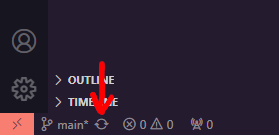

> [!TIP]  
> Synching means that the GitHub version control tool will first pull in changes from the remote repository and then right after that also do a push of your local changes to the remote repository  

## git credential manager

### VSCode asks me to choose a GitHub account every time I sync

If you have multiple users (GitHub / GitLab, … accounts) or, for example, a GitHub account but also a personal token on your machine, then the [git credential manager](https://github.com/git-ecosystem/git-credential-manager) will not know which one you want to use. Hence, it will ask you, meaning that every time you hit the sync button, it will open a modal that looks like this:

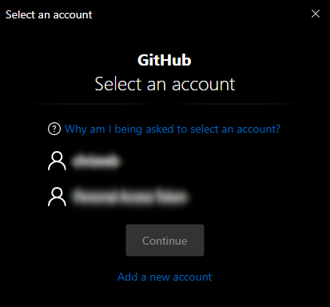

> [!TIP]  
> To avoid getting asked every time, you can set a default user or token for a repository, which is what the next chapter is about

> [!MORE]  
> [GitHub "git-credential-manager" repository](https://github.com/git-ecosystem/git-credential-manager)  
> [git-credential-manager documentation](https://github.com/git-ecosystem/git-credential-manager/blob/release/docs/README.md)  

### Setting a default user/token per repository

To set a default user for a repository, you need to add the **USER_NAME** of the account you want to use to the remote URL of the repository.

To do so, open your VSCode terminal (or use your preferred command line tool) and then use the following command:

```shell
git remote set-url origin https://USER_NAME@github.com/USER_NAME/REPOSITORY_NAME.git
```

Then press `ENTER`, and you are done.

> [!MORE]  
> [git-credential-manager "Multiple users" documentation](https://github.com/git-ecosystem/git-credential-manager/blob/main/docs/multiple-users.md)  

### getting a list of git credentials (on Windows)

If you want to list all your git credentials that exist on your machine, you can use the following command in your terminal:

```shell
cmdkey /list:git*
```

### Manage git credentials (on Windows)

To manage the accounts on your machine, for example if you decide to delete one of them, then you can use the [credential manager](https://support.microsoft.com/en-us/windows/accessing-credential-manager-1b5c916a-6a16-889f-8581-fc16e8165ac0) to do so, click on the windows start icon and then type **credential manager** to find it (optionally you can also open a File Explorer window and enter the following path: **Control Panel\All Control Panel Items\Credential Manager** to access it)

Once the **credential manager** is open, select the second tab called **windows credentials**, then click on the down arrow next to the credentials you want to edit or remove, verify those are the correct credentials, and then click on either **Edit** or **Remove** depending on what you wish to do.

> [!MORE]  
> [accessing the Windows (10) "Credential Manager"](https://support.microsoft.com/en-us/windows/accessing-credential-manager-1b5c916a-6a16-889f-8581-fc16e8165ac0)  

</article>
