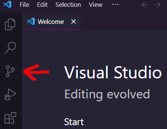

%toc%

<article>

# VSCode

**VSCode** (Visual Studio Code) is a versatile Integrated Development Environment (IDE) we will use to write our Javascript / Typescript code. I like VSCode because it has a lot of great features like smart code completion called [Intellisense](https://code.visualstudio.com/docs/editor/intellisense), code [refactoring](https://code.visualstudio.com/docs/editor/refactoring)...

VSCode also comes with great [debugging](https://code.visualstudio.com/docs/editor/debugging) tools, meaning you can debug your frontend but also backend code within VSCode, for example managing breakpoints is very similar to how debugging works in the chrome developer tools. The [VSCode debugger](https://code.visualstudio.com/docs/editor/debugging) launch configuration json file makes it very easy to adapt the debugger to any project and the debugger launch.json can then be shared as part of your git repository to make it very easy for other developers that will work on your project and that also use VSCode to use the debugger without having to configure it themself 

What is also great is that it has [integrated source control (git) support](https://code.visualstudio.com/docs/sourcecontrol/overview), staging, switching between branches and pushing are all things supported by VSCode, meaning we will be able to push our commits directly to github from within VSCode with just one click. It also makes resolving of conflicts and merging very easy using it's visual diff (as opposed to using git in the terminal (command line) which is another option if this is what you prefer).

VSCode also has an [extensions (plugins) marketplace](https://code.visualstudio.com/docs/editor/extension-marketplace), which means that if one feature is not in VSCode core you will probably find an extension that suits your needs.

> [!NOTE]  
> VSCode the project is opensource and everyone can access and contribute to it source code in the [VSCode GitHub repository](https://github.com/microsoft/vscode). The source code is licensed using the MIT license. VSCode the build that you download from Microsoft uses the [Microsoft Software License](https://code.visualstudio.com/license). It is similar to Chrome (not opensource) being the Chromium (opensource) build from Google, which contains propritary pieces, like the chrome logo image, but also pre installed extensions or codecs that are not part of chromium the fully opensource variant. So if you want an opensource version of the VSCode build you could check out [VSCodium](https://vscodium.com/) instead

> [!MORE]  
> [VSCode documentation](https://code.visualstudio.com/docs)  
> [VSCode youtube channel](https://www.youtube.com/@code)  

## Installation

Head over to the [VSCode download page](https://code.visualstudio.com/Download) and download the latest version for your operating system (OS)

## Turn on settings sync (using your GitHub account)

* click on the **Accounts** icon on the left in the **Activity bar** (if you have already customized VSCode, your Activity bar might be in another location)

* now click on **Backup and Sync Settings...**
* then on top center of your VSCode click on the **Sign in**
* then chose the option **Sign in with GitHub**
* this will open a window in your default browser, login to your GitHub account via the web (if you are not already logged in)
* after you have logged, the second step on GitHub will ask you to **Authorize GitHub for VS Code** (if you haven't already done so previously), click on the green **Authorize Visual-Studio-Code** button to accept
* then a modal box will appear in your browser asking you to open VSCode again (now that the GitHub login and authorization process is done this will bring you back into VSCode)
* that's it, you have connected your GitHub account in VSCode

If this is the first time you install VSCode, you will see a modal box pop up in the right corner to ask you if you want to sync your settings in the cloud, click on the **Turn on Settings Sync...** button, doing so will allow VSCode to synchronise your VSCode settings accross multiple devices (for example between your desktop computer and your laptop)

## Cloning your GitHub repository in VSCode

There are several ways to clone a git (GitHub) repository in VSCode, I will describe 2 that are simple and very similar and make use of the integrated VSCode source control tool and then 1 using the VSCode Terminal, this is a bit more complex but if you prefer doing things manually via the command line than this third option is for you

Option 1 (via the **welcome** screen):

* if you just opened VSCode you will see a **welcome** screen, click on **Clone git repository...**

Option 2 (via the **Source Control** tool):

* click on the **Source Control** icon on the left in the **Activity bar** (if you have already customized VSCode, your Activity bar might be in another location) or use the keyboard shortcut `Ctrl+Shift+G{:shell}` (macOS: ⇧⌘G, Linux: Ctrl+Shift+G)

* then click on **Clone Repository**

Option 1 & 2 next steps:

* then click on **Clone from GitHub**

**If you are not yet logged in with your GitHub account yet:**

* VSCode will ask you to allow sign you in with GitHub:

* click on the **Allow** button
* this will open a window in your default browser, login to your GitHub account via the web (if you are not already logged in)
* after you have logged, the second step on GitHub will ask you to **Authorize GitHub for VS Code** (if you haven't already done so previously), click on the green **Authorize Visual-Studio-Code** button to accept
* then a modal box will appear in your browser asking you to open VSCode again (now that the GitHub login and authorization process is done this will bring you back into VSCode)

**As soon as you are logged in with your GitHub account:**

* in VSCode on top you will now see a list of all your GitHub repositories, select your repository from the list
* now chose a local directory in which you will save the clone of your repository (something like /users/YOUR_USERNAME/my_github_projects, no need to create a directory with the project name, VSCode will do that when cloning the repository), then click on **Select as Repository Destination**
* then in the bottom right you will see a modal box showing you that the cloning process is underway
* when the cloning is done VSCode will ask you if you want to open the cloned repository, click on **Open** to open it in the current VSCode or click on **Open in New Window** to open another VSCode instance

* next (if you are not trusting that directory yet) you will see the following modal box asking you **do you trust the authors of the files in this directory**, because all the projects in parent directory are our own, we will check the box next to **Trust the authors...** and then click on **Yes, I trust the authors** (if it is a third party project you are cloning then the VSCode recommends to not trust it and only enable those extra features if you really need them, also if you clone third party projects it is recommended to store them in another directory than your own, of course all the usual security recommendations to protect your computer apply, like ensure you have an antivirus installed, ...)

> [!TIP]  
> to learn more about the I recommend to read the [VSCode "Workspace Trust" documentation](https://code.visualstudio.com/docs/editor/workspace-trust)

that's finally it, congratulations you now have a local copy of your GitHub repository

Option 3 (via the VSCode terminal / or your preferred command line tool):

* the third option is to visit [GitHub](https://github.com/)
* then on top right click on your Avatar image
* in the side menu click on **Your repositories**
* then click on the name of your repository
* now on the top right of your repository page there is a green dropdown button labelled **Code**
* click on it and then click on the **HTTPS** tab
* copy the **https** URL
* now go back to VSCode
* open a terminal view, if you don't know how check out the [VSCode terminal](#vscode-terminal) chapter and if you prefer to use another command line tool feel free to do that
* go into the directory in which you want to store a local copy of your projects, for example by using this command: `cd MY_PATH_TO_MY_REPOSITORIES{:shell}`
* then type the following command to clone the repository: `git clone THE_REPOSITORY_URL_YOU_COPIED_ON_GITHUB{:shell}`
* now click on the **Source Control** icon on the left in the **Activity bar** (if you have already customized VSCode, your Activity bar might be in another location) or use the keyboard shortcut `Ctrl+Shift+G{:shell}` (macOS: `⇧⌘G{:shell}`, Linux: `Ctrl+Shift+G{:shell}`)
* then click on **Open Folder** and select the folder into which you just cloned your repository

> [!MORE]  
> [VSCode "git source control" documentation](https://code.visualstudio.com/docs/sourcecontrol/intro-to-git)  

## commit your changes to GitHub using the VSCode version control tool

* click on the **Source Control** icon on the left in the **Activity bar** (if you have already customized VSCode, your Activity bar might be in another location) or use the keyboard shortcut `Ctrl+Shift+G{:shell}` (macOS: ⇧⌘G, Linux: Ctrl+Shift+G)

* you will now see that all the files in which you did changes are listed in the category **Changes**
* if you double click on a filename it will open a **diff** view in VSCode that allows you to see what has changed between the current version and the previous one, the previous version of the file is on the left the current one on the right, on the right side the lines that will change are highlighted with a green color, on the left highlighted in red are the lines that will get modified, if you want to undo a change and keep the previous version you can click on the arrow in the middle of the page next to the line you want to undo
* you don't need to commit all files that have been changed all at once, if you do then just enter a commit message on top and hit the **Commit** button, else to chose which files to commit click on the + icon next to the file, this will add the file to a category called **Staged changes**, now enter a commit message for the files you selected and click on commit, this will create a commit with on those files
* next to each file you also have an icon with an arrow that points to the left, if you want to discard all of the changes you made to a file, click on that icon and it will reset the file (be careful this will delete all changes you did and you will not be able to recover them, if you are unsure create a new branch and commit the changes to that branch to have a backup just in case)

## switching between branches

* click on the **Source Control** icon on the left in the **Activity bar** (if you have already customized VSCode, your Activity bar might be in another location) or use the keyboard shortcut `Ctrl+Shift+G{:shell}` (macOS: ⇧⌘G, Linux: Ctrl+Shift+G)

* on the bottom left you will have your current branch that you are currently on, if you did not yet create a new branch it will probably be called "main"
* click on the branch name to open the branch options on top of VSCode, here you can now chose a branch that you want to switch to (local branches have a branch icon in front of their name, branches that are on GitHub (remote branches that are in the cloud) have a cloud icon in front of their name and are called **origin**/branch_name)
  * you can see a branch name twice, this is because a branch that for example got created by another developer will be listed as origin/branch_name, when you check out the origin/branch_name it will now exist both locally as **branch_name** and also remotly (on GitHub) as **origin/branch_name**, hence it will be twice in the list
  * a branch that only exists in the remote repository or a branch you created locally but did not yet push to remote repository will only have one entry in the list

## creating a new branch

* click on the **Source Control** icon on the left in the **Activity bar** (if you have already customized VSCode, your Activity bar might be in another location) or use the keyboard shortcut `Ctrl+Shift+G{:shell}` (macOS: ⇧⌘G, Linux: Ctrl+Shift+G)

* on the bottom left you will have your current branch that you are currently on, if you did not yet create a new branch it will probably be called "main"
* if you want to create a new branch click on the branch name to open the branch options on top of VSCode and then click on **+ Create new branch** and then enter a name for that new branch

## VSCode terminal

VSCode has a terminal (command line tool) that by default is closed, to open the terminal click on **View** the top navigation bar and then **Terminal**

Or use the keyboard shortcut `` Ctrl+` {:shell}`` (macOS: `` ⌃` {:shell}``, Linux: `` Ctrl+` {:shell}``)

The third option is to use the command palette by pressing using the keyboard shortcut `Ctrl+Shift+p{:shell}` (macOS: `⇧⌘P{:shell}`, Linux: `Ctrl+Shift+P{:shell}`) and then type `view: toggle terminal{:shell}`

> [!MORE]  
> [VSCode "terminal" documentation](https://code.visualstudio.com/docs/terminal/basics)  

## VSCode command palette

To open the VSCode command palette use the keyboard shortcut `Ctrl+Shift+p{:shell}` (macOS: `⇧⌘P{:shell}`, Linux: `Ctrl+Shift+P{:shell}`)  

> [!MORE]  
> [VSCode "User Interface > Command Palette" documentation](https://code.visualstudio.com/docs/getstarted/userinterface#_command-palette)  

## VSCode settings

### open the settings

To access the VSCode settings there are can click on **File** in the top navigation bar, then click on **Preferences** and select **Settings**

Or use the keyboard shortcut `Ctrl+,{:shell}` (macOS: `⌘,{:shell}`, Linux: `Ctrl+,{:shell}`)

The third option is to use the command palette, use the keyboard shortcut `Ctrl+Shift+p{:shell}` (macOS: `⇧⌘P{:shell}`, Linux: `Ctrl+Shift+P{:shell}`) to open the command palette and then type `preferences: open settings`

> [!MORE]  
> [VSCode "settings" documentation](https://code.visualstudio.com/docs/getstarted/settings)  

### edit settings (user / workspace)

To edit settings first [open the settings UI or file version](#open-the-settings)

You have two types of settings:

* **user** settings will apply to all your projects, these settings are saved in computers user directory, for example on windows this is something like , these settings get synchronised between all VSCode tools where you are signed in
* **workspace** settings will only apply to the project (workspace) that is currently open in VSCode, those settings get saved into a `settings.json` file that is located in a `.vscode` directory of your project (workspace), meaning that you can commit that directory with your source code to share the settings with others

On top of the settings page you have two tabs which allow you to switch between user and workspace settings

On the top right you have an icon to switch between the UI version of the settings and the settings file

If you are in the UI version, you will see an icon to switch to the file version:

And if you are in the file version, you will see an icon to switch to the UI version:

> [!MORE]  
> [VSCode "settings sync" documentation](https://code.visualstudio.com/docs/editor/settings-sync)  

</article>