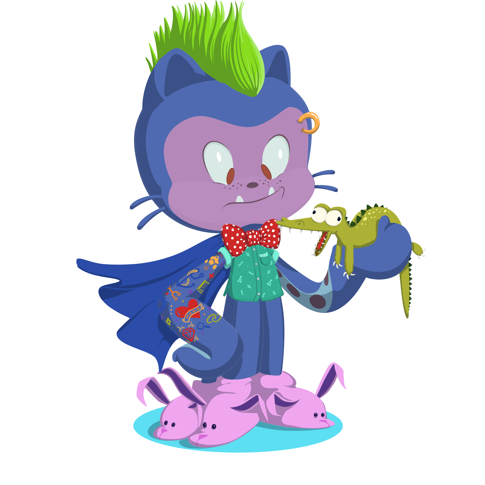

<aside>
%toc%
</aside>

<article>

# markdown (MDX) syntax

## inline code

```md
This is some inline code in typescript (tsx): `helloWorld(){:tsx}`, this is a inline code styled as function: `helloWorld{:.entity.name.function}`, styled as comment: `helloWorld{:.comment}`, quoted string: `helloWorld{:.string.quoted}`, a variable: `helloWorld{:.variable}`, a numeric decimal: `123{:.constant.numeric.decimal.js}`, an object literal: `const helloWorld = { foo: 'bar' }{:.meta.object-literal.key}`
```

This is some inline code in typescript (tsx): `helloWorld(){:tsx}`, this is a inline code styled as function: `helloWorld{:.entity.name.function}`, styled as comment: `helloWorld{:.comment}`, quoted string: `helloWorld{:.string.quoted}`, a variable: `helloWorld{:.variable}`, a numeric decimal: `123{:.constant.numeric.decimal.js}`, an object literal: `{ foo: 'bar' }{:.meta.object-literal.key}`

## code blocks

a codeblock set to javascript (js), with a title, line numbers enabled and a highlighted word:

~~~md
```js title="./test.js" showLineNumbers /console/
function helloWorld() {
    // this is a comment
    let greeting = 'Hello World!'
    console.log(greeting)
}
```
~~~

```js title="./test.js" /console/
function helloWorld() {
    // this is a comment
    let greeting = 'Hello World!'
    console.log(greeting)
}
```

another code block set to typescripts (tsx), the third line is highlighted, a word is highlighted using a styling id, line numbers enabled and a caption:

~~~md
```tsx {3} /helloWorld/#special showLineNumbers caption="tsx"
function helloWorld() {
    // this is a comment
    let greeting = 'Hello World!'
    console.log(greeting)
}
```
~~~

```tsx {3} /helloWorld/#special showLineNumbers caption="tsx"
function helloWorld() {
    // this is a comment
    let greeting = 'Hello World!'
    console.log(greeting)
}
```

## alerts

```md
> [!NOTE]  
> additional information that can be skipped

> [!TIP]  
> recommended additional information
>
> good to know

> [!MORE]  
> a read more list of links:
> 
> * [foo](/foo)
> * [bar](/bar)
> * [baz](/baz)
```

> [!NOTE]  
> additional information that can be skipped

> [!TIP]  
> recommended additional information
>
> good to know

> [!MORE]  
> a read more list of links:
>
> * [foo](/foo)
> * [bar](/bar)
> * [baz](/baz)

## GFM (github flawored markdown)

```md
- [x] #739
- [ ] https://github.com/octo-org/octo-repo/issues/740
- [ ] ends with an emoji :tada:
```

- [x] #739
- [ ] https://github.com/octo-org/octo-repo/issues/740
- [ ] ends with an emoji :tada:

## headings

```md
# h1 q Q ? ! @ Û u Ä * 123

## h2 q Q ? ! @ Û u Ä * 123

### h3 q Q ? ! @ Û u Ä * 123

#### h4 q Q ? ! @ Û u Ä * 123

##### h5 q Q ? ! @ Û u Ä * 123

###### h6 q Q ? ! @ Û u Ä * 123
```

# h1 q Q ? ! @ Û u Ä * 123

## h2 q Q ? ! @ Û u Ä * 123

### h3 q Q ? ! @ Û u Ä * 123

#### h4 q Q ? ! @ Û u Ä * 123

##### h5 q Q ? ! @ Û u Ä * 123

###### h6 q Q ? ! @ Û u Ä * 123

## links

internal link:

```md
[internal](/)
```

[internal](/)

external link:

```md
[external](https://www.github.com)
```

[external](https://www.github.com)

## images

banner:

```md

```


photo & screenshot:

```md

```


default:

```md

```


## character tests

Hello World! in:

* Japanese: こんにちは世界!
* Ukrainian: Привіт Світ!
* Chinese: 你好世界!
* Arabic: !مرحبا بالعالم
* Hindi: नमस्ते दुनिया!

</article>
