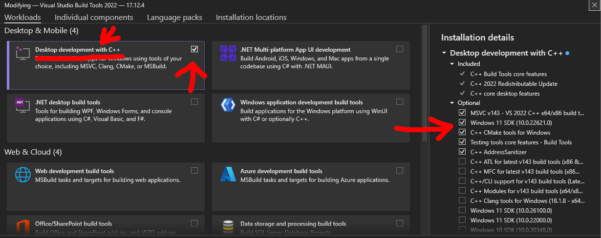

import { sharedMetaDataArticle } from '@/shared/metadata-article'

export const metadata = {
    title: frontmatter.title,
    keywords: frontmatter.keywords,
    alternates: {
        canonical: frontmatter.permalink,
    },
    openGraph: {
        ...sharedMetaDataArticle.openGraph,
        images: [{
          type: "image/png",
          width: 1200,
          height: 630,
          url: '/web_development/og/tutorials_js-deepseek-r1-local-rag/opengraph-image'
        }],
        url: frontmatter.permalink,
        section: frontmatter.section,
        publishedTime: frontmatter.published,
        modifiedTime: frontmatter.modified,
        tags: frontmatter.keywords,
    },
}

%toc%

<article>

# Local DeepSeek-R1 AI RAG using JavaScript (TypeScript)


## What are we going to a build in this tutorial?

This tutorial is about building a Retrieval Augmented Generation (RAG) pipeline in JavaScript (TypeScript).

* Download **DeepSeek-R1** using **Ollama** and then run the LLM model locally (privacy first, your data does not get transferred to third parties)
* Use create-next-app to quickly setup a **Next.js 15** project
* Create some UI components for our chat bot using **React 19**
* Build a simple frontend and a backend using the **ai SDK** (which will handle the most difficult bits of streaming a response)
* Install **PostgreSQL** and **pgvector** to store our vectors (embeddings)
* Create a Retrieval-Augmented Generation (RAG) pipeline using **LangChain.js**, that will extract the content from our local (markdown) documents, turn each chunk into an embedding vector and finally store it in our vector database
* Find relevant knowledge using a similarity search in our vector database
* And finally add the knowledge to the prompt, to give the AI access to your own custom knowledge base (before it starts reasoning / answering)

> [!TIP]  
> the final source code for this project is available in the [js-deepseek-r1-local-rag](https://github.com/chrisweb/js-deepseek-r1-local-rag) GitHub repository

## Local (offline) DeepSeek-R1 using Ollama

In this chapter we will start by installing [ollama](https://ollama.com/) and then ask it to pull the deepseek model. Once the model is running on own hardware we can test a few prompts using our terminal

> [!MORE]  
> [ollama](https://ollama.com/)

### Ollama installation

<span className="neonBlueHighlightedText">Windows</span> 

To install Ollama on Windows [download the Ollama setup exe](https://ollama.com/download/windows) from the ollama website, once it has finished downloading click on the download in your browser or open the download folder and double click on the file to start the Ollama installation

After the installation has finished Ollama will get added to your PATH, you might want to restart your terminal to make sure it is aware of the new PATH

<span className="neonBlueHighlightedText">Linux</span> 

To install Ollama on Linux you can use the following command:

```shell
curl -fsSL https://ollama.com/install.sh | sh
```

Or check out the ["manual installation" on Linux](https://github.com/ollama/ollama/blob/main/docs/linux.md) documentation in the Ollama repository

<span className="neonBlueHighlightedText">macOS</span> 

To install Ollama on macOS I recommend using [brew (ollama formula)](https://formulae.brew.sh/formula/ollama), or if you prefer you can download a [zip file for macOS](https://ollama.com/download/mac) from the ollama website

### Ollama quickstart

We will start with the [deepseek-r1:1.5b](https://ollama.com/library/deepseek-r1:1.5b) model, it is the smallest [deepseek-r1](https://ollama.com/library/deepseek-r1) model that is available, we will then make a first test to see how well it performs on our hardware, if your hardware is powerful enough you can later switch to a version that is more hungry for computational power. If you prefer to use another model from the [Ollama library](https://ollama.com/library), like the **llama 3** model.

**Ollama** has the following estimate when it comes to resources that need to be available on your local machine:

> You should have at least 8 GB of RAM available to run the 7B models, 16 GB to run the 13B models, and 32 GB to run the 33B models.

In your terminal use the following command to pull the DeepSeek-R1-Distill-Qwen-1.5B model using ollama:

```shell
ollama run deepseek-r1:1.5b
```

As this is the first run we ask Ollama to run that model, it will first download it

After the installation has finished Ollama run the model and then offer you to enter your first message, try out asking it something like this:

> Please identify yourself

DeepSeek-R1 will do some thinking and then reply with a short answer, mine was like this:

> Hi! I'm DeepSeek-R1, an AI assistant created by DeepSeek. I'm here to help answer questions, provide information, and assist with various tasks. Thank you for asking! How can I assist you today?

Great we have verified that DeepSeek-R1 is running locally (offline) and can answer our questions

> [!TIP]  
> To exit the conversation (the ollama shell) press `Ctrl+D` (macOS: `⌘D`, Linux: `Ctrl+D`)  

#### Ollama commands (optional)

Ollama can be used for more than just relaying questions to the model, an easy way to find out more about those commands is to type `/?` as message to Ollama, after you press `Enter` you will get a list of useful Ollama commands

To list the models that are currently installed locally use this command:

```shell
ollama list
```

to stop a model use:

```shell
ollama stop
```

to see what version of ollama is currently installed use:

```shell
ollama -v
```

> [!MORE]  
> [Ollama Readme](https://github.com/ollama/ollama)  

## AI Frontend using Next.js 15 and React 19

In this chapter we will install **Next.js 15** and **React 19** to create a page for our React 19 chat bot components.

> [!MORE]  
> [Next.js](https://nextjs.org/)  
> [React](https://react.dev/)  

### Prerequisites

This tutorial assumes that already have a development environment set up:

* you will need to have **git** installed
* an IDE like **VSCode**. We will use the VSCode terminal but feel free to use your favorite command line tool instead.
* you also need to have **Node.js** installed, preferably a version >= 22.7.0 as those versions have support for running Typescript

> [!MORE]  
> [git post (installing and using git)](/web_development/posts/git)  
> [VSCode post (installing and using VSCode)](/web_development/posts/vscode)  
> [Node.js post (installation guide)](/web_development/posts/node-js)  

### Next.js 15 installation using create-next-app (CNA)

To install Next.js 15 and React 19 we are going to use [create-next-app (CNA)](https://www.npmjs.com/package/create-next-app)

First you may want to create a **GitHub repository** for your new project, which I explain in the [GitHub post](/web_development/posts/git).

Next **clone** that **project** locally using VSCode. For more details have a look at the [VSCode post](/web_development/posts/vscode)

Now that our project is open in VSCode we use the **terminal** to run the CNA command (to install the latest Next.js canary version using CNA):

```shell
npx create-next-app@canary
```

When you get asked if you agree to install the latest CNA canary, press **y** to accept

When asked for a **name** make sure you only enter a dot (`.`), to tell CNA that we are already in the project folder (and so it won't create one). As name for the project CNA will use the current folder name, if later you want to change the name, you can do so by editing the package.json in the root of the project and then changing the name to something else.

I suggest you answer the few questions like this (or customize the answers to your liking):

```shell
Would you like to use TypeScript? **Yes**
Would you like to use ESLint? **Yes**
Would you like to use Tailwind CSS? **No**
Would you like your code inside a `src/` directory? **No**
Would you like to use App Router? (recommended) **Yes**
Would you like to use Turbopack for `next dev`? **Yes**
Would you like to customize the import alias (`@/*` by default)? **Yes**
What import alias would you like configured? **@/\***
```

> [!MORE]  
> ["create-next-app (CNA)" documentation](https://nextjs.org/docs/app/api-reference/cli/create-next-app)  

### Cleanup

Next we do a little bit of cleanup, first we delete the files in **/public** and then we simplify the layout and homepage like this:

```tsx title="/app/layout.tsx"
import type { Metadata } from 'next'
import './globals.css'

export const metadata: Metadata = {
    title: 'Create Next App',
    description: 'Generated by create next app',
}

export default function RootLayout({
    children,
}: Readonly<{
    children: React.ReactNode
}>) {
    return (
        <html lang="en">
            <body>
                {children}
            </body>
        </html>
    )
}
```

```tsx title="/app/page.tsx"
import styles from './page.module.css'

export default function Home() {
    return (
        <div className={styles.page}>
            
        </div>
    )
}
```

## React 19 chat UI components

In this chapter we will focus on getting a working MVP as quickly as possible, so we won't add a styling library to the project, but feel free to improve the UI later, by for example adding Tailwind, ShadCN or MUI (with pigment css) to your stack

### Base components

Let's get started by creating a base button component

> [!TIP]  
> VSCode can create the folders and file itself in one go. In VSCode right click somewhere in the file explorer and then select **New File...**, then instead of just the file name enter the full path "components/base/Button.tsx" and press **ENTER**, VSCode will then create the two folders as well as the file for you

Add the following code for our **button** component:

```tsx title="/components/base/Button.tsx"
import { type ButtonHTMLAttributes } from 'react'

export type BaseButtonProps = ButtonHTMLAttributes<HTMLButtonElement>

const BaseButton: React.FC<BaseButtonProps> = (props) => {

    const { children, ...rest } = props

    return (
        <button {...rest}>
            {children}
        </button>
    )
}

export default BaseButton
```

We will also need an **input** field component:

```tsx title="/components/base/Input.tsx"
import { type InputHTMLAttributes } from 'react'

export type BaseInputProps = InputHTMLAttributes<HTMLInputElement>

const BaseInput: React.FC<BaseInputProps> = (props) => {

    return (
        <input {...props} />
    )
}

export default BaseInput
```

And finally our third base component will be for the form element:

```tsx title="/components/base/Form.tsx"
import { type FormHTMLAttributes } from 'react'

export type BaseFormProps = FormHTMLAttributes<HTMLFormElement>

const BaseForm: React.FC<BaseFormProps> = (props) => {

    const { children, ...rest } = props

    return (
        <form {...rest}>
            {children}
        </form>
    )
}

export default BaseForm
```

We have created these base components so that we have an abstraction layer between the chat client and any UI library we might add in the future, the same idea is behind re-exporting the type from react, by using a custom type we make sure that in the future we can customize it without having to edit any component that uses the type

### Chat bot UI

Now that we have created our 3 base components we can finally build a minimalistic chat client (`components/chat/Client.tsx`):

```tsx title="/components/chat/Client.tsx"
'use client'

import Form from '@/components/base/Form'
import Input from '@/components/base/Input'
import Button from '@/components/base/Button'

const ChatClient: React.FC = () => {


    const onSubmitHandler = (event: React.FormEvent<HTMLFormElement>) => {

        const formData = new FormData(event.currentTarget)

        event.preventDefault()

        // use the entries (names and values) or values (only values)
        formData.entries().forEach(([name, value], index) => {
            console.log('name, value, index: ', name, value, index)
        })

    }

    return (
        <Form onSubmit={onSubmitHandler}>
            <Input name="prompt" />
            <Button type="submit">Submit</Button>
        </Form>
    )
}

export default ChatClient
```

For now we just added a simple form and a submit handler that will log the content of the formdata

And then we update the code of the **page** to add our newly created **ChatClient** UI component:

```tsx title="/app/page.tsx" showLineNumbers {2} {8}
import styles from './page.module.css'
import ChatClient from '@/components/chat/Client'

export default function Home() {

    return (
        <div className={styles.page}>
            <ChatClient />
        </div>
    )
}
```

Line 2: we import our new chat client component

Line 8: we put the **ChatClient** component into our Next.js page

To test our basic chat client we first need to start the dev server:

```shell
npm run dev
```

And if we then visit the page at `http://localhost:3000` we can submit the form to see the formdata console log (in the browser dev tools console tab)

## AI client and backend in JavaScript

Next we are going to use the "AI" SDK to transform our simple form into a chat client. Then we will create an API route to pass the questions to ollama and then return a stream of responses.

> [!WARN]  
> one drawback of using DeepSeek-R1 is that it has no support for tools, yet (there is an [open issue #9](https://github.com/deepseek-ai/DeepSeek-R1/issues/9#issuecomment-2673485914) regarding support for functions and structured outputs).
>  
> The [tools support in the ai SDK](https://sdk.vercel.ai/docs/foundations/tools) is one its strength, if you want support for tools, have a look at the [ollama models list and use the tools filter](https://ollama.com/search?c=tools)

> [!MORE]  
> [ai SDK (The AI Toolkit for TypeScript)](https://sdk.vercel.ai)  

### AI SDK client component

First we install the the [AI SDK](https://sdk.vercel.ai/docs/introduction) (by Vercel):

```shell
npm i ai --save-exact
```

Next we update our chat client like this:

```tsx title="/components/chat/Client.tsx" showLineNumbers {6} {10-16} {20-25} {27-30}
'use client'

import Form from '@/components/base/Form'
import Input from '@/components/base/Input'
import Button from '@/components/base/Button'
import { useChat } from '@ai-sdk/react'

const ChatClient: React.FC = () => {

    const { messages, input, handleInputChange, handleSubmit } = useChat(
        {
            onError: (error) => {
                console.error('useChat onError: ', error)
            },
        }
    )

    return (
        <>
            {messages.map(message => (
                <div key={message.id}>
                    {message.role === 'user' ? 'User: ' : 'AI: '}
                    {message.content}
                </div>
            ))}

            <Form onSubmit={handleSubmit}>
                <Input name="prompt" value={input} onChange={handleInputChange} />
                <Button type="submit">Submit</Button>
            </Form>
        </>
    )
}

export default ChatClient
```

Line 6: We first import useChat from ai SDK we just installed and then is it to replace our onSubmitHandler

Lines 10 to 16: useChat gives us two useful values, the messages list (all the messages of the current session) and the current value for the input field, and it gives us two functions one that will handle input field changes for us and a second on to handle submitting the form

Lines 20 to 25: in the JSX part we add some code to display the chat messages

Lines 27 to 30: we finally set the input field value to the input value from the ai SDK. The handleInputChange function will get triggered on every input field change, and the handleSubmit function when the user clicks the submit button

> [!MORE]  
> [ai SDK "useChat" reference](https://sdk.vercel.ai/docs/reference/ai-sdk-ui/use-chat)  

### AI SDK backend (Next.js API route)

The second part of our chat bot is its backend, for which we use a Next.js API route handler

The ai SDK has several official providers that connect to different AI APIs, but as we are running ollama locally we will instead use the [ollama (community) provider](https://github.com/sgomez/ollama-ai-provider)

First we install ollama-ai-provider package:

```shell
npm i ollama-ai-provider --save-exact
```

Now that we have the ai SDK as well as the ollama provider we can create a new API route (`app/api/chat/route.ts`) to handle requests and stream the DeepSeek-R1 answer back to our client:

```tsx title="/app/api/chat/route.ts" showLineNumbers
import { createOllama } from 'ollama-ai-provider'
import { streamText } from 'ai'
import { type CoreMessage } from 'ai'

interface ChatRequest {
    messages: {
        role: string
        content: string
    }[]
}

// sets max streaming response time to 30 seconds
export const maxDuration = 30

export async function POST(req: Request) {

    const body = await req.json() as ChatRequest
    const messages = body.messages as CoreMessage[]

    const ollamaProvider = createOllama({
        baseURL: 'http://localhost:11434/api',
    })

    const ollamaModel = ollamaProvider('deepseek-r1:1.5b')

    const lastMessage = messages[messages.length - 1].content

    const prompt = `You are a helpful AI chat bot.
    You should answer the following question: "${lastMessage}"\n\n`

    const result = streamText({
        model: ollamaModel,
        prompt: prompt,
        temperature: 0.1,
    })

    return result.toDataStreamResponse({
        getErrorMessage: (error) => {
            const message = error instanceof Error ? error.message : (typeof error === 'string' ? error : 'Unknown error')
            console.error(message)
            return message
        },
    })

}
```

Line 2: the ai SDK is has a good DX, all you need to do is import the streamText function

Lines 5 to 10: we create an interface for our messages

Lines 20 to 22: we create an ollama provider (the provider will open a connection and handle the communication between the model and our API route), we define the URL to our local ollama and set the port number 11434 as this is the default value (an improvement for later would be to create an env file and add an entry for ollama URL variable)

Line 24: we tell the provider which model we want, for this tutorial I used DeepSeek-R1 as I wanted to test its reasoning capabilities, but if you prefer to use another model from the [Ollama library](https://ollama.com/library)

Lines 28 and 29: for the prompt we did nothing fancy, we just tell the AI we want it to act as a helpful AI chat bot and then pass the last message from the user

Lines 31 to 35: next we call the streamText function from the ai SDK with a few options that specify which model we want to use, what our prompt will be and a temperature

> [!TIP]  
> a low temperature will generate uniform answers and a higher temperature (up to 1) will generate more diverse and unpredictable responses

Lines 37 to 43: we start the stream using the toDataStreamResponse function and add a custom callback to catch potential errors, like problems connecting to ollama

Now we can finally test our chat client, make sure Ollama and the Next.js dev server are running and then visit `http://localhost:3000`.

Next ask the AI something, like "Please identify yourself" and then click Submit. You should now see the first reasoning steps getting streamed in. After a while DeepSeek-R1 will stop reasoning and send its final answer.

If ollama is not running you will get an error like "Cannot connect to API", in which case you should check if ollama is really running, and if that does not fix it make sure the port you use in the API route is really the port on which ollama is listening.

> [!MORE]  
> [ollama (community) provider](https://github.com/sgomez/ollama-ai-provider)  
> [Next.js "API route handler" documentation](https://nextjs.org/docs/app/building-your-application/routing/route-handlers)  

## Setup PostgreSQL and pgvector

In this chapter we will install [PostgreSQL](https://www.postgresql.org/) on our local machine and then add the [pgvector](https://github.com/pgvector/pgvector) plugin. **pgvector** turns PostgreSQL into a vector store that lets you store and search through AI embeddings (vectors). It might not be the fastest solution, but it has the advantage that we will only need one database for both our app data as well as the vectors.

An alternative to installing PostgreSQL and pgvector manually is to download and use the [pgvector docker](https://hub.docker.com/r/pgvector/pgvector) container.

> [!MORE]  
> [PostgreSQL](https://www.postgresql.org/)  
> [pgvector](https://github.com/pgvector/pgvector)  

### PostgreSQL installation

Windows: download the [PostgreSQL Windows installer](https://www.postgresql.org/download/windows/)

macOS: using the [brew command](https://www.postgresql.org/download/macosx/):

```shell
brew install postgresql@17
```

Linux: several [PostgreSQL Linux distributions](https://www.postgresql.org/download/) are supported:

For example on Ubuntu/Debian you can use:

```shell
apt install postgresql
```

> [!TIP]  
> Windows: PostgreSQL will run as a service in the background, you can stop / pause / restart the service by using the Windows **Services** tool (click on Windows start and type "Services" to find it)

### pgvector for PostgreSQL Installation

I have added instructions below for Windows, if you use macOS or Linux I recommend you follow the installation instructions from the [pgvector readme](https://github.com/pgvector/pgvector).

On Windows:

First we need to make sure the we have the C++ build tools for Visual Studio installed, if you have the build tools of even the full version of Visual Studio installed then you can skip this step, else either install the Visual Studio IDE (which includes the build tools) or you can install the [Build Tools for Visual Studio](https://visualstudio.microsoft.com/downloads/#build-tools-for-visual-studio-2022) as standalone

When it has finished downloading, double click on the **Visual Studio Installer** to launch it

Next in the Installed tab you should either have the Visual Studio or the standalone build tools being listed, click on **Modify** and then locate the **Desktop development with C++** and check the checkbox in the top right corner

Now you will see the details of what is about to get installed on the left:



Finally click on **Install** button (in the bottom left, next to the close button) to apply the changes and install the C++ development tools

To make sure everything we need got installed, make sure the following file exists:

```shell
C:\Program Files (x86)\Microsoft Visual Studio\2022\BuildTools\VC\Auxiliary\Build\vcvars64.bat
```

> [!NOTE]  
> Depending on what version you installed you might have to adjust the path, for example I download version 2022, also as I downloaded the Visual Studio Build tools we have "BuildTools", if you downloaded the Visual Studio community edition then you should have "Community" in your path.

Next step is to open the **Command Prompt** for VS 2022 (or the default one will work too) as **administrator** (right click the name, and then "Run as administrator"), you can find it clicking on start (bottom left windows icon) and then type "cmd"

Now that the VS command prompt is open we type the following commands, line by line, just make sure you adjust the versions of the tools:

```shell
cd %TEMP%
git clone https://github.com/pgvector/pgvector.git --branch v0.8.0
cd pgvector
"C:\Program Files (x86)\Microsoft Visual Studio\2022\BuildTools\VC\Auxiliary\Build\vcvars64.bat"
set "PGROOT=C:\Program Files\PostgreSQL\17"
nmake /F Makefile.win
nmake /F Makefile.win install
```

What the commands will do:

* first we go into the temp folder
* we use git to clone the pgvector repository (here we install version 0.8.0 which as of Jan. 2025 is the latest, you may want to check out the [pgvector tags on GitHub](https://github.com/pgvector/pgvector/tags) to make sure this is still the latest version)
* then we go into the pgvector folder
* we setup the visual studio environment by running a bat file, adjust the **path** based on what Visual Studio edition or tools are have installed, see the Note above
* we set the path to PostgreSQL, make sure to adjust the version to match the one that is installed on your device
* finally we make the pgvector build

#### Enabling pgvector for a database

Next we need to run a query using the pgAdmin query tool. If you haven't installed pgAdmin yet or want to update it visit the: [pgAdmin 4 downloads](https://www.pgadmin.org/download/) page

> [!TIP]  
> When migrating to a new version of pgAdmin on Windows, you might get this Error:
>  
> > PermissionError: \[WinError 32] The process cannot access the file because it is being used by another process
>  
> In which case the solution is to delete everything in the `%APPDATA%\pgAdmin` to reset pgAdmin and then start pgAdmin

Open pgAdmin and connect to your local server

First we create a **new database** (right click Databases and choose Create), in this tutorial we will name it **vector_store**, click on **Save** to create the database

Next we right click on the database name and select **Query Tool**

Our first query will **enable pgvector** for the current database (copy the following query into your Query Tool and click the Execute (play) button to run the query):

```shell
CREATE EXTENSION vector;
```

You need to activate the vector extension for each of your databases in which you want to store vectors

## AI Retrieval-Augmented Generation (RAG)

In this chapter we will use a technique called **Retrieval-Augmented Generation (RAG)** to provide the AI with information from our local (markdown) documents. This helps the AI answer questions using information from your own documents

To achieve this will write a script that will convert our content into **embeddings** and then store them in our vector database.

**Embeddings** convert text into numbers (vectors) that represent how similar each content chunk is to each other. Similar words get similar numbers, making it easy to find related content, for example:

* "cat" → \[0.2, 0.5, -0.1]  
* "kitten" → \[0.3, 0.4, -0.2]
* "vibrator" → \[-0.8, 0.1, 0.9]

Finally we will improve our chat API to be able to query our vector database and hopefully find relevant content that we can add to the prompt (a prompt can contain instructions for the LLM to understand the context and what it should do, additional information from sources it did not know about and the initial user question).

### Node.js RAG script (in TypeScript)

In this tutorial, we will use a Node.js version with native TypeScript support to run our script(s) (without having to compile them to javascript first).

> [!MORE]  
> [Node.js post (typescript support)](/web_development/posts/node-js#nodejs-native-typescript-support-type-stripping)  

### LangChain.js Installation

Python is usually the language of choice when data engineers create a project, but as a web developer I prefer building prototypes using JavaScript (TypeScript) for the client side components as well as the Node.js backend. So instead of using the python version of the [Langchain Framework](https://github.com/langchain-ai/langchain) we will use the [LangChain.js](https://github.com/langchain-ai/langchainjs) version that is written in JavaScript (TypeScript)

LangChain is a toolset to build RAG pipelines and other workflows powered by an AI model

```shell
npm i langchain --save-exact
```

> [!MORE]  
> [LangChain.js API Reference](https://v03.api.js.langchain.com/index.html)  

### Data loader

We create a new file `scripts/embeddings.mts` and then add the first feature of our RAG pipeline (the file extension of our script is **.mts** (typescript module), but **.ts** would work too):

```ts title="scripts/embeddings.mts" showLineNumbers
import { DirectoryLoader } from 'langchain/document_loaders/fs/directory'
import { TextLoader } from 'langchain/document_loaders/fs/text'
import path from 'node:path'

async function loadDocuments(documentsPath: string) {

    const loader = new DirectoryLoader(
        path.join(process.cwd(), documentsPath),
        {
            '.md': filePath => new TextLoader(filePath),
            '.mdx': filePath => new TextLoader(filePath),
        }
    )

    const docs = await loader.load()

    return docs

}

async function main() {

    try {
        const documentsPath = 'docs'
        const documents = await loadDocuments(documentsPath)
        console.log('documents loaded: ', documents.length)
    } catch (error) {
        console.error('Error: ', error)
    }
}

await main()
```

Lines 1 to 3: we import the DirectoryLoader and TextLoader from LangChain.js, we also import the path module from Node.js

Lines 9 to 15: we use the langchainjs **DirectoryLoader** to scan a directory for documents and then load each document using the langchain **TextLoader**. In this example we scan for both, markdown and MDX documents, feel free to adjust the list of file extensions to your needs

Line 24: we set the documents path to docs as we will download and some documents to a `/docs` folder next (an improvement would be to add a variable for the documents path in an .env file)

Lines 25 to 26: we count the amount of documents we found and then console log that value

LangChain.js offers a variety of [loaders for different file formats](https://js.langchain.com/docs/integrations/document_loaders/file_loaders/)

Next we need some documents to test our documents loader. I used the markdown documentation from projects like [Next.js app router docs](https://github.com/vercel/next.js/tree/canary/docs/01-app), [Node.js API docs](https://github.com/nodejs/node/tree/main/doc/api) and [React.dev docs](https://github.com/reactjs/react.dev/tree/main/src/content/reference/react) to test how well this RAG prototype works.

Then create a new **docs** folder and put the markdown documents in it. It doesn't matter if your documents are in sub folders as the directory loader will use a glob library to find all documents

Finally use the following command to run the script (using Node.js):

```shell
node --experimental-transform-types scripts/embeddings.mts
```

To make it easier to call the script in the future we add the command to our package.json scripts:

```json title="package.json" {6}
"scripts": {
    "dev": "next dev --turbopack",
    "build": "next build",
    "start": "next start",
    "lint": "next lint",
    "embeddings": "node --experimental-transform-types scripts/embeddings.mts"
},
```

And then we use our new command like this:

```shell
npm run embeddings
```

> [!MORE]  
> [LangChain.js "DirectoryLoader" documentation](https://js.langchain.com/docs/integrations/document_loaders/file_loaders/directory/)  
> [LangChain.js "TextLoader" documentation](https://js.langchain.com/docs/integrations/document_loaders/file_loaders/text/)  

### Split documents into chunks

Next we will use the LangChain.js MarkdownTextSplitter to split markdown (MDX) documents into smaller chunks.

```ts title="scripts/embeddings.mts" showLineNumbers {4} {5} {23-51} {59-60}
import { DirectoryLoader } from 'langchain/document_loaders/fs/directory'
import { TextLoader } from 'langchain/document_loaders/fs/text'
import path from 'node:path'
import { MarkdownTextSplitter } from 'langchain/text_splitter'
import { type Document } from 'langchain/document'

async function loadDocuments(documentsPath: string) {

    const loader = new DirectoryLoader(
        path.join(process.cwd(), documentsPath),
        {
            '.md': filePath => new TextLoader(filePath),
            '.mdx': filePath => new TextLoader(filePath),
        }
    )

    const docs = await loader.load()

    return docs

}

async function chunkNorris(documents: Document[]) {

    // for each document remove the frontmatter
    documents.forEach((document) => {
        document.pageContent = document.pageContent.replace(/---[\s\S]*?---/, '')
    })

    const markdownSplitter = new MarkdownTextSplitter({
        chunkSize: 1000,
        chunkOverlap: 0,
    })

    // to get an idea what the default separators are
    //console.log(MarkdownTextSplitter.getSeparatorsForLanguage('markdown'))

    // custom markdown separators
    markdownSplitter.separators = [
        '\n## ', // h2 headers
        '\n### ', // h3 headers
        //'\n#{1,6}s', // h1-h6 headers
        '\n```', // code blocks
        '\n\n', // paragraphs
        '\n', // line breaks
    ]

    const chunks = await markdownSplitter.splitDocuments(documents)

    return chunks
}

async function main() {

    try {
        const documentsPath = 'docs'
        const documents = await loadDocuments(documentsPath)
        console.log('documents loaded: ', documents.length)
        const chunks = await chunkNorris(documents)
        console.log('chunks created: ', chunks.length)
    } catch (error) {
        console.error('Error: ', error)
    }
}

await main()
```

Line 4: we import the LangChain Markdown (text) splitter, there are a lot of 

Line 5: we import the Document type from LangChain

Lines 23 to 51: we first remove the frontmatter part from markdown documents, adding a block of frontmatter as a chunk is not recommended, which is why we remove the frontmatter. The best solution would be to pass the frontmatter string to a parser and then use the metadata to improve the information we will give the AI, but that goes beyond the scope of this tutorial

Next we specify the maximum size for our chunks, the second value tells the splitter how much overlap you want to have between two chunks, having some overlap can be useful to add context, in this example we set the value to zero to not have any overlap, but feel free to change that number for example to 100 or 200 to add some overlap

> [!NOTE]  
> Finding the right way to split documents isn't easy - there's no one-size-fits-all solution. You'll need to experiment with:
>  
> * Different chunk sizes
> * Amount of overlap between chunks
> * Separators fine tuning, what is the best approach when it comes to splitting headings, code blocks, and paragraphs
>
> If chunks are too small, they might miss important context. If too large, they'll include irrelevant information. Technical documentation with code blocks needs a different approach than medical or legal documents
>
> Once your pipeline is complete, come back to optimize these settings for your specific content type

We have a (commented out) console log to log the default separators that the markdown splitter would use, the separator is an important part of the text splitter as it has a big influence on the quality of your chunks

Finally we customize the separators a bit, in our case we create chunks of technical documentations, so splitting by heading and also splitting at the start and end of code blocks makes sense, we chose to only split 2nd and 3rd level headings, but if you prefer you could also split all headings (no matter what level)

Lines 59 and 60: we count the amount of chunks we produced and then console log the value

> [!MORE]  
> [LangChain.js "Document loaders" documentation](https://js.langchain.com/docs/concepts/document_loaders/)  
> [LangChain.js "Text splitters" documentation](https://js.langchain.com/docs/concepts/text_splitters/)  
> [LangChain.js "How to split code" documentation](https://js.langchain.com/docs/how_to/code_splitter/)  

### Embeddings Model

In this step we will add the [@langchain/ollama](https://github.com/langchain-ai/langchainjs/tree/main/libs/langchain-ollama/) dependency, which will allow LangChain.js to access our local AI embeddings model by using the [ollama JavaScript (TypeScript) SDK](https://github.com/ollama/ollama-js)

First we need to install **@langchain/ollama**:

```shell
npm i @langchain/ollama --save-exact
```

In this tutorial we will use [NOMIC](https://ollama.com/library/nomic-embed-text) embedding model, you could also re-use DeepSeek-R1 as embedding model and make some tests to compare the quality of the knowledge that gets returned, if you switch to another embedding model make sure to make the changes in both files, the embeddings script and the API route, then empty the database and regenerate the embeddings

Before we start writing more code we need to pull the nomic model using ollama, use the following command in your terminal: 

```shell
ollama pull nomic-embed-text:latest
```

Now we can create a new function that will use @langchain/ollama to create embeddings for each of our chunks:

```ts title="scripts/embeddings.mts" showLineNumbers {6} {54-59} {61-70} {80-81}
import { DirectoryLoader } from 'langchain/document_loaders/fs/directory'
import { TextLoader } from 'langchain/document_loaders/fs/text'
import path from 'node:path'
import { MarkdownTextSplitter } from 'langchain/text_splitter'
import { type Document } from 'langchain/document'
import { OllamaEmbeddings, type OllamaEmbeddingsParams } from '@langchain/ollama'

async function loadDocuments(documentsPath: string) {

    const loader = new DirectoryLoader(
        path.join(process.cwd(), documentsPath),
        {
            '.md': filePath => new TextLoader(filePath),
            '.mdx': filePath => new TextLoader(filePath),
        }
    )

    const docs = await loader.load()

    return docs

}

async function chunkNorris(documents: Document[]) {

    // for each document remove the frontmatter
    documents.forEach((document) => {
        document.pageContent = document.pageContent.replace(/---[\s\S]*?---/, '')
    })

    const markdownSplitter = new MarkdownTextSplitter({
        chunkSize: 1000,
        chunkOverlap: 0,
    })

    // to get an idea what the default separators are
    //console.log(MarkdownTextSplitter.getSeparatorsForLanguage('markdown'))

    // custom markdown separators
    markdownSplitter.separators = [
        '\n## ', // h2 headers
        '\n### ', // h3 headers
        //'\n#{1,6}s', // h1-h6 headers
        '\n```', // code blocks
        '\n\n', // paragraphs
        '\n', // line breaks
    ]

    const chunks = await markdownSplitter.splitDocuments(documents)

    return chunks
}

async function processChunks(chunks: Document[]) {
    const embeddingModel = getEmbeddingModel()
    const chunksContent = chunks.map(chunk => chunk.pageContent)
    const embeddings = await embeddingModel.embedDocuments(chunksContent)
    return embeddings
}

function getEmbeddingModel() {
    const options: OllamaEmbeddingsParams = {
        // https://ollama.com/library/nomic-embed-text
        model: 'nomic-embed-text:latest',
        //model: 'deepseek-r1:1.5b',
        baseUrl: 'http://localhost:11434',
    }
    const embeddings = new OllamaEmbeddings(options)
    return embeddings
}

async function main() {

    try {
        const documentsPath = 'docs'
        const documents = await loadDocuments(documentsPath)
        console.log('documents loaded: ', documents.length)
        const chunks = await chunkNorris(documents)
        console.log('chunks created: ', chunks.length)
        const embeddings = await processChunks(chunks)
        console.log('embeddings created: ', embeddings.length)
    } catch (error) {
        console.error('Error: ', error)
    }
}

await main()
```

Line 6: we import the OllamaEmbeddings package as well as the params type

Lines 54 to 59: to be able to process the chunks we first need an embedding model, then for each pageContent part of each document we create an embedding using the embedding model. An AI embeddings is a numerical representation (vectors) of the semantic meaning of a our content

Lines 61 to 70: just a small helper function (that we will re-use in a bit) to get a fully configured embedding model using the OllamaEmbeddings function from @langchain/ollama

Lines 80 and 81: we print out the amount of embeddings we have generated (should be equal to the chunks number)

> [!MORE]  
> [LangChain.js "Ollama" documentation](https://js.langchain.com/docs/integrations/llms/ollama/)  

### Storing the vectors

Now that we have the embeddings we need to store them somewhere (so that later we can do similarity queries).

This is why in previous chapter we installed PostgreSQL with pgvector, so that PostgreSQL becomes a vector store for our embeddings.

To connect to our vector store we need install [@langchain/community](https://github.com/langchain-ai/langchainjs/tree/main/libs/langchain-community/) (the LangChain.js "community") package as it contains [PGVectorStore](https://v03.api.js.langchain.com/classes/_langchain_community.vectorstores_pgvector.PGVectorStore.html) class, which we will use to initialize a connection to our vectorstore, the second package is [pg (node-postgres)](https://www.npmjs.com/package/pg) a well known PostgreSQL client for Node.js:

```shell
npm i @langchain/community pg --save-exact
```

And then the types for pg (node-postgres):

```shell
npm i @types/pg --save-exact --save-dev
```

Next we add a function to use the langchain pgvector vectorstore:

```ts title="scripts/embeddings.mts" showLineNumbers {7} {8} {74-87} {89-107} {109-112} {116-121} {131-134}
import { DirectoryLoader } from 'langchain/document_loaders/fs/directory'
import { TextLoader } from 'langchain/document_loaders/fs/text'
import path from 'node:path'
import { MarkdownTextSplitter } from 'langchain/text_splitter'
import { type Document } from 'langchain/document'
import { OllamaEmbeddings, type OllamaEmbeddingsParams } from '@langchain/ollama'
import { PGVectorStore, type PGVectorStoreArgs } from '@langchain/community/vectorstores/pgvector'
import pg, { type PoolConfig, type Pool as PoolType } from 'pg'

async function loadDocuments(documentsPath: string) {

    const loader = new DirectoryLoader(
        path.join(process.cwd(), documentsPath),
        {
            '.md': filePath => new TextLoader(filePath),
            '.mdx': filePath => new TextLoader(filePath),
        }
    )

    const docs = await loader.load()

    return docs

}

async function chunkNorris(documents: Document[]) {

    // for each document remove the frontmatter
    documents.forEach((document) => {
        document.pageContent = document.pageContent.replace(/---[\s\S]*?---/, '')
    })

    const markdownSplitter = new MarkdownTextSplitter({
        chunkSize: 1000,
        chunkOverlap: 0,
    })

    // to get an idea what the default separators are
    //console.log(MarkdownTextSplitter.getSeparatorsForLanguage('markdown'))

    // custom markdown separators
    markdownSplitter.separators = [
        '\n## ', // h2 headers
        '\n### ', // h3 headers
        //'\n#{1,6}s', // h1-h6 headers
        '\n```', // code blocks
        '\n\n', // paragraphs
        '\n', // line breaks
    ]

    const chunks = await markdownSplitter.splitDocuments(documents)

    return chunks
}

async function processChunks(chunks: Document[]) {
    const embeddingModel = getEmbeddingModel()
    const chunksContent = chunks.map(chunk => chunk.pageContent)
    const embeddings = await embeddingModel.embedDocuments(chunksContent)
    return embeddings
}

function getEmbeddingModel() {
    const options: OllamaEmbeddingsParams = {
        // https://ollama.com/library/nomic-embed-text
        model: 'nomic-embed-text:latest',
        //model: 'deepseek-r1:1.5b',
        baseUrl: 'http://localhost:11434',
    }
    const embeddings = new OllamaEmbeddings(options)
    return embeddings
}

export function createPool(): PoolType {

    const postgresOptions: PoolConfig = {
        host: '127.0.0.1',
        port: 5432,
        user: 'postgres',
        password: '123',
        database: 'vector_store',
    }

    const pool = new pg.Pool(postgresOptions)

    return pool
}

async function storeVectors(vectors: number[][], chunks: Document[], pgPool: PoolType) {
    const embeddings = getEmbeddingModel()
    const options: PGVectorStoreArgs = {
        pool: pgPool,
        tableName: 'vectors',
        columns: {
            idColumnName: 'id',
            vectorColumnName: 'vector',
            contentColumnName: 'content',
            metadataColumnName: 'metadata',
        },
        // note to self: supported distance strategies: cosine (default),
        // innerProduct, or euclidean
        distanceStrategy: 'cosine',
    }
    const vectorStore = await PGVectorStore.initialize(embeddings, options)
    await vectorStore.addVectors(vectors, chunks)
    return vectorStore
}

async function endVectorStorePool(vectorStore: PGVectorStore) {
    // closes all clients and then releases the pg pool
    await vectorStore.end()
}

async function main() {

    const pgPool = createPool()

    pgPool.on('error', (error) => {
        console.error('Unexpected error on idle client', error)
        process.exit(-1)
    })

    try {
        const documentsPath = 'docs'
        const documents = await loadDocuments(documentsPath)
        console.log('documents loaded: ', documents.length)
        const chunks = await chunkNorris(documents)
        console.log('chunks created: ', chunks.length)
        const embeddings = await processChunks(chunks)
        console.log('embeddings created: ', embeddings.length)
        const vectorStore = await storeVectors(embeddings, chunks, pgPool)
        console.log('vectors stored')
        await endVectorStorePool(vectorStore)
        console.log('postgres pool released')
    } catch (error) {
        console.error('Error: ', error)
    }
}

await main()
```

Line 7: we import the PGVectorStore class from the LangChain.js community package

Line 8: we import node postgres

Lines: 74-87: we create a pool of connections using node postgres

Lines: 89-107: next we initialize the LangChain.js PGVectorStore. We first pass the PostgreSQL connections pool, then we set a name for our new table and then we define which columns we want to have in that table. The last configuration option we set is the distance strategy we intend to use later when we do our similarity searches. The most popular strategies are cosine (default), innerProduct and euclidean, in this tutorial we will use cosine (I also did some tests and euclidean performed very well too, but cosine seemed to produce slightly better results, but make sure to experiment a bit with different strategies using your own content and try to determine which one works best for you)

Lines: 109-112: another small helper function to close the client connections to our PostgreSQL database and then end the pool

Lines: 116-121: We use our **createPool** function to get a pool of connections and use the listener function to track any potential errors (if there is an error it means we cant connect to the database, so its best we exit the script at this point)

Lines: 131-134: finally we can store our embeddings in our vector store, when that is done we end the connections pool using a built in function from the LangChain PGVectorStore, which closes all client connections to our database and then release the node postgres pool

You can now run the final embeddings script:

```shell
npm run embeddings
```

> [!TIP]  
> If you have a **ECONNREFUSED** error in your terminal, make sure ollama is running and if it is make sure you are using the correct port.
>  
> If you get the error **database "vector_store" does not exist** make sure you followed all the steps from the [Enabling pgvector for a database](#enabling-pgvector-for-a-database) chapter

To check if the embeddings got stored successfully, start pgAdmin, right click on the database and choose the query tool, in the query tool run the following query:

```sql
SELECT * FROM vectors
```

> [!MORE]  
> [LangChain.js "pgvector" documentation](https://js.langchain.com/docs/integrations/vectorstores/pgvector/)  
> [PGVectorStore API reference](https://v03.api.js.langchain.com/classes/_langchain_community.vectorstores_pgvector.PGVectorStore.html)  

### Find knowledge (and add it to the prompt)

We have created embeddings and we did store them in our vector store, which means we are ready to some similarity search queries. If the search is successful we will use the retrieved info to improve the instructions we give the AI through our prompt

First we are going to move the code for the PostgreSQL connections pool to a library (`lib/postgres.ts`) file (we could later update the embeddings.mts we just created so that it uses this new lib too):

```tsx title="/lib/postgres.ts" showLineNumbers
import pg, { type PoolConfig, type Pool } from 'pg'

export type PoolType = Pool

export function createPool(): PoolType {

    const postgresOptions: PoolConfig = {
        host: '127.0.0.1',
        port: 5432,
        user: 'postgres',
        password: '123',
        database: 'vector_store',
    }

    const pool = new pg.Pool(postgresOptions)

    return pool
}

export async function endPool(pool: PoolType) {
    return pool.end()
}
```

Next we edit our AI backend (the Next.js API route) and modify it like this:

```tsx title="/app/api/chat/route.ts" showLineNumbers {2} {4} {13-17} {22-69} {71-92} {108-116} {121-126} /embed/1#special /vector <=> $1/#special
import { createOllama } from 'ollama-ai-provider'
import { streamText, embed } from 'ai'
import { type CoreMessage } from 'ai'
import { createPool, endPool } from '@/lib/postgres'

interface ChatRequest {
    messages: {
        role: string
        content: string
    }[]
}

interface EmbeddingsRow {
    content: string
    metadata: unknown
    vector: number[]
}

// sets max streaming response time to 30 seconds
export const maxDuration = 30

const findKnowledge = async (question: string) => {

    const pgPool = createPool()

    pgPool.on('error', (error) => {
        console.error('Error connecting to Postgres:', error)
    })

    try {

        const embedding = await getEmbedding(question)

        const embeddingString = `[${embedding.map(e => e.toFixed(6)).join(',')}]`

        // good old sql :)
        const query = `
            SELECT content, metadata, vector <=> $1 AS distance
            FROM vectors
            ORDER BY distance
            LIMIT 10
        `

        const result = await pgPool.query<EmbeddingsRow>(query, [embeddingString])

        if (result.rows.length > 0) {

            const knowledge = result.rows.map(row => ({
                content: row.content,
                metadata: row.metadata
            }))

            const knowledgeContent = knowledge.map(k => k.content).join(' ')

            return knowledgeContent

        } else {
            return null
        }

    } catch (error) {
        let message = 'Error while finding knowledge'
        const errorString = error instanceof Error ? error.message : (typeof error === 'string' ? error : 'Unknown error')
        message += errorString !== '' ? ` (${errorString})` : ''
        throw new Error(message)
    } finally {
        await endPool(pgPool)
    }
}

const getEmbedding = async (question: string): Promise<number[]> => {

    const ollamaProvider = createOllama({
        baseURL: 'http://localhost:11434/api'
    })

    const embeddingModel = ollamaProvider.embedding('nomic-embed-text:latest')
    //const embeddingModel = ollamaProvider.embedding('deepseek-r1:1.5b')

    try {
        const result = await embed({
            model: embeddingModel,
            value: question,
        })

        return result.embedding
    } catch (error) {
        console.error('Error getting embeddings:', error)
        throw new Error('Error getting embeddings')
    }

}

export async function POST(req: Request) {

    const body = await req.json() as ChatRequest
    const messages = body.messages as CoreMessage[]

    const ollamaProvider = createOllama({
        baseURL: 'http://localhost:11434/api',
    })

    const ollamaModel = ollamaProvider('deepseek-r1:1.5b')

    const lastMessage = messages[messages.length - 1].content
    let knowledge = null

    try {
        if (typeof lastMessage !== 'string') {
            throw new Error('Message content must be a string')
        }
        knowledge = await findKnowledge(lastMessage)
    } catch (error) {
        const errorMessage = error instanceof Error ? error.message : 'unknown error'
        return new Response(errorMessage, { status: 500 })
    }

    let prompt = `You are a helpful AI chat bot.
    You should answer the following question: "${lastMessage}"\n\n`

    if (typeof knowledge === 'string' && knowledge !== '') {
        prompt += `When answering you should use the following knowledge:
        ${knowledge}\n\n`
    }

    prompt += 'End every response with the sentence "Happy coding!"'

    const result = streamText({
        model: ollamaModel,
        prompt: prompt,
        temperature: 0.1,
    })

    return result.toDataStreamResponse({
        getErrorMessage: (error) => {
            const message = error instanceof Error ? error.message : (typeof error === 'string' ? error : 'Unknown error')
            console.error(message)
            return message
        },
    })

}
```

Line 2: we add the embed function to imports from the ai SDK

Line 4: we import our new postgres lib

Lines 13 to 17: we add a new interface for our embeddings table rows

Lines 22 to 69: we have added the **findKnowledge** function, which will first establish a connection to the database, then run a query that using the cosine distance to find content that is similar to the question of the user. We turned both our content and the user question into embeddings and by using the cosine distance we calculate a score that represents how far the question is compared to the content. Is the distance big then it means that the content is likely NOT similar and if the distance is small then there is a high chance that the content is similar

Lines 71 to 92: the **getEmbedding** function is similar to the what we did in the embeddings script earlier, instead of converting chunks to embeddings it turns the question into an embedding

Lines 108 to 116: we call our findKnowledge function and add some basic error handling

Lines 121 to 126: we add the knowledge we found to the prompt and tell the AI that we want it to use that knowledge when creating a response to the users message

As we saw earlier you could experiment with other strategies by replacing the cosine distance query with an euclidean distance query:

```tsx title="/app/api/chat/route.ts" showLineNumbers{37} /vector <-> $1/#special
const query = `
    SELECT content, metadata
    FROM vectors
    ORDER BY vector <-> $1
    LIMIT 10
`
```

Or instead of the cosine distance you could switch to the **cosine similarity**:

```tsx title="/app/api/chat/route.ts" showLineNumbers{37} /1 - (vector <=> $1)/#special
const query = `
    SELECT content, metadata, 1 - (vector <=> $1) AS similarity
    FROM vectors
    ORDER BY similarity DESC
    LIMIT 10
`
```

The results will be different but not automatically better, which means you will have to run a multitude of experiments to be able to determine which one works best

> [!NOTE]  
> pgvector indexes have some requirements / limitations, they only work with queries that are ordered by **ASC** (DESC does not work, so you probably want to avoid using cosine similarity and instead use cosine distance) and you also need to set a **LIMIT** to your queries
>  
> We have not added an index in this tutorial, but I recommend you do this as a next step as it will improve the performance or your similarity queries a lot

Now make sure the Next.js dev server is running and then open localhost:3000 in your browser to ask the AI some questions about things it can only know because you have added that knowledge to the prompt

</article>
