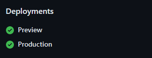

import { sharedMetaDataArticle } from '@/shared/metadata-article'
import Breadcrumbs from '@/components/tutorial/Breadcrumbs'
import Pagination from '@/components/tutorial/Pagination'
import DonationsMessage from '@/shared/donations-message.mdx'

export const metadata = {
    title: frontmatter.title,
    description: frontmatter.description,
    keywords: frontmatter.keywords,
    alternates: {
        canonical: frontmatter.permalink,
    },
    openGraph: {
        ...sharedMetaDataArticle.openGraph,
        images: [{
          type: "image/png",
          width: 1200,
          height: 630,
          url: '/web_development/og/tutorials_next-js-static-first-mdx-starterkit/opengraph-image'
        }],
        url: frontmatter.permalink,
        section: frontmatter.section,
        publishedTime: frontmatter.published,
        modifiedTime: frontmatter.modified,
        tags: frontmatter.keywords,
    },
}

%toc%

<article>

<Breadcrumbs list={[
    { label: 'Web development tutorials', href: '/web_development' },
    { label: 'Next.js 15 static first MDX starterkit', href: '/web_development/tutorials/next-js-static-first-mdx-starterkit' },
]} />

# CI/CD pipeline for automatic deployments

In this part of the tutorial, we will set up a CI/CD pipeline that will automatically deploy our code using [Vercel](https://vercel.com)

> [!WARN]  
> Vercel is a paid service but their Hobby plan is **free**, so if you haven't tried Vercel yet, you can get an idea of how it performs compared to your current deployment process. For personal blog the hobby plan is enough, but if you plan on deploying a high traffic website then costs will occur, to get a better idea about what is included in the free plan and what the potential costs are, I recommend checking out their [pricing page](https://vercel.com/pricing) first

> [!NOTE]  
> You might still remember how, in the past, we would use FTP software and manually transfer code to a server, or you might have struggled setting up GitHub actions... When using Vercel, they will set up the workflow for us and start monitoring our repository. If they detect a new commit (or pull request), they will fetch our code and automatically deploy it (on their infrastructure) for us.  
>  
> This means we don't have to do anything else besides committing our code as we have already done before, but there will be no new additional step, meaning there is no further click on a button needed 😉  

Of course, if you prefer to use GitHub actions to create your own CI/CD pipeline, feel free to do so

Also, feel free to use another provider like [AWS](https://aws.amazon.com/), [Google cloud (GCP)](https://cloud.google.com/), [Azure](https://azure.microsoft.com/), [Netlify](https://www.netlify.com/), [Heroku](https://www.heroku.com/), to just name a few, but in this example, I show you how easy and quick it is to use [Vercel](https://vercel.com)

I'm not sponsored and don't endorse any of the providers listed here, I just wanted to give Vercel a try for some time and thought it would fit well into this tutorial. So far I really like it, my blog [chris.lu](https://chris.lu) currently uses the hobby plan. I will try to make more tutorials in the future that use other deployment tools and hosting providers, maybe the next tutorial will be about deploying a static website to [GitHub pages](https://pages.github.com/) using [GitHub actions](https://docs.github.com/actions)

> [!MORE]  
> [vercel.com "pricing" page](https://vercel.com/pricing)  

## Vercel setup

First, you need to have or create a hobby (free) account on [Vercel](https://vercel.com) (if you need help with that step, check out my chapter [Create a Vercel account (sign up)](/web_development/posts/vercel#create-an-account-sign-up) in the Vercel post)

Now we need to create a new project on Vercel and allow them to access our repository (if you need help with that step, check out my chapter [Add a new project (repository)](/web_development/posts/vercel#add-a-new-project-repository) in the Vercel post)

Now that we have added our GitHub repository to Vercel, every commit (or pull request) we make to the main branch will trigger a production deployment, and every commit we make to the preview branch will trigger a preview (staging) deployment.

> [!MORE]  
> [chris.lu "Vercel" post](/web_development/posts/vercel)  

## Testing preview deployments

To see how this works, open a new tab in your browser and open the [Vercel dashboard](https://vercel.com/dashboard) page

In the **Projects** list, click on the name of your project to access the project page (something like `https://vercel.com/TEAM_NAMEs-projects-PROJECT_HASH/PROJECT_NAME`)

On top, you will have a section called **Production Deployment**, and below that, there is a section called **Active Branches**, which is still empty (no **preview** branch deployment yet)

> [!NOTE]  
> On the project page, you can also find your **production deployment domains**  
>  
> Those are useful if you don't have a custom domain yet, as they are short URLs to your production deployment that you can bookmark as they won't change over time  

Now open VSCode and make sure you are on the **preview** branch.

Open the `README.md` file and, for example, add a small explanation that our project is now auto-deploying on Vercel, like so:

```md showLineNumbers {11-15}
# MY_PROJECT

## npm commands (package.json scripts)

`npm run dev`: to start the development server (NOT using turbopack)  
`npm run dev-turbo`: to start the development server (using turbopack)  
`npm run build`: to make a production build  
`npm run start`: to start the server on a production server using the build we made with the previous command  
`npm run lint`: to run a linting script that will scan our code and help us find problems in our code  

## CI/CD pipeline for automatic deployments

Every time code gets pushed into the main branch, it will trigger a production deployment

When code gets pushed into the preview branch, it will trigger a preview deployment

```

Then, save the file, commit, and sync the changes.

Now open the browser tab in which you opened your Vercel project page.

In the section **Active Branches**, you should now see an entry for the **preview** branch (if it does not show up, manually reload the page)

At the end of the deployment row there is a button with **3 dots**, click on the **3 dots** (`...`) at the end of your preview branch row and then click on **Copy URL** to copy the URL of the deployment

Your branch URL will be something like `https://PROJECT_NAME-git-preview-TEAM_NAMEs-projects-PROJECT_HASH.vercel.app/`

Paste the branch URL you just copied into your browser address bar and press `Enter`

On top of project page, in the navigation, there is also a tab called **Deployments**, which leads to a page that list all current and past deployments for your project.

> [!NOTE]  
> When you visit your preview URL, Vercel will ask you to log in (if you are not logged in yet); this is because only you are supposed to have access to the previews; if someone else wants access, they will first have to request access and wait for you to grant them access  

Because GitHub and Vercel are now connected, you will also have all the information about your deployments on your GitHub page.

Open the repository page on GitHub and look at the right sidebar.

You will now see a new section called **Deployments**:



If, for example, you click on **preview**, it will open the deployments page.

On top of that page, you will have a link to the live preview on the vercel.app domain, and below, you will have a list of the recent deployments

Congratulations 🎉 you are now viewing a preview version of your project hosted on Vercel

<DonationsMessage />

<Pagination
    previous={{ label: 'package.json (npm run) scripts', href: '/web_development/tutorials/next-js-static-first-mdx-starterkit/package-json-scripts' }}
    next={{ label: 'Error handling and logging', href: '/web_development/tutorials/next-js-static-first-mdx-starterkit/error-handling-and-logging' }}
/>

</article>
