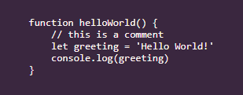
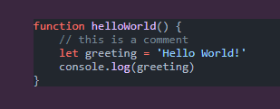
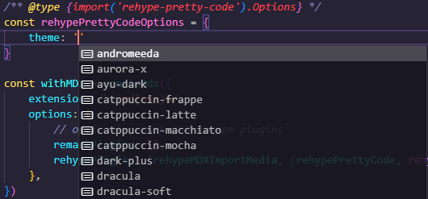
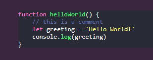
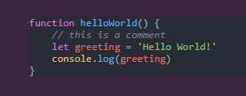
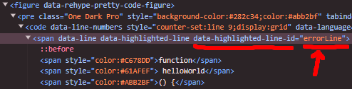
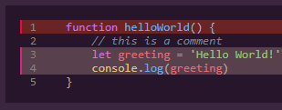
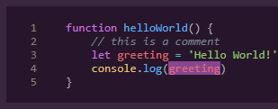
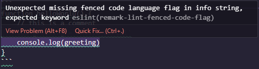
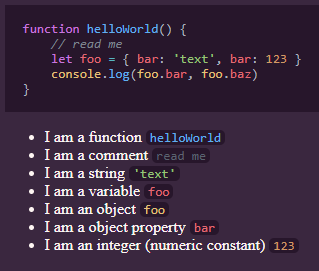

import { sharedMetaDataArticle } from '@/shared/metadata-article'
import Breadcrumbs from '@/components/tutorial/Breadcrumbs'
import Pagination from '@/components/tutorial/Pagination'

export const metadata = {
    title: frontmatter.title,
    description: frontmatter.description,
    keywords: frontmatter.keywords,
    alternates: {
        canonical: frontmatter.permalink,
    },
    openGraph: {
        ...sharedMetaDataArticle.openGraph,
        images: [{
          type: "image/png",
          width: 1200,
          height: 630,
          url: '/web_development/og/tutorials_next-js-static-first-mdx-starterkit/opengraph-image'
        }],
        url: frontmatter.permalink,
        section: frontmatter.section,
        publishedTime: frontmatter.published,
        modifiedTime: frontmatter.modified,
        tags: frontmatter.keywords,
    },
}

%toc%

<article>

<Breadcrumbs list={[
    { label: 'Web development tutorials', href: '/web_development' },
    { label: 'Next.js 15 static first MDX starterkit', href: '/web_development/tutorials/next-js-static-first-mdx-starterkit' },
]} />

# Code highlighting plugin

[rehype pretty code](https://rehype-pretty.pages.dev/) is a rehype plugin that we will use to convert our regular markdown code blocks into **highlighted** code blocks

For me, the best about **rehype pretty code** is that it uses [shiki](https://shiki.matsu.io/) under the hood, **shiki** is fantastic at highlighting code, but it also comes with an impressive feature, which is that you can use your favorite VSCode theme to make your code blocks look the same as your code in VSCode

## No next.config.ts

If you use Typescript for your Next.js config file and import this plugin, then you will get a node.js error telling you that it can NOT import the "vscode-textmate" package (which is a shiki dependency, shiki is used by this plugin).

As described on a previous page, the reason for this is that next.config.ts files have [NO support for ESM only packages](/web_development/tutorials/next-js-static-first-mdx-starterkit/next-config#nextconfigts-does-not-yet-support-esm) (yet)

As of now the only workaround for this problem (besides not using this plugin, as there are many alternatives like [rehype-starry-night](https://github.com/rehypejs/rehype-starry-night) and [rehype-highlight)](https://github.com/rehypejs/rehype-highlight)), is to go back to using a **next.config.mjs** file. You could rename your current next.config.ts to _next.config.ts (with an underscore) to have a backup and then make a copy that you name it next.config.mjs. Then you need to edit the next.config.mjs to comment out type imports and comment out code that creates or uses types. After that all you can do is keep using a Javascript file until the Typescript configuration files get support for ESM only packages

## Adding a new playground page

First, go into the `/app/(tutorial_examples)` folder and then create a new `code-highlighting_playground` folder

Inside the `code-highlighting_playground` folder, create a new `page.mdx` MDX page and add the following content:

````md title="/app/(tutorial_examples)/code-highlighting_playground/page.mdx" showLineNumbers
<article>

```js
function helloWorld() {
    // this is a comment
    let greeting = 'Hello World!'
    console.log(greeting)
}
```

</article>

````

We create a new playground MDX page, where lines 3 to 9, we add a code block example to our playground

If the dev server is not already running, first start the dev server (using the `npm run dev` command) and then open the `http://localhost:3000/code-highlighting_playground` playground page URL in your browser to have a look at the result:



The markdown code block syntax got converted into `<pre>{:html}` HTML element, and inside of that container, there is a `<code class="language-js">{:html}` HTML element, but there is no colorful syntax highlighting yet.

This is why we will now add the **rehype pretty code** plugin.

> [!MORE]  
> ["rehype pretty code" website](https://rehype-pretty.pages.dev/)  
> ["shiki" website](https://shiki.matsu.io/)  

## Rehype pretty code installation

To install the **rehype pretty code** as well as the **shiki** package, we use the following command command:

```shell
npm i rehype-pretty-code shiki --save-exact
```

Next, we edit our `next.config.mjs` file (in the root of our project) to add the plugin configuration like so:

```js title="next.config.mjs" showLineNumbers {5} {14} /rehypePrettyCode/2
import { withSentryConfig } from '@sentry/nextjs';
//import type { NextConfig } from 'next'
import { PHASE_DEVELOPMENT_SERVER } from 'next/constants.js'
import createMdx from '@next/mdx'
import rehypeMDXImportMedia from 'rehype-mdx-import-media'
import rehypePrettyCode from 'rehype-pretty-code'

const nextConfig = (phase/*: string*/) => {

    const withMDX = createMdx({
        extension: /\.mdx$/,
        options: {
            // optional remark and rehype plugins
            remarkPlugins: [],
            rehypePlugins: [rehypePrettyCode, rehypeMDXImportMedia],
        },
    })
```

Line 2: as we went back to using Javascript for our next.config file, we need to comment out type imports (we keep them as we will transition back to Typescript as soon as the [next.config.ts has no support for ESM only packages](#no-nextconfigts) problem we discussed earlier is fixed)

Line 3: As this is not Typescript code anymore, and we are importing a file (have a look at the Node.js documentation explaining why [file extensions are mandatory](https://nodejs.org/api/esm.html#mandatory-file-extensions) for more details), which is why we added the extension to the constants file path (`next/constants.js`)

Line 6: we import our new **rehypePrettyCode** plugin

Line 15: we add the plugin to the rehype plugins configuration

Now have another look at the playground page in your browser, and you will notice that this already looks a lot better when using the shiki default colors for highlighting:



> [!MORE]  
> [NPM "rehype-pretty-code" package](https://www.npmjs.com/package/rehype-pretty-code)  
> [NPM "shiki" package](https://www.npmjs.com/package/shiki)  

## Using VSCode themes for code highlighting

Next, we will configure the rehype plugin to use a VSCode theme.

> [!TIP]  
> You can install any VSCode theme you like. If you haven't a favorite VSCode theme yet, have a look at the [VSCode marketplace](https://marketplace.visualstudio.com/vscode)
>  
> When you find one you like, I recommend you first check out if the [themes bundled with shiki](https://shiki.style/themes) page lists it, all themes included in shiki come from the [tm-themes package](https://www.npmjs.com/package/tm-themes), if a theme is in that package, then it is convenient as you don't need to install the theme yourself

To add a theme that **shiki** supports, all we need to do is edit the **rehype-pretty-code** plugin configuration in our `next.config.mjs` file, like so:

```js title="next.config.mjs" showLineNumbers {9}#special {10-12} {19} /[rehypePrettyCode, rehypePrettyCodeOptions]/#special
import { withSentryConfig } from '@sentry/nextjs';
//import type { NextConfig } from 'next'
import { PHASE_DEVELOPMENT_SERVER } from 'next/constants.js'
import createMdx from '@next/mdx'
import rehypeMDXImportMedia from 'rehype-mdx-import-media'
import rehypePrettyCode from 'rehype-pretty-code'

const nextConfig = (phase/*: string*/) => {

    /** @type {import('rehype-pretty-code').Options} */
    const rehypePrettyCodeOptions = {
        theme: 'dracula',
    }

    const withMDX = createMdx({
        extension: /\.mdx$/,
        options: {
            // optional remark and rehype plugins
            remarkPlugins: [],
            rehypePlugins: [[rehypePrettyCode, rehypePrettyCodeOptions], rehypeMDXImportMedia],
        },
    })
```

Line 9: we import the types for the **rehype-pretty-code** configuration, which improves the DX as it shows us for every configuration option which values we can choose from

Lines 10 to 12: we create a **rehype-pretty-code** options object and tell shiki that we want to use the bundled [Dracula Theme for Visual Studio Code](https://draculatheme.com/visual-studio-code)

Because we added the types, we will get a nice autocomplete showing us what other values we could choose from:



Line 19: we add the options to our rehype plugins configuration

Now have another look at the playground page in your browser, and you will notice that this time, the code is highlighted using the colors of the theme (using the same colors we have in VSCode using the Dracula Theme for Visual Studio Code):



### Using a VSCode theme from a git repository

If there is a theme you wish to use, but that theme is NOT among the ones bundled in shiki, then you can get the theme using its git repository as source.

In this example, we will install a theme called [One Dark Pro (Atom's iconic One Dark theme for Visual Studio Code)](https://github.com/Binaryify/OneDark-Pro/)

> [!NOTE]  
> We are using the **One Dark Pro for VSCode** theme in this example even though you can use this theme without actually downloading it (as we did in the previous example) because it is one of the many themes bundled with shiki, but I use it here as an example to show you what to do when using any theme from a git repository  

First, go to the git repository of the theme you want to use and copy the **https** URL, then install it using the npm install command, but instead of using a package name, you use the repository URL.

For example, to install the **One Dark Pro Theme** you would use the following command:

```shell
npm i https://github.com/Binaryify/OneDark-Pro.git
```

The repository gets added to your node_modules like any other package, and the package.json then contains an entry like this:

```json title="package.json"
"dependencies": {
    "material-theme": "github:Binaryify/OneDark-Pro",
},
```

> [!NOTE]  
> At first, I was surprised to see the name **material-theme** in my package.json, but this is normal
>  
> It is the name the One Dark theme has defined as name in its package.json

Then you go into your Next.js configuration file and change the code to this:

```js title="next.config.mjs" showLineNumbers {6} {10-11} {15} /JSON.parse(themeFileContent)/
import { withSentryConfig } from '@sentry/nextjs';
//import type { NextConfig } from 'next'
import { PHASE_DEVELOPMENT_SERVER } from 'next/constants.js'
import createMdx from '@next/mdx'
import rehypeMDXImportMedia from 'rehype-mdx-import-media'
import rehypePrettyCode from 'rehype-pretty-code'
import { readFileSync } from 'fs'

const nextConfig = (phase/*: string*/) => {

    const themePath = new URL('./node_modules/material-theme/themes/OneDark-Pro.json', import.meta.url)
    const themeFileContent = readFileSync(themePath, 'utf-8')

    /** @type {import('rehype-pretty-code').Options} */
    const rehypePrettyCodeOptions = {
        theme: JSON.parse(themeFileContent),
    }

    const withMDX = createMdx({
        extension: /\.mdx$/,
        options: {
            // optional remark and rehype plugins
            remarkPlugins: [],
            rehypePlugins: [[rehypePrettyCode, rehypePrettyCodeOptions], rehypeMDXImportMedia],
        },
    })
```

Line 6: we import the **readFileSync** function from the Node.js [file system module (fs)](https://nodejs.org/api/fs.html)

Line 10: we create a URL using the path to the location of our theme in the node_modules folder

Line 11: we use the **readFileSync** to read the content of the theme file

Line 15: we parse the themes json file content using the javascript **JSON parser** before passing it to the plugin theme configuration option

Now have another look at the playground, and you will notice that this time, the code is highlighted using the colors of the One Dark Pro theme:



> [!NOTE]  
> As themes are JSON files that you import in your configuration, and if you are into creating personalized color palettes, then you have the option to create or at least edit an existing theme  
>  
> All you need to do is create a json file (or clone one of the themes you like), bring in your own colors, and then import it the same way we imported a theme that we downloaded from GitHub  
>  
> If you have created your own theme you could then host it on GitHub to share it with others, and even go a step further by [creating your own VSCode theme extension](https://code.visualstudio.com/api/get-started/your-first-extension) and then [publish it on the VSCode marketplace](https://code.visualstudio.com/api/working-with-extensions/publishing-extension)  

> [!MORE]  
> [VSCode marketplace](https://marketplace.visualstudio.com/vscode)  
> [NPM "tm-themes" package](https://www.npmjs.com/package/tm-themes)  
> [One Dark Pro theme for VSCode)](https://github.com/Binaryify/OneDark-Pro/)  
> [Dracula theme for VSCode](https://draculatheme.com/visual-studio-code)  

## Code block styling

Next, we add the following CSS to our `global.css` file:

```css title="/app/global.css" showLineNumbers{135} {1-5} {7-11}
[data-rehype-pretty-code-figure],
[data-rehype-pretty-code-figure]>pre {
    margin: 0;
    padding: 0;
}

[data-rehype-pretty-code-figure]>pre {
    width: 100%;
    overflow: auto;
    padding: var(--spacing);
}
```

Lines 135 to 139: we only reset the **margin** and **padding** on the `<figure>{:html}` element that is the container of a rehype-pretty-code code block; **rehype-pretty-code** use a `<figure>{:html}` element as container around code blocks, that `<figure>{:html}` element has a **data-rehype-pretty-code-figure** attribute, we use that attribute to target the element using a selector in our CSS, as well as the `<pre>{:html}` element that is inside of the `<figure>{:html}` element

Lines 141 to 145: we set the **width** of the `<pre>{:html}` element to **100%** to make sure our code block is as wide as our articles, and then we set the **overflow** property to **auto**, meaning that if the code inside of the code block is too large, then the code block is allowed to add (and display) a vertical scrollbar. If the code fits the code block then the scrollbar will be hidden. Finally we use our spacing variable to add some padding all around our code. 

### Customizing the code block background color

When styling and using themes, you can either keep the original background color defined in the themes json or deactivate it. This is especially interesting if the theme background color does not match your website's color palette at all and you want to use a different background color for your code blocks.

As we will see, it is easy to configure rehype pretty code to use a custom background color instead of the one from the VSCode theme. However, it can be tricky to find a background color that both, looks good when placed in a page that uses your websites color palette, and still has a high enough contrast when used as background for code that gets highlighted using the VSCode theme colors.

To disable the default theme background color, we edit the rehype pretty code configuration in our `next.config.mjs` file:

```js title="next.config.mjs" showLineNumbers{13} {4}
/** @type {import('rehype-pretty-code').Options} */
const rehypePrettyCodeOptions = {
    theme: JSON.parse(themeFileContent),
    keepBackground: false,
}
```

Line 16: we set the `keepBackground` option to false, which disables the default theme background color

Then we **add** our background color to our rehype-pretty-code CSS in the `global.css` file:

```css title="/app/global.css" showLineNumbers{135} {11}
[data-rehype-pretty-code-figure],
[data-rehype-pretty-code-figure]>pre {
    margin: 0;
    padding: 0;
}

[data-rehype-pretty-code-figure]>pre {
    width: 100%;
    overflow: auto;
    padding: var(--spacing);
    background-color: #27162b;
}
```

Line 145: we add our `background-color`. I chose a very dark color to make we have a high contrast between the code colors and the background

Make sure your dev server is running and then have a look at the result of what we have achieved so far: `http://localhost:3000/code-highlighting_playground`

(Also if you didn't do a commit recently, now is a good time to do so)

## Line numbers

On its website, the **rehype-pretty-code** plugin author recommends adding some more CSS if you want to display line numbers (in your code blocks on the left side):

```css title="/app/global.css" showLineNumbers{148}
/* recommended by https://rehype-pretty-code.netlify.app/ */
code[data-line-numbers] {
    counter-reset: line;
}

code[data-line-numbers]>[data-line]::before {
    counter-increment: line;
    content: counter(line);

    /* Other styling */
    display: inline-block;
    width: 1rem;
    margin-right: 2rem;
    text-align: right;
    color: gray;
}

code[data-line-numbers-max-digits="2"]>[data-line]::before {
    width: 2rem;
}

code[data-line-numbers-max-digits="3"]>[data-line]::before {
    width: 3rem;
}
```

We are using an interesting CSS feature here: the [CSS counters](https://developer.mozilla.org/en-US/docs/Web/CSS/CSS_counter_styles/Using_CSS_counters) feature is perfect for numbering code block lines but can be used for other things too, for example, if you want to add numbering to headings or lists

Next, we need to go back to our playground and add a keyword on top of our code block to tell rehype pretty code to enable the **line numbers** for that code block, meaning only code blocks for which you use the **showLineNumbers** keyword will have line numbers. This is because when using the keyword, the rehype pretty code plugin will add `data-line-numbers` attribute to the `<code>{:html}` elements, our CSS selector which checks if that attribute exists will then apply the numbering

````md title="/app/(tutorial_examples)/code-highlighting_playground/page.mdx" showLineNumbers {3} /showLineNumbers/#special
<article>

```js showLineNumbers
function helloWorld() {
    // this is a comment
    let greeting = 'Hello World!'
    console.log(greeting)
}
```

</article>

````

Line 3: we add the `showLineNumbers` keyword to the code block markdown

If your code block only contains a **code fragment** and you want to indicate that the first line is NOT 1 but another number, then you add the number you wish to use for the first line inside curly brackets to the showLineNumbers keyword, like so:

````md title="/app/(tutorial_examples)/code-highlighting_playground/page.mdx" showLineNumbers {3} /showLineNumbers{10}/1#special
<article>

```js showLineNumbers{10}
function helloWorld() {
    // this is a comment
    let greeting = 'Hello World!'
    console.log(greeting)
}
```

</article>

````

Line 3: we updated the `showLineNumbers` and attached `{10}` to it, to tell the code block that the first line is number 10 (and NOT the default 1)

> [!MORE]  
> [MDN "CSS counters" documentation](https://developer.mozilla.org/en-US/docs/Web/CSS/CSS_counter_styles/Using_CSS_counters)  

## Line highlighting

Another great feature of rehype pretty code is that you can highlight code lines, and it is effortless to do so

First, we update our global.css and add some styling for highlighted lines, like so:

```css title="/app/global.css" showLineNumbers{173} {2-6} {8-11}
/* code blocks custom styling */
[data-line] {
    border-left-width: 2px;
    border-left-style: solid;
    border-left-color: transparent;
}

[data-highlighted-line] {
    background-color: #58404c;
    border-left-color: #d6277f;
}
```

Lines 174 to 178: we use a selector to target all lines. Lines have a `data-line` attribute, and the CSS we add uses a border to create a vertical line on the left, we will then colorize that border when the code line is highlighted, but by default, we set it to `transparent`; to create this vertical line is of course not mandatory if you don't like it leave it away

Lines 180 to 183: we use a selector to target all lines that have a `data-highlighted-line` attribute; we change the background color of the line as well as the color of the border (vertical line) we added on the left

Then we need to add the numbers of the lines we want to highlight inside of curly brackets (`{}`), like so:

````md title="/app/(tutorial_examples)/code-highlighting_playground/page.mdx" showLineNumbers {3}
<article>

```js showLineNumbers {1} {3-4}
function helloWorld() {
    // this is a comment
    let greeting = 'Hello World!'
    console.log(greeting)
}
```

</article>

````

Line 3: we removed the `{10}{:md}` curly brackets to make our line numbers start with 1 again, then we added a space and then a number inside of curly brackets `{1}{:md}` to highlight the first line and also added `{3-4}{:md}` to highlight lines 3 to 4

As you can see, you can highlight a single line by using the line number, or you can set a range using two values to highlight from line X to line Y.

If you want more than one highlighted line style, you can use IDs to create unlimited variations.

Let's start the other way around, this time we first add an ID to our curly brackets in the playground code block example:

````md title="/app/(tutorial_examples)/code-highlighting_playground/page.mdx" showLineNumbers {3} /#errorLine/#special
<article>

```js showLineNumbers {1}#errorLine {3-4}
function helloWorld() {
    // this is a comment
    let greeting = 'Hello World!'
    console.log(greeting)
}
```

</article>

````

Line 3: we add a new highlight style ID after the curly brackets using a hashtag (`#`), and then we set the highlight line ID to `errorLine`

If you launch the dev server, then open the playground URL `http://localhost:3000/code-highlighting_playground` in your browser, right-click on the code block and then select **Inspect**, you will notice that because we added the `#errorLine` ID we now have a `data-highlighted-line-id="errorLine"` attribute, meaning we can now target `data-highlighted-line-id` attributes that have the value `errorLine` in our CSS to change their background (and left line) color(s)



Next, we update our global.css again and add another highlight style, but this one is only for highlighted lines that have the ID `errorLine`:

```css title="/app/global.css" showLineNumbers{185}
[data-highlighted-line][data-highlighted-line-id="errorLine"] {
    background-color: #6b2424;
    border-left-color: #ff003d;
}
```

Lines 185 to 188: we add a selector to target the `data-highlighted-line-id` attribute if it has the value `errorLine`; we also set a reddish color for the background and vertical line to make this code block line look like a code line with an error

If you launch the dev server and then open the playground URL in your browser, you will see that the first line is highlighted but uses the `errorLine` ID style. Lines 3 to 4 are highlighted, too, but as they have no ID, they use the default highlight line style.



## Characters highlighting

Not only can you highlight lines, but you can also highlight a series of characters.

Go back to editing the playground markdown and change the code block to this:

````md title="/app/(tutorial_examples)/code-highlighting_playground/page.mdx" showLineNumbers {3} /helloWorld()/1#special
<article>

```js showLineNumbers /helloWorld()/
function helloWorld() {
    // this is a comment
    let greeting = 'Hello World!'
    console.log(greeting)
}
```

</article>

````

Line 3: we remove the curly brackets (used to highlight a line) from the previous example and instead used two slashes (`/`) to tell rehype pretty code that we want to highlight `helloWorld()`

Next, we update our stylesheet and add some CSS to style highlighted characters:

```css title="/app/global.css" showLineNumbers{190}
[data-highlighted-chars] {
    background-color: #432936;
}
```

Lines 190 to 192: we add a custom background color for highlighted characters

Same as for the highlighted lines, you can add an unlimited amount of highlighted character variations by using IDs like so:

````md title="/app/(tutorial_examples)/code-highlighting_playground/page.mdx" showLineNumbers {3} /#mySpecialHighlight/#special
<article>

```js showLineNumbers /greeting/#mySpecialHighlight
function helloWorld() {
    // this is a comment
    let greeting = 'Hello World!'
    console.log(greeting)
}
```

</article>

````

And then you need to add the style for that new ID:

```css title="/app/global.css" showLineNumbers{194}
[data-highlighted-chars][data-chars-id="mySpecialHighlight"] {
    background-color: #874691;
}
```

Lines 194 to 196: we set the background color for highlighted characters when using the **mySpecialHighlight** ID

If you look at the result in your browser, you will notice that both occurrences of the greeting variable were highlighted.

To only highlight the second one, add the number 2 behind the second slash, like so:

````md title="/app/(tutorial_examples)/code-highlighting_playground/page.mdx" showLineNumbers {3} /2/#special
<article>

```js showLineNumbers /greeting/2#mySpecialHighlight
function helloWorld() {
    // this is a comment
    let greeting = 'Hello World!'
    console.log(greeting)
}
```

</article>

````

Gives you this (only the second occurrence of "greeting" is highlighted):



## Code block language flag

In the previous example(s), we already saw the first option, which consists of setting the programming language, for instance, to **javascript** by using the `js` language flag (placed after the 3 backticks of our fenced code block), it is essential to set the language flag as rehype pretty code (shiki) needs that information to know what colors to use when highlighting your code.

So far, we have always used javascript by adding the language flag `js`, but if you want, for example, to change the programming language from **javascript** to **JSX**, then all you need to do is change the language flag (after the backticks) to `jsx`, like so:

````md title="/app/(tutorial_examples)code-highlighting_playground/page.mdx" showLineNumbers {3} /jsx/#special
<article>

```jsx showLineNumbers /greeting/2#mySpecialHighlight
function helloWorld() {
    // this is a comment
    let greeting = 'Hello World!'
    console.log(greeting)
}
```

</article>

````

Line 3: we changed the language flag from js to **jsx**

> [!TIP]  
> You can use language flags like js and jsx, ts, and tsx, and also md and mdx, but for example, mjs or esm are not supported as language flags  
>  
> You can check out the complete list of language flags that are available by looking at the [shiki languages file](https://github.com/shikijs/shiki/blob/main/packages/shiki/src/assets/langs-bundle-full.ts#L1248)  

### Configuring the code block default language

There is a second option to specify the programming language. This option is helpful if all your code blocks contain code written in the same language and you want to avoid having to set the language flag for every code block.

In this case, you can use the rehype pretty code configuration to set a default language:

```js title="next.config.mjs" showLineNumbers {17-19}
import { withSentryConfig } from '@sentry/nextjs';
//import type { NextConfig } from 'next'
import { PHASE_DEVELOPMENT_SERVER } from 'next/constants.js'
import createMdx from '@next/mdx'
import rehypeMDXImportMedia from 'rehype-mdx-import-media'
import rehypePrettyCode from 'rehype-pretty-code'
import { readFileSync } from 'fs'

const nextConfig = (phase/*: string*/) => {

    const themePath = new URL('./node_modules/material-theme/themes/OneDark-Pro.json', import.meta.url)
    const themeFileContent = readFileSync(themePath, 'utf-8')

    /** @type {import('rehype-pretty-code').Options} */
    const rehypePrettyCodeOptions = {
        theme: JSON.parse(themeFileContent),
        keepBackground: false,
        defaultLang: {
            block: 'js',
        },
    }
```

Lines 17 to 19: we set the rehype pretty code `defaultLang` configuration option for a code `block` to `js`

Now that we have a default language set, we can remove the language flag we had after the 3 backticks of our fenced code block, like so:

````md title="/app/(tutorial_examples)/code-highlighting_playground/page.mdx" showLineNumbers
<article>

```
function helloWorld() {
    // this is a comment
    let greeting = 'Hello World!'
    console.log(greeting)
}
```

</article>

````

Line 3: we remove the language flag (and any other options)

If you did follow the "ESLint with remark lint setup" we did earlier in this tutorial, then you should now see that our code block is underlined, and if you hover over it, you will see it is an ESLint warning:



We see this Remark lint [remark-lint-fenced-code-flag](https://github.com/remarkjs/remark-lint/blob/main/packages/remark-lint-fenced-code-flag/readme.md) warning because remark-lint is not aware of the default language we just added

If you want to remove the linting warning, use a [comment to disable the remark-link rule](/web_development/tutorials/next-js-static-first-mdx-starterkit/linting-using-vscode-and-extensions#remark-lint-disable-comments-in-mdx) for that code block or if you want to disable that remark-link rule altogether, then you need to edit your `.remarkrc.mjs` file and set the rule to false, as we previously did in the [configuring remark-lint](/web_development/tutorials/next-js-static-first-mdx-starterkit/eslint-mdx-plugin-and-remark-lint#adding-and-configuring-remark-lint) chapter, after editing the remark-lint configuration you might want to [restart the ESLint server in VSCode](/web_development/tutorials/next-js-static-first-mdx-starterkit/linting-using-vscode-and-extensions#restarting-the-eslint-server-in-vscode) and [clear the ESLint cache](/web_development/tutorials/next-js-static-first-mdx-starterkit/eslint-mdx-plugin-and-remark-lint#clearing-the-eslint-cache)

> [!NOTE]  
> If you don't set a default language and also don't set a language flag on a code block, then rehype pretty code will **NOT** get activated for that code block, as it needs to know the programming language to be able to choose the correct colors when highlighting  

### diff (+/- lines) language flag

I mention the **diff** language flag separately as it has an extra feature, by adding a **+** or **-** sign to the start of a line you can tell the code highlighter to display the rows starting with a plus sign as if they had been added and the rows starting with a minus sign as if they had been removed (meaning lines that got added are green and lines that got removed are red)

````md title="/app/(tutorial_examples)/code-highlighting_playground/page.mdx" showLineNumbers
<article>

```diff
function helloWorld() {
-    // this is a comment
+    let greeting = 'Hello World!'
    console.log(greeting)
}
```

</article>

````

With this language you can use the **+** and **-** signs to tell the code highlighter to display the rows starting with a plus sign as if they had been added and the rows starting with a minus sign as if they had been removed

## Highlighting inline code

Rehype pretty code can also highlight inline code.

To showcase this, let's edit our playground to add an inline code example (below the code block example) like so:

````md title="/app/(tutorial_examples)/code-highlighting_playground/page.mdx" showLineNumbers {11}
<article>

```js
function helloWorld() {
    // this is a comment
    let greeting = 'Hello World!'
    console.log(greeting)
}
```

Some text `variable{:js}` some more text `helloWorld(){:js}` even more text

</article>

````

As you might notice, if you run the dev server and then inspect the HTML in the browser, that rehype pretty code did not get applied, and instead, we still have a regular `<code>{:html}` element

As we saw in the previous chapter, rehype pretty code needs information on what colors to apply.

In the previous example, we also saw that we have 2 options for specifying the programming language for a code block.

For inline code, we have one more option:

* add a language flag
* set a default language in the configuration
* add a token (this is an extra option only inline code can use)

First, let's add a bit of CSS to our global.css to improve the styling of inline code:

```css title="/app/global.css" showLineNumbers{198}
/* inline code custom styling */
[data-rehype-pretty-code-figure]>code {
    border-radius: 5px;
    padding: 0 4px;
    background-color: #27162b;
}

[data-rehype-pretty-code-figure]>code [data-line] {
    padding: 0px;
}
```

Both code blocks and inline code use similar HTML elements, but there is one significant difference, which is that for code blocks, there is a `<pre>{:html}` element between the `[data-rehype-pretty-code-figure]` (the `<figure>{:html}` element) and the `<code>{:html}` element, but inline code has no `<pre>{:html}` element between the two. We can use that to our advantage here, by using a child combinator (`>`) between `[data-rehype-pretty-code-figure]` and `code`. This ensures our styling will only get applied if the `<code>{:html}` element is a direct child of the `[data-rehype-pretty-code-figure]` (the `<figure>{:html}` element).

The CSS we add is nothing special, we add a small border radius, some padding and the same background-color we previously used for the code blocks `<pre>{:html}` element

### Inline code language

As we saw in the list above, our **first option** is to add a **language flag** to let rehype pretty code (shiki) know what colors to use.

For inline code, the language flag needs to be inside curly brackets (`{}`) and preceded by a colon (`:`). The brackets need to be at the end of our inline code before the "closing" backtick, like so:

```md /{:js}/#special
Some text `variable{:js}` some more text `function helloWorld(){:js}` even more text
```

Launch the dev server and look at your browser's playground page. You will see that the code is highlighted as intended. However, we will soon see a case where setting the language flag is not enough to get the correct colors. Our inline code has been highlighted, and the colors are correct. The `variable` now has the same color as our variables in the code block above, and so does the `hello-world()` function.

Next, let's remove the language flags we added in the markdown for our inline code like so:

```md
Some text `variable` some more text `helloWorld()` even more text
```

Instead, we are going to use the **2nd option** which consists of setting a **default language** in our Next.js **configuration** file:

```js title="next.config.mjs" showLineNumbers {19}
import { withSentryConfig } from '@sentry/nextjs';
//import type { NextConfig } from 'next'
import { PHASE_DEVELOPMENT_SERVER } from 'next/constants.js'
import createMdx from '@next/mdx'
import rehypeMDXImportMedia from 'rehype-mdx-import-media'
import rehypePrettyCode from 'rehype-pretty-code'
import { readFileSync } from 'fs'

const nextConfig = (phase/*: string*/) => {

    const themePath = new URL('./node_modules/material-theme/themes/OneDark-Pro.json', import.meta.url)
    const themeFileContent = readFileSync(themePath, 'utf-8')

    /** @type {import('rehype-pretty-code').Options} */
    const rehypePrettyCodeOptions = {
        theme: JSON.parse(themeFileContent),
        keepBackground: false,
        defaultLang: {
            block: 'js',
            inline: 'js',
        },
    }
```

Line 19: we add the `inline` option inside of the `defaultLang` configuration for rehype pretty code and set its value to `js`

If we look at our playground in the browser, we see that the 2nd option works well, too.

But look at what happens if we now remove the brackets of our `helloWorld` function:

```md
Some text `variable` some more text `helloWorld` even more text
```

This time, even though we have specified the language (in the configuration), the color is wrong.

This is because, based on the little bit of code, the highlighter can NOT know that it is actually a function and instead assumes it is a variable.

### Inline code tokens

For the **3rd option** to fix the color, we will tell the highlighter explicitly that this is a function.

To do that, we are going to use a **token** instead of the language flag, like so:

```md
Some text `variable` some more text `helloWorld{:.entity.name.function}` even more text
```

Now, the color is what we would expect it to be for a function.

Tokens are similar to language flags, but the difference is that they are inside of curly brackets at the end of inline code, and **tokens start with a colon and a dot** (`:.`) while **language flags only begin with a colon** (`:`)

### How do I know which tokens are available?

In a previous chapter, we used a VSCode theme and VSCode has a guide on their website about [what tokens to use when building themes](https://code.visualstudio.com/api/language-extensions/semantic-highlight-guide#standard-token-types-and-modifiers), on top of the page there is a list of **Standard token types** and on the bottom you will find a list of **Predefined TextMate scope mappings** 

Another way to find out what tokens your theme uses is to look at the json file of the VSCode theme you use.

In that json file, there is a section called **tokenColors**, which is the list of all the tokens and colors the theme uses

For example, this is the [json file for the OneDark Pro theme](https://github.com/Binaryify/OneDark-Pro/blob/2d42e24be590925e686a477113723b7c28015a50/themes/OneDark-Pro.json) on GitHub, it is not always easy to find that json file, for example, the Dracula theme needs to get built first, on GitHub the Dracula theme uses a [yaml file to configure the tokens and colors](https://github.com/dracula/visual-studio-code/blob/e475d548db27773fa0004b252c0a4701f187fb7e/src/dracula.yml), if the YAML file is not enough you could check out the repository and build the Dracula theme yourself, or if you have it installed in VSCode, you could look at the json file in the theme folder (on Windows the path to themes folder is: `%USERPROFILE%\.vscode\extensions`, on macOS it is `~/.vscode/extensions` and on Linux, it is `~/.vscode/extensions`)

> [!MORE]  
> [VSCode "Semantic Highlight" guide](https://code.visualstudio.com/api/language-extensions/semantic-highlight-guide#standard-token-types-and-modifiers)  

### token aliases

There is one last feature I want to bring up, which is **token aliases**, if you don't want always to have to remember and type the full token name, which can be tedious as some tokens have rather complex names like `.meta.object-literal.key`

To add those aliases to our setup, we need to edit our `rehypePrettyCodeOptions` configuration like so:

```js title="next.config.mjs" showLineNumbers{13} {20-28}
/** @type {import('rehype-pretty-code').Options} */
const rehypePrettyCodeOptions = {
    theme: JSON.parse(themeFileContent),
    keepBackground: false,
    defaultLang: {
        block: 'js',
        inline: 'js',
    },
    tokensMap: {
        fn: 'entity.name.function',
        cmt: 'comment',
        str: 'string',
        var: 'entity.name.variable',
        obj: 'variable.other.object',
        prop: 'meta.property.object',
        int: 'constant.numeric',
    },
}
```

Lines 21 to 29: we add several custom token aliases to our rehype pretty code configuration; I tried to use abbreviations that are easy to remember without having to check out the configuration file constantly

> [!NOTE]  
> What tokens are available will vary from theme to theme  
>  
> For example, in OneDark Pro, there is a token **constant.numeric** that I used to create the **int** alias
>  
> But in the Dracula theme, it does not exist. There is only a global **constant** but no specific definition for a numeric constant
>  
> Which means you might need to make some adjustments to your tokens map depending on what theme you use  

However, as I mentioned early in this tutorial, it doesn't hurt to also document them in the `README.md` file of the project:

````md showLineNumbers{19} 
## Inline code token aliases

This section contains a list of token aliases for inline code in Markdown (MDX) files.

Tokens get added at the end of inline code markup.

They start with a curly bracket, then a colon followed by a dot, the token alias, and then a closing curly bracket:

```md
some text `myVariable{:.token}`
```

Available token aliases:

* fn: function
* cmt: comment
* str: string (between quotes)
* var: variable
* obj: object
* prop: object property
* int: integer
````

Next, we add a code block and a list of inline code examples to our code-highlighting playground page to test our tokens map, this time using the tsx language flag:

````md title="/app/(tutorial_examples)/code-highlighting_playground/page.mdx" showLineNumbers
<article>

```tsx
function helloWorld() {
    // read me
    let foo = { bar: 'text', bar: 123 }
    console.log(foo.bar, foo.baz)
}
```

* I am a function `helloWorld{:.fn}`
* I am a comment `read me{:.cmt}`
* I am a string `'text'{:.str}`
* I am a variable `foo{:.var}`
* I am an object `foo{:.obj}`
* I am an object property `bar{:.prop}`
* I am an integer (numeric constant) `123{:.int}`

</article>

````

If we used the correct tokens to create our aliases map, the colors in the list of inline code examples (where we use the aliases) should match the colors in the code block above.



> [!TIP]  
> There are even more features like **shiki transformers**, **visitor hooks** and **custom highlighters** (which we will not see in this tutorial), but you can find more info about them in the [rehype pretty code](https://rehype-pretty.pages.dev/) and [shiki](https://shiki.style/) docs websites

Congratulations 🎉 you finished learning about how to highlight code using a remark plugin and learned how to use most of its features (including using VSCode themes)

If you liked this post, please consider making a [donation](https://buymeacoffee.com/chriswwweb) ❤️ as it will help me create more content and keep it free for everyone

<Pagination
    previous={{ label: 'MDX plugins', href: '/web_development/tutorials/next-js-static-first-mdx-starterkit/mdx-plugins' }}
    next={{ label: 'Rehype slug plugin to add IDs to headings', href: '/web_development/tutorials/next-js-static-first-mdx-starterkit/headings-id-plugin' }}
/>

</article>
