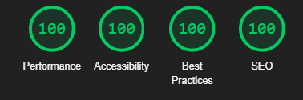

import { sharedMetaDataArticle } from '@/shared/metadata-article'
import { FontAwesomeIcon } from '@fortawesome/react-fontawesome'
import { faBug, faComments } from '@fortawesome/free-solid-svg-icons'
import Breadcrumbs from '@/components/tutorial/Breadcrumbs'
import Pagination from '@/components/tutorial/Pagination'

export const metadata = {
    title: frontmatter.title,
    description: frontmatter.description,
    keywords: frontmatter.keywords,
    alternates: {
        canonical: frontmatter.permalink,
    },
    openGraph: {
        ...sharedMetaDataArticle.openGraph,
        images: [{
          type: "image/png",
          width: 1200,
          height: 630,
          url: '/web_development/og/tutorials_next-js-static-first-mdx-starterkit/opengraph-image'
        }],
        url: frontmatter.permalink,
        section: frontmatter.section,
        publishedTime: frontmatter.published,
        modifiedTime: frontmatter.modified,
        tags: frontmatter.keywords,
    },
}

%toc%

<article>

<Breadcrumbs list={[
    { label: 'Web development tutorials', href: '/web_development' },
    { label: 'Next.js 15 static first MDX starterkit', href: '/web_development/tutorials/next-js-static-first-mdx-starterkit' },
]} />

# Introduction

The tutorial is about adding **MDX support** to a **Next.js 15** (and **React 19**) project because MDX pages can be great to create a **developer portfolio**, a **documentation website**, a **blog** and a lot more. To achieve this we will add several features through **MDX (remark / rehype) plugins**, like **code highlighting**, automatic **table of contents** generation, **github flavored markdown** and **alerts**, **frontmatter**, and a few more. But the tutorial goes beyond adding MDX support, as it contains several chapters about, improving security (for example by adding a **content security policy (CSP)** header), speed optimizations that will **improve** your **web vital metrics**. 

The tutorial is also about creating a solid **static first** core, where we use static site generation (SSG) to generate our pages at **build time**, to avoid Server Side Rendering (SSR) at **run time** as much as possible. Pre-rendering (parts of) your pages at built time (when deploying), will minimize the amount of SSR and lead to decreased loading times as well as decreased load on your servers. Beyond this tutorial, I recommend looking into Next.js 15 features like **Partial Pre-rendering (PPR)** (experimental) and **component streaming** (in Next.js 15 using React 19 suspend) to add in dynamic parts, but also **Incremental Static Regeneration (ISR)**.

We will also make sure the project includes features that hopefully increase your (our teams) **developer experience (DX)**, like using the **Typescript** (VSCode autocomplete, type information), by setting up linting support using **ESLint v9** and **flat config** files (with no RC compatibility mode), by adding **extensions** to **VSCode** to improve linting while you code or write markdown (in MDX files). We will use Vercel for our deployment (CI/CD and hosting) needs (feel to replace that part with a deployment on GitHub pages (setting Next.js "output" configuration option to "export") or you could self host your project (Next.js 15 comes with some improvements for self hosting). We will also add **error logging** and **CSP violations logging** using Sentry.io (again if you prefer to use another service, you can swap that part out and use your preferred solution instead).

> [!NOTE]  
> I tried to make this tutorial as **beginner-friendly** as possible, but also complete enough to be helpful for **senior developers**

This tutorial is partially based on my experience building chris.lu (the source code of my blog be found in my [chris.lu repository](https://github.com/chrisweb/chris.lu) on GitHub). I mention this because it allowed me to test the performance in production (with real visitors from all around the world). So hopefully after reading this tutorial you will be able to build your own and get a great lighthouse score, too:



## Contributing & Questions

Any contributions are always welcome 🙂. If you have a question feel free to ask on the <FontAwesomeIcon icon={faComments} size="1x" color='rgb(255, 0, 170)' /> [discussion](https://github.com/chrisweb/chris.lu/discussions) page and if you find a bug please report it using the <FontAwesomeIcon icon={faBug} size="1x" color='rgb(255, 0, 170)' /> [issues](https://github.com/chrisweb/chris.lu/issues) (PRs for any open Issue are welcome too, if unsure about your PR, ask in the ticket first).

## Source code

All the source code for this tutorial can be found in the [next-js-static-first-mdx-starterkit_tutorial_chris.lu](https://github.com/chrisweb/next-js-static-first-mdx-starterkit_tutorial_chris.lu) repository on GitHub, every chapter of this tutorial is a separate branch in the repository (over time I will probably not keep each branch updated, but I will try to keep the main branch updated for a while and of course PRs are welcome 😉).

## If you are migrating to Next.js 15 and React 19

After transitioning from the pages router to the app router in Next.js 14, yes we are now back at updating the core of our project, but hey look at all the goodies we get 🤩.

### migration steps

1. if you are migrating a project that uses a previous version of Next.js, then you probably want to first create a new branch (or at least make sure you have no uncommitted changes)
1. then we need to update the version of our dependencies (in our package.json)

Next.js 15 has a nice command that will check out your project and depending on its findings it will suggest codemods to use:

```shell
npx @next/codemod@canary upgrade latest
```

Or if you prefer use a custom command, similar to this:

```shell
npm i next@latest react@latest react-dom@latest --save-exact
```

and if you use Typescript, update the the React and React-dom types too:

```shell
npm i @types/react@latest @types/react-dom@latest --save-exact --save-dev
```

Or yet another solution is to use the [versionlens for VSCode extension](https://marketplace.visualstudio.com/items?itemName=pflannery.vscode-versionlens), which is a great extension for quick version updates

1. next we will use **Codemods** (automated code transformations) to speed up the transition from an older version to Next.js 15. Codemods are little helpers that can speed up the migration process by going through your existing code, finding places where you use a feature that needs to get updated and finally upgrade those parts of your code for you. One such example are cookies, which were previously synchronous functions but are now asynchronous functions (cookies are now in the "dynamic APIs" family). Having to await cookies is a breaking change that will require you to upgrade your code. The good news is that [Next.js 15 codemods](https://nextjs.org/docs/app/building-your-application/upgrading/codemods) can help with that. The the Next.js ["Upgrading: Version 15"](https://nextjs.org/docs/app/building-your-application/upgrading/version-15) documentation is worth reading too, as it has information that can potentially save you a lot of time during the migration to Next.js 15
1. same for React 19, you will likely have to do some updates in your code, like converting React 18 components using forwardRef to React 19 components using the ref that is now in component props, but again to speed things up you might want to first give the codemods a try: [React 19 codemods](https://react.dev/blog/2024/04/25/react-19-upgrade-guide#codemods) and check out their official [React 19 upgrade guide](https://react.dev/blog/2024/04/25/react-19-upgrade-guide)
1. before starting to try out new features, getting your project back to building without errors, then adjust to changes like new [caching semantics](https://nextjs.org/blog/next-15#caching-semantics)
1. now you can start to add some of the new features like converting your Next.js configuration file to a typescript (next.config.ts) file, convert a regular React 18 form with an API request on submit to a React 19 version that uses server functions, or try TurboPack in development to decrease your dev build time

> [!NOTE]  
> regarding ESLint v9 and flat config files, this is something that is covered in the upcoming [ESLint setup page](/web_development/tutorials/next-js-static-first-mdx-starterkit/linting-setup-using-eslint))

> [!TIP]  
>  I have more details about the changes you can expect when upgrading to Next.js 15 and React 19 in my [The road to Next.js 15 and React 19](/web_development/posts/road-to-react-19-next-js-15) post.

> [!MORE]  
> [Next.js "Upgrading: Version 15" documentation](https://nextjs.org/docs/app/building-your-application/upgrading/version-15)  
> [React.dev "React 19 upgrade" guide](https://react.dev/blog/2024/04/25/react-19-upgrade-guide)  

## Some Next.js 15 (Turbopack) features are NOT stable yet

There are a few features that I could NOT use in this tutorial or had to disable and I wanted you to be aware of it before we start with the actual tutorial

* Converting the **next.config.js** file to a next.config.ts file: as I describe in the upcoming "Next.js 15 config" page there is [NO support for ESM only packages](/web_development/tutorials/next-js-static-first-mdx-starterkit/next-config#nextconfigts-does-not-yet-support-esm) (but it is coming)
* Using **Turbopack** in development: as we will see in a future chapter does NOT always work (don't get me wrong, I love Turbopack and plan on using it fully as soon as possible, but I also feel like we need to give Turbopack a bit more time to mature), one such case where Turbopack will fail is when [you also intend to enable typed routes](/web_development/tutorials/next-js-static-first-mdx-starterkit/typescript-plugin-and-typed-routes#turbopack-in-nextjs-15-does-not-yet-support-typed-routes), we will see another case when we start working on logging errors, we will use the Sentry SDK for Next.js, which works only without Turbopack as the [Sentry SDK is NOT compatible with Turbopack](/web_development/tutorials/next-js-static-first-mdx-starterkit/error-handling-and-logging#sentry-does-not-yet-support-turbopack) (just yet), then in Next.js v15.0 Turbopack has NO SUPPORT for MDX (remark / rehype) plugins, in Next.js v15.1 they just added a new **experimental** loader 🎉 that allows you to use MDX plugins written in Javascript with Turbopack (which is written in Rust), more about this in the upcoming [MDX plugins page]()
* Support for ESLint **flat config** files: yes in Next.js there is support for ESLint 9, but as we will see [Not everything has full ESLint v9 & flat config support / compatibility](/web_development/tutorials/next-js-static-first-mdx-starterkit/linting-setup-using-eslint#not-everything-is-eslint-v9-and-flat-config-yet), ~~CNA v15.0 for example still installs ESLint v8~~ this is fixed in CNA version 15.1 it now installs ESLint v9), so now everything is ESLint v9 compatible, but both Next.js ESLint packages still use classic configuration files (RC) and NOT flat config, which means you need to use the FlatCompat mode if you want to use them as is
* There are also features like **PPR** (which we will not use it in this tutorial) that work already well today but are still **experimental**, meaning you need to use a canary version and then enable the feature in the Next.js configuration.

## Next.js 14 version of this tutorial

If you don't plan on migrating just yet and still use Next.js 14 then know that I also have a [Next.js 14 version of this tutorial](/web_development/tutorials/next-js-static-mdx-blog) (covering the same topics but also some differences in the content due to the changes that happened between Next.js 14 and Next.js 15)

Of course we will use a lot more packages than this, you can find a full list in the package.json (as well as the whole source code of this tutorial) in the ["Next.js 15 static first MDX starterkit" GitHub repository](https://github.com/chrisweb/next-js-static-first-mdx-starterkit_tutorial_chris.lu)

<Pagination
    previous={{ label: 'Table of Contents', href: '/web_development/tutorials/next-js-static-first-mdx-starterkit' }}
    next={{ label: 'Prerequisites', href: '/web_development/tutorials/next-js-static-first-mdx-starterkit/prerequisites' }}
/>

</article>
