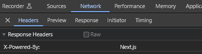

import { sharedMetaDataArticle } from '@/shared/metadata-article'
import Breadcrumbs from '@/components/tutorial/Breadcrumbs'
import Pagination from '@/components/tutorial/Pagination'
import DonationsMessage from '@/shared/donations-message.mdx'

export const metadata = {
    title: frontmatter.title,
    description: frontmatter.description,
    keywords: frontmatter.keywords,
    alternates: {
        canonical: frontmatter.permalink,
    },
    openGraph: {
        ...sharedMetaDataArticle.openGraph,
        images: [{
          type: "image/png",
          width: 1200,
          height: 630,
          url: '/web_development/og/tutorials_next-js-static-first-mdx-starterkit/opengraph-image'
        }],
        url: frontmatter.permalink,
        section: frontmatter.section,
        publishedTime: frontmatter.published,
        modifiedTime: frontmatter.modified,
        tags: frontmatter.keywords,
    },
}

%toc%

<article>

<Breadcrumbs list={[
    { label: 'Web development tutorials', href: '/web_development' },
    { label: 'Next.js 15 static first MDX starterkit', href: '/web_development/tutorials/next-js-static-first-mdx-starterkit' },
]} />

# Next.js 15 config

The next chapter will be about announcement that Next.js 15 now supports **typescript** for **Next.js configuration file** 🤩

After that, we will learn about config **phases**, what they are and how to use them

Finally we will tweak the **react strict mode**, adjust the **powered by** header and add **redirects** to our configuration

## next.config.ts

The [Next.js "next.config.ts" issue #5318](https://github.com/vercel/next.js/issues/5318) is from **2018**, so a bit more than 6 years later the Next.js team announced in the Next.js 15 blog post that they added ["Support for next.config.ts"](https://nextjs.org/blog/next-15#support-for-nextconfigts) 🤩

If you use CNA like we did on one of the previous page, then you will get a next.config.ts out of the box, but if you already have an existing project then you can rename your next.config.js or next.config.mjs to next.config.ts and it will just work (NO other steps required)

> [!NOTE]  
> If the next.config file was the last remaining Javascript file in your project, then you could now have a look at extension lists, like the extensions list for pages in the next.config.ts or the files options in your ESLint configuration and remove the .js or .mjs from those lists

> [!MORE]  
> [Next.js "next.config.ts" documentation](https://nextjs.org/docs/app/api-reference/config/typescript#type-checking-nextconfigts)  

### next.config.ts does NOT (yet) support ESM

> [!WARN]  
> The Next.js team explains the problem well in the documentation, here is a quote from it:
>  
> > Module resolution in next.config.ts is currently limited to CommonJS. This may cause incompatibilities with ESM only packages being loaded in next.config.ts
>  
> That means that in some cases, if you use such packages (and start the development server), then you will see the following error in your terminal (command line tool):
>  
> > Error: No "exports" main defined in SOME_PACKAGE

So before you start to remove your JSDoc @type comments, to replace them with typescript types imports, I recommend converting the config file to typescript, then fix the bare minimum and then check if one of the packages you import into your config are ESM only, if you can't do NOT get an errors you can go ahead and finalize the transition, if there is an incompatible package then maybe they have a ticket you can subscribe to (to get notified of updates, like a fix)

There are several tickets related to this and the good news is that there is also a PR in the works [(PR #68365)](https://github.com/vercel/next.js/pull/68365), which you should subscribe to if you want to get notified of updates

## 3 ways to know what the current environment is

To be able to know what the current environment is, you could use the Node.js **NODE_ENV** environment variable from [process.env](https://nodejs.org/en/learn/command-line/how-to-read-environment-variables-from-nodejs)

However, you need to know that this variable will only ever have two states, when using the `npm run dev` command (the start dev server command) then this variable is **development**, when using the `npm run build` command (the build command) Next.js will always set **NODE_ENV** to **production**, so there is no preview, staging or testing state

Another option is if, like me, you deploy on Vercel, then you can use the **VERCEL_ENV** variable, which is **development** when running your project locally or **preview** when deploying a preview on Vercel and **production** when deploying a production build on Vercel

The third option to know the current context is to use the Next.js config property called **phase**, to get the phase **phase** property, we need to convert **nextConfig** into a **function**. The third option is the one we will use in this tutorial

### Using Next.js configuration phase

We open our `next.config.ts` file again and this time we change the code to this:

```js title="next.config.ts" showLineNumbers {2} {4} {7}#special
import type { NextConfig } from 'next'
import { PHASE_DEVELOPMENT_SERVER } from 'next/constants'

const nextConfig = (phase: string) => {

    if (phase === PHASE_DEVELOPMENT_SERVER) {
        console.log('happy development session ;)')
    }

    const nextConfigOptions: NextConfig = {
        experimental: {
            // experimental typescript "statically typed links"
            // https://nextjs.org/docs/app/api-reference/next-config-js/typedRoutes
            typedRoutes: true,
        }
    };

    return nextConfigOptions

}

export default nextConfig
```

Line 2: we import the **PHASE_DEVELOPMENT_SERVER** constant from the [next/constants](https://github.com/vercel/next.js/blob/5e6b008b561caf2710ab7be63320a3d549474a5b/packages/next/shared/lib/constants.ts#L19-L23)

Line 4: we have converted our next config object into a function, which means we now have access to the **phase** parameter, it will allow us to check what the current context of our Next.js app is

Line 7: we use a console.log as example, when the phase is development we show a message in our terminal

> [!MORE]  
> [Node.js "environment variables" documentation](https://nodejs.org/en/learn/command-line/how-to-read-environment-variables-from-nodejs)  
> [Vercel "system environment variables" documentation](https://vercel.com/docs/projects/environment-variables/system-environment-variables)  
> [Next.js "next.config.js phase" documentation](https://nextjs.org/docs/app/api-reference/next-config-js)  

## React strict mode configuration

[React strict mode](https://react.dev/reference/react/StrictMode) and [powered by header(s)](https://nextjs.org/docs/app/api-reference/next-config-js/poweredByHeader) are two configuration options that often lead to controversial discussions among developers

**React strict mode** is **enabled by default** since **Next.js v13.4** for the **app router** (not the pages router), you can disable the React strict mode in the `next.config.mjs` file by setting the option to **false**

> [!NOTE]  
> For example, if you do NOT want the **Strict Mode** to be enabled in your entire project, then disable it via the Next.js configuration file and then use the `<StrictMode>` only in the pages/layouts... in which you want to enable it

**I recommend** to NOT disable React Strict Mode, I see posts on [Stack Overflow](https://stackoverflow.com/) where people argue to turn it off as it causes problems in their app, however, in my opinion, this is masking problems instead of fixing the root cause, as mentioned on react.dev the Strict Mode does several important things, one of them is **checking if your components use deprecated APIs**

> [!TIP]  
> **Strict Mode** will only run in **development** and NOT in production, this is another reason to keep it turned on, even if it would lead to a problem in development, it will NOT have any impact on your production build and hence have no impact on what your users experience

What surprises developers the most when they use React Strict Mode for the first time is that it re-renders components an extra time (in development)

What happens is that every component gets rendered (and effects triggered), then the components get unmounted and then get mounted a second time, which triggers the rendering process and all of the effects a second time

This is done to detect problems. Here is the explanation from the React.dev documentation as to why this is done:

> React components you write must always return the same JSX given the same inputs (props, state, and context). Components breaking this rule behave unpredictably and cause bugs.

If, for some reason, you don't want it to be enabled in your entire app or if you need to disable it temporarily, then you can do it in the Next.js configuration file

We will, however, leave the strict mode enabled as this is recommended:

```js title="next.config.ts" showLineNumbers {11} /reactStrictMode/#special
import type { NextConfig } from 'next'
import { PHASE_DEVELOPMENT_SERVER } from 'next/constants'

const nextConfig = (phase: string) => {

    if (phase === PHASE_DEVELOPMENT_SERVER) {
        console.log('happy development session ;)')
    }

    const nextConfigOptions: NextConfig = {
        reactStrictMode: true,
        experimental: {
            // experimental typescript "statically typed links"
            // https://nextjs.org/docs/app/api-reference/next-config-js/typedRoutes
            typedRoutes: true,
        }
    };

    return nextConfigOptions

}

export default nextConfig
```

> [!MORE]  
> [React "Strict Mode" documentation](https://react.dev/reference/react/StrictMode)  
> [Next.js "Strict Mode" API reference](https://nextjs.org/docs/app/api-reference/next-config-js/reactStrictMode)  

## Next.js powered by header configuration

**Next.js powered by header** is another Next.js configuration option, if enabled, will add an **x-powered-by** header to all of your pages

To see the **x-powered-by** header for yourself, first open the **browser dev tools** (by pressing the `F12` key or right-clicking somewhere in the page and choosing **Inspect**), then open the [Network Tab](https://developer.chrome.com/docs/devtools/network) and then click on the row for the page, then click on **Headers** and look at the entries for the **response headers** where you should have an entry for x-powered-by, like in this screenshot:



### Why would you want to hide the x-powered-by header?

When I get asked this, my first thought is to ask myself the opposite: "Why would I want to turn it on?"

Honesty,y I have not yet found a reason as to why I would want to have it turned on

I prefer to turn it off because, unfortunately, some people on the web have malicious intentions, and the less they know about your app’s technology stack, the more difficult it will be for them to find vulnerabilities that have been disclosed but are not yet patched in the version you are using

I agree that it does NOT make a huge difference if you turn it on or off because hackers usually just launch batteries of tests against your website, which will probe it for a wide range of known vulnerabilities

Few will use a bot that checks for **x-powered-by** headers to target the framework you are using specifically, and it is also true that hackers can use profiling tools to get a pretty good idea of  what tech stack you are using.

So I agree that setting the poweredByHeader option in the Next.js configuration to off is not a miracle solution that will prevent all potential attacks, but if there is a chance (no matter how small) that turning it off will make my app just a little bit safer, then that's good enough for me and as I said earlier the second reason is that I see no reason why I would want to turn it on

So, if you also want to turn the `poweredByHeader` option off, open the Next.js configuration file and change it to this:

```js title="next.config.ts" showLineNumbers {12} /poweredByHeader/#special
import type { NextConfig } from 'next'
import { PHASE_DEVELOPMENT_SERVER } from 'next/constants'

const nextConfig = (phase: string) => {

    if (phase === PHASE_DEVELOPMENT_SERVER) {
        console.log('happy development session ;)')
    }

    const nextConfigOptions: NextConfig = {
        reactStrictMode: true,
        poweredByHeader: false,
        experimental: {
            // experimental typescript "statically typed links"
            // https://nextjs.org/docs/app/api-reference/next-config-js/typedRoutes
            typedRoutes: true,
        }
    };

    return nextConfigOptions

}

export default nextConfig
```

If you did any of the two changes I mentioned above, then save your `next.config.mjs` and commit/sync your latest changes to your git repository with a commit message like, for example: "turning off powered by the header as I see no reason to have it enabled"

> [!MORE]  
> [Next.js "Powered By Header" API reference](https://nextjs.org/docs/app/api-reference/next-config-js/poweredByHeader)  

## Redirects

If the project you are building is going to replace an existing project, then you might want to add some [redirects](https://nextjs.org/docs/pages/api-reference/next-config-js/redirects). When using Next.js, adding **redirects** is really easy, so I won't do a deep dive, but I just wanted to mention that this can be done in the `next.config.mjs`:

```js title="static route redirect example" {18-26}
import type { NextConfig } from 'next'
import { PHASE_DEVELOPMENT_SERVER } from 'next/constants'

const nextConfig = (phase: string) => {

    if (phase === PHASE_DEVELOPMENT_SERVER) {
        console.log('happy development session ;)')
    }

    const nextConfigOptions: NextConfig = {
        reactStrictMode: true,
        poweredByHeader: false,
        experimental: {
            // experimental typescript "statically typed links"
            // https://nextjs.org/docs/app/api-reference/next-config-js/typedRoutes
            typedRoutes: true,
        },
        redirects: () => {
            return [
                {
                    source: '/my-old-url',
                    destination: '/my-new-url',
                    permanent: true,
                },
            ]
        },
    };

    return nextConfigOptions

}

export default nextConfig
```

Lines 18 to 26: we added our first redirect, by passing an array of redirect objects to the return of the async **redirects** function

It is usually best to change URLs as few as possible because search engines have indexed those pages and some users might have bookmarked them. But especially when switching from the pages router to the app router, you might want to do some redirects for pages you have migrated to a new URL. For those cases, Next.js has a very powerful feature that allows you to redirect old dynamic routes to new dynamic routes:

```js title="dynamic route redirect example" {18-26}
import type { NextConfig } from 'next'
import { PHASE_DEVELOPMENT_SERVER } from 'next/constants'

const nextConfig = (phase: unknown) => {

    if (phase === PHASE_DEVELOPMENT_SERVER) {
        console.log('happy development session ;)')
    }

    const nextConfigOptions: NextConfig = {
        reactStrictMode: true,
        poweredByHeader: false,
        experimental: {
            // experimental typescript "statically typed links"
            // https://nextjs.org/docs/app/api-reference/next-config-js/typedRoutes
            typedRoutes: true,
        },
        redirects: async () => {
            return [
                {
                    source: '/my-old-url-with-a/:slug',
                    destination: '/my-new-url-with-a/:slug',
                    permanent: true,
                },
            ]
        },
    };

    return nextConfigOptions

}

export default nextConfig
```

Lines 21 to 22: we changed the **source** and **destination** to routes with a `:slug` as we want to do redirects for dynamic routes, the **destination** slug will get the value of the **source** slug during a redirect

A lot more is possible, if you want to know more about wildcards, regex support, and even redirects based on data in headers or cookies, then I recommend checking out the official [redirects](https://nextjs.org/docs/pages/api-reference/next-config-js/redirects) documentation, which has lots of examples

Congratulations 🎉 you now know how to use phases and make adjustments to the Next.js configuration

<DonationsMessage />

> [!MORE]  
> [Next.js "redirects" documentation](https://nextjs.org/docs/pages/api-reference/next-config-js/redirects)  

<Pagination
    previous={{ label: 'Typescript plugin and typed routes', href: '/web_development/tutorials/next-js-static-first-mdx-starterkit/typescript-plugin-and-typed-routes' }}
    next={{ label: 'First Typescript page', href: '/web_development/tutorials/next-js-static-first-mdx-starterkit/first-typescript-page' }}
/>

</article>
