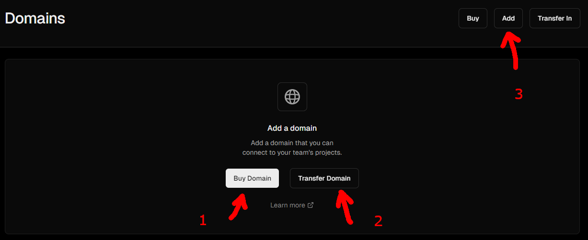

import { sharedMetaDataArticle } from '@/shared/metadata-article'
import Breadcrumbs from '@/components/tutorial/Breadcrumbs'
import Pagination from '@/components/tutorial/Pagination'
import DonationsMessage from '@/shared/donations-message.mdx'

export const metadata = {
    title: frontmatter.title,
    description: frontmatter.description,
    keywords: frontmatter.keywords,
    alternates: {
        canonical: frontmatter.permalink,
    },
    openGraph: {
        ...sharedMetaDataArticle.openGraph,
        images: [{
          type: "image/png",
          width: 1200,
          height: 630,
          url: '/web_development/og/tutorials_next-js-static-first-mdx-starterkit/opengraph-image'
        }],
        url: frontmatter.permalink,
        section: frontmatter.section,
        publishedTime: frontmatter.published,
        modifiedTime: frontmatter.modified,
        tags: frontmatter.keywords,
    },
}

%toc%

<article>

<Breadcrumbs list={[
    { label: 'Web development tutorials', href: '/web_development' },
    { label: 'Next.js 15 static first MDX starterkit', href: '/web_development/tutorials/next-js-static-first-mdx-starterkit' },
]} />

# Production release

This part of the tutorial covers three important things when going into production with a new project. First, we will do a production build and deploy it using Vercel. Next, we will use Vercel's nice feature, Open Graph previews, to check if our Open Graph metadata produces the expected result. Finally, we will add a custom domain name to our project.

## Vercel alternatives

In this tutorial, we deploy to Vercel, but there are a lot of alternatives to chose from. 

> [!TIP]  
> Next.js 15 comes with [improvements to self hosting](https://nextjs.org/blog/next-15#improvements-for-self-hosting) make it easier for you to chose and alternative to Vercel

For example one alternative to Vercel is [Deno Deploy](https://deno.com/blog/nextjs-on-deno-deploy) which has support for Next.js (both static and SSR)

Or as this is a static project you could also deploy your project to [GitHub pages](https://pages.github.com/) (using the Next.js [export configuration option](https://nextjs.org/docs/app/building-your-application/deploying/static-exports)) or you could deploy your static assets using the CDN of your favorite cloud provider.

If you want to mimic Vercel and build your own serverless infrastructure, then you should look into services like [AWS Lambda](https://aws.amazon.com/lambda/) or [Cloudflare Workers](https://workers.cloudflare.com/)

> [!MORE]  
> [Next.js 15 self-hosting improvements](https://nextjs.org/blog/next-15#improvements-for-self-hosting)  
> [Next.js 14.1 self-hosting improvements](https://nextjs.org/blog/next-14-1#improved-self-hosting)  

## Production deployment

First, make sure all code is committed in the review branch

Wait for the review to deploy on Vercel

Check the preview to make sure everything works as intended

Then go to [github.com](https://github.com) (and if you are not yet logged in, log in)

Open your repository page

Create a **pull request** to merge the code from the preview branch into the main (production) branch

Wait for all potential GitHub actions to finish checking your build, and when the bottom box, including the merge button, are all green (because all checks have passed successfully), click on **merge**

When merged, Vercel will start a production deployment

After the build is ready, we use our projects **vercel.app** production domain to make a last test of our website or blog

## Open Graph previews on Vercel

You can try out the **Vercel Open Graph Simulator** that can display Open Graph previews for a multitude of social networks and messengers

Visit [vercel.com](https://vercel.com/) (and then log in if you are not yet logged in), click on your project, and then in the top navigation, click on **Deployments**

Then click on the 3 dots on the right for your latest production deployment and then select **Inspect deployment**

On the **Deployment Details** page you will have a new top navigation, click on **Open Graph**

On the right side, you have the preview, and above the preview there are Icons that represent the different services you can simulate, just click on the icons to switch between them

On the left you can see what open graph the Simulator found in your source code, you can switch between pages by changing the **Pathname** on top

> [!MORE]  
> [Vercel "Open Graph previews" documentation](https://vercel.com/docs/deployments/og-preview)  

## Adding a custom domain for production to Vercel using nameservers

Visit [vercel.com](https://vercel.com/) (and then log in if you are not yet logged in)

You are now on your overview page, in the navigation bar (of your account), you have a section called **Domains**, click on it to access the domains management page

If this is the first domain, in the middle of the page there are two options, to **buy** or to **transfer** a domain, but on top there is a third **add** option  



If you already added a domain, the page will look a bit differently, but you will still have 3 options on top, **Buy**, **Add Existing**, and **Transfer In**

I already own a domain and I see no reason why I would transfer it, as all my domains are at the same registrar and I would like to keep it like that, so I will chose **add** a domain

After clicking on **add**, a modal box will appear and ask you to choose your project, so do just that and then click on **Continue**

Next, add your **domain name** into the input field and click on **Add**

Now Vercel will launch a check, which obviously will fail 🤦, they tell us that your nameserver configuration is Invalid, well it is not invalid it is just that we haven't updated them yet. This step is a bit weird as it is doomed to fail. However, this is how they tell you to do it on the [nameservers documentation](https://vercel.com/docs/projects/domains/working-with-nameservers) page, there is even a warning in which they tell you to first add the domain to the project. At least we now know what the new nameservers are, that we need to use for the configuration on the website of our domain registrar

It doesn't matter if you add the domain to vercel first and then do the nameserver update or first use their nameservers, as you can find all the information you need in their [nameserver documentation](https://vercel.com/docs/projects/domains/working-with-nameservers) page

The two nameservers Vercel tells us to use are:

```txt
ns1.vercel-dns.com
ns2.vercel-dns.com
```

So now you need to visit the website of your registrar and **Edit the nameservers for your domain**, wait for the nameservers update to finish (you either have a status box on the registrar website or get a notification telling you when it is done), this notification is only to tell you that the registrar has made the change, for all worldwide DNS servers to get the update will take some time (worst case scenario is 24h, usually it is a lot less)

Now go back to [vercel.com](https://vercel.com/), then click on the project for which you want to add a domain

Then in the project navigation bar (on top) click on **Settings**

On the Project Settings page, in the navigation on the left, click on **domains**

Now vercel will check again and there is a chance it will also fail again, this is because it takes some time for the DNS Propagation to happen, this can take several hours ([sometimes up to 48 hours](https://vercel.com/guides/why-is-my-vercel-domain-unverified#domain-is-verified-but-can't-access-the-website), but it is usually shorter)

You can use an online tool like [dnschecker](https://dnschecker.org/) to check the DNS Propagation for your domain, in the dropdown list choose **NS** to check for the nameservers

> [!NOTE]  
> Vercel generates a [Let’s Encrypt](https://letsencrypt.org/) [ssl certificate](https://vercel.com/docs/projects/domains/working-with-ssl) for you when you add a domain, meaning all your domains will automatically serve content over a HTTPS connection  

> [!MORE]  
> [Vercel "working with nameservers" documentation](https://vercel.com/docs/projects/domains/working-with-nameservers)  
> [Vercel "project domains" documentation](https://vercel.com/docs/projects/domains)  

## After release task list

First, congratulations on the release 🎉 it is finally done, time to let others have a look at what you have been working all this time

Some tasks you might want to perform to quickly make sure the release was a success:

* Visit your website/blog and then open the browser console to make sure there are no errors/warnings listed
* Make some quick manual checks
  * Check if links are working (at least the most important ones)
  * Make sure images are loading and other media assets like music and videos are playing
  * Don't just check using the hardware you used for the development but also use a phone and tablet to check if your responsive UI is working as intended
* Use tools like Chrome lighthouse or Vercel Speed Insights to ensure the performance of the pages is good
* You also might want to check out the last page of the tutorial to add a sitemap and then submit that sitemap to **Google Search Console** and **Bing Webmaster Tools**, to increase the chance that all your pages get indexed

> [!TIP]  
> At some point (wait a few days to be sure everything is ok)  
>  
> * If there are NO CSP violations, you will want to set the CSP variable **cspReportOnly** (in the next.config.mjs file) to false to start enforcing CSP directives  
> * You might want to start posting about new project on social media and maybe start advertising your project to increase traffic  

<Pagination
    previous={{ label: 'Analytics and Speed Insights', href: '/web_development/tutorials/next-js-static-first-mdx-starterkit/analytics_and_speed_insights' }}
    next={{ label: 'Sitemap (Google Search Console and Bing Webmaster Tools)', href: '/web_development/tutorials/next-js-static-first-mdx-starterkit/sitemap_and_search_console' }}
/>

</article>
