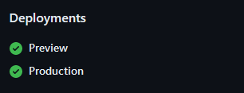

%toc%

<article>

# CI/CD pipeline for automatic deployments

In this part of the tutorial, we will set up a CI/CD pipeline that will automatically deploy our code using [Vercel](https://vercel.com)

> [!NOTE]  
> You might still remember how, in the past, we would use FTP software and manually transfer code to a server, or you might have struggled setting up GitHub actions... When using Vercel, they will set up the workflow for us and start monitoring our repository. If they detect a new commit (or pull request), they will fetch our code and automatically deploy it (on their infrastructure) for us  
>  
> This means we don't have to do anything else besides committing our code as we have already done before, but there will be no new additional step, meaning there is no further click on a button needed 😉  

Of course, if you prefer to use GitHub actions to create your own CI/CD pipeline, feel free to do so

Also, feel free to use another provider, but in this example, I show you how easy and quick it is to use [Vercel](https://vercel.com)

The Hobby plan is free, so if you don't know Vercel yet, you might want to give it a try to get an idea of how it performs compared to your current deployment process

## Vercel setup

First, you need to have or create a hobby (free) account on [Vercel](https://vercel.com) (if you need help with that step, check out my chapter [Create a Vercel account (sign up)](/web_development/posts/vercel#create-an-account-sign-up) in the Vercel post)

Now we need to create a new project on Vercel and allow them to access our repository (if you need help with that step, check out my chapter [Add a new project (repository)](/web_development/posts/vercel#add-a-new-project-repository) in the Vercel post)

Now that we have added our GitHub repository to Vercel, every commit (or pull request) we do into the **main** branch will trigger a **production** deployment, and every commit we do into the **preview** branch will trigger a **preview** (staging) deployment

> [!MORE]  
> [chris.lu "Vercel" post](/web_development/posts/vercel)  

## Testing preview deployments

To see how this works, open a new tab in your browser and open the [Vercel dashboard](https://vercel.com/dashboard) page

In the **Projects** list, click on the name of your project to access the project page (something like `https://vercel.com/TEAM_NAMEs-projects-PROJECT_HASH/PROJECT_NAME`)

On top, you will have a section called **Production Deployment**, and below that, there is a section called **Active Branches**, which is still empty (No Preview Deployments)

> [!NOTE]  
> On the project page, you can also find your **production deployment domains**  
>  
> Those are useful if you don't have a custom domain yet, as they are short URLs to your production deployment that you can bookmark as they won't change over time  

Now open VSCode and make sure you are on the **preview** branch

Open the `README.md` file and, for example, add a small explanation that our project is now auto-deploying on Vercel, like so:

```md showLineNumbers {10-12}
# MY_PROJECT

## npm commands (package.json scripts)

`npm run dev`: to start the development server  
`npm run build`: to make a production build  
`npm run start`: to start the server on a production server using the build we made with the previous command  
`npm run lint`: to run a linting script that will scan our code and help us find problems in our code  

## CI/CD pipeline for automatic deployments

Every time code gets pushed into the main branch, it will trigger a production deployment

When code gets pushed into the preview branch, it will trigger a preview deployment

```

Then save the file, commit, and sync the changes

Now open the browser tab in which you opened your Vercel project page

In the section **Active Branches**, you should now see an entry for the **preview** branch (if it does not show up, manually reload the page)

If you click on **View Deployment Status**, it will open a page with details about the current deployment

Back on the project page, click on the **3 dots** (...) at the end of your preview branch row and then click on **Copy Branch URL**

Your branch URL will be something like `https://PROJECT_NAME-git-preview-TEAM_NAMEs-projects-PROJECT_HASH.vercel.app/`

Paste the branch URL you just copied into your browser address bar and press `Enter`

> [!NOTE]  
> When you visit your preview URL, Vercel will ask you to log in (if you are not logged in yet); this is because only you are supposed to have access to the previews; if someone else wants access, they will first have to request access and wait for you to grant them access  

Because GitHub and Vercel are now connected, you will also have all the information about your deployments on your GitHub page

Open the repository page on GitHub and have a look at the right sidebar

You will now see a new section called **Deployments**:



If, for example, you click on **preview**, it will open the deployments page

On top of that page, you will have a link to the live preview on the vercel.app domain, and below, you will have a list of the recent deployments

Congratulations 🎉 you are now viewing a preview version of your project hosted on Vercel

If you liked this post, please consider making a [donation](https://buymeacoffee.com/chriswwweb) ❤️ as it will help me create more content and keep it free for everyone

</article>
