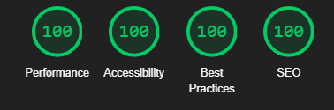

import { sharedMetaDataArticle } from '@/shared/metadata-article'
import { FontAwesomeIcon } from '@fortawesome/react-fontawesome'
import { faBug, faComments } from '@fortawesome/free-solid-svg-icons'
import Breadcrumbs from '@/components/tutorial/Breadcrumbs'
import Pagination from '@/components/tutorial/Pagination'
import ArchivedMessage from '@/components/tutorial/ArchivedMessage'

export const metadata = {
    title: frontmatter.title,
    description: frontmatter.description,
    keywords: frontmatter.keywords,
    alternates: {
        canonical: frontmatter.permalink,
    },
    openGraph: {
        ...sharedMetaDataArticle.openGraph,
        images: [{
          type: "image/png",
          width: 1200,
          height: 630,
          url: '/web_development/og/tutorials_next-static-mdx-blog/opengraph-image'
        }],
        url: frontmatter.permalink,
        section: frontmatter.section,
        publishedTime: frontmatter.published,
        modifiedTime: frontmatter.modified,
        tags: frontmatter.keywords,
    },
}

%toc%

<article>

<Breadcrumbs list={[
    { label: 'Web development tutorials', href: '/web_development' },
    { label: 'Next.js static MDX blog', href: '/web_development/tutorials/next-js-static-mdx-blog' },
]} />

<ArchivedMessage case="next-js-14-static-tutorial" />

# Introduction

I tried to make this tutorial as beginner-friendly as possible. If, however you have a question feel free to ask on the <FontAwesomeIcon icon={faComments} size="1x" color='rgb(255, 0, 170)' /> [discussion](https://github.com/chrisweb/chris.lu/discussions) page and if you find a bug please report it using the <FontAwesomeIcon icon={faBug} size="1x" color='rgb(255, 0, 170)' /> [issues](https://github.com/chrisweb/chris.lu/issues)

I have always wanted to create my own developer profile and not be limited by what I can do on social networks. My main goal was to create a blog (website) that is blazingly fast and has good DX so that I can add content quickly and don't have to spend countless hours doing maintenance. I documented every step while building my dream project and I'm happy to finally be able to share it with the community by publishing this tutorial

After I my first deployment in production went live I immediatly launched a lighthouse analysis and I'm glad the results matched my expectations:

## Preview

In this tutorial, we will:

* create a fully static site using the Next.js v14.x (compatible with v13.x) app directory
* create several components using React v18.x
* add support for MDX content formatting via the @next/mdx package
* add a plugin to generate a table of contents for each post automatically
* add another plugin that will handle code block styling based on your favorite VSCode theme
* add yet another plugin that will render GitHub like alerts, created using the github markdown syntax for alerts
* add linting tools for both the code and the content (markdown lint)
* add a CI/CD pipeline using Vercel.com so that every time we commit code to our GitHub repository, it gets automatically deployed (staging/production)
* add bugs monitoring and Content Security Policy (CSP) violations logging using Sentry.io
* install useful extensions for VSCode and learn how to use them

> [!NOTE]  
> I made this tutorial with total beginners in mind. However, if you are already an experienced Next.js dev, then there are some chapters you may want to skip

## Source code

All the source code for this tutorial can be found in the [next-js-static-mdx-blog_tutorial_chris.lu](https://github.com/chrisweb/next-js-static-mdx-blog_tutorial_chris.lu) repository on GitHub, every chapter of this tutorial is a separate branch in the repository. To view the full code, have a look at the last branch ["32_sitemap"](https://github.com/chrisweb/next-js-static-mdx-blog_tutorial_chris.lu/tree/32_sitemap)

<Pagination
    previous={{ label: 'Table of Contents', href: '/web_development/tutorials/next-js-static-mdx-blog' }}
    next={{ label: 'Prerequisites', href: '/web_development/tutorials/next-js-static-mdx-blog/prerequisites' }}
/>

</article>
