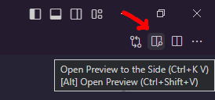

<aside>
%toc%
</aside>

<article>

# MDX editing in VSCode

## file associations and language mode

As of now (01.01.2024) the MDX support in VSCode is almost non existing, I first had my VSCode set up so that every file with an *.mdx extension gets mapped to the VSCode MDX "Language Mode", unfortunatly there are some things I didn't like:

* code highlighting is almost non existing compared to markdown
* intellisense will keep on making weird suggestions based on things you type, which can be very annoying when you type a sentence and for every word intellisense keeps on doing autocomplete for things you don't want to
* finally another disadvantage of using the MDX "Language Mode" is that you have no preview like you the one VSCode has when in markdown "Language Mode"

This is why I decided to associate my MDX files with the markdown language mode instead of the MDX language mode

> [!NOTE]  
> to learn more about the VSCode settings, check out my [VSCode post](/web_development/posts/vscode#vscode-settings)  

I did my settings change for my workspace, this way the setting gets saved into the `.vscode/settings.json` which I can then commit and share with others:

```json title=".vscode/settings.json"
"files.associations": {
    "*.mdx": "markdown"
},
```

> [!MORE]  
> [VSCode "markdown editing" documentation](https://code.visualstudio.com/docs/languages/markdown)  

## markdown preview

If you associate MDX files with markdown in VSCode (or if you work with files that have the *.md extension) then you can preview your markdown content by clicking on the icon in the top right



## easy way to add images to MDX content (using VSCODE)

A great feature of VSCode is that it is very easy to add image to MDX (or markdown) content

All you need to do is select the file in the explorer on the right, then drag it over the MDX (or markdown) document, then press `Shift{:shell}` and drop the file

When you do that VSCode will automatically generate the correct markdown image code and insert the relative path to the image, now if you want you can manually add an alt text and / or a title, which gives you something like this:

```md

```

## MDX VSCode extension


</article>