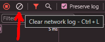

%toc%

<article>

# Navigation and next/link

In this chapter, we will build a basic navigation to navigate between two pages: the home(page) and the second page

So first, let's create that second page

In the `app` folder, create a new `blog` folder

Then, inside the `blog` folder, create a new `page.tsx` with the following content:

```tsx title="/app/blog/page.tsx"
export default function Blog() {

    return (
        <>
            I&apos;m the blog page
        </>
    )
}
```

Next, we are going to create a component for the main Navigation bar of our app

In the `components` folder (that is in the root of the project), create a new `header` folder

Then, inside of the `header` folder, create a new `Navigation.tsx` file and add the following content:

```tsx title="/components/header/Navigation.tsx" /href={menuItem.pathname as Route}/#special
import type { Route } from 'next'

interface IMainMenuItem {
    pathname: string
    text: string
}

const HeaderNavigation: React.FC = () => {

    const mainMenuItems: IMainMenuItem[] = [
        { pathname: '/', text: 'Home' },
        { pathname: '/blog', text: 'Blog' },
    ]

    return (
        <>
            <p>{new Date().toString()}</p>
            <nav id="navigation">
                {mainMenuItems.map((menuItem) => {
                    return (
                        <a
                            href={menuItem.pathname as Route}
                            key={menuItem.pathname}
                            title={menuItem.text}
                        >
                            {menuItem.text}
                        </a>
                    )
                })}
            </nav>
        </>
    )
}

export default HeaderNavigation
```

First, we create a typescript interface and then use it to type our static list of pages, of course, in a more complex project, you might want to fetch this list from a database (at build time), but for our simple example, a json will do, then we iterate through the list to create an entry for each page in our `nav` element

The important part here is to use the `Route` type (that we imported on top) for the `href` value to ensure that next/link understands it is a route and not just a random string, without the `Route` type, you will end up seeing errors like this one:


Finally, we open the `layout.tsx` that is in the `app` folder to import/use the navigation component, like so:

```tsx title="/app/layout.tsx" showLineNumbers {3} {19} {20}#special
import './global.css'
import { Metadata } from 'next'
import HeaderNavigation from '@/components/header/Navigation'

export const metadata: Metadata = {
    title: 'Next.js',
    description: 'Generated by Next.js',
}

export default function RootLayout({
    children,
}: {
    children: React.ReactNode
}) {
    return (
        <html lang="en">
            <body>
                <header>
                    <HeaderNavigation />
                    <p>{new Date().toString()}</p>
                </header>
                <main>{children}</main>
                <footer>
                    <p>My Footer</p>
                </footer>
            </body>
        </html>
    )
}
```

Line 3: we import our new **HeaderNavigation** component  

Line 19: we replace the placeholder paragraph we had earlier with our new **HeaderNavigation** component  

Line 20: we display the current date & time

## Understanding why using regular anchors is NOT recommended

Then save the file and launch the dev server if it isn't already running (using the `npm run dev` command)

Next, open your browser and go to the project’s homepage at [http://localhost:3000/](http://localhost:3000/)

Then open the developer tools (by pressing the `F12` key or right-clicking inside of the page and selecting `Inspect`) and make sure the [Network Tab](https://developer.chrome.com/docs/devtools/network) is open

Make sure the network tab is empty by clicking on the **Clear networking log** icon in the top left corner of the developer tools (or press `Ctrl+L` (macOS: `⌘L`, Linux: `Ctrl+L`) to clear the networking log):



Then click on the **Blog** link in the top navigation to go to the second page we just created

Now look at the Network tab logs, and you should see something similar to this:


The most important information is the first row of the logs, where it says that the **Blog** page is a **document** GET request (I will explain in a bit why we did this initial test)

Now have a look at the time we print on top of the navigation, click on the navigation links, and notice how every time we navigate to a page, the time gets updated, which makes sense as we reload the entire page every time we navigate (we will see in the next chapter how this is different when using next/link)

> [!MORE]  
> [developer.chrome.com "Inspect network activity" documentation](https://developer.chrome.com/docs/devtools/network)  
> [developer.chrome.com "Network Tab" documentation](https://developer.chrome.com/docs/devtools/network)

## Using next/link instead of anchor elements

Now let's replace the [anchor element](https://developer.mozilla.org/en-US/docs/Web/HTML/Element/a) (`<a>`) we used in our navigation component with [next/link](https://nextjs.org/docs/app/api-reference/components/link)

```tsx title="/components/header/Navigation.tsx" showLineNumbers {2} {21}#special {27}#special
import type { Route } from 'next'
import Link from 'next/link'

interface IMainMenuItem {
    pathname: string
    text: string
}

const HeaderNavigation: React.FC = () => {

    const mainMenuItems: IMainMenuItem[] = [
        { pathname: '/', text: 'Home' },
        { pathname: '/blog', text: 'Blog' },
    ]

    return (
        <>
            <nav id="navigation">
                {mainMenuItems.map((menuItem) => {
                    return (
                        <Link
                            href={menuItem.pathname as Route}
                            key={menuItem.pathname}
                            title={menuItem.text}
                        >
                            {menuItem.text}
                        </Link>
                    )
                })}
            </nav>
        </>
    )
}

export default HeaderNavigation
```

Line 2: we import next/link  

Lines 21 and 27: we replace the anchor with the **Link** component  

Now we repeat the steps we did in the previous chapter: ensure dev is running, open Chrome, navigate to [http://localhost:3000/](http://localhost:3000/), open the developer tools, click on the **Network** tab, and clear the networking logs

> [!WARN]  
> Before you make the second test, make sure you are on the homepage ([http://localhost:3000/](http://localhost:3000/)) and that the **Networking log** is cleared

Now click again on the **Blog** link in the top navigation

Now look at the logs of the Networking tab once again:


Have a look at the first line (actually also the second line because there are now two RSC fetches being made); remember last time when we used the anchor, we had a page request on the first line requesting the entire Blog **document**, this time we just have two **fetch** requests getting some RSC (react server component) data from the server, the total of requests is now 2 compared to the previous test where we had a total of 7, less requests means faster loading times, but less traffic from your server also means reduced costs

Faster loading times are, of course, important because the user will be able to navigate faster, and if an app is fast, the user is happy, but it is also great because your server running Next.js will spend less time working on responses, which means it will be able to handle more requests and finally faster loading times will also improve your SEO score

Finally, look again at the time we print on top of the navigation, and you will notice that this time, it doesn't get updated anymore, this is because our layout does not get re-rendered every time we navigate to a new page, which is because Next.js has only replaced the main section of the page but did not make any changes to the layout (this is why on my blog, in the top header if you hit play the songs will continue playing even if you visit a new page, 20 years ago to achieve the same thing I had to put the player into an iFrame, but today with Next.js / React this has become effortless)

> [!NOTE]  
> To be clear, server component layouts **DO NOT** re-render on navigation but client components (when using the 'use client' directive in a layout) **DO** re-render

You can now remove the `<p>{new Date().toString()}</p>` test (in `/app/layout.tsx` at line 20), which we added to demonstrate that the navigation does NOT re-render, we will not need it anymore

> [!MORE]  
> [Next.js "next/link" API reference](https://nextjs.org/docs/app/api-reference/components/link)  

## Highlight the current route using the next/navigation

Next, we are going to use the [pathname](https://developer.mozilla.org/en-US/docs/Web/API/URL/pathname) of the current page that we can get using **next/navigation**, then we will check if the first segment of the current path matches one of the entries in our navigation items list

Update the `Navigation.tsx` like so:

```tsx title="/components/header/Navigation.tsx"
'use client'

import Link from 'next/link'
import { usePathname } from 'next/navigation'
import type { Route } from 'next'

interface IMainMenuItem {
    pathname: string
    text: string
}

const HeaderNavigation: React.FC = () => {

    const currentPagePathname = usePathname()

    const mainMenuItems: IMainMenuItem[] = [
        { pathname: '/', text: 'Home' },
        { pathname: '/blog', text: 'Blog' },
    ]

    const isActiveCheck = (menuItemPathname: string) => {

        let isActiveClass = ''

        if (menuItemPathname.length > 1) {
            if (currentPagePathname.startsWith(menuItemPathname)) {
                isActiveClass = 'active'
            }
        } else {
            // exception for homepage path which is "/"
            // in that case the page path needs to be equal
            if (currentPagePathname === menuItemPathname) {
                isActiveClass = 'active'
            }
        }

        return isActiveClass
    }

    return (
        <>
            <nav id="navigation">
                {mainMenuItems.map((menuItem) => {
                    return (
                        <Link
                            href={menuItem.pathname as Route}
                            key={menuItem.pathname}
                            className={isActiveCheck(menuItem.pathname)}
                            title={menuItem.text}
                        >
                            {menuItem.text}
                        </Link>
                    )
                })}
            </nav>
        </>
    )
}

export default HeaderNavigation
```

Line 1: we add the `use client` directive because we are going to use [usePathname](https://nextjs.org/docs/app/api-reference/functions/use-pathname), which is a hook, so the component needs to be a client component, we do this only now because it is recommended to turn as few server components into client components, we only do it when we need the component to be interactive or require things like the hook we are about to use  

Line 4: we import `usePathname` from **next/navigation**  

Line 14: we get the `pathname` for the current page  

Lines 21 to 38: we have added a function that will check if the **pathname** starts with the path of one of the items in our navigation, if it does, then we add an active class to the className of that item  

Line 48: we use our `isActiveCheck` function to check if that item is active, if it is, the function will add a class, and else `className` will stay empty  

Congratulations 🎉 you created your navigation component using next/link and next/navigation

If you liked this post, please consider making a [donation](https://buymeacoffee.com/chriswwweb) ❤️ as it will help me create more content and keep it free for everyone

> [!MORE]  
> [Next.js "Linking and Navigating" documentation](https://nextjs.org/docs/app/building-your-application/routing/linking-and-navigating)  
> [Next.js "usePathname" API reference](https://nextjs.org/docs/app/api-reference/functions/use-pathname)  

</article>
