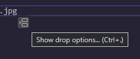
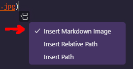

import { FontAwesomeIcon } from '@fortawesome/react-fontawesome'
import { faBug, faComments } from '@fortawesome/free-solid-svg-icons'
import { sharedMetaDataArticle } from '@/shared/metadata-article'
import Breadcrumbs from '@/components/tutorial/Breadcrumbs'
import Pagination from '@/components/tutorial/Pagination'

export const metadata = {
    title: frontmatter.title,
    description: frontmatter.description,
    keywords: frontmatter.keywords,
    alternates: {
        canonical: frontmatter.permalink,
    },
    openGraph: {
        ...sharedMetaDataArticle.openGraph,
        images: [{
          type: "image/png",
          width: 1200,
          height: 630,
          url: '/web_development/og/tutorials_next-static-mdx-blog/opengraph-image'
        }],
        url: frontmatter.permalink,
        section: frontmatter.section,
        publishedTime: frontmatter.published,
        modifiedTime: frontmatter.modified,
        tags: frontmatter.keywords,
    },
}

%toc%

<article>

<Breadcrumbs list={[
    { label: 'Web development tutorials', href: '/web_development' },
    { label: 'Next.js static MDX blog', href: '/web_development/tutorials/next-js-static-mdx-blog' },
]} />

# Optimizing images in MDX using next/image

For the third time we also the mdx-components.tsx file, but we also use our first MDX (remark) plugin. This part is all about [next/image](https://nextjs.org/docs/app/api-reference/components/image), an image component that was created by the [Aurora team at Google](https://developer.chrome.com/docs/aurora/image-component) in cooperation with the Next.js team. By using **next/image** we will make sure that all images we put into our MDX pages get optimized, which means that:

* we will update the configuration to make sure our [PNG](https://web.dev/learn/images/png) or [JPG](https://web.dev/learn/images/jpeg) images get converted automatically into formats like [WEBP](https://web.dev/learn/images/webp) and [AVIF](https://web.dev/learn/images/avif); this will reduce the file sizes of images without them losing in quality, which means our images will consume less bandwidth and load faster
* we will use **next/image**, which will help us make our images [responsive](https://developer.mozilla.org/en-US/docs/Learn/HTML/Multimedia_and_embedding/Responsive_images) by creating a srcset to define multiple versions of an image that have different dimensions, so that on small screens we small images that are NOT heavier than necessary and on big screens we load bigger images to make sure the browser does not fetch a small image and then upscale it, which would make it look blurry
* we will also use a remark plugin to make sure the path of each image gets turned into an import, which will allow **next/image** to determine the width and height of our images automatically

We will also keep the drag and drop images feature that improves the **developer experience (DX)** in VSCode intact by making sure that adding images to a document is easy and quick when using VSCode. What is great is that after you **drag and drop** an image into a document VSCode will create the markdown element with the correct path to the image

> [!NOTE]  
> Since Next.js 13, there is a new next/image package, and the previous package got renamed to [next/legacy/image](https://nextjs.org/docs/pages/api-reference/components/image-legacy), the Next.js documentation has an informative chapter about ["next/image changed in version 13"](https://nextjs.org/docs/messages/next-image-upgrade-to-13), which explains what has changed and also provides links to codemods to update your codebase automatically  

> [!MORE]  
> [Next.js "next/image" API reference](https://nextjs.org/docs/app/api-reference/components/image)  
> [Next.js "Image Optimization" documentation](https://nextjs.org/docs/app/building-your-application/optimizing/images)  
> [MDN "Responsive images" documentation](https://developer.mozilla.org/en-US/docs/Learn/HTML/Multimedia_and_embedding/Responsive_images)  
> [Aurora team "Building an effective Image Component" article](https://developer.chrome.com/docs/aurora/image-component)  

## How to **NOT** add images to an MDX document

> [!WARN]  
> This first example is to demonstrate how you should **NOT** add images to a document (I added this example as I thought some people might like to know about which and why some ways of adding images are not recommended, feel free to skip this chapter if you prefer to go straight to the solution)

To experiment with images, we first need an image, I recommend visiting a royalty-free images website like [pexels.com](https://www.pexels.com/creative-commons-images/) and downloading a picture you like

For this tutorial, I downloaded the ["Stranger Things 2 Sign in City at Night"](https://www.pexels.com/photo/stranger-things-2-sign-in-city-at-night-1089194/) photograph by [Yuting Gao](https://www.pexels.com/@leofallflat/), if you want to get it too click on the big green **Free download** button, for the size I picked the default **Original 5398 x 3374**

Next in the root of your project create a new `public` folder, then inside of the `public` folder create a new `images` folder

Then move the image or photo you just downloaded into the `/public/images` folder and rename the image to `playground_test.jpg` (you can rename the file using VSCode, go into the files explorer that is in the sidebar, open the `/public/images` folder, then right click on the name of the image and chose **rename**, then type in the new name and then press `ENTER`), I renamed it to `playground_test.jpg` as I kept the original extension, but if your photo has another extension, like for example **png**, then you might want to rename your image `playground_test.png`

Then open the `page.mdx` file (that is in the `/app/(tutorial_examples)/mdx-components_playground` folder) we created earlier and add the following content:

```md title="/app/(tutorial_examples)/mdx-components_playground/page.mdx" showLineNumbers {1} {16}
import Image from 'next/image'

<article>

* foo
* bar

[internal link that has our production domain](https://example.com)

[internal link starting with a slash](/internal)

[internal link starting with a hash](#internal)

[external link](https://google.com)

<Image src="/images/playground_test.jpg" alt="Street at night, the wet floor has reflections of the bright lights from multiple billboards and neon signs, one prominent billboard features an advertisement for the TV series Stranger Things 2" />

</article>

```

Line 1: we import the **next/image** component

Line 16: we use the **next/image** component

> [!NOTE]  
> Although our image is in the `/public/images` folder, we have set the `src` to `/images/test.png`, we have omitted the `/public` folder as Next.js will assume that [static assets](https://nextjs.org/docs/app/building-your-application/optimizing/static-assets) like images are in the public folder

If you now look at the code, you will notice that the markdown image element is underlined:


This is the eslint **jsx-a11y** plugin telling us that it is recommended always to add an **alt text** to **images**, not only is this a best practice for **accessibility** reasons, but it can also improve your **SEO**

So let's first do that by adding an alt text like this:

```mdx title="/app/app/(tutorial_examples)/mdx-components_playground/page.tsx" showLineNumbers{16} /alt=/#special
<Image src="/images/playground_test.jpg" alt="Street at night, the wet floor has reflections of the bright lights from multiple billboards and neon signs, one prominent billboard features an advertisement for the TV series Stranger Things 2" />
```

Now let's save our `page.mdx` file (using the VSCode keyboard shortcut `Ctrl+S` (macOS: `⌘S`, Linux: `Ctrl+S`)) and then start the development server

Then open the `http://localhost:3000/mdx-components_playground` playground page URL in your browser to see the result

Bummer we get an error in the browser console:

> Error: Image with src "/images/playground_test.jpg" is missing the required "width" property.

As the documentation for next/image tells us:

> width is required, except for statically imported images or images with the fill property

If we fix this error, we will get another one that tells us that the height is required, too, so let's set the width and height values manually like so:

```mdx title="/app/(tutorial_examples)/mdx-components_playground/page.tsx" showLineNumbers{16} /width="200" height="200"/#special
<Image src="/images/playground_test.jpg" width="1200" height="750" alt="Street at night, the wet floor has reflections of the bright lights from multiple billboards and neon signs, one prominent billboard features an advertisement for the TV series Stranger Things 2" />
```

> [!NOTE]  
> I set the width to 5398 and height to 3374 in this case, but if you are using another image and don't know its exact dimensions, then you might want to look at the details of the image by hovering over the image in your operating system or by using an image editor like [Gimp](https://www.gimp.org/) to find out what dimensions your image has and then update the width and height of the image element accordingly

Now let's save our `page.mdx` file again (assuming our development server is still running), and then we have another look at the `http://localhost:3000/mdx-components_playground` page in our browser

> [!NOTE]  
> On local, the first time you visit the page, it might take a bit of time before the image appears
>  
> This is because under the hood, next/image will resize the image, depending on how fast your computer is, some time might pass before the image finishes loading

This time, the page got compiled, and we can see the result, the image is huge because it gets displayed full size as we did not add any CSS whatsoever to style it, but this is just a test, so this is fine

This solution seems to work well, so why does the title say this is not a good solution?

To understand what the problem is, we need to open the **browser dev tools** (by pressing the `F12` key or right-click somewhere in the page and choosing **Inspect**), then open the [Network Tab](https://developer.chrome.com/docs/devtools/network) and then click on the row for the image, then click on **Headers** and look at the entries for the **response headers** where you should have an entry for **Cache-Control**, like in this screenshot:


As you can see next/image has set the [Cache-Control](https://developer.mozilla.org/en-US/docs/Web/HTTP/Headers/Cache-Control) header to **public, max-age=0, must-revalidate**, Next.js uses this [caching values](https://nextjs.org/docs/app/building-your-application/optimizing/static-assets#caching) for the **Cache-Control** header because it can NOT guarantee that the image will NOT change after a build, for example if the image is a user avatar then the user could change the image at any time by uploading a new one that has different dimensions.

The reason I think this solution is bad is because of the following two reasons:

The main reason this solution is NOT recommend is because the browser won't cache your images. The current **Cache-Control** header holds several directives, the last one is the **must-revalidate** directive, which tells the browser it can cache the image and reuse it but only for as long as it is **fresh**, however the other directive **max-age** tells the browser that the image can be considered as **fresh** for a duration of **0 seconds**, so in the end the browser does not cache the image at all. Disabling the cache means that on every request the browser will fetch the image from the server again. In the next chapter we will see a solution that will make help reduce your hosting costs and also improve the loading times for your users

There is something else we could improve. Setting the width and height of one image is doable, but as our project grows, we will have to manage lots of images, having to set the width and height manually for each of them, would result in a bad developer experience (DX). In the next chapter we will see a solution that will automatically determine the width and height of images

## Why does next/image need the width and height?

In the previous chapter we saw that is mandatory to set the width and height of the image when using next/image, we saw that there are two reasons why we want a solution that automatically sets the width and height, but we didn't yet see the reason why next/image insists on getting those values, one reason is because it uses them to prevent layout shifts

> [!TIP]  
> [cumulative layout shifts (CLS)](https://web.dev/articles/cls) are part of **Core Web Vital metrics**, CLS is a metric that measures the visual stability of the page
>  
> Without a width and height value, the image would get displayed as an element that would NOT use any space in the document while it is loading. When it finishes loading the image will need some space in the document to be displayed, meaning other elements would get pushed around when it appears. This pushing around of elements, is what is called layout shifts.
>  
> Layout shifts are bad because if they happen at a moment when the user attempts to, for example, click on something, then there is a chance that the user will misclick, which is why it is important to make sure that all images reserve the space they will need as soon as the HTML document gets rendered in the browser  

## Automated image sizing

**next/image** offers 3 ways to **avoid** having to set the width and height manually:

* one option is to use the next/image [fill](https://nextjs.org/docs/app/api-reference/components/image#fill) property, in which case the image would fill the parent image container (which needs a CSS position set to either relative, fixed, or absolute), meaning that the space used by the image would be the size of the parent container (next/image will set width and height of the image to 100% and set the CSS position to absolute); this is an excellent solution for a header image, when you want it to fit inside of a header container by setting the [CSS object-fit property](https://developer.mozilla.org/en-US/docs/Web/CSS/object-fit) on the image to either cover or contain, but in our case we don't wan't every image to be the size of the container, we want to display the image as is (using it's orginal width), unless the width of the image is larger then the width of the article, in which case the image width is the article width 
* setting the width and height manually is another option we already saw in the previous chapter, but for the use case, this is also not the one we want to choose because we want a solution that automates most of the work so that we end up having a great DX and also because setting the width and height of an image when using markdown, would only work if we install an extra plugin that handles the new feature
* finally, the third option is to statically import the images so that next/image can automatically determine the width and height at build time

In this tutorial, we are going to use the third option, which consists of using **static imports**

What is great about the **static imports** option is that we will get rid of the main problem we found in the previous chapter, which was the cache control value, which had the max-age set to zero, meaning the browser would not cache the image

The problem we are not solving, is the second problem of having to do something manually, now that we use static imports we won't have to set the width and height manually. But now we have shifted the problem to the static import, which we need to insert manually for each image in each markdown document. Then we need to use the imported value and pass it to the markdown image element. This is a new problem that we will solve in a bit by using a plugin

Let's edit our playground page once more and add the image import like this:

```md title="/app/(tutorial_examples)/mdx-components_playground/page.mdx" showLineNumbers {2} /{PlaygroundTestImage}/#special
import Image from 'next/image'
import PlaygroundTestImage from '/public/images/playground_test.jpg'

<article>

* foo
* bar

[internal link that has our production domain](https://example.com)

[internal link starting with a slash](/internal)

[internal link starting with a hash](#internal)

[external link](https://google.com)

<Image src={PlaygroundTestImage} alt="Street at night, the wet floor has reflections of the bright lights from multiple billboards and neon signs, one prominent billboard features an advertisement for the TV series Stranger Things 2" />

</article>

```

Line 2: we import the image (using a the same syntax we use to import code)

> [!NOTE]  
> In the previous example, when we added the path for the image, it was possible to omit the **public** folder and just write `/images/playground_test.jpg`
>  
> However, when using **imports**, you need to use the **full path**, including public like so `/public/images/playground_test.jpg`

Line 17: we replace the image path with the variable we used in the import, and we remove the width and height we set manually in the previous example, but we keep the alt attribute

### Improved cache control

Save the changes to the MDX playground, then make sure the dev server is running, and finally open the playground page in the browser, then open the **browser dev tools** by right-clicking on the image and then choosing **Inspect** (or by pressing the `F12` key and then selecting the **Elements** tab) and then have a look at the HTML of our image, it should look like this:


Even though this time we didn't set the width and height manually because we used the **static import** for the image, **next/image** was able to set the width and height on the element automatically 

Now, to check if our second problem is solved, we stay in the developer tools but switch to the [Network Tab](https://developer.chrome.com/docs/devtools/network), then click on the row for the image, then click on **Headers** and if we look at the entries for the **response headers** we can see that the **Cache-Control** value changed:


Previously the **Cache-Control header** had the value **public, max-age=0, must-revalidate**, but this time the value is **public, max-age=315360000, immutable**, the **max-age** now has a very high value and is not zero anymore meaning the browser will cache our image for a long duration and we can also see that the [immutable directive](https://developer.mozilla.org/en-US/docs/Web/HTTP/Headers/Cache-Control) got added, telling the browser that this resource will not change

> [!NOTE]  
> When seeing the high max-age value as well as the immutable directive, you might wonder what happens if you change an image
>  
> How will the browser know about the change and fetch the new version of the image instead of the one that is now in its cache?
> 
> Well, for that problem, next/image uses a cache buster technique
>  
> If you have a closer look at the image name, you will see that next/image added a hash between the original name and the file extension
>  
> As long as your image does not change, the hash also won't, but if you change the image, then next time you do a build, next/image will create a new hash, and after you have deployed the new build, the browser won't use the image from the cache as it has a different name but instead fetch the new image from the server

By solving two major problems (using static imports) in this chapter, we are already closer to a great solution

However, one problem we got rid of (which was not to have to set the width and height manually),  uses a solution that makes us manually write static imports, which is also not great

So this means we need to keep looking for an even better solution that would allow us to automatize the creation of imports, and that is why there is yet another chapter after this one

> [!MORE]  
> [MDN "Cache-Control" documentation](https://developer.mozilla.org/en-US/docs/Web/HTTP/Headers/Cache-Control)  
> [Next.js "static assets" documentation](https://nextjs.org/docs/app/building-your-application/optimizing/static-assets)  
> [Next.js "image caching behavior" documentation](https://nextjs.org/docs/app/api-reference/components/image#caching-behavior)  
> [Next.js "Image Sizing" documentation](https://nextjs.org/docs/app/building-your-application/optimizing/images#image-sizing)  
> [web.dev "cumulative layout shifts (CLS)" article](https://web.dev/articles/cls)  

## Rehype plugin to automate static imports of images

This chapter consists of 4 steps:

* first, we will install the ackage, which will add the rehype pluginp to our project
* then, we will update our Next.js configuration file to use the rehype plugin in our MDX setup
* then, we will create a simple image component that will use next/image
* finally, we will add our image component to the mdx-components file to make sure every markdown element uses our image plugin

First we install the rehype plugin called [rehype-mdx-import-media](https://www.npmjs.com/package/rehype-mdx-import-media) using the following command in your VSCode terminal:

```shell
npm i rehype-mdx-import-media --save-exact
```

> [!WARN]  
> There is another plugin to automatically convert image paths into imports called [remark-mdx-images](https://github.com/remcohaszing/remark-mdx-images), but do NOT use it as it is **deprecated**

Now that the plugin is installed, we need to update the Next.js configuration `next.config.mjs` file (which is at the root of the project) file to add it to the MDX plugins list

```js title="next.config.mjs" showLineNumbers {4} /rehypeMDXImportMedia/#special
import { withSentryConfig } from '@sentry/nextjs';
import { PHASE_DEVELOPMENT_SERVER } from 'next/constants.js'
import createMdx from '@next/mdx'
import rehypeMDXImportMedia from 'rehype-mdx-import-media'

const nextConfig = (phase) => {

    const withMDX = createMdx({
        extension: /\.mdx$/,
        options: {
            // optional remark and rehype plugins
            remarkPlugins: [],
            rehypePlugins: [rehypeMDXImportMedia],
        },
    })
```

Line 4: we import the **rehype-mdx-import-media** plugin

Line 12: we add the **rehypeMDXImportMedia** plugin to the **rehypePlugins** list of our MDX configuration

Next, we are going to create a simple **BaseImage** component, similar to what we did earlier for the links

Go into the `/components/base` folder we created earlier, then create a new `Image.tsx` file and add the following code:

```tsx title="/components/base/Image.tsx" showLineNumbers {1} {2} {4} {11} {11-13}
import Image from 'next/image'
import type { ImageProps } from 'next/image'

const BaseImage: React.FC<ImageProps> = (props): JSX.Element => {

    const newImageProps = { ...props }

    return (
        <>
            {/* eslint-disable-next-line jsx-a11y/alt-text */}
            <Image
                {...newImageProps}
            />
        </>
    )
}

export default BaseImage
```

Line 1: we **import** the [next/image](https://nextjs.org/docs/app/api-reference/components/image) component, which we then use in the **return** function, where we set a few attributes

Line 2: we import the **ImageProps** type to be able to strictly type the props of the image

Line 4: we create a functional react component and use the imported **ImageProps** as a type for our component props

Line 10: we have an **eslint disable** comment that tells the **jsx-a11y** to ignore that the alt attribute is missing because what the plugin can not know is that we set the alt for images in the markdown element of the image, and this means that the alt will be inside of the **imageProps** object

Lines 11 to 13: we use Next.js **Image** component and pass the **imageProps** to it

Finally, we open the `mdx-components.tsx` file (which is in the root of your project) again to add a third mdx component that will use our new **BaseImage** component, like so:

```tsx title="mdx-components.tsx" showLineNumbers {4-5} {26}
import type { MDXComponents } from 'mdx/types'
import BaseLink from '@/components/base/Link'
import type { Route } from 'next'
import BaseImage from '@/components/base/Image'
import type { ImageProps } from 'next/image'

// This file allows you to provide custom React components
// to be used in MDX files. You can import and use any
// React component you want, including components from
// other libraries.

// This file is required to use MDX in `app` directory.
export function useMDXComponents(components: MDXComponents): MDXComponents {
    return {
        // Allows customizing built-in components, e.g. to add styling.
        ul: ({ children, ...props }) => (
            <ul className="listContainer" {...props}>
                {children}
            </ul>
        ),
        a: ({ children, href, ...props }) => (
            <BaseLink href={href as Route} {...props}>
                {children}
            </BaseLink>
        ),
        img: (props) => (<BaseImage {...props as ImageProps} />),
        ...components,
    }
}
```

Lines 4 to 5: we import our custom **BaseImage** component that we just created, and we import the **ImageProps** type from next/image

Line 26: we specify that for each markdown image that got transformed into an HTML `{:html}` element, we want to use our custom BaseImage component

Phew, that was a lot of code, but trust me, it will be worth it, we just have one more thing to do, and that is to update our playground, like so:

```md title="/app/(tutorial_examples)/mdx-components_playground/page.mdx" showLineNumbers {2} /{PlaygroundTestImage}/#special
<article>

* foo
* bar

[internal link that has our production domain](https://example.com)

[internal link starting with a slash](/internal)

[internal link starting with a hash](#internal)

[external link](https://google.com)


</article>

```

On top we have removed the import of **next/image** from the playground MDX document as it is now gets used inside of our `mdx-components.tsx` file, this is great because it means we will NOT have to import next/image into every MDX document in which we have images

We have also removed the image static import we had created manually earlier as we have now installed and configured the new **rehype-mdx-import-media** plugin, which will parse our MDX documents, find image (media) paths, and convert them to static imports, which it will insert into the document

Line 14: we don't use the next/image component anymore but instead now use the regular markdown syntax for image elements, there is however one very **important change**, and that is the **path to the image**, for the rehype plugin to work we need to use the relative path of the image

Now start the dev server (using the `npm run dev` command) and then open the `http://localhost:3000/mdx-components_playground` playground page URL in your browser

In the first chapter, when we launched the dev server, we got an error from Next.js telling us to set the image height and width manually, this time:

* we don't have an error about a missing width and height because we now use static imports
* we didn't have to add the width and height manually to every document as the rehype plugin takes care of it, meaning we improved our DX
* the static imports will also make sure that next/image sets a cache-control header telling the browser to cache the image for a long time
* because next/image knows the width and height it can prevent layout shifts which improves our CLS score

Congratulations 🎉 you just created a complete workflow that allows you to use the regular markdown syntax to add images to your MDX documents but still benefit from all the image optimizations that next/image will perform

> [!MORE]  
> ["rehype-mdx-import-media" repository](https://github.com/remcohaszing/rehype-mdx-import-media)  

## VSCode image drag & drop

In the previous chapter, we manually wrote the markdown image element and had to set the relative path manually, too.

Using VSCode, you can add images to your MDX documents much more conveniently and quickly.

All you need to do is **drag and drop** an image into an MDX document, and then VSCode creates the markdown image element for you, including the correct path to the image. A bonus feature is that you get an image preview if you hover over the image path with your mouse. 

In this chapter, we will learn how to use that feature (if you already know it or if you are not using VSCod,e then feel free to skip this chapter)

We go back to our `page.mdx` file (that is in the `/app/(tutorial_examples)/mdx-components_playground` folder) and (line 14) we remove the markdown image element 

Then, to drag & drop our image, we do the following steps:

* keep the `page.mdx` file open, and then in the VSCode file explorer (on the right), expand the `public/images` folder
* now do a **left**-click on the `playground_test.jpg` image and keep the button pressed
* then drag the image into the `page.mdx` document, to the location where you want to insert the image (for this example, I will drop the image at line 14)
* while dragging the image over the page, VSCode will show you a message that says "Hold `shift`** to drop into the editor", so let's do just that while still keeping the left mouse key pressed also press the `shift` key and finally release the left mouse key to drop the image (and then release the shift key)
* you will notice that VSCode will automatically generate the markdown image element for you

If, however, VSCode added only the path to the file after you dropped the image, like this:

```md
public/images/playground_test.jpg
```

Or if VSCode inserted the absolute path and not the relative path, like so:

```md

```

Then, I recommend you check out the next chapter

### Telling VSCode that our MDX files contain markdown 

Step 1: If VSCode only inserted a path but NO markdown syntax for the image, then this is because VSCode detected your page content is MDX, it should however think your content is markdown.

We know by now that MDX is markdown + JSX, but VSCode (as of now, sees things a bit differently, but I hope this will change in the future) and does not enable some of the markdown features when the file content type is set to MDX.

I recommend you open the `.vscode/settings.json` VSCode workspace settings file (that we already used in one of the first steps of this tutorial to tell VSCode to use the typescript version that is in our workspace) and add the following entry to it:

```json title=".vscode/settings.json" showLineNumbers /,/14#special {22-24}
{
    "typescript.tsdk": "node_modules\\typescript\\lib",
    "eslint.debug": true,
    "eslint.options": {
        "extensions": [
            ".js",
            ".jsx",
            ".md",
            ".mdx",
            ".ts",
            ".tsx"
        ]
    },
    "eslint.validate": [
        "markdown",
        "mdx",
        "javascript",
        "javascriptreact",
        "typescript",
        "typescriptreact"
    ],
    "files.associations": {
        "*.mdx": "markdown"
    }
}
```

Line 21 we add a comma and then lines 22 to 24 we specify that we want VSCode to treat MDX files as if they were markdown (this will not change how Next.js renders your content or disable JSX, your content will still be MDX, it just tells VSCode to activate its markdown features when editing an MDX file)

Now save the `.vscode/settings.json` file, and then to make sure that VSCode takes the changes into account, I recommend closing the `page.mdx` file and reopening it.

Then, delete the image path and repeat the drag and drop of the image into the `page.mdx` file.

This time, you should see the markdown image element instead of just a path.

Step 2: If the path it inserts is the absolute path (and not the relative path), then this needs to be changed. You will notice that there is a **drop options** icon at the end of the line that looks like this:



(the icon tends to disappear after a while, so if you don't see the icon, delete the image element and do a new drag & drop)

Now click on that icon, or as VSCode suggests, you can use the keyboard shortcut by pressing `Ctrl+.` (macOS: `⌘.`, Linux: `Ctrl+.`), it should open a modal with 3 options where the first option should be **Insert Markdown Image** (if the first entry says "Drop using 'MDX' extension", then go back to **step 1**):



Click on the first option to select **Insert Markdown Image**

You should now have a markdown image element that looks like this:

```md

```

### Markdown image preview in VSCode

VSCode recently added a new feature that lets you preview your images.

To see the preview, hover over the image path with your mouse, and a modal box should open with a preview of the image.


## Markdown image alt and title

We then replace the **alt text** placeholder with the alt text we used in the previous chapter, but this time for the markdown element.

When using markdown, the alt text goes into the brackets after the exclamation mark, like so:

```md

```

> [!NOTE]  
> It is always recommended to add an alt **attribute** to images, but the alt **text** itself is optional, meaning that for most images, it is considered a best practice for **accessibility** reasons as well as for **SEO** optimization to add a descriptive alt text
>  
> However, if the image is purely decorative, then you should still add an alt **attribute**, but the alt **text** should be an empty string; also if the image is purely decorative you can add the **aria-hidden** attribute and set it to true to tell the assertive technology (screen reader) to ignore it completly; MDN has a very in-depth article about [aria-hidden](https://developer.mozilla.org/en-US/docs/Web/Accessibility/ARIA/Attributes/aria-hidden) you may want to check out
> 
> If you are unsure about how to write good alt texts I recommend having a look at this [blog post about how to write good alt texts](https://design102.blog.gov.uk/2022/01/14/whats-the-alternative-how-to-write-good-alt-text/); another quick read is the HTML specification chapter about [alt text for images](https://html.spec.whatwg.org/multipage/images.html#alt); the w3c also has an interesting document helping you to decide [when and what kind of alt text to use](https://www.w3.org/WAI/tutorials/images/decision-tree/), and finally the w3c has a page that lists useful [resources about alt texts](https://www.w3.org/WAI/alt/)

And if you want to have a title, you can add it like so:

```md

```

The title gets added at the very end after the path (before the closing parenthesis), it is surrounded by single quotes

> [!MORE]  
> [VSCode "Markdown editing" documentation](https://code.visualstudio.com/docs/languages/markdown#_inserting-images-and-links-to-files)  
> [w3c "Resources on Alternative Text for Images"](https://www.w3.org/WAI/alt/)  
> [HTML specification "Requirements for providing text to act as an alternative for images"](https://html.spec.whatwg.org/multipage/images.html#alt)  
> [MDN "aria-hidden" documentation](https://developer.mozilla.org/en-US/docs/Web/Accessibility/ARIA/Attributes/aria-hidden)  

## 2 LCP optimizations (core web vitals)

In this chapter, we will do two things that will improve the [Largest Contentful Paint (LCP)](https://web.dev/articles/lcp), which is a **Core Web Vitals metric**

Optimizing the LCP (or any core web vitals in general) is important as it will save you costs (smaller images will result in less bandwidth consumption), it will make your pages faster which then make your users happy and it will improve your SEO score meaning you potentially get more traffic from search engines

> [!MORE]  
> [Vercel "How Core Web Vitals affect SEO" blog post](https://vercel.com/blog/how-core-web-vitals-affect-seo)  
> [web.dev "Core Web Vitals" article](https://web.dev/articles/vitals)  

### Image formats (adding *.avif support)

For the first LCP optimization, if the dev server is not already running, first start the dev server (using the `npm run dev` command) and then open the `http://localhost:3000/mdx-components_playground` playground page URL in your browser

We see that the image gets displayed, which is good (it is just too big, but we will handle the size with CSS later), now open **browser dev tools** (by pressing the `F12` key or right-click somewhere in the page and chose **Inspect**) and then open the [Network Tab](https://developer.chrome.com/docs/devtools/network) and look at the row of the image

Next, if you look at the [Content-Disposition](https://developer.mozilla.org/en-US/docs/Web/HTTP/Headers/Content-Disposition) and [Content-Type](https://developer.mozilla.org/en-US/docs/Web/HTTP/Headers/Content-Type) response headers you will notice that the extension of the image is **.webp** and the type is **image/webp**:


If you do NOT define any formats for images in your Next.js configuration file then Next.js will use a [default image config](https://github.com/vercel/next.js/blob/292fd4eb3f7a774c17990e3349b91ae5630db821/packages/next/src/shared/lib/image-config.ts) value which (as of now 01.05.2024) is `['image/webp']`

This means that even though our source file is a [JPEG (JPG)](https://web.dev/learn/images/jpeg) image, **next/image** has automatically converted it to a [WEBP](https://web.dev/learn/images/webp) image, this is already great as webp images are smaller than jpg files, but we want to use another **format** that creates even smaller files, and that format is [AVIF](https://web.dev/learn/images/avif). As we can see on the [avif caniuse page](https://caniuse.com/avif), **avif** is a format that is supported by most modern browsers but some older browsers don't, which is why we will also keep **webp** as a fallback

To tell next/image to convert images to **avif** as well, we need to edit our **nextConfigOptions** in the `next.config.mjs` like this:

```js title="next.config.mjs" showLineNumbers {45-48}
import { withSentryConfig } from '@sentry/nextjs';
import { PHASE_DEVELOPMENT_SERVER } from 'next/constants.js'
import createMdx from '@next/mdx'
import rehypeMDXImportMedia from 'rehype-mdx-import-media'

const nextConfig = (phase) => {

    const withMDX = createMdx({
        extension: /\.mdx$/,
        options: {
            // optional remark and rehype plugins
            remarkPlugins: [],
            rehypePlugins: [rehypeMDXImportMedia],
        },
    })

    /** @type {import('next').NextConfig} */
    const nextConfigOptions = {
        reactStrictMode: true,
        poweredByHeader: false,
        experimental: {
            // experimental typescript "statically typed links"
            // https://nextjs.org/docs/app/api-reference/next-config-js/typedRoutes
            // currently false in prod until PR #67824 lands in a stable release
            // https://github.com/vercel/next.js/pull/67824
            typedRoutes: phase === PHASE_DEVELOPMENT_SERVER ? true : false,
            // use experimental rust compiler for MDX
            // as of now (07.10.2023) there is no support for rehype & remark plugins
            // this is why it is currently disabled
            mdxRs: false,
        },
        headers: async () => {
            return [
                {
                    source: '/(.*)',
                    headers: securityHeadersConfig(phase)
                },
            ];
        },
        // configure `pageExtensions` to include MDX files
        pageExtensions: ['js', 'jsx', 'ts', 'tsx', 'mdx'],
        eslint: {
            ignoreDuringBuilds: true,
        },
        images: {
            // file formats for next/image
            formats: ['image/avif', 'image/webp'],
        },
    }

    return withMDX(nextConfigOptions)

}
```

Lines 45 to 48: we add a new entry for images to our configuration and set the `format` option value to `['image/avif', 'image/webp']`

Now open the playground page in your browser (a browser that has support for avif files), and look at the response headers of the image. You will notice that the **Content-Disposition** has a filename with the .avif extension, and the **Content-Type** is now **image/avif**:


This is the first optimization that will reduce the size of our images, making them load faster, which will improve the Largest Contentful Paint (LCP) score.

> [!MORE]  
> [Next.js "image component" reference](https://nextjs.org/docs/app/api-reference/components/image)  
> [web.dev "Largest Contentful Paint (LCP)" article](https://web.dev/articles/lcp)  
> [caniuse "avif" page](https://caniuse.com/avif)  
> [MDN "Image file type and format guide" documentation](https://developer.mozilla.org/en-US/docs/Web/Media/Formats/Image_types#png_portable_network_graphics)

### Image priority instead of lazy loading (when above the fold)

For the second LCP optimization, go back to the **browser dev tools** and then switch to the [Console Tab](https://developer.chrome.com/docs/devtools/console). As you can see, there is a warning about our image:

> Image with src "/_next/static/media/playground_test.5085913e.jpg" was detected as the Largest Contentful Paint (LCP). Please add the "priority" property if this image is above the fold.

This is a warning from **next/image** telling us that it has detected that our image is above the fold, meaning the image is inside the first part of our HTML document that is visible when the page loads, and because of that, it is recommended to use the [priority](https://nextjs.org/docs/app/api-reference/components/image#priority) property

> [!NOTE]  
> By default, next/image will add the [loading](https://developer.mozilla.org/en-US/docs/Web/HTML/Element/img#loading) attribute to every image and set the value to **lazy**
>  
> Lazy loading is great for images that are down the page because they will only get [lazy loaded](https://developer.mozilla.org/en-US/docs/Web/Performance/Lazy_loading) when the user scrolls down, but for images that are above the fold it is better to add the **priority** property, which tells next/image that this image should NOT get **lazy** loaded, but instead should have the attribute [fetchpriority](https://developer.mozilla.org/en-US/docs/Web/API/HTMLImageElement/fetchPriority) set to **high**

The problem is, if we now add the priority prop to our **BaseImage** component, then it will set the property to all images no matter if they are above the fold or further down, which is why we need a way tell our component which if the image is above the fold or not, and we need to this via the markdown syntax

To solve this, we will first add a function to our **BaseImage** component that will read a keyword that we add at the end of our title, and based on the keyword we will modify the image properties like this:

```tsx title="/components/base/Image.tsx" showLineNumbers {4-31} {37} {40-49} {56-57}
import Image from 'next/image'
import type { ImageProps } from 'next/image'

function extractImageType(imageProps: ImageProps) {

    let imageType = ''

    if (imageProps !== null) {

        const imageTypeMatch = imageProps.title?.match(/\{(.*?)\}/)

        if (imageTypeMatch) {
            // the full match, for example "{ banner }"
            const imageTypeFull = imageTypeMatch[0]
            // the type only, for example "banner"
            imageType = imageTypeMatch[1].trim()
            // remove the image type info from the title
            const newTitle = imageProps.title?.replace(imageTypeFull, '').trim()

            if (newTitle !== '') {
                imageProps.title = newTitle
            } else {
                delete imageProps.title
            }
        }

    }

    return imageType

}

const BaseImage: React.FC<ImageProps> = (props): JSX.Element => {

    const newImageProps = { ...props }

    const imageType = extractImageType(newImageProps)

    return (
        <>
            {imageType === 'banner' ? (
                <>
                    {/* eslint-disable-next-line jsx-a11y/alt-text */}
                    <Image
                        priority
                        {...newImageProps}
                    />
                </>
            ) : (
                <>
                    {/* eslint-disable-next-line jsx-a11y/alt-text */}
                    <Image
                        {...newImageProps}
                    />
                </>
            )}
        </>
    )
}

export default BaseImage
```

Lines 4 to 31: we add a **extractImageType** function that will extract the image "type" information that we put in our image titles, a type information is a keyword inside of curly brackets that lets us apply different options to groups of images; after extracting the type the function will remove the brackets and their content from the title, and finally it will put the title back into the image properties

Line 37: we call our new **extractImageType** function to get the image type

Lines 40 to 49 (and 56 to 57): we check if the type equals **banner**, and if it does, we set the **priority** property on the image

> [!NOTE]  
> We can later extend this feature to check for other types; by adding more checks for new keywords
>  
> Like for example, if an image is of type **header**, we could decide to set the **fill** property as well as the CSS [object-fit](https://developer.mozilla.org/en-US/docs/Web/CSS/object-fit) property to **cover**, what keywords you chose for the types and what you do based on a type is up to you

Now, all we need to do is update the title of our markdown image element and use our new feature, like so:

```md title="/app/(tutorial_examples)/mdx-components_playground/page.mdx" showLineNumbers {14} /{ banner }/#special
<article>

* foo
* bar

[internal link that has our production domain](https://example.com)

[internal link starting with a slash](/internal)

[internal link starting with a hash](#internal)

[external link](https://google.com)


</article>

```

Line 14: we added the `{ banner }` keyword (surrounded by curly brackets) to our image so that our **BaseImage** component knows that it should add the **priority** property.

If you go back into the browser and hover over the image, you should see the title appear, but it won't include the `{ banner }` keyword, as it got stripped from the title.

If you reload the page and then open the developer tools, you should see in the console tab that the warning is gone. If you open the elements tab (or right-click on the image and then select inspect), you should see that the image now has the attribute **fetchpriority** set to **high** and the **loading** attribute that was set to **lazy** got removed.

This is the second LCP optimization. It will ensure that images above the fold load quickly, ensuring that our web page's main content finishes loading as early as possible. 

> [!MORE]  
> [MDN "lazy loading" documentation](https://developer.mozilla.org/en-US/docs/Web/Performance/Lazy_loading)  
> [MDN "image loading attribute" documentation](https://developer.mozilla.org/en-US/docs/Web/HTML/Element/img#loading)  
> [MDN "image fetchPriority attribute" documentation](https://developer.mozilla.org/en-US/docs/Web/API/HTMLImageElement/fetchPriority)  

## Image size adjustment using CSS

Make sure the development server is running, and then check out the image on our playground page `http://localhost:3000/mdx-components_playground`, as you can see the image is way too big, this is because right now the height and width are set to the original dimensions of the image, but we want the image width to to be equal to the the article width minus the (left and right) padding

For that reason, we are going to use the [style attribute](https://developer.mozilla.org/en-US/docs/Web/HTML/Global_attributes/style) and set the width for our image(s) to 100%, like so:

```tsx title="/components/base/Image.tsx" showLineNumbers{33} {14-17}
const BaseImage: React.FC<ImageProps> = (props): JSX.Element => {

    const newImageProps = { ...props }

    const imageType = extractImageType(newImageProps)

    return (
        <>
            {imageType === 'banner' ? (
                <>
                    {/* eslint-disable-next-line jsx-a11y/alt-text */}
                    <Image
                        priority
                        style={{
                            width: '100%',
                            height: 'auto',
                        }}
                        {...newImageProps}
                    />
                </>
            ) : (
                <>
                    {/* eslint-disable-next-line jsx-a11y/alt-text */}
                    <Image
                        {...newImageProps}
                    />
                </>
            )}
        </>
    )
}

export default BaseImage
```

Lines 46 to 49: we set the width to 100% so that the image width matches the width of our container, and we set the [height to auto](https://developer.mozilla.org/en-US/docs/Web/CSS/height#auto) to keep the original ratio of the image, meaning that is not us but the browser that will decide what the exact height should be, based on the image’s width

Now, go back to the playground in the browser, and the rendered image should be smaller.

Next right, click on the image and choose **Inspect** to open the developer tools Elements tab and then hover over one of the image URLs in the srcset of the image element, and a modal that looks like this will pop up:


There are two important pieces of information here:

* the first one is the **Rendered size**, which is 1088 pixels (if you have a high-density screen, this value will be higher), which corresponds to the size the image gets displayed on the screen
* the second important information is the **Intrinsic size**, which is the original size of the image; as you can see in the example above, the rendered size is NOT the same as the intrinsic size; this difference in sizes shows us that we are fetching an image that is far bigger then the size at which we display it, this is going to lead to a bad LCP score because the heaviest item on the page is our image and it is heavier than it should be

In the next chapter, we will apply a third LCP optimization to our images to ensure we are not loading images that are too big, which would harm our page's loading speed.

## Image sizes and srcset attributes (3rd LCP optimization)

As we saw in the previous chapter, we told the browser to make the displayed size of our image smaller, but we are still loading an image that is way bigger than what we need, so now the goal is to fetch an image that is as big as what we need or a bit bigger.

However, not every screen is the same size, which means we will have to get different versions of our image depending on the size. For example, bigger versions are needed for desktop computers, and smaller versions are needed for mobile devices.

But wait, there is more. Today, our users don't just have screens of different sizes but also screens with varying pixel densities.

For example, some high-density screens can have a resolution of 2 device pixels per CSS pixel (2x), and some screens even have higher pixel densities.

The ratio between the physical screen pixel density and the CSS pixel density is called **device pixel ratio**

For screens with a **device pixel ratio** of **2**, we will need an image twice the size of an image we use for a lower-density screen. For a **device pixel ratio** of 3, we need an image that is 3 times bigger. This means that if we want an image to be sharp on a screen with a **device pixel ratio** of 3, and the image should be 800 CSS pixels wide, then we need to load an image with a width of 3 x 800 = 2400 pixels.

To ensure we don't use images that are too big (which would waste bandwidth and result in a low LCP score) or images that are too small (which would get scaled up by the browser and end up being blurry), we are going to use the [sizes attribute](https://developer.mozilla.org/en-US/docs/Web/API/HTMLImageElement/sizes) and set some rules to help the browser chose the image with the most appropriate dimensions:

```tsx title="/components/base/Image.tsx" showLineNumbers{33} {18}
const BaseImage: React.FC<ImageProps> = (props): JSX.Element => {

    const newImageProps = { ...props }

    const imageType = extractImageType(newImageProps)

    return (
        <>
            {imageType === 'banner' ? (
                <>
                    {/* eslint-disable-next-line jsx-a11y/alt-text */}
                    <Image
                        priority
                        style={{
                            width: '100%',
                            height: 'auto',
                        }}
                        sizes="(max-width: 1120px) 100vw, 1088px"
                        {...newImageProps}
                    />
                </>
            ) : (
                <>
                    {/* eslint-disable-next-line jsx-a11y/alt-text */}
                    <Image
                        {...newImageProps}
                    />
                </>
            )}
        </>
    )
}

export default BaseImage
```

Line 50: we add the `sizes` attribute and add the `(max-width: 1120px) 100vw, 1088px` media query as its value

Our sizes attribute will tell the browser that for a maximum viewport width of 1120px, it should choose an image to display that is equal to or bigger than 100vw (100vw means 100% of the view width). For any other viewport size above 1120px, the browser should always take an image that is 1088px (CSS pixels) wide.

Why 1088px?

Because in our specific use case, we have defined in our global.css that the maximum width for the `main` element is 1120px. In that `main` element, we have an `article` element with a padding left and right of 16px (so 2 x 16 = 32 pixels). This means we must subtract that padding from the `main` element width to get the image's maximum width, so 1120 - (2 x 16) = 1088 pixels.

Make sure the development server is still running and then visit the playground page `http://localhost:3000/mdx-components_playground`

Now open **browser dev tools** (by pressing the `F12` key or right-clicking somewhere in the page and choosing **Inspect**) and then open the [Network Tab](https://developer.chrome.com/docs/devtools/network) and look at the row of the image, if you look at the URL of the image you will see that it contains a **w** parameter followed by a value, for example on a regular density screen the URL will be like this:

`image?url=%2F_next%2Fstatic%2Fmedia%2Fplayground_test.XXXXXXXX.jpg&w=1200&q=75`

and on a screen with a **device pixel ratio** of **2** the URL will instead be this:

`image?url=%2F_next%2Fstatic%2Fmedia%2Fplayground_test.XXXXXXXX.jpg&w=3840&q=75`

As we can see, depending on the **device pixel ratio** the browser will fetch a different source, for a **device pixel ratio** of **1** the URL has a **w** parameter with the value **1200**, but when the **device pixel ratio** is **2** the **w** parameter has a value set to **3840**

> [!NOTE]  
> One of the great things about next/image is that it will handle the resizing/caching of images for us
> 
> On local (in development mode), the images will get automatically resized by Next.js using a Node.js tool called [sharp](https://www.npmjs.com/package/sharp)  
>  
> In this tutorial, we deploy to Vercel, which means we will benefit from the [Vercel Image optimization](https://vercel.com/docs/image-optimization) features. In preview and production, the Vercel service will resize the image (in the cloud) for us. Our images will then be cached using the [Vercel Edge Network](https://vercel.com/docs/edge-network/overview) (CDN)     
>  
> If, however, you use another provider, you either need to find one that works like Vercel, or you can use a third-party image optimization service, for example, [Cloudinary](https://next.cloudinary.dev/) is such a service, or if you search for "image hosting" I'm sure you will find a lot of alternatives. If you use a third-party service, also make sure you check out the [next/image configuration options](https://nextjs.org/docs/app/api-reference/components/image#configuration-options) documentation to learn how to integrate that service into your next/image configuration  
> 
> Other options include resizing the images at build time and then uploading them to a CDN or building a custom solution on a dedicated server. What you choose depends on how much time you want to spend working on a solution and what your budget is

As we just saw, the browser will use different URLs to load images. But where do these URLs come from, and how does the browser decide what value to use for the **w** parameter that tells next/image to what width the image should get resized?

The answer to both questions is because of the [srcset attribute](https://developer.mozilla.org/en-US/docs/Web/API/HTMLImageElement/srcset) of the image, which we did NOT have to add ourselves manually. We did add the **sizes** attribute, but next/image has created the **srcset** attribute for us. It is important that both got set, as sizes and srcset work together.

To better understand the **srcset** attribute, we now go back into the browser and right-click on the image, then select **Inspect**, and if we look at the image element, we see something like this (I formatted mine to make it a bit easier to read):

```html

```

We can see the image element has our **style** attribute we added earlier, as well as the **sizes** attribute we added just now, but below, there is now also the **srcset** attribute that next/image added automatically

The value of the **srcset** contains a series of image **URLs** followed by a **number**, and that number has the letter **w** appended.

For example, the first entry `/_next/image?url=%2F_next%2Fstatic%2Fmedia%2Fplayground_test.5085913e.jpg&amp;w=640&amp;q=75 640w` in the list, is a string which contains the image source URL, then a space and then something called a **condition descriptor**.

In this case, the condition descriptor tells the browser that if it needs an image with a width of 640 pixels (640w) then it should take the image source URL that precedes it.

If we now put everything together, here is what the browser does for a screen with a regular density (of 1):

* first, the browser determines at what CSS **image width** we want to display the image; it knows that the **style** attribute has set the image width to 100% of the container; the container without the padding is 1088 pixels wide, so the first information is that it will need an image that is **1088 pixels wide**
* the browser also knows that our **device pixel ratio** is **1**, which is the second information the browser needs to determine which source to choose
* so now the browser does the math: **image CSS width** multiplied by **device pixel ratio**, equals **image source width**, so **1088 x 1 = 1088 pixels**; at this point, it knows it will need an image source file that is at least 1088 pixels wide
* next, the browser looks at what image sources we offer by looking at the **srcset** sources list, it attempts to find a URL for an image width that is equal to or bigger than the 1088 pixels image it needs and finds an entry with a **condition descriptor** that is **1200w**, so it will use the image URL `/_next/image?url=%2F_next%2Fstatic%2Fmedia%2Fplayground_test.50052472.png&amp;w=1200&amp;q=75`

The steps are the same for a screen with a higher density, but the result is not. Let's assume this time, the **device pixel ratio** is **2**, so the browser does the math again and finds out it needs an image source that is 1088 x **2** = 2176 pixels wide. Hence, it looks at the srcset again and the image source URL that is equal or bigger than 2176 pixels is `/_next/image?url=%2F_next%2Fstatic%2Fmedia%2Fplayground_test.50052472.png&amp;w=3840&amp;q=75`, which is the URL for the source with a width of 3840 pixels.

> [!NOTE]  
> The browser will always try to find a source that is equal to or bigger than what is needed
>  
> There is one exception, though: if there is no source big enough in the list, then it takes the biggest it can find, even if it is smaller than what it needs
> 
> If the browser finds an image that is a little bit smaller and also another substantially bigger source, then it will take the bigger one
>  
> This is because if the browser scales the bigger image down, then there is no quality loss, even though it is quite a waste of bandwidth and results in longer loading times
>  
> If it would choose a smaller image (that is almost the size it needs), then it would have to scale the image up, and this would result in a blurry image

Now that we know how sizes and srcset work, there is one last thing we want to improve

We saw that for screens with a **2x** device pixel ratio, the browser will choose the source URL that fetches a **3840** pixel wide image. The problem is that this 3840 pixel wide image will be almost twice as large as the 2176 pixels wide image we need.

The browser can NOT take a smaller image because the second biggest version we offer is 2048 pixels, and that is slightly smaller than the 2176 pixels wide image we need.

The solution is to tweak the list of source sizes that next/Image will use when creating the srcset. To do that, we need to edit our project's Next.js configuration file.

By default, Next.js will use the following [deviceSizes](https://nextjs.org/docs/app/api-reference/components/image#devicesizes) values for srcsets: 640, 750, 828, 1080, 1200, 1920, 2048, 3840

Two values in the list are very close to each other: 1920 and 2048

That 2048 one is just a bit too small for our needs but also very close to 1920, so it seems like a good idea to replace that value with the one we need, which is 2176

We open our `next.config.mjs` and change it to this:

```js title="next.config.mjs" showLineNumbers{45} {4}
images: {
    // file formats for next/image
    formats: ['image/avif', 'image/webp'],
    deviceSizes: [384, 640, 750, 828, 1080, 1200, 1920, 2176, 3840],
},
```

Line 48: we add the **deviceSizes** option and set the value to `[384, 640, 750, 828, 1080, 1200, 1920, 2176, 3840]`

If we open the browser (assuming we are on a device with 2x density screen) and look at the `{:html}` element, we will see that srcset now has an entry for 2176 pixels wide images. If we open the developer tools and look at the image URL in the Network tab, we can see that the browser has fetched the image using the source URL for a 2176 pixels wide image.

> [!TIP]  
> If you resize your browser, the viewport size will change
>  
> If you start with a small browser and make it bigger, you will see in the Network tab that the browser loads bigger images
>  
> However, if you make the browser window smaller, the browser will keep the current image. This is because the current image is big enough and can be downscaled, so there is no need to load a new image.
>  
> So, if you want to see a change you made, make sure to reload the page first

Sizes and srcset are a powerful combination that allows us to have truly responsive images and prevents loading images that are excessively large.

However, this feature is also not easy to understand. It took me quite a while to make sure I understood everything and was able to write this chapter, if you have a question feel free to ask on the <FontAwesomeIcon icon={faComments} size="1x" color='rgb(255, 0, 170)' /> [discussion](https://github.com/chrisweb/chris.lu/discussions) page and if you find a bug or know about an improvement, please report it using the <FontAwesomeIcon icon={faBug} size="1x" color='rgb(255, 0, 170)' /> [issues](https://github.com/chrisweb/chris.lu/issues)

> [!MORE]  
> [MDN "sizes attribute" documentation](https://developer.mozilla.org/en-US/docs/Web/API/HTMLImageElement/sizes)  
> [MDN "srcset attribute" documentation](https://developer.mozilla.org/en-US/docs/Web/API/HTMLImageElement/srcset)  
> [Next.js "next/image sizes attribute" documentation](https://nextjs.org/docs/app/api-reference/components/image#sizes)  
> [Next.js "next/image deviceSizes" documentation](https://nextjs.org/docs/app/api-reference/components/image#devicesizes)  

## Image placeholder

Next, we are going to set the [placeholder](https://nextjs.org/docs/app/api-reference/components/image#placeholder) property to **blur**, which tells Next.js that we want it to create a blurry placeholder for every image and display that placeholder while the image loads. By using a placeholder to fill the space the image will take when it has finished loading we indicate to the user there something will appear soon instead of having the user wonder why there is a big empty spot in the page

To set the **placeholder** property, we are going to edit our **BaseImage** component and update the code to this:

```tsx title="/components/base/Image.tsx" showLineNumbers{33} {19}
const BaseImage: React.FC<ImageProps> = (props): JSX.Element => {

    const newImageProps = { ...props }

    const imageType = extractImageType(newImageProps)

    return (
        <>
            {imageType === 'banner' ? (
                <>
                    {/* eslint-disable-next-line jsx-a11y/alt-text */}
                    <Image
                        priority
                        style={{
                            width: '100%',
                            height: 'auto',
                        }}
                        sizes="(max-width: 1120px) 100vw, 1088px"
                        placeholder="blur"
                        {...newImageProps}
                    />
                </>
            ) : (
                <>
                    {/* eslint-disable-next-line jsx-a11y/alt-text */}
                    <Image
                        {...newImageProps}
                    />
                </>
            )}
        </>
    )
}

export default BaseImage
```

Line 51: we add the placeholder attribute and set the value to blur

> [!TIP]  
> If you want to check out the placeholder and are on local, the images will probably load instantly, so that you won't see it
>  
> But you can emulate a throttled Network speed by opening the Chrome developer tools in your browser, then open the Network tab and then click on the down arrow icon where it says "No throttling" and change it to "Slow 3G"
>  
>   
>  
> In Firefox has a similar option
>  
> In Safari you need to first go to "Settings" (the ⚙️ gear icon on the right), then open the experimental tab and then click the checkbox for Network: allow throttling, then reload the developer tools and then you can go to the Network tab and set the throttling (on the top right) to "3G"  
>  
> Then reload the page, and you will see the placeholder being displayed before the image starts loading  

To see the placeholder image that next/image has generated, you can also open the **Network Tab** (in your browser’s developer tools) and click on the row of the placeholder image, then click on the preview tab, the URL of the placeholder is similar to the URL of the image itself, the only difference is that for the placeholder the size is set to 8px (`&w=8`)

Something worth knowing about the placeholder is that next/image will only create a [blurDataURL](https://nextjs.org/docs/pages/api-reference/components/image#blurdataurl) (blurDataURL is an attribute that next/image sets for the image to know what blur image it should use) for images that you import statically. It will NOT create a placeholder for remote images. For example if the image source URL is a remote image hosting service or a CDN then next/image will not be able to create a placeholder. Also next/image does NOT (as of now) create placeholder images for animated images, like an animated gif, aimated webp or animated avif won't have a placeholder.

In situations where next/image does not create the placeholder, you have several options to create your own placeholder:

* by adding code to your project that will create placeholder images, Next.js has an example of such a script in the [color placeholder example on GitHub](https://github.com/vercel/next.js/blob/canary/examples/image-component/app/color/page.tsx)
* the second option is an online tool (that they recommend in the Next.js documentation) from [png-pixel.com](https://png-pixel.com/) that you can use to create your own static placeholder image
* the third option is to use a package like [pla**i**ceholder](https://www.npmjs.com/package/plaiceholder), but be careful when using this one, I see it being mentioned in a lot of tutorials, however, if you go to [pla**i**ceholders GitHub repository](https://github.com/joe-bell/plaiceholder) you will notice that the project has been archived, so it's unlikely it will get updates in the future (also issues are disabled on archived repositories so there is no way to open one if you find a bug)

Congratulations 🎉 you now know almost everything there is to know about next/image and its many features and will now be able to create a project that has optimized images, giving you a good web metrics score and make it will contribute to making your users happy because your pages load super fast

If you liked this post, please consider making a [donation](https://buymeacoffee.com/chriswwweb) ❤️ as it will help me create more content and keep it free for everyone

> [!MORE]  
> [Next.js "next/image placeholder" documentation](https://nextjs.org/docs/app/api-reference/components/image#placeholder)  

<Pagination
    previous={{ label: 'Optimizing links in MDX using next/link', href: '/web_development/tutorials/next-js-static-mdx-blog/optimizing-using-next-link' }}
    next={{ label: 'MDX plugins', href: '/web_development/tutorials/next-js-static-mdx-blog/mdx-plugins' }}
/>

</article>
