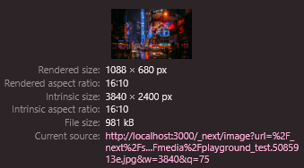

import { FontAwesomeIcon } from '@fortawesome/react-fontawesome'
import { faBug, faComments } from '@fortawesome/free-solid-svg-icons'

%toc%

<article>

# Optimizing images in MDX using next/image

For the third and last part we are going to use [next/image](https://nextjs.org/docs/app/api-reference/components/image) an image component that got created by the [Aurora team at Google](https://developer.chrome.com/docs/aurora/image-component) in cooperation with the Next.js team, by using **next/image** we will make sure that all images we put into our MDX pages get optimized, which means that:

* we will update the configuration to make sure our [PNG](https://web.dev/learn/images/png) or [JPG](https://web.dev/learn/images/jpeg) images get converted automatically into formats like [WEBP](https://web.dev/learn/images/webp) and [AVIF](https://web.dev/learn/images/avif), this will reduce the file sizes of images without them losing in quality, which means our images will consume less bandwidth and load faster
* we will use **next/image** which will make our images [responsive](https://developer.mozilla.org/en-US/docs/Learn/HTML/Multimedia_and_embedding/Responsive_images) by creating an srcset to define multiple versions of an image with different dimensions so that on small screens we don't load images that are bigger and hence heavier than necessary
* we will also use a remark plugin to make sure the path of each image gets turned into an import, which will allow **next/image** to automatically determine the width and height of our images

We will also keep **developer experience (DX)** feature of VSCode intact, by making sure that adding images to a document is easy and quick when using VSCode, meaning it should be possible to simply **drag and drop** images into a document and have VSCode create the markdown element with the path to the image for us

> [!NOTE]  
> Since Next.js 13 there is a new next/image package and the previous package got renamed to [next/legacy/image](https://nextjs.org/docs/pages/api-reference/components/image-legacy), the Next.js documentation has an informative chapter about ["next/image changed in version 13"](https://nextjs.org/docs/messages/next-image-upgrade-to-13), which explains what has changed and also provides links to codemods to automatically update your codebase  

> [!MORE]  
> [Next.js "next/image" api reference](https://nextjs.org/docs/app/api-reference/components/image)  
> [Next.js "Image Optimization" documentation](https://nextjs.org/docs/app/building-your-application/optimizing/images)  
> [MDN "Responsive images" documentation](https://developer.mozilla.org/en-US/docs/Learn/HTML/Multimedia_and_embedding/Responsive_images)  
> [Aurora team "Building an effective Image Component" article](https://developer.chrome.com/docs/aurora/image-component)  

## How to **NOT** add images to an MDX document

> [!WARN]  
> This first example is to demonstrate how you should **NOT** add images to document (I added this example as I thought some people might like to know about this before seeing what the recommended way of adding images is)

To experiment with images we first need an image, I recommend visiting a royalty free images website like [pexels.com](https://www.pexels.com/creative-commons-images/) and download a picture you like, for this tutorial I downloadeded the ["Stranger Things 2 Sign in City at Night"](https://www.pexels.com/photo/green-bushes-on-desert-998653/) photograph by [Yuting Gao](https://www.pexels.com/@leofallflat/)

Now in the `public` folder (which is at the root of your project) create a new `images` folder

Then move the image or photo you just downloaded into `/public/images` folder and rename the image to `playground_test.jpg` (you can rename the file using the files explorer that is in the sidebar, open the `/public/images` folder, then right click on the name and chose **rename**, then type in the new name and then press `ENTER`), I renamed it to `playground_test.jpg` as I kept the original extension but if your photo is a png then you might want to rename it to `playground_test.png`

Then open the `page.mdx` file (that is in the `/app/tutorial_examples/mdx-components_playground` folder) we created earlier and add the following content:

```md title="/app/tutorial_examples/mdx-components_playground/page.mdx" showLineNumbers {1} {16}
import Image from 'next/image'

<article>

* foo
* bar

[internal link that has our production domain](https://example.com)

[internal link starting with a slash](/internal)

[internal link starting with a hash](#internal)

[external link](https://google.com)

<Image src="/images/playground_test.jpg" />

</article>

```

Line 1 we import the **next/image** component

Line 16 we use the **next/image** component, note that although our image is in the `/public/images` folder we have set the `src` to `/images/test.png`, we have omitted the `/public` folder as Next.js will assume that [static assets](https://nextjs.org/docs/app/building-your-application/optimizing/static-assets) like images are in the public folder

If you now look at the code you will notice that the markdown image element is underlined:


This is the eslint **jsx-a11y** plugin telling us that it is recommended to always add an **alt text** to **images**, not only is this a best practice for **accessibility** reasons but it can also improve your **SEO**

So let's first that by adding an alt text, like this:

```mdx title="/app/tutorial_examples/mdx-components_playground/page.tsx" showLineNumbers{16} /alt=/#special
<Image src="/images/playground_test.jpg" alt="Street at night, wet floor has reflections of the bright lights from multiple billboards and neon signs, one prominent billboard features an advertisement for the TV series Stranger Things 2" />
```

Now let's save our `page.mdx` file (using the VSCode keyboard shortcut `Ctrl+S` (macOS: `⌘S`, Linux: `Ctrl+S`)) and then start the development server

Then open the [http://localhost:3000/tutorial_examples/mdx-components_playground](http://localhost:3000/tutorial_examples/mdx-components_playground) playground page URL in your browser to see the result

Bummer we get an error:

> Error: Image with src "/images/playground_test.jpg" is missing required "width" property.

As the documentation for next/image tells us:

> width is required, except for statically imported images or images with the fill property

Actually if we would fix this error we would get another one that tells us that the height is required too, so let's set the width and height values manually like so:

```mdx title="/app/tutorial_examples/mdx-components_playground/page.tsx" showLineNumbers{16} /width="200" height="200"/#special
<Image src="/images/playground_test.jpg" width="5398" height="3374" alt="Street at night, wet floor has reflections of the bright lights from multiple billboards and neon signs, one prominent billboard features an advertisement for the TV series Stranger Things 2" />
```

> [!NOTE]  
> I set the width to 5398 and height to 3374 in this case, but if you are using another image and don't know its exact dimensions then you might want to look at the details of image by hovering over the image in your operating system or by using an image editor like [Gimp](https://www.gimp.org/) and then depending on the ratio you might want to set other values for the width and height

Now let's save our `page.mdx` file again (assuming our development server is still running) and then we have another look at the [http://localhost:3000/tutorial_examples/mdx-components_playground](http://localhost:3000/tutorial_examples/mdx-components_playground) page in our browser

> [!NOTE]  
> On local the first time you visit the page it might take a bit of time before the image appears, this is because under the hood next/image will resize the image, depending on how fast your computer is some time might pass before the image actually finishes loading

This time the page got compiled and we can see the result, the image is huge because it obviously gets displayed full size as we did not add any CSS whatsoever to style it, but this is just a test so this is fine

This solution seems to work well, so why does the title say this is not a good solution?

To what the problem is we need to open the **browser dev tools** (by pressing the `F12` key or right click somewhere in the page and chose **Inspect**), then open the [Network Tab](https://developer.chrome.com/docs/devtools/network) and then click on the row for the image, then click on **Headers** and look at the entries for the **response headers** where you should have an entry for **Cache-Control**, like in this screenshot:


As you can see next/image has set the [Cache-Control](https://developer.mozilla.org/en-US/docs/Web/HTTP/Headers/Cache-Control) header to **public, max-age=0, must-revalidate**, Next.js uses this [caching values](https://nextjs.org/docs/app/building-your-application/optimizing/static-assets#caching) for the **Cache-Control** header because it can NOT guarantee that the image will NOT change after a build, for example if the image is a user avatar then the user could change the image at any time, there are several ways to change the Next.js [caching behavior](https://nextjs.org/docs/app/api-reference/components/image#caching-behavior) for images, we will see one solution in the next chapter using static imports

Finally something else that is not great for our DX is that we had to set the width and height of our image manually

The solution we will see in the next chapter will fix both those problems, it will automatically determine the width and height of images and add a cache control header that tells the browser to actually cache our image(s)

## Automated image sizing and improved cache control

As we saw in the previous chapter one of things next/image helps you get right is [image sizing](https://nextjs.org/docs/app/building-your-application/optimizing/images#image-sizing), if next/image knows the width and height of an image it is able to reserve the space the image will use when it has finished loading

> [!TIP]  
> By correctly sizing the images next/image will help prevent [cumulative layout shifts (CLS)](https://web.dev/articles/cls) which is a **Core Web Vital metric**, without a width and heigt value the image would get displayed as an empty element until it has has finished loading, then when the image appears it would some space in the document, meaning other content would then get pushed around
>  
> layout shifts are bad because if they happen at a moment where the user attempts to for example click on something then there is a chance that the user will misclick, this is why it is important to make sure that all images reserve the space they will need as soon as the HTML document gets rendered in the browser  

But having to set the width and height manually for all our images would NOT be a great developer experience (DX), as our project will grow we will have to manage lots of images and this means we will have to do a lot of manual work if we want to set the width and height manually for each of them, so what we want is to have next/image detect the width and height automatically

next/image offers 3 ways to avoid setting the width and height manually:

* one option is to use the next/image [fill](https://nextjs.org/docs/app/api-reference/components/image#fill) property, in which case the image would fill the parent image container (which needs to a CSS position set to either relative, fixed or absolute), meaning that the space used by the image would actually be the size of the parent container (next/image will set width and height of the image to 100% and set the CSS position to absolute), this is a great solution for a header image and you want it to fit inside of a header container by setting the [CSS object-fit property](https://developer.mozilla.org/en-US/docs/Web/CSS/object-fit) on the image to either cover or contain, but in our case we don't have a container for each image that will get displayed inside of our document
* setting the width and height manually is an another option, but for use case this is also not the one we want to chose, because we want a solution that automate most of the work so that we end up having a great DX and also because setting the width and height of an image when using markdown only works if you install an extra plugin
* finally the third option is to statically import the images so that next/image can automatically determine the width and height at build time

In this tutorial we are going to use the third option, which consists of using **static imports** 

What is great about the **static imports** option is that we will also get rid of the other problem we found in the previous chapter, which was the cache control which had the max-age of the image set to zero, meaning the browser would not cache the image

Lets edit our playground page once more and add the image import like this:

```md title="/app/tutorial_examples/mdx-components_playground/page.mdx" showLineNumbers {2} /{PlaygroundTestImage}/#special
import Image from 'next/image'
import PlaygroundTestImage from '/public/images/playground_test.jpg'

<article>

* foo
* bar

[internal link that has our production domain](https://example.com)

[internal link starting with a slash](/internal)

[internal link starting with a hash](#internal)

[external link](https://google.com)

<Image src={PlaygroundTestImage} alt="Street at night, wet floor has reflections of the bright lights from multiple billboards and neon signs, one prominent billboard features an advertisement for the TV series Stranger Things 2" />

</article>

```

Line 2 we imort the image (using same syntax we use to import code, only that this time we use the path our image to import from)

> [!NOTE]  
> in previous example when we did add the path for image to the src attribute value it was possible to omit the public folder and just write `/images/playground_test.jpg`, however when using imports you need to use the full path including public like so `/public/images/playground_test.jpg`

Line 17 we replace we image path with the variable we used in the import, we remove the width and height we did set manually in the previous example but we keep the alt attribute

Save the changes to the MDX playground, then make sure the dev server is running and finally open the playground page in the browser, then open the **browser dev tools** by right clicking on the image and then chose **Inspect** (or by pressing the `F12` key and then selecting the **Elements** tab) and then have a look at the HTML of our image, it should look like this:


Even though this time we didn't set the width and height manually, but because we used the **static import** for the image, **next/image** was able to automatically set the width and height on the element 

Now to check if our second problem is solved we stay in the developer tools but switch to the [Network Tab](https://developer.chrome.com/docs/devtools/network), then click on the row for the image, then click on **Headers** and if we look at the entries for the **response headers** we can see that the **Cache-Control** value changed:


Previously the **Cache-Control header** had the value **public, max-age=0, must-revalidate** (meaning the browser would NOT cache the image), but this time the value is **public, max-age=315360000, immutable**, the **max-age** now has a very high value and is not zero anymore meaning the browser will cache our image for a long duration and we can also see that the [immutable directive](https://developer.mozilla.org/en-US/docs/Web/HTTP/Headers/Cache-Control) got added, telling the browser that this resource will not change

> [!NOTE]  
> when seeing the high max-age value as well as the immutable directive you might wonder what happens if you change an image, how will the browser know about the change and fetch the new version of the image instead of the one that is now in its cache, well for that problem next/image uses a cache buster technique, if you have a closer look at the image name you will see that next/image added a hash between the original name and the file extension, as long as your image does not change the hash also won't, but if you change the image then next/image will update the hash to a new one and this will make the browser think it is a new file and hence it will fetch it

By solving two major problems in this chapter we are already closer to a great solution, by using static imports we got rid of two problems, however one problem we got rid off was to not have to manually set the width and height just to come up with a solution where we have to manually write static imports, which means we need an even better solution that would allow us to automatise the creation of imports and that is why there is yet another chapter after this one

> [!MORE]  
> [MDN "Cache-Control" documentation](https://developer.mozilla.org/en-US/docs/Web/HTTP/Headers/Cache-Control)  
> [Next.js "static assets" documentation](https://nextjs.org/docs/app/building-your-application/optimizing/static-assets)  
> [Next.js "image caching behavior" documentation](https://nextjs.org/docs/app/api-reference/components/image#caching-behavior)  
> [Next.js "Image Sizing" documentation](https://nextjs.org/docs/app/building-your-application/optimizing/images#image-sizing)  
> [web.dev "cumulative layout shifts (CLS)" article](https://web.dev/articles/cls)  

## Rehype plugin to automate static imports of images

This chapter consists of 4 steps:

* first we will add the rehype plugin package to our project
* then we will update our Next.js configuration file to use the rehype plugin in our MDX setup
* then we will create a simple image component that will use next/image
* finally we will add our image component to the mdx-components file to make sure every markdown element uses our image plugin

First we install the rehype plugin called [rehype-mdx-import-media](https://www.npmjs.com/package/rehype-mdx-import-media) using the following command in your VSCode terminal:

```shell
npm i rehype-mdx-import-media --save-exact
```

> [!WARN]  
> there is another plugin to automatically convert image paths into imports called [remark-mdx-images](https://github.com/remcohaszing/remark-mdx-images), but do NOT use it as it is **deprecated**

Now that the plugin is installed we need to update the Next.js configuration `next.config.mjs` file (which is at the root of the project) file to add it to the MDX plugins list

```js title="next.config.mjs" showLineNumbers {3} /rehypePlugins: [rehypeMDXImportMedia]/
import { PHASE_DEVELOPMENT_SERVER } from 'next/constants.js'
import createMdx from '@next/mdx'
import rehypeMDXImportMedia from 'rehype-mdx-import-media'

const nextConfig = (phase) => {

    const withMDX = createMdx({
        extension: /\.mdx?$/,
        options: {
            // optional remark and rehype plugins
            remarkPlugins: [],
            rehypePlugins: [rehypeMDXImportMedia],
        },
    })

    /** @type {import('next').NextConfig} */
    const nextConfigOptions = {
        reactStrictMode: true,
        poweredByHeader: false,
        experimental: {
            // experimental typescript "statically typed links"
            // https://nextjs.org/docs/app/api-reference/next-config-js/typedRoutes
            // currently false in prod until Issue #62335 is fixed
            // https://github.com/vercel/next.js/issues/62335
            typedRoutes: phase === PHASE_DEVELOPMENT_SERVER ? true : false,
        },
        headers: async () => {
            return [
                {
                    source: '/(.*)',
                    headers: securityHeadersConfig(phase)
                },
            ];
        },
        // configure `pageExtensions` to include MDX files
        pageExtensions: ['js', 'jsx', 'ts', 'tsx', 'mdx', 'md'],
        // disable linting during builds using "next lint"
        // we have manually added our lint script in package.json to the build command
        eslint: {
            ignoreDuringBuilds: true,
        },
    }

    return nextConfigOptions

}
```

Line 3 we import the **rehype-mdx-import-media** plugin

Line 12 we add the **rehypeMDXImportMedia** plugin to the **rehypePlugins** list of our MDX configuration

Next we are going to create a simple **BaseImage** component, similar to what we did earlier for the links

Go into the `/components/base` folder we created earlier, then create a new `Image.tsx` file and add the following code:

```tsx title="/components/base/Image.tsx" showLineNumbers {1} {2} {4} {11} {11-13}
import Image from 'next/image'
import type { ImageProps } from 'next/image'

const BaseImage: React.FC<ImageProps> = (props): JSX.Element => {

    const newImageProps = { ...props }

    return (
        <>
            {/* eslint-disable-next-line jsx-a11y/alt-text */}
            <Image
                {...newImageProps}
            />
        </>
    )
}

export default BaseImage
```

Line 1 we **import** the [next/image](https://nextjs.org/docs/app/api-reference/components/image) component which we then use in the return, where we set a few attribtes

Line 2 we import the **ImageProps** type to be able to strictly type the props of the image

Line 4 we create a functional react component and use the imported **ImageProps** as type for our component props

Line 10 we have an **eslint disable** comment that tells the **jsx-a11y** to ignore that the alt attribute is missing because what the plugin can not know is that we set the alt for images in the markdown element of the image and this means that the alt will be inside of **imageProps**

Line 11 to 13 we use Next.js **Image** component and pass the **imageProps** to it

Finally we open the `mdx-components.tsx` file (which is in the root of your project) again to add a third mdx component that will use our new **BaseImage** component, like so:

```tsx title="mdx-components.tsx" showLineNumbers {4-5} {26}
import type { MDXComponents } from 'mdx/types'
import BaseLink from '@/components/base/Link'
import type { Route } from 'next'
import BaseImage from '@/components/base/Image'
import type { ImageProps } from 'next/image'

// This file allows you to provide custom React components
// to be used in MDX files. You can import and use any
// React component you want, including components from
// other libraries.

// This file is required to use MDX in `app` directory.
export function useMDXComponents(components: MDXComponents): MDXComponents {
    return {
        // Allows customizing built-in components, e.g. to add styling.
        ul: ({ children, ...props }) => (
            <ul className="listContainer" {...props}>
                {children}
            </ul>
        ),
        a: ({ children, href, ...props }) => (
            <BaseLink href={href as Route} {...props}>
                {children}
            </BaseLink>
        ),
        img: (props) => (<BaseImage {...props as ImageProps} />),
        ...components,
    }
}
```

Line 4 to 5 we import our custom **BaseImage** component that we just created and we import the **ImageProps** type from next/image

Line 26 we specify that for each markdown image that got transformed into an HTML `` element we want to use our custom BaseImage component

Phew that was a lot of code but trust me it will be worth it, we just have one more thing to do and that is to update our playground, like so:

```md title="/app/tutorial_examples/mdx-components_playground/page.mdx" showLineNumbers {2} /{PlaygroundTestImage}/#special
<article>

* foo
* bar

[internal link that has our production domain](https://example.com)

[internal link starting with a slash](/internal)

[internal link starting with a hash](#internal)

[external link](https://google.com)


</article>

```

On top we have removed the import of **next/image** from the playground MDX document as it is now gets used inside of our `mdx-components.tsx` file, this is great because it means we will NOT have to import next/image into every MDX document in which we have images

We have also removed the image static import we had created manually earlier as we have now installed and configured the new **rehype-mdx-import-media** plugin, which will parse our MDX documents, find image (media) paths and convert them to static imports for us

Line 14 we don't use the next/image component anymore but instead now use the regular markdown syntax for image elements, there is however one very important change and that is the path to the image, for the rehype plugin to work we need to use the relative path of the image

Now start the dev server (using the `npm run dev` command) and then open the [http://localhost:3000/tutorial_examples/mdx-components_playground](http://localhost:3000/tutorial_examples/mdx-components_playground) playground page URL in your browser

In the first chapter when we launched the dev server we got an error from Next.js telling us to set the image height and width manually, this time we don't have such an error because we now use static imports, the best part is that we don't need to add them manually to every document as the rehype plugin will do it for us, the static imports will also make sure that next/image sets a cache control header telling the browser to cache the image for a long time

Congratulations you just created a complete workflow that allows you to use the regular markdown syntax to add images to your MDX documents but still benefit from all the image optimizations that next/image will perform 🎉

> [!MORE]  
> ["rehype-mdx-import-media" repository](https://github.com/remcohaszing/rehype-mdx-import-media)  

## VSCode image drag & drop

In the previous chapter we written the markdown image element manually and had to set the relative path manually too, if you are using VSCode there is however a much more convienient and faster way of adding images to your MDX documents, you just have to drag and drop an image into an MDX document and then VSCode creates the markdown image element including the correct path for you, a bonus feature is that you get an image preview if you hover over the image path with your mouse, in this chapter we will learn howto use that feature (however if you already know it or if you are not using VSCode then feel free to skip this chapter)

We go back to our `page.mdx` file (that is in the `/app/tutorial_examples/mdx-components_playground` folder) in VSCode and first remove the next/image import (on the first line) as well as the image component itself (that we added line 16), we will not need them anymore

Then to drag & drop our image we do the following steps:

* Keep the `page.mdx` file open and then in the VSCode file explorer (on the right) expand the `public` folder and then the `images` folder, you should now see the file you added to `/public/images` being listed
* Now do a left click on the image name and keep the button pressed
* Then drag the image into the `page.mdx` to the location where you want to insert it (for this example I will drop the image at line 16)
* While dragging the image over the page VSCode will show you a message that says **Hold `shift` to drop into editor", so let's do just that (while still keeping the left mouse key pressed) also press the `shift` key and finally release the left mouse key to drop the image
* You will notice that VSCode will automatically generate the markdown image element for you

After dropping the image into the page your content should be like this:

```md title="/app/tutorial_examples/mdx-components_playground/page.mdx" showLineNumbers {14}#special
<article>

* foo
* bar

[internal link that has our production domain](https://example.com)

[internal link starting with a slash](/internal)

[internal link starting with a hash](#internal)

[external link](https://google.com)


</article>

```

Line 14 is the image markdown element that VSCode created after we drag & dropped the image into the page (in this case you can skip the next chapter)

If however VSCode added onyl the path to the file after you dropped the image, like this:

```md
public/images/playground_test.jpg
```

Or if VSCode inserted the absolute path and not the relative path, like so:

```md

```

Then I recommend you check out the next chapter

### Telling VSCode that our MDX files contain markdown 

If you only see a path to a file then this is because VSCode recognized your page as MDX content instead of markdown, MDX is markdown + JSX but VSCode (as of now, sees things a bit differently, I however hope this will change in the future) and does not enable some of the markdown features when the file content is set to MDX

I recommend you open the `.vscode/settings.json` VSCode workspace settings file (that we already used in one of the first steps of this tutorial to the tell VSCode to use the typescript version that is in our workspace) and add the following entry to it:

```json title=".vscode/settings.json"
    "files.associations": {
        "*.mdx": "markdown"
    },
```

Now save the `.vscode/settings.json` file and then to make sure that VSCode takes the changes into account I recommend closing the `page.mdx` file and reopening it

Then delete the image path and repeat the drag and drop of the image into the `page.mdx` file

This time you should see the markdown image element instead of just a path

If it however the absolute path (and not the relative path), then notice the **drop options** icon at the end, that looks like this:


(the icon tends to disappear after a while, if you don't see the icon, delete the image element and do a new drag & drop)

Now click on that icon or as VSCode suggests you can use the keyboard shortcut by pressing `Ctrl+.` (macOS: `⌘.`, Linux: `Ctrl+.`), it should open a modal with 3 options where the first option should be **Insert Markdown Image**:


Click on the first option to select **Insert Markdown Image**

You should now have a markdown image element that looks like this:

```md

```

### Markdown image preview in VSCode

VSCode recently added a new feature that let's you preview your images, to see the preview hover over the image path with your mouse and a modal box should open with a preview of the image


## Markdown image alt and title

We then replace the **alt text** placeholder with the alt text we already used in the previous chapter but this time for the markdown element, when using markdown the alt text goes into the brequets after the excalamation mark, like so:

```md

```

> [!NOTE]  
> It is recommended to always add an alt **attribute** to images, however the alt **text** itself is optional, meaning that for most images it is considered a best practice for **accessibility** reasons as well as for **SEO** optimization to add a descriptive alt text, however if the image is purely decorative then you should still add an alt **attribute** but the alt **text** should be an empty string, also if the image is purely decorative you can also add the **aria-hidden** attribute and set it to true to tell the assertive technology (screen reader) to ignore it, MDN has a very in-depth article about [aria-hidden](https://developer.mozilla.org/en-US/docs/Web/Accessibility/ARIA/Attributes/aria-hidden) you may want to check out
> 
> If you are unsure about how to write good alt texts I recommend having a look at this [blog post about how to write good alt texts](https://design102.blog.gov.uk/2022/01/14/whats-the-alternative-how-to-write-good-alt-text/), a quick read is the HTML specification chapter about [alt text for images](https://html.spec.whatwg.org/multipage/images.html#alt), the w3c also has an interesting document helping you to decide [when and what kind of alt text to use](https://www.w3.org/WAI/tutorials/images/decision-tree/), finally the w3c has a page that list useful [resources about alt texts](https://www.w3.org/WAI/alt/)

And if you want to have a title you can add it like so:

```md

```

> [!MORE]  
> [VSCode "Markdown editing" documentation](https://code.visualstudio.com/docs/languages/markdown#_inserting-images-and-links-to-files)  
> [w3c "Resources on Alternative Text for Images"](https://www.w3.org/WAI/alt/)  
> [HTML specification "Requirements for providing text to act as an alternative for images"](https://html.spec.whatwg.org/multipage/images.html#alt)  
> [MDN "aria-hidden" documentation](https://developer.mozilla.org/en-US/docs/Web/Accessibility/ARIA/Attributes/aria-hidden)  

## Image formats to optimize LCP

In this chapter we will do two things that will improve the [Largest Contentful Paint (LCP)](https://web.dev/articles/lcp) which is a **Core Web Vital metric**

If the dev server is not already running first start the dev server (using the `npm run dev` command) and then open the [http://localhost:3000/tutorial_examples/mdx-components_playground](http://localhost:3000/tutorial_examples/mdx-components_playground) playground page URL in your browser

We see that the image gets displayed which is good (it is just too big but we will handle the size with CSS later), now open **browser dev tools** (by pressing the `F12` key or right click somewhere in the page and chose **Inspect**) and then open the [Network Tab](https://developer.chrome.com/docs/devtools/network) and look at the row of the image, if you look at the [Content-Disposition](https://developer.mozilla.org/en-US/docs/Web/HTTP/Headers/Content-Disposition) and [Content-Type](https://developer.mozilla.org/en-US/docs/Web/HTTP/Headers/Content-Type) response headers you will notice that the extension of the image is **.webp** and the type is **image/webp**:


If you do NOT define any formats for images in your Next.js configuration file then Next.js will use [default image config](https://github.com/vercel/next.js/blob/292fd4eb3f7a774c17990e3349b91ae5630db821/packages/next/src/shared/lib/image-config.ts) value which (as of now 01.05.2024) is `['image/webp']`

This means that even though our source file is a [PNG](https://web.dev/learn/images/png) image **next/image** has automatically converted it to a [WEBP](https://web.dev/learn/images/webp) image, this is already great as webp images are smaller than png files but we want to use another **format** that creates even smaller files and that format is [AVIF](https://web.dev/learn/images/avif), as we can see on the [avif caniuse page](https://caniuse.com/avif) **avif** is a format that is supported by most modern browsers but some older browsers don't, which is why we will also keep **webp** as a fallback

To tell next/image to also convert images to **avif** we need to edit our **nextConfigOptions** in the `next.config.mjs` like this:

```js title="next.config.mjs" showLineNumbers {42-45}
import { PHASE_DEVELOPMENT_SERVER } from 'next/constants.js'
import createMdx from '@next/mdx'
import rehypeMDXImportMedia from 'rehype-mdx-import-media'

const nextConfig = (phase) => {

    const withMDX = createMdx({
        extension: /\.mdx?$/,
        options: {
            // optional remark and rehype plugins
            remarkPlugins: [],
            rehypePlugins: [rehypeMDXImportMedia],
        },
    })

    /** @type {import('next').NextConfig} */
    const nextConfigOptions = {
        reactStrictMode: true,
        poweredByHeader: false,
        experimental: {
            // experimental typescript "statically typed links"
            // https://nextjs.org/docs/app/api-reference/next-config-js/typedRoutes
            // currently false in prod until Issue #62335 is fixed
            // https://github.com/vercel/next.js/issues/62335
            typedRoutes: phase === PHASE_DEVELOPMENT_SERVER ? true : false,
        },
        headers: async () => {
            return [
                {
                    source: '/(.*)',
                    headers: securityHeadersConfig(phase)
                },
            ];
        },
        // configure `pageExtensions` to include MDX files
        pageExtensions: ['js', 'jsx', 'ts', 'tsx', 'mdx', 'md'],
        // disable linting during builds using "next lint"
        // we have manually added our lint script in package.json to the build command
        eslint: {
            ignoreDuringBuilds: true,
        },
        images: {
            // file formats for next/image
            formats: ['image/avif', 'image/webp'],
        },
    }

    return nextConfigOptions

}
```

Line 42 to 45 we add a new entry for images to our configuration and set the `format` option value to `['image/avif', 'image/webp']`

If you now open the playground page in your a browser (that has support for avif files) and look at the response headers of the image you will notice that the **Content-Disposition** has a filename with the .avif extension and the **Content-Type** is now **image/avif**:


This is the first optimisation that will reduce the size our images, making them load faster, which will improve the Largest Contentful Paint (LCP) score

> [!MORE]  
> [Next.js "image component" reference](https://nextjs.org/docs/app/api-reference/components/image)  
> [web.dev "Largest Contentful Paint (LCP)" article](https://web.dev/articles/lcp)  
> [caniuse "avif" page](https://caniuse.com/avif)  
> [MDN "Image file type and format guide" documentation](https://developer.mozilla.org/en-US/docs/Web/Media/Formats/Image_types#png_portable_network_graphics)

## Image priority and lazy loading

For the second LCP optimisation go back to the **browser dev tools** and then switch to the [Console Tab](https://developer.chrome.com/docs/devtools/console), as you can see there is a warning about our image:

> Image with src "/_next/static/media/playground_test.50052472.png" was detected as the Largest Contentful Paint (LCP). Please add the "priority" property if this image is above the fold.

This is a warning from **next/image** telling us that it has detected that our image is above the fold, meaning the image is inside the first part of our HTML document that is visible when the page loads and because of that it is recommended to use the [priority](https://nextjs.org/docs/app/api-reference/components/image#priority) property

> [!NOTE]  
> By default next/image will add the [loading](https://developer.mozilla.org/en-US/docs/Web/HTML/Element/img#loading) attribute to every image and set the value to **lazy**, this is great for images that are down the page because they will only get [lazy loaded](https://developer.mozilla.org/en-US/docs/Web/Performance/Lazy_loading) when the user scrolls down, however for images that are above the fold it is better to add the **priority** property, which tells next/image that this image should not get loaded but instead should have the attribute [fetchpriority](https://developer.mozilla.org/en-US/docs/Web/API/HTMLImageElement/fetchPriority) set to **high**

So by default next/image will add loading ut if we now add the **priority** property to next/image then our **BaseImage** component will set the property to all images no matter if they are on top of the page or further down, 

which is why we need a way to distinguish between images that should be high priority and images that should be low priority

What we will do first, is add a function to our **BaseImage** component that will read a special information that we add at the end of our title and based on the information we will modify the image properties, like this:

```tsx title="/components/base/Image.tsx" showLineNumbers {4-31} {37} {41-49}
import Image from 'next/image'
import type { ImageProps } from 'next/image'

function extractImageType(imageProps: ImageProps) {

    let imageType = ''

    if (imageProps !== null) {

        const imageTypeMatch = imageProps.title?.match(/\{(.*?)\}/)

        if (imageTypeMatch) {
            // the full match, for example "{ banner }"
            const imageTypeFull = imageTypeMatch[0]
            // the type only, for example "banner"
            imageType = imageTypeMatch[1].trim()
            // remove the image type info from the title
            const newTitle = imageProps.title?.replace(imageTypeFull, '').trim()

            if (newTitle !== '') {
                imageProps.title = newTitle
            } else {
                delete imageProps.title
            }
        }

    }

    return imageType

}

const BaseImage: React.FC<ImageProps> = (props): JSX.Element => {

    const newImageProps = { ...props }

    const imageType = extractImageType(newImageProps)

    return (
        <>
            {imageType === 'banner' ? (
                <>
                    {/* eslint-disable-next-line jsx-a11y/alt-text */}
                    <Image
                        priority
                        {...newImageProps}
                    />
                </>
            ) : (
                <>
                    {/* eslint-disable-next-line jsx-a11y/alt-text */}
                    <Image
                        {...newImageProps}
                    />
                </>
            )}
        </>
    )
}

export default BaseImage
```

Line 4 to 31 we add a **extractImageType** function that will extract the image "type" information that we put in our image titles, a type information is a keyword inside of curly brackets that lets us apply different options to groups of images, after extracting the type the function will remove the brackets and their content from the title and put what is left back into the type attribute

Line 37 we call our new **extractImageType** function to get the image type

Line 41 to 49 we check if the type equals **banner** and if it does we set the **priority** property on the image

> [!NOTE]  
> We can later extend this feature to check for other types as well, like for example if an image is of type **header** we could decide to set the **fill** property as well as some CSS [object-fit](https://developer.mozilla.org/en-US/docs/Web/CSS/object-fit) property to **cover**, what keywords you chose for the types and what you do based on a type is up to you

Now all we need to do is update the title of our markdown image element and use our new feature, like so:

```md title="/app/tutorial_examples/mdx-components_playground/page.mdx" showLineNumbers /{ banner }/#special
<article>

* foo
* bar

[internal link that has our production domain](https://example.com)

[internal link starting with a slash](/internal)

[internal link starting with a hash](#internal)

[external link](https://google.com)


</article>

```

Line 14 we added the `{ banner }`#special keyword (inside curly brackets) to our image, so that our **BaseImage** component knows that it should add the **priority** property

If you now go back into the browser and hover over the image you should see the title appears but without the `{ banner }`#special information, if you open the developer tools you should see in the console tab that the warning is gone and if you open the elements tab (or right click on the image and then select inspect) you should see that image now has an the attribute **fetchpriority** set to **high** and the **loading** attribute that was set to **lazy** got removed

This is the second LCP optimisation, it will make sure that images that are above the fold get loaded quickly, which should ensure that the main content of our web page finishes loading as early as possible 

> [!MORE]  
> [MDN "lazy loading" documentation](https://developer.mozilla.org/en-US/docs/Web/Performance/Lazy_loading)  
> [MDN "image loading attribute" documentation](https://developer.mozilla.org/en-US/docs/Web/HTML/Element/img#loading)  
> [MDN "image fetchPriority attribute" documentation](https://developer.mozilla.org/en-US/docs/Web/API/HTMLImageElement/fetchPriority)  

## Image size adjustement using CSS

Make sure the development server is running and then check out the image in our playground page [http://localhost:3000/tutorial_examples/mdx-components_playground](http://localhost:3000/tutorial_examples/mdx-components_playground), as you can see the image is way to big, this is because right now the height and width are set to the original dimensions of the image, however we want to display an image that has the same width as the container it is in

For that reason we add going to use the [style attribute](https://developer.mozilla.org/en-US/docs/Web/HTML/Global_attributes/style) and set the width for our image(s) to 100%, like so:

```tsx title="/components/base/Image.tsx" showLineNumbers{33} {14-17}
const BaseImage: React.FC<ImageProps> = (props): JSX.Element => {

    const newImageProps = { ...props }

    const imageType = extractImageType(newImageProps)

    return (
        <>
            {imageType === 'banner' ? (
                <>
                    {/* eslint-disable-next-line jsx-a11y/alt-text */}
                    <Image
                        priority
                        style={{
                            width: '100%',
                            height: 'auto',
                        }}
                        {...newImageProps}
                    />
                </>
            ) : (
                <>
                    {/* eslint-disable-next-line jsx-a11y/alt-text */}
                    <Image
                        {...newImageProps}
                    />
                </>
            )}
        </>
    )
}

export default BaseImage
```

Line 46 to 49 we set the width to 100% so that the image width matches the width of our container and we set the [height to auto](https://developer.mozilla.org/en-US/docs/Web/CSS/height#auto) to keep the original ratio of the image, hence the browser will decide what the height should be based on the images width

Now go back to the playground in the browser and now the rendered image should be smaller

Next right click on the image and chose **Inspect** to open the developer tools Elements tab and then hover over one of the image URLs in the srcset of the image element, a modal that looks like this will pop up:



There are two important informations in here, the first one is the **Rendered size** which is 1088 pixel (if you have a high density screen this value will be higher), this corresponds to the size the image gets displayed on screen and the second important information is the **Intrinsic size** which is the original size of the image, as you can see in this example the rendered size is NOT the same as the intrinsic size, this difference in sizes shows us that we are fetching an image that is far bigger then what we need it to be, this is obviously going to lead to a bad LCP score because the heaviest item on the page is our image and it is heavier than it should be

In the next chapter will apply a third LCP optimisation to our images to ensure we are NOT loading images that are too big, which would harm the loading speed of our page

## Image sizes and srcset attributes

As we saw in the previous chapter, we told the browser to make the displayed size of our image smaller but we are still loading an image that is way bigger than what we need, so now the goal is to fetch an image that is as big as what we need or a bit bigger,however not every screen has the same size, which means we will have to get different versions of our image depending on how big the users screen is, for example bigger versions that get displayed on desktop computers and smaller versions that get used for mobile devices

But wait there is more, today our users don't just have screens of different sizes but also screens with different pixel densities, for example some high density screens can have a resolution of 2 device pixels per CSS pixel (2x) and some screens even have higher pixel densities, the ratio between the physical screen pixel density and the CSS pixel density is called **device pixel ratio**, screens with a **device pixel ratio** of **2** we will need an image that is twice the size of an image we use for a lower density screen and for **device pixel ratio** of 3 we need an images that is 3 times bigger, this means that if we want an image to be sharp on a screen with **device pixel ratio** of 3 and the image should be 800 CSS pixels wide then we need to actually load an image that has a width of 3 x 800 = 2400 pixels

To ensure we don't use images that are too big (which would waste bandwidth and result in a low LCP score) or images that are too small (which would get scaled up by the browser and end up being blurry) we are going to use the [sizes attribute](https://developer.mozilla.org/en-US/docs/Web/API/HTMLImageElement/sizes) and set some rules to help the browser chose the image with the most appropriate dimensions:

```tsx title="/components/base/Image.tsx" showLineNumbers{33} {18}
const BaseImage: React.FC<ImageProps> = (props): JSX.Element => {

    const newImageProps = { ...props }

    const imageType = extractImageType(newImageProps)

    return (
        <>
            {imageType === 'banner' ? (
                <>
                    {/* eslint-disable-next-line jsx-a11y/alt-text */}
                    <Image
                        priority
                        style={{
                            width: '100%',
                            height: 'auto',
                        }}
                        sizes="(max-width: 1120px) 100vw, 1088px"
                        {...newImageProps}
                    />
                </>
            ) : (
                <>
                    {/* eslint-disable-next-line jsx-a11y/alt-text */}
                    <Image
                        {...newImageProps}
                    />
                </>
            )}
        </>
    )
}

export default BaseImage
```

Line 50 we add the `sizes` attribute and added the `(max-width: 1120px) 100vw, 1088px` media query as value

Our sizes attribute will tell the browser that for a maximum viewport width of 1120px it should chose an image to display that is equal or bigger than 100vw (100vw means 100% of the view width) and for any other viewport size above 1120px the browser should always take an image that is 1088px (CSS pixels) wide

You might wonder why 1088px, well because in our specific use case we have defined in our global.css that the maximum width for the `main` element to 1120px, in that `main` element we have an `article` element which has a padding left and right of 16px (so 2 x 16 = 32 pixels), this means we need to substract that padding from the `main` element width to get the maximum width an image can have, so 1120 - (2 x 16) = 1088 pixel

Make sure the development server is still running and then visit the playground page [http://localhost:3000/tutorial_examples/mdx-components_playground](http://localhost:3000/tutorial_examples/mdx-components_playground)

Now open **browser dev tools** (by pressing the `F12` key or right click somewhere in the page and chose **Inspect**) and then open the [Network Tab](https://developer.chrome.com/docs/devtools/network) and look at the row of the image, if you look at the URL of the image you will see that it contains a **w** parameter followed by a value, for example on a regular density screen the URL will be like this:

`image?url=%2F_next%2Fstatic%2Fmedia%2Fplayground_test.XXXXXXXX.jpg&w=1200&q=75`

and on a screen with a **device pixel ratio** of **2** the URL will instead be this:

`image?url=%2F_next%2Fstatic%2Fmedia%2Fplayground_test.XXXXXXXX.jpg&w=3840&q=75`

As we can see, depending on the **device pixel ratio** the browser will fetch a different source, for a **device pixel ratio** of **1** the URL has a **w** parameter with the value **1200**, but when the **device pixel ratio** is **2** the **w** parameter has a value set to **3840**

> [!NOTE]  
> One of the great things about next/image is that it will handle the resizing / caching of images for us
> 
> On local (in development mode) the images will get automatically resized by Next.js using a Node.js tool called [sharp](https://www.npmjs.com/package/sharp)  
>  
> In this tutorial we deploy to vercel which means we will benefit from the [Vercel Image optimization](https://vercel.com/docs/image-optimization) features, in preview and production the vercel service will do the image resizes (in the cloud) for us, our images will then be cached using the [Vercel Edge Network](https://vercel.com/docs/edge-network/overview) (CDN)     
>  
> If however you use another provider you either need to find one that works like vercel or you can use a third party image optimization service like for example [Cloudinary](https://next.cloudinary.dev/), or if you search for "image hosting saas" I'm sure you will find a lot of alternatives, if you use a third party service also make sure you check out the [next/image configuration options](https://nextjs.org/docs/app/api-reference/components/image#configuration-options) documentation to learn how to integrate that service into your next/image configuration  
> 
> There are also other options, like resizing the images at build time and then upload them to a CDN or a build a custom solution on a dedicated server, what you chose depends on how much time you want to spend working on a solution and what your budget is

As we just saw the browser will use different URLs to load images, but where do these URLs comes from and how does the browser decide what value to use for the **w** parameter that specifies the width of the image, next/image will use that information to resize the image, height does not get specified as next/image will keep the original ratio and hence does only need to know the width

The answer to both questions is because of the [srcset attribute](https://developer.mozilla.org/en-US/docs/Web/API/HTMLImageElement/srcset) attribute of the image, which by the way we did NOT have to add manually ourself, because we did add the sizes attribute next/image has creaed that `srcset` attribute for us, both sizes and srcset work together

To better understand the **srcset** attribute, we now go back into the browser and right click on the image, then select **Inspect** and if we look at the image elment we see something like this (I formatted mine to make it a bit easier to read):

```html

```

We can see the image element has our **style** attribute we added earlier, as well as the **sizes** attribute we added just now, but below there is now also the **srcset** attribute that next/image added automatically

The value of the **srcset** contains a series of image **URLs** followed by a **number** and that number has the letter **w** appended, for example the first entry `/_next/image?url=%2F_next%2Fstatic%2Fmedia%2Fplayground_test.5085913e.jpg&amp;w=640&amp;q=75 640w` in the list, is a string which contains the image source URL, then a space and then something called a **condition descriptor**, in this case the condition descriptor that tells the browser that if it needs an image with a width of 640 pixel (640w) then it should take the image source URL that preceeds it

If we now put everything together here is what the browser does for a screen with a regular density:

* first the browser determines at what CSS **image width** we want to display the image, it knows that the **style** attribute has set the image width to 100% of the container, the container without the padding is 1088 pixels wide, so the first information is that it will need an image that is **1088 pixels wide**
* the browser also knows that our **device pixel ratio** is **1**, which is the second inforation the browser needs to determine which source to chose
* so now the browser does the math, image CSS width x device pixel ratio = image source width, so 1088 x 1 = 1088 pixels, at this point it now knows it will need an image source file that is at least 1088 pixels wide
* next the browser looks at what image souces we offer by looking at the **srcset** sources list, it attempts to find an URL for an image width that is equal or bigger than the 1088 pixels image it needs and finds an entry with a **condition descriptor** that is **1080w**, so it will use the image URL `/_next/image?url=%2F_next%2Fstatic%2Fmedia%2Fplayground_test.50052472.png&amp;w=1080&amp;q=75`

For a screen with a higher density the steps are the same but the result is not, this is because this time the **device pixel ratio** is **2**, so it does the math again and finds out it needs an image source that is 1088 x **2** = 2176 pixels wide, so it looks at the srcset again and the image source URL that is equal or bigger than 2176 pixels is `/_next/image?url=%2F_next%2Fstatic%2Fmedia%2Fplayground_test.50052472.png&amp;w=3840&amp;q=75`, which is the URL for the source with a width of 3840 pixels

> [!NOTE]  
> The browser will always try to find a source that is equal or bigger than what is needed, there is one exception though, if there is no source big enough in the list then it takes the biggest it can find even if it is smaller than what it needs
> 
> If the browser finds an image that is a little bit smaller and also another source that is substantially bigger then it will take the bigger one, this is because if the browser scales the bigger image down then there is no quality loss even though it is quite a waste of bandwidth and results in longer loading times, this is because if it would take the smaller image that is almost the size it needs it would have to scale the image up and this would result in a blurry image

Now that we know how sizes and srcset works, there is one last thing we want to improve, we saw that for screens with a 2x device pixel ratio the browser will chose the source URL that will fetch a 3840 pixels wide image, the problem here is that this 3840 pixels wide image will be almost twice as large as the 2176 pixels wide image that we need, the browser can NOT take a smaller image because the second biggest version we offer is 2048 pixels and that is slightly lower than the 2176 pixels wide image we need

The solution is to tweak the list of source sizes that next/image will use when it creates the srcset and to do that we need to edit the Next.js configuration file of our project

By default Next.js will use the following [deviceSizes](https://nextjs.org/docs/app/api-reference/components/image#devicesizes) values for srcsets: 640, 750, 828, 1080, 1200, 1920, 2048, 3840

There are two values in the list that are very close to each other, 1920 and 2048, that 2048 one is just a bit too small for our need but also very close to 1920, so it seems like a good idea to replace that value with the one we need which is 2176

We open our `next.config.mjs` and change it to this:

```js title="next.config.mjs" showLineNumbers {36}
import { PHASE_DEVELOPMENT_SERVER } from 'next/constants.js'
import createMdx from '@next/mdx'
import rehypeMDXImportMedia from 'rehype-mdx-import-media'

const nextConfig = (phase) => {

    const withMDX = createMdx({
        extension: /\.mdx?$/,
        options: {
            // optional remark and rehype plugins
            remarkPlugins: [],
            rehypePlugins: [rehypeMDXImportMedia],
        },
    })

    /** @type {import('next').NextConfig} */
    const nextConfigOptions = {
        reactStrictMode: true,
        poweredByHeader: false,
        experimental: {
            // experimental typescript "statically typed links"
            // https://nextjs.org/docs/app/api-reference/next-config-js/typedRoutes
            // currently false in prod until Issue #62335 is fixed
            // https://github.com/vercel/next.js/issues/62335
            typedRoutes: phase === PHASE_DEVELOPMENT_SERVER ? true : false,
        },
        headers: async () => {
            return [
                {
                    source: '/(.*)',
                    headers: securityHeadersConfig(phase)
                },
            ];
        },
        // configure `pageExtensions` to include MDX files
        pageExtensions: ['js', 'jsx', 'ts', 'tsx', 'mdx', 'md'],
        // disable linting during builds using "next lint"
        // we have manually added our lint script in package.json to the build command
        eslint: {
            ignoreDuringBuilds: true,
        },
        images: {
            // file formats for next/image
            formats: ['image/avif', 'image/webp'],
            deviceSizes: [384, 640, 750, 828, 1080, 1200, 1920, 2176, 3840],
        },
    }

    return nextConfigOptions

}
```

Line 36 we add the **deviceSizes** option and set the value to `[384, 640, 750, 828, 1080, 1200, 1920, 2176, 3840]`

If we now open the browser (assuming you are on a device with a high density screen) and look at the `img` element we will see that srcset now has an entry for 2176 pixels wide images and if we open the developer tools and look at the image URL in the Network tab we can see that the browser has fetched the image using the source URL for a 2176 pixels wide image

> [!TIP]  
> If you resize your browser the viewport size will change, if you start with a small browser and make it bigger you will see in the Network tab that the browser loads bigger images, however if you make the browser window smaller the browser will keep the current image, this is because the current image is big enough and can be downscaled, so no need to load a new image 

Sizes and srcset is a powerul combination allowing us to have truly responsive images and helps prevent loading images that are excessive too large, however this feature is also not easy understand, it took me quite a while to make sure I understood everything and was able to write this chapter, if you have a question feel free to ask on the <FontAwesomeIcon icon={faComments} size="1x" color='rgb(255, 0, 170)' /> [discussion](https://github.com/chrisweb/chris.lu/discussions) page and if you find a bug or know about an improvement please report it using the <FontAwesomeIcon icon={faBug} size="1x" color='rgb(255, 0, 170)' /> [issues](https://github.com/chrisweb/chris.lu/issues)

> [!MORE]  
> [MDN "sizes attribute" documentation](https://developer.mozilla.org/en-US/docs/Web/API/HTMLImageElement/sizes)  
> [MDN "srcset attribute" documentation](https://developer.mozilla.org/en-US/docs/Web/API/HTMLImageElement/srcset)  
> [Next.js "next/image sizes attribute" documentation](https://nextjs.org/docs/app/api-reference/components/image#sizes)  
> [Next.js "next/image deviceSizes" documentation](https://nextjs.org/docs/app/api-reference/components/image#devicesizes)  

## Image placeholder

Next we are going to set the [placeholder](https://nextjs.org/docs/app/api-reference/components/image#placeholder) property to **blur** which tells Next.js that we want it to create a blurry placeholder for every image and display that placeholder while the image loads, by using a placeholder to fill the space the image will take when it has finished loading we indicate to the user there something will appear soon instead of having the user wonder why there is big empty spot in the page

To set the **placeholder** property we are going to edit our **BaseImage** component and update the code to this:

```tsx title="/components/base/Image.tsx" showLineNumbers{33} {19}
const BaseImage: React.FC<ImageProps> = (props): JSX.Element => {

    const newImageProps = { ...props }

    const imageType = extractImageType(newImageProps)

    return (
        <>
            {imageType === 'banner' ? (
                <>
                    {/* eslint-disable-next-line jsx-a11y/alt-text */}
                    <Image
                        priority
                        style={{
                            width: '100%',
                            height: 'auto',
                        }}
                        sizes="(max-width: 1120px) 100vw, 1088px"
                        placeholder="blur"
                        {...newImageProps}
                    />
                </>
            ) : (
                <>
                    {/* eslint-disable-next-line jsx-a11y/alt-text */}
                    <Image
                        {...newImageProps}
                    />
                </>
            )}
        </>
    )
}

export default BaseImage
```

Line 51 we add the placeholder attribute and set the value to blur

> [!TIP]  
> If you want to check out the placeholder and are on local the images will probably load instantly so you won't see it, but you can emulate a throttled Network speed by opening the chrome developer tools in your browser, then open the Network tab and then click on the down arrow icon where it says "No throttling" and change it to "Slow 3G", Firefox has a similar option and for Safari you need to first go to "Settings" (the ⚙️ gear icon on the right), then open the experimental tab and then click the checkbox for Network: allow throttling, then reload the developer tools and then you can go to the Network tab and set the throttling (on the top right) to "3G"  
>  
>   
>  
> Then reload the page and you see the placeholder being displayed before the image starts loading  

To see the placeholder image that next/image has generated you can also open the **Network Tab** (in your browsers developer tools) and click on the row of the image, then click on on the preview tab, the URL of the placeholder is similar to the URL of the image itself, the only difference is that for the placeholder the size is set to 8px (`&w=8`)

Something worth knowing about the placeholder is that next/image will only create a [blurDataURL](https://nextjs.org/docs/pages/api-reference/components/image#blurdataurl) (blurDataURL is the image attribute next/image uses when placeholder is set to blur) for  images that you import statically but NOT for remote images where your source is a URL, for example the URL of a remote image hosting service or a CDN, next/image does also NOT (as of now) create placeholder images for animated images, like an animated gif, webp or avif won't have a placeholder

In situations next/image does not create the placeholder you have several options to create your own placeholder:

* by adding code to your project that will create placeholder images, Next.js has an example of such a script in the [placeholder color placeholder example on GitHub](https://github.com/vercel/next.js/blob/canary/examples/image-component/app/color/page.tsx)
* the second option is an online tool (that they recommend in the Next.js documentation) from [png-pixel.com](https://png-pixel.com/) that you can use to create your own static placeholder image
* the third option is to use a package like [pla**i**ceholder](https://www.npmjs.com/package/plaiceholder), but be careful when using this one, I see it being mentioned in a lot of tutorials, however if you go to [pla**i**ceholders GitHub repository](https://github.com/joe-bell/plaiceholder) you will notice that the project has been archived so its unlickely it will get updates in the future (also issues are disabled on archived repositories so there is no way to open one if you find a bug)

Congratulations 🎉 you now know almost everything there is to know about next/image and its many features and will now be able to create a project that has optimized images, giving you a good web metrics score and make it will contribute to making your users happy because your pages load super fast

> [!MORE]  
> [Next.js "next/image placeholder" documentation](https://nextjs.org/docs/app/api-reference/components/image#placeholder)  

</article>
