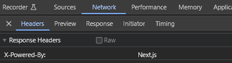

%toc%

<article>

# Tutorial: Next.js static MDX blog


In this tutorial we will:

* create static pages using the Next.js (v13.x/14.x) app directory
* create several components using React (v18.x)
* add support for MDX content formatting via the @next/mdx package
* add a plugin to automatically generate a table of contents for each post
* add another plugin will handle code blocks styling based on your favorite VSCode template
* add yet another plugin will allow us to GitHub like alerts to our content
* add linting tools for both the code of the project and the content of the posts
* add a CI/CD pipeline using vercel.com so that every time we commit code to our GitHub repository it gets automatically deployed

> [!NOTE]  
> I made this tutorial for total beginners in mind, however if you are already an experienced Next.js dev then there are some chapter you may want to skip

## Prerequisites

> [!NOTE]  
> The **Prerequisites** chapter is for beginners, if for example you already have a GitHub account then you can skip that step or if you prefer to install another IDE then the one I suggest then feel free to do so

First we need a **GitHub account** to store our code in a GitHub repository (if you prefer to use another serive like [GitLab](https://about.gitlab.com/) or [Bitbucket](https://bitbucket.org/), feel free to do so), which will make it easy to access your code on multiple devices and will also allow us to share your code with others. Later on we will use the GitHub to sign in to services like Vercel.com to set up an automatic CI/CD pipeline that will automatically deploy our code and sign up for a Sentry.io to add error monitoring, so that when a user encounters a bug it gets listed with a stacktrace in Sentry.io

* [create a GitHub account](/web_development/posts/github)

After creating a GitHub account need to **create a repository** on GitHub for our Code:

* [create a new GitHub repository](/web_development/posts/github#create-a-repository)

Next we need to **install git**, which is a version control tool which will get used by VSCode:

* [install git](/web_development/posts/git)

Next to be able to write code we need an Integrated Development Environment (IDE), my preferred IDE to write Javascript (Typescript) code is VSCode (Visual Studio Code):

* [install VSCode](/web_development/posts/vscode)

Now we need to sign in to our GitHub account in VSCode and use the VSCode source control tool to make a local clone of our GitHub repository:

* [clone GitHub repository in VSCode](/web_development/posts/vscode#cloning-your-github-repository-in-vscode)

To be able to create a Javascript backend and run our Javascript code locally we need to install the Node.js runtime:

* [install Node.js (and npm)](/web_development/posts/node-js)

> [!NOTE]  
> the **next.js 14** "app directory features" require nodejs v18.17 or later, so if you skipped the Node.js installation document because you already have Node.js installed, then just make sure you have a version installed that is high enough, to do that you can for example use the following command: `node -v`

## The road to server components and server actions

React and Next.js have evolved a lot lately, the most notable additions are **server components** and **server actions**, on this page I try to list all the updates that happend during the last +-2 years in the React and Next.js ecosystem, so if you did not build a project with Next.js 13/14 and React 18/19 yet I recommend you check it out, but if you are already an expert feel free to skip this chapter 😉

* [The road to React 19 and Next.js 14](/web_development/posts/road-to-react-19-next-js-14)

## Getting started

If you closed VSCode since last time, launch VSCode and open the folder we created in **Prerequisites** chapter (if you need help to open a folder in VSCode, check out my chapter [open a folder in VSCODE](/web_development/posts/vscode#open-a-folder-in-vscode) from the VSCode post)

### create a new "preview" git branch

There are a lot of different approaches when it comes to managing code using branches, like [Git Flow](https://nvie.com/posts/a-successful-git-branching-model/), [GitHub Flow](https://docs.github.com/en/get-started/using-github/github-flow), [GitLab Flow](https://about.gitlab.com/topics/version-control/what-is-gitlab-flow/), [Trunk-based development](https://www.atlassian.com/continuous-delivery/continuous-integration/trunk-based-development) and many more. There is no right or wrong here, the best workflow is the one that works best for you (or for your team), this is why I recommend checking out the above links and familiarize yourself with the different workflows, then try the one out that you think is best suited and if it does not fit perfectly you can still adjust and make it your git flow 😉

Because this project is about a personal blog, I don't think we need a very complex Git Flow, this is why I will only create a second branch to commit the code updates into and then be able to preview the result (staging or testing environment), then if I'm satisfied with the result I will make a pull request (PR) to merge the code into the main branch, the main branch will then get deployed in production. If you work with others on your blog project, to avoid having to deal with merge conflicts on a regular basis, you might want to create a branch per feature (hence called feature branches) and use that branch for development, but if you are the only dev a **main** branch as well as an extra **preview** branch is probably enough.

Open VSCode and then create a new branch **from the main branch** and call it **preview** (to learn how to create a new branch from another branch (and then publish it), I recommend you check the chapter ["Creating a new branch" from the VSCode post](/web_development/posts/vscode#create-a-new-branch-from-based-on-another-branch) in my VSCode post)

> [!TIP]  
> we call our branch **preview** because later in this tutorial we will add a CI/CD pripeline via vercel.com and will use the **preview** branch to do preview deployments, the main (default) branch will be used to make production deployments

Now that the branch is created, you will see in the bottom of VSCode that our new branch is already the one selected, it is not published yet, so go ahead and publish it (yes you could consider not publishing it until you are sure that you will use the code, but I prefer to always immediatly publish them, so that if something happens to my computer I still have a copy in the cloud, of course once published it is a bit more work if you want to delete it as you need to do so locally as well as remotly but I still prefer that to losing several hours or even days worth of work)

### using Create Next App (CNA)

To create a new Next.js project we are going to use [Create Next App](https://www.npmjs.com/package/create-next-app) (CNA), CNA is a CLI tool created by the Next.js to get started quickly

> [!NOTE]  
> we will create the new project in the root of our directory (not a sub-directory), so make sure there is no README.md file in the directory yet, as the create-next-app tool we will use will create one and if it finds a README.md it will abort, if there is a README.md file, first delete it and then commit the changes (if you need help to commit changes using VSCode, check out my chapter [commit your changes to GitHub using the VSCode version control tool](/web_development/posts/vscode#commit-your-changes-to-github-using-the-vscode-version-control-tool) from the VSCode post)

> [!TIP]  
> I will use the option `--use-npm`, if you prefer using another package manager you can change the option to `--use-pnpm` for [pnpm](https://pnpm.io/), `--use-yarn` for [yarn](https://yarnpkg.com/) or `--use-bun` for [bun](https://bun.sh/package-manager)

Make sure the VSCode terminal is open (if you need help to open the terminal in VSCode, check out my chapter [open a VSCode terminal](/web_development/posts/vscode#open-a-vscode-terminal) from the VSCode post) and then enter the following command and then press `ENTER`:

```shell title="terminal"
npx create-next-app@latest ./ --use-npm
```

**Create Next App** will tell you it needs to be installed first, accept by typing `y` and then press `ENTER`

Next you will get asked some more questions so that Next.js knows what it needs to install and set up for you:

* **Would you like to use TypeScript?**, I recommended leaving it to **Yes** which is what is preselected, if however you prefer to use javascript select **No** using the left / right arrow keys and then just press `ENTER` (I recommend to use Typescript but I will not argue in favor or against it here, this is not the right place, if you never used Typescript before, then maybe just give it a try and see for yourself how different it is from using Javascript and after having built this blog prototype you will be able to judge for yourself which one you like more)
* **Would you like to use ESLint?**, again **Yes** is preselected, so just press `ENTER` ([ESLint](https://eslint.org/) is very useful tool that helps find and correct errors in your code)
* **Would you like to use Tailwind CSS?**, I will set this to **No**,  press `←` (the left arrow key) and then `ENTER`, I will use another styling solution in this project, more on that later) so if you want to explore another solution with me through this project then select "No" too, if you know Tailwind CSS and want to use it instead feel free to keep it on "Yes"
* **Would you like to use `src/` directory?** I will leave this on **No** and then press `ENTER`, if prefer to place all your code in an `src/` directory then press the `→` right arrow key to select "Yes", some people prefer it for example to be able to restrict searches in files to files that are in the `src/` directory and hence avoid getting result from the node_modules folder, my personal preference is to not use it as it is not required, I like to have all my directories in the root and if needed I can exclude the node_modules directory which is the same amount of work as including src instead
* **Would you like to use App Router?** definatly keep this on **Yes** and then press `ENTER`, since Next.js 13 you have two directories to chose from, you can add your pages into the **pages** directory which is the older version or you use the more modern version, which is the **app** directory, I recommend enabling the app directory (you can still later create the pages directory manually if you want to use it, both can be used alongside each other
* **Would you like to customize the default import alias (@/*)?** press `→` (the right arrow key) to select **Yes** and then press `ENTER`, this will tell CNA to add an alias for a given path in the `tsconfig.json` (the Typescript configuration file) if you selected **TypeScript** in the first question and if you chose **Javascript** it will create the alias in the `jsconfig.json` file (This alias can be used for imports as a replacement for a path to a dependency, to learn more about this feature I recommend you have a quick look at the [Next.js "Absolute Imports and Module Path Aliases" documentation](https://nextjs.org/docs/app/building-your-application/configuring/absolute-imports-and-module-aliases)), if however you don't want it feel free to leave it on "No"
* **What import alias would you like configured?** I personally keep the default `@/*`, but feel free to chose another one if you prefer, then press `ENTER`

That's it the **Create Next App** will now install Next.js and React (and React DOM) for us, it will then add some development dependencies based on what we chose, like Typescript and ESLint and then it will add some default configuration files for each of these tools

> [!TIP]  
> when you use CNA, some of the options you chose will get stored, so that next time you use it again it will take your stored preferences instead of default values, if you want to reset those stored preferences you can use the `--reset-preferences` option like so `npx create-next-app --reset-preferences`, if successful CNA will print the following message "**Preferences reset successfully**"  

> [!MORE]  
> [Next.js "create-next-app" documentation](https://nextjs.org/docs/app/api-reference/create-next-app)  
> [VSCode "jsconfig.json" documentation](https://code.visualstudio.com/docs/languages/jsconfig)  
> [Next.js "Absolute Imports and Module Path Aliases" documentation](https://nextjs.org/docs/app/building-your-application/configuring/absolute-imports-and-module-aliases)  

### first commit

Now that create next app is done, it is a good time to do your first commit

If you need help to commit changes (and then synchronize them) using VSCode, check out my chapter [commit your changes to GitHub using the VSCode version control tool](/web_development/posts/vscode#commit-your-changes-to-github-using-the-vscode-version-control-tool) from the VSCode post

After you have commited the files and synchronised the changes with remote repository, you can go to [github.com](https://github.com/) and check out your repository or go directly to your repository if you remember the name, the URL should be in the format `https://github.com/MY_GITHUB_USER_NAME/MY_REPOSITORY_NAME`, by default the content of the **main** branch gets displayed and because we commited our changes into the **preview** branch you need switch to the **preview** branch on GitHub to see your files (if you don't know how to switch branches on GitHub check out the [switch branches](/web_development/posts/github#switch-branches) chapter in my GitHub post)

If the commit and syncing was successful you will see that all the new files and directories are now listed in your GitHub repository

> [!TIP]  
> I recommend you commit often as it will make it a lot easier if you decide to revert your last commit, because it will only include the code from one step you want to undo and NOT also the code of several other steps that you actually want to keep, it will also create a nicer commit history where the commit messages are short and related to a few files instead if having a huge commit messages attached to dozens of files, also commiting and synchronising often reduces the risk that you lose code and hence hours or days of work if something happens to your local machine and finally it reduces the risk that you end of having conflits if you are not the only one working on the repository

### update the README.md file

> [!NOTE]  
> for your future self and for others that might contribute on your project it is always helpful to have well documented project. This is why we will update the readme and place some documentation in it, if however you prefer to store such information somewhere else this is fine too, what really matters is to do update the documentation regulary so that it will not become a tedious task at some point and also is a helpful resource right from the start of your project

The first file we will edit is the `README.md`, I recommend you remove everything that is currently in the REAME.md (not that it is bad advice but we will just structure it differently and add some more information to it)

Then copy / paste the following content into your README:

```md
# MY_PROJECT

## npm commands (package.json scripts)

`npm run dev`: to start the development server  
`npm run build`: to make a production build  
`npm run start`: to start the server on a production server using the build we made with the previous command  
`npm run lint`: to run a linting script that will scan our code and help us find problems in our code  

```

> [!TIP]  
> I added 2 spaces after each line, for the 4 commands, this ensures that there is a line break after each of them  

This adds documentation to the README for 4 commands that are available after setting up a project with CNA

Then change **MY_PROJECT** to whatever you want to name your project

> [!TIP]  
> Did you know you can preview markdown files in VSCode? If not check out my short ["VSCode markdown preview" chapter](/web_development/posts/vscode#vscode-markdown-and-mdx-preview) in the VSCode post  

Now save the file (to save the file you can use the VSCode shortcut `Ctrl+S` (macOS: `⌘S`, Linux: `Ctrl+S`))

Finally commit the changes and then synchronize them

> [!MORE]  
> [markdown "paragraphs and line breaks" documentation](https://daringfireball.net/projects/markdown/syntax#p)  

### Next.js typescript plugin

Since [Next.js 13.1](https://nextjs.org/blog/next-13-1) the Next.js team added a new Typescript plugin:

> We've built a new TypeScript plugin that provides suggestions for page and layout configuration options and provides helpful usage hints around Server and Client Components

[Delba de Oliveira](https://github.com/delbaoliveira) which is part of the next.js developer experience team posted a [a short "Next.js Typescript plugin" introduction video](https://www.youtube.com/watch?v=pqMqn9fKEf8) on Youtube that you may want to watch

#### enabling the Next.js Typescript plugin

To make the Next.js typescript plugin work you need to change the Typescript version that VSCode is using to the **workspace version** (the version that Next.js create app just installed), because by default VSCode will use a built in Typescript version

If you don't know how yet how to change the typescript version to **workspace version** (in VSCode), check out the [VSCode typescript version](/web_development/posts/vscode#vscode-command-palette) chapter in the VSCode post

As soon as you switch to the **workspace version**, VSCode will create new `.vscode/settings.json` file (or if you already have a VSCode settings.json it will extend it), there is nothing wrong in sharing that file as it will ensure that everyone that works on your project (or if you use multiple devices yourself) that they use the same workspace settings, like the typescript workspace version but also in one of the next chapters we will add useful VSCode extension and they will be listed in settings file too, so if someone does not have the extension installed VSCode will show a modal that suggests installing it

> [!TIP]  
> Next.js typescript plugin comes with some useful features, for example you will have typed routes, meaning that if you use next/link and set a href to a page that doesn't exist you will get a warning, it will also warn you if something is wrong in how you use the **use client** directive in your components and some more, I recommend to keep an eye on the [Next.js "typescript" documentation](https://nextjs.org/docs/app/building-your-application/configuring/typescript) as the Next.js team adds more features over time

finally I recommend you commit / sync the new `.vscode/settings.json`

> [!MORE]  
> [Next.js "TypeScript" documentation](https://nextjs.org/docs/app/building-your-application/configuring/typescript)  

##### Statically Typed Links (Routes)

> [!WARN]  
> There seems to be a bug in the route types for `*.mdx` pages, when doing a prod build, when doing a dev build all routes are typed and listed in the `.next/types/link.d.ts` but they are missing in prod resulting in a **Type error** "XY is not an existing route.", so even though this feature seems very promissing, as of now I recommend to keep it turned off (set to false) if you have are using `*.mdx` pages (which is what we will do in this tutorial)

To ensure we benefit from **statically typed links** there is one more step needed, open the `next.config.mjs` and then add the **experimental** typedRoutes to your Next.js configuration file like so:

```js title="next.config.mjs" showLineNumbers {3-5}
/** @type {import('next').NextConfig} */
const nextConfig = {
    experimental: {
        typedRoutes: true,
    },
};

export default nextConfig;
```

Line 1 you can see that the Next.js configuration file uses [jsdoc](https://www.typescriptlang.org/docs/handbook/jsdoc-supported-types.html) with the `@type` Typescript script, which allows us to have types even though the configuration file is not Typescript (but Javascript), which means if you start typing inside of the nextConfig object you will benefit from autocompletation for the Next.js configuration options

Line 3-5 we use the typedRoutes (experimental) option and enabled it, which means that when using `npm run dev` or when building for production, Next.js will generate a `.next/types/link.d.ts` file that contains information about all existing routes in our application, the advantage of this is that if we now use [next/link](https://nextjs.org/docs/app/building-your-application/routing/linking-and-navigating#link-component) but set the href to a route that doesn't exist we will see an error in VSCode getting displayed and builds will fail until we fix the typo in our URL

> [!NOTE]  
> You might have noticed that in the latest Next.js the configuration file is now an [ECMAScript module](https://nodejs.org/api/esm.html) (ES modules / ESM) and not a [CommonJS module](https://nodejs.org/api/modules.html#modules-commonjs-modules) like in previous versions, which is why the extension is now `.mjs` and not `.js` anymore, this means that instead of using a require function to import other modules we now use the same import statement we use in client code, this change also matters because more and packages on npm are migrating to an ESM only format, which reduces the amount of code needed as they can drop CommonJS backward compatibility, but for us it means we must use import statements and can't NOT use the require function anymore  

then save your `next.config.mjs` and commit / sync your latest changes

> [!MORE]  
> [Next.js "configuration options" reference](https://nextjs.org/docs/app/api-reference/next-config-js)  
> [Typescript "JSDoc" reference](https://www.typescriptlang.org/docs/handbook/jsdoc-supported-types.html)  
> [Next.js "typedRoutes (experimental)" reference](https://nextjs.org/docs/app/api-reference/next-config-js/typedRoutes)  

###### typedRoutes bug and Next.js phases parameter

> [!WARN]  
> right now there is a bug in Next.js that prevents MDX pages (page.mdx) to be recognized as routes when doing a production build (in development the typed routes work well), I opened a [ticket #62335 on GitHub](https://github.com/vercel/next.js/issues/62335), until the bug is fixed I suggested only enabling the **typedRoutes in development**, you can do so by using the next config **phase** parameter, to check if current phase is **PHASE_DEVELOPMENT_SERVER**

```js title="next.config.mjs" showLineNumbers {1} {3} {10}#special
import { PHASE_DEVELOPMENT_SERVER } from 'next/constants.js'

const nextConfig = (phase) => {

    /** @type {import('next').NextConfig} */
    const nextConfigOptions = {
        experimental: {
            // experimental typescript "statically typed links (routes)"
            // https://nextjs.org/docs/app/api-reference/next-config-js/typedRoutes
            typedRoutes: phase === PHASE_DEVELOPMENT_SERVER ? true : false,
        },
    }

    return nextConfigOptions

}

export default nextConfig;
```

Line 3 we have converted our next config object into a function, this allows us to use the Next.js configuration **phase** parameter, phase allows us to check what the current context of our Next.js app is, in our configuration we import the `PHASE_DEVELOPMENT_SERVER` constant and then line 10 we check if the phase is **development server**, if it is we enable typedRoutes and if it is NOT we disable the typedRoutes option

Next.js has some constants to make it easier to check what phase the app is in, those constants can be found in [src/shared/lib/constants](https://github.com/vercel/next.js/blob/canary/packages/next/src/shared/lib/constants.ts#L38-L43)

> [!MORE]  
> [Next.js "Statically Typed Links" documentation](https://nextjs.org/docs/app/building-your-application/configuring/typescript)  
> [Next.js "next.config.js phase" documentation](https://nextjs.org/docs/pages/api-reference/next-config-js)  

### React (Next.js) strict mode configuration

[React strict mode](https://react.dev/reference/react/StrictMode) and [powered by header(s)](https://nextjs.org/docs/app/api-reference/next-config-js/poweredByHeader) are two configuration options that often lead to controversial discussions among developers

**React strict mode** is **enabled by default** since **Next.js v13.4** for the **app router** (not the pages router), you can disable the React strict mode in the `next.config.mjs` by setting option to **false**

> [!NOTE]  
> for example if you don't want the **Strict Mode** to be enabled in your entire project, then disable it via the Next.js configuration file and then use the `<StrictMode>` only in the pages / layouts ... in which you want to enable it

I recommend not disabling the React Strict Mode, I see posts on [Stack Overflow](https://stackoverflow.com/) where people argue to turn it off as it causes problems in their app, however in my opinion this is masking problems instead of fixing the root cause, as mentioned on react.dev the Strict Mode does several important things, one of them is **checking if your components use deprecated APIs**

> [!TIP]  
> will only run in **development** and NOT in production, this is another reason to keep it turned on, even if it would lead to a problem in development it will NOT have any impact on your production build and hence have no impact on what your users experience

What surprises developers the most when they use React Strict Mode for the first time, is that re-renders components an extra time (in development), hence every component gets rendered (and effects triggered) then the components get unmounted and then get mounted a second time, this is done to detect problems, here is the explanation from the React.dev documentation as to why this is done:

> React components you write must always return the same JSX given the same inputs (props, state, and context). Components breaking this rule behave unpredictably and cause bugs.

So if for some reason you don't want it to be enabled in your entire app or if you need to disable it temporarely, then you can do it in the Next.js configuration file:

```js title="next.config.mjs" showLineNumbers {3}
/** @type {import('next').NextConfig} */
const nextConfig = {
    reactStrictMode: false,
};

export default nextConfig;
```

### Next.js powered by header configuration

**Next.js powered by header** is another Next.js configuration option, that if enabled will add an **x-powered-by** header to all of your pages

Here is an example of the headers showing the **x-powered-by** header Next.js adds to pages, I used the **chrome dev tools**, opened the **Network tab** and then clicked on the row of the page to inspect the **response headers**:



Why would you want to turn this configuration option off?

When I get asked this, my first thought is to ask myself the opposite "why would I want to turn it on?" and honestly I have not yet found a reason as to why I would want to have it turned on. Another reason why I personally prefer to turn it off is because unfortunatly some people on the web have malicious intentions and the less they know about your apps technology stack the more difficult it will be for them to find vulnerabilities that have been disclosed but are not yet patched in the version you are using. Yes it does not make a huge difference, because hackers usually just launch batteries of tests that will check for a wide range of known vulnerabilities, few will use a bot that checks for **x-powered-by** headers to specifically target the exact version you are using. Also true, hackers can use profilling tools to get approximative information about what tech stack you are using. So yes, disabling the poweredByHeader option is not a miracle solution, that will prevent all potential attacks, but if there is a chance (no matter how small) that turning it off will make my app just a little bit safer then that's good enough for me and as I said earlier the second reason is that I see no reason why I would want to turn it on.

```js title="next.config.mjs" showLineNumbers {3}
/** @type {import('next').NextConfig} */
const nextConfig = {
    reactStrictMode: true,
    poweredByHeader: false,
};

export default nextConfig;
```

If you did any of the two changes I mentioned above , then save your `next.config.mjs` and commit / sync your latest changes

> [!MORE]  
> [React "Strict Mode" documentation](https://react.dev/reference/react/StrictMode)  
> [Next.js "Strict Mode" API reference](https://nextjs.org/docs/app/api-reference/next-config-js/reactStrictMode)  
> [Next.js "Powered By Header" API reference](https://nextjs.org/docs/app/api-reference/next-config-js/poweredByHeader)  

## first page

### Our first typescript (javascript) page

Hope you are still there, because it is finally time to start coding (a bit) 🙂

But first lets open the app directory create next app has created for us, if you have a bit of time have a look at what they put in there (it's always good to have a look at what the Next.js team recommends) but after that delete all the files in the `/app` directory as I want to go step by step through the process of creating a Next.js blog, you can also delete the content in the `/public` directory as we won't need the assets of the demo project anymore

Next create a new file in the app directory and name it `page.tsx` (or `page.jsx` if you chose to use javascript)

Then add the following content into the `page.tsx` file and finally save it

```tsx title="/app/page.tsx" showLineNumbers
export default function Home() {

    return (
        <>
            <h1>Hello World?</h1>
        </>
    )

}

```

Congratulations you just coded your first Next.js page

### Start the dev(elopment) server

Now open the VSCode terminal if it isn't open yet (or use your favorite command line tool) and let's use one of the 4 commands we added to our README.md earlier to start the development server:

```shell
npm run dev
```

Now in the terminal, press `Ctrl` and then click on the Next.js local server URL or open your browser and put the following URL into the address bar: [http://localhost:3000/](http://localhost:3000/)

### Stop the dev(elopment) server

To stop the development press `Ctrl+S`

Then you will get asked of you really want to quit:

> Terminate batch job (Y/N)?

To confirm press enter either `Y` and press `ENTER` or just press `Ctrl+S` again

#### What are npm run scripts

All `npm run SCRIPT` commands work because they have been added to the package.json scripts block, in our case the `npm run dev` works because **create next app** has added it to the package.json for us

To get a list of all scripts that are available as commands, use the following command:

```shell
npm run
```

This will show you the 4 run-scripts commands that got added by create next app

> [!MORE]  
> [NPM "run scripts" documentation](https://docs.npmjs.com/cli/v10/commands/npm-run-script)  

#### Edit run scripts

To edit run scripts open your `package.json` in the root of the project

There you will find the existing commands:

```json title="package.json"
  "scripts": {
    "dev": "next dev",
    "build": "next build",
    "start": "next start",
    "lint": "next lint"
  },
```

> [!MORE]  
> [NPM "package.json run scripts" documentation](https://docs.npmjs.com/cli/v10/commands/npm-run-script)  

#### Changing the Next.js dev server port

As you may have noticed when we used `npm run dev` it started the dev server using the port 3000, this is because port 3000 is the default, the port will NOT be 3000 it was already in use, then Next.js will use the next best free port, for example 3001, 3002, ...

You can however also change the port manually if needed, to do so you need to use **-p** option for next.js **dev** (also works for the **start** cli commands used to start the production server)

For example to use the port 4000 edit your `package.json` change `next dev` to this:

```json title="package.json"
  "scripts": {
    "dev": "next dev -p 4000",
  },
```

Then run the npm command to execute that script like so:

```shell
npm run dev
```

You will see that now Next.js uses the port you have told it to use, because the address it prints in the terminal is now using the port 4000:

```shell
  - Local: http://localhost:4000
```

> [!NOTE]  
> Now I recommend you discard the changes we just did, it is preferred to let Next.js chose the port for you and use 3000 by default, only set the port to a specific value if you have a use case for it

#### Using the Next.js CLI commands in the terminal

When using a command like `npm run dev` npm will check for a script and then execute the command of that script, in the case of `npm run dev` it will execute `next dev`

`next dev` is a Next.js CLI command, as we already saw in the package.json scripts there other Next.js CLI commands you can use, like `next build`, `next start`, `next lint` and a bunch more

If you try to run one of those commands in the terminal (or your favorite command line tool), for example:

```shell
next dev
```

On linux you will get an error like:

```shell
bash: next: command not found
```

On windows in powershell you will get an error like:

```shell
The term 'next' is not recognized as the name of a cmdlet, function, script file, or operable program. (...)
```

To fix this, we can use NPMs npx, like so:

```shell
npx next dev
```

> [!TIP]  
> If you want to see what options a given Next.js CLI command has, add the -h flag to the command, for example `next dev -h` will show you a list of options for the dev command, for a list of all commands use `next -h`

For example this command will show the options for the Next.js dev CLI:

```shell
npx next dev -h
```

Or to see the options of the linting command, use:

```shell
npx next lint -h
```

Besides starting the dev server, there are other interesting CLI commands you may want to try out at some point, for example if you have a build that fails during deployment and you want to debug that build of your project locally, then you can use this command:

```shell
npx next build --debug
```

After the build is done, Next.js will print a lot of interesting information in your terminal, like what headers, rewrites, redirects, routes, ... your app uses and information like, did this page get prerendered as static content or is it dynamic and get rendered at runtime

Or to get some information about the your system you can use:

```shell
npx next info
```

After experimenting with Next.js CLI in your terminal, you can of course add those to your package.json too, this has the advantage that other devs on your project can use them too and for you it has the advantage that you don't need to remember them

To add the info CLI command to your `package.json`, open the `package.json` and edit it like this:

```json title="package.json" {3}#special
  "scripts": {
    "dev": "next dev -p 4000",
    "info": "next info",
  },
```

As you can see because the command is inside of the scripts of the `package.json` we do NOT need to use **npx** anymore, as NPM will do that for you

> [!MORE]  
> [Next.js "cli" documentation](https://nextjs.org/docs/app/api-reference/next-cli)  
> [NPM "npx" documentation](https://docs.npmjs.com/cli/v10/commands/npx)  

#### Next dev HTTPS (localhost SSL certificate)

There is one last dev CLI option I want to highlight before we go back to our project, which is `--experimental-https`

When using the next dev command it will always start a dev server using HTTP, but there are situations where you want to use HTTPS instead

The great thing about `--experimental-https` is that Next.js will download an extra package that it will then use to create and set up a self signed certificate for our locahost, all we need to do is that option to our next dev command like so:

```shell
npx next dev --experimental-https
```

This will start your dev server using HTTPS and you can see a recap of what Next.js did for you in your terminal, something like this:

> ⚠ Self-signed certificates are currently an experimental feature, use with caution.
> Attempting to generate self signed certificate. This may prompt for your password
> CA Root certificate created in APPDATA_PATH\Local\mkcert
> Certificates created in PATH_TO_PROJECT\certificates
> Adding certificates to .gitignore

You can now visit your localhost with SSL at: [https://localhost:3000/](https://localhost:3000/)

### fast refresh, root layout and metadata

Let's go back to our project, make sure the dev server is running or use the `npm run dev` command to start it and then open [http://localhost:3000/](http://localhost:3000/) in your browser

In your browser **right click** somewhere in the page and then select **Inspect** (or by using the dev tools (to open the dev tools press `F12` key) and then open the `Elments` tab), you will see that Next.js injects a bunch of Javascript code into our page and some of those javascript files are really heavy, this is because Next.js adds for example a tool called **Hot Module Reload** (HMR), which will run in the background and update the project for us every time we edit and then save a file in our project, Next.js calls this [fast refresh](https://nextjs.org/docs/architecture/fast-refresh), then it will reload the content in the browser for us, all of that code however won't make it into production, Next.js only adds those tool when in development mode (we are in development mode because we use the dev server command)

Now go back to VSCode and look at the list of files in the sidebar and you will notice that Next.js re-added the `/app/layout.tsx` file we just deleted earlier, because this layout file is called the **root layout** and it is **required** (and that's because Next.js is a clever framework that in many places helps you do the right thing 😉), also if you look at your VSCode terminal you will see that Next.js printed the following line, informing us that it created the layout file for us:

> Your page app/page.tsx did not have a root layout. We created app\layout.tsx for you.

If you open the file you will see that on top it has added a metadata object, this Next.js metadata API is what we will use in layouts and pages to modify the tags in the `<head>` element of our page(s), like the **title** and **description** (I will go more in detail in a future chapter)

The second part it has added is just a basic typed React setup

```tsx title="/app/layout.tsx" {1-4} showLineNumbers
export const metadata = {
    title: 'Next.js',
    description: 'Generated by Next.js',
}

export default function RootLayout({
    children,
}: {
    children: React.ReactNode
}) {
    return (
        <html lang="en">
            <body>{children}</body>
        </html>
    )
}

```

> [!MORE]  
> [Next.js "fast refresh" documentation](https://nextjs.org/docs/architecture/fast-refresh)  
> [Next.js "Root Layout (Required)" documentation](https://nextjs.org/docs/app/building-your-application/routing/pages-and-layouts#root-layout-required)  
> [Next.js "Metadata API" documentation](https://nextjs.org/docs/app/building-your-application/optimizing/metadata)  

### edit the first page

As you might have noticed I added a question mark in the **Hello World?** heading text, let's replace the question mark with an exclamation mark and then save the file

> [!NOTE]  
> as soon as you save the file, you will see in the terminal that Next.js prints a message **Compiled in Xms (Y modules)**, which shows you that Next.js detected changes in your code base and did a new build for you

Now go back into your browser and even though you haven't reloaded the page you will notice that your changes have been applied

Time to make another commit (and sync the changes) and then call it a day 😉

## CI/CD pipeline for automatic deployments

In this chapter we will set up a CI/CD pipeline, that will automatically deploy our code using [Vercel.com](https://vercel.com)

> [!NOTE]  
> You might still remember how in the past we would use a FTP software and manually transfer code to a server, or you might have struggled setting up GitHub actions... When using Vercel they will set up the workflow for us and then they will start monitoring our repository and when they detect a new commit (or pull request) they will fetch our code and automatically deploy it (on their infrastructure) for us
>
> This means we don't have to do anything else besides commiting our code as we have already done before but there will be no new additional step, you don't even need to click a button 😉

Of course if you prefer to use GitHub actions to create your own CI/CD pipeline feel free to do so, also feel free to use another provider but in this example I show you how easy and quick it is using [Vercel.com](https://vercel.com), the Hobby plan is free so if you don't know vercel yet you might want to give it a try to get an idea of how it performs compared your current deployment process

### vercel setup

First you need to have or create a hobby (free) account on [Vercel.com](https://vercel.com) (if you need help with that step, check out my chapter [Create a Vercel account (sign up)](/web_development/posts/vercel#create-an-account-sign-up) in the Vercel post)

Now we need create a new project on Vercel and allow them to access our repository (if you need help with that step, check out my chapter [Add a new project (repository)](/web_development/posts/vercel#add-a-new-project-repository) in the Vercel post)

Now that we have added our GitHub repository to vercel, every commit (or pull request) we do into the **main** branch will trigger a **production** deployment and every commit we do into the **preview** branch will trigger a **preview** (staging) deployment

### testing preview deployments

To see how this works open a new tab in your browser and open the [Vercel dashboard](https://vercel.com/dashboard) page, in the **Projects** list click on the name of your project to access the project page (something like `https://vercel.com/MY_USER_NAME-projects/MY_PROJECT_NAME`), on top you will have section called **Production Deployment** and below that a section called **Active Branches** which is still empty (No Preview Deployments)

Now open VSCode and make sure you are on the **preview** branch

Open the `README.md` file and for example add a small explanation that our project is now auto deploying on vercel, like so:

```md
# MY_PROJECT

## npm commands (package.json scripts)

`npm run dev`: to start the development server  
`npm run build`: to make a production build  
`npm run start`: to start the server on a production server using the build we made with the previous command  
`npm run lint`: to run a linting script that will scan our code and help us find problems in our code  

## CI/CD pipeline for automatic deployments

Everytime code gets pushed into the main branch it will trigger a production deployment, when code gets pushed into the preview branch it will trigger a preview deployment

```

Then save the file, commit and sync the changes and immediatly open the browser tab in which you opened your vercel project page, in the section **Active Branches** you should now see an entry for the **preview** branch (if it does not show up, manually reload the page), if you click on **View Deployment Status** it will open a page with details about the current deployment

Back on the project page, click on the **3 dots** (...) at the end of your preview branch row and then click on **Copy Branch URL**

Your branch URL will be something like `MY_PROJECT_NAME-git-preview-MY_USER_NAME.vercel.app`, paste the branch URL you just copied into your browsers address bar and press `Enter`

> [!NOTE]  
> when you visit your preview URL vercel will ask you to log in (if you are not logged in yet), this is because only you are supposed to have access to the previews, if someone else wants access they will first have to request access and wait for you to grant them access

Congratulations, you are now viewing a preview version of your project hosted on vercel

Because GitHub and Vercel are now connected, you will also have all the information about your deployments on your GitHub page, open the repository page on GitHub and have a look at the right sidebar you will now see a new section called **Deployments**:

If for example you click on **preview** it will open the deployments page, on top you will have a link to the live preview on vercel.app and below you will have a list of the recent deployments

## Error handling and logging

As we saw earlier each route segment is directory and each directory contains a page file, but unlike the page router, when using the app router we can add more than just pages, one of those files is an error file

How this works is that Next.js will automatically wrap the children of your page with a **React Error Boundary**, meaning that when an error gets thrown in a page then the error boundary will contain it and then use the error file that is the closest (either an error file that is in the same directory as the page itself or a parent directory) as a fallback

Let's create our first error file inside of our app directory and let's use the example from the Next.js documentation, like so:

```ts title="app/error.tsx" showLineNumbers {13-16}
'use client' // Error components must be Client Components

import { useEffect } from 'react'

export default function Error({
    error,
    reset,
}: {
    error: Error & { digest?: string }
    reset: () => void
}) {

    useEffect(() => {
        // Log the error to an error reporting service
        console.error(error)
    }, [error])

    return (
        <div>
            <h2>Something went wrong!</h2>
            <button
                // Attempt to recover by trying to re-render the segment
                onClick={() => reset()} 
            >
                Try again
            </button>
        </div>
    )
}
```

As you can see the Next.js documentation example uses a `useEffect(){:.fn}` function to log the error in our console, but what happens if the error is getting triggered on a users computer, then we won't know about, so as Next.js suggests, in the second part of this chapter, we will use a third party service called [Sentry.io](https://sentry.io) to do the logging for us (of course if you prefer you can also develop and run your own logging service instead)

> [!MORE]  
> [Next.js "Handling Errors" documentation](https://nextjs.org/docs/app/building-your-application/routing/error-handling)  

### Sentry.io SDK for Next.js setup

In this chapter we will use [Sentry.io](https://sentry.io) (which has a free plan for side projects) to add error logging to the Next.js error file we just created

First you need to have or create an account on [Sentry.io](https://sentry.io) (if you need help with that step, check out my chapter [Create a Sentry account (sign up)](/web_development/posts/sentry-io#create-an-account-sign-up) in the Sentry.io post)

Now we need create a new project on Sentry.io (if you need help with that step, check out my chapter [Create a Sentry.io project](/web_development/posts/sentry-io#create-a-sentryio-project) in the Sentry.io post)

Now that the project is created we will use the Sentry.io Wizard tool to install the Sentry.io SDK for Next.js (if you need help with that step, check out my chapter [Sentry.io SDK for Next.js projects](/web_development/posts/sentry-io#sentryio-sdk-for-nextjs-projects) in the Sentry.io post)

After creating a Sentry.io project and setting up the SDK I recommend also using the [Sentry.io integration on Vercel](https://vercel.com/integrations/sentry) as this will automate the part **"Adding the Sentry authentication token as an environment variable to your CI setup"** that we just saw when using the Sentry.io wizard (if you need help with that step, check out my chapter [Sentry integration for Vercel](/web_development/posts/vercel#sentry-integration-for-vercel) in the Vercel post)

Finally now that you have installed the SDK you might want to some fine tuning of the Sentry.io configuration (if you need help with that step, check out my chapter [Sentry.io for Next.js configuration](/web_development/posts/sentry-io#sentryio-for-nextjs-configuration) in the Sentry.io post)

### Error logging using Sentry.io

Now that Sentry.io is set up we can modify the error file we created earlier and add import the Sentry SDK and add the Sentry.io logging function inside of the `useEffect(){:.fn}` to replace the example console.log, like so:

```tsx title="app/error.tsx" showLineNumbers {3} {14-17}
'use client' // Error components must be Client Components

import * as Sentry from '@sentry/nextjs'
import { useEffect } from 'react'

export default function Error({
    error,
    reset,
}: {
    error: Error & { digest?: string }
    reset: () => void
}) {

    useEffect(() => {
        // log the error to Sentry.io
        Sentry.captureException(error)
    }, [error])

    return (
        <div>
            <h2>Sorry, something went wrong 😞</h2>
            <button
                onClick={() => reset()} // attempt to recover by trying to re-render the segment
            >
                Try again
            </button>
        </div>
    )
}
```

> [!MORE]  
> [Sentry.io "Next.js SDK" documentation](https://docs.sentry.io/platforms/javascript/guides/nextjs/)  

### Handling global errors

The Sentry.io wizard we just used has created a Next.js `app/global-error.jsx` file for us, the Next.js documentation explains well why this file is important:

> The root app/error.js boundary does not catch errors thrown in the root app/layout.js or app/template.js component.
>
> To specifically handle errors in these root components, use a variation of error.js called app/global-error.js located in the root app directory.
>
> global-error.js is the least granular error UI and can be considered "catch-all" error handling for the whole application.

But because Sentry created a **javascript** file but our project uses **typescript**, we will start by converting the file into a typescript file, by renaming `app/global-error.jsx` to `app/global-error.tsx`

After renaming the file we edit it and replace its content with the code for a global error page from the Next.js documentation, which is a good start as it is strictly typed, the only difference is that we also modify the code to add the Sentry.io `captureException(){:.fn}` function, that will capture exceptions and send them to Sentry.io, the final version looks like this:

```ts title="app/global-error.tsx" showLineNumbers
'use client' // Error components must be Client Components

import * as Sentry from '@sentry/nextjs'
import { useEffect } from 'react'

export default function GlobalError({
    error,
    reset,
}: {
    error: Error & { digest?: string }
    reset: () => void
}) {

    useEffect(() => {
        // log the error to Sentry.io
        Sentry.captureException(error)
    }, [error])

    return (
        <html>
            <body>
                <h2>Sorry, something went wrong 😞</h2>
                <button
                    onClick={() => reset()} // attempt to recover by trying to re-render the segment
                >
                    Try again
                </button>
            </body>
        </html>
    )
}
```

Now we have error handling and logging, for pages as well as a global error handling file that will handle root layout errors and act as a catch all for app errors, time to save, commit and sync

> [!MORE]  
> [Next.js "handling errors in root layouts" documentation](https://nextjs.org/docs/app/building-your-application/routing/error-handling#handling-errors-in-root-layouts)  

## Content Security Policy (CSP)

Using [Content Security Policy (CSP)](https://developer.mozilla.org/en-US/docs/Web/HTTP/CSP) headers is not required to make an app work but it is highly recommended as it will make your project more secure

> [!TIP]  
> I like to set up the CSP headers as early as possible, because if you wait until the last moment before going into production and then decide to add them, then you will probably have a bunch of **violations** that get reported and it might take some time to adjust your CSP rules, this why I recommend starting as early as possible and fix the violations one by one as soon as they occur

### Adding CSP Headers in Next.js configuration

To add CSP rules to our Next.js project we need to edit the `next.config.mjs` in the root of our project

Add the following lines to your configuration:

```js title="next.config.mjs"
// CSP headers here is set based on Next.js recommendations:
// https://nextjs.org/docs/app/building-your-application/configuring/content-security-policy
const cspReportOnly = true;

const cspHeader = () => {

    const upgradeInsecure = cspReportOnly ? '' : 'upgrade-insecure-requests;'

    // worker-src is for sentry replay
    // child-src is because safari <= 15.4 does not support worker-src
    const defaultCSPDirectives = `
        default-src 'none';
        media-src 'self';
        object-src 'none';
        worker-src 'self' blob:;
        child-src 'self' blob:;
        manifest-src 'self';
        base-uri 'none';
        form-action 'none';
        require-trusted-types-for 'script';
        frame-ancestors 'none';
        ${upgradeInsecure}
    `

    // when environment is preview enable unsafe-inline scripts for vercel preview feedback/comments feature
    // and whitelist vercel's domains based on:
    // https://vercel.com/docs/workflow-collaboration/comments/specialized-usage#using-a-content-security-policy
    // and white-list vitals.vercel-insights
    // based on: https://vercel.com/docs/speed-insights#content-security-policy
    if (process.env.VERCEL_ENV === 'preview') {
        return `
            ${defaultCSPDirectives}
            font-src 'self' https://vercel.live/ https://assets.vercel.com https://fonts.gstatic.com;
            style-src 'self' 'unsafe-inline' https://vercel.live/fonts;
            script-src 'self' 'unsafe-inline' https://vercel.live/;
            connect-src 'self' https://vercel.live/ https://vitals.vercel-insights.com https://*.pusher.com/ wss://*.pusher.com/ ${reportingDomainWildcard};
            img-src 'self' data: https://vercel.com/ https://vercel.live/;
            frame-src 'self' https://vercel.live/;
        `
    }

    // for production environment white-list vitals.vercel-insights
    // based on: https://vercel.com/docs/speed-insights#content-security-policy
    if (process.env.VERCEL_ENV === 'production') {
        return `
            ${defaultCSPDirectives}
            font-src 'self';
            style-src 'self' 'unsafe-inline';
            script-src 'self';
            connect-src 'self' https://vitals.vercel-insights.com ${reportingDomainWildcard};
            img-src 'self';
            frame-src 'none';
        `
    }

    // for dev environment enable unsafe-eval for hot-reload
    return `
        ${defaultCSPDirectives}
        font-src 'self';
        style-src 'self' 'unsafe-inline';
        script-src 'self' 'unsafe-inline' 'unsafe-eval';
        connect-src 'self';
        img-src 'self' data:;
        frame-src 'none';
    `

}

/** @type {import('next').NextConfig} */
const nextConfig = {
    reactStrictMode: true,
    poweredByHeader: false,
    experimental: {
        // currently false in prod as there is currently a bug: Issue  #
        typedRoutes: false,
    },
    headers: async () => {
        return [
            {
                source: '/(.*)',
                headers: [
                    {
                        key: cspReportOnly ? 'Content-Security-Policy-Report-Only' : 'Content-Security-Policy',
                        value: cspHeader().replace(/\n/g, ''),
                    },
                ],
            },
        ]
    },
};
```

If you now start your development server (using `npm run dev`), open `http://localhost:3000` in your browser, then open the browsers developer tools and then click on the Console tab, then you should see no CSP violations messages

> [!NOTE]  
> To check for best practices I used a tool by google called [CSP Evaluator](https://csp-evaluator.withgoogle.com/), it showed a green checkmark for every directive except the **script-src** directive, where it mentioned that it would be better to remove **'unsafe-inline'**, however unsafe-inline is there because next.js uses inline scripts a lot

Lets edit the CSP rules we just added an make the **script-src** directive stricter by not using **'unsafe-eval'** as recommended by the CSP Evaluator service, like so:

```js title="next.config.mjs" {6}#special
    // for dev environment enable unsafe-eval for hot-reload
    return `
        ${defaultCSPDirectives}
        font-src 'self';
        style-src 'self' 'unsafe-inline';
        script-src 'self' 'unsafe-inline';
        connect-src 'self';
        img-src 'self' data:;
        frame-src 'none';
    `
```

Go back into the browser and check the console again, you should now be able to see a bunch of errors like these:

{/* eslint-disable-next-line mdx/remark */}
> [Report Only] Refused to evaluate a string as JavaScript because 'unsafe-eval' is not an allowed source of script in the following Content Security Policy directive: "script-src 'self' 'unsafe-inline'".

Those violations are there because Next.js attempts to inject javascript code used by development scripts like the Hot Module Reload (HMR) tool, which is a tool that reloads our page every time we save a file, for HMR to work we need to re-add the **'unsafe-eval'** value to the **script-src** rule, do that now and then save the file to fix violations again

If you look closer at what rule sets we created, there are a total of 4, the first one contains several default rules that we will use for our 3 environments, then we have some rules that we will only apply if the environment is **preview** which is the case when we deploy the preview branch on vercel, the next group contains the rules for the production environment and the last group has the rules we use for our local development environment

If you look at the `script-src 'self' 'unsafe-eval' 'unsafe-inline'` rule we just edited for **development** you will see that we added the `'unsafe-eval'` value, now compare it with the `script-src` we use for the **production** and the rule we use for the **preview** environments and you will see that there we don't add that value, this is because scripts like HMR are only used in development, by not adding that exception to production and preview we make those two environments safer

> [!TIP]  
> I recommend you always start with the most restrictive rules possible, for example if you look at the top of CSP rules, I have set the **form-action** to none, this is because in this tutorial we will not have any forms so there is no reason to allow them, however if you add forms to your project in the future then you will of course want to adjust the directive and for example set it to 'self' instead of 'none'

Next if we look at the top of the configuration you will see that we set a variable **cspReportOnly** to **true**:

```js title="next.config.mjs" showLineNumbers {3}
// CSP headers here is set based on Next.js recommendations:
// https://nextjs.org/docs/app/building-your-application/configuring/content-security-policy
const cspReportOnly = true;
```

and then at the end of the configuration file we use that variable, like so:

```js title="next.config.mjs" {14}
/** @type {import('next').NextConfig} */
const nextConfig = {
    reactStrictMode: true,
    poweredByHeader: false,
    experimental: {
        // currently false in prod until Issue #62335 is fixed
        // https://github.com/vercel/next.js/issues/62335
        typedRoutes: false,
    },
    headers: async () => {
        return [
            {
                source: '/(.*)',
                headers: [
                    {
                        key: cspReportOnly ? 'Content-Security-Policy-Report-Only' : 'Content-Security-Policy',
                        value: cspHeader().replace(/\n/g, ''),
                    },
                ],
            },
        ]
    },
};

export default nextConfig;
```

Depending on the value of **cspReportOnly**, we either set the CSP header to **Content-Security-Policy-Report-Only** mode (if cspReportOnly = true) or we set it to **Content-Security-Policy** (if cspReportOnly = false)

This is because CSP has two modes, one that will ONLY report violations, this is good for testing your rules before actually enforcing them and a second mode which will enforce the rules

> [!NOTE]  
> when enforcing is enabled it will still report the violations (besides enforcing them)  

For now we set the CSP mode to only report violations, however as soon as are confident that there are no more violations it is recommend to set our custom variable **cspReportOnly** to **false**

> [!MORE]  
> [MDN "Content Security Policy (CSP)" documentation](https://developer.mozilla.org/en-US/docs/Web/HTTP/CSP)  
> [MDN "CSP Headers" reference](https://developer.mozilla.org/en-US/docs/Web/HTTP/Headers/Content-Security-Policy)  
> [Next.js "Configuring CSP" documentation](https://nextjs.org/docs/app/building-your-application/configuring/content-security-policy)  
> [Vercel "Using a Content Security Policy" documentation](https://vercel.com/docs/workflow-collaboration/comments/specialized-usage#using-a-content-security-policy)  

### logging CSP violations

You should log CSP violations, same as you log errors happening in your code, to ensure they don't go unnoticed and be able to fix them in a timely manner as those violations if enforced are probably creating bugs on website

There are several logging service providers that offer logging CSP violations, in this tutorial I will use Sentry.io as it is already the tool we use for error logging, however feel free to chose another provider if you find one you prefer or even create your CSP violations logging tool if you have the capacity to develop, host and maintain such a project

#### Why Sentry.io (is not yet) the ideal solution (and why we will still use it)

On a lot of places (when reading about Sentry.io CSP violation logging) including in their own documentation (as of now 01.04.2024) you will read that it is recommended to use both the **report-to** as well as **report-uri** as fallback

This works for firefox that does not yet support report-to but does support report-uri, so firefox will fallback and use report-uri

However this does not use when using chrome (or any chromium based browser like edge and brave), chrome (>96) will attempt to use the **report-to directive** (defined as fallback in the Sentry.io documentation example), but chrome will assume you are using the **Reporting-Endpoints header** from the Reporting API v1, however the Sentry.io example uses the **Report-To header** from the Reporting API v0 which chrome (>96) does not support (anymore), meaning chrome will queue the reports and then attempt to send them, but as it will not find a valid endpoint definition the requests will fail (chrome will put their status back to "Queued" for another attempt and after a while will put the status to "MarkedForRemoval") and after failing to send the reports chrome will never fall back to using the **report-uri directive**, you might be tempted to replace the **Report-To header** from the Sentry.io example with the new **Reporting-Endpoints header** however Sentry.io does not support the Reporting-Endpoints header yet, so that's also not an option

> [!TIP]  
> For a more in depth look at the evolution of CSP and violation logging I recommend checking out my [CSP post](/web_development/posts/csp)

In the next chapter will use [Sentry.io](https://sentry.io) that we have set up earlier for error logging purposes and add CSP violations logging, however we will only use the report-uri directive from the CSP v1 specification as this solution works in chrome, firefox and safari

> [!NOTE]  
> Keep an eye on CSP violation logging techniques as browsers and logging services will one after the other start supporting the Reporting API v1 and when they all do I recommend replacing the report-uri directive with the report-to directive and the Reporting-Endpoints header

The major drawback when using the report-uri directive is that it makes a request to your logging service for each violation it finds (the new reporting API v1 queues violations and then sends them all in one batch to the loggin service), which is why I recommend to only enable logging periodically, to ensure that you are not using up your entire quota in just a few hours / days, if you look at big web platforms you will notice that they even though they have CSP rules they also often remove the reporting when not needed and only turn it on when there is a bug and they suspect the CSP rules to be the cause

> [!MORE]  
> [Chris.lu "Content Security Policy (CSP)" post](/web_development/posts/csp)  

#### Setting up CSP violations logging using Sentry.io

First you need to visit Sentry.io and copy the CSP reporting URL of your project:

* visit Sentry.io and log in
* in the left navigation on the bottom click on **Settings**
* Then in the Settings navigation on the left click on **Projects**
* Click on the project name
* Then in navigation on the left, under **SDK SETUP**, click on **Security Headers**
* On the **Security Header Reports** page, copy the URL under **REPORT URI**
* finally replace the URL for the **const reportingUrl = ''** in the following code by the CSP reporting URL of your project

To make sure violations are being sent to Sentry.io (logged like any other error), we need to edit our CSP headers in the next.config.mjs file, like so:

```js title="next.config.mjs" {5-6} {13-15} {45} {60}
// CSP headers here is set based on Next.js recommendations:
// https://nextjs.org/docs/app/building-your-application/configuring/content-security-policy
const cspReportOnly = true;

const reportingUrl = 'https://o4504017992482816.ingest.sentry.io/api/4506763918770176/security/?sentry_key=daf0befe66519725bbe2ad707a11bbb3'
const reportingDomainWildcard = 'https://*.ingest.sentry.io'

const cspHeader = () => {

    const upgradeInsecure = cspReportOnly ? '' : 'upgrade-insecure-requests;'

    // reporting uri (CSP v1)
    const reportCSPViolations = `
        report-uri ${reportingUrl};
    `

    // worker-src is for sentry replay
    // child-src is because safari <= 15.4 does not support worker-src
    const defaultCSPDirectives = `
        default-src 'none';
        media-src 'self';
        object-src 'none';
        worker-src 'self' blob:;
        child-src 'self' blob:;
        manifest-src 'self';
        base-uri 'none';
        form-action 'none';
        require-trusted-types-for 'script';
        frame-ancestors 'none';
        ${upgradeInsecure}
    `

    // when environment is preview enable unsafe-inline scripts for vercel preview feedback/comments feature
    // and whitelist vercel's domains based on:
    // https://vercel.com/docs/workflow-collaboration/comments/specialized-usage#using-a-content-security-policy
    // and white-list vitals.vercel-insights
    // based on: https://vercel.com/docs/speed-insights#content-security-policy
    if (process.env.VERCEL_ENV === 'preview') {
        return `
            ${defaultCSPDirectives}
            font-src 'self' https://vercel.live/ https://assets.vercel.com https://fonts.gstatic.com;
            style-src 'self' 'unsafe-inline' https://vercel.live/fonts;
            script-src 'self' 'unsafe-inline' https://vercel.live/;
            connect-src 'self' https://vercel.live/ https://vitals.vercel-insights.com https://*.pusher.com/ wss://*.pusher.com/ ${reportingDomainWildcard};
            img-src 'self' data: https://vercel.com/ https://vercel.live/;
            frame-src 'self' https://vercel.live/;
            ${reportCSPViolations}
        `
    }

    // for production environment white-list vitals.vercel-insights
    // based on: https://vercel.com/docs/speed-insights#content-security-policy
    if (process.env.VERCEL_ENV === 'production') {
        return `
            ${defaultCSPDirectives}
            font-src 'self';
            style-src 'self' 'unsafe-inline';
            script-src 'self';
            connect-src 'self' https://vitals.vercel-insights.com ${reportingDomainWildcard};
            img-src 'self';
            frame-src 'none';
            ${reportCSPViolations}
        `
    }

    // for dev environment enable unsafe-eval for hot-reload
    return `
        ${defaultCSPDirectives}
        font-src 'self';
        style-src 'self' 'unsafe-inline';
        script-src 'self' 'unsafe-inline' 'unsafe-eval';
        connect-src 'self';
        img-src 'self' data:;
        frame-src 'none';
    `

}
```

> [!WARN]  
> It is very important to add report url to the connect-src directive or it will get blocked by your CSP setup

What we have done is adding two variables, to store the Sentry.io CSP logging URL and a wildcard for the Sentry.io ingest sub-domain

The first variable contains the CSP logging URL **https://foo123.ingest.sentry.io/api/bar456/security/?sentry_key=baz789** is the same for preview and prod, it is the endpoint URL where the reports will get sent to, which means we use that variable to tell the report-uri directive where to send CSP violations reports

The second variable contains a wildcard for the sentry domain so that we can add the domain to our connect-src directive

We use the second varibale at the our our connect-src directive to whitelist the Sentry CSP logging URL, if we would not add the sub-domain wildcard to connect-src then the browser would block the CSP reports

> [!NOTE]  
> I only added the report-uri directive to preview and production but NOT development as Sentry.io will filter out reports from localhost anyway, if you want to debug your code you might want to add the reporting also for development, in that case add the `${reportCSPViolations}` variable to the development directives too (same as for preview and production) and then check out the chapter about [disableng the "reports from locahost" filter](/web_development/posts/sentry-io/#disable-the-reports-from-locahost-filter) in my Sentry.io post

> [!MORE]  
> [Sentry.io "CSP violations logging" documentation](https://docs.sentry.io/product/security-policy-reporting/)  

### Adding security headers in Next.js configuration

While at it, lets add a 3 more security headers to our Next.js configuration...

#### convert nextConfig into a function

To be able to know what the current environement is, you could use Node.js [process.env](https://nodejs.org/en/learn/command-line/how-to-read-environment-variables-from-nodejs) **NODE_ENV** environment variable, however you need to know that this variable will on only ever have two states, when using the `npm run dev` command (the dev server) then this variable is development, this is still ok and else Next.js will always set **NODE_ENV** to production

Another option if like me you deploy on Vercel, then you can use the **VERCEL_ENV** variable, which is **devlopment** when running your project locally or **preview** when devploying a preview on Vercel and **production** when deploying a production build on Vercel

The third way to know the current context, is to use the Next.js config property called **phase**, to access the phase property we need to convert our configuration from an object into a function

In the previous examples the **nextConfig** variable was an **object**, we had a configuration that looked like this:

```mjs
/** @type {import('next').NextConfig} */
const nextConfig = {
    reactStrictMode: true,
    poweredByHeader: false,
}

export default nextConfig;
```

To get the phase **phase** property we need to convert **nextConfig** into a **function**, so that we get a configuration that looks like this:

```mjs
const nextConfig = (phase) => {

    /** @type {import('next').NextConfig} */
    const nextConfigOptions = {
        reactStrictMode: true,
        poweredByHeader: false,
    }

    return nextConfigOptions
}

export default nextConfig;
```

Now that we have access to the **phase** we can use the [next/constants](https://github.com/vercel/next.js/blob/5e6b008b561caf2710ab7be63320a3d549474a5b/packages/next/shared/lib/constants.ts#L19-L23) to check what the current context is, like so:

```mjs
import { PHASE_DEVELOPMENT_SERVER } from 'next/constants.js'

const nextConfig = (phase) => {

    /** @type {import('next').NextConfig} */
    const nextConfigOptions = {
        reactStrictMode: true,
        poweredByHeader: false,
        experimental: {
            // experimental typescript "statically typed links"
            // https://nextjs.org/docs/app/api-reference/next-config-js/typedRoutes
            // currently false in prod until Issue #62335 is fixed
            // https://github.com/vercel/next.js/issues/62335
            typedRoutes: phase === PHASE_DEVELOPMENT_SERVER ? true : false,
        },
    }

    return nextConfigOptions
}

export default nextConfig;
```

In this example we check if the phase is **development** by using the **PHASE_DEVELOPMENT_SERVER** constant and if it is we enable the typedRoutes and if it is not the development server we disable the routes types

> [!MORE]  
> [Node.js "environment variables" documentation](https://nodejs.org/en/learn/command-line/how-to-read-environment-variables-from-nodejs)  
> [Next.js "configuration" documentation](https://nextjs.org/docs/app/api-reference/next-config-js)  
> [Vercel "system environment variables" documentation](https://vercel.com/docs/projects/environment-variables/system-environment-variables)  

#### next configuration security headers

Now that we have access to the phase property we can change the config to this:

```js title="next.config.mjs" {1} {3-4} {6-13} {26-51}
const nextConfig = (phase) => {

    // security headers for preview & production
    const extraSecurityHeaders = []

    if (phase !== PHASE_DEVELOPMENT_SERVER) {
        extraSecurityHeaders.push(
            {
                key: 'Strict-Transport-Security',
                value: 'max-age=31536000', // 1 year
            },
        )
    }

    /** @type {import('next').NextConfig} */
    const nextConfigOptions = {
        reactStrictMode: true,
        poweredByHeader: false,
        experimental: {
            // experimental typescript "statically typed links"
            // https://nextjs.org/docs/app/api-reference/next-config-js/typedRoutes
            // currently false in prod until Issue #62335 is fixed
            // https://github.com/vercel/next.js/issues/62335
            typedRoutes: phase === PHASE_DEVELOPMENT_SERVER ? true : false,
        },
        headers: async () => {
            return [
                {
                    source: '/(.*)',
                    headers: [
                        ...extraSecurityHeaders,
                        {
                            key: cspReportOnly ? 'Content-Security-Policy-Report-Only' : 'Content-Security-Policy',
                            value: cspHeader().replace(/\n/g, ''),
                        },
                        {
                            key: 'Referrer-Policy',
                            value: 'same-origin',
                        },
                        {
                            key: 'X-Content-Type-Options',
                            value: 'nosniff',
                        },
                        {
                            key: 'X-Frame-Options',
                            value: 'deny',
                        },
                    ],
                },
            ];
        },
    }

    return nextConfigOptions

}
```

First we added a new variable `extraSecurityHeaders` to store the HSTS header as we want to exclude it in development where we don't have an SSL certificate

The HSTS header (`Strict-Transport-Security`) will tell the browser that this app only supports HTTPS, meaning that we want the browser to always use HTTPS for every page request even if in the page URL the scheme is HTTP

We also add 3 more headers by to the end of our headers array:

* the first one is a `Referrer-Policy` header tells the browser when and when NOT to include information about the origin in referrer header, the [MDN "Referrer-Policy" documentation](https://developer.mozilla.org/en-US/docs/Web/HTTP/Headers/Referrer-Policy) does a very good at explaining the different values, I like to only set the referrer for internal pages but not for external pages, that's why I use the value **same-origin**
* the second **X-Content-Type-Options** header tells the browser to not attempt to guess the MIME type of resource by itself 
* and finally the third `X-Frame-Options` header when set to **deny** does the same thing as the **frame-ancestors** directive (we added earlier) when set to **none**, but it is for older browsers that did not have support for the directive

> [!MORE]  
> [MDN "Strict-Transport-Security" documentation](https://developer.mozilla.org/en-US/docs/Web/HTTP/Headers/Strict-Transport-Security)  
> [MDN "Referrer-Policy" documentation](https://developer.mozilla.org/en-US/docs/Web/HTTP/Headers/Referrer-Policy)  
> [MDN "X-Content-Type-Options" documentation]()  
> [MDN "X-Frame-Options" documentation](https://developer.mozilla.org/en-US/docs/Web/HTTP/Headers/X-Frame-Options)  

## Why use markdown (MDX)?

As a developer using markdown to format content makes sense, as most of us probably already know Markdown because we have been using it when formatting our project READMEs, or when opening Issues or participating in Discussions on GitHub, or when formatting questions and answers on [Stack Overflow](https://stackoverflow.com/editing-help), or even in messages on a [Discord](https://support.discord.com/hc/en-us/articles/210298617-Markdown-Text-101-Chat-Formatting-Bold-Italic-Underline) server, this is why I chose to use MDX (markdown + JSX) for this "static Next.js blog" project

> [!MORE]  
> [GitHub "markdown" formatting](https://docs.github.com/en/get-started/writing-on-github/getting-started-with-writing-and-formatting-on-github/basic-writing-and-formatting-syntax)  
> [Stack Overflow "markdown" help](https://stackoverflow.com/editing-help)  
> [Discord "markdown" formatting](https://support.discord.com/hc/en-us/articles/210298617-Markdown-Text-101-Chat-Formatting-Bold-Italic-Underline)  

## Adding MDX support using @next/mdx

To add MDX support to the Next.js blog I will use [@next/mdx](https://www.npmjs.com/package/@next/mdx) which is an MDX package by the same team that is behind Next.js, but there are other alternatives that work well too, I listed some of them in the [@next/mdx alternatives chapter](/web_development/posts/mdx/#nextmdx-alternatives) in my MDX post, if you prefer you can also create your own package in which case I recommend you start by reading the **Deep Dive: How do you transform markdown into HTML?** section of the [next.js "Markdown and MDX" documentation](https://nextjs.org/docs/app/building-your-application/configuring/mdx#deep-dive-how-do-you-transform-markdown-into-html)

> [!NOTE]  
> If you want to get more background information about MDX I recommended checking out my [MDX post](/web_development/posts/mdx) first

**@next/mdx** is stable and I had no major problems using it for this project, there are however a series of open Issues on GitHub, I recommend having a brief look at the [@next/mdx issues search on GitHub](https://github.com/vercel/next.js/issues?q=is%3Aissue+is%3Aopen+label%3A%22area%3A+MDX%22) to have an idea of what might not work or just have a look at the list when you have the feeling something is not working as it should

> [!MORE]  
> [mdxjs.com "getting started" documentation](https://mdxjs.com/docs/getting-started/)  
> [@next/mdx repository](https://github.com/vercel/next.js/tree/canary/packages/next-mdx)  

### MDX packages installation

First we will add the `@next/mdx` package and the MDX types to our next.js project, the **@next/mdx** package will add support for MDX files to our next.js project, to install the package execute the following command in your VSCode terminal:

```shell
npm install @next/mdx @types/mdx --save-exact
```

### MDX support setup

First we need to create a new file called `mdx-components.tsx` in the root of our project and add the following content:

```tsx title="mdx-components.tsx" showLineNumbers
import type { MDXComponents } from 'mdx/types'

// This file allows you to provide custom React components
// to be used in MDX files. You can import and use any
// React component you want, including components from
// other libraries.

// This file is required to use MDX in `app` directory.
export function useMDXComponents(components: MDXComponents): MDXComponents {
    return {
        // Allows customizing built-in components, e.g. to add styling.
        // h1: ({ children }) => <h1 style={{ fontSize: "100px" }}>{children}</h1>,
        ...components,
    }
}
```

> [!WARN]  
> Adding the file is very important, I see a lot of posts of developers struggling with the first steps of getting MDX support to work in their Next.js project and 90% of the cases are because they have not added the `mdx-components.tsx` file, without `mdx-components.tsx` in Next.js 13 you will get an error that says **Module not found: Can't resolve 'next-mdx-import-source-file'** and in Next.js 14 you will get a bunch of **node_modules/@mdx-js/react/lib** related errors in your terminal, so it is mandatory to have that file at the root of the project, even if you don't use it (yet)

Now we need to update the content our `next.config.mjs` file (in the root of our project), to this:

```mjs title="next.config.mjs"
import createMdx from '@next/mdx'

const nextConfig = (phase) => {

    const withMDX = createMdx({
        extension: /\.mdx?$/,
        options: {
            // optional remark and rehype plugins
            remarkPlugins: [],
            rehypePlugins: [],
        },
    })

    /** @type {import('next').NextConfig} */
    const nextConfigOptions = {
        reactStrictMode: true,
        poweredByHeader: false,
        experimental: {
            // experimental typescript "statically typed links"
            // https://nextjs.org/docs/app/api-reference/next-config-js/typedRoutes
            // currently false in prod until Issue #62335 is fixed
            // https://github.com/vercel/next.js/issues/62335
            typedRoutes: phase === PHASE_DEVELOPMENT_SERVER ? true : false,
        },
        // configure `pageExtensions` to include MDX files
        pageExtensions: ['js', 'jsx', 'ts', 'tsx', 'mdx'],
    }

    return withMDX(nextConfigOptions)

}
```

You can configure @next/mdx by passing an object to **createMdx**, using **extension** we tell @next/mdx what for what pages it should use the MDX parser and the via the options we add support for **remark plugins** and **rehype plugins** (we will add a bunch of those later)

The following file is not mandatory, but it doesn't hurt to add the right type for MDX pages (I found this in the Next.js ["app-dir-mdx"](https://github.com/vercel/next.js/tree/5e2ac0986f78c8e15756ec403666d20a99d3247e/examples/app-dir-mdx) example on GitHub), so (if it doesn't exist already) I recommend creating a `types` folder in the root of your project and adding a `mdx.d.ts` file with the following content:

```ts title="types/mdx.d.ts"
declare module '*.mdx' {
    let MDXComponent: (props) => JSX.Element
    export default MDXComponent
}
```

Because we used **create next app** in our tsconfig.json we **already** have the following include (if it isn't in your tsconfig.json then you need to add it), which means the d.ts file we just created will get used by typescript:

```json title="tsconfig.json" {2}
    "include": [
        ".next/types/**/*.ts"
    ],
```

> [!MORE]  
> ["@next/mdx package" README](https://github.com/vercel/next.js/tree/canary/packages/next-mdx)  
> [mdxjs.com "Types" documentation](https://mdxjs.com/docs/getting-started/#types)  

#### (optional) adding support for more markdown extensions

The configuration we just did adds support for MDX in pages that have the extension `*.mdx`, if you want to also add support for pages with the `*.md` extension, then add the extension in two places like so:

```mjs title="next.config.mjs" {4} {24}
const nextConfig = (phase) => {

    const withMDX = createMdx({
        extension: /\.(md|mdx)$/,
        options: {
            // optional remark and rehype plugins
            remarkPlugins: [],
            rehypePlugins: [],
        },
    })

    /** @type {import('next').NextConfig} */
    const nextConfigOptions = {
        reactStrictMode: true,
        poweredByHeader: false,
        experimental: {
            // experimental typescript "statically typed links"
            // https://nextjs.org/docs/app/api-reference/next-config-js/typedRoutes
            // currently false in prod until Issue #62335 is fixed
            // https://github.com/vercel/next.js/issues/62335
            typedRoutes: phase === PHASE_DEVELOPMENT_SERVER ? true : false,
        },
        // configure `pageExtensions` to include MDX files
        pageExtensions: ['js', 'jsx', 'ts', 'tsx', 'mdx', 'md'],
    }

    return withMDX(nextConfigOptions)

}
```

If you use an other extension for your markdown pages, like *.markdown, *.mdown, *.mkd, ... then replace the **md** with the extension you prefer using

If you don't add your markdown extension to the **pageExtensions** then the Next.js app router will not be able to find your file and it will show a 404, if you don't also add the extension to the **createMDX options** then @next/mdx won't be able to parse the content of your file

## Our first MDX page

In the `app` folder, create a new `first_page` folder and then add a page using the mdx extension, with the following content:

```md title="/app/first_page/page.mdx"
# Hello 👋 with MDX!

## headline 2nd level

*italic*

**bold**

***bold and italic***

> a quote

[link to Next.js](https://nextjs.org)

* foo
* bar
* baz


```

Make sure your dev server is running, if it is not start it using `npm run dev`

And then visit your newly created MDX page in the browser at `http://localhost:3000/first_page`

Congratulations 🎉 you now can create Next.js pages using MDX and the best part is that they are fully static, which means they will render blazingly fast

### React components in MDX content

Of course the big advantage of MDX over regular markdown is that we use any React component inside of our MDX content

First create a new folder `components` in the root of your project

Inside of the `components` folder create another folder `buttons` and inside of that folder create a file `Counting.tsx` and insert the following code:

```tsx title="/components/buttons/Counting.tsx"
'use client'

import { useState } from 'react'

const Counting: React.FC = () => {

    const [count, setCount] = useState(0)

    const handleClick = () => {
        setCount(count + 1)
    }

    return (
        <>
            <button onClick={handleClick}>
                Clicked {count} times
            </button>
        </>
    )
}

export default Counting
```

Now lets edit the `/app/first_page/page.mdx` page we created earlier and add our Counting component to it, like so:

```mdx title="/app/first_page/page.mdx"
import Counting from '@/components/buttons/Counting'

# Hello 👋 with MDX!

<Counting />

## headline 2nd level

*italic* text

**bold** text

***bold and italic*** text

> a quote

[link to Next.js](https://nextjs.org)

* foo
* bar
* baz


```

Make sure your dev server is running, if it is not start it using `npm run dev`

And then visit the updated MDX page in the browser at `http://localhost:3000/first_page` and try out the counting button

Of course this is just an example, you can import any component you want, for example a chart component to visualize some statistics or a component displaying a 3d model of an object and so on

## MDX in pages and components

Besides turning a whole page into an MDX page as we saw in the previous chapter, you can also use MDX in pages or components

### MDX in a page

First create a new folder `mdx_in_a_page` inside of the `app` folder and then create a file called `content.mdx` with the following content:

```md title="/app/mdx_in_a_page/content.mdx"
# Hello 👋 World!

I'm MDX content that got imported in a regular page.tsx file
```

And then in the same folder create a `page.tsx` with the following content:

```tsx title="/app/mdx_in_a_page/page.tsx"
import ContentMDX from './content.mdx'

export default function Page() {

    return (
        <>
            <ContentMDX />
        </>
    )
}
```

Make sure your dev server is running, if it is not start it using `npm run dev`

And then visit your newly created page in the browser at `http://localhost:3000/mdx_in_a_page`

### MDX in a component

First inside of the `components` folder create another folder called `mdx` and inside of that folder a file called `content.mdx` and insert the following content:

```md title="/components/mdx/content.mdx"
# Hello 👋 World!

I'm MDX content that got imported in a Component
```

And then in the same folder create a `Example.tsx` file, with the following content:

```tsx title="/components/mdx/Example.tsx"
import ContentMDX from './content.mdx'

const MDXExample: React.FC = () => {

    return (
        <>
            <ContentMDX />
        </>
    )
}

export default MDXExample
```

Then inside of `app` folder, create another new folder `mdx_in_a_component` and finally in that folder create a page file `page.tsx` with the following content:

```tsx title="/app/mdx_in_a_component/page.tsx"
import MDXExample from '@/components/mdx/Example'

export default function Page() {

    return (
        <>
            <MDXExample />
        </>
    )
}
```

Make sure your dev server is running, if it is not start it using `npm run dev`

And then visit your newly created MDX page in the browser at `http://localhost:3000/mdx_in_a_component`

### Tips when using MDX

Now that our MDX setup is done, you might be interested in a few tips that make life easier when writing MDX / markdown in VSCode, if you do check out the ["VSCode markdown (and MDX) related tips" chapter](/web_development/posts/vscode#vscode-markdown-and-mdx-related-tips) in the VSCode post

## ESLint

Adding linting to a project is something I recommend doing as early as possible, similar to adding CSP to a project, those are things that if you postpone them then you will have a lot more work later, that's why it is best to add linting as early as possible and then fix linting related problems one by one as soon as they come up

### Why not use ESLint flat config files?

The following ESLint setup uses the [ESLint "Classic" configuration files](https://eslint.org/docs/latest/use/configure/configuration-files-deprecated) which is the default for all ESLint versions below 9, in ESLint 9 those configuration files are now **deprecated** and it is recommended to use the new [flat config files](https://eslint.org/docs/latest/use/configure/configuration-files) which are the new default since the release of ESLint 9

ESLint mentions in their documentation:

> We are transitioning to a new config system in ESLint v9.0.0. The config system shared on this page is currently the default but will be deprecated in v9.0.0. You can opt-in to the new config system by following the instructions in the documentation.

Also support for [eslintrc configuration files will be removed in version 10.0.0](https://eslint.org/blog/2023/10/flat-config-rollout-plans/#eslintrc-removed-in-eslint-v10.0.0)

> [!WARN]  
> I however will use the classic configuration files with **overrides** in this tutorial, as this is what is currently supported by Next.js

A lot of plugins like typescript-eslint have started working on support for **ESLint 9 flat config files** as you can see in [typescript-eslint Issue #8211](https://github.com/typescript-eslint/typescript-eslint/issues/8211) but a lot of plugins have not completed the transition to flat config yet, there is an Issue in the ESLint repository that keeps track of the [flat config rollout](https://github.com/eslint/eslint/issues/18093) for many packages

Even though we won't use them yet (I will update the ESLint chapter when Next.js add support for flat config) expect the new flat config files to become the new default in a foreseeable future

> [!MORE]  
> [ESLint "flat config rollout" issue](https://github.com/eslint/eslint/issues/18093)  
> [ESLint "flag config part 1" blog post](https://eslint.org/blog/2022/08/new-config-system-part-1/)  
> [ESLint "flag config part 2" blog post](https://eslint.org/blog/2022/08/new-config-system-part-2/)  
> [ESLint "flag config part 3" blog post](https://eslint.org/blog/2022/08/new-config-system-part-3/)  
> [ESLint "flat config files" RFC](https://github.com/eslint/rfcs/tree/main/designs/2019-config-simplification)  

### But didn't Next.js already set up linting?

> [!NOTE]  
> The next 3 chapters contain a lot of theory, the 1st chapter explains what **create-next-app** did in regards to linting, the 2nd chapter explains what packages related to linting Next.js has and the 3rd explains why we do want to modify the current ESLint setup, so if you prefer to get straight to the solution (code) then skip ahead to the ["Installing the MDX ESLint plugin and parser" chapter](#installing-the-mdx-eslint-plugin-and-parser), if you have the time and are interested in understanding the *"Why"** then I recommend reading on

Yes, Next.js has built in linting support, this chapter is a recap of what Next.js has done so far

Earlier in this tutorial we used **create-next-app** which has installed [ESLint](https://github.com/eslint/eslint) as well as the **eslint-config-next** package for us (both packages got added to the devDependencies in the `package.json`)

**create-next-app** has also added an `.eslintrc.json` file in the root of the project, in that file Next.js has added a default configuration that works best for most projects, Next.js has added that `.eslintrc.json` file so that the linting setup that gets used by the lint command can also be used by your IDE (VSCode) in the code editor itself

When you [install ESLint for Next.js manually](https://nextjs.org/docs/app/building-your-application/configuring/eslint) by adding the lint command `"lint": "next lint"` to your package.json scripts and then executing it for the first time it will detect that there is no `.eslintrc.json` it will ask you if you want to use the **Base** mode or the **Strict** mode, we however used **create-next-app** and it did not let us chose if we prefer the **Base** mode or the **Strict** mode, that's because when using **create-next-app** it choses the strict mode by default, which is why currently in your `.eslintrc.json` it extends **next/core-web-vitals** (which is the strict mode) and not just **next** (which is the base mode)

**next/core-web-vitals** is a set of extra rules that will check your code and inform you about potential optimizations you can do that are related to core web vitals metrics, like rules to improve page loading speed, but **next/core-web-vitals** will also extend the base **next** rules

Finally **create-next-app** will has also add the line `"lint": "next lint"{:json}` to your package.json `scripts`, which means that you now can use the command `npm run lint`, which will execute `next lint`, next lint is the Next.js CLI command for linting

> [!MORE]  
> [web.dev "Core Web Vitals" page](https://web.dev/articles/vitals)  

### Why does Next.js have two packages related to ESLINT?

Next.js has **2 packages** that are related to ESLint, one is called eslint-**config**-next (ESLint Config) and the other one is called eslint-**plugin**-next (ESLint Plugin)

* [eslint-config-next](https://www.npmjs.com/package/eslint-config-next)
* [eslint-plugin-next](https://www.npmjs.com/package/@next/eslint-plugin-next)

Package 1: **eslint-config-next** (ESLint Config) intends to make it easier to get started with ESLint by installing and configuring several plugins for us, some of these plugins adds are:

* [eslint-plugin-react](https://www.npmjs.com/package/eslint-plugin-react)
* [eslint-plugin-react-hooks](https://www.npmjs.com/package/eslint-plugin-react-hooks)
* [eslint-plugin-next](https://www.npmjs.com/package/@next/eslint-plugin-next)
* and some more, if you want the full list of plugins that eslint-config-next installs check out the [eslint-config-next package.json dependencies](https://github.com/vercel/next.js/blob/canary/packages/eslint-config-next/package.json)

Package 2: Is called **eslint-plugin-next** and it is the actual ESLint plugin for Nextjs (called **@next/eslint-plugin-next** on npmjs), it aims to catch common problems in a Next.js application

for a full list of rules that the Next.js ESLint plugin adds check out the [Nextjs "ESLint rules" documentation](https://nextjs.org/docs/app/building-your-application/configuring/eslint#eslint-plugin) or have a look at the [eslint-plugin-next rules directory on github](https://github.com/vercel/next.js/tree/canary/packages/eslint-plugin-next/src/rules)

> [!MORE]  
> [Next.js "ESLint" documentation](https://nextjs.org/docs/app/building-your-application/configuring/eslint)  

### Why are we changing the Next.js linting setup?

Because the Next.js setup lints code in `.ts` and `.tsx` files using the typescript-eslint parser, it however does not lint markdown syntax and code in MDX files for which you need to have an MDX parser installed

This is why we are going to 3 packages to do the linting of markdown style as well as ES syntax in MDX pages:

* the first one is a **remark plugin** called [remark lint](https://github.com/remarkjs/remark-lint) that will lint the markdown style we use to format our content in MDX pages
* the second one is an **ESLint plugin** called [eslint-plugin-mdx](https://github.com/mdx-js/eslint-mdx/tree/master/packages/eslint-plugin-mdx) which will lint MDX
* the third one is a **parser** called [eslint-mdx](https://www.npmjs.com/package/eslint-mdx) which will parse the content of MDX files

**The recommended way** to add [eslint-plugin-mdx as described in their README](https://github.com/mdx-js/eslint-mdx#notice) is to use the **overrides** feature of ESLint (if you want to know more about the parsing issues you might have if not using **overrides** to check out the [eslint-plugin-mdx GitHub issue #251](https://github.com/mdx-js/eslint-mdx/issues/251#issuecomment-736139224))

However even though Next.js has created an `.eslintrc.json` for us that lets us do some fine tuning of rules, adding a new **overrides** for markdown will not work due to a limitation how the **next lint** CLI works (there is open discussion [next lint command doesn't support overrides #35228](https://github.com/vercel/next.js/issues/35228) where the limitation gets discussed), **next lint** actually doesn't use the `.eslintrc.json` that **create-next-app** added to the root of project, it just added that file so that our IDE (VSCode) can do linting in files using the same setup as Next.js

So because **next lint** does ignore custom **overrides** that are in your `.eslintrc.json`, this unfortunatly means that we will not be able to use **next lint** CLI anymore and instead we will to create a custom **lint** command in our `package.json` scripts, by using our own command we ensure that the eslint configuration file in the root of our project gets used for linting, both in the IDE while coding and then also when using the `npm run lint` command

Finally there is yet another problem, the Next.js CLI **build** command does not use the `package.json` **lint** script but uses the Next.js **lint** CLI directly, this means that we will need to tell the **build** CLI to not do linting during builds and then we will manually re-add linting by changing the `package.json` **build** script so that it uses our `package.json` **lint** script before doing an actual build

> [!MORE]  
> [ESLint "how eslint overrides work" documentation](https://eslint.org/docs/v8.x/use/configure/configuration-files#how-do-overrides-work)  

### Installing the MDX ESLint plugin and parser

First we need to make sure the [MDX eslint plugin](https://www.npmjs.com/package/eslint-plugin-mdx) (and parser) are installed, by using the following command:

```shell
npm i eslint-plugin-mdx@latest --save-exact --save-dev
```

The ESLint MDX plugin has the [ESLint MDX parser (called eslint-mdx)](https://www.npmjs.com/package/eslint-mdx) listed as a dependency so it will get installed too, alongside other packages like the [eslint-plugin-markdown](https://www.npmjs.com/package/eslint-plugin-markdown) and a few others

### ESLint configuration step 1: Basic ESLint configuration file

**create next app** has added an `.eslintrc.json` in the root of our project, as we will add out own custom eslint configuration file, the first we need to do is delete the current `.eslintrc.json`

**create next app** should have installed all dependencies needed, so we don't need to install any packages this time, if however you didn't use **create-next-app** like we did in this tutorial, then I recommend using this command to ensure all packages are installed: 

```shell
npm i eslint@latest eslint-config-next@latest --save-exact --save-dev
```

> [!WARN]
> as the new ESLint 9 now got released you might encounter backward compatibility problems when using the latest version in combination with next config eslint or other plugins, in that case I recommend using the latest version of the 8.x branch until the flat config is more widely supproted, as of now this is [ESLint 8.57.0](https://www.npmjs.com/package/eslint/v/8.57.0)

Then create a new `.eslintrc.js` and add the following content:

```js title=".eslintrc.js"
module.exports = {
    root: true,
    parserOptions: {
        ecmaVersion: 'latest',
        sourceType: 'module',
    },
    'env': {
        browser: true,
        es2021: true,
        node: true,
    },
    ignorePatterns: [
        'node_modules/',
        '.next/',
        '.vscode/',
        'public/',
    ],
    reportUnusedDisableDirectives: true,
    overrides: [
    ],
}
```

> [!NOTE]  
> I chose javascript for my eslint configuration file, I usually use javascript over json as it allows me to add comments, however if you prefer json feel free to create an `.eslintrc.json` instead of an `.eslintrc.js` or use one of the many other [ESLint configuration file formats](https://eslint.org/docs/latest/use/configure/configuration-files-deprecated#configuration-file-formats) that are supported

The above is the basic setup is inspired by what you get if you use the [eslint init](https://eslint.org/docs/v8.x/use/getting-started) script to setup ESLint in a new project, using **eslint init** in an sandbox folder is a good way to see what kind of basic setup the ESLint team recommends

I added root true to make sure eslint [stops at the root of my project](https://eslint.org/docs/v8.x/use/configure/configuration-files#cascading-and-hierarchy) and does not attempt to check for other eslint configuration files in parent directories

I also added some entries in the **ignorePatterns** to make sure ESLint is not going to lint anything in those folders, you might want to add other folders to this list over time if you want ESLint to exclude those folders from linting

I then enabled the option **reportUnusedDisableDirectives** to make sure ESLint will trigger a [warning if it finds unused disable eslint comments](https://eslint.org/docs/v8.x/use/configure/rules#report-unused-eslint-disable-comments), which can happen when code gets deleted or moved around and suddenly an `// eslint-disable-next-line` comment becomes useless

### ESLint configuration step 2: ESLint ts(x) and md(x) files override

The 1st override we add to the array, it is fairly short as its only purpose is to tell ESLint which **rule sets** we want to use no matter if it is mdx / markdown content in md(x) files or typescript code in ts(x) files

We do this because that a rule from Next.js ESLint plugin that recommends using next/image instead of a regular `` element can be useful in both MDX files as well as Typescript code in one of our React components or Next.js pages

Add the following object to the **overrides** array:

```js title=".eslintrc.js"
overrides: [
    {
        files: ['**/*.ts?(x)', '**/*.md?(x)'],
        extends: [
            'next/core-web-vitals',
        ],
    },
],
```

What this override does:

* **files** is set so that it will lint any file that is a **ts** or **tsx** file and also any file that is a **md** or **mdx** file, meaning this override is for both code in our typescript files as well as content in our MDX files
* **extends** is set so that we will include the **recommended** rules from the **eslint** plugin, it will also use the rules from the **core-web-vitals**, **core-web-vitals** will add a few rules related to core web vitals but also extends the next base rules (so there is no need to add 'next' to the extends too)

### ESLint configuration step 3: ESLint ts(x) files only override

The 2nd override is specifically for **typescript** code, its main purpuse is to tell ESLint to use the **@typescript-eslint/parser** parser to parse ts(x) files

I have 2 options here:

* the 1st one is what Next.js uses in **eslint-config-next** WITHOUT any of the **@typescript-eslint** rule sets enabled 
* the 2nd option is more **strict** version that
  * by using the **@typescript-eslint/recommended** rule set, we will add a bunch of typescript related rules, like the [no-unnecessary-type-assertion](https://typescript-eslint.io/rules/no-unnecessary-type-assertion/) that checks if you have type assertions that are not needed
  * you can even enable a stricter version if you also enable the **stylistic-type-checked** rule set, which will for example use [prefer-nullish-coalescing](https://typescript-eslint.io/rules/prefer-nullish-coalescing/) in cases where you could have but did NOT use the [Nullish coalescing operator](https://developer.mozilla.org/en-US/docs/Web/JavaScript/Reference/Operators/Nullish_coalescing)

#### option 1: typescript only parser + Next.js config (which includes react, react-hooks, ...)

if you chose option 1 (the less strict version) then add the following override into your `.eslintrc.js`:

```js title=".eslintrc.js"
overrides: [
    {
        files: ['**/*.ts?(x)'],
        parser: '@typescript-eslint/parser',
        parserOptions: {
            sourceType: 'module',
            ecmaFeatures: {
                jsx: true,
            },
            warnOnUnsupportedTypeScriptVersion: true,
        },
        rules: {
            quotes: [
                'error',
                'single',
                { "allowTemplateLiterals": true },
            ],
            semi: [
                'error',
                'never',
            ],
        },
    },
],
```

What this override does:

* **files** is set to **ts(x)**, meaning this override is only for **ts** and **tsx** files
* there is no **extends** defined, as it will already use the **extends** of the previous override in which we extended **next/core-web-vitals** (next/core-web-vitals will then extend the base **next** rule set)
* because this **overrides** is specifically for **typescript** files we set the parser to use the **@typescript-eslint** parser (instead of the default eslint parser which only supports parsing javascript)

#### option 2: all that is in option 1 + typescript code rules

I like option 2 best as it adds a lot of good rules that will check your typescript code and give you feedback if needed, if it finds too much problems in your code maybe set the rules to warn instead of error until you have time to fix them all and then enforce the rules by using error again (or don't use them at all, it is up to you)

If you chose option 2 (the stricter version with more typescript related rules) then we first need to install the additional **@typescript-eslint/eslint-plugin** package, but to ensure that this package uses the same version as the **@typescript-eslint/parser** package I recommend installing both, like so:

```shell
npm i @typescript-eslint/parser@latest @typescript-eslint/eslint-plugin@latest --save-exact --save-dev
```

> [!WARN]  
> If you get an NPM error because the version of installed typescript-eslint/parser and the typescript-eslint/plugin version don't match:  
>
>> npm ERR! code ERESOLVE  
>> npm ERR! ERESOLVE could not resolve  
>> Conflicting peer dependency: @typescript-eslint/parser
>
> Then use the following command to remove the parser:  
>
>```shell
> npm remove @typescript-eslint/parser  
> ```
>
> Then delete your `package-lock.json` (NOT the `package.json` file) file in the root in the repository  
> And finally try out the installation command (above) again  

Next we put the following override into our **overrides** array (instead of the one in option 1):

```js title=".eslintrc.js"
overrides: [
    {
        files: ['**/*.ts?(x)'],
        extends: [
            'plugin:@typescript-eslint/recommended-type-checked',
            'plugin:@typescript-eslint/stylistic-type-checked',
        ],
        parser: '@typescript-eslint/parser',
        parserOptions: {
            sourceType: 'module',
            ecmaFeatures: {
                jsx: true,
            },
            warnOnUnsupportedTypeScriptVersion: true,
            project: './tsconfig.json',
        },
        plugins: [
            '@typescript-eslint',
        ],
        rules: {
            quotes: [
                'error',
                'single',
                { "allowTemplateLiterals": true },
            ],
            semi: [
                'error',
                'never',
            ],
            '@typescript-eslint/consistent-indexed-object-style': 'off',
            '@typescript-eslint/ban-ts-comment': [
                'error',
                {
                    'ts-expect-error': 'allow-with-description',
                    'ts-ignore': 'allow-with-description',
                    'ts-nocheck': false,
                    'ts-check': false,
                    minimumDescriptionLength: 3,
                },
            ],
        },
    },
],
```

> [!WARN]
> this overrides is not additionally to the overrides in option 1, it is a full replacement, you chose to either add option 1 or option 2 but NOT BOTH

What this override does:

* **files** is set to **ts(x)**, meaning this override is only for **ts** and **tsx** files
* **extends** is set to extend the **recommended** rules of the **@typescript-eslint** plugin as well as the **stylistic** rules, if you only want the recommended rules but NOT the stylistic, then comment the `'plugin:@typescript-eslint/stylistic-type-checked',` line out
* because this **overrides** is specifically for **typescript** files we set the parser to use the **@typescript-eslint** parser (instead of the default eslint parser which only supports parsing javascript)
* **plugins** is set to typescript-eslint, but this is not the only plugin that will be used for typescript files, in the previous overrides we already added the Next.js eslint plugin so no need to add it again here (also the Next.js eslint config will include a bunch of other plugins like react, react-hooks and some more)
* finally we have the **rules** option, here you can add what ever rules you need in your project
  * I like to single quotes and not double quotes in my javascript code this is why I set **quotes** to **single** (feel free to set it to **double** if you prefer)
  * then I set the rule for semicolons at the end of a javascript line to **never** because I don't use semicolons at the end of lines in my code (as long as they are optional, in the few cases where they are required I of course use them, but those cases are very rare)
  * next I also disable the [consistent-indexed-object-style](https://typescript-eslint.io/rules/consistent-indexed-object-style/) rule, I usually like consistency but in this case I think the rule goes too far, the different variants are supported by typescript and as long as there their syntax is right I feel like letting the dev chose which one he prefers, feel free to remove this line if you prefer enforcing the consistency
  * finally I added a configuration for rule [ban-ts-comment](https://typescript-eslint.io/rules/ban-ts-comment/) to allow the **ts-expect-error** and **ts-ignore** comments but only when there is a description as to why those comments got added to the code (by default no comments are allowed)

> [!MORE]  
> [typescript-eslint "rules" overview](https://typescript-eslint.io/rules/)  

### ESLint configuration step 4: ESLint md(x) files only overrides

The 3rd and final overrides is specifically for **markdown / mdx** content, its main purpuse is to tell ESLint to use the **eslint-mdx** parser to parse md(x) files:

```js title=".eslintrc.js"
overrides: [
    {
        files: ['**/*.md?(x)'],
        extends: [
            'plugin:mdx/recommended',
        ],
        parser: 'eslint-mdx',
        parserOptions: {
            markdownExtensions: ['*.md, *.mdx'],
        },
        settings: {
            'mdx/code-blocks': false,
            'mdx/remark': true,
        },
        rules: {
            'react/no-unescaped-entities': 0,
        }
        // markdown rules get configured in remarkrc.mjs
    },
],
```

* **files** is set to **md(x)**, meaning this **overrides** is only for **md** and **mdx** files
* **extends** is set to extend the recommended recommended **MDX plugin** rules
* because this **overrides** is specifically for **MDX (and markdown)** files we set the parser to use the **MDX parser** (instead of the default eslint parser which only supports parsing javascript)
* **settings** is for to do 2 things:
  * **mdx/code-blocks** is set to **false** to disable linting of code blocks, you may want to enable this instead, it can be a very nice feature to have **eslint MDX** actually use ESLint to lint the code inside of code blocks, I however shorten code in code blocks and this creates a cases where rules get triggered just because not all the code is in every code block, like using a variable that has not been created or using a package but the import is missing, this is why for myself I disabled this (I sometimes enable it periodically to lint a new files but then disable it before commiting the code for the reasons I just described)
  * **mdx/remark** is set to **true** because this enables [eslint-mdx to use the remark-lint plugin](https://github.com/mdx-js/eslint-mdx?tab=readme-ov-file#mdxremark), it will read `.remarkrc.mjs` configuration file and use all the remark-line rules that are listed in that file, this means that when ESLint will now be capable to also lint our markdown content (both in the IDE and when using the `npm run lint` command)
* finally in the **rules** I disable the react eslint plugin rule [react/no-unescaped-entities](https://github.com/jsx-eslint/eslint-plugin-react/blob/master/docs/rules/no-unescaped-entities.md) because I don't want to have to escape entities in my markdown files, I understand that the **react/no-unescaped-entities** is useful in react components but not in markdown content, all other react rules we keep them as is (those rules are enabled because in the very first overrides we added **next/core-web-vitals**, which extends the **next** config, which adds react eslint and react-hooks eslint rules)

This was the last **overrides** which means our configuration file is now complete, you can now save the `.eslintrc.js` file

> [!MORE]  
> [eslint-plugin-react "rules" repository](https://github.com/jsx-eslint/eslint-plugin-react/tree/master/docs/rules)  

### adding and configuring remark-lint

We have now created an `.eslintrc.js` ESLint configuration file, we have added the MDX plugin which has installed [remark-lint](https://www.npmjs.com/package/remark-lint) for us as it is a dependency of the **eslint-plugin-mdx** package

The next step is to configure **remark-lint**, but first we need to install remark-lint as well as 3 packages that contain presets for remark-lint, those presets will install a bunch of rules for us and will add a default configuration for those rules, use the following command to install all 4:

```shell
npm i remark-lint@latest remark-preset-lint-consistent@latest remark-preset-lint-recommended@latest remark-preset-lint-markdown-style-guide@latest --save-exact --save-dev
```

Remark-lint rules don't get added to `.eslintrc.js`, but instead we create a new file called `.remarkrc.mjs` (in the root of our project) and add the following content:

```mjs title=".remarkrc.mjs"
// presets imports
import remarkPresetLintRecommended from 'remark-preset-lint-consistent'
import remarkPresetLintConsistent from 'remark-preset-lint-recommended'
import remarkPresetLintMarkdownStyleGuide from 'remark-preset-lint-markdown-style-guide'

// rules imports
import remarkLintMaximumHeadingLength from 'remark-lint-maximum-heading-length'
import remarkLintUnorderedListMarkerStyle from 'remark-lint-unordered-list-marker-style'
import remarkLintNoUndefinedReferences from 'remark-lint-no-undefined-references'
import remarkLintLinkTitleStyle from 'remark-lint-link-title-style'
import remarkLintMaximumLineLength from 'remark-lint-maximum-line-length'
import remarkLintListItemSpacing from 'remark-lint-list-item-spacing'

const config = {
    plugins: [
        // presets
        remarkPresetLintRecommended,
        remarkPresetLintConsistent,
        remarkPresetLintMarkdownStyleGuide,
        // rules
        // https://www.npmjs.com/package/remark-lint-maximum-heading-length
        [remarkLintMaximumHeadingLength, [1, 100]],
        // https://www.npmjs.com/package/remark-lint-unordered-list-marker-style
        [remarkLintUnorderedListMarkerStyle, 'consistent'],
        // https://www.npmjs.com/package/remark-lint-no-undefined-references
        [remarkLintNoUndefinedReferences, { allow: ['!NOTE', '!TIP', '!MORE', '!WARN', ' ', 'x'] }],
        // https://www.npmjs.com/package/remark-lint-link-title-style
        [remarkLintLinkTitleStyle, '\''],
        // https://www.npmjs.com/package/remark-lint-maximum-line-length
        [remarkLintMaximumLineLength, false],
        // https://www.npmjs.com/package/remark-lint-list-item-spacing
        [remarkLintListItemSpacing, false],
    ]
}

export default config
```

The first 3 imports are presets with recommended rules, below in the plugins config object we use the 3 presets

The other imports are single rules we want to configure, below in the config object we use arrays where the first value is the rule and the second value is the configuration we want to apply:

* for the **maximum headings length** rule, we use **1,100** which tells remark-lint that headings should not have a length lower than 1 character and not greater than 100
* for the **unordered lists marker style** we set it to **consistent**, when set to **consistent** the rule will check which marker is the most used and then enforce it everywhere, this is nice because it means it is flexible and will adapt to what you use, do you often define lists by using an asterisk (*), then this is what the rule will enforce or do you prefer using an hyphen-minus (-) then that is what will get enforced, consistent is nice setting to ensure that your styling is consitent based on what you use the most
* the **no undefined references** rule adds a list of references that should get excluded (hence not be considered undefined), we add !NOTE and some others as those will be used at some point when we start to use GitHub like alerts for markdown
* images and links can have a title, the title needs to be enclosed by two symbols, here we define that we want to use a single quote (') for titles, so an image with a title would look like this ``, if you prefer you can enforce double quotes or even set it to consistent to let it chose the one you use most
* the **maximum line length** rule I disabled it, some people like to stick to 80 characters, I try to keep my lines short but if a line is bigger that's ok (for me) too
* finally the **list item spacing** I disabled it because I had a lot of false positives when using that rule (I might re-enable it in the future and check if the problems I encountered got fixed)

> [!TIP]  
> To get more information about what each rule does as well as more information about the 3 presets I use here I recommend visiting the [rules and presets GitHub repository](https://github.com/remarkjs/remark-lint/tree/main/packages) and then check out the README of each package

There are a lot more rules than the ones listed here that get used, but for all other rules we keep the default configuration, so we don't need to install and import them individually

> [!MORE]  
> [remark lint "rules and presets" repository](https://github.com/remarkjs/remark-lint/tree/main/packages)  

### package.json lint script update

The next thing we need to do (as I explained in the ["Why are we changing the Next.js linting setup?" chapter](#why-are-we-changing-the-nextjs-linting-setup)) is to change the lint script in our `package.json`

Instead of using the **next lint** command line interface (CLI) command for linting we will create our own command using the **ESLint** CLI, 

When using the **next lint** CLI command, several things were done for us in the background, however as we want to use the **ESLint** CLI we need to set those flags ourself

For example to enable ESLint cache we need to use the option `--cache` and then we tell ESLint to use the same cache directory that Next.js would use, using the `--cache-location` flag, like so:

```shell
npx eslint ./ --cache --cache-location .next/cache/eslint
```

To specify what files (extensions) get linted we need will use the ext flag like so:

```shell
npx eslint ./ --ext .js,.jsx,.ts,.tsx,.mdx,.md
```

Now we need to put those commands into our `package.json`, because we are in the `package.json` we don't need to use `npx`, change the **lint script** in the to this:

```mjs title="package.json" {3}
{
    "scripts": {
        "lint": "eslint ./ --ext .js,.jsx,.ts,.tsx,.mdx,.md --cache --cache-location .next/cache/eslint"
    },
}
```

Now when we use the `npm run lint` command in our terminal, it will use our new script, which will use the **ESLint CLI** which will read the ESLint configuration from our `.eslintrc.js` configuration file

I have two more scripts that can be useful, that you might to add too:

```mjs title="package.json" {4-5}#special
{
    "scripts": {
        "lint": "eslint ./ --ext .js,.jsx,.ts,.tsx,.mdx,.md --cache --cache-location .next/cache/eslint",
        "lint-nocache": "eslint ./ --ext .js,.jsx,.ts,.tsx,.mdx,.md",
        "lint-debug": "eslint ./ --ext .js,.jsx,.ts,.tsx,.mdx,.md --debug",
        "lint-fix": "eslint ./ --ext .js,.jsx,.ts,.tsx,.mdx,.md --fix"
    },
}
```

The **lint-nocache** script is the same linting command but it does **NOT** use the ESLint **cache**, this is useful when tweaking the ESLint configuration and not wanting ESLint to use the cache but instead always do a fresh start

The **lint-debug** script is again the same linting command but this time we add the `--debug` flag (which you can't use when using the **next lint** CLI but as we now use the **ESLint** CLI we can), this will print a lot of useful information about what ESLint does in the **OUTPUT** tab in VSCode, which is again useful if you tweak your configuration and want to verify the things ESLint is doing or to debug a problem with your setup, like checking if your plugins get loaded correctly and much more

If you don't know (yet) how to open the output channel, check out the ["VSCode (ESLint) output channel" chapter](/web_development/posts/vscode#vscode-eslint-output-channel) in the VSCode post

The **lint-fix** script will attempt to automatically fix linting problems for you, however this can be tricky on big repositories with a lot of code, so if you run this later and have potentially a lot of fixes that get applied, then I recommend to first create a new branch, run the command and then use the commit list to check the changes manually for each file, then do some testing to ensure nothing is broken and then finally merge the changes into your main branch

Btw the --fix flag works when using the **ESLint** CLI but it can also be used when using the **next lint** CLI

> [!MORE]  
> [ESLint "command line interface (CLI)" reference](https://eslint.org/docs/v8.x/use/command-line-interface)  

### package.json build script update

Another script we need to change is the **build** script (as I explained in the ["Why are we changing the Next.js linting setup?" chapter](#why-are-we-changing-the-nextjs-linting-setup))

We need to ensure the **build** script will **NOT** use the **Next lint** CLI by default, by editing the our `next.config.mjs`, we then add the **ignoreDuringBuilds** option and set it to **true**, like so:

```mjs title="next.config.mjs" {10-12}#special
import { PHASE_DEVELOPMENT_SERVER } from 'next/constants.js'
import createMdx from '@next/mdx'

const nextConfig = (phase) => {

    /** @type {import('next').NextConfig} */
    const nextConfigOptions = {
        // disable linting during builds using "next lint"
        // we have manually added our lint script in package.json to the build command
        eslint: {
            ignoreDuringBuilds: true,
        },
    }

    return withMDX(nextConfigOptions)

}
```

Now as we still want linting to happen before a build, we need to add the **lint** script we did in the previous chapter to the **build** script in our `package.json`, like so:

```mjs title="package.json" {10-12}#special
{
    "scripts": {
        "build": "npm run lint && next build"
    },
}
```

When we now use our `npm run build` command (or when our deployment script uses it), it will first execute `npm run lint` and if there are NO linting errors it will then execute `next build`, this means that if you a deployment tool like Vercel and linting fails then the build process will abort, so the same behavior as we had when using the default next lint and next build commands

### VSCode ESLint and MDX extensions

We now have linting using the lint command 🎉 but we have no linting in VSCode itself (yet)

We are going to install 2 **VSCode extensions**, the first one will add linting messages directly into our code and the second one will add MDX language support to the VSCode intellisense

Having the ESLint extension is great because it allows us to see linting hints, warnings and errors as we code, instead of having to wait for the linting command to run, meaning we can fix the problems one by one as the occur instead of waiting until the last moment and potentially having to fix a lot of problems all at once

#### ESLint extension

The first extension I recommend installing is the [VSCode "ESLint" extension](https://marketplace.visualstudio.com/items?itemName=dbaeumer.vscode-eslint)

After installing the ESLint extension you need to edit the settings of that extension to add things like the **.mdx** extension to the list of file extensions that it will use

You have several options when editing VSCode settings (spoiler alert: I will use option 2)

Option 1: first open the extensions view (extensions list), if you don't know (yet) how to do this, then I recommend checking out my ["VSCode extensions view" chapter](/web_development/posts/vscode#vscode-extensions-view) in the VSCode post

Then click on the gear icon (⚙️) of the ESLint extension and then in the menu select **Extension Settings**

Option 2: If you have already set custom settings for your VSCode workspace then you will have a `.vscode` folder in your project root, if not create that folder, then inside of that folder you will have a `settings.json` file, if that file is not there create it

> [!NOTE]  
> when you edit settings you can do it on a **User** level or **Workspace** level, in this case I will we will do it on a **Workspace** level by using the `settings.json` file inside of the `.vscode` folder (that is in the root of our project), to learn more about how to use the VSCode settings I recommend checking out the [VSCode settings](/web_development/posts/vscode#vscode-settings) in the VSCode post

Now open the `.vscode/settings.json` file and add the following settings for our ESLint extension:

```json
{
    "eslint.debug": true,
    "eslint.options": {
        "extensions": [
            ".js",
            ".jsx",
            ".md",
            ".mdx",
            ".ts",
            ".tsx"
        ]
    },
    "eslint.validate": [
        "markdown",
        "mdx",
        "javascript",
        "javascriptreact",
        "typescript",
        "typescriptreact"
    ]
}
```

This will tell the ESLint extension to include files with the ts(x) as well as md(x) extension and it will make sure that it validates markdown, mdx, javscript, typescript and also react code

#### MDX extension

The second VSCode extension I recommend installing is the [VSCode language support extension for MDX](https://marketplace.visualstudio.com/items?itemName=unifiedjs.vscode-mdx), when working with MDX content as this extension will add IntelliSense support for MDX files to VSCode

The unlike the ESLint extension, the MDX extension does not require any custom settings configuration, you are all set

> [!Note]  
> this extension is still experimental, but I had no problems when using it

### Restart the ESLint server in VSCode

Every time you make changes to your ESLint setup, for example after editing either the `.eslintrc.js` ESLint configuration file or the `.remarkrc.mjs` remark-lint configuration file, I recommend restarting the ESLint server in VSCode to make sure the changes get applied immediatly

To restart the eslint server in VSCode press `ctrl` + `shift` + `p` to open the command palette, then type `ESLint` and choose the command called **ESLint: Restart ESLint Server**

### linting tests to ensure everything works

We are finally done with out ESLint setup 🎉 we now have a linting command for our code as well as MDX content, we did install 2 extensions so that we now have full ESLint and MDX support inside of our VSCode IDE, but does it work?

To test if everything works as intended, we will create some errors in both tsx and mdx files and if we did the setup correctly we should get linting errors both in VSCode as well as in the command line output

#### testing MDX file(s) linting (in VSCode)

We are going to create a test MDX file with some content to see if VSCode displays linting warnings for 3 problems we are going to add in our content

First lets create a `tests` folder in the root of our project and inside of that folder add another folder called `eslint` and then in that folder create a file called `content.mdx` with the following content:

```md title="/tests/eslint/content.mdx"
# title

# another level 1 headline, should trigger linting error


The linting errors that should be shown in this file:
- On line 3: Unexpected duplicate toplevel heading (remark-lint-no-multiple-toplevel-headings)
- On line 5: error no image element use next/image
- This line should trigger: Unexpected missing final newline character (remark-lint-final-newline)
```

If your ESLint setup is working as intended you should now see that several lines are underlined with a green wave, if you hover over the part that is underlined a modal box should show you details about the warning

For example the 2nd level 1 heading will display a warning text like this:

> Unexpected duplicate toplevel heading, exected a single heading with rank `1` eslint(remark-lint-no-multiple-toplevel-headings)

The first part is the warning message followed by the name of the extension that added the warning (in this case **eslint**) and then in parenthesis the name of the rule, in this case it is the rule [remark-lint-no-multiple-toplevel-headings](https://github.com/remarkjs/remark-lint/tree/main/packages/remark-lint-no-multiple-toplevel-headings) that got added by **remark-lint**

This warning alone shows us that **ESLint** and **remark-lint** are both working (together)

You should be able to see 2 more warnings in that file:

* one is for the image, which will show a modal actually containing two warnings
  * the first one is from **eslint-plugin-next** (the Next.js ESLint plugin) which triggered a warning for the [@next/next/no-img-element](https://nextjs.org/docs/messages/no-img-element), telling you to prefer **next/image** instead of the `` element
  * the second warning for the image is from a plugin called [eslint-plugin-jsx-a11y](https://www.npmjs.com/package/eslint-plugin-jsx-a11y) that got added by **eslint-config-next** (the Next.js ESLint configuration) and which triggered a warning because of the rule [jsx-a11y/alt-text](https://github.com/jsx-eslint/eslint-plugin-jsx-a11y/blob/0d5321a5457c5f0da0ca216053cc5b4f571b53ae/docs/rules/alt-text.md) which is a rule that warns you if your image has no **alt** attribute
* the 3rd and last underline is on the last character of the text block at the very end of the file (it is just one character wide so it is easy to miss it) and is a warning from the **remark-lint** for the [remark-lint-final-newline](https://github.com/remarkjs/remark-lint/tree/main/packages/remark-lint-final-newline), which recommends adding a newline at the end of every file

#### testing React component(s) linting (in VSCode)

Now we are going to test if VSCode displays error inside of typescript code by creating a Button component with 3 errors in it

Next inside of the folders `/tests/eslint` that we created previously add a new folder called `components` and inside of that folder create a new file called `Button.tsx` with the following content:

```tsx title="/tests/eslint/components/Button.tsx"
'use client'

import { forwardRef } from 'react'

type ButtonRefType = HTMLButtonElement

interface PropsInterface {
    clickCallback?: () => void
}

const TestButton = forwardRef<ButtonRefType, PropsInterface>((props, buttonRef) => {

    const { clickCallback, ...rest } = props

    const buttonClickHandler = (/*event: React.MouseEvent<HTMLButtonElement>*/) => {

        if (typeof clickCallback === 'function') {
            clickCallback()
        }


    }

    return (
        <>
            <button
                onClick={buttonClickHandler}
                {...rest}
            >
                I'm a test button
            </button>
        </>
    )
})

TestButton.displayName = 'TestButton'

export default TestButton

/* linting errors I should see in this test component
- line 11:  buttonRef is declared but its value is never read (@typescript-eslint/no-unused-vars)
- line 31: the "'" should be escaped (react/no-unescaped-entities)
- line 37: comment that line out, then you should get: Component definition is missing display name (react/display-name)
*/
```

This test only shows an error if you chose option 2 when adding the overrides to the eslint configuration: The first thing ESLint should have spotted in this test is the **buttonRef** variable, it should have a wavy red underline because it is an error, if you hover over it you will see in the modal that the [@typescript-eslint/no-unused-vars](https://typescript-eslint.io/rules/no-unused-vars/) rule got triggered, this rule is recommend by the **@typescript-eslint** plugin, it extends the base rule [eslint/no-unused-vars](https://eslint.org/docs/latest/rules/no-unused-vars) from the **eslint** plugin and tells you that you have a variable in your code is unused 

Then we have another error, this time it is the [react/no-unescaped-entities](https://github.com/jsx-eslint/eslint-plugin-react/blob/master/docs/rules/no-unescaped-entities.md) rule from the **eslint-plugin-react** (the React ESLint plugin) that tells us to escape entities

Finally line 37 there is the following line: `TestButton.displayName = 'TestButton'` that you need to comment out to see the actual error, like this `//TestButton.displayName = 'TestButton'`

If you comment out line 37 (I left it uncommented as the error adds un underline wave to add the code making it hard to see the other errors), then there will be another error triggered by the [react/display-name](https://github.com/jsx-eslint/eslint-plugin-react/blob/master/docs/rules/display-name.md) rule from the **eslint-plugin-react**, telling you to set a displayName, because we used **forwardRef** and because by using a displayName debugging will be easier

So as you can see linting of typescript code is working too, we got an error from the **@typescript-eslint** and two from the **eslint-plugin-react**

#### Testing the lint command

Only one final test left, which is testing if the linting command works too

To test the linting command, open the VSCode terminal and then use the following command:

```shell
npm run lint
```

This should display all the warnings and errors we found in the two previous chapters, similar to this (I removed the plugin names so that that it better fits my code box):

```shell
PATH_TO_PROJECT\tests\eslint\components\Button.tsx
  11:20  error  Component definition is missing display name
  11:70  error  'buttonRef' is defined but never used
  31:18  error  `'` can be escaped with `&apos;`, `&lsquo;`, `&#39;`, `&rsquo;`

PATH_TO_PROJECT\tests\eslint\content.mdx
   3:1   warning  Unexpected duplicate toplevel heading, exected a single heading with rank `1`
   5:1   warning  Using `` could result in slower LCP and higher bandwidth. Consider using `<Image />` from `next/image` to automatically optimize images. This may incur additional usage or cost from your provider. See: https://nextjs.org/docs/messages/no-img-element
   5:1   warning  img elements must have an alt prop, either with meaningful text, or an empty string for decorative images
  10:99  warning  Unexpected missing final newline character, expected line feed (`\n`) at end of file
```

#### Ecluding tests from linting

Before you commit there is one last thing we need to do, which is excluding our tests folder from linting, by adding it to the exclude block in our `.eslintrc.js` file, like this:

```js title=".eslintrc.js"
module.exports = {
    ignorePatterns: [
        'node_modules/',
        '.next/',
        '.vscode/',
        'public/',
        // by default we always ignore our tests folder
        // to ensure the tests dont trigger errors in
        // staging / production deployments
        // comment out the next line to have eslint check
        // the test files (in development)
        'tests/eslint/',
    ],
}
```

By adding 'tests/eslint/' to the **ignorePatterns** we ensure that the linting process will not lint those files when we do a deployment and hence prevent our build process

When you want to run the tests again (in development) just comment this line out

## disabling rules using comments

Now that the linting setup is done you will start seeing warning in your code and at some point you might wonder how you can **disable / ignore** certain **warnings** within files, sometimes you might encounter warnings that you want to suppress because it is an exception to the rule (but you don't want to disable the rule completely in your configuration), then you can use comments to disable the rule for example for an entire file or just the next line

### eslint "disable" comment

Disabling an eslint rule for the **next line** (works for plugins too, except remark, see below):

```ts
// eslint-disable-next-line @typescript-eslint/no-unused-vars
const foo = 'bar'
```

To disable a rule for an entire file (and NOT just the next line) you can use:

```ts
/* eslint-disable no-console */
console.log('foo')

console.log('bar')
```

To disable more than one rule in a single comment you need to seperate the rule names with a comma

For example if you use an `` element with no `alt` attribute you will get two warnings, to disable them both you do it like this:

```ts
// eslint-disable-next-line jsx-a11y/alt-text, @next/next/no-img-element

```

> [!MORE]  
> [ESLint "disabling rules using comments" documentation](https://eslint.org/docs/latest/use/configure/rules#disabling-rules)  

### remark-lint disable comments (in MDX)

To **disable remark-lint rules** we added by using **MDX plugin** you do **NOT** specify the **rule name**:

```mdx title="THIS EXAMPLE IS WRONG"
{/* eslint-disable-next-line remark-lint-no-undefined-references) */}
> [Info - 8:41:03 PM] ESLint server is running.
```

If you do you will get an error like this:

> Error: Definition for rule **remark-lint-no-undefined-references** was not found

So instead you need to use **mdx/remark** for **ANY** rule you want to disable and in **MDX** files to add an **eslint-disable** comment you need to use **JSX comments**, so all together means we need to do it like this:

```mdx
{/* eslint-disable-next-line mdx/remark */}
> [Info - 8:41:03 PM] ESLint server is running.
```

## Styling and UI libraries

### CSS-in-JS introduction

When it comes to styling and UI libraries (like so many other things) I'm happy that Next.js is NOT opinated and instead lets you chose the solution you like best, but that brings us to the question, so what should I use?

Spoiler alert! I will use [CSS Modules](https://github.com/css-modules/css-modules) in this tutorial, for the simple reason that a lot of libraries had problems with **Server** components but even with **Client** components and I did NOT want to add an experimental library to my project. CSS Modules were already part of Next.js when I started with tutorial and fully compatibel with both Server & Client components. Actually it is not just Next.js, many other frameworks have out of the box support for CSS Modules, like [Create React App](https://create-react-app.dev/docs/adding-a-css-modules-stylesheet/), [Gatsby](https://www.gatsbyjs.com/docs/how-to/styling/css-modules/) or [Remix](https://remix.run/docs/en/main/styling/css-modules)

> [!NOTE]  
> I'm glad I did chose to use CSS Modules, because I rediscovered how convinient it can be to NOT have to learn a new library and be able to just write plain CSS. Of course by NOT using a library it meant I had to create styles for everything myself, from a little button, to full forms, page layouts, typography and more.  
> 
> So even though I don't recommend this solution for teams that are in a hurry or working on very big projects, for me it was very enjoyable to discover all the new CSS features that have come out during the last 5 years. If you don't know CSS Modules yet, I recommend using this tutorial to get an idea of what they are and how they work and after that feel free to come back to this introduction chapter and have a better look at the other libraries I listed below.


When Next.js 13 got released, several **CSS-in-JS** projects were NOT working properly, but most libraries started fixing those problems, the Next.js team has put up a [Next.js "CSS-in-JS" documentation](https://nextjs.org/docs/app/building-your-application/styling/css-in-js) page that lists those who work with client components

Material UI for example had some problems (as you can read in the [Material UI support for App Router #34905)](https://github.com/mui/material-ui/issues/34905) after the initial Next.js 13 release, those were partially due to emotion (the CSS-in-JS library Material is primaraly using) having problems with Next.js (as you can read in their [Emotion support for App Router Issue #2928](https://github.com/emotion-js/emotion/issues/2928)), to solve those problems the MUI team announced on the 11.12.2023 the release of a new [@mui/material-nextjs](https://mui.com/material-ui/integrations/nextjs/) package (part of Material UI v5.15.0):

> 🚀 Added a new [package for a better Material UI integration with Next.js](https://mui.com/material-ui/integrations/nextjs/)

Having most **CSS-in-JS** libraries being now client component compatible is already great, but it would be even better if they would also work with the new **React Server Components (RSC)** but unfortunatly only a few do (as of now).

The problem is that before **React Server Components (RSC)** were a thing, it was ok for **CSS-in-JS** libraries to use Javascript in the client to extract the CSS from components at **run-time** and then inject it back into the HTML page. This is why some libraries have started to switch to compiling CSS at **compile-time** (aslo often called **zero-runtime**). If you want to know more about why this matters, have a look at the initial [Material UI Zero-Runtime RFC](https://github.com/mui/material-ui/issues/38137) which explains well what the challenges are.

Today we have several libraries that are becoming more and more popular because they have support for **React Server Components (RSC)**. One of the first was [Panda CSS](https://panda-css.com/) (by the team behind [Chakra UI](https://chakra-ui.com)) which has a good documentation page about how to use [Panda CSS with Next.js](https://panda-css.com/docs/installation/nextjs). Another library with NO **run-time** style injection, that bundles styles at **compile-time** is [StyleX](https://stylexjs.com/) (by Facebook), they have some documentation about how to add [StyleX to Next.js](https://stylexjs.com/docs/learn/installation/#production) using a custom plugin they created. Material UI is also working on a solution called [Pigment CSS](https://github.com/mui/material-ui/tree/master/packages/pigment-css-react#pigmentcss) and they also have a guide in the project README about [how to get started with Pigment CSS when using Next.js](https://github.com/mui/material-ui/tree/master/packages/pigment-css-react#start-with-nextjs). Regarding the Pigment CSS library, I would advise to wait until the release of [Material UI 6](https://mui.com/blog/2023-material-ui-v6-and-beyond/) before attempting to use it in production.

Just one last note before we start coding, in the release of [Next.js 14.2](https://nextjs.org/blog/next-14-2#turbopack-for-development-release-candidate) the Next.js team started using [Lightning CSS](https://github.com/parcel-bundler/lightningcss) in the rust compiler ([Turbopack](https://turbo.build/pack)) which is great news as it will for greatly improve CSS compilation speeds (if you already use the `--turbo` flag in development)

> [!MORE]  
> [Next.js "CSS-in-JS" documentation](https://nextjs.org/docs/app/building-your-application/styling/css-in-js)  
> [Panda CSS "Next.js" documentation](https://panda-css.com/docs/installation/nextjs)  
> [StyleX "Next.js plugin" documentation](https://stylexjs.com/docs/learn/installation/#production)  
> [Material UI "Next.js integration" documentation](https://mui.com/material-ui/integrations/nextjs/)  
> [Pigment CSS "Next.js" documentation](https://github.com/mui/material-ui/tree/master/packages/pigment-css-react#start-with-nextjs)  
> [Next.js "CSS Modules and Global Styles" documentation](https://nextjs.org/docs/app/building-your-application/styling/css-modules)  

### Getting started with CSS Modules and the global.css

As I already mentioned in the introduction [CSS Modules](https://github.com/css-modules/css-modules) work out of the box when using Next.js, so no need to install any extra packages and they are **React Server Components (RSC)** compatible. They let you write vanilla CSS in *.module.css files that you then import into your components. 

Let's start with a simple example, first we create a file `styles.module.css` in our `app` directory and add the following content:

```css
.layoutNavbar {
    position: fixed;
}

.layoutHeader {
    width: '100vw';
    height: 'calc(100vh/2)';
    max-width: '100%';
    position: 'relative';
}
```

next we will import our css module into our main layout file `/app/layout.tsx`:

```tsx
import styles from './styles.module.css'
```

and then we will use the layoutNavbar class from our css module by passing it to the className attribute of our nav element:

```tsx
import styles from './styles.module.css'

export default function RootLayout({
    children,
}: {
    children: React.ReactNode
}) {

    return (
        <html lang="en">
            <head />
            <body>
                <nav className={styles.layoutNavbar}>

                </nav>
                <main>{children}</main>
            </body>
        </html>
    )
}
```

if you want to use the element **id** instead of a **class** to style an element, do this:

```tsx
<nav id={styles.myIdStyle}>
```

and in the css module you add:

```css
#myIdStyle {
    position: fixed;
}
```

Note: for [naming](https://github.com/css-modules/css-modules#naming) classes the css modules team recommends using camelcase, a class name with a hyphen (kebab-case) is possible but you will need to put the name into square braquests

A big advantage of CSS Modules is that you don't have to worry about unique names, the library makes them unique for you by adding a hash to the name, meaning you can have two classes named **button** in two different files as they are **component scoped** by default and hence will be unique after compilation. The disadvantage with CSS Modules is that when you look at their name using the developer tools, the class and animation names won't be exactly what you have defined, instead the format for names will be: `[filename]\_[classname]\_\_[hash]`, so they will still be recognizable. If you don't want the css modules to create unique class names for you, you have the option to set a [stable** class name](https://www.gatsbyjs.com/docs/how-to/styling/css-modules/#enabling-user-stylesheets-with-a-stable-class-name).

Open your browser and navigate to and inspect the page source and click on the dev tools elements tab, on the right you see the css, here is an example of what the names we chose for our classes got transformed into:

(SCREENSHOT HERE)

Some other features of CSS Modules:

* css modules allow you to do composition by using the compose keyword, this works like an import in javascript and allows you to include one css module into another css module
* you don't have to call your css module styles.module.css, this is just an example, you can replace the first part **styles** by whatever you want
* you can use css modules everywhere, they are not just for pages and work outside of the app or pages directories too, which means that each component in your components directory can have their own css module, for example if you have a component in /components/UI/Button.tsx then next to it you can have a corresponding css module /components/UI/button.module.css

> [!MORE]  
> [Next.js "CSS Modules and Global Styles" documentation](https://nextjs.org/docs/app/building-your-application/styling/css-modules)  
> [CSS Modules "composition" documentation](https://github.com/css-modules/css-modules#composition)
> [CSS Modules "naming" documentation](https://github.com/css-modules/css-modules#naming)

## MDX components

Before we experiment with plugins in the next chapter I wanted to first come back to the `mdx-components.tsx` we briefly saw when setting up MDX support

**next/mdx** uses a file called `mdx-components.tsx` which you can use to quickly and easily to use **components**, but there are other use cases that make it great choice, for example lets's say you want to quickly add a class to headlines, you can't do that in markdown the same way you would set a class for an HTML element, you could find and install an MDX (rehype) plugin do so, but instead we are going to use our `mdx-components.tsx` as it is an easy and quick way of solving our problem

First lets create a new test playground to test the components, inside of the `app` fodler create new folder `mdx-components_example` and in it a file called `page.mdx`, like so:

```mdx title="/app/mdx-components_example/page.tsx"
# headline 1

## headline 2

### headline 3

#### headline 4

##### headline 5

###### headline 6
```

Now open the `mdx-components.tsx` that is in the root of your project and we add an entry for each headline, like so:

```mdx title="mdx-components.tsx"
import type { MDXComponents } from 'mdx/types'

// This file allows you to provide custom React components
// to be used in MDX files. You can import and use any
// React component you want, including components from
// other libraries.

// This file is required to use MDX in `app` directory.
export function useMDXComponents(components: MDXComponents): MDXComponents {
    return {
        // Allows customizing built-in components, e.g. to add styling.
        h1: ({ children, ...props }) => (
            <h1 className="h1" {...props}>
                {children}
            </h1>
        ),
        h2: ({ children, ...props }) => (
            <h2 className="h2" {...props}>
                {children}
            </h2>
        ),
        h3: ({ children, ...props }) => (
            <h3 className="h3" {...props}>
                {children}
            </h3>
        ),
        h4: ({ children, ...props }) => (
            <h4 className="h4" {...props}>
                {children}
            </h4>
        ),
        h5: ({ children, ...props }) => (
            <h5 className="h5" {...props}>
                {children}
            </h5>
        ),
        h6: ({ children, ...props }) => (
            <h6 className="h6" {...props}>
                {children}
            </h6>
        ),
        ...components,
    }
}
```

here we have created a simple custom component for **h1 headers**, now every h1 HTML-like tag that we will use in our MDX content will have a class called foo

of course you can extend `MDXComponents` and add as much custom components as you wish to alter how your content will get rendered, you can of course also create external files for each component, import them and then use them in `MDXComponents`

try it out for yourself, ensure the dev server is running and then in the browser navigate to [http://localhost:3000/articles/option3](http://localhost:3000/articles/option3), then use your browser developper tools inspect tool and you will see that the `<h1>` element now has a **class** attribute containing the value `foo`

> [!MORE]  
> [MDX "components" documentation](https://mdxjs.com/table-of-components/)  

## MDX plugins

The two mains flawors of plugins supported by MDX are [remark](https://www.npmjs.com/package/remark) plugins and [rehype](https://www.npmjs.com/package/rehype) plugins

The difference between the two is that:

Quote from the remark readme:

> remark is a tool that transforms markdown with plugins. These plugins can inspect and change your markup

Quote from the rehype readme:

> rehype is a tool that transforms HTML with plugins. These plugins can inspect and change the HTML

This means that **remark** plugins do their work they are processing your markdown before it gets transformed into HTML, while **rehype** plugins will process HTML, when the plugin is done that HTML gets transformed into JSX, then other JSX like a React component you imported into your MDX page gets added, you experiment with this workflow using the [MDX playground](https://mdxjs.com/playground/) (modify the input and then use the select field to switch between different modes, to see the corresponding output on the right)

You will sometimes find plugin for **remark** and then another plugin for **rehype** but both do the same thing, for example a plugin that would make a table of contents by listing all headings in your content, if it is a **remark** plugin it would search for headings like `# foo`, `## bar`, `### baz` in your markdown, while a similar **rehype** plugin would look for headings `<h1>foo</h1>`, `<h2>bar</h2>`, `<h3>baz</h3>` in the the HTML (after markdown got converted to HTML), in such a case it is up to you which one you want to use, there is no right or wrong here, just take the one that has the features you need, the one with more detailed documentation, the most stars on GitHub or the one with the least open Issues (it is up to you to define what criteria you want to use to judge which one is better)

In the next several chapters we will add a bunch of interesting plugins to our project

> [!MORE]  
> [list of rehype plugins](https://github.com/rehypejs/rehype/blob/main/doc/plugins.md#list-of-plugins)  
> [list of remark plugins](https://github.com/remarkjs/remark/blob/main/doc/plugins.md#list-of-plugins)  

### Code blocks plugin

It's time to add our first plugin for MDX 🙂, a rehype plugin to turn our code blocks into nicely highlighted code displays

## Imports and React components in MDX

</article>
