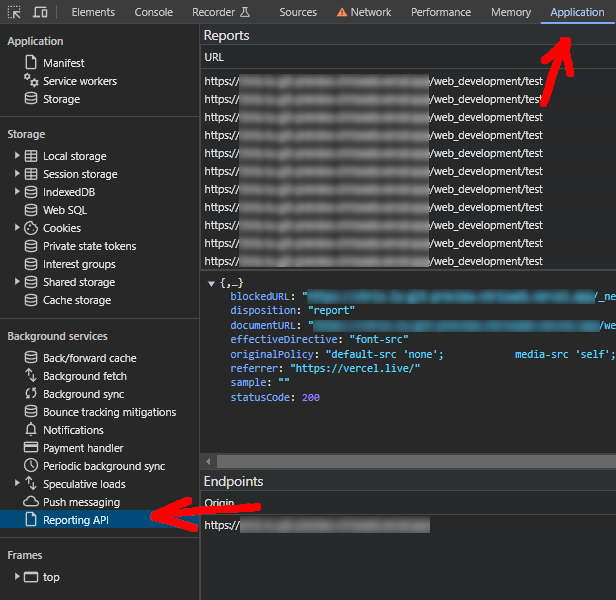
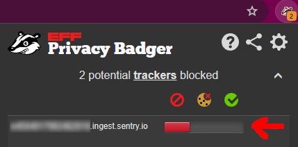

%toc%

<article>

# Tutorial: Next.js static MDX blog


In this tutorial we will:

* create static pages using the Next.js (v13.x/14.x) app directory
* create several components using React (v18.x)
* add support for MDX content formatting via the @next/mdx package
* add a plugin to automatically generate a table of contents for each post
* add another plugin will handle code blocks styling based on your favorite VSCode template
* add yet another plugin will allow us to GitHub like alerts to our content
* add linting tools for both the code of the project and the content of the posts
* add a CI/CD pipeline using vercel.com so that every time we commit code to our GitHub repository it gets automatically deployed

## Prerequisites

> [!NOTE]  
> The **Prerequisites** chapter is for beginners, if for example you already have a GitHub account then you can skip that step or if you prefer to install another IDE then the one I suggest then feel free to do so

First we need a **GitHub account** to store our code in a GitHub repository (if you prefer to use another serive like [GitLab](https://about.gitlab.com/) or [Bitbucket](https://bitbucket.org/), feel free to do so), which will make it easy to access your code on multiple devices and will also allow us to share your code with others. Later on we will use the GitHub to sign in to services like Vercel.com to set up an automatic CI/CD pipeline that will automatically deploy our code and sign up for a Sentry.io to add error monitoring, so that when a user encounters a bug it gets listed with a stacktrace in Sentry.io

* [create a GitHub account](/web_development/posts/github)

After creating a GitHub account need to **create a repository** on GitHub for our Code:

* [create a new GitHub repository](/web_development/posts/github#create-a-repository)

Next we need to **install git**, which is a version control tool which will get used by VSCode:

* [install git](/web_development/posts/git)

Next to be able to write code we need an Integrated Development Environment (IDE), my preferred IDE to write Javascript (Typescript) code is VSCode (Visual Studio Code):

* [install VSCode](/web_development/posts/vscode)

Now we need to sign in to our GitHub account in VSCode and use the VSCode source control tool to make a local clone of our GitHub repository:

* [clone GitHub repository in VSCode](/web_development/posts/vscode#cloning-your-github-repository-in-vscode)

To be able to create a Javascript backend and run our Javascript code locally we need to install the Node.js runtime:

* [install Node.js (and npm)](/web_development/posts/node-js)

> [!NOTE]  
> the **next.js 14** "app directory features" require nodejs v18.17 or later, so if you skipped the Node.js installation document because you already have Node.js installed, then just make sure you have a version installed that is high enough, to do that you can for example use the following command: `node -v{:shell}`

## The road to server components and server actions

React and Next.js have evolved a lot lately, the most notable additions are **server components** and **server actions**, on this page I try to list all the updates that happend during the last +-2 years in the React and Next.js ecosystem, so if you did not build a project with Next.js 13/14 yet I recommend you check it out, but if you are already an expert feel free to skip this chapter 😉

* [the road to React and Next.js server components and server actions](/web_development/posts/road-to-react-next-js-server-side-features)

## Getting started

If you closed VSCode since last time, launch VSCode and open the folder we created in **Prerequisites** chapter (if you need help to open a folder in VSCode, check out my chapter [open a folder in VSCODE](/web_development/posts/vscode#open-a-folder-in-vscode) from the VSCode post)

### create a new "preview" git branch

There are a lot of different approaches when it comes to managing code using branches, like [Git Flow](https://nvie.com/posts/a-successful-git-branching-model/), [GitHub Flow](https://docs.github.com/en/get-started/using-github/github-flow), [GitLab Flow](https://about.gitlab.com/topics/version-control/what-is-gitlab-flow/), [Trunk-based development](https://www.atlassian.com/continuous-delivery/continuous-integration/trunk-based-development) and many more. There is no right or wrong here, the best workflow is the one that works best for you (or for your team), this is why I recommend checking out the above links and familiarize yourself with the different workflows, then try the one out that you think is best suited and if it does not fit perfectly you can still adjust and make it your git flow 😉

Because this project is about a personal blog, I don't think we need a very complex Git Flow, this is why I will only create a second branch to commit the code updates into and then be able to preview the result (staging or testing environment), then if I'm satisfied with the result I will make a pull request (PR) to merge the code into the main branch, the main branch will then get deployed in production. If you work with others on your blog project, to avoid having to deal with merge conflicts on a regular basis, you might want to create a branch per feature (hence called feature branches) and use that branch for development, but if you are the only dev a **main** branch as well as an extra **preview** branch is probably enough.

Open VSCode and then create a new branch **from the main branch** and call it **preview** (to learn how to create a new branch from another branch (and then publish it), I recommend you check the chapter ["Creating a new branch" from the VSCode post](/web_development/posts/vscode#create-a-new-branch-from-based-on-another-branch) in my VSCode post)

> [!TIP]  
> we call our branch **preview** because later in this tutorial we will add a CI/CD pripeline via vercel.com and will use the **preview** branch to do preview deployments, the main (default) branch will be used to make production deployments

Now that the branch is created, you will see in the bottom of VSCode that our new branch is already the one selected, it is not published yet, so go ahead and publish it (yes you could consider not publishing it until you are sure that you will use the code, but I prefer to always immediatly publish them, so that if something happens to my computer I still have a copy in the cloud, of course once published it is a bit more work if you want to delete it as you need to do so locally as well as remotly but I still prefer that to losing several hours or even days worth of work)

### using Create Next App (CNA)

To create a new Next.js project we are going to use [Create Next App](https://www.npmjs.com/package/create-next-app) (CNA), CNA is a CLI tool created by the Next.js to get started quickly

> [!NOTE]  
> we will create the new project in the root of our directory (not a sub-directory), so make sure there is no README.md file in the directory yet, as the create-next-app tool we will use will create one and if it finds a README.md it will abort, if there is a README.md file, first delete it and then commit the changes (if you need help to commit changes using VSCode, check out my chapter [commit your changes to GitHub using the VSCode version control tool](/web_development/posts/vscode#commit-your-changes-to-github-using-the-vscode-version-control-tool) from the VSCode post)

> [!TIP]  
> I will use the option `--use-npm{:shell}`, if you prefer using another package manager you can change the option to `--use-pnpm{:shell}` for [pnpm](https://pnpm.io/), `--use-yarn{:shell}` for [yarn](https://yarnpkg.com/) or `--use-bun{:shell}` for [bun](https://bun.sh/package-manager)

Make sure the VSCode terminal is open (if you need help to open the terminal in VSCode, check out my chapter [open a VSCode terminal](/web_development/posts/vscode#open-a-vscode-terminal) from the VSCode post) and then enter the following command and then press `ENTER{:shell}`:

```shell title="terminal"
npx create-next-app@latest ./ --use-npm
```

**Create Next App** will tell you it needs to be installed first, accept by typing `y{:shell}` and then press `ENTER{:shell}`

Next you will get asked some more questions so that Next.js knows what it needs to install and set up for you:

* **Would you like to use TypeScript?**, I recommended leaving it to **Yes** which is what is preselected, if however you prefer to use javascript select **No** using the left / right arrow keys and then just press `ENTER{:shell}` (I recommend to use Typescript but I will not argue in favor or against it here, this is not the right place, if you never used Typescript before, then maybe just give it a try and see for yourself how different it is from using Javascript and after having built this blog prototype you will be able to judge for yourself which one you like more)
* **Would you like to use ESLint?**, again **Yes** is preselected, so just press `ENTER{:shell}` ([ESLint](https://eslint.org/) is very useful tool that helps find and correct errors in your code)
* **Would you like to use Tailwind CSS?**, I will set this to **No**,  press `←` (the left arrow key) and then `ENTER{:shell}`, I will use another styling solution in this project, more on that later) so if you want to explore another solution with me through this project then select "No" too, if you know Tailwind CSS and want to use it instead feel free to keep it on "Yes"
* **Would you like to use `src/` directory?** I will leave this on **No** and then press `ENTER{:shell}`, if prefer to place all your code in an `src/` directory then press the `→` right arrow key to select "Yes", some people prefer it for example to be able to restrict searches in files to files that are in the `src/` directory and hence avoid getting result from the node_modules folder, my personal preference is to not use it as it is not required, I like to have all my directories in the root and if needed I can exclude the node_modules directory which is the same amount of work as including src instead
* **Would you like to use App Router?** definatly keep this on **Yes** and then press `ENTER{:shell}`, since Next.js 13 you have two directories to chose from, you can add your pages into the **pages** directory which is the older version or you use the more modern version, which is the **app** directory, I recommend enabling the app directory (you can still later create the pages directory manually if you want to use it, both can be used alongside each other
* **Would you like to customize the default import alias (@/*)?** press `→` (the right arrow key) to select **Yes** and then press `ENTER{:shell}`, this will tell CNA to add an alias for a given path in the `tsconfig.json` (the Typescript configuration file) if you selected **TypeScript** in the first question and if you chose **Javascript** it will create the alias in the `jsconfig.json` file (This alias can be used for imports as a replacement for a path to a dependency, to learn more about this feature I recommend you have a quick look at the [Next.js "Absolute Imports and Module Path Aliases" documentation](https://nextjs.org/docs/app/building-your-application/configuring/absolute-imports-and-module-aliases)), if however you don't want it feel free to leave it on "No"
* **What import alias would you like configured?** I personally keep the default `@/*`, but feel free to chose another one if you prefer, then press `ENTER{:shell}`

That's it the **Create Next App** will now install Next.js and React (and React DOM) for us, it will then add some development dependencies based on what we chose, like Typescript and ESLint and then it will add some default configuration files for each of these tools

> [!TIP]  
> when you use CNA, some of the options you chose will get stored, so that next time you use it again it will take your stored preferences instead of default values, if you want to reset those stored preferences you can use the `--reset-preferences{:shell}` option like so `npx create-next-app --reset-preferences{:shell}`, if successful CNA will print the following message "**Preferences reset successfully**"  

> [!MORE]  
> [Next.js "create-next-app" documentation](https://nextjs.org/docs/pages/api-reference/create-next-app)  
> [VSCode "jsconfig.json" documentation](https://code.visualstudio.com/docs/languages/jsconfig)  
> [Next.js "Absolute Imports and Module Path Aliases" documentation](https://nextjs.org/docs/app/building-your-application/configuring/absolute-imports-and-module-aliases)

### first commit

Now that create next app is done, it is a good time to do your first commit

If you need help to commit changes (and then synchronize them) using VSCode, check out my chapter [commit your changes to GitHub using the VSCode version control tool](/web_development/posts/vscode#commit-your-changes-to-github-using-the-vscode-version-control-tool) from the VSCode post

After you have commited the files and synchronised the changes with remote repository, you can go to [github.com](https://github.com/) and check out your repository or go directly to your repository if you remember the name, the URL should be in the format `https://github.com/MY_GITHUB_USER_NAME/MY_REPOSITORY_NAME`, by default the content of the **main** branch gets displayed and because we commited our changes into the **preview** branch you need switch to the **preview** branch on GitHub to see your files (if you don't know how to switch branches on GitHub check out the [switch branches](/web_development/posts/github#switch-branches) chapter in my GitHub post)

If the commit and syncing was successful you will see that all the new files and directories are now listed in your GitHub repository

> [!TIP]  
> I recommend you commit often as it will make it a lot easier if you decide to revert your last commit, because it will only include the code from one step you want to undo and NOT also the code of several other steps that you actually want to keep, it will also create a nicer commit history where the commit messages are short and related to a few files instead if having a huge commit messages attached to dozens of files, also commiting and synchronising often reduces the risk that you lose code and hence hours or days of work if something happens to your local machine and finally it reduces the risk that you end of having conflits if you are not the only one working on the repository

### update the README.md file

> [!NOTE]  
> for your future self and for others that might contribute on your project it is always helpful to have well documented project. This is why we will update the readme and place some documentation in it, if however you prefer to store such information somewhere else this is fine too, what really matters is to do update the documentation regulary so that it will not become a tedious task at some point and also is a helpful resource right from the start of your project

The first file we will edit is the `README.md`, I recommend you remove everything that is currently in the REAME.md (not that it is bad advice but we will just structure it differently and add some more information to it)

Then copy / paste the following content into your README:

```md
# MY_PROJECT

## npm commands (package.json scripts)

`npm run dev`: to start the development server  
`npm run build`: to make a production build  
`npm run start`: to start the server on a production server using the build we made with the previous command  
`npm run lint`: to run a linting script that will scan our code and help us find problems in our code  

```

> [!TIP]  
> I added 2 spaces after each line, for the 4 commands, this ensures that there is a line break after each of them  

This adds documentation to the README for 4 commands that are available after setting up a project with CNA

Then change **MY_PROJECT** to whatever you want to name your project

> [!TIP]  
> Did you know you can preview markdown files in VSCode? If not check out my short [mardown preview chapter](/web_development/posts/vscode#vscode-markdown-preview) in the VSCode post  

Now save the file (to save the file you can use the VSCode shortcut `Ctrl+S{:shell}` (macOS: `⌘S{:shell}`, Linux: `Ctrl+S{:shell}`))

Finally commit the changes and then synchronize them

> [!MORE]  
> [markdown "paragraphs and line breaks" documentation](https://daringfireball.net/projects/markdown/syntax#p)  

### Next.js typescript plugin

Since [Next.js 13.1](https://nextjs.org/blog/next-13-1) the Next.js team added a new Typescript plugin:

> We've built a new TypeScript plugin that provides suggestions for page and layout configuration options and provides helpful usage hints around Server and Client Components

[Delba de Oliveira](https://github.com/delbaoliveira) which is part of the next.js developer experience team posted a [a short "Next.js Typescript plugin" introduction video](https://www.youtube.com/watch?v=pqMqn9fKEf8) on Youtube that you may want to watch

#### enabling the Next.js Typescript plugin

To make the Next.js typescript plugin work you need to change the Typescript version that VSCode is using to the **workspace version** (the version that Next.js create app just installed), because by default VSCode will use a built in Typescript version

If you don't know how yet how to change the typescript version to **workspace version** (in VSCode), check out the [VSCode typescript version](/web_development/posts/vscode#vscode-command-palette) chapter in the VSCode post

As soon as you switch to the **workspace version**, VSCode will create new `.vscode/settings.json` file (or if you already have a VSCode settings.json it will extend it), there is nothing wrong in sharing that file as it will ensure that everyone that works on your project (or if you use multiple devices yourself) that they use the same workspace settings, like the typescript workspace version but also in one of the next chapters we will add useful VSCode extension and they will be listed in settings file too, so if someone does not have the extension installed VSCode will show a modal that suggests installing it

> [!TIP]  
> Next.js typescript plugin comes with some useful features, for example you will have typed routes, meaning that if you use next/link and set a href to a page that doesn't exist you will get a warning, it will also warn you if something is wrong in how you use the **use client** directive in your components and some more, I recommend to keep an eye on the [Next.js "typescript" documentation](https://nextjs.org/docs/app/building-your-application/configuring/typescript) as the Next.js team adds more features over time

finally I recommend you commit / sync the new `.vscode/settings.json`

> [!MORE]  
> [Next.js "TypeScript" documentation](https://nextjs.org/docs/app/building-your-application/configuring/typescript)  

##### Statically Typed Links (Routes)

> [!WARN]  
> There seems to be a bug in the route types for `*.mdx` pages, when doing a prod build, when doing a dev build all routes are typed and listed in the `.next/types/link.d.ts` but they are missing in prod resulting in a **Type error** "XY is not an existing route.", so even though this feature seems very promissing, as of now I recommend to keep it turned off (set to false) if you have are using `*.mdx` pages (which is what we will do in this tutorial)

To ensure we benefit from **statically typed links** there is one more step needed, open the `next.config.mjs` and then add the **experimental** typedRoutes to your Next.js configuration file like so:

```js title="next.config.mjs" showLineNumbers {3-5}
/** @type {import('next').NextConfig} */
const nextConfig = {
    experimental: {
        typedRoutes: true,
    },
};

export default nextConfig;
```

then save your `next.config.mjs` and commit / sync your latest changes

> [!WARN]  
> right now there is a bug in Next.js that prevents MDX pages (page.mdx) to be recognized as routes when doing a production build (in development the typed routes work well), I opened a [ticket #62335 on GitHub](https://github.com/vercel/next.js/issues/62335), until the bug is fixed I suggested only enabling the **typedRoutes in development**, you can do so by using the next config **phase** parameter, to check if current phase is **PHASE_DEVELOPMENT_SERVER**

```js title="next.config.mjs" showLineNumbers {1} {3} {10}#special
import { PHASE_DEVELOPMENT_SERVER } from 'next/constants.js'

const nextConfig = (phase) => {

    /** @type {import('next').NextConfig} */
    const nextConfig = {
        experimental: {
            // experimental typescript "statically typed links"
            // https://nextjs.org/docs/app/building-your-application/configuring/typescript#statically-typed-links
            typedRoutes: phase === PHASE_DEVELOPMENT_SERVER ? true : false,
        },
    }

    return nextConfig

}

export default nextConfig;
```

> [!MORE]  
> [Next.js "Statically Typed Links" documentation](https://nextjs.org/docs/app/building-your-application/configuring/typescript)  

### React (strict mode) and powered by header

[React strict mode](https://react.dev/reference/react/StrictMode) and [powered by header(s)](https://nextjs.org/docs/app/api-reference/next-config-js/poweredByHeader) are two configuration options that often lead to controversial discussions among developers

**React strict mode** is **enabled by default** since **Next.js v13.4** for the **app router** (not the pages router), you can disable the React strict mode in the `next.config.mjs` by setting option to **false**

> [!NOTE]  
> for example if you don't want the **Strict Mode** to be enabled in your entire project, then disable it via the Next.js configuration file and then use the `<StrictMode>` only in the pages / layouts ... in which you want to enable it

I recommend not disabling the React Strict Mode, I see posts on [Stack Overflow](https://stackoverflow.com/) where people argue to turn it off as it causes problems in their app, however in my opinion this is masking problems instead of fixing the root cause, as mentioned on react.dev the Strict Mode does several important things, one of them is **checking if your components use deprecated APIs**

> [!TIP]  
> will only run in **development** and NOT in production, this is another reason to keep it turned on, even if it would lead to a problem in development it will NOT have any impact on your production build and hence have no impact on what your users experience

What surprises developers the most when they use React Strict Mode for the first time, is that re-renders components an extra time (in development), hence every component gets rendered (and effects triggered) then the components get unmounted and then get mounted a second time, this is done to detect problems, here is the explanation from the React.dev documentation as to why this is done:

> React components you write must always return the same JSX given the same inputs (props, state, and context). Components breaking this rule behave unpredictably and cause bugs.

So if for some reason you don't want it to be enabled in your entire app or if you need to disable it temporarely, then you can do it in the Next.js configuration file:

```js title="next.config.mjs" showLineNumbers {3}
/** @type {import('next').NextConfig} */
const nextConfig = {
    reactStrictMode: false,
};

export default nextConfig;
```

**Next.js powered by header** is another Next.js configuration option, that if enabled will add an **x-powered-by** header to all of your pages

Here is an example of the headers showing the **x-powered-by** header Next.js adds to pages, I used the **chrome dev tools**, opened the **Network tab** and then clicked on the row of the page to inspect the **response headers**:


Why would you want to turn this configuration option off?

When I get asked this, my first thought is to ask myself the opposite "why would I want to turn it on?" and honestly I have not yet found a reason as to why I would want to have it turned on. Another reason why I personally prefer to turn it off is because unfortunatly some people on the web have malicious intentions and the less they know about your apps technology stack the more difficult it will be for them to find vulnerabilities that have been disclosed but are not yet patched in the version you are using. Yes it does not make a huge difference, because hackers usually just launch batteries of tests that will check for a wide range of known vulnerabilities, few will use a bot that checks for **x-powered-by** headers to specifically target the exact version you are using. Also true, hackers can use profilling tools to get approximative information about what tech stack you are using. So yes, disabling the poweredByHeader option is not a miracle solution, that will prevent all potential attacks, but if there is a chance (no matter how small) that turning it off will make my app just a little bit safer then that's good enough for me and as I said earlier the second reason is that I see no reason why I would want to turn it on.

```js title="next.config.mjs" showLineNumbers {3}
/** @type {import('next').NextConfig} */
const nextConfig = {
    poweredByHeader: false,
};

export default nextConfig;
```

If you did any of the two changes I mentioned above , then save your `next.config.mjs` and commit / sync your latest changes

> [!MORE]  
> [React "Strict Mode" documentation](https://react.dev/reference/react/StrictMode)  
> [Next.js "Strict Mode" API reference](https://nextjs.org/docs/app/api-reference/next-config-js/reactStrictMode)  
> [Next.js "Powered By Header" API reference](https://nextjs.org/docs/app/api-reference/next-config-js/poweredByHeader)  

## first page

### create the first page

Hope you are still there, because it is finally time to start coding (a bit) 🙂

But first lets open the app directory create next app has created for us, if you have a bit of time have a look at what they put in there (it's always good to have a look at what the Next.js team recommends) but after that delete all the files in the `/app` directory as I want to go step by step through the process of creating a Next.js blog, you can also delete the content in the `/public` directory as we won't need the assets of the demo project anymore

Next create a new file in the app directory and name it `page.tsx` (or `page.jsx` if you chose to use javascript)

Then add the following content into the `page.tsx` file and finally save it

```tsx title="/app/page.tsx" showLineNumbers
export default function Home() {

    return (
        <>
            <h1>Hello World?</h1>
        </>
    )

}

```

Congratulations you just coded your first Next.js page

### start the dev(elopment) server

Now open the VSCode terminal if it isn't open yet (or use your favorite command line tool) and let's use one of the 4 commands we added to our README.md earlier to start the development server:

```shell
npm run dev
```

Now in the terminal, press `Ctrl` and then click on the Next.js local server URL or open your browser and put the following URL into the address bar: [http://localhost:3000/](http://localhost:3000/)

> [!NOTE]  
> port 3000 is the default, the port will be something else if:  
>
> * it was already in use Next.js will have taken another port  
> * you have used the **-p** option for next.js **dev** or **start** cli commands, for example in your package.json use the option like so `next dev -p 4000` to change the port to 4000
>
> if you want to know for sure what port is being used check the terminal, Next.js will have printed the URL of the dev server

If you inspect the source of the page, you will see that Next.js injects a bunch of Javascript code into our page and some of those javascript files are really heavy, this is because Next.js adds for example a tool called **Hot Module Reload** (HMR), which will run in the background and update the project for us every time we edit and then save a file in our project, Next.js calls this [fast refresh](https://nextjs.org/docs/architecture/fast-refresh), then it will reload the content in the browser for us, all of that code however won't make it into production, Next.js only adds those tool when in development mode (we are in development mode because we use the dev server command)

Now go back to VSCode and look at the list of files in the sidebar and you will notice that Next.js re-added the `/app/layout.tsx` file we just deleted earlier, that's because Next.js is a nice framework and it will always have your back, well and also because this layout file is called the **root layout** and it is **required**, also if you look at your VSCode terminal you will see that Next.js printed the following line, informing us that it created the layout file for us:

> Your page app/page.tsx did not have a root layout. We created app\layout.tsx for you.

If you open the file you will see that on top it has added a metadata object, this Next.js metadata API is what we will use in layouts and pages to modify the tags in the `<head>` element of our page(s), like the **title** and **description** (I will go more in detail in a future chapter)

The second part it has added is just a basic React setup

```tsx title="/app/layout.tsx" {1-4} showLineNumbers
export const metadata = {
    title: 'Next.js',
    description: 'Generated by Next.js',
}

export default function RootLayout({
    children,
}: {
    children: React.ReactNode
}) {
    return (
        <html lang="en">
            <body>{children}</body>
        </html>
    )
}

```

> [!MORE]  
> [Next.js "fast refresh" documentation](https://nextjs.org/docs/architecture/fast-refresh)  
> [Next.js "Root Layout (Required)" documentation](https://nextjs.org/docs/app/building-your-application/routing/pages-and-layouts#root-layout-required)  
> [Next.js "Metadata API" documentation](https://nextjs.org/docs/app/building-your-application/optimizing/metadata)  

### edit the first page

As you might have noticed I added a question mark in the **Hello World?** heading text, let's replace the question mark with an exclamation mark and then save the file

> [!NOTE]  
> as soon as you save the file, you will see in the terminal that Next.js prints a message **Compiled in Xms (Y modules)**, which shows you that Next.js detected changes in your code base and did a new build for you

Now go back into your browser and even though you haven't reloaded the page you will notice that your changes have been applied

Time to make another commit (and sync the changes) and then call it a day 😉

## CI/CD pipeline for automatic deployments

In this chapter we will set up a CI/CD pipeline, that will automatically deploy our code using [Vercel.com](https://vercel.com)

> [!NOTE]  
> You might still remember how in the past we would use a FTP software and manually transfer code to a server, or you might have struggled setting up GitHub actions... When using Vercel they will set up the workflow for us and then they will start monitoring our repository and when they detect a new commit (or pull request) they will fetch our code and automatically deploy it (on their infrastructure) for us
>
> This means we don't have to do anything else besides commiting our code as we have already done before but there will be no new additional step, you don't even need to click a button 😉

Of course if you prefer to use GitHub actions to create your own CI/CD pipeline feel free to do so, also feel free to use another provider but in this example I show you how easy and quick it is using [Vercel.com](https://vercel.com), the Hobby plan is free so if you don't know vercel yet you might want to give it a try to get an idea of how it performs compared your current deployment process

### vercel setup

First you need to have or create a hobby (free) account on [Vercel.com](https://vercel.com) (if you need help with that step, check out my chapter [Create a Vercel account (sign up)](/web_development/posts/vercel#create-an-account-sign-up) in the Vercel post)

Now we need create a new project on Vercel and allow them to access our repository (if you need help with that step, check out my chapter [Add a new project (repository)](/web_development/posts/vercel#add-a-new-project-repository) in the Vercel post)

Now that we have added our GitHub repository to vercel, every commit (or pull request) we do into the **main** branch will trigger a **production** deployment and every commit we do into the **preview** branch will trigger a **preview** (staging) deployment

### testing preview deployments

To see how this works open a new tab in your browser and open the [Vercel dashboard](https://vercel.com/dashboard) page, in the **Projects** list click on the name of your project to access the project page (something like `https://vercel.com/MY_USER_NAME-projects/MY_PROJECT_NAME`), on top you will have section called **Production Deployment** and below that a section called **Active Branches** which is still empty (No Preview Deployments)

Now open VSCode and make sure you are on the **preview** branch

Open the `README.me` file and for example add a small explanation that our project is now auto deploying on vercel, like so:

```md
# MY_PROJECT

## npm commands (package.json scripts)

`npm run dev`: to start the development server  
`npm run build`: to make a production build  
`npm run start`: to start the server on a production server using the build we made with the previous command  
`npm run lint`: to run a linting script that will scan our code and help us find problems in our code  

## CI/CD pipeline for automatic deployments

Everytime code gets pushed into the main branch it will trigger a production deployment, when code gets pushed into the preview branch it will trigger a preview deployment

```

Then save the file, commit and sync the changes and immediatly open the browser tab in which you opened your vercel project page, in the section **Active Branches** you should now see an entry for the **preview** branch (if it does not show up, manually reload the page), if you click on **View Deployment Status** it will open a page with details about the current deployment

Back on the project page, click on the **3 dots** (...) at the end of your preview branch row and then click on **Copy Branch URL**

Your branch URL will be something like `MY_PROJECT_NAME-git-preview-MY_USER_NAME.vercel.app`, paste the branch URL you just copied into your browsers address bar and press `Enter`

> [!NOTE]  
> when you visit your preview URL vercel will ask you to log in (if you are not logged in yet), this is because only you are supposed to have access to the previews, if someone else wants access they will first have to request access and wait for you to grant them access

Congratulations, you are now viewing a preview version of your project hosted on vercel

Because GitHub and Vercel are now connected, you will also have all the information about your deployments on your GitHub page, open the repository page on GitHub and have a look at the right sidebar you will now see a new section called **Deployments**:

If for example you click on **preview** it will open the deployments page, on top you will have a link to the live preview on vercel.app and below you will have a list of the recent deployments

## Error handling and logging

As we saw earlier each route segment is directory and each directory contains a page file, but unlike the page router, when using the app router we can add more than just pages, one of those files is an error file

How this works is that Next.js will automatically wrap the children of your page with a **React Error Boundary**, meaning that when an error gets thrown in a page then the error boundary will contain it and then use the error file that is the closest (either an error file that is in the same directory as the page itself or a parent directory) as a fallback

Let's create our first error file inside of our app directory and let's use the example from the Next.js documentation, like so:

```ts title="app/error.tsx" showLineNumbers {13-16}
'use client' // Error components must be Client Components

import { useEffect } from 'react'

export default function Error({
    error,
    reset,
}: {
    error: Error & { digest?: string }
    reset: () => void
}) {

    useEffect(() => {
        // Log the error to an error reporting service
        console.error(error)
    }, [error])

    return (
        <div>
            <h2>Something went wrong!</h2>
            <button
                onClick={
                    // Attempt to recover by trying to re-render the segment
                    () => reset()
                }
            >
                Try again
            </button>
        </div>
    )
}
```

As you can see the Next.js documentation example uses a `useEffect(){:.fn}` function to log the error in our console, but what happens if the error is getting triggered on a users computer, then we won't know about, so as Next.js suggests, in the second part of this chapter, we will use a third party service called [Sentry.io](https://sentry.io) to do the logging for us (of course if you prefer you can also develop and run your own logging service instead)

> [!MORE]  
> [Next.js "Handling Errors" documentation](https://nextjs.org/docs/app/building-your-application/routing/error-handling)  

### Sentry.io SDK for Next.js setup

In this chapter we will use [Sentry.io](https://sentry.io) (which has a free plan for side projects) to add error logging to the Next.js error file we just created

First you need to have or create an account on [Sentry.io](https://sentry.io) (if you need help with that step, check out my chapter [Create a Sentry account (sign up)](/web_development/posts/sentry-io#create-an-account-sign-up) in the Sentry.io post)

Now we need create a new project on Sentry.io (if you need help with that step, check out my chapter [Create a Sentry.io project](/web_development/posts/sentry-io#create-a-sentryio-project) in the Sentry.io post)

Now that the project is created we will use the Sentry.io Wizard tool to install the Sentry.io SDK for Next.js (if you need help with that step, check out my chapter [Sentry.io SDK for Next.js projects](/web_development/posts/sentry-io#sentryio-sdk-for-nextjs-projects) in the Sentry.io post)

After creating a Sentry.io project and setting up the SDK I recommend also using the [Sentry.io integration on Vercel](https://vercel.com/integrations/sentry) as this will automate the part **"Adding the Sentry authentication token as an environment variable to your CI setup"** that we just saw when using the Sentry.io wizard (if you need help with that step, check out my chapter [Sentry integration for Vercel](/web_development/posts/vercel#sentry-integration-for-vercel) in the Vercel post)

Finally now that you have installed the SDK you might want to some fine tuning of the Sentry.io configuration (if you need help with that step, check out my chapter [Sentry.io for Next.js configuration](/web_development/posts/sentry-io#sentryio-for-nextjs-configuration) in the Sentry.io post)

### Error logging using Sentry.io

Now that Sentry.io is set up we can modify the error file we created earlier and add import the Sentry SDK and add the Sentry.io logging function inside of the `useEffect(){:.fn}` to replace the example console.log, like so:

```ts title="app/error.tsx" showLineNumbers {3} {14-17}
'use client' // Error components must be Client Components

import * as Sentry from '@sentry/nextjs'
import { useEffect } from 'react'

export default function Error({
    error,
    reset,
}: {
    error: Error & { digest?: string }
    reset: () => void
}) {

    useEffect(() => {
        // Log the error to Sentry.io
        Sentry.captureException(error)
    }, [error])
```

> [!MORE]  
> [Sentry.io "Next.js SDK" documentation](https://docs.sentry.io/platforms/javascript/guides/nextjs/)  

### Handling global errors

The Sentry.io wizard we just used has created a Next.js `app/global-error.jsx{:shell}` file for us, the Next.js documentation explains well why this file is important:

> The root app/error.js boundary does not catch errors thrown in the root app/layout.js or app/template.js component.
>
> To specifically handle errors in these root components, use a variation of error.js called app/global-error.js located in the root app directory.
>
> global-error.js is the least granular error UI and can be considered "catch-all" error handling for the whole application.

But because Sentry created a **javascript** file but our project uses **typescript**, we will start by converting the file into a typescript file, by renaming `app/global-error.jsx{:shell}` to `app/global-error.tsx{:shell}`

After renaming the file we edit it and replace its content with the code for a global error page from the Next.js documentation, which is a good start as it is strictly typed, the only difference is that we also modify the code to add the Sentry.io `captureException(){:.fn}` function, that will capture exceptions and send them to Sentry.io, the final version looks like this:

```ts title="app/global-error.tsx"
'use client'

import * as Sentry from '@sentry/nextjs'
import { useEffect } from 'react'

export default function GlobalError({
    error,
    reset,
}: {
    error: Error & { digest?: string }
    reset: () => void
}) {

    useEffect(() => {
        Sentry.captureException(error)
    }, [error])

    return (
        <html>
            <body>
                <h2>Something went wrong!</h2>
                <button onClick={() => reset()}>Try again</button>
            </body>
        </html>
    )
}
```

Now we have error handling and logging, for pages as well as a global error handling file that will handle root layout error and act as a catch all for app errors, time to save, commit and sync

## Content Security Policy (CSP)

Using [Content Security Policy (CSP)](https://developer.mozilla.org/en-US/docs/Web/HTTP/CSP) headers is not required to make an app work but it is highly recommended as it will make your project more secure

> [!TIP]  
> I like to set up the CSP headers as early as possible, because if you wait until the last moment before going into production and then decide to add them, then you will probably have a bunch of **violations** that get reported and it might take some time to adjust your CSP rules, this why I recommend starting as early as possible and fix the violations one by one as soon as they occur

### Adding CSP Headers in Next config

To add CSP rules to our Next.js project we need to edit the `next.config.mjs` in the root of our project

Add the following lines to your configuration:

```js title="next.config.mjs" showLineNumbers
// CSP headers here is set based on Next.js recommendations:
// https://nextjs.org/docs/app/building-your-application/configuring/content-security-policy
const cspReportOnly = true;

const cspHeader = () => {

    const upgradeInsecure = cspReportOnly ? '' : 'upgrade-insecure-requests;'

    // worker-src is for sentry replay
    // child-src is because safari <= 15.4 does not support worker-src
    const defaultCSPDirectives = `
        default-src 'none';
        media-src 'self';
        object-src 'none';
        worker-src 'self' blob:;
        child-src 'self' blob:;
        base-uri 'none';
        form-action 'none';
        frame-ancestors 'none';
        block-all-mixed-content;
        ${upgradeInsecure}
    `

    // when environment is preview enable unsafe-inline scripts for vercel preview feedback/comments feature
    // and whitelist vercel's domains based on:
    // https://vercel.com/docs/workflow-collaboration/comments/specialized-usage#using-a-content-security-policy
    // and white-list vitals.vercel-insights
    // based on: https://vercel.com/docs/speed-insights
    if (process.env?.VERCEL_ENV === 'preview') {
        return `
            ${defaultCSPDirectives}
            font-src 'self' https://vercel.live/;
            style-src 'self' 'unsafe-inline' https://vercel.live/fonts;
            script-src 'self' 'unsafe-inline' https://vercel.live/;
            connect-src 'self' https://vercel.live/ https://vitals.vercel-insights.com https://*.pusher.com/ wss://*.pusher.com/;
            img-src 'self' data: https://vercel.com/ https://vercel.live/;
            frame-src 'self' https://vercel.live/;
        `
    }

    // for production environment white-list vitals.vercel-insights
    // based on: https://vercel.com/docs/speed-insights
    if (process.env.NODE_ENV === 'production') {
        return `
            ${defaultCSPDirectives}
            font-src 'self';
            style-src 'self' 'unsafe-inline';
            script-src 'self';
            connect-src 'self' https://vitals.vercel-insights.com;
            img-src 'self';
            frame-src 'none';
        `
    }

    // for dev environment enable unsafe-eval for hot-reload
    return `
        ${defaultCSPDirectives}
        font-src 'self';
        style-src 'self' 'unsafe-inline';
        script-src 'self' 'unsafe-eval' 'unsafe-inline';
        connect-src 'self';
        img-src 'self' data:;
        frame-src 'none';
    `
}

/** @type {import('next').NextConfig} */
const nextConfig = {
    poweredByHeader: false,
    experimental: {
        // currently false as mdx pages are not typed in prod builds (yet)
        typedRoutes: false,
    },
    headers: async () => {
        return [
            {
                source: '/(.*)',
                headers: [
                    {
                        key: cspReportOnly ? 'Content-Security-Policy-Report-Only' : 'Content-Security-Policy',
                        value: cspHeader().replace(/\n/g, ''),
                    },
                ],
            },
        ]
    },
};

export default nextConfig;
```

If you now start your development server (using `npm run dev`), open `http://localhost:3000` in your browser, then open the browsers developer tools and then click on the Console tab, then you should see no CSP violations messages

> [!NOTE]  
> To check for best practices I used a tool by google called [CSP Evaluator](https://csp-evaluator.withgoogle.com/), it showed a green checkmark for every directive except for **** where it mentioned that it would be better to remove **'unsafe-inline'**, however we unsafe-inline because next.js uses inline scripts a lot, for example scripts that inject css into the page, the second thing the tool mentioned is to add the directive **require-trusted-types-for 'script';**, however that directive again blocks css in js being injected into the html via scripts so I didn't use that directive, depending on what css framework you use, you might be able to use this directive, so I recommended adding it to test if it works for you and if there is no violation then keep it

Lets edit the CSP rules we just added an make the **script-src** rule stricter by disallowing **'unsafe-eval'**, to do so we remove the two values from the javascript resources rule, like so:

```js title="next.config.mjs" showLineNumbers{55} {6}#special
    // for dev environment enable unsafe-eval for hot-reload
    return `
        ${defaultCSPDirectives}
        font-src 'self';
        style-src 'self' 'unsafe-inline';
        script-src 'self' 'unsafe-inline';
        connect-src 'self';
        img-src 'self' data:;
        frame-src 'none';
    `
```

Go back into the browser and check the console again, you should now be able to see a bunch of errors like these:

> [Report Only] Refused to evaluate a string as JavaScript because 'unsafe-eval' is not an allowed source of script in the following Content Security Policy directive: "script-src 'self' 'unsafe-inline'".

Those violations are there because Next.js attempty to inject javascript code used by development scripts like the Hot Module Reload (HMR) tool that reloads our page every time we save a file, for HMR to work we need to re-add the **'unsafe-eval'** value to the **script-src** rule, do that now and then save the file to fix violations again

If you look closer at what rule sets we created, there are a total of 4, the first one contains several default rules that we will use for our 3 environments, then we have some rules that we will only apply if the environment is **preview** which is the case when we deploy the preview branch on vercel, the next group contains the rules for the production environment and the last group has the rules we use for our local development environment

If you look at the `script-src 'self' 'unsafe-eval' 'unsafe-inline'` rule we just edited for **development** you will see that we added the `'unsafe-eval'` value, now compare it with the `script-src` we use for the **production** and the rule we use for the **preview** environments and you will see that there we don't add that value, this is because scripts like HMR are only used in development, by not adding that exception to production and preview we make those two environments safer

> [!TIP]  
> I recommend you always start with the most restrictive rules possible, for example if you look at the top of CSP rules, I have set the **form-action** to none, this is because in this tutorial we will not have any forms so there is no reason to allow them, however if you add forms to your project in the future then you will of course want to adjust the directive and for example set it to 'self' instead of 'none'

Next if we look at the top of the configuration you will see that we set a variable **cspReportOnly** to **true**:

```js title="next.config.mjs" showLineNumbers {3}
// CSP headers here is set based on Next.js recommendations:
// https://nextjs.org/docs/app/building-your-application/configuring/content-security-policy
const cspReportOnly = true;
```

and then at the end of the configuration file we use that variable, like so:

```js title="next.config.mjs" showLineNumbers{67} {14}
/** @type {import('next').NextConfig} */
const nextConfig = {
    poweredByHeader: false,
    experimental: {
        // currently false as mdx pages are not typed in prod builds (yet)
        typedRoutes: false,
    },
    headers: async () => {
        return [
            {
                source: '/(.*)',
                headers: [
                    {
                        key: cspReportOnly ? 'Content-Security-Policy-Report-Only' : 'Content-Security-Policy',
                        value: cspHeader().replace(/\n/g, ''),
                    },
                ],
            },
        ]
    },
};

export default nextConfig;
```

Depending on the value of **cspReportOnly**, we either set the CSP header to **Content-Security-Policy-Report-Only** mode (if cspReportOnly = true) or we set it to **Content-Security-Policy** (if cspReportOnly = false)

This is because CSP has two modes, one that will ONLY report violations, this is good for testing your rules before actually enforcing them and a second mode which will enforce the rules

> [!NOTE]  
> when enforcing is enabled it will still report the violations (besides enforcing them)  

For now we set the CSP mode to only report violations, however as soon as are confident that there are no more violations it is recommend to set our custom variable **cspReportOnly** to **false**

> [!MORE]  
> [MDN "Content Security Policy (CSP)" documentation](https://developer.mozilla.org/en-US/docs/Web/HTTP/CSP)  
> [MDN "CSP Headers" reference](https://developer.mozilla.org/en-US/docs/Web/HTTP/Headers/Content-Security-Policy)  
> [Next.js "Configuring CSP" documentation](https://nextjs.org/docs/app/building-your-application/configuring/content-security-policy)  
> [Vercel "Using a Content Security Policy" documentation](https://vercel.com/docs/workflow-collaboration/comments/specialized-usage#using-a-content-security-policy)  

### Logging CSP violations

#### the state of violations reporting (as of february 2024)

This chapter contains mostly theory about the CSP reporting that I found while doing my research, if you are interested in that sort of content read on, if you want the TLDR then [skip to the next chapter](#logging-csp-violations-using-sentryio)

CSP violations can not only be seen in the console, as this would limit us to only see violations that occur when we (the developers) visit the app ourself, but what about violations that happen when a user visits our project, for such cases you can use CSP violations reporting, however how CSP violation reports work has changed over the years, the w3c has released several iterations of their Content Security Policy recommendations / working drafts:

* in the [CSP level 1](https://www.w3.org/TR/2012/CR-CSP-20121115/) & [CSP level 2](https://www.w3.org/TR/CSP2/) recommandations, CSP violations get reported using a [report-uri](https://developer.mozilla.org/en-US/docs/Web/HTTP/Headers/Content-Security-Policy/report-uri) reporting directive, if we look at [caniuse report-uri](https://caniuse.com/?search=report-uri) page we can see that it is supported by all major browsers, the major downside of this feature is that it will make a request per violation, meaning that if you have a violation like that occurs several dozen times on a page then the browser will spam your logging endpoint with reports
* [CSP level 3](https://www.w3.org/TR/CSP3/) introduces a new [report-to](https://developer.mozilla.org/en-US/docs/Web/HTTP/Headers/Content-Security-Policy/report-to) **reporting directive** and the w3c has marked the report-uri directive as deprecated, if we look at [caniuse report-to](https://caniuse.com/?search=report-to) however we see that firefox does not yet support the directive (their ticket ["CSP: Implement report-to"](https://bugzilla.mozilla.org/show_bug.cgi?id=1391243) is quite old but some ago they seemed to have started working on it) and safari only started to support it with v16.4 (released March 27, 2023)

But wait, there is more...

##### report-to != Report-to

In the previous chapter we saw the CSP directive **report-to** but when reading about CSP you might also encounter a **Report-to** header, the difference between the header and the directive is the first letter of the header is a capital **R** while the directive has a small **r**

The **Report-to** header is part of an initial Reporting API draft by the w3c, more about the reporting API in the next chapter...

##### Reporting API

Initially CSP would use a single header which included a directive to instruct the browser where to send reports, but the w3c introduced something new called the **Reporting API** which describes a new header that can be used to make reports. This header is NOT just to send CSP violations reports but covers a wide range of use cases, for example it can be used to send [Permissions-Policy](https://developer.mozilla.org/en-US/docs/Web/HTTP/Headers/Permissions-Policy) reports, reports regarding deprecated browser features your code might be using, but also reports about browser crashes and more...

The first draft of the **Reporting API (v0)** included a **Report-to header** and [chrome version 69](https://chromestatus.com/feature/4672626140119040) was the first browser to ship with support for this new feature, but after a while the w3c team decided to rename the header and so in the [w3c "Reporting API v1" working draft](https://www.w3.org/TR/reporting-1/) they renamed the Report-to header to **Reporting-Endpoints** and [chrome 96](https://chromestatus.com/feature/5712172409683968) is the first browser to support the ship support for Reporting-Endpoints. There is a very good article on [developer.chrome.com](https://developer.chrome.com/) you may want to read with lots of additional information about the new Reporting API Endpoints titled [Monitor your web application with the Reporting API](https://developer.chrome.com/docs/capabilities/web-apis/reporting-api)

> [!MORE]  
> [chrome developer "Monitor your web application with the Reporting API" article](https://developer.chrome.com/docs/capabilities/web-apis/reporting-api)  
> [MDN "Reporting API" documentation](https://developer.mozilla.org/en-US/docs/Web/API/Reporting_API)  
> [caniuse "Reporting API" page](https://caniuse.com/?search=Reporting%20API)  
> [w3c "Reporting API v1" working draft](https://www.w3.org/TR/reporting-1/)  
> [chromium "Reporting API" readme](https://chromium.googlesource.com/chromium/src/+/HEAD/net/reporting/README.md)  

##### Sentry.io does not support report-to yet

**report-to** is not yet supported by sentry.io, there are several open tickets related to this, like issue 

##### report-uri works in localhost but report-to does not

When using **report-uri**, reporting violations works locally (localhost) as well as in preview / production (secure context / https URL)

When using **report-to**, reporting violations will NOT work on localhost (in chrome), which is surprising as localhost usually is considered a secure context (if you know why please let me know using the [chris.lu github discussions](https://github.com/chrisweb/chris.lu/discussions))

In preview / production **report-to** will work (on chrome)

##### report-uri requests show up in the Network tab

When using **report-uri**, you can inspect requests using the developer tools **Network tab**

##### report-to requests DO NOT show up in the Network tab

When using **report-to**, however you won't see any entries in your developer tools **Network** tab, because a background service does the request(s) and not the website (code), you can however see the requests by opening your developer tools, then click on the **Application** tab and then on the left under **Background services** click on **Reporting API**:



##### adblockers often block CSP violation requests

However you might see that their status is **blocked** in which case you probably have an adblocker extension installed that is blocking the requests, I for example use [Privacy Badger](https://privacybadger.org/) and have to allow the domain in the extension settings



##### Sentry.io will filter out report-uri requests made by localhost

By default localhost is on a blocklist in Sentry.io, so if you use **report-uri** you will see the requests in the Network tab but they won't show up in Sentry.io

If you want to **report-uri** CSP reports from localhost in Sentry.io go to... 

TODO: finish this chapter, add screenshots


#### logging CSP violations using sentry.io

On a lot of places you will read that it is recommended to use both report-to as well as report-uri as fallback, however I will in this example only use report-uri because the problem is that if you set both report-to and report-uri as fallback then chrome will use the newer report-to, which will send a request to sentry.io but that request **will fail** as Sentry.io does not yet support report-to, but because chrome used report-to it also means chrome will never try report-uri as alternative, meaning that if you set both then chrome reports will NOT get logged in Sentry.io at all


 we will use [Sentry.io](https://sentry.io) that we have set up earlier for error logging purposes and add CSP violations logging

To make sure violations are being sent to Sentry.io, we need to edit our CSP headers like so:

```js title="next.config.mjs" showLineNumbers{67} {17-22}
/** @type {import('next').NextConfig} */
const nextConfig = {
    poweredByHeader: false,
    experimental: {
        // currently false as mdx pages are not typed in prod builds (yet)
        typedRoutes: false,
    },
    headers: async () => {
        return [
            {
                source: '/(.*)',
                headers: [
                    {
                        key: cspReportOnly ? 'Content-Security-Policy-Report-Only' : 'Content-Security-Policy',
                        value: cspHeader().replace(/\n/g, ''),
                    },
                ],
            },
        ]
    },
};

export default nextConfig;
```

> [!MORE]  
> [Sentry.io "CSP violations logging" documentation](https://docs.sentry.io/product/security-policy-reporting/)  
> [w3c "Content Security Policy Level 3" working draft](https://w3c.github.io/webappsec-csp/)  

</article>
