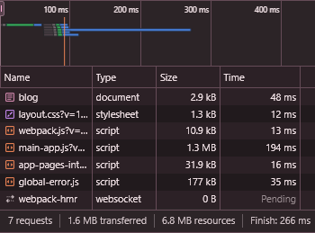
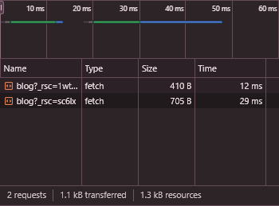
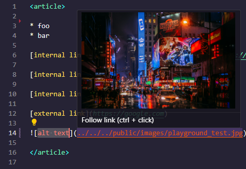

import { FontAwesomeIcon } from '@fortawesome/react-fontawesome'
import { faBug, faComments } from '@fortawesome/free-solid-svg-icons'

%toc%

<article>

# Tutorial: Next.js static MDX blog


I tried to make this tutorial as beginner friendly as possible, if however you have a question feel free to ask on the <FontAwesomeIcon icon={faComments} size="1x" color='rgb(255, 0, 170)' /> [discussion](https://github.com/chrisweb/chris.lu/discussions) page and if you find a bug please report it using the <FontAwesomeIcon icon={faBug} size="1x" color='rgb(255, 0, 170)' /> [issues](https://github.com/chrisweb/chris.lu/issues)

In this tutorial we will:

* create static pages using the Next.js v15.x (compatible with v13.x/14.x) app directory
* create several components using React v19.x (compatible with v18.x)
* add support for MDX content formatting via the @next/mdx package
* add a plugin to automatically generate a table of contents for each post
* add another plugin which will handle code blocks styling based on your favorite VSCode template
* add yet another plugin which will allow us to GitHub like alerts to our content
* add linting tools for both the code of the project and the content (markdown lint)
* add a CI/CD pipeline using Vercel.com so that every time we commit code to our GitHub repository it gets automatically deployed (staging / production)
* add bugs monitoring and Content Security Policy (CSP) violations logging using Sentry.io
* install useful extension for VSCode and learn how to use them

> [!NOTE]  
> I made this tutorial for total beginners in mind, however if you are already an experienced Next.js dev then there are some chapter you may want to skip

## Prerequisites

> [!NOTE]  
> The **Prerequisites** chapter is for beginners, if for example you already have a GitHub account then you can skip that step or if you prefer to install another IDE then the one I suggest then feel free to do so

First we need a **GitHub account** to store our code in a GitHub repository (if you prefer to use another serive like [GitLab](https://about.gitlab.com/) or [Bitbucket](https://bitbucket.org/), feel free to do so), which will make it easy to access your code on multiple devices and will also allow us to share your code with others. Later on we will use the GitHub to sign in to services like Vercel.com to set up an automatic CI/CD pipeline that will automatically deploy our code and sign up for a Sentry.io to add error monitoring, so that when a user encounters a bug it gets listed with a stacktrace in Sentry.io

* [create a GitHub account](/web_development/posts/github)

After creating a GitHub account need to **create a repository** on GitHub for our Code:

* [create a new GitHub repository](/web_development/posts/github#create-a-repository)

Next we need to **install git**, which is a version control tool which will get used by VSCode:

* [install git](/web_development/posts/git)

Next to be able to write code we need an Integrated Development Environment (IDE), my preferred IDE to write Javascript (Typescript) code is VSCode (Visual Studio Code):

* [install VSCode](/web_development/posts/vscode)

Now we need to sign in to our GitHub account in VSCode and use the VSCode source control tool to make a local clone of our GitHub repository:

* [clone GitHub repository in VSCode](/web_development/posts/vscode#cloning-your-github-repository-in-vscode)

To be able to create a Javascript backend and run our Javascript code locally we need to install the Node.js runtime:

* [install Node.js (and npm)](/web_development/posts/node-js)

> [!NOTE]  
> the **Next.js 14** "app directory features" require nodejs v18.17 or later, so if you skipped the Node.js installation document because you already have Node.js installed, then just make sure you have a version installed that is high enough, to do that you can for example use the following command: `node -v`

## The road to React 19 and Next.js 15

React and Next.js have evolved a lot lately, the most notable additions are **server components** and **(server) actions**. With those new features came a lot of changes for how we devs build Next.js apps / websites, which is why I did a seperate blog post ["The road to React 19 and Next.js 15"](/web_development/posts/road-to-react-19-next-js-15) where I list what changed during the last +-3 years in the React and Next.js ecosystem. If you did not build a project with Next.js 13/14/15 and React 18/19 yet I recommend you check it out, but if you are already an expert feel free to skip it 😉

> [!MORE]  
> [chris.lu "The road to React 19 and Next.js 14" post](/web_development/posts/road-to-react-19-next-js-15)

## Basic project setup

If you closed VSCode since last time, launch VSCode and open the folder we created in **Prerequisites** chapter (if you need help to open a folder in VSCode, check out my chapter [open a folder in VSCODE](/web_development/posts/vscode#open-a-folder-in-vscode) from the VSCode post)

### create a new "preview" git branch

There are a lot of different approaches when it comes to managing code using branches, like [Git Flow](https://nvie.com/posts/a-successful-git-branching-model/), [GitHub Flow](https://docs.github.com/en/get-started/using-github/github-flow), [GitLab Flow](https://about.gitlab.com/topics/version-control/what-is-gitlab-flow/), [Trunk-based development](https://www.atlassian.com/continuous-delivery/continuous-integration/trunk-based-development) and many more. There is no right or wrong here, the best workflow is the one that works best for you (or for your team), this is why I recommend checking out the above links and familiarize yourself with the different workflows, then try the one out that you think is best suited and if it does not fit perfectly you can still adjust and make it your git flow 😉

Because this project is about a personal blog, I don't think we need a very complex Git Flow, this is why I will only create a second branch to commit the code updates into and then be able to preview the result (staging or testing environment), then if I'm satisfied with the result I will make a pull request (PR) to merge the code into the main branch, the main branch will then get deployed in production. If you work with others on your blog project, to avoid having to deal with merge conflicts on a regular basis, you might want to create a branch per feature (hence called feature branches) and use that branch for development, but if you are the only dev a **main** branch as well as an extra **preview** branch is probably enough.

Open VSCode and then create a new branch **from the main branch** and call it **preview** (to learn how to create a new branch from another branch (and then publish it), I recommend you check the chapter ["Creating a new branch" from the VSCode post](/web_development/posts/vscode#create-a-new-branch-from-based-on-another-branch) in my VSCode post)

> [!TIP]  
> we call our branch **preview** because later in this tutorial we will add a CI/CD pripeline via vercel.com and will use the **preview** branch to do preview deployments, the main (default) branch will be used to make production deployments

Now that the branch is created, you will see in the bottom of VSCode that our new branch is already the one selected, it is not published yet, so go ahead and publish it (yes you could consider not publishing it until you are sure that you will use the code, but I prefer to always immediatly publish them, so that if something happens to my computer I still have a copy in the cloud, of course once published it is a bit more work if you want to delete it as you need to do so locally as well as remotly but I still prefer that to losing several hours or even days worth of work)

> [!MORE]  
> [chris.lu "VSCode" post](/web_development/posts/vscode)  

### using Create Next App (CNA)

To create a new Next.js project we are going to use [Create Next App](https://www.npmjs.com/package/create-next-app) (CNA), CNA is a CLI tool created by the Next.js to get started quickly

> [!NOTE]  
> we will create the new project in the root of our directory (not a sub-directory), so make sure there is no README.md file in the directory yet, as the create-next-app tool we will use will create one and if it finds a README.md it will abort, if there is a README.md file, first delete it and then commit the changes (if you need help to commit changes using VSCode, check out my chapter [commit your changes to GitHub using the VSCode version control tool](/web_development/posts/vscode#commit-your-changes-to-github-using-the-vscode-version-control-tool) from the VSCode post)

> [!TIP]  
> I will use the option `--use-npm`, if you prefer using another package manager you can change the option to `--use-pnpm` for [pnpm](https://pnpm.io/), `--use-yarn` for [yarn](https://yarnpkg.com/) or `--use-bun` for [bun](https://bun.sh/package-manager)

Make sure the VSCode terminal is open (if you need help to open the terminal in VSCode, check out my chapter [open a VSCode terminal](/web_development/posts/vscode#open-a-vscode-terminal) from the VSCode post) and then enter the following command and then press `ENTER`:

```shell title="terminal"
npx create-next-app@latest ./ --use-npm
```

**Create Next App** will tell you it needs to be installed first, accept by typing `y` and then press `ENTER`

Next you will get asked some more questions so that Next.js knows what it needs to install and set up for you:

* **Would you like to use TypeScript?**, I recommended leaving it to **Yes** which is what is preselected, if however you prefer to use javascript select **No** using the left / right arrow keys and then just press `ENTER` (I recommend to use Typescript but I will not argue in favor or against it here, this is not the right place, if you never used Typescript before, then maybe just give it a try and see for yourself how different it is from using Javascript and after having built this blog prototype you will be able to judge for yourself which one you like more)
* **Would you like to use ESLint?**, again **Yes** is preselected, so just press `ENTER` ([ESLint](https://eslint.org/) is very useful tool that helps find and correct errors in your code)
* **Would you like to use Tailwind CSS?**, I will set this to **No**,  press `←` (the left arrow key) and then `ENTER`, I will use another styling solution in this project, more on that later) so if you want to explore another solution with me through this project then select "No" too, if you know Tailwind CSS and want to use it instead feel free to keep it on "Yes"
* **Would you like to use `src/` directory?** I will leave this on **No** and then press `ENTER`, if prefer to place all your code in an `src/` directory then press the `→` right arrow key to select "Yes", some people prefer it for example to be able to restrict searches in files to files that are in the `src/` directory and hence avoid getting result from the node_modules folder, my personal preference is to not use it as it is not required, I like to have all my directories in the root and if needed I can exclude the node_modules directory which is the same amount of work as including src instead
* **Would you like to use App Router?** definatly keep this on **Yes** and then press `ENTER`, since Next.js 13 you have two directories to chose from, you can add your pages into the **pages** directory which is the older version or you use the more modern version, which is the **app** directory, I recommend enabling the app directory (you can still later create the pages directory manually if you want to use it, both can be used alongside each other
* **Would you like to customize the default import alias (@/*)?** press `→` (the right arrow key) to select **Yes** and then press `ENTER`, this will tell CNA to add an alias for a given path in the `tsconfig.json` (the Typescript configuration file) if you selected **TypeScript** in the first question and if you chose **Javascript** it will create the alias in the `jsconfig.json` file (This alias can be used for imports as a replacement for a path to a dependency, to learn more about this feature I recommend you have a quick look at the [Next.js "Absolute Imports and Module Path Aliases" documentation](https://nextjs.org/docs/app/building-your-application/configuring/absolute-imports-and-module-aliases)), if however you don't want it feel free to leave it on "No"
* **What import alias would you like configured?** I personally keep the default `@/*`, but feel free to chose another one if you prefer, then press `ENTER`

That's it the **Create Next App** will now install Next.js and React (and React DOM) for us, it will then add some development dependencies based on what we chose, like Typescript and ESLint and then it will add some default configuration files for each of these tools

> [!TIP]  
> when you use CNA, some of the options you chose will get stored, so that next time you use it again it will take your stored preferences instead of default values, if you want to reset those stored preferences you can use the `--reset-preferences` option like so `npx create-next-app --reset-preferences`, if successful CNA will print the following message "**Preferences reset successfully**"  

> [!MORE]  
> [Next.js "create-next-app" documentation](https://nextjs.org/docs/app/api-reference/create-next-app)  
> [VSCode "jsconfig.json" documentation](https://code.visualstudio.com/docs/languages/jsconfig)  
> [Next.js "Absolute Imports and Module Path Aliases" documentation](https://nextjs.org/docs/app/building-your-application/configuring/absolute-imports-and-module-aliases)  

### first commit

Now that create next app is done, it is a good time to do your first commit

If you need help to commit changes (and then synchronize them) using VSCode, check out my chapter [commit your changes to GitHub using the VSCode version control tool](/web_development/posts/vscode#commit-your-changes-to-github-using-the-vscode-version-control-tool) from the VSCode post

After you have commited the files and synchronised the changes with remote repository, you can go to [github.com](https://github.com/) and check out your repository or go directly to your repository if you remember the name, the URL should be in the format `https://github.com/MY_GITHUB_USER_NAME/MY_REPOSITORY_NAME`, by default the content of the **main** branch gets displayed and because we commited our changes into the **preview** branch you need switch to the **preview** branch on GitHub to see your files (if you don't know how to switch branches on GitHub check out the [switch branches](/web_development/posts/github#switch-branches) chapter in my GitHub post)

If the commit and syncing was successful you will see that all the new files and directories are now listed in your GitHub repository

> [!TIP]  
> I recommend you commit often as it will make it a lot easier if you decide to revert your last commit, because it will only include the code from one step you want to undo and NOT also the code of several other steps that you actually want to keep, it will also create a nicer commit history where the commit messages are short and related to a few files instead if having a huge commit messages attached to dozens of files, also commiting and synchronising often reduces the risk that you lose code and hence hours or days of work if something happens to your local machine and finally it reduces the risk that you end of having conflits if you are not the only one working on the repository

### update the README.md file

> [!NOTE]  
> for your future self and for others that might contribute on your project it is always helpful to have well documented project. This is why we will update the readme and place some documentation in it, if however you prefer to store such information somewhere else this is fine too, what really matters is to do update the documentation regulary so that it will not become a tedious task at some point and also is a helpful resource right from the start of your project

The first file we will edit is the `README.md`, I recommend you remove everything that is currently in the REAME.md (not that it is bad advice but we will just structure it differently and add some more information to it)

Then copy / paste the following content into your README:

```md
# MY_PROJECT

## npm commands (package.json scripts)

`npm run dev`: to start the development server  
`npm run build`: to make a production build  
`npm run start`: to start the server on a production server using the build we made with the previous command  
`npm run lint`: to run a linting script that will scan our code and help us find problems in our code  

```

> [!TIP]  
> I added 2 spaces after each line, for the 4 commands, this ensures that there is a line break after each of them  

This adds documentation to the README for 4 commands that are available after setting up a project with CNA

Then change **MY_PROJECT** to whatever you want to name your project

> [!TIP]  
> Did you know you can preview markdown files in VSCode? If not check out my short ["VSCode markdown preview" chapter](/web_development/posts/vscode#vscode-markdown-and-mdx-preview) in the VSCode post  

Now save the file (to save the file you can use the VSCode shortcut `Ctrl+S` (macOS: `⌘S`, Linux: `Ctrl+S`))

Finally commit the changes and then synchronize them

> [!MORE]  
> [markdown "paragraphs and line breaks" documentation](https://daringfireball.net/projects/markdown/syntax#p)  

### Next.js typescript plugin

Since [Next.js 13.1](https://nextjs.org/blog/next-13-1) the Next.js team added a new Typescript plugin:

> We've built a new TypeScript plugin that provides suggestions for page and layout configuration options and provides helpful usage hints around Server and Client Components

[Delba de Oliveira](https://github.com/delbaoliveira) which is part of the Next.js developer experience team posted a [a short "Next.js Typescript plugin" introduction video](https://www.youtube.com/watch?v=pqMqn9fKEf8) on Youtube that you may want to watch

#### Enabling the Next.js Typescript plugin

To make the Next.js typescript plugin work you need to change the Typescript version that VSCode is using to the **workspace version** (the version that Next.js create app just installed), because by default VSCode will use a built in Typescript version

If you don't know how yet how to change the typescript version to **workspace version** (in VSCode), check out the [VSCode typescript version](/web_development/posts/vscode#vscode-typescript-version) chapter in the VSCode post

As soon as you switch to the **workspace version**, VSCode will create new `.vscode/settings.json` file (or if you already have a VSCode settings.json it will extend it), there is nothing wrong in sharing that file as it will ensure that everyone that works on your project (or if you use multiple devices yourself) that they use the same workspace settings, like the typescript workspace version but also in one of the next chapters we will add useful VSCode extension and they will be listed in settings file too, so if someone does not have the extension installed VSCode will show a modal that suggests installing it

> [!TIP]  
> Next.js typescript plugin comes with some useful features, for example you will have typed routes, meaning that if you use next/link and set a href to a page that doesn't exist you will get a warning, it will also warn you if something is wrong in how you use the **use client** directive in your components and some more, I recommend to keep an eye on the [Next.js "typescript" documentation](https://nextjs.org/docs/app/building-your-application/configuring/typescript) as the Next.js team adds more features over time

finally I recommend you commit / sync the new `.vscode/settings.json`

> [!MORE]  
> [Next.js "TypeScript" documentation](https://nextjs.org/docs/app/building-your-application/configuring/typescript)  

##### Statically Typed Links (Routes)

> [!WARN]  
> There seems to be a bug in the route types for `*.mdx` pages, when doing a prod build, when doing a dev build all routes are typed and listed in the `.next/types/link.d.ts` but they are missing in prod resulting in a **Type error** "XY is not an existing route.", so even though this feature seems very promissing, as of now I recommend to keep it turned off (set to false) if you have are using `*.mdx` pages (which is what we will do in this tutorial)

To ensure we benefit from **statically typed links** there is one more step needed, open the `next.config.mjs` and then add the **experimental** typedRoutes to your Next.js configuration file like so:

```js title="next.config.mjs" showLineNumbers {3-9}
/** @type {import('next').NextConfig} */
const nextConfig = {
    experimental: {
        // experimental typescript "statically typed links"
        // https://nextjs.org/docs/app/api-reference/next-config-js/typedRoutes
        // currently false in prod until Issue #62335 is fixed
        // https://github.com/vercel/next.js/issues/62335
        typedRoutes: true,
    },
};

export default nextConfig
```

Line 1 you can see that the Next.js configuration file uses [jsdoc](https://www.typescriptlang.org/docs/handbook/jsdoc-supported-types.html) with the `@type` Typescript script, which allows us to have types even though the configuration file is not Typescript (but Javascript), which means if you start typing inside of the nextConfig object you will benefit from autocompletation for the Next.js configuration options

Line 3-9 we use the typedRoutes (experimental) option and enabled it, which means that when using `npm run dev` or when building for production, Next.js will generate a `.next/types/link.d.ts` file that contains information about all existing routes in our application, the advantage of this is that if we now use [next/link](https://nextjs.org/docs/app/building-your-application/routing/linking-and-navigating#link-component) but set the href to a route that doesn't exist we will see an error in VSCode getting displayed and builds will fail until we fix the typo in our URL

> [!NOTE]  
> You might have noticed that in the latest Next.js the configuration file is now an [ECMAScript module](https://nodejs.org/api/esm.html) (ES modules / ESM) and not a [CommonJS module](https://nodejs.org/api/modules.html#modules-commonjs-modules) like in previous versions, which is why the extension is now `.mjs` and not `.js` anymore, this means that instead of using a require function to import other modules we now use the same import statement we use in client code, this change also matters because more and packages on npm are migrating to an ESM only format, which reduces the amount of code needed as they can drop CommonJS backward compatibility, but for us it means we must use import statements and can't NOT use the require function anymore  

then save your `next.config.mjs` and commit / sync your latest changes

> [!MORE]  
> [Next.js "configuration options" reference](https://nextjs.org/docs/app/api-reference/next-config-js)  
> [Typescript "JSDoc" reference](https://www.typescriptlang.org/docs/handbook/jsdoc-supported-types.html)  
> [Next.js "Statically Typed Links" documentation](https://nextjs.org/docs/app/building-your-application/configuring/typescript)  
> [Next.js "typedRoutes (experimental)" reference](https://nextjs.org/docs/app/api-reference/next-config-js/typedRoutes)  

###### typedRoutes bug

> [!WARN]  
> right now there is a bug in Next.js that prevents MDX pages (page.mdx) to be recognized as routes when doing a production build (in development the typed routes work well), I opened a [ticket #62335 on GitHub](https://github.com/vercel/next.js/issues/62335), until the bug is fixed I suggested only enabling the **typedRoutes in development**, you can do so by using the next config **phase** parameter, to check if current phase is **PHASE_DEVELOPMENT_SERVER**

##### convert nextConfig into a function

To be able to know what the current environement is, you could use Node.js [process.env](https://nodejs.org/en/learn/command-line/how-to-read-environment-variables-from-nodejs) **NODE_ENV** environment variable, however you need to know that this variable will on only ever have two states, when using the `npm run dev` command (the dev server) then this variable is development, this is still ok and else Next.js will always set **NODE_ENV** to production

Another option if like me you deploy on Vercel, then you can use the **VERCEL_ENV** variable, which is **devlopment** when running your project locally or **preview** when devploying a preview on Vercel and **production** when deploying a production build on Vercel

The third option to know the current context, is to use the Next.js config property called **phase**, to get the phase **phase** property we need to convert **nextConfig** into a **function**

We are going to use the 3rd option, go back your `next.config.mjs` and change the code to this:

```js title="next.config.mjs" showLineNumbers {1} {3} {12}#special
import { PHASE_DEVELOPMENT_SERVER } from 'next/constants.js'

const nextConfig = (phase) => {

    /** @type {import('next').NextConfig} */
    const nextConfigOptions = {
        experimental: {
            // experimental typescript "statically typed links"
            // https://nextjs.org/docs/app/api-reference/next-config-js/typedRoutes
            // currently false in prod until Issue #62335 is fixed
            // https://github.com/vercel/next.js/issues/62335
            typedRoutes: phase === PHASE_DEVELOPMENT_SERVER ? true : false,
        },
    }

    return nextConfigOptions

}

export default nextConfig
```

Line 1 we import the **PHASE_DEVELOPMENT_SERVER** constant from the [next/constants](https://github.com/vercel/next.js/blob/5e6b008b561caf2710ab7be63320a3d549474a5b/packages/next/shared/lib/constants.ts#L19-L23)

Line 3 we have converted our next config object into a function, which means we now have access to the **phase** parameter, it will allow us to check what the current context of our Next.js app is

Line 12 we check if the phase is **development** server by checking if the content of our phase variable is equal to **PHASE_DEVELOPMENT_SERVER**, if it is we enable typedRoutes and if it is NOT we disable the typedRoutes option

> [!MORE]  
> [Node.js "environment variables" documentation](https://nodejs.org/en/learn/command-line/how-to-read-environment-variables-from-nodejs)  
> [Vercel "system environment variables" documentation](https://vercel.com/docs/projects/environment-variables/system-environment-variables)  
> [Next.js "next.config.js phase" documentation](https://nextjs.org/docs/app/api-reference/next-config-js)  

### React strict mode configuration

[React strict mode](https://react.dev/reference/react/StrictMode) and [powered by header(s)](https://nextjs.org/docs/app/api-reference/next-config-js/poweredByHeader) are two configuration options that often lead to controversial discussions among developers

**React strict mode** is **enabled by default** since **Next.js v13.4** for the **app router** (not the pages router), you can disable the React strict mode in the `next.config.mjs` by setting option to **false**

> [!NOTE]  
> for example if you don't want the **Strict Mode** to be enabled in your entire project, then disable it via the Next.js configuration file and then use the `<StrictMode>` only in the pages / layouts ... in which you want to enable it

I recommend not disabling the React Strict Mode, I see posts on [Stack Overflow](https://stackoverflow.com/) where people argue to turn it off as it causes problems in their app, however in my opinion this is masking problems instead of fixing the root cause, as mentioned on react.dev the Strict Mode does several important things, one of them is **checking if your components use deprecated APIs**

> [!TIP]  
> will only run in **development** and NOT in production, this is another reason to keep it turned on, even if it would lead to a problem in development it will NOT have any impact on your production build and hence have no impact on what your users experience

What surprises developers the most when they use React Strict Mode for the first time, is that re-renders components an extra time (in development), hence every component gets rendered (and effects triggered) then the components get unmounted and then get mounted a second time, this is done to detect problems, here is the explanation from the React.dev documentation as to why this is done:

> React components you write must always return the same JSX given the same inputs (props, state, and context). Components breaking this rule behave unpredictably and cause bugs.

So if for some reason you don't want it to be enabled in your entire app or if you need to disable it temporarely, then you can do it in the Next.js configuration file

We will however leave the strict mode enabled as this is recommended:

```js title="next.config.mjs" showLineNumbers {8}#special
import { PHASE_DEVELOPMENT_SERVER } from 'next/constants.js'

const nextConfig = (phase) => {

    /** @type {import('next').NextConfig} */
    const nextConfigOptions = {
        experimental: {
            reactStrictMode: true,
            // experimental typescript "statically typed links"
            // https://nextjs.org/docs/app/api-reference/next-config-js/typedRoutes
            // currently false in prod until Issue #62335 is fixed
            // https://github.com/vercel/next.js/issues/62335
            typedRoutes: phase === PHASE_DEVELOPMENT_SERVER ? true : false,
        },
    }

    return nextConfigOptions

}

export default nextConfig
```

### Next.js powered by header configuration

**Next.js powered by header** is another Next.js configuration option, that if enabled will add an **x-powered-by** header to all of your pages

To see the **x-powered-by** header for yourself, first open the **chrome dev tools** (by pressing the `F12` key or right click somewhere in the page and chose **Inspect**), then open the [Network Tab](https://developer.chrome.com/docs/devtools/network) and then click on the row for the page, then click on **Headers** and look at the entries for the **response headers** where you should have an entry for x-powered-by:

Here is an example of the headers showing the **x-powered-by** header Next.js adds to pages:


Why would you want to turn this configuration option off?

When I get asked this, my first thought is to ask myself the opposite "why would I want to turn it on?" and honestly I have not yet found a reason as to why I would want to have it turned on. Another reason why I personally prefer to turn it off is because unfortunatly some people on the web have malicious intentions and the less they know about your apps technology stack the more difficult it will be for them to find vulnerabilities that have been disclosed but are not yet patched in the version you are using. Yes it does not make a huge difference, because hackers usually just launch batteries of tests that will check for a wide range of known vulnerabilities, few will use a bot that checks for **x-powered-by** headers to specifically target the exact version you are using. Also true, hackers can use profilling tools to get approximative information about what tech stack you are using. So yes, disabling the poweredByHeader option is not a miracle solution, that will prevent all potential attacks, but if there is a chance (no matter how small) that turning it off will make my app just a little bit safer then that's good enough for me and as I said earlier the second reason is that I see no reason why I would want to turn it on.

```js title="next.config.mjs" showLineNumbers {8}#special
import { PHASE_DEVELOPMENT_SERVER } from 'next/constants.js'

const nextConfig = (phase) => {

    /** @type {import('next').NextConfig} */
    const nextConfigOptions = {
        reactStrictMode: true,
        poweredByHeader: false,
        experimental: {
            // experimental typescript "statically typed links"
            // https://nextjs.org/docs/app/api-reference/next-config-js/typedRoutes
            // currently false in prod until Issue #62335 is fixed
            // https://github.com/vercel/next.js/issues/62335
            typedRoutes: phase === PHASE_DEVELOPMENT_SERVER ? true : false,
        },
    }

    return nextConfigOptions

}

export default nextConfig
```

If you did any of the two changes I mentioned above , then save your `next.config.mjs` and commit / sync your latest changes

> [!MORE]  
> [React "Strict Mode" documentation](https://react.dev/reference/react/StrictMode)  
> [Next.js "Strict Mode" API reference](https://nextjs.org/docs/app/api-reference/next-config-js/reactStrictMode)  
> [Next.js "Powered By Header" API reference](https://nextjs.org/docs/app/api-reference/next-config-js/poweredByHeader)  

## Next.js development basics

Hope you are still there, because it is finally time to start coding (a bit) 🙂, but first a bit of theory about routing 😉 (feel free to skip the first chapter if you know it already)

### Next.js routing / pages

If you used the Next.js **pages router** in the past but did not yet use the **app router** then here is a short introduction

With the **pages router** if you wanted to have a page at `www.example.com/foo` then you would create a file named foo.tsx inside of the `pages` folder

With the **app router** if you want a page at that same `www.example.com/foo` path, then you create a folder named `foo` inside of the `app` folder

Let's assume the path is now `www.example.com/foo/bar`, when using the **pages router** for path, `foo` would be a folder inside of `pages` but `bar` would be a file, with the **app router** every segment is a folder

The other difference is the page files, with the **pages router** the name of the file gets used for the last segment, in the **app router** every page is always named **page**(.jsx/.tsx)

The advantage of using a folder as last segment and having a convention that says that every page needs to be named page, is that with the introduction of the **app router** Next.js added a bunch of other [file conventions](https://nextjs.org/docs/app/building-your-application/routing#file-conventions), for example you can have a layout in every segment folder, you can have a not-found file in every folder and so on, meaning you can create different layouts for different parts of the website easily, or even create different error, loading, not-found, ... files for different parts of your project (without having to add logic inside those files to check what the current path is and then show a different layout, UI or content based on it)

A feature you will already know if you used the **pages router** are [dynamic routes](https://nextjs.org/docs/app/building-your-application/routing/dynamic-routes), to create a dynamic route segment you wrap the folder's name in square brackets, for example with a folder structure like this `/app/articles/[slug]`, the **slug** could be anything, so the URL `www.example.com/articlers/foo` the slug would be foo and for another URL `www.example.com/articlers/bar` the slug would be bar, to retrieve the slug value you would use a page with the following code:

```tsx title="/app/articles/[slug]/page.tsx"
export default function Page({ params }: { params: { slug: string } }) {
  return <div>My article slug is: {params.slug}</div>
}
```

There are other useful features that got introduced with the new folder based routing, like [route groups](https://nextjs.org/docs/app/building-your-application/routing/route-groups) or [parallel routes](https://nextjs.org/docs/app/building-your-application/routing/parallel-routes) but those I will not cover them in this tutorial, but it is good to know they exist as they might become useful sooner or later as your project grows

> [!MORE]  
> [Next.js "routing" documentation](https://nextjs.org/docs/app/building-your-application/routing)  

### Our 1st typescript page

Start by opening the app directory which create-next-app has created for us during the intial setup of our project, if you have a bit of time have a look at what Next.js has put in there (it's always good to have a look at what the Next.js team recommends) but after that delete all the files in the `/app` directory as I want to go step by step through the process of creating a Next.js blog, you can also delete the content in the `/public` directory as we won't need the assets of the demo project anymore

Next create a new file in the app directory and name it `page.tsx` (or `page.jsx` if you chose to use javascript)

Then add the following content into the `page.tsx` file and finally save it

```tsx title="/app/page.tsx" showLineNumbers
export default function Home() {

    return (
        <>
            <h1>Hello World?</h1>
        </>
    )

}

```

Congratulations you just coded your first Next.js page 🎉

### Start the dev(elopment) server

Now open the VSCode terminal if it isn't open yet (or use your favorite command line tool) and let's use one of the 4 commands create-next-app did add to the package.json scripts (and which we documented in README.md earlier) to start the development server:

```shell
npm run dev
```

Now in the terminal, press `Ctrl` and then click on the Next.js local server URL or open your browser and put the following URL into the address bar: [http://localhost:3000/](http://localhost:3000/), as you can see Next.js has compiled our typescript page and the development server has responded to the browser request, which is why we can see our "Hello World?" message

### The root layout is required

Go back to VSCode and look at the list of files in the sidebar and you will notice that Next.js re-added the `/app/layout.tsx` file (when we started the dev server) we just deleted earlier, because this layout file is called the **root layout** and it is **required** (and that's because Next.js is a clever framework that in many places helps you do the right thing 😉), also if you look at your VSCode terminal you will see that Next.js printed the following line, informing us that it created the layout file for us:

> Your page app/page.tsx did not have a root layout. We created app\layout.tsx for you.

If you open the file you will see that on top it has added a metadata object, this Next.js metadata API is what we will use in layouts and pages to modify the tags in the `<head>` element of our page(s), like the **title** and **description** (I will go more in detail in a future chapter)

```tsx title="/app/layout.tsx"
export const metadata = {
    title: 'Next.js',
    description: 'Generated by Next.js',
}
```

The second part it has added is just a basic typed React / Next.js layout setup

```tsx title="/app/layout.tsx"
export default function RootLayout({
    children,
}: {
    children: React.ReactNode
}) {
    return (
        <html lang="en">
            <body>{children}</body>
        </html>
    )
}
```

Layout (and Next.js pages) are React components, this layout is still very basic, it only contains the bare minimum HTML elements to create a page, in the props object we have the children that we put into the body

> [!MORE]  
> [Next.js "layouts" documentation](https://nextjs.org/docs/app/building-your-application/routing/layouts-and-templates)  

### edit the first page

As you might have noticed I added a question mark in the **Hello World?** heading text, let's replace the question mark with an exclamation mark and then save the file

> [!NOTE]  
> as soon as you save the file, you will see in the terminal that Next.js prints a message **Compiled in Xms (Y modules)**, which shows you that Next.js detected changes in your code base and did a new build for you

Now go back into your browser to check the page ([https://localhost:3000/](https://localhost:3000/)) and even though you haven't reloaded the page you will notice that your changes have been applied, this is because Next.js has a feature called fast refresh

#### Next.js fast refresh / Hot Module Reload package

Let's go back to our project, make sure the dev server is running or use the `npm run dev` command to start it and then open [http://localhost:3000/](http://localhost:3000/) in your browser

In your browser **right click** somewhere in the page and then select **Inspect** (or by using the dev tools (to open the dev tools press `F12` key) and then open the `Elments` tab), you will see that Next.js injects a bunch of Javascript code into our page and some of those javascript files are really heavy, this is because Next.js adds for example a tool called **Hot Module Reload** (HMR) (all the HMR code won't get loaded in production, Next.js only adds those files to our page when in development mode)

HMR starts watching for file changes as soon as you start the development server, if we edit and save (or add a new file) HMR will detect the change and tell Next.js to (re-)compile the files, then Next.js [fast refresh](https://nextjs.org/docs/architecture/fast-refresh) will update the output in the browser for us

> [!MORE]  
> [Next.js "fast refresh" documentation](https://nextjs.org/docs/architecture/fast-refresh)  

### Stop the dev(elopment) server

Earlier we started the development server but how do we stop it? If you have never done it before it might not be obvious how to do it, the easiest way to stop the development is to press `Ctrl+S`

Then you will get asked of you really want to quit:

> Terminate batch job (Y/N)?

To confirm press enter either `Y` and press `ENTER` or just press `Ctrl+S` again

### package.json (npm run) scripts

We just used the **dev** script earlier but where does this script come from?

The scripts are located in our `package.json` file (which is located in the root of our project), a `package.json` can have a **scripts** object where we can add commands that we will use often

The scripts objects consists of one or more key pairs, the key is an alias that we will use instead of the full command, the value is the command itself

Using **npm run scripts** has the advantage that we don't need to type (or even remember) the full command but only the alias and it is also great because as the package.json is part of our project it means that we share those commands get shared with everyone else that might work on the project with us

#### How to use (npm run) scripts

All `npm run SCRIPT_NAME` commands work because they have been added to the package.json scripts block, in our case the `npm run dev` we used earlier, works because **create next app** has added it to the package.json for us:

```json title="package.json"
{
    "scripts": {
        "dev": "next dev",
        "build": "next build",
        "start": "next start",
        "lint": "next lint"
    },
}
```

To get a list of all scripts without opening the package.json, you can use the following command:

```shell
npm run
```

This will show you the 4 run-scripts commands that got added by create next app

> [!MORE]  
> [NPM "run scripts" documentation](https://docs.npmjs.com/cli/v10/commands/npm-run-script)  

#### Edit / add run scripts

To edit (or even add) run scripts open your `package.json` which is in the root of the project

##### Changing the Next.js dev server port

As you may have noticed when we used `npm run dev` it started the dev server using the port 3000, this is because port 3000 is the default, the port will NOT be 3000 it was already in use, then Next.js will use the next best free port, for example 3001, 3002, ...

You can however also change the port manually if needed, to do so you need to use **-p** option for Next.js **dev** (also works for the **start** cli commands used to start the production server)

For example to use the port 4000 edit your `package.json` change `next dev` to this:

```json title="package.json"
  "scripts": {
    "dev": "next dev -p 4000",
  },
```

Then run the npm command to execute that script like so:

```shell
npm run dev
```

You will see that now Next.js uses the port you have told it to use, because the address it prints in the terminal is now using the port 4000:

```shell
  - Local: http://localhost:4000
```

> [!NOTE]  
> Now I recommend you discard the changes we just did, it is preferred to let Next.js chose the port for you and use 3000 by default, only set the port to a specific value if you have a use case for it

##### Next.js CLI commands and NPM npx

When using a command like `npm run dev` npm will check for a script and then execute the command of that script, in the case of `npm run dev` it will execute `next dev`

`next dev` is a Next.js CLI command, as we already saw in the package.json scripts there other Next.js CLI commands you can use, like `next build`, `next start`, `next lint` and a bunch more

If you try to run one of those commands in the terminal (or your favorite command line tool), for example:

```shell
next dev
```

On linux you will get an error like:

```shell
bash: next: command not found
```

On windows in powershell you will get an error like:

```shell
The term 'next' is not recognized as the name of a cmdlet, function, script file, or operable program. (...)
```

To fix this, we can use NPMs npx, like so:

```shell
npx next dev
```

> [!TIP]  
> If you want to see what options a given Next.js CLI command has, add the -h flag to the command, for example `next dev -h` will show you a list of options for the dev command, for a list of all commands use `next -h`

For example this command will show the options for the Next.js dev CLI:

```shell
npx next dev -h
```

Or to see the options of the linting command, use:

```shell
npx next lint -h
```

Besides starting the dev server, there are other interesting CLI commands you may want to try out at some point, for example if you have a build that fails during deployment and you want to debug that build of your project locally, then you can use this command:

```shell
npx next build --debug
```

After the build is done, Next.js will print a lot of interesting information in your terminal, like what headers, rewrites, redirects, routes, ... your app uses and information like, did this page get prerendered as static content or is it dynamic and get rendered at runtime

Or to get some information about the your system you can use:

```shell
npx next info
```

After experimenting with Next.js CLI in your terminal, you can of course add those to your package.json too, this has the advantage that other devs on your project can use them too and for you it has the advantage that you don't need to remember them

To add the info CLI command to your `package.json`, open the `package.json` and edit it like this:

```json title="package.json" {3}#special
  "scripts": {
    "dev": "next dev -p 4000",
    "info": "next info",
  },
```

As you can see because the command is inside of the scripts of the `package.json` we do NOT need to use **npx** anymore, as NPM will do that for us

> [!MORE]  
> [Next.js "cli" documentation](https://nextjs.org/docs/app/api-reference/next-cli)  
> [NPM "npx" documentation](https://docs.npmjs.com/cli/v10/commands/npx)  

#### Next.js development server HTTPS (localhost SSL certificate)

There is one last dev CLI option I want to highlight before we go back to our project, which is `--experimental-https`

When using the next dev command it will always start a dev server using HTTP, but there are situations where you want to use HTTPS instead

The great thing about `--experimental-https` is that Next.js will download an extra package that it will then use to create and set up a self signed certificate for our locahost, all we need to do is that option to our next dev command like so:

```shell
npx next dev --experimental-https
```

This will start your dev server using HTTPS and you can see a recap of what Next.js did for you in your terminal, something like this:

> ⚠ Self-signed certificates are currently an experimental feature, use with caution.
> Attempting to generate self signed certificate. This may prompt for your password
> CA Root certificate created in APPDATA_PATH\Local\mkcert
> Certificates created in PATH_TO_PROJECT\certificates
> Adding certificates to .gitignore

You can now visit your localhost with SSL at: [https://localhost:3000/](https://localhost:3000/)

> [!MORE]  
> [Next.js "HTTPS for local development" documentation](https://nextjs.org/docs/app/api-reference/next-cli#https-for-local-development)  

## CI/CD pipeline for automatic deployments

In this chapter we will set up a CI/CD pipeline, that will automatically deploy our code using [Vercel.com](https://vercel.com)

> [!NOTE]  
> You might still remember how in the past we would use a FTP software and manually transfer code to a server, or you might have struggled setting up GitHub actions... When using Vercel they will set up the workflow for us and then they will start monitoring our repository and when they detect a new commit (or pull request) they will fetch our code and automatically deploy it (on their infrastructure) for us
>
> This means we don't have to do anything else besides commiting our code as we have already done before but there will be no new additional step, you don't even need to click a button 😉

Of course if you prefer to use GitHub actions to create your own CI/CD pipeline feel free to do so, also feel free to use another provider but in this example I show you how easy and quick it is using [Vercel.com](https://vercel.com), the Hobby plan is free so if you don't know vercel yet you might want to give it a try to get an idea of how it performs compared your current deployment process

### vercel setup

First you need to have or create a hobby (free) account on [Vercel.com](https://vercel.com) (if you need help with that step, check out my chapter [Create a Vercel account (sign up)](/web_development/posts/vercel#create-an-account-sign-up) in the Vercel post)

Now we need create a new project on Vercel and allow them to access our repository (if you need help with that step, check out my chapter [Add a new project (repository)](/web_development/posts/vercel#add-a-new-project-repository) in the Vercel post)

Now that we have added our GitHub repository to vercel, every commit (or pull request) we do into the **main** branch will trigger a **production** deployment and every commit we do into the **preview** branch will trigger a **preview** (staging) deployment

> [!MORE]  
> [chris.lu "Vercel" post](/web_development/posts/vercel)

### testing preview deployments

To see how this works open a new tab in your browser and open the [Vercel dashboard](https://vercel.com/dashboard) page, in the **Projects** list click on the name of your project to access the project page (something like `https://vercel.com/TEAM_NAMEs-projects-PROJECT_HASH/PROJECT_NAME`), on top you will have section called **Production Deployment** and below that a section called **Active Branches** which is still empty (No Preview Deployments)

> [!NOTE]  
> On the project page you can also find your **production deployment domains**, those are useful if you don't have a custom domains yet, as they are short URLs to your production deployment that you can bookmark as they won't change over time

Now open VSCode and make sure you are on the **preview** branch

Open the `README.md` file and for example add a small explanation that our project is now auto deploying on vercel, like so:

```md
# MY_PROJECT

## npm commands (package.json scripts)

`npm run dev`: to start the development server  
`npm run build`: to make a production build  
`npm run start`: to start the server on a production server using the build we made with the previous command  
`npm run lint`: to run a linting script that will scan our code and help us find problems in our code  

## CI/CD pipeline for automatic deployments

Everytime code gets pushed into the main branch it will trigger a production deployment, when code gets pushed into the preview branch it will trigger a preview deployment

```

Then save the file, commit and sync the changes

Now open the browser tab in which you opened your vercel project page, in the section **Active Branches** you should now see an entry for the **preview** branch (if it does not show up, manually reload the page), if you click on **View Deployment Status** it will open a page with details about the current deployment

Back on the project page, click on the **3 dots** (...) at the end of your preview branch row and then click on **Copy Branch URL**

Your branch URL will be something like `https://PROJECT_NAME-git-preview-TEAM_NAMEs-projects-PROJECT_HASH.vercel.app/`, paste the branch URL you just copied into your browsers address bar and press `Enter`

> [!NOTE]  
> when you visit your preview URL vercel will ask you to log in (if you are not logged in yet), this is because only you are supposed to have access to the previews, if someone else wants access they will first have to request access and wait for you to grant them access

Congratulations, you are now viewing a preview version of your project hosted on vercel 🎉

Because GitHub and Vercel are now connected, you will also have all the information about your deployments on your GitHub page, open the repository page on GitHub and have a look at the right sidebar you will now see a new section called **Deployments**:


If for example you click on **preview** it will open the deployments page, on top you will have a link to the live preview on vercel.app and below you will have a list of the recent deployments

## Error handling and logging

As we saw earlier each route segment is directory and each directory contains a page file, but unlike the page router, when using the app router we can add more than just pages, one of those files is an error file

How this works is that Next.js will automatically wrap the children of your page with a **React Error Boundary**, meaning that when an error gets thrown in a page then the error boundary will contain it and then use the error file that is the closest (either an error file that is in the same directory as the page itself or a parent directory) as a fallback

Let's create our first error file inside of our app directory and let's use the example from the Next.js documentation, like so:

```ts title="app/error.tsx" showLineNumbers {13-16}
'use client' // Error components must be Client Components

import { useEffect } from 'react'

export default function Error({
    error,
    reset,
}: {
    error: Error & { digest?: string }
    reset: () => void
}) {

    useEffect(() => {
        // Log the error to an error reporting service
        console.error(error)
    }, [error])

    return (
        <div>
            <h2>Something went wrong!</h2>
            <button
                // Attempt to recover by trying to re-render the segment
                onClick={() => reset()} 
            >
                Try again
            </button>
        </div>
    )
}
```

As you can see the Next.js documentation example uses a `useEffect(){:.function}` function to log the error in our console, but what happens if the error is getting triggered on a users computer, then we won't know about, so as Next.js suggests, in the second part of this chapter, we will use a third party service called [Sentry.io](https://sentry.io) to do the logging for us (of course if you prefer you can also develop and run your own logging service instead)

> [!MORE]  
> [Next.js "Handling Errors" documentation](https://nextjs.org/docs/app/building-your-application/routing/error-handling)  

### Sentry.io SDK for Next.js setup

In this chapter we will use [Sentry.io](https://sentry.io) (which has a free plan for side projects) to add error logging to the Next.js error file we just created

First you need to have or create an account on [Sentry.io](https://sentry.io) (if you need help with that step, check out my chapter [Create a Sentry account (sign up)](/web_development/posts/sentry-io#create-an-account-sign-up) in the Sentry.io post)

Now we need create a new project on Sentry.io (if you need help with that step, check out my chapter [Create a Sentry.io project](/web_development/posts/sentry-io#create-a-sentryio-project) in the Sentry.io post)

Now that the project is created we will use the Sentry.io Wizard tool to install the Sentry.io SDK for Next.js (if you need help with that step, check out my chapter [Sentry.io SDK for Next.js installation](/web_development/posts/sentry-io#sentryio-sdk-for-nextjs-installation) in the Sentry.io post)

After creating a Sentry.io project and setting up the SDK I recommend also using the [Sentry.io integration on Vercel](https://vercel.com/integrations/sentry) as this will automate the part **"Adding the Sentry authentication token as an environment variable to your CI setup"** that we just saw when using the Sentry.io wizard (if you need help with that step, check out my chapter [Sentry integration for Vercel](/web_development/posts/vercel#sentry-integration-for-vercel) in the Vercel post)

Finally now that you have installed the SDK you might want to some fine tuning of the Sentry.io configuration (if you need help with that step, check out my chapter [Sentry.io for Next.js configuration](/web_development/posts/sentry-io#sentryio-for-nextjs-configuration) in the Sentry.io post)

> [!MORE]  
> [chris.lu "Sentry" post](/web_development/posts/sentry-io)

### Error logging using Sentry.io

Now that Sentry.io is set up we can modify the error file we created earlier and add import the Sentry SDK and add the Sentry.io logging function inside of the `useEffect(){:.function}` to replace the example console.log, like so:

```tsx title="app/error.tsx" showLineNumbers {3} {14-17}
'use client' // Error components must be Client Components

import * as Sentry from '@sentry/nextjs'
import { useEffect } from 'react'

export default function Error({
    error,
    reset,
}: {
    error: Error & { digest?: string }
    reset: () => void
}) {

    useEffect(() => {
        // log the error to Sentry.io
        Sentry.captureException(error)
    }, [error])

    return (
        <>
            <h2>Sorry, something went wrong 😞</h2>
            <button
                onClick={() => reset()} // attempt to recover by trying to re-render the segment
            >
                Try again
            </button>
        </>
    )
}
```

> [!MORE]  
> [Sentry.io "Next.js SDK" documentation](https://docs.sentry.io/platforms/javascript/guides/nextjs/)  

### Handling global errors

The Sentry.io wizard we just used has created a Next.js `app/global-error.jsx` file for us, the Next.js documentation explains well why this file is important:

> The root app/error.js boundary does not catch errors thrown in the root app/layout.js or app/template.js component.
>
> To specifically handle errors in these root components, use a variation of error.js called app/global-error.js located in the root app directory.
>
> global-error.js is the least granular error UI and can be considered "catch-all" error handling for the whole application.

But because Sentry created a **javascript** file but our project uses **typescript**, we will start by converting the file into a typescript file, by renaming `app/global-error.jsx` to `app/global-error.tsx`

After renaming the file we edit it and replace its content with the code for a global error page from the Next.js documentation, which is a good start as it is strictly typed, the only difference is that we also modify the code to add the Sentry.io `captureException(){:.function}` function, that will capture exceptions and send them to Sentry.io, the final version looks like this:

```ts title="app/global-error.tsx" showLineNumbers
'use client' // Error components must be Client Components

import * as Sentry from '@sentry/nextjs'
import { useEffect } from 'react'

export default function GlobalError({
    error,
    reset,
}: {
    error: Error & { digest?: string }
    reset: () => void
}) {

    useEffect(() => {
        // log the error to Sentry.io
        Sentry.captureException(error)
    }, [error])

    return (
        <html>
            <body>
                <h2>Sorry, something went wrong 😞</h2>
                <button
                    onClick={() => reset()} // attempt to recover by trying to re-render the segment
                >
                    Try again
                </button>
            </body>
        </html>
    )
}
```

Now we have error handling and logging, for pages as well as a global error handling file that will handle root layout errors and act as a catch all for app errors, time to save, commit and sync

> [!MORE]  
> [Next.js "handling errors in root layouts" documentation](https://nextjs.org/docs/app/building-your-application/routing/error-handling#handling-errors-in-root-layouts)  

## Content Security Policy (CSP)

Using [Content Security Policy (CSP)](https://developer.mozilla.org/en-US/docs/Web/HTTP/CSP) headers is not required to make an app work but it is highly recommended as it will make your project more secure

> [!TIP]  
> I like to set up the CSP headers as early as possible, because if you wait until the last moment before going into production and then decide to add them, then you will probably have a bunch of **violations** that get reported and it might take some time to adjust your CSP rules, this why I recommend starting as early as possible and fix the violations one by one as soon as they occur

### Adding CSP Headers in Next.js configuration

To add CSP rules to our Next.js project we need to edit the `next.config.mjs` (that is in the root of our project)

Add the following lines to your configuration:

```js title="next.config.mjs" showLineNumbers {5}#special {84-96}
import { PHASE_DEVELOPMENT_SERVER } from 'next/constants.js'

// CSP headers here is set based on Next.js recommendations:
// https://nextjs.org/docs/app/building-your-application/configuring/content-security-policy
const cspReportOnly = true;

const cspHeader = () => {

    const upgradeInsecure = cspReportOnly ? '' : 'upgrade-insecure-requests;'

    // worker-src is for sentry replay
    // child-src is because safari <= 15.4 does not support worker-src
    const defaultCSPDirectives = `
        default-src 'none';
        media-src 'self';
        object-src 'none';
        worker-src 'self' blob:;
        child-src 'self' blob:;
        manifest-src 'self';
        base-uri 'none';
        form-action 'none';
        require-trusted-types-for 'script';
        frame-ancestors 'none';
        ${upgradeInsecure}
    `

    // when environment is preview enable unsafe-inline scripts for vercel preview feedback/comments feature
    // and whitelist vercel's domains based on:
    // https://vercel.com/docs/workflow-collaboration/comments/specialized-usage#using-a-content-security-policy
    // and white-list vitals.vercel-insights
    // based on: https://vercel.com/docs/speed-insights#content-security-policy
    if (process.env.VERCEL_ENV === 'preview') {
        return `
            ${defaultCSPDirectives}
            font-src 'self' https://vercel.live/ https://assets.vercel.com https://fonts.gstatic.com;
            style-src 'self' 'unsafe-inline' https://vercel.live/fonts;
            script-src 'self' 'unsafe-inline' https://vercel.live/;
            connect-src 'self' https://vercel.live/ https://vitals.vercel-insights.com https://*.pusher.com/ wss://*.pusher.com/;
            img-src 'self' data: https://vercel.com/ https://vercel.live/;
            frame-src 'self' https://vercel.live/;
        `
    }

    // for production environment white-list vitals.vercel-insights
    // based on: https://vercel.com/docs/speed-insights#content-security-policy
    if (process.env.VERCEL_ENV === 'production') {
        return `
            ${defaultCSPDirectives}
            font-src 'self';
            style-src 'self' 'unsafe-inline';
            script-src 'self';
            connect-src 'self' https://vitals.vercel-insights.com;
            img-src 'self';
            frame-src 'none';
        `
    }

    // for dev environment enable unsafe-eval for hot-reload
    return `
        ${defaultCSPDirectives}
        font-src 'self';
        style-src 'self' 'unsafe-inline';
        script-src 'self' 'unsafe-inline' 'unsafe-eval';
        connect-src 'self';
        img-src 'self' data:;
        frame-src 'none';
    `

}

const nextConfig = (phase) => {

    /** @type {import('next').NextConfig} */
    const nextConfigOptions = {
        experimental: {
            reactStrictMode: false,
            poweredByHeader: false,
            // experimental typescript "statically typed links"
            // https://nextjs.org/docs/app/api-reference/next-config-js/typedRoutes
            // currently false in prod until Issue #62335 is fixed
            // https://github.com/vercel/next.js/issues/62335
            typedRoutes: phase === PHASE_DEVELOPMENT_SERVER ? true : false,
        },
        headers: async () => {
            return [
                {
                    source: '/(.*)',
                    headers: [
                        {
                            key: cspReportOnly ? 'Content-Security-Policy-Report-Only' : 'Content-Security-Policy',
                            value: cspHeader().replace(/\n/g, ''),
                        },
                    ],
                },
            ]
        },
    }

    return nextConfigOptions

}

export default nextConfig
```

Line 5 on the top of the configuration file we have added a variable **cspReportOnly** and have set it to **true**, we will use this variable to decide if want to only report CSP violations or enforce CSP rules and report them

Line 84 to 96 we have added a quite long function **cspHeader()** which will create 4 sets of CSP rules:

* the first set of CSP rules are the default rules that we will enable no matter the environment
* the second set of rules is for when the environment is **preview**, which is for example the case when you deploy the preview branch on vercel, this is why this part contains a lot of URLs related to Vercel, those are sources for scripts that Vercel uses for example to add a comment system to your previews
* the next set contains the rules for the production environment, this part is very important as you need to ensure that you are NOT blocking any legitamate sources here or it will create bugs in production that will impact your users
* the last set has the rules we use for our local development environment, if for example you look at the `script-src` directive you will see that we added `'unsafe-inline' 'unsafe-eval'`, now compare it with the `script-src` for the production rules and you will see that those two values, this is because we need to be more permissive in development as Next.js uses tools like the Hot Reload package to do fast refreshs, which is a tool that is not being used in production, so in production we are more restrictive

> [!TIP]  
> I recommend you always start with the most restrictive rules possible, for example if you look at the top of default CSP rules, I have set the **form-action** to none, this is because in this tutorial we will not have any forms so there is no reason to allow them, however if you add forms to your project in the future then you will of course want to adjust the directive and for example set it to 'self' instead of 'none'

Line 84 to 96 at the end of the configuration file we use the **cspReportOnly** variable we added at the top, depending on the value of **cspReportOnly** we either set the CSP header to **Content-Security-Policy-Report-Only** (if cspReportOnly = true) or we set it to **Content-Security-Policy** (if cspReportOnly = false), this means that if **cspReportOnly** is true we will only report violations but not enforce them, so if for example you try to load a script from a source that is forbidden it will still get loaded but the browser will alert you about the violation, this mode is useful for as long as we are unsure about our CSP setup and want to watch for potential violations but do NOT enforce them yet, when we are sure that our CSP rules have been fine tuned and will not block legit sources then we set **cspReportOnly** to false, meaning from now on we do NOT just report but actually also enforce the rules

> [!NOTE]  
> when enforcing is enabled it will still report the violations (besides enforcing them)  

For now we set the CSP mode to only report violations, however as soon as are confident that there are no more violations it is recommend to set our custom variable **cspReportOnly** to **false**, especially when you are done testing and decide to put everything into production

If you now start your development server (using `npm run dev`), open `http://localhost:3000` in your browser, then open the browsers developer tools and then click on the Console tab, then you should see no CSP violations messages

> [!MORE]  
> [MDN "Content Security Policy (CSP)" documentation](https://developer.mozilla.org/en-US/docs/Web/HTTP/CSP)  
> [MDN "CSP Headers" reference](https://developer.mozilla.org/en-US/docs/Web/HTTP/Headers/Content-Security-Policy)  
> [Next.js "Configuring CSP" documentation](https://nextjs.org/docs/app/building-your-application/configuring/content-security-policy)  
> [Vercel "Using a Content Security Policy" documentation](https://vercel.com/docs/workflow-collaboration/comments/specialized-usage#using-a-content-security-policy)  

#### example of a CSS violation

> [!NOTE]  
> To check for best practices I used a tool by google called [CSP Evaluator](https://csp-evaluator.withgoogle.com/), it showed a green checkmark for every directive except the **script-src** directive, where it mentioned that it would be better to remove **'unsafe-inline'**, however unsafe-inline is there because Next.js uses inline scripts a lot

Lets edit the CSP rules we just added an make the **script-src** directive stricter by not using **'unsafe-eval'** as recommended by the CSP Evaluator service, like so:

```js title="next.config.mjs" {6}#special
    // for dev environment enable unsafe-eval for hot-reload
    return `
        ${defaultCSPDirectives}
        font-src 'self';
        style-src 'self' 'unsafe-inline';
        script-src 'self' 'unsafe-inline';
        connect-src 'self';
        img-src 'self' data:;
        frame-src 'none';
    `
```

Go back into the browser and check the console again, you should now be able to see a bunch of errors like these:

{/* eslint-disable-next-line mdx/remark */}
> [Report Only] Refused to evaluate a string as JavaScript because 'unsafe-eval' is not an allowed source of script in the following Content Security Policy directive: "script-src 'self' 'unsafe-inline'".

Those violations are there because Next.js attempts to inject javascript code used by development scripts like the Hot Module Reload (HMR) tool, which is a tool that reloads our page every time we save a file, for HMR to work we need to re-add the **'unsafe-eval'** value to the **script-src** rule, do that now and then save the file to fix violations again

### logging CSP violations

You should log CSP violations, same as you log errors happening in your code, to ensure they don't go unnoticed and be able to fix them in a timely manner as those violations if enforced are probably creating bugs on website

There are several logging service providers that offer logging CSP violations, in this tutorial I will use Sentry.io as it is already the tool we use for error logging, however feel free to chose another provider if you find one you prefer or even create your CSP violations logging tool if you have the capacity to develop, host and maintain such a project

#### Why Sentry.io (is not yet) the ideal solution (and why we will still use it)

On a lot of places (when reading about Sentry.io CSP violation logging) including in their own documentation (as of now 01.04.2024) you will read that it is recommended to use both the **report-to** as well as **report-uri** as fallback

This works for firefox that does not yet support report-to but does support report-uri, so firefox will fallback and use report-uri

However this does not use when using chrome (or any chromium based browser like edge and brave), chrome (>96) will attempt to use the **report-to directive** (defined as fallback in the Sentry.io documentation example), but chrome will assume you are using the **Reporting-Endpoints header** from the Reporting API v1, however the Sentry.io example uses the **Report-To header** from the Reporting API v0 which chrome (>96) does not support (anymore), meaning chrome will queue the reports and then attempt to send them, but as it will not find a valid endpoint definition the requests will fail (chrome will put their status back to "Queued" for another attempt and after a while will put the status to "MarkedForRemoval") and after failing to send the reports chrome will never fall back to using the **report-uri directive**, you might be tempted to replace the **Report-To header** from the Sentry.io example with the new **Reporting-Endpoints header** however Sentry.io does not support the Reporting-Endpoints header yet, so that's also not an option

> [!TIP]  
> For a more in depth look at the evolution of CSP and violation logging I recommend checking out my [CSP post](/web_development/posts/csp)

In the next chapter will use [Sentry.io](https://sentry.io) that we have set up earlier for error logging purposes and add CSP violations logging, however we will only use the report-uri directive from the CSP v1 specification as this solution works in chrome, firefox and safari

> [!NOTE]  
> Keep an eye on CSP violation logging techniques as browsers and logging services will one after the other start supporting the Reporting API v1 and when they all do I recommend replacing the report-uri directive with the report-to directive and the Reporting-Endpoints header

The major drawback when using the report-uri directive is that it makes a request to your logging service for each violation it finds (the new reporting API v1 queues violations and then sends them all in one batch to the loggin service), which is why I recommend to only enable logging periodically, to ensure that you are not using up your entire quota in just a few hours / days, if you look at big web platforms you will notice that they even though they have CSP rules they also often remove the reporting when not needed and only turn it on when there is a bug and they suspect the CSP rules to be the cause

> [!MORE]  
> [chris.lu "Content Security Policy (CSP)" post](/web_development/posts/csp)  

#### Setting up CSP violations logging using Sentry.io

First you need to visit Sentry.io and copy the CSP reporting URL of your project:

* visit Sentry.io and log in
* in the left navigation on the bottom click on **Settings**
* Then in the Settings navigation on the left click on **Projects**
* Click on the project name
* Then in navigation on the left, under **SDK SETUP**, click on **Security Headers**
* On the **Security Header Reports** page, copy the URL under **REPORT URI**
* finally replace the URL for the **const reportingUrl = ''** in the following code by the CSP **REPORT URI** from your Sentry account

Next make sure violations are being sent to Sentry.io (logged like any other error), we need to edit our CSP setup in the next.config.mjs file, like so:

```js title="next.config.mjs" showLineNumbers {7-8} {14-17} {46}#special {61}#special {49} {64}
import { PHASE_DEVELOPMENT_SERVER } from 'next/constants.js'

// CSP headers here is set based on Next.js recommendations:
// https://nextjs.org/docs/app/building-your-application/configuring/content-security-policy
const cspReportOnly = true;

const reportingUrl = 'https://foo123.ingest.sentry.io/api/bar456/security/?sentry_key=baz789'
const reportingDomainWildcard = 'https://*.ingest.sentry.io'

const cspHeader = () => {

    const upgradeInsecure = cspReportOnly ? '' : 'upgrade-insecure-requests;'

    // reporting uri (CSP v1)
    const reportCSPViolations = `
        report-uri ${reportingUrl};
    `

    // worker-src is for sentry replay
    // child-src is because safari <= 15.4 does not support worker-src
    const defaultCSPDirectives = `
        default-src 'none';
        media-src 'self';
        object-src 'none';
        worker-src 'self' blob:;
        child-src 'self' blob:;
        manifest-src 'self';
        base-uri 'none';
        form-action 'none';
        require-trusted-types-for 'script';
        frame-ancestors 'none';
        ${upgradeInsecure}
    `

    // when environment is preview enable unsafe-inline scripts for vercel preview feedback/comments feature
    // and whitelist vercel's domains based on:
    // https://vercel.com/docs/workflow-collaboration/comments/specialized-usage#using-a-content-security-policy
    // and white-list vitals.vercel-insights
    // based on: https://vercel.com/docs/speed-insights#content-security-policy
    if (process.env.VERCEL_ENV === 'preview') {
        return `
            ${defaultCSPDirectives}
            font-src 'self' https://vercel.live/ https://assets.vercel.com https://fonts.gstatic.com;
            style-src 'self' 'unsafe-inline' https://vercel.live/fonts;
            script-src 'self' 'unsafe-inline' https://vercel.live/;
            connect-src 'self' https://vercel.live/ https://vitals.vercel-insights.com https://*.pusher.com/ wss://*.pusher.com/ ${reportingDomainWildcard};
            img-src 'self' data: https://vercel.com/ https://vercel.live/;
            frame-src 'self' https://vercel.live/;
            ${reportCSPViolations}
        `
    }

    // for production environment white-list vitals.vercel-insights
    // based on: https://vercel.com/docs/speed-insights#content-security-policy
    if (process.env.VERCEL_ENV === 'production') {
        return `
            ${defaultCSPDirectives}
            font-src 'self';
            style-src 'self' 'unsafe-inline';
            script-src 'self';
            connect-src 'self' https://vitals.vercel-insights.com ${reportingDomainWildcard};
            img-src 'self';
            frame-src 'none';
            ${reportCSPViolations}
        `
    }

    // for dev environment enable unsafe-eval for hot-reload
    return `
        ${defaultCSPDirectives}
        font-src 'self';
        style-src 'self' 'unsafe-inline';
        script-src 'self' 'unsafe-inline' 'unsafe-eval';
        connect-src 'self';
        img-src 'self' data:;
        frame-src 'none';
    `

}
```

Line 7 to 8 we have added two new variables to store the Sentry.io CSP logging URL and a wildcard for the Sentry.io ingest sub-domain

* the first variable contains the CSP logging URL **https://foo123.ingest.sentry.io/api/bar456/security/?sentry_key=baz789** is the same for preview and prod, it is the endpoint URL where the reports will get sent to, which means we use that variable to tell the report-uri directive where to send CSP violations reports
* the second variable contains a wildcard for the sentry domain so that we can add the domain to our connect-src directive

Line 14 to 17 we use a template literal to create the reporting uri directive, this directive will tell the browser what URL it should use when sending the CSP reports

Line 46 and also line 61 we have added the **reportingDomainWildcard** to the connect-src directive

Line 49 and 64 we **reportCSPViolations** variable which contains reporting directive

> [!NOTE]  
> It is very important to add the **reportingDomainWildcard** to the connect-src directive or CSP will block the reporting URL and hence not send reports to Sentry, we only add the **reportingDomainWildcard** to the connect-src for preview and production, but NOT development as Sentry.io will filter out reports from localhost anyway, if you want to debug your code you might want to add the reporting also for development, in that case add the `${reportCSPViolations}` variable to the development directives too (same as for preview and production) and then check out the chapter about [disableng the "reports from locahost" filter](/web_development/posts/sentry-io/#disable-the-reports-from-locahost-filter) in my Sentry.io post

> [!MORE]  
> [Sentry.io "CSP violations logging" documentation](https://docs.sentry.io/product/security-policy-reporting/)  

### Adding security headers

While at it, lets add a 3 more security headers to our Next.js configuration

#### next configuration security headers

We just added the CSP setup to every page header by altering the Next.js configuration file and now we are going to add 4 more security headers:

```js title="next.config.mjs" showLineNumbers{81} {3-13} {31}#special {36-47}
const nextConfig = (phase) => {

    // security headers for preview & production
    const extraSecurityHeaders = []

    if (phase !== PHASE_DEVELOPMENT_SERVER) {
        extraSecurityHeaders.push(
            {
                key: 'Strict-Transport-Security',
                value: 'max-age=31536000', // 1 year
            },
        )
    }

    /** @type {import('next').NextConfig} */
    const nextConfigOptions = {
        reactStrictMode: true,
        poweredByHeader: false,
        experimental: {
            // experimental typescript "statically typed links"
            // https://nextjs.org/docs/app/api-reference/next-config-js/typedRoutes
            // currently false in prod until Issue #62335 is fixed
            // https://github.com/vercel/next.js/issues/62335
            typedRoutes: phase === PHASE_DEVELOPMENT_SERVER ? true : false,
        },
        headers: async () => {
            return [
                {
                    source: '/(.*)',
                    headers: [
                        ...extraSecurityHeaders,
                        {
                            key: cspReportOnly ? 'Content-Security-Policy-Report-Only' : 'Content-Security-Policy',
                            value: cspHeader().replace(/\n/g, ''),
                        },
                        {
                            key: 'Referrer-Policy',
                            value: 'same-origin',
                        },
                        {
                            key: 'X-Content-Type-Options',
                            value: 'nosniff',
                        },
                        {
                            key: 'X-Frame-Options',
                            value: 'DENY'
                        },
                    ],
                },
            ]
        },
    }

    return nextConfigOptions

}

export default nextConfig
```

Line 83 to 93 we added a new variable `extraSecurityHeaders` to store the HSTS header as we want to exclude it in development where we don't have an SSL certificate

The HSTS header (`Strict-Transport-Security`) will tell the browser that this app only supports HTTPS, meaning that we want the browser to always use HTTPS for every page request even if in the page URL the scheme is HTTP

Line 111 we use the `extraSecurityHeaders` to add the `Strict-Transport-Security` header to the list of headers

Line 116 to 127 we add the 3 security headers to the list of headers:

* the first one is a `Referrer-Policy` header tells the browser when and when NOT to include information about the origin in referrer header, the [MDN "Referrer-Policy" documentation](https://developer.mozilla.org/en-US/docs/Web/HTTP/Headers/Referrer-Policy) does a very good at explaining the different values, I like to only set the referrer for internal pages but not for external pages, that's why I use the value **same-origin**
* the second **X-Content-Type-Options** header tells the browser to not attempt to guess the MIME type of resource by itself 
* The third one is the `X-Frame-Options` header when set to **deny** does the same thing as the **frame-ancestors** directive (we added earlier) when set to **none**, but it is for older browsers that did not have support for the directive

> [!MORE]  
> [MDN "Strict-Transport-Security" documentation](https://developer.mozilla.org/en-US/docs/Web/HTTP/Headers/Strict-Transport-Security)  
> [MDN "Referrer-Policy" documentation](https://developer.mozilla.org/en-US/docs/Web/HTTP/Headers/Referrer-Policy)  
> [MDN "X-Content-Type-Options" documentation]()  
> [MDN "X-Frame-Options" documentation](https://developer.mozilla.org/en-US/docs/Web/HTTP/Headers/X-Frame-Options)  

## Next.js MDX support

### Why use markdown (MDX)?

As a developer using markdown to format content makes sense, as most of us probably already know Markdown because we have been using it when formatting our project READMEs, or when opening Issues or participating in Discussions on GitHub, or when formatting questions and answers on [Stack Overflow](https://stackoverflow.com/editing-help), or even in messages on a [Discord](https://support.discord.com/hc/en-us/articles/210298617-Markdown-Text-101-Chat-Formatting-Bold-Italic-Underline) server, this is why I chose to use MDX (markdown + JSX) for this "static Next.js blog" project

> [!MORE]  
> [GitHub "markdown" formatting](https://docs.github.com/en/get-started/writing-on-github/getting-started-with-writing-and-formatting-on-github/basic-writing-and-formatting-syntax)  
> [Stack Overflow "markdown" help](https://stackoverflow.com/editing-help)  
> [Discord "markdown" formatting](https://support.discord.com/hc/en-us/articles/210298617-Markdown-Text-101-Chat-Formatting-Bold-Italic-Underline)  

### Adding MDX 3 support using @next/mdx

To add MDX 3 support to the Next.js blog I will use [@next/mdx](https://www.npmjs.com/package/@next/mdx) which is an MDX package by the same team that is behind Next.js, but there are other alternatives that work well too, I listed some of them in the [@next/mdx alternatives chapter](/web_development/posts/mdx#nextmdx-alternatives) in my MDX post, if you prefer you can also create your own package in which case I recommend you start by reading the **Deep Dive: How do you transform markdown into HTML?** section of the [Next.js "Markdown and MDX" documentation](https://nextjs.org/docs/app/building-your-application/configuring/mdx#deep-dive-how-do-you-transform-markdown-into-html)

> [!NOTE]  
> If you want to get more background information about MDX I recommended checking out my [MDX post](/web_development/posts/mdx)

**@next/mdx** is stable and I had no major problems using it for this project, there are however a series of open Issues on GitHub, I recommend having a brief look at the [@next/mdx issues search on GitHub](https://github.com/vercel/next.js/issues?q=is%3Aissue+is%3Aopen+label%3A%22area%3A+MDX%22) to have an idea of what might not work or just have a look at the list when you have the feeling something is not working as it should

> [!MORE]  
> [mdxjs.com "getting started" documentation](https://mdxjs.com/docs/getting-started/)  
> [mdxjs.com "MDX 3" announcement](https://mdxjs.com/blog/v3/)  
> [@next/mdx repository](https://github.com/vercel/next.js/tree/canary/packages/next-mdx)  
> [chris.lu "MDX" post](/web_development/posts/mdx)  

### MDX packages installation

First we will add the `@next/mdx` package and the MDX types to our Next.js project, the **@next/mdx** package will add support for MDX files to our Next.js project, to install the package execute the following command in your VSCode terminal:

```shell
npm install @next/mdx @types/mdx --save-exact
```

> [!MORE]  
> ["@next/mdx package" README](https://github.com/vercel/next.js/tree/canary/packages/next-mdx)  

### MDX support setup

First we need to create a new file called `mdx-components.tsx` in the root of our project and add the following content:

```tsx title="mdx-components.tsx" showLineNumbers
import type { MDXComponents } from 'mdx/types'

// This file allows you to provide custom React components
// to be used in MDX files. You can import and use any
// React component you want, including components from
// other libraries.

// This file is required to use MDX in `app` directory.
export function useMDXComponents(components: MDXComponents): MDXComponents {
    return {
        // Allows customizing built-in components, e.g. to add styling.
        // h1: ({ children }) => <h1 style={{ fontSize: "100px" }}>{children}</h1>,
        ...components,
    }
}
```

> [!WARN]  
> Adding the file is very important, I see a lot of posts of developers struggling with the first steps of getting MDX support to work in their Next.js project and 90% of the cases are because they have not added the `mdx-components.tsx` file, without `mdx-components.tsx` in Next.js 13 you will get an error that says **Module not found: Can't resolve 'next-mdx-import-source-file'** and in Next.js 14 you will get a bunch of **node_modules/@mdx-js/react/lib** related errors in your terminal, so it is mandatory to have that file at the root of the project, even if you don't use it (yet)

Now we need to update the content our `next.config.mjs` file (in the root of our project), to this:

```js title="next.config.mjs" showLineNumbers
import createMdx from '@next/mdx'

const nextConfig = (phase) => {

    const withMDX = createMdx({
        extension: /\.mdx?$/,
        options: {
            // optional remark and rehype plugins
            remarkPlugins: [],
            rehypePlugins: [],
        },
    })

    /** @type {import('next').NextConfig} */
    const nextConfigOptions = {
        reactStrictMode: true,
        poweredByHeader: false,
        experimental: {
            // experimental typescript "statically typed links"
            // https://nextjs.org/docs/app/api-reference/next-config-js/typedRoutes
            // currently false in prod until Issue #62335 is fixed
            // https://github.com/vercel/next.js/issues/62335
            typedRoutes: phase === PHASE_DEVELOPMENT_SERVER ? true : false,
        },
        // configure `pageExtensions` to include MDX files
        pageExtensions: ['js', 'jsx', 'ts', 'tsx', 'mdx'],
    }

    return withMDX(nextConfigOptions)

}
```

> [!NOTE]  
> This configuration file is probably much shorter than the one you have in your project if you followed my previous chapters, to not have to display a very large file I have omitted what we added in the CSP chapter and the Sentry setup is missing too, but the structure is still the same so you should be able to only copy the relavant parts, the ones that are highlighted using a different background color

Line 1 we import the `@next/mdx` we installed the previous chapter

Line 5 to 12: We configure **@next/mdx** by passing an object to **createMdx**, using the **extension** property we tell @next/mdx what for what pages it should use the MDX parser and the via the options we add support for **remark plugins** and **rehype plugins** (we will add a bunch of those later)

Line 19 we tell Next.js what exntensions are valid page extensions, the pages we created so far had a `.tsx` extension and the new MDX pages we will now add will have the `.mdx` extension, as you can see we add a bunch more here to cover all use cases, if for example you are sure you won't use `.js` as extension that you can remove it

> [!MORE]  
> [Next.js "Markdown and MDX" documentation](https://nextjs.org/docs/app/building-your-application/configuring/mdx)  

#### (optional) adding support for more markdown extensions

The configuration we just did adds support for MDX in pages that have the extension `*.mdx`, if you want to also add support for pages with the `*.md` extension, then add the extension in two places like so:

```js title="next.config.mjs" {4} {24}
const nextConfig = (phase) => {

    const withMDX = createMdx({
        extension: /\.(md|mdx)$/,
        options: {
            // optional remark and rehype plugins
            remarkPlugins: [],
            rehypePlugins: [],
        },
    })

    /** @type {import('next').NextConfig} */
    const nextConfigOptions = {
        reactStrictMode: true,
        poweredByHeader: false,
        experimental: {
            // experimental typescript "statically typed links"
            // https://nextjs.org/docs/app/api-reference/next-config-js/typedRoutes
            // currently false in prod until Issue #62335 is fixed
            // https://github.com/vercel/next.js/issues/62335
            typedRoutes: phase === PHASE_DEVELOPMENT_SERVER ? true : false,
        },
        // configure `pageExtensions` to include MDX files
        pageExtensions: ['js', 'jsx', 'ts', 'tsx', 'mdx', 'md'],
    }

    return withMDX(nextConfigOptions)

}
```

If you use an other extension for your markdown pages, like *.markdown, *.mdown, *.mkd, ... then replace the **md** with the extension you prefer using

If you don't add your markdown extension to the **pageExtensions** then the Next.js app router will not be able to find your file and it will show a 404, if you don't also add the extension to the **createMDX options** then @next/mdx won't be able to parse the content of your file

### MDX page type

The following file is not mandatory, but it doesn't hurt to add the right type for MDX pages (I found this in the Next.js ["app-dir-mdx"](https://github.com/vercel/next.js/tree/5e2ac0986f78c8e15756ec403666d20a99d3247e/examples/app-dir-mdx) example on GitHub), so (if it doesn't exist already) I recommend creating a `types` folder in the root of your project and adding a `mdx.d.ts` file with the following content:

```ts title="types/mdx.d.ts"
declare module '*.mdx' {
    let MDXComponent: (props) => JSX.Element
    export default MDXComponent
}
```

Because we used **create next app** in our tsconfig.json we **already** have the following include in our `tsconfig.json` (if it isn't in your tsconfig.json then you need to add it), which means that `*.d.ts` files will get included when typescript does the compilation:

```json title="tsconfig.json" {2}
    "include": [
        ".next/types/**/*.ts"
    ],
```

> [!MORE]  
> [mdxjs.com "Types" documentation](https://mdxjs.com/docs/getting-started/#types)  

## Our first MDX page

In the `app` folder, create a new `tutorial_examples` folder and then in it another `first_mdx_page` folder

Then inside of the `first_mdx_page` folder add a `page.mdx` (note that we set **extension** to **mdx** and NOT tsx) and in it paste the following content:

```md title="/app/tutorial_examples/first_mdx_page/page.mdx"
# Hello 👋 with MDX!

## headline 2nd level

*italic*

**bold**

***bold and italic***

> a quote

[link to Next.js](https://nextjs.org)

* foo
* bar
* baz


```

Make sure your dev server is running, if it is not start it using `npm run dev`

And then visit your newly created MDX page in the browser at `http://localhost:3000/tutorial_examples/first_mdx_page`

Congratulations you just added MDX support to your Next.js project and learned how to create MDX pages 🎉 

### static routes (pages)

By putting our content into the first MDX page instead of fetching it from a database means we have just created our own static site generator with MDX support

To check if a page is fully **static** you can do a build using the `npm run build` command:

```shell
npm run build
```

After the build is done look at the output in your terminal:


The empty circle (`○`) in front of our `/tutorial_examples/first_mdx_page` indicates that Next.js will statically generate routes (pages) at build time instead of on-demand at request time

Because Next.js will automatically choose the [server rendering strategy](https://nextjs.org/docs/app/building-your-application/rendering/server-components#server-rendering-strategies) for each route based on the features you use, your page at some point might not be **static** anymore, for example when you use a **dynamic function** like [searchParams](https://nextjs.org/docs/app/api-reference/file-conventions/page#searchparams-optional) or when you fetch data and do NOT use [generateStaticParams](https://nextjs.org/docs/app/api-reference/functions/generate-static-params) then your page becomes **dynamic**, which is why it is recommended to launch the build locally from time to time and check if the pages you want to be static still are, if they are not static anymore you might want to find the cause and for example use **generateStaticParams** to make it fully static again

If all of your pages are static, you have the possibility to do a [static export](https://nextjs.org/docs/app/building-your-application/deploying/static-exports), meaning Next.js build will create an `out` folder and put all the HTML/CSS/JS static assets into it, then you can take that folder and for example deploy your app on [GitHub pages](https://pages.github.com/)

> [!MORE]  
> [Next.js "Server Rendering Strategies" documentation](https://nextjs.org/docs/app/building-your-application/rendering/server-components#server-rendering-strategies)  
> [Next.js "generateStaticParams" documentation](https://nextjs.org/docs/app/api-reference/functions/generate-static-params)  
> [Next.js "Static Exports" documentation](https://nextjs.org/docs/app/building-your-application/deploying/static-exports)

### React components in MDX content

Of course the big advantage of MDX over regular markdown is that we use any React component inside of our MDX content

First create a new folder `components` in the root of your project

Inside of the `components` folder create a `tutorial_examples` folder and inside of that folder another `buttons` folder

Now inside of the `buttons` folder create a `Counting.tsx` file and insert the following code:

```tsx title="/components/tutorial_examples/buttons/Counting.tsx"
'use client'

import { useState } from 'react'

const Counting: React.FC = () => {

    const [count, setCount] = useState(0)

    const handleClick = () => {
        setCount(count + 1)
    }

    return (
        <>
            <button onClick={handleClick}>
                Clicked {count} times
            </button>
        </>
    )
}

export default Counting
```

Now lets edit the `/app/tutorial_examples/first_mdx_page/page.mdx` page we created earlier and add our Counting component to it, like so:

```mdx title="/app/tutorial_examples/first_mdx_page/page.mdx"
import Counting from '@/components/tutorial_examples/buttons/Counting'

# Hello 👋 with MDX!

<Counting />

## headline 2nd level

*italic* text

**bold** text

***bold and italic*** text

> a quote

[link to Next.js](https://nextjs.org)

* foo
* bar
* baz


```

> [!NOTE]  
> did you notice how we did NOT use the relative path that would be '../components/tutorial_examples/buttons/Counting', but instead we used the **@/** alias which we added when creating the project (using creat-next-app), the advantage of using the alias is that no matter where we move our page the path to the Button will always stay the same (of course if we move the button then we also need to update the import(s))

Make sure your dev server is running, if it is not start it using `npm run dev`

And then visit the updated MDX page in the browser at `http://localhost:3000/first_page` and try out the counting button

Of course this is just an example, you can import any component you want, for example a chart component to visualize some statistics or a component displaying a 3d model of an object and so on

## MDX in pages and components

Besides turning a whole page into an MDX page as we saw in the previous chapter, you can also import MDX into typescript pages and components

### import MDX into a typescript page

First inside of the `/app/tutorial_examples` folder create a new `mdx_in_a_page` folder

Then in the `mdx_in_a_page` folder create a file called `content.mdx` with the following content:

```md title="/app/tutorial_examples/mdx_in_a_page/content.mdx"
# Hello 👋 World!

I'm MDX content that got imported in a regular page.tsx file
```

And then in the same folder create a `page.tsx` with the following content:

```tsx title="/app/tutorial_examples/mdx_in_a_page/page.tsx"
import ContentMDX from './content.mdx'

export default function Page() {

    return (
        <>
            <ContentMDX />
        </>
    )
}
```

Make sure your dev server is running, if it is not start it using `npm run dev`

And then visit your newly created page in the browser at `http://localhost:3000/tutorial_examples/mdx_in_a_page`

### import MDX into a component

First go into the `/components/tutorial_examples` folder and then create another folder called `mdx`

Inside of the `mdx` folder create a `content.mdx` file and insert the following content:

```md title="/components/tutorial_examples/mdx/content.mdx"
# Hello 👋 World!

I'm MDX content that got imported in a Component
```

And then in the same folder create a `Example.tsx` file, with the following content:

```tsx title="/components/tutorial_examples/mdx/Example.tsx"
import ContentMDX from './content.mdx'

const MDXExample: React.FC = () => {

    return (
        <>
            <ContentMDX />
        </>
    )
}

export default MDXExample
```

Then inside of `/app/tutorial_examples` folder, create another new folder `mdx_in_a_component` and finally in that folder create a page file `page.tsx` with the following content:

```tsx title="/app/tutorial_examples/mdx_in_a_component/page.tsx"
import MDXExample from '@/components/tutorial_examples/mdx/Example'

export default function Page() {

    return (
        <>
            <MDXExample />
        </>
    )
}
```

Make sure your dev server is running, if it is not start it using `npm run dev`

And then visit your newly created MDX page in the browser at `http://localhost:3000/tutorial_examples/mdx_in_a_component`

### Tips when using MDX

Now that our MDX setup is done, you might be interested in a few tips that make life easier when writing MDX / markdown in VSCode, if you do check out the ["VSCode markdown (and MDX) related tips" chapter](/web_development/posts/vscode#vscode-markdown-and-mdx-related-tips) in the VSCode post

> [!MORE]  
> [chris.lu "MDX and markdown in VSCode tips"](/web_development/posts/vscode#vscode-markdown-and-mdx-related-tips)

## ESLint

Adding linting to a project is something I recommend doing as early as possible, similar to adding CSP to a project, those are things that if you postpone them then you will have a lot more work later, that's why it is best to add linting as early as possible and then fix linting related problems one by one as soon as they come up

### Why not use ESLint flat config files?

The following ESLint setup uses the [ESLint "Classic" configuration files](https://eslint.org/docs/latest/use/configure/configuration-files-deprecated) which is the default for all ESLint versions below 9, in ESLint 9 those configuration files are now **deprecated** and it is recommended to use the new [flat config files](https://eslint.org/docs/latest/use/configure/configuration-files) which are the new default since the release of ESLint 9

ESLint mentions in their documentation:

> We are transitioning to a new config system in ESLint v9.0.0. The config system shared on this page is currently the default but will be deprecated in v9.0.0. You can opt-in to the new config system by following the instructions in the documentation.

Also support for [eslintrc configuration files will be removed in version 10.0.0](https://eslint.org/blog/2023/10/flat-config-rollout-plans/#eslintrc-removed-in-eslint-v10.0.0)

> [!WARN]  
> I however will use the classic configuration files with **overrides** in this tutorial, as this is what is currently supported by Next.js

A lot of plugins like typescript-eslint have started working on support for **ESLint 9 / flat config files** as you can see in [typescript-eslint Issue #8211](https://github.com/typescript-eslint/typescript-eslint/issues/8211) but [typescript-eslint 8](https://github.com/typescript-eslint/typescript-eslint/pull/9002) has not been released yet (as of today april 30 2024), there are also a lot of other plugins that have not completed the transition to eslint 9 / flat config yet, if you are interested in the progress of those plugins then have a look at the Issue in the ESLint repository that keeps track of the [flat config rollout](https://github.com/eslint/eslint/issues/18093) for many packages

Even though we won't use them yet (I will update the ESLint chapter when Next.js add support for flat config) expect the new flat config files to become the new default in a foreseeable future

> [!MORE]  
> [ESLint "flat config rollout" issue](https://github.com/eslint/eslint/issues/18093)  
> [ESLint "flag config part 1" blog post](https://eslint.org/blog/2022/08/new-config-system-part-1/)  
> [ESLint "flag config part 2" blog post](https://eslint.org/blog/2022/08/new-config-system-part-2/)  
> [ESLint "flag config part 3" blog post](https://eslint.org/blog/2022/08/new-config-system-part-3/)  
> [ESLint "flat config files" RFC](https://github.com/eslint/rfcs/tree/main/designs/2019-config-simplification)  

### But didn't Next.js already set up linting?

> [!NOTE]  
> The next 3 chapters contain a lot of theory, the 1st chapter explains what **create-next-app** did in regards to linting, the 2nd chapter explains what packages related to linting Next.js has and the 3rd explains why we do want to modify the current ESLint setup, so if you prefer to get straight to the solution (code) then skip ahead to the ["Installing the MDX ESLint plugin and parser" chapter](#installing-the-mdx-eslint-plugin-and-parser), if you have the time and are interested in understanding the *"Why"** then I recommend reading on

Yes, Next.js has built in linting support, this chapter is a recap of what Next.js has done so far

Earlier in this tutorial we used **create-next-app** which has installed [ESLint](https://github.com/eslint/eslint) as well as the **eslint-config-next** package for us (both packages got added to the devDependencies in the `package.json`)

**create-next-app** has also added an `.eslintrc.json` file in the root of the project, in that file Next.js has added a default configuration that works best for most projects, Next.js has added that `.eslintrc.json` file so that the linting setup that gets used by the lint command can also be used by your IDE (VSCode) in the code editor itself

When you [install ESLint for Next.js manually](https://nextjs.org/docs/app/building-your-application/configuring/eslint) by adding the lint command `"lint": "next lint"` to your package.json scripts and then executing it for the first time it will detect that there is no `.eslintrc.json` it will ask you if you want to use the **Base** mode or the **Strict** mode, we however used **create-next-app** and it did not let us chose if we prefer the **Base** mode or the **Strict** mode, that's because when using **create-next-app** it choses the strict mode by default, which is why currently in your `.eslintrc.json` it extends **next/core-web-vitals** (which is the strict mode) and not just **next** (which is the base mode)

**next/core-web-vitals** is a set of extra rules that will check your code and inform you about potential optimizations you can do that are related to core web vitals metrics, like rules to improve page loading speed, but **next/core-web-vitals** will also extend the base **next** rules

Finally **create-next-app** will has also add the line `"lint": "next lint"{:json}` to your package.json `scripts`, which means that you now can use the command `npm run lint`, which will execute `next lint`, next lint is the Next.js CLI command for linting

> [!MORE]  
> [web.dev "Core Web Vitals" page](https://web.dev/articles/vitals)  

### Why does Next.js have two packages related to ESLINT?

Next.js has **2 packages** that are related to ESLint, one is called eslint-**config**-next (ESLint Config) and the other one is called eslint-**plugin**-next (ESLint Plugin)

* [eslint-config-next](https://www.npmjs.com/package/eslint-config-next)
* [eslint-plugin-next](https://www.npmjs.com/package/@next/eslint-plugin-next)

Package 1: **eslint-config-next** (ESLint Config) intends to make it easier to get started with ESLint by installing and configuring several plugins for us, some of these plugins adds are:

* [eslint-plugin-react](https://www.npmjs.com/package/eslint-plugin-react)
* [eslint-plugin-react-hooks](https://www.npmjs.com/package/eslint-plugin-react-hooks)
* [eslint-plugin-next](https://www.npmjs.com/package/@next/eslint-plugin-next)
* and some more, if you want the full list of plugins that eslint-config-next installs check out the [eslint-config-next package.json dependencies](https://github.com/vercel/next.js/blob/canary/packages/eslint-config-next/package.json)

Package 2: Is called **eslint-plugin-next** and it is the actual ESLint plugin for Nextjs (called **@next/eslint-plugin-next** on npmjs), it aims to catch common problems in a Next.js application

for a full list of rules that the Next.js ESLint plugin adds check out the [Nextjs "ESLint rules" documentation](https://nextjs.org/docs/app/building-your-application/configuring/eslint#eslint-plugin) or have a look at the [eslint-plugin-next rules directory on GitHub](https://github.com/vercel/next.js/tree/canary/packages/eslint-plugin-next/src/rules)

> [!MORE]  
> [Next.js "ESLint" documentation](https://nextjs.org/docs/app/building-your-application/configuring/eslint)  

### Why are we changing the Next.js linting setup?

The Next.js linting setup lints code in `.ts` and `.tsx` files using the typescript-eslint parser, it however does not lint markdown syntax and code in MDX files for which you need to have an MDX parser installed

This is why we are going to add 3 packages to do the linting of markdown content in MDX pages:

* the first one is a **remark plugin** called [remark lint](https://github.com/remarkjs/remark-lint) that will lint the markdown style we use to format our content in MDX pages
* the second one is an **ESLint plugin** called [eslint-plugin-mdx](https://github.com/mdx-js/eslint-mdx/tree/master/packages/eslint-plugin-mdx) which will lint MDX
* the third one is a **parser** called [eslint-mdx](https://www.npmjs.com/package/eslint-mdx) which will parse the content of MDX files

**The recommended way** to add [eslint-plugin-mdx as described in their README](https://github.com/mdx-js/eslint-mdx#notice) is to use the **overrides** feature of ESLint (if you want to know more about the parsing issues you might have if not using **overrides** to check out the [eslint-plugin-mdx GitHub issue #251](https://github.com/mdx-js/eslint-mdx/issues/251#issuecomment-736139224))

However even though Next.js has created an `.eslintrc.json` for us that lets us do some fine tuning of rules, adding a new **overrides** for markdown will not work due to a limitation how the **next lint** CLI works (there is open discussion [next lint command doesn't support overrides #35228](https://github.com/vercel/next.js/issues/35228) where the limitation gets discussed), **next lint** actually doesn't use the `.eslintrc.json` that **create-next-app** added to the root of project, it just added that file so that our IDE (VSCode) can do linting in files using the same setup as Next.js

So because **next lint** does ignore custom **overrides** that are in your `.eslintrc.json`, this unfortunatly means that we will not be able to use **next lint** CLI anymore and instead we will to create a custom **lint** command in our `package.json` scripts, by using our own command we ensure that the eslint configuration file in the root of our project gets used for linting, both in the IDE while coding and then also when using the `npm run lint` command

Finally there is yet another problem, the Next.js CLI **build** command does not use the `package.json` **lint** script but uses the Next.js **lint** CLI directly, this means that we will need to tell the **build** CLI to not do linting during builds and then we will manually re-add linting by changing the `package.json` **build** script so that it uses our `package.json` **lint** script before doing an actual build

> [!MORE]  
> [ESLint "how eslint overrides work" documentation](https://eslint.org/docs/v8.x/use/configure/configuration-files#how-do-overrides-work)  

### Installing the MDX ESLint plugin and parser

First we need to make sure the [MDX eslint plugin](https://www.npmjs.com/package/eslint-plugin-mdx) (and parser) are installed, by using the following command:

```shell
npm i eslint-plugin-mdx@latest --save-exact --save-dev
```

The ESLint MDX plugin has the [ESLint MDX parser (called eslint-mdx)](https://www.npmjs.com/package/eslint-mdx) listed as a dependency so it will get installed too, alongside other packages like the [eslint-plugin-markdown](https://www.npmjs.com/package/eslint-plugin-markdown) and a few others

### ESLint configuration step 1: Basic ESLint configuration file

**create next app** has added an `.eslintrc.json` in the root of our project, as we will add out own custom eslint configuration file, the first we need to do is delete the current `.eslintrc.json`

**create next app** should have installed all dependencies needed, so we don't need to install any packages this time, if however you didn't use **create-next-app** like we did in this tutorial, then I recommend using this command to ensure all packages are installed: 

```shell
npm i eslint@latest eslint-config-next@latest --save-exact --save-dev
```

> [!WARN]
> as the new ESLint 9 now got released you might encounter backward compatibility problems when using the latest version in combination with next config eslint or other plugins, in that case I recommend using the latest version of the 8.x branch until the flat config is more widely supproted, as of now this is [ESLint 8.57.0](https://www.npmjs.com/package/eslint/v/8.57.0)

Then create a new `.eslintrc.js` and add the following content:

```js title=".eslintrc.js"
module.exports = {
    root: true,
    parserOptions: {
        ecmaVersion: 'latest',
        sourceType: 'module',
    },
    'env': {
        browser: true,
        es2021: true,
        node: true,
    },
    ignorePatterns: [
        'node_modules/',
        '.next/',
        '.vscode/',
        'public/',
    ],
    reportUnusedDisableDirectives: true,
    overrides: [
    ],
}
```

> [!NOTE]  
> I chose javascript for my eslint configuration file, I usually use javascript over json as it allows me to add comments, however if you prefer json feel free to create an `.eslintrc.json` instead of an `.eslintrc.js` or use one of the many other [ESLint configuration file formats](https://eslint.org/docs/latest/use/configure/configuration-files-deprecated#configuration-file-formats) that are supported

The above is the basic setup is inspired by what you get if you use the [eslint init](https://eslint.org/docs/v8.x/use/getting-started) script to setup ESLint in a new project, using **eslint init** in an sandbox folder is a good way to see what kind of basic setup the ESLint team recommends

I added root true to make sure eslint [stops at the root of my project](https://eslint.org/docs/v8.x/use/configure/configuration-files#cascading-and-hierarchy) and does not attempt to check for other eslint configuration files in parent directories

I also added some entries in the **ignorePatterns** to make sure ESLint is not going to lint anything in those folders, you might want to add other folders to this list over time if you want ESLint to exclude those folders from linting

I then enabled the option **reportUnusedDisableDirectives** to make sure ESLint will trigger a [warning if it finds unused disable eslint comments](https://eslint.org/docs/v8.x/use/configure/rules#report-unused-eslint-disable-comments), which can happen when code gets deleted or moved around and suddenly an `// eslint-disable-next-line` comment becomes useless

### ESLint configuration step 2: ESLint ts(x) and md(x) files override

The 1st override we add to the array, it is fairly short as its only purpose is to tell ESLint which **rule sets** we want to use no matter if it is mdx / markdown content in md(x) files or typescript code in ts(x) files

We do this because that a rule from Next.js ESLint plugin that recommends using [next/image](https://nextjs.org/docs/app/api-reference/components/image) instead of a regular `` element can be useful in both MDX files as well as Typescript code in one of our React components or Next.js pages

Add the following object to the **overrides** array:

```js title=".eslintrc.js"
overrides: [
    {
        files: ['**/*.ts?(x)', '**/*.md?(x)'],
        extends: [
            'next/core-web-vitals',
        ],
    },
],
```

What this override does:

* **files** is set so that it will lint any file that is a **ts** or **tsx** file and also any file that is a **md** or **mdx** file, meaning this override is for both code in our typescript files as well as content in our MDX files
* **extends** is set so that we will include the **recommended** rules from the **eslint** plugin, it will also use the rules from the **core-web-vitals**, **core-web-vitals** will add a few rules related to core web vitals but also extends the next base rules (so there is no need to add 'next' to the extends too)

### ESLint configuration step 3: ESLint ts(x) files only override

The 2nd override is specifically for **typescript** code, its main purpuse is to tell ESLint to use the **@typescript-eslint/parser** parser to parse ts(x) files

I have 2 options here:

* the 1st one is what Next.js uses in **eslint-config-next** WITHOUT any of the **@typescript-eslint** rule sets enabled 
* the 2nd option is more **strict** version that
  * by using the **@typescript-eslint/recommended** rule set, we will add a bunch of typescript related rules, like the [no-unnecessary-type-assertion](https://typescript-eslint.io/rules/no-unnecessary-type-assertion/) that checks if you have type assertions that are not needed
  * you can even enable a stricter version if you also enable the **stylistic-type-checked** rule set, which will for example use [prefer-nullish-coalescing](https://typescript-eslint.io/rules/prefer-nullish-coalescing/) in cases where you could have but did NOT use the [Nullish coalescing operator](https://developer.mozilla.org/en-US/docs/Web/JavaScript/Reference/Operators/Nullish_coalescing)

#### option 1: typescript only parser + Next.js config (which includes react, react-hooks, ...)

if you chose option 1 (the less strict version) then add the following override into your `.eslintrc.js`:

```js title=".eslintrc.js"
overrides: [
    {
        files: ['**/*.ts?(x)'],
        parser: '@typescript-eslint/parser',
        parserOptions: {
            sourceType: 'module',
            ecmaFeatures: {
                jsx: true,
            },
            warnOnUnsupportedTypeScriptVersion: true,
        },
        rules: {
            quotes: [
                'error',
                'single',
                { "allowTemplateLiterals": true },
            ],
            semi: [
                'error',
                'never',
            ],
        },
    },
],
```

What this override does:

* **files** is set to **ts(x)**, meaning this override is only for **ts** and **tsx** files
* there is no **extends** defined, as it will already use the **extends** of the previous override in which we extended **next/core-web-vitals** (next/core-web-vitals will then extend the base **next** rule set)
* because this **overrides** is specifically for **typescript** files we set the parser to use the **@typescript-eslint** parser (instead of the default eslint parser which only supports parsing javascript)

#### option 2: all that is in option 1 + typescript code rules

I like option 2 best as it adds a lot of good rules that will check your typescript code and give you feedback if needed, if it finds too much problems in your code maybe set the rules to warn instead of error until you have time to fix them all and then enforce the rules by using error again (or don't use them at all, it is up to you)

If you chose option 2 (the stricter version with more typescript related rules) then we first need to install the additional **@typescript-eslint/eslint-plugin** package, but to ensure that this package uses the same version as the **@typescript-eslint/parser** package I recommend installing both, like so:

```shell
npm i @typescript-eslint/parser@latest @typescript-eslint/eslint-plugin@latest --save-exact --save-dev
```

> [!WARN]  
> If you get an NPM error because the version of installed typescript-eslint/parser and the typescript-eslint/plugin version don't match:  
>
>> npm ERR! code ERESOLVE  
>> npm ERR! ERESOLVE could not resolve  
>> Conflicting peer dependency: @typescript-eslint/parser
>
> Then use the following command to remove the parser:  
>
>```shell
> npm remove @typescript-eslint/parser  
> ```
>
> Then delete your `package-lock.json` (NOT the `package.json` file) file in the root in the repository  
> And finally try out the installation command (above) again  

Next we put the following override into our **overrides** array (instead of the one in option 1):

```js title=".eslintrc.js"
overrides: [
    {
        files: ['**/*.ts?(x)'],
        extends: [
            'plugin:@typescript-eslint/recommended-type-checked',
            'plugin:@typescript-eslint/stylistic-type-checked',
        ],
        parser: '@typescript-eslint/parser',
        parserOptions: {
            sourceType: 'module',
            ecmaFeatures: {
                jsx: true,
            },
            warnOnUnsupportedTypeScriptVersion: true,
            project: './tsconfig.json',
        },
        plugins: [
            '@typescript-eslint',
        ],
        rules: {
            quotes: [
                'error',
                'single',
                { "allowTemplateLiterals": true },
            ],
            semi: [
                'error',
                'never',
            ],
            '@typescript-eslint/consistent-indexed-object-style': 'off',
            '@typescript-eslint/ban-ts-comment': [
                'error',
                {
                    'ts-expect-error': 'allow-with-description',
                    'ts-ignore': 'allow-with-description',
                    'ts-nocheck': false,
                    'ts-check': false,
                    minimumDescriptionLength: 3,
                },
            ],
        },
    },
],
```

> [!WARN]
> this overrides is not additionally to the overrides in option 1, it is a full replacement, you chose to either add option 1 or option 2 but NOT BOTH

What this override does:

* **files** is set to **ts(x)**, meaning this override is only for **ts** and **tsx** files
* **extends** is set to extend the **recommended** rules of the **@typescript-eslint** plugin as well as the **stylistic** rules, if you only want the recommended rules but NOT the stylistic, then comment the `'plugin:@typescript-eslint/stylistic-type-checked',` line out
* because this **overrides** is specifically for **typescript** files we set the parser to use the **@typescript-eslint** parser (instead of the default eslint parser which only supports parsing javascript)
* **plugins** is set to typescript-eslint, but this is not the only plugin that will be used for typescript files, in the previous overrides we already added the Next.js eslint plugin so no need to add it again here (also the Next.js eslint config will include a bunch of other plugins like react, react-hooks and some more)
* finally we have the **rules** option, here you can add what ever rules you need in your project
  * I like to single quotes and not double quotes in my javascript code this is why I set **quotes** to **single** (feel free to set it to **double** if you prefer)
  * then I set the rule for semicolons at the end of a javascript line to **never** because I don't use semicolons at the end of lines in my code (as long as they are optional, in the few cases where they are required I of course use them, but those cases are very rare)
  * next I also disable the [consistent-indexed-object-style](https://typescript-eslint.io/rules/consistent-indexed-object-style/) rule, I usually like consistency but in this case I think the rule goes too far, the different variants are supported by typescript and as long as there their syntax is right I feel like letting the dev chose which one he prefers, feel free to remove this line if you prefer enforcing the consistency
  * finally I added a configuration for rule [ban-ts-comment](https://typescript-eslint.io/rules/ban-ts-comment/) to allow the **ts-expect-error** and **ts-ignore** comments but only when there is a description as to why those comments got added to the code (by default no comments are allowed)

> [!MORE]  
> [typescript-eslint "rules" overview](https://typescript-eslint.io/rules/)  

### ESLint configuration step 4: ESLint md(x) files only overrides

The 3rd and final overrides is specifically for **markdown / mdx** content, its main purpuse is to tell ESLint to use the **eslint-mdx** parser to parse md(x) files:

```js title=".eslintrc.js"
overrides: [
    {
        files: ['**/*.md?(x)'],
        extends: [
            'plugin:mdx/recommended',
        ],
        parser: 'eslint-mdx',
        parserOptions: {
            markdownExtensions: ['*.md, *.mdx'],
        },
        settings: {
            'mdx/code-blocks': false,
            'mdx/remark': true,
        },
        rules: {
            'react/no-unescaped-entities': 0,
        }
        // markdown rules get configured in remarkrc.mjs
    },
],
```

* **files** is set to **md(x)**, meaning this **overrides** is only for **md** and **mdx** files
* **extends** is set to extend the recommended recommended **MDX plugin** rules
* because this **overrides** is specifically for **MDX (and markdown)** files we set the parser to use the **MDX parser** (instead of the default eslint parser which only supports parsing javascript)
* **settings** is for to do 2 things:
  * **mdx/code-blocks** is set to **false** to disable linting of code blocks, you may want to enable this instead, it can be a very nice feature to have **eslint MDX** actually use ESLint to lint the code inside of code blocks, I however shorten code in code blocks and this creates a cases where rules get triggered just because not all the code is in every code block, like using a variable that has not been created or using a package but the import is missing, this is why for myself I disabled this (I sometimes enable it periodically to lint a new files but then disable it before commiting the code for the reasons I just described)
  * **mdx/remark** is set to **true** because this enables [eslint-mdx to use the remark-lint plugin](https://github.com/mdx-js/eslint-mdx?tab=readme-ov-file#mdxremark), it will read `.remarkrc.mjs` configuration file and use all the remark-line rules that are listed in that file, this means that when ESLint will now be capable to also lint our markdown content (both in the IDE and when using the `npm run lint` command)
* finally in the **rules** I disable the react eslint plugin rule [react/no-unescaped-entities](https://github.com/jsx-eslint/eslint-plugin-react/blob/master/docs/rules/no-unescaped-entities.md) because I don't want to have to escape entities in my markdown files, I understand that the **react/no-unescaped-entities** is useful in react components but not in markdown content, all other react rules we keep them as is (those rules are enabled because in the very first overrides we added **next/core-web-vitals**, which extends the **next** config, which adds react eslint and react-hooks eslint rules)

This was the last **overrides** which means our configuration file is now complete, you can now save the `.eslintrc.js` file

> [!MORE]  
> [eslint-plugin-react "rules" repository](https://github.com/jsx-eslint/eslint-plugin-react/tree/master/docs/rules)  

### adding and configuring remark-lint

We have now created an `.eslintrc.js` ESLint configuration file, we have added the MDX plugin which has installed [remark-lint](https://www.npmjs.com/package/remark-lint) for us as it is a dependency of the **eslint-plugin-mdx** package

The next step is to configure **remark-lint**, but first we need to install remark-lint as well as 3 packages that contain presets for remark-lint, those presets will install a bunch of rules for us and will add a default configuration for those rules, use the following command to install all 4:

```shell
npm i remark-lint@latest remark-preset-lint-consistent@latest remark-preset-lint-recommended@latest remark-preset-lint-markdown-style-guide@latest --save-exact --save-dev
```

Remark-lint rules don't get added to `.eslintrc.js`, but instead we create a new file called `.remarkrc.mjs` (in the root of our project) and add the following content:

```js title=".remarkrc.mjs"
// presets imports
import remarkPresetLintRecommended from 'remark-preset-lint-consistent'
import remarkPresetLintConsistent from 'remark-preset-lint-recommended'
import remarkPresetLintMarkdownStyleGuide from 'remark-preset-lint-markdown-style-guide'

// rules imports
import remarkLintMaximumHeadingLength from 'remark-lint-maximum-heading-length'
import remarkLintUnorderedListMarkerStyle from 'remark-lint-unordered-list-marker-style'
import remarkLintNoUndefinedReferences from 'remark-lint-no-undefined-references'
import remarkLintLinkTitleStyle from 'remark-lint-link-title-style'
import remarkLintMaximumLineLength from 'remark-lint-maximum-line-length'
import remarkLintListItemSpacing from 'remark-lint-list-item-spacing'

const config = {
    plugins: [
        // presets
        remarkPresetLintRecommended,
        remarkPresetLintConsistent,
        remarkPresetLintMarkdownStyleGuide,
        // rules
        // https://www.npmjs.com/package/remark-lint-maximum-heading-length
        [remarkLintMaximumHeadingLength, [1, 100]],
        // https://www.npmjs.com/package/remark-lint-unordered-list-marker-style
        [remarkLintUnorderedListMarkerStyle, 'consistent'],
        // https://www.npmjs.com/package/remark-lint-no-undefined-references
        [remarkLintNoUndefinedReferences, { allow: ['!NOTE', '!TIP', '!MORE', '!WARN', ' ', 'x'] }],
        // https://www.npmjs.com/package/remark-lint-link-title-style
        [remarkLintLinkTitleStyle, '\''],
        // https://www.npmjs.com/package/remark-lint-maximum-line-length
        [remarkLintMaximumLineLength, false],
        // https://www.npmjs.com/package/remark-lint-list-item-spacing
        [remarkLintListItemSpacing, false],
    ]
}

export default config
```

The first 3 imports are presets with recommended rules, below in the plugins config object we use the 3 presets

The other imports are single rules we want to configure, below in the config object we use arrays where the first value is the rule and the second value is the configuration we want to apply:

* for the **maximum headings length** rule, we use **1,100** which tells remark-lint that headings should not have a length lower than 1 character and not greater than 100
* for the **unordered lists marker style** we set it to **consistent**, when set to **consistent** the rule will check which marker is the most used and then enforce it everywhere, this is nice because it means it is flexible and will adapt to what you use, do you often define lists by using an asterisk (*), then this is what the rule will enforce or do you prefer using an hyphen-minus (-) then that is what will get enforced, consistent is nice setting to ensure that your styling is consitent based on what you use the most
* the **no undefined references** rule adds a list of references that should get excluded (hence not be considered undefined), we add !NOTE and some others as those will be used at some point when we start to use GitHub like alerts for markdown
* images and links can have a title, the title needs to be enclosed by two symbols, here we define that we want to use a single quote (') for titles, so an image with a title would look like this ``, if you prefer you can enforce double quotes or even set it to consistent to let it chose the one you use most
* the **maximum line length** rule I disabled it, some people like to stick to 80 characters, I try to keep my lines short but if a line is bigger that's ok (for me) too
* finally the **list item spacing** I disabled it because I had a lot of false positives when using that rule (I might re-enable it in the future and check if the problems I encountered got fixed)

> [!TIP]  
> To get more information about what each rule does as well as more information about the 3 presets I use here I recommend visiting the [rules and presets GitHub repository](https://github.com/remarkjs/remark-lint/tree/main/packages) and then check out the README of each package

There are a lot more rules than the ones listed here that get used, but for all other rules we keep the default configuration, so we don't need to install and import them individually

> [!MORE]  
> [remark lint "rules and presets" repository](https://github.com/remarkjs/remark-lint/tree/main/packages)  

### package.json lint script update

The next thing we need to do (as I explained in the ["Why are we changing the Next.js linting setup?" chapter](#why-are-we-changing-the-nextjs-linting-setup)) is to change the lint script in our `package.json`

Instead of using the **next lint** command line interface (CLI) command for linting we will create our own command using the **ESLint** CLI, 

When using the **next lint** CLI command, several things were done for us in the background, however as we want to use the **ESLint** CLI we need to set those flags ourself

For example to enable ESLint cache we need to use the option `--cache` and then we tell ESLint to use the same cache directory that Next.js would use, using the `--cache-location` flag, like so:

```shell
npx eslint ./ --cache --cache-location .next/cache/eslint
```

To specify what files (extensions) get linted we need will use the ext flag like so:

```shell
npx eslint ./ --ext .js,.jsx,.ts,.tsx,.mdx,.md
```

Now we need to put those commands into our `package.json`, because we are in the `package.json` we don't need to use `npx`, change the **lint script** in the to this:

```js title="package.json" {3}
{
    "scripts": {
        "lint": "eslint ./ --ext .js,.jsx,.ts,.tsx,.mdx,.md --cache --cache-location .next/cache/eslint"
    },
}
```

Now when we use the `npm run lint` command in our terminal, it will use our new script, which will use the **ESLint CLI** which will read the ESLint configuration from our `.eslintrc.js` configuration file

I have two more scripts that can be useful, that you might to add too:

```js title="package.json" {4-5}#special
{
    "scripts": {
        "lint": "eslint ./ --ext .js,.jsx,.ts,.tsx,.mdx,.md --cache --cache-location .next/cache/eslint",
        "lint-nocache": "eslint ./ --ext .js,.jsx,.ts,.tsx,.mdx,.md",
        "lint-debug": "eslint ./ --ext .js,.jsx,.ts,.tsx,.mdx,.md --debug",
        "lint-fix": "eslint ./ --ext .js,.jsx,.ts,.tsx,.mdx,.md --fix"
    },
}
```

The **lint-nocache** script is the same linting command but it does **NOT** use the ESLint **cache**, this is useful when tweaking the ESLint configuration and not wanting ESLint to use the cache but instead always do a fresh start

The **lint-debug** script is again the same linting command but this time we add the `--debug` flag (which you can't use when using the **next lint** CLI but as we now use the **ESLint** CLI we can), this will print a lot of useful information about what ESLint does in the **OUTPUT** tab in VSCode, which is again useful if you tweak your configuration and want to verify the things ESLint is doing or to debug a problem with your setup, like checking if your plugins get loaded correctly and much more

If you don't know (yet) how to open the output channel, check out the ["VSCode (ESLint) output channel" chapter](/web_development/posts/vscode#vscode-eslint-output-channel) in the VSCode post

The **lint-fix** script will attempt to automatically fix linting problems for you, however this can be tricky on big repositories with a lot of code, so if you run this later and have potentially a lot of fixes that get applied, then I recommend to first create a new branch, run the command and then use the commit list to check the changes manually for each file, then do some testing to ensure nothing is broken and then finally merge the changes into your main branch

Btw the --fix flag works when using the **ESLint** CLI but it can also be used when using the **next lint** CLI

> [!MORE]  
> [ESLint "command line interface (CLI)" reference](https://eslint.org/docs/v8.x/use/command-line-interface)  

### package.json build script update

Another script we need to change is the **build** script (as I explained in the ["Why are we changing the Next.js linting setup?" chapter](#why-are-we-changing-the-nextjs-linting-setup))

We need to ensure the **build** script will **NOT** use the **Next lint** CLI by default, by editing the our `next.config.mjs`, we then add the **ignoreDuringBuilds** option and set it to **true**, like so:

```js title="next.config.mjs" {10-12}#special
import { PHASE_DEVELOPMENT_SERVER } from 'next/constants.js'
import createMdx from '@next/mdx'

const nextConfig = (phase) => {

    /** @type {import('next').NextConfig} */
    const nextConfigOptions = {
        // disable linting during builds using "next lint"
        // we have manually added our lint script in package.json to the build command
        eslint: {
            ignoreDuringBuilds: true,
        },
    }

    return withMDX(nextConfigOptions)

}
```

Now as we still want linting to happen before a build, we need to add the **lint** script we did in the previous chapter to the **build** script in our `package.json`, like so:

```json title="package.json" {10-12}#special
{
    "scripts": {
        "build": "npm run lint && next build"
    },
}
```

When we now use our `npm run build` command (or when our deployment script uses it), it will first execute `npm run lint` and if there are NO linting errors it will then execute `next build`, this means that if you a deployment tool like Vercel and linting fails then the build process will abort, so the same behavior as we had when using the default next lint and next build commands

### VSCode ESLint and MDX extensions

We now have linting using the lint command 🎉 but we have no linting in VSCode itself (yet)

We are going to install 2 **VSCode extensions**, the first one will add linting messages directly into our code and the second one will add MDX language support to the VSCode intellisense

Having the ESLint extension is great because it allows us to see linting hints, warnings and errors as we code, instead of having to wait for the linting command to run, meaning we can fix the problems one by one as the occur instead of waiting until the last moment and potentially having to fix a lot of problems all at once

#### ESLint extension

The first extension I recommend installing is the [VSCode "ESLint" extension](https://marketplace.visualstudio.com/items?itemName=dbaeumer.vscode-eslint)

After installing the ESLint extension you need to edit the settings of that extension to add things like the **.mdx** extension to the list of file extensions that it will use

You have several options when editing VSCode settings (spoiler alert: I will use option 2)

Option 1: first open the extensions view (extensions list), if you don't know (yet) how to do this, then I recommend checking out my ["VSCode extensions view" chapter](/web_development/posts/vscode#vscode-extensions-view) in the VSCode post

Then click on the gear icon (⚙️) of the ESLint extension and then in the menu select **Extension Settings**

Option 2: If you have already set custom settings for your VSCode workspace then you will have a `.vscode` folder in your project root, if not create that folder, then inside of that folder you will have a `settings.json` file, if that file is not there create it

> [!NOTE]  
> when you edit settings you can do it on a **User** level or **Workspace** level, in this case I will we will do it on a **Workspace** level by using the `settings.json` file inside of the `.vscode` folder (that is in the root of our project), to learn more about how to use the VSCode settings I recommend checking out the [VSCode settings](/web_development/posts/vscode#vscode-settings) in the VSCode post

Now open the `.vscode/settings.json` file and add the following settings for our ESLint extension:

```json
{
    "eslint.debug": true,
    "eslint.options": {
        "extensions": [
            ".js",
            ".jsx",
            ".md",
            ".mdx",
            ".ts",
            ".tsx"
        ]
    },
    "eslint.validate": [
        "markdown",
        "mdx",
        "javascript",
        "javascriptreact",
        "typescript",
        "typescriptreact"
    ]
}
```

This will tell the ESLint extension to include files with the ts(x) as well as md(x) extension and it will make sure that it validates markdown, mdx, javscript, typescript and also react code

> [!MORE]  
> [VSCode "ESLint" extension](https://marketplace.visualstudio.com/items?itemName=dbaeumer.vscode-eslint)  

#### MDX extension

The second VSCode extension I recommend installing is the VSCode [MDX (Language support for MDX)](https://marketplace.visualstudio.com/items?itemName=unifiedjs.vscode-mdx), when working with MDX content as this extension will add IntelliSense support for MDX files to VSCode

> [!Note]  
> this extension is still experimental, but I had no problems when using it  

The unlike the ESLint extension, the MDX extension does not require any custom settings configuration, you are all set

> [!MORE]  
> [VSCode "MDX (Language support for MDX)" extension](https://marketplace.visualstudio.com/items?itemName=unifiedjs.vscode-mdx)  

### Restart the ESLint server in VSCode

Every time you make changes to your ESLint setup, for example after editing either the `.eslintrc.js` ESLint configuration file or the `.remarkrc.mjs` remark-lint configuration file, I recommend restarting the ESLint server in VSCode to make sure the changes get applied immediatly

To restart the eslint server in VSCode press `ctrl` + `shift` + `p` to open the command palette, then type `ESLint` and choose the command called **ESLint: Restart ESLint Server**

### linting tests to ensure everything works

We are finally done with out ESLint setup 🎉 we now have a linting command for our code as well as MDX content, we did install 2 extensions so that we now have full ESLint and MDX support inside of our VSCode IDE, but does it work?

To test if everything works as intended, we will create some errors in both tsx and mdx files and if we did the setup correctly we should get linting errors both in VSCode as well as in the command line output

#### testing MDX file(s) linting (in VSCode)

We are going to create a test MDX file with some content to see if VSCode displays linting warnings for 3 problems we are going to add in our content

First lets create a `tests` folder in the root of our project and inside of that folder add another folder called `eslint` and then in that folder create a file called `content.mdx` with the following content:

```md title="/tests/eslint/content.mdx"
# title

# another level 1 headline, should trigger linting error


The linting errors that should be shown in this file:
- On line 3: Unexpected duplicate toplevel heading (remark-lint-no-multiple-toplevel-headings)
- On line 5: error no image element use next/image
- On line 10 (this line): should trigger: Unexpected missing final newline character, the last character of this line should have a wavy underline (remark-lint-final-newline)
```

If your ESLint setup is working as intended you should now see that several lines are underlined with a green wave, if you hover over the part that is underlined a modal box should show you details about the warning

For example the 2nd level 1 heading will display a warning text like this:

> Unexpected duplicate toplevel heading, exected a single heading with rank `1` eslint(remark-lint-no-multiple-toplevel-headings)

The first part is the warning message followed by the name of the extension that added the warning (in this case **eslint**) and then in parenthesis the name of the rule, in this case it is the rule [remark-lint-no-multiple-toplevel-headings](https://github.com/remarkjs/remark-lint/tree/main/packages/remark-lint-no-multiple-toplevel-headings) that got added by **remark-lint**

This warning alone shows us that **ESLint** and **remark-lint** are both working (together)

You should be able to see 2 more warnings in that file:

* one is for the image, which will show a modal actually containing two warnings
  * the first one is from **eslint-plugin-next** (the Next.js ESLint plugin) which triggered a warning for the [@next/next/no-img-element](https://nextjs.org/docs/messages/no-img-element), telling you to prefer **next/image** instead of the `` element
  * the second warning for the image is from a plugin called [eslint-plugin-jsx-a11y](https://www.npmjs.com/package/eslint-plugin-jsx-a11y) that got added by **eslint-config-next** (the Next.js ESLint configuration) and which triggered a warning because of the rule [jsx-a11y/alt-text](https://github.com/jsx-eslint/eslint-plugin-jsx-a11y/blob/0d5321a5457c5f0da0ca216053cc5b4f571b53ae/docs/rules/alt-text.md) which is a rule that warns you if your image has no **alt** attribute
* the 3rd and last underline is on the last character of the text block at the very end of the file (it is just one character wide so it is easy to miss it) and is a warning from the **remark-lint** for the [remark-lint-final-newline](https://github.com/remarkjs/remark-lint/tree/main/packages/remark-lint-final-newline), which recommends adding a newline at the end of every file

#### testing React component(s) linting (in VSCode)

Now we are going to test if VSCode displays error inside of typescript code by creating a Button component with 3 errors in it

Next inside of the folders `/tests/eslint` that we created previously add a new folder called `components` and inside of that folder create a new file called `Button.tsx` with the following content:

```tsx title="/tests/eslint/components/Button.tsx"
'use client'

import { forwardRef } from 'react'

type ButtonRefType = HTMLButtonElement

interface PropsInterface {
    clickCallback?: () => void
}

const TestButton = forwardRef<ButtonRefType, PropsInterface>((props, buttonRef) => {

    const { clickCallback, ...rest } = props

    const buttonClickHandler = (/*event: React.MouseEvent<HTMLButtonElement>*/) => {

        if (typeof clickCallback === 'function') {
            clickCallback()
        }

    }

    return (
        <>
            <button
                onClick={buttonClickHandler}
                {...rest}
            >
                I'm a test button
            </button>
        </>
    )
})

TestButton.displayName = 'TestButton'

export default TestButton

/* linting errors I should see in this test component
- line 11:  buttonRef is declared but its value is never read (@typescript-eslint/no-unused-vars)
- line 29: the "'" should be escaped (react/no-unescaped-entities)
- line 35: first you need to comment that line out by adding `//` at the beginning and then you should get: Component definition is missing display name (react/display-name)
*/
```

This test only shows an error if you chose option 2 when adding the overrides to the eslint configuration: The first thing ESLint should have spotted in this test is the **buttonRef** variable, it should have a wavy red underline because it is an error, if you hover over it you will see in the modal that the [@typescript-eslint/no-unused-vars](https://typescript-eslint.io/rules/no-unused-vars/) rule got triggered, this rule is recommend by the **@typescript-eslint** plugin, it extends the base rule [eslint/no-unused-vars](https://eslint.org/docs/latest/rules/no-unused-vars) from the **eslint** plugin and tells you that you have a variable in your code is unused 

Then we have another error, this time it is the [react/no-unescaped-entities](https://github.com/jsx-eslint/eslint-plugin-react/blob/master/docs/rules/no-unescaped-entities.md) rule from the **eslint-plugin-react** (the React ESLint plugin) that tells us to escape entities

Finally line 37 there is the following line: `TestButton.displayName = 'TestButton'` that you need to comment out to see the actual error, like this `//TestButton.displayName = 'TestButton'`

If you comment out line 37 (I left it uncommented as the error adds un underline wave to add the code making it hard to see the other errors), then there will be another error triggered by the [react/display-name](https://github.com/jsx-eslint/eslint-plugin-react/blob/master/docs/rules/display-name.md) rule from the **eslint-plugin-react**, telling you to set a displayName, because we used **forwardRef** and because by using a displayName debugging will be easier

So as you can see linting of typescript code is working too, we got an error from the **@typescript-eslint** and two from the **eslint-plugin-react**

#### Testing the lint command

Only one final test left, which is testing if the linting command works too

To test the linting command, open the VSCode terminal and then use the following command:

```shell
npm run lint
```

This should display all the warnings and errors we found in the two previous chapters, similar to this (I removed the plugin names so that that it better fits my code box):

```shell
PATH_TO_PROJECT\tests\eslint\components\Button.tsx
  11:20  error  Component definition is missing display name
  11:70  error  'buttonRef' is defined but never used
  31:18  error  `'` can be escaped with `&apos;`, `&lsquo;`, `&#39;`, `&rsquo;`

PATH_TO_PROJECT\tests\eslint\content.mdx
   3:1   warning  Unexpected duplicate toplevel heading, exected a single heading with rank `1`
   5:1   warning  Using `` could result in slower LCP and higher bandwidth. Consider using `<Image />` from `next/image` to automatically optimize images. This may incur additional usage or cost from your provider. See: https://nextjs.org/docs/messages/no-img-element
   5:1   warning  img elements must have an alt prop, either with meaningful text, or an empty string for decorative images
  10:99  warning  Unexpected missing final newline character, expected line feed (`\n`) at end of file
```

#### Ecluding tests from linting

Before you commit there is one last thing we need to do, which is excluding our tests folder from linting, by adding it to the exclude block in our `.eslintrc.js` file, like this:

```js title=".eslintrc.js"
module.exports = {
    ignorePatterns: [
        'node_modules/',
        '.next/',
        '.vscode/',
        'public/',
        // by default we always ignore our tests folder
        // to ensure the tests dont trigger errors in
        // staging / production deployments
        // comment out the next line to have eslint check
        // the test files (in development)
        'tests/eslint/',
    ],
}
```

By adding 'tests/eslint/' to the **ignorePatterns** we ensure that the linting process will not lint those files when we do a deployment and hence prevent our build process

When you want to run the tests again (in development) just comment this line out

## disabling rules using comments

Now that the linting setup is done you will start seeing warning in your code and at some point you might wonder how you can **disable / ignore** certain **warnings** within files, sometimes you might encounter warnings that you want to suppress because it is an exception to the rule (but you don't want to disable the rule completely in your configuration), then you can use comments to disable the rule for example for an entire file or just the next line

### eslint "disable" comment

Disabling an eslint rule for the **next line** (works for plugins too, except remark, see below):

```ts
// eslint-disable-next-line @typescript-eslint/no-unused-vars
const foo = 'bar'
```

To disable a rule for an entire file (and NOT just the next line) you can use:

```ts
/* eslint-disable no-console */
console.log('foo')

console.log('bar')
```

To disable more than one rule in a single comment you need to seperate the rule names with a comma

For example if you use an `` element with no `alt` attribute you will get two warnings, to disable them both you do it like this:

```ts
// eslint-disable-next-line jsx-a11y/alt-text, @next/next/no-img-element

```

> [!MORE]  
> [ESLint "disabling rules using comments" documentation](https://eslint.org/docs/latest/use/configure/rules#disabling-rules)  

### remark-lint disable comments (in MDX)

To **disable remark-lint rules** we added by using **MDX plugin** you do **NOT** specify the **rule name**:

```mdx title="THIS EXAMPLE IS WRONG"
{/* eslint-disable-next-line remark-lint-no-undefined-references) */}
> [Info - 8:41:03 PM] ESLint server is running.
```

If you do you will get an error like this:

> Error: Definition for rule **remark-lint-no-undefined-references** was not found

So instead you need to use **mdx/remark** for **ANY** rule you want to disable and in **MDX** files to add an **eslint-disable** comment you need to use **JSX comments**, so all together means we need to do it like this:

```mdx
{/* eslint-disable-next-line mdx/remark */}
> [Info - 8:41:03 PM] ESLint server is running.
```

## Styling and CSS libraries

Spoiler alert! I will use [CSS Modules](https://github.com/css-modules/css-modules) in this tutorial, for the simple reason that a lot of CSS libraries had problems with **Server** components but even with **Client** components and I did NOT want to add an experimental library to my project. When I started writing this tutorial CSS Modules where one of the few choices that worked well with Next.js 13 and Server Components, which is the main reason I decided to give it a try. Some CSS libraries that were very popular did not work with Next.js 13 which is why the Next.js team has put up a [Next.js "CSS-in-JS" documentation](https://nextjs.org/docs/app/building-your-application/styling/css-in-js) page that lists those who work with client components, but it doesn't mean they work with server components (actually a lot of them still don't), for more details keep an eye on the [Emotion support for App Router Issue #2928](https://github.com/emotion-js/emotion/issues/2928)) or the [styled components for Next.js 13 Issue #3856](https://github.com/styled-components/styled-components/issues/3856) if those are libraries you are interested in

I'm glad I choose to use CSS Modules and write vanilla CSS, because it was very enjoyable to be able to write vanilla CSS without having to spend a lot of time reading a documentation to understand how a certain CSS library works. On the other hand it is true that I spent a lot of time reading MDN documentation about modern CSS features, like using [custom properties (CSS variables)](https://developer.mozilla.org/en-US/docs/Web/CSS/Using_CSS_custom_properties), navtive [CSS nesting](https://developer.mozilla.org/en-US/docs/Web/CSS/CSS_nesting) (it is great to see this feature that you might know from pre-processors like SASS coming to CSS, but for this one I decided to not use it yet as it is maybe still a bit early in terms of [browsers that support it](https://caniuse.com/?search=css%20nesting)), [calc()](https://developer.mozilla.org/en-US/docs/Web/CSS/calc) and [color-mix()](https://developer.chrome.com/docs/css-ui/css-color-mix) functions, pure CSS [on scroll animations](https://developer.chrome.com/docs/css-ui/scroll-driven-animations) and a bunch more, but I feel like it was time well invested

Why did I not use Tailwind? I'm sorry, but for this tutorial I wanted to try out CSS Modules to see if writing vanilla CSS in CSS Modules is a good alternative or not, I know buuuh me 😢. A lot of people indeed do like Tailwind and this is totally fine, I'm just not one of them. Feel free to skip the few chapters about styling in this tutorial if you already know CSS Modules and don't like them, if you haven't used CSS Modules yet then maybe use this tutorial to get an introduction and then later decide for yourself if you like that solution or not

If you like Tailwind and want to use it with Next.js 13 / 14 the good news is that because Tailwind introduced a new just-in-time [(JIT) compiler in version 2.1](https://v2.tailwindcss.com/docs/just-in-time-mode) and then used JIT by default starting with [version 3](https://tailwindcss.com/blog/tailwindcss-v3#just-in-time-all-the-time), Tailwind will not have problems in regards to server components compared to a lot of other CSS libraries that did or still do have problems. So if you prefer Tailwind then using Tailwind (instead of the CSS Modules I will use here) then yes go ahead, it is good alternative. If you want to use an UI library instead, then maybe have a look at [Next UI](https://github.com/nextui-org/nextui) which is a beautiful UI based on Tailwind CSS

> [!MORE]  
> [Next.js "CSS-in-JS" documentation](https://nextjs.org/docs/app/building-your-application/styling/css-in-js)  
> [Tailwind CSS "with Next.js" documentation](https://tailwindcss.com/docs/guides/nextjs)  

### Getting started with CSS Modules

Next.js supports [CSS Modules](https://github.com/css-modules/css-modules) out of the box, which means there is NO need to install any extra packages and CSS Modules are **React Server Components (RSC)** compatible which these days should be a requirement for CSS libraries that you intend to use with Next.js 13 / 14

**CSS Modules** let you write vanilla CSS in `*.module.css` files that you then import into your components

Let's start with a simple example, go into the `/components/tutorial_examples` folder and create a new `UI` folder

Next in the `UI` folder we create a new `button.module.css` file and add the following content:

```css title="/components/tutorial_examples/UI/button.module.css"
.reset {
    background: none;
    border: none;
    padding: 0;
}
```

And then a second `Button.tsx` file (also in the `UI` folder), with the following content:

```tsx title="/components/tutorial_examples/UI/Button.tsx"
import styles from './styles.module.css'

const UIButton: React.FC = (): JSX.Element => {

    return (
        <button className={styles.reset}>
            I'm a UI button
        </button>
    )
}

export default UIButton
```

Then we go into the `/app/tutorial_examples` folder and create a new `styling` folder

Then in the `styling` folder we create a new `page.tsx` file and paste the following content into it:

```tsx title="/app/tutorial_examples/styling/page.tsx"
import UIButton from '@/components/tutorial_examples/UI/Button'

export default function Home() {

    return (
        <>
            <h1>Hello World!</h1>
            <UIButton />
        </>
    )

}
```

Tada 🎉 we now know how to use CSS Modules

> [!TIP]  
> For [naming](https://github.com/css-modules/css-modules#naming) classes the css modules team recommends using camelcase, a class name with a hyphen (kebab-case) is possible but you will need to put the name into square braquests, if for example you have a class named `.foo-bar{:css}`, then in your component you use it like this `className={styles['foo-bar']}{:jsx}`  

A big advantage of CSS Modules is that you don't have to worry about unique names, the library makes them unique for you by adding a hash to the name, meaning you can have two classes named **button** in two different files as they are **component scoped** by default and hence will be unique after compilation. The disadvantage with CSS Modules is that when you look at their name using the developer tools, the class and animation names won't be exactly what you have defined, instead the format for names will be: `[filename]\_[classname]\_\_[hash]`, so they will still be recognizable. If you don't want the css modules to create unique class names for you, you have the option to set a [stable** class name](https://www.gatsbyjs.com/docs/how-to/styling/css-modules/#enabling-user-stylesheets-with-a-stable-class-name).

Open your browser and navigate to homepage at [http://localhost:3000/](http://localhost:3000/)

Then right click, chose **Inspect** or press `F12` to open the dev tools, then open the **Elements** tab, to see an example of what the class name looks like after compilation:


If you want to add more than one class, either use a package like [classnames](https://www.npmjs.com/package/classnames) or just use [native javascript template literals](https://developer.mozilla.org/en-US/docs/Web/JavaScript/Reference/Template_literals) like so:

```tsx title="/components/tutorial_examples/UI/Button.tsx" "&#x60;${styles.reset} ${styles.core}&#x60;"
import styles from './styles.module.css'

const UIButton: React.FC = (): JSX.Element => {

    return (
        <button className={`${styles.reset} ${styles.core}`}>
            I'm a UI button
        </button>
    )
}

export default UIButton
```

Then we add the second class to our CSS Module:

```css title="/components/tutorial_examples/UI/button.module.css"
.reset {
    background: none;
    border: none;
    padding: 0;
}

.core {
    --button-padding: 6px;

    padding: var(--button-padding);
    border: 1px dashed orange;
}
```

If you want to use the element **id** instead of a **class** to style an element, you can do it like this:

```tsx
<button id={styles.myIdStyle}>
```

and in the css module file you add the corresponding css like this:

```css
#myIdStyle:hover {
    color: red;
    background-color: yellow;
}
```

A few more things about CSS Modules worth knowing:

* CSS modules allow you to do composition by using the compose keyword, this works like an import in javascript and allows you to include one css module into another css module
* you can change to first part of the CSS Modules style files (*.module.css) to what ever you want (I usually use the same name as the component)
* you can use CSS modules everywhere, they are not just for components, you can use them for pages and layouts and you can place them anywhere, here we put them into the components folder but you can also place them in the app folder if you prefer

> [!MORE]  
> [Next.js "CSS Modules and Global Styles" documentation](https://nextjs.org/docs/app/building-your-application/styling/css-modules)  
> [CSS Modules "composition" documentation](https://github.com/css-modules/css-modules#composition)  
> [CSS Modules "naming" documentation](https://github.com/css-modules/css-modules#naming)  

### Adding a global.css

CSS Modules are perfect to style components and even the content in your pages but at some point you might want to add a class that can be used everywhere in your app, like for example have a global style for links, this is when you use the global.css

As we saw in the previous chapter you can add classes and use the id in CSS Modules, but there is one thing you can't use in CSS Modules and that's the [Element type selectors](https://developer.mozilla.org/en-US/docs/Web/CSS/Type_selectors)

Let's (re-)open the CSS Module (that we created for our button) and add some styling for the button by using the **`button` type selector**, like so:

```css title="/components/tutorial_examples/UI/button.module.css" {14-16}
.reset {
    background: none;
    border: none;
    padding: 0;
}

.core {
    --button-padding: 6px;

    padding: var(--button-padding);
    border: 1px dashed orange;
}

button {
    color: blue;
}
```

Then make sure your dev server is running (using the `npm run dev` command) and you will see that you get an error in your terminal:

> Syntax error: Selector "button" is not pure (pure selectors must contain at least one local class or id)

So instead if you want to style all Elements that match a certain type, or if you want to add universal selectors (`*`), or set global css variables using the [:root](https://developer.mozilla.org/en-US/docs/Web/CSS/:root) pseudo class, then you do it in the `global.css`, which we will create in the `/app` folder, with the following content:

```css title="/app/global.css"
:root {
    /* colors */
    --background-dark-value: 288 23% 20%;
    --background-dark-color: hsl(var(--background-dark-value));
    --text-dark-value: 19 71% 97%;
    --text-dark-color: hsl(var(--text-dark-value));
    --primary-dark-value: 315 60% 82%;
    --primary-dark-color: hsl(var(--primary-dark-value));
    --secondary-dark-value: 211 63% 83%;
    --secondary-dark-color: hsl(var(--secondary-dark-value));
    /* sizes */
    --spacing: 2rem;
    --maxWidth: 70rem;
}

*,
*::after,
*::before {
    box-sizing: border-box;
}

html {
    /* https://developer.mozilla.org/en-US/docs/Web/CSS/font-smooth */
    -webkit-font-smoothing: antialiased;
    -moz-osx-font-smoothing: grayscale;
    /* https://developer.mozilla.org/en-US/docs/Web/CSS/text-size-adjust */
    -webkit-text-size-adjust: 100%;
    text-size-adjust: 100%;
    /* https://developer.mozilla.org/en-US/docs/Web/CSS/tab-size */
    tab-size: 4;
    background-color: var(--background-dark-color);
    color: var(--text-dark-color);
}

body {
    /* remove any margin that browsers add to body */
    margin: 0;
}

header {
    margin-bottom: var(--spacing);
}

footer {
    margin-top: var(--spacing);
    min-height: calc(var(--spacing) * 2);
}

main {
    display: flex;
    margin-left: auto;
    margin-right: auto;
    margin-bottom: calc(var(--spacing) * 4);
    max-width: var(--maxWidth);
}

/* on small screens */
@media all and (max-width: 48rem) {
    main {
        margin-bottom: calc(var(--spacing) * 2);
        /* place one under the other */
        flex-flow: column;
    }
}

article,
section {
    display: flex;
    flex-direction: column;
    padding: var(--spacing);
}

a {
    color: var(--primary-dark-color);
}

a:hover {
    color: var(--secondary-dark-color);
}
```

This is our base `global.css` which now contains a basic [CSS (Cascading Style Sheet)](https://developer.mozilla.org/en-US/docs/Web/CSS) used to style and layout our app:

* first we set some variables (inside of the [:root](https://developer.mozilla.org/en-US/docs/Web/CSS/:root) pseudo class) that can be used everywhere (even in any of our CSS Modules), it is recommended to use CSS variables when ever possible as in the future it will be faster to change the value of a variable in the globall css instead of having to go into every file where that variable gets used and change the value there
* next we reset some browser styling using the **body** (element) [type selector](https://developer.mozilla.org/en-US/docs/Web/CSS/Type_selectors)
* then we add some margin to the **footer** and **header** using the respective type selectors
* then we add a basic page layout using [Flexbox](https://developer.mozilla.org/en-US/docs/Learn/CSS/CSS_layout/Flexbox)
* finally add some color to all our links using the css [var()](https://developer.mozilla.org/en-US/docs/Web/CSS/var) function to use the variables we set earlier and we also use the [:hover](https://developer.mozilla.org/en-US/docs/Web/CSS/:hover) pseudo class to change the color of links on hover

Now to apply the global styles to our content we our going to import the `global.css` inside of our **root layout** (located in the `/app` folder), like so:

```tsx title="/app/layout.tsx"
import './global.css'
import { Metadata } from 'next'

export const metadata: Metadata = {
    title: 'Next.js',
    description: 'Generated by Next.js',
}

export default function RootLayout({
    children,
}: {
    children: React.ReactNode
}) {
    return (
        <html lang="en">
            <body>
                <header>
                    <p>My Header</p>
                </header>
                <main>{children}</main>
                <footer>
                    <p>My Footer</p>
                </footer>
            </body>
        </html>
    )
}
```

> [!MORE]  
> [Next.js "global styles" documentation](https://nextjs.org/docs/app/building-your-application/styling/css-modules#global-styles)  
> [MDN "CSS" documentation](https://developer.mozilla.org/en-US/docs/Web/CSS)  
> [MDN "Using CSS custom properties (variables)" documentation](https://developer.mozilla.org/en-US/docs/Web/CSS/Using_CSS_custom_properties)  
> [MDN "Flexbox" documentation](https://developer.mozilla.org/en-US/docs/Learn/CSS/CSS_layout/Flexbox)

## Navigation and next/link

In this chapter we will build a basic navigation to navigate between two pages the home(page) and a second page

So first let's create that second page

In the `app` folder create a new `blog` folder

Then inside of the `blog` folder create a new `page.tsx` with the following content:

```tsx title="/app/blog/page.tsx"
export default function Blog() {

    return (
        <>
            I&apos;m the blog page
        </>
    )
}
```

Next we are going to create a component for the main Navigation bar of our app

In the `components` folder (that is in the root of the project) create a new `header` folder

Then inside of the `header` folder create a new `Navigation.tsx` file and add the following content:

```tsx title="/components/header/Navigation.tsx"
import type { Route } from 'next'

interface IMainMenuItem {
    pathname: string
    text: string
}

const HeaderNavigation: React.FC = () => {

    const mainMenuItems: IMainMenuItem[] = [
        { pathname: '/', text: 'Home' },
        { pathname: '/blog', text: 'Blog' },
    ]

    return (
        <>
            <p>{new Date().toString()}</p>
            <nav id="navigation">
                {mainMenuItems.map((menuItem) => {
                    return (
                        <a
                            href={menuItem.pathname as Route}
                            key={menuItem.pathname}
                            title={menuItem.text}
                        >
                            {menuItem.text}
                        </a>
                    )
                })}
            </nav>
        </>
    )
}

export default HeaderNavigation
```

And finally we open the `layout.tsx` that is in the `app` folder to import / use the navigation component, like so:

```tsx title="/app/layout.tsx" showLineNumbers {3} {19} {20}#special
import './global.css'
import { Metadata } from 'next'
import HeaderNavigation from '@/components/header/Navigation'

export const metadata: Metadata = {
    title: 'Next.js',
    description: 'Generated by Next.js',
}

export default function RootLayout({
    children,
}: {
    children: React.ReactNode
}) {
    return (
        <html lang="en">
            <body>
                <header>
                    <HeaderNavigation />
                    <p>{new Date().toString()}</p>
                </header>
                <main>{children}</main>
                <footer>
                    <p>My Footer</p>
                </footer>
            </body>
        </html>
    )
}
```

Line 3 we import our new **HeaderNavigation** component  

Line 19 we replace the placeholder paragraph we had earlier with our new **HeaderNavigation** component  

Line 20 we display the current date & time  

Then save the file and launch the dev server if it isn't already running (using the `npm run dev` command)

Next open your browser and go to the projects homepage at [http://localhost:3000/](http://localhost:3000/)

Then open the developer tools (by pressing the `F12` key or right clicking inside of the page and selecting `Inspect`) and make sure the [Network Tab](https://developer.chrome.com/docs/devtools/network) is open

Make sure the network tab is empty by clicking on the **Clear networking log** icon in the top left corner of the developer tools (or press `Ctrl+L` (macOS: `⌘L`, Linux: `Ctrl+L`) to clear the networking log):


Then click on the **Blog** link in the top navigation to go to the second page we just created

Now look at the Network tab logs and you should see something similar to this:



The most important information is the first row of the logs, where it says that the **Blog** page is actually a **document** GET request (I will explain in a bit why we did this initial test)

Now have a look at the time we print on top of the navigation, click on the navigation links and notice how every time we navigate to a page the time gets updated, which makes sense as we reload the entire page every time we navigate (we will see in the next chapter how this is different when using next/link)

> [!MORE]  
> [developer.chrome.com "Inspect network activity" documentation](https://developer.chrome.com/docs/devtools/network)  
> [developer.chrome.com "Network Tab" documentation](https://developer.chrome.com/docs/devtools/network)

### using next/link instead of anchor elements

Now let's replace the [anchor element](https://developer.mozilla.org/en-US/docs/Web/HTML/Element/a) (`<a>`) we used in our navigation component with [next/link](https://nextjs.org/docs/app/api-reference/components/link)

```tsx title="/components/header/Navigation.tsx" showLineNumbers {2} {21}#special {27}#special
import type { Route } from 'next'
import Link from 'next/link'

interface IMainMenuItem {
    pathname: string
    text: string
}

const HeaderNavigation: React.FC = () => {

    const mainMenuItems: IMainMenuItem[] = [
        { pathname: '/', text: 'Home' },
        { pathname: '/blog', text: 'Blog' },
    ]

    return (
        <>
            <nav id="navigation">
                {mainMenuItems.map((menuItem) => {
                    return (
                        <Link
                            href={menuItem.pathname as Route}
                            key={menuItem.pathname}
                            title={menuItem.text}
                        >
                            {menuItem.text}
                        </Link>
                    )
                })}
            </nav>
        </>
    )
}

export default HeaderNavigation
```

Line 2 we import next/link  

Line 21 and 27 we replace the anchor with the **Link** component  

Now we repeat the steps we did in the previous chapter, ensure dev is running, open chrome, navigate to [http://localhost:3000/](http://localhost:3000/), open the developer tools, click on the **Network** tab and clear the networking logs

> [!WARN]  
> Before you make the second test make sure you are on the homepage ([http://localhost:3000/](http://localhost:3000/)) and that the **Networking log** is cleared

Now click again on the **Blog** link in the top navigation

Now look at the logs of the Networking tab once again:



Have a look at the first line (actually also second line because there are now two rsc fetches being made), remember last time when we used the anchor we had a page request on the first line requesting the entire Blog **document**, this time we just have two **fetch** requests getting some RSC (react server component) data from the server, the total of requests is now 2 compared to the previous test where we had a total of 7, less requests means faster loading times, but less traffic from your server also means reduced costs

Faster loading times are of course important because the user will be able to navigate faster and if an app is fast the user is happy, but it is also great because your server running Next.js will spend less time working on responses which means it will be able to handle more requests and finally faster loading times will also improve your SEO score

Finally look again at the time we print on top of the navigation and you will notice that this time it doesn't get updated anymore, this is because our layout does not get re-rendered every time we navigate to a new page, which is because Next.js has only replaced the main section of the page but did not make any changes to the layout (this is why on my blog, in the top header if you hit play the songs will continue playing even if you visit a new page, 20 years ago to achieve the same thing I had to put the player into an iFrame, but today with Next.js / React this has become effortless)

> [!NOTE]  
> to be clear, server component layouts **DO NOT** re-render on navigation but client components (when using the 'use client' directive in a layout) **DO** re-render

You can now remove the `<p>{new Date().toString()}</p>` test (in `/app/layout.tsx` at line 20), which we added to demonstrate that the navigation does NOT re-render, we will not need it anymore

> [!MORE]  
> [Next.js "next/link" api reference](https://nextjs.org/docs/app/api-reference/components/link)  

### highlight active path using next/navigation

Next we are going to use the [pathname](https://developer.mozilla.org/en-US/docs/Web/API/URL/pathname) of the current page that we can get using **next/navigation**, then we will check if the first segment of the current path matches one of the entries in our navigation items list

Update the `Navigation.tsx` like so:

```tsx title="/components/header/Navigation.tsx"
'use client'

import Link from 'next/link'
import { usePathname } from 'next/navigation'
import type { Route } from 'next'

interface IMainMenuItem {
    pathname: string
    text: string
}

const HeaderNavigation: React.FC = () => {

    const currentPagePathname = usePathname()

    const mainMenuItems: IMainMenuItem[] = [
        { pathname: '/', text: 'Home' },
        { pathname: '/blog', text: 'Blog' },
    ]

    const isActiveCheck = (menuItemPathname: string) => {

        let isActiveClass = ''

        if (menuItemPathname.length > 1) {
            if (currentPagePathname.startsWith(menuItemPathname)) {
                isActiveClass = 'active'
            }
        } else {
            // exception for homepage path which is "/"
            // in that case the page path needs to be equal
            if (currentPagePathname === menuItemPathname) {
                isActiveClass = 'active'
            }
        }

        return isActiveClass
    }

    return (
        <>
            <nav id="navigation">
                {mainMenuItems.map((menuItem) => {
                    return (
                        <Link
                            href={menuItem.pathname as Route}
                            key={menuItem.pathname}
                            className={isActiveCheck(menuItem.pathname)}
                            title={menuItem.text}
                        >
                            {menuItem.text}
                        </Link>
                    )
                })}
            </nav>
        </>
    )
}

export default HeaderNavigation
```

Line 1 we add the `use client` directive because we are going to use [usePathname](https://nextjs.org/docs/app/api-reference/functions/use-pathname) which is a hook so the component needs to be a client component, we do this only now because it is recommended to turn as few server components into client components, we only do it when we need the component to be interactive or require things like the hook we are about to use  

Line 4 we import **usePathname** from **next/navigation**  

Line 14 we get the **pathname** for the current page  

Line 21 to 38 we have added a function that will check if the pathname starts with the path of one of the items in our navigation, if it does then we add an active class to the className of that item  

Line 48 we use our **isActiveCheck** function to check if that item if active, if it the function will add a class else className will stay empty  

> [!MORE]  
> [Next.js "Linking and Navigating" documentation](https://nextjs.org/docs/app/building-your-application/routing/linking-and-navigating)  
> [Next.js "usePathname" api reference](https://nextjs.org/docs/app/api-reference/functions/use-pathname)  

### styling the navigation and using next/font

Now that our Navigation is working we will add a few touches of color and use [next/font](https://nextjs.org/docs/app/api-reference/components/font) to add an custom web font to our project

When using **next/font** you can use any font available on [google fonts](https://fonts.google.com/) or use your own local font(s), the best part about using next/font is that it will optimize the loading of the font to make sure that there are zero layout shifts, also when using next/font we are self hosting the font(s), which means we will NOT need to do an external network request to fetch the font, which will decrease loading times but also increase privacy as NO request is done to google servers

Because we are using the font for our navigation, let's start by editing our `layout.tsx` file (that is in the `app` folder) and import the font from there:

```tsx title="/app/layout.tsx" showLineNumbers {4} {11-16} /className={pixelifySans.variable}/#special
import './global.css'
import { Metadata } from 'next'
import HeaderNavigation from '@/components/header/Navigation'
import { Kablammo } from 'next/font/google'

export const metadata: Metadata = {
    title: 'Next.js',
    description: 'Generated by Next.js',
}

const pixelifySans = Kablammo({
    subsets: ['latin'],
    variable: '--font-pixelifySans',
    weight: ['400'],
    display: 'swap',
})

export default function RootLayout({
    children,
}: {
    children: React.ReactNode
}) {
    return (
        <html lang="en" className={pixelifySans.variable}>
            <body>
                <header>
                    <HeaderNavigation />
                </header>
                <main>{children}</main>
                <footer>
                    <p>My Footer</p>
                </footer>
            </body>
        </html>
    )
}
```

Line 4 we import the font called **Kablammo** from **next/font**, you can find [Kablammo on google fonts](https://fonts.google.com/specimen/Kablammo)  

Line 11-16 we set some options for the font:

* like what [subset](https://fonts.google.com/knowledge/glossary/subsetting) do we want to use
* the CSS variable (**--font-pixelifySans**) we want to use for the font
* the (font-)[weight](https://fonts.google.com/knowledge/glossary/weight) will we use
* the [display](https://developer.mozilla.org/en-US/docs/Web/CSS/@font-face/font-display) strategy defines what happens during the period where the font is still getting fetched and not ready to be used, Next.js sets it to swap by default, so if you chose **swap** as in this example you could also just not set it or if you prefer to let the browser chose the display strategy then use **auto** as value, as described on the [chrome developer "font-display" page](https://developer.chrome.com/blog/font-display) when you chose auto most browsers will use a technique similar to **block**, meaning that for a short period of time the browser will use an invisible fallback font face (to avoid layout shifts) and then when the font is ready it will swap in the font

> [!TIP]  
> Chosing a subset is important to make the font load quickly because Next.js will inject a link preload tag into the head (when the preload option is true, which is the default)  
>  
> Also because the fonts are fully typed you can just type an option name and will get a list of values that you can chose from  

Finally line 24 we add the font style to our HTML element via the className attribute

Next we are going to add a stylesheet for our Naviation component and use the new font for the navigation items

Create a new `navigation.module.css` file the `/components/header` folder and insert the following content:

```tsx title="/components/header/navigation.module.css" showLineNumbers /--font-pixelifySans/
.navigation {
    display: flex;
    align-items: center;
    justify-content: center;
    width: 100%;
    height: 60px;
    background-color: hsl(var(--background-dark-value) / 0.9);
    border-bottom: 1px solid hsl(var(--text-dark-value) / 0.5);
    position: fixed;
    top: 0;
}

.link {
    padding: 0 var(--spacing);
    font-size: xx-large;
    text-decoration: none;
    font-family: var(--font-pixelifySans);
}

.active {
    font-weight: bold;
}
```

As you can see at line 17 this is where we use the **--font-pixelifySans** variable we defined when setting the options for the font in the `layout.tsx` file

The final step is to edit our `Navigation.tsx` file in the `/components/header` folder and start using the styles we just created, like so:

```tsx title="/components/header/Navigation.tsx" showLineNumbers {6} /styles.active/#special /styles.navigation/#special /styles.link/#special
'use client'

import Link from 'next/link'
import { usePathname } from 'next/navigation'
import type { Route } from 'next'
import styles from './navigation.module.css'

interface IMainMenuItem {
    pathname: string
    text: string
}

const HeaderNavigation: React.FC = () => {

    const currentPagePathname = usePathname()

    const mainMenuItems: IMainMenuItem[] = [
        { pathname: '/', text: 'Home' },
        { pathname: '/blog', text: 'Blog' },
    ]

    const isActiveCheck = (menuItemPathname: string) => {

        let isActiveClass = ''

        if (menuItemPathname.length > 1) {
            if (currentPagePathname.startsWith(menuItemPathname)) {
                isActiveClass = styles.active
            }
        } else {
            // exception for homepage path which is "/"
            // in that case the page path needs to be equal
            if (currentPagePathname === menuItemPathname) {
                isActiveClass = styles.active
            }
        }

        return isActiveClass
    }

    return (
        <>
            <nav id="navigation" className={styles.navigation}>
                {mainMenuItems.map((menuItem) => {
                    return (
                        <Link
                            href={menuItem.pathname as Route}
                            key={menuItem.pathname}
                            className={`${isActiveCheck(menuItem.pathname)} ${styles.link}`}
                            title={menuItem.text}
                        >
                            {menuItem.text}
                        </Link>
                    )
                })}
            </nav>
        </>
    )
}

export default HeaderNavigation
```

Line 6 we import the new CSS Module containing the Navigation component stylesheet  

Line 28 / 34 / 43 / 49 we use the 3 CSS rules, the `.active` rule will be used to make the Navigation entry that matches the current pathname bold, the `.navigation` rule uses **position fixed** so that the navigation bar always stays on top and finally the `.link` rule will use the custom font to change the font of our navigation items  

Just one last little change needed, because we made the navigation fixed, it means that it will NOT take up any space anymore in the document as it will be floating above the content, this will cause the page content to move up and eventually be under the navigation, this is why we will edit the file in the folder, like so:

```css title="/app/global.css" showLineNumbers{38} {4-5}
body {
    /* remove any margin that browsers add to body */
    margin: 0;
    /* compensate for the fixed navigation height */
    padding-top: 60px;
}
```

Line 69 to 70 we add a padding-top property and set its value to the same size to be equivalent to the height of the navigation, this will ensure that when the page has loaded there is no content displayed under the navigation (later when scrolling the content will move under the navigation)

Congratulations, you now know what next/navigation, next/link and next/font are usefull for and finished the navigation component 🎉

> [!MORE]  
> [Next.js "Font Optimization" documentation](https://nextjs.org/docs/app/building-your-application/optimizing/fonts)  
> [Next.js "next/font" api reference](https://nextjs.org/docs/app/api-reference/components/font)  
> [Google Fonts](https://fonts.google.com)  
> [MDN "font-display" documentation](https://developer.mozilla.org/en-US/docs/Web/CSS/@font-face/font-display)  
> [developer.chrome.com "font-display" blog post](https://developer.chrome.com/blog/font-display)  

## The mdx-components file

Before we experiment with plugins in the next chapter I wanted to first come back to the `mdx-components.tsx` file which we briefly saw when setting up MDX support (at the very beginning) as the file is required to make MDX work

`mdx-components.tsx` is great to quickly and easily replace an HTML Element with a React component

For example how can we quickly add a CSS class to all our `<ul>` [unordered list elements](https://developer.mozilla.org/en-US/docs/Web/HTML/Element/ul), because the markdown syntax does NOT let us add a class in a similar way to how we add a class to an HTML element, in fact the ul is not even part of the markdown syntax:

```md
* foo
* bar
```

To solve this you add a remark plugin which would extend the base markdown syntax, but if you that and want to move your content to another platform someday, then that platform might not understand your custom markdown sysntax as the plugin you used to add classes to lists is not installed, as we will see in the next chapter using **mdx-components** file we can add a class to all of our lists without using an extra plugin and without having to introduce any new markdown syntax

Or you could write custom react component, but then you would need to import and use that react component in every single MDX page, when using the **mdx-components** file however you only import the component once, for example in the second chapter we will create a custom link component, we import it once into **mdx-components** file and then use it for all the links in all our pages

> [!MORE]  
> [mdxjs.com "components" documentation](https://mdxjs.com/table-of-components/)  
> [Next.js "MDX custom elements" documentation](https://nextjs.org/docs/app/building-your-application/configuring/mdx#custom-elements)  

### Adding a CSS class to lists using mdx-components

First open the `mdx-components.tsx` (which is in the root of your project) and add an entry for each headline, like so:

```mdx title="mdx-components.tsx" showLineNumbers {12-16}
import type { MDXComponents } from 'mdx/types'

// This file allows you to provide custom React components
// to be used in MDX files. You can import and use any
// React component you want, including components from
// other libraries.

// This file is required to use MDX in `app` directory.
export function useMDXComponents(components: MDXComponents): MDXComponents {
    return {
        // Allows customizing built-in components, e.g. to add styling.
        ul: ({ children, ...props }) => (
            <ul className="listContainer" {...props}>
                {children}
            </ul>
        ),
        ...components,
    }
}
```

Line 12 to 16 we have created a simple custom component for **ul lists**, now the markdown parser will turn the list into HTML and then mdx-components will add a class called `listContainer` to each ul element

### CSS class example using a MDX playground page

Next lets create a new playground to experiment with the **mdx-components** file

Inside of the `/app/tutorial_examples` folder create a `mdx-components_playground` folder

Then in the `mdx-components_playground` folder create a `page.mdx` file and paste the following content into it:

```mdx title="/app/tutorial_examples/mdx-components_playground/page.mdx"
<article>

* foo
* bar

</article>

```

> [!NOTE]  
> We wrap our content with the `article` HTML element so that the content is not placed directly into the `main` HTML element (of our layout) which has a **flex-direction** set to **row**, the `article` element has a flex-direction of **column** (we defined all this in our `global.css` file which is in the `app` folder when we created it)  

Now ensure the dev server is running (or launch it using the `npm run dev` command) and then in the browser navigate to [http://localhost:3000/tutorial_examples/mdx-components_playground](http://localhost:3000/tutorial_examples/mdx-components_playground), then use your browser developper tools inspect tool and you will see that the `<ul>` element now has a **class** attribute containing the value `listContainer`

Congratulations you just learned how to use the **mdx-components** file 🎉

### Optimizing links in MDX using next/link

When building our navigation earlier we saw why it is beneficial to use [next/link](https://nextjs.org/docs/app/api-reference/components/link) (for internal links) instead of regular HTML anchors, so now we want to do the same for all the markdown links that we will insert into our MDX pages, because without using the **mdx-components** the parser would just transform the markdown links into regular HTML anchors

> [!MORE]  
> [Next.js "next/link" api reference](https://nextjs.org/docs/app/api-reference/components/link)  
> [Next.js "linking and navigation" documentation](https://nextjs.org/docs/app/building-your-application/routing/linking-and-navigating)  

#### React component for external and internal links

First we are going to create a custom Link component that will use **next/link**, **next/link** extends the HTML `<a>` element to provide prefetching and client-side navigation between routes and we are going to create a component that will use **next/link** for internal URLs and use a regular `<a>` element for external URLs, we will also add an icon to external URLs to give users a visible hint that if they click on that link they will leave the our app

In the `/components` folder add a new `base` folder

Then in the `base` folder create a new `Link.tsx` file and add the following code:

```tsx title="/components/base/Link.tsx" showLineNumbers /example.com/
import type { PropsWithChildren } from 'react'
import Link from 'next/link'
import type { Route } from 'next'

export interface IBaseLinkProps extends PropsWithChildren {
    href: Route<string> | URL
    target?: string
    rel?: string
    className?: string
}

const isExternalUrl = (url: string, domain: string): boolean => {

    const urlLowerCase = url.toLowerCase()

    const firstCharacter = urlLowerCase.charAt(0)

    if (firstCharacter === '#' || firstCharacter === '/') {
        return false
    }

    if (urlLowerCase.startsWith('http://') || urlLowerCase.startsWith('https://')) {

        const urlNoProtocol = urlLowerCase.replace('http://', '').replace('https://', '')

        const potentialDomain = urlNoProtocol.split('/')[0]

        if (potentialDomain !== domain) {
            return true
        }

    }

    return false

}

const BaseLink: React.FC<IBaseLinkProps> = (props): JSX.Element => {

    const { href, children, ...linkProps } = props

    const isExternal = isExternalUrl(href.toString(), 'example.com')

    const newLinkProps = { ...linkProps }

    if (isExternal) {
        newLinkProps.rel = 'noopener noreferrer'
        newLinkProps.target = '_blank'
    }

    return (
        <>
            {isExternal ? (
                <>
                    <a href={href.toString()} {...newLinkProps}>
                        {children}
                    </a>
                    <svg xmlns="http://www.w3.org/2000/svg" className="iconSmall" viewBox="0 0 16 16">
                        <path fillRule="evenodd" d="M8.636 3.5a.5.5 0 0 0-.5-.5H1.5A1.5 1.5 0 0 0 0 4.5v10A1.5 1.5 0 0 0 1.5 16h10a1.5 1.5 0 0 0 1.5-1.5V7.864a.5.5 0 0 0-1 0V14.5a.5.5 0 0 1-.5.5h-10a.5.5 0 0 1-.5-.5v-10a.5.5 0 0 1 .5-.5h6.636a.5.5 0 0 0 .5-.5" />
                        <path fillRule="evenodd" d="M16 .5a.5.5 0 0 0-.5-.5h-5a.5.5 0 0 0 0 1h3.793L6.146 9.146a.5.5 0 1 0 .708.708L15 1.707V5.5a.5.5 0 0 0 1 0z" />
                    </svg>
                </>
            ) : (
                <Link href={href} {...newLinkProps}>
                    {children}
                </Link>
            )}
        </>
    )
}

export default BaseLink
```

Line 1 we import the **PropsWithChildren** type from React which we will use to strictly type our props interface

Line 2 we import the [next/link](https://nextjs.org/docs/app/api-reference/components/link) component

Line 3 we import the **Route** type from Next.js to strictly type the **href** variable in our props interface

Line 5 to 10 we create an interface for the props of the component by extending the react type **PropsWithChildren** and using the Next.js **Route** type for the **href** property, we also add the types for some optional properties that might be useful when re-using the component 

Line 12 to 36 we create a **isExternalUrl** function that gets the URL for our link as input and then checks if the URL is internal or external, if the URL is external it returns true else false, I used a quite naive approach to make the test but I didn't need more for my own URLs (if this is not complex enough for your own needs then feel free to improve that part, for example if you have more than one domain then you may want to use an array instead), for my use cases I just check if a URL starts with a slash or # hashtag which indicates it is an internal URL and I check if a URL starts with http or https in which case it is an external URL, except if the domain matches a value I pass as parameter which is the domain name the app will use in production

Line 38 we use the interface we just created to strictly type the props of our functional React component

Line 42 to 49 we use the **isExternalUrl** function to check if the URL is an external or internal URL, the first paramater is the URL of the current link and the second parameter is the domain of our project (replace example.com with the domain you intend to use in production), then for (external domains) we set the values for two attributes rel and target, for rel we use the 2 values, [noopener](https://developer.mozilla.org/en-US/docs/Web/HTML/Attributes/rel/noopener) got introduced in HTML 5 to increase security and it is used to tell browsers if the link gets opened in a new window we don't want the website in that new window to be able to access our website by using the [window.opener](https://developer.mozilla.org/en-US/docs/Web/API/Window/opener) property, the second value [noreferrer](https://developer.mozilla.org/en-US/docs/Web/HTML/Attributes/rel/noreferrer) increases the privacy of our visitors by telling the browser to not set a referrer header (referrer information does NOT get leaked), which means the website that gets visited will not know the exact source, finally the target attribute when set to **_blank** will instruct the browser to open the link in a new tab, which makes it easier for users to come back to our website by closing the new tab instead of having to navigate back one or more pages

Line 53 to 67 in the return statement we check if the link is external in which case we use a HTML anchor element and add the **external icon** behind it and if it is an internal link then we use next/link

The SVG icon that I used is from [icons.getbootstrap.com](https://icons.getbootstrap.com/), they are [MIT licensed](https://github.com/twbs/icons/blob/main/LICENSE), the icon I chose to use here is the [Box arrow up-right](https://icons.getbootstrap.com/icons/box-arrow-up-right/) icon

> [!MORE]  
> [MDN "rel attribute" documenation](https://developer.mozilla.org/en-US/docs/Web/HTML/Attributes/rel)  
> [MDN "target attribute" documentation](https://developer.mozilla.org/en-US/docs/Web/HTML/Element/a#target)  

#### Using the BaseLink component for all markdown links

Next open the `mdx-components.tsx` (which is in the root of your project) again and and lets add a second mdx component to customize the anchor elements, like so:

```mdx title="mdx-components.tsx" showLineNumbers {2-3} {19-23}
import type { MDXComponents } from 'mdx/types'
import BaseLink from '@/components/base/Link'
import type { Route } from 'next'

// This file allows you to provide custom React components
// to be used in MDX files. You can import and use any
// React component you want, including components from
// other libraries.

// This file is required to use MDX in `app` directory.
export function useMDXComponents(components: MDXComponents): MDXComponents {
    return {
        // Allows customizing built-in components, e.g. to add styling.
        ul: ({ children, ...props }) => (
            <ul className="listContainer" {...props}>
                {children}
            </ul>
        ),
        a: ({ children, href, ...props }) => (
            <BaseLink href={href as Route} {...props}>
                {children}
            </BaseLink>
        ),
        ...components,
    }
}
```

Line 2 to 3 we import our custom **BaseLink** component and the **Route** type from Next to strictly type the link href

Line 19 to 23 we specify that for each markdown link that got transformed into an HTML anchor element we want to use our BaseLink component to customize the link

#### external icon styling in the global.css

Next we edit the `global.css` file in the `app` folder to add the styles for the svg icon(s), like so:

```css title="/app/global.css" showLineNumbers{83} {1-8}
.iconSmall {
    margin-left: calc(var(--spacing) / 4);
    display: inline-block;
    fill: currentcolor;
    font-size: 1em;
    height: 1em;
    vertical-align: -.125em;
}
```

#### Links examples using the MDX playground page

And finally we update our playground `page.mdx` file (that is in the `/app/tutorial_examples/mdx-components_playground` folder) with two links to showcase internal and external links, like so:

```mdx title="/app/tutorial_examples/mdx-components_playground/page.mdx"
<article>

* foo
* bar

[internal link that has our production domain](https://example.com)

[internal link starting with a slash](/internal)

[internal link starting with a hash](#internal)

[external link](https://google.com)

</article>

```

Now launch dev server (using the `npm run dev` command) and then open the [http://localhost:3000/tutorial_examples/mdx-components_playground](http://localhost:3000/tutorial_examples/mdx-components_playground) playground page URL in your browser to see the result

Congratulations you just created a link component that will now get used for all markdown links, which means they will now all benefit from the next/link features like prefetching and optimized client-side navigation between routes 🎉

### optimizing images in MDX using next/image

For the third and last part we are going to use [next/image](https://nextjs.org/docs/app/api-reference/components/image) to make sure that all images we put into the markdown of our MDX pages get optimized, which means that:

* next/image will be configured to convert our [PNG](https://web.dev/learn/images/png) or [JPG](https://web.dev/learn/images/jpeg) images into formats like [WEBP](https://web.dev/learn/images/webp) and [AVIF](https://web.dev/learn/images/avif), this will reduce the file sizes of images without them losing in quality, which means our images will consume less bandwidth and load faster
* next/image will make our images [responsive](https://developer.mozilla.org/en-US/docs/Learn/HTML/Multimedia_and_embedding/Responsive_images) by using an srcset to define multiple versions of an image with different dimensions so that on small screens we don't load images that are bigger and hence heavier than necessary

Our second goal is to make sure that adding images to a document is easy and quick by using VSCode to drag and drop images into a document, which will then create the markdown element with the path to the image, we will also use a remark plugin to make sure the path gets turned into an import so that next/image can automatically generate placeholders for our images

> [!MORE]  
> [Next.js "next/image" api reference](https://nextjs.org/docs/app/api-reference/components/image)  
> [Next.js "Image Optimization" documentation](https://nextjs.org/docs/app/building-your-application/optimizing/images)  
> [MDN "Responsive images" documentation](https://developer.mozilla.org/en-US/docs/Learn/HTML/Multimedia_and_embedding/Responsive_images)

#### Custom React component for images

Lets start by 

Go into the `/components/base` folder we created earlier, then create a new `Image.tsx` file and add the following code:

```tsx title="/components/base/Image.tsx" showLineNumbers {1} {2} {11-20}
import Image from 'next/image'
import type { ImageProps } from 'next/image'

const BaseImage: React.FC<ImageProps> = (props): JSX.Element => {

    const imageProps = { ...props }

    return (
        <>
            {/* eslint-disable-next-line jsx-a11y/alt-text */}
            <Image
                style={{
                    width: '100%',
                    height: 'auto',
                }}
                sizes="(max-width: 70rem) 100vw, 70rem"
                {...(imageProps)}
            />
        </>
    )
}

export default BaseImage
```

Line 1 we **import** the [next/image](https://nextjs.org/docs/app/api-reference/components/image) component which we then use in the return, where we set a few attribtes

Line 2 we import the **ImageProps** type to be able to strictly type the props of the image

Line 11 to 20 we use Next.js **Image** component and set some attributes, the **style** attribute is used to make our image as wide as the main section, the **sizes** is used to tell the browser that if our screen width is below 70rem then we want the browser to chose an image that is as large as the screen, the second part tells the browser that if the screen is wider than 70rem then we want to always use an image that has a width of 70rem and finally we add the remaining **imageProps** to the image, which are props like the width and height of the image, the alt text and eventually an image title attribute

#### How to NOT add images to a document

I will show you an example and explain why you should NOT do this, feel free to skip this chapter as this is NOT the right solution, if however you are interested in knowing more then read on

In this example we will use BaseImage to add an image manually to our MDX playground

To test the images feature we first need an image, I created a test image using the funny [GitHub **octocat** image generator](https://myoctocat.com/), if you do so too, first create your own octocat and then click on the **share** button to download the image or use a royalty free photo from a website like [pexels.com](https://www.pexels.com/creative-commons-images/)

Now in the `public` folder (which is at the root of your project) create a new `images` folder

Then move the image / photo you just downloaded into `/public/images` folder and rename the image to `playground_test.png` (you can rename the file using the files explorer that is in the sidebar, open the `/public/images` folder, then right click on the name and chose **rename**, then type in the new name and then press `ENTER`)

Then open the `page.mdx` file (that is in the `/app/tutorial_examples/mdx-components_playground` folder) we created earlier and add the following content:

```mdx title="/app/tutorial_examples/mdx-components_playground/page.tsx" showLineNumbers {1} {16}
import BaseImage from '@/components/base/Image'

<article>

* foo
* bar

[internal link that has our production domain](https://example.com)

[internal link starting with a slash](/internal)

[internal link starting with a hash](#internal)

[external link](https://google.com)

<BaseImage src="/images/playground_test.png" />

</article>
```

Line 1 we import the **BaseImage** component we just created

Line 16 we use the **BaseImage** component, although our image is in the `/public/images` folder, but we set the `src` to `/images/playground_test.png` (we omit the `/public` folder) as Next.js will assume the files are in the public folder

Now let's start the development server and then open the [http://localhost:3000/tutorial_examples/mdx-components_playground](http://localhost:3000/tutorial_examples/mdx-components_playground) playground page URL in your browser to see the result

Bummer we get an error:

> Error: Image with src "/images/playground_test.png" is missing required "width" property.

As the documentation for next/image tells us:

> width is required, except for statically imported images or images with the fill property

Ok so let's edit our **BaseImage** component and set the fill property, however if we use fill next/image will set the position to absolute, it will also set the height and width to 100%, so what we need is a container which has a position set to relative and our container needs a height and width:

```tsx title="/components/base/Image.tsx" showLineNumbers {}
import Image from 'next/image'
import type { ImageProps } from 'next/image'

const BaseImage: React.FC<ImageProps> = (props): JSX.Element => {

    const imageProps = { ...props }

    return (
        <div
            style={{
                position: 'relative',
                width: '400px',
                height: '200px',
            }}
        >
            {/* eslint-disable-next-line jsx-a11y/alt-text */}
            <Image
                style={{
                    objectFit: 'contain',
                }}
                sizes="(max-width: 70rem) 100vw, 70rem"
                fill={true}
                {...(imageProps)}
            />
        </div>
    )
}

export default BaseImage
```

, we are going to set the width to 400px and the height to 200px, which means the width to height ratio will NOT be 1, this is why we will also set the CSS property [object-fit](https://developer.mozilla.org/en-US/docs/Web/CSS/object-fit) on the image

So far so good, the image gets displayed, but let's have a look at the [Network Tab](https://developer.chrome.com/docs/devtools/network), open the **chrome dev tools** (by pressing the `F12` key or right click somewhere in the page and chose **Inspect**), then open the **Network tab** and then click on the row for the image, then click on **Headers** and look at the entries for the **response headers** where you should have an entry for 


#### Using the BaseImage component for all markdown images

Next open the `mdx-components.tsx` (which is in the root of your project) again and and lets add a third mdx component to customize the image elements, like so:

```mdx title="mdx-components.tsx" showLineNumbers {4-5} {26}
import type { MDXComponents } from 'mdx/types'
import BaseLink from '@/components/base/Link'
import type { Route } from 'next'
import BaseImage from '@/components/base/Image'
import type { ImageProps } from 'next/image'

// This file allows you to provide custom React components
// to be used in MDX files. You can import and use any
// React component you want, including components from
// other libraries.

// This file is required to use MDX in `app` directory.
export function useMDXComponents(components: MDXComponents): MDXComponents {
    return {
        // Allows customizing built-in components, e.g. to add styling.
        ul: ({ children, ...props }) => (
            <ul className="listContainer" {...props}>
                {children}
            </ul>
        ),
        a: ({ children, href, ...props }) => (
            <BaseLink href={href as Route} {...props}>
                {children}
            </BaseLink>
        ),
        img: (props) => (<BaseImage {...props as ImageProps} />),
        ...components,
    }
}
```

Line 4 to 5 we import the custom **BaseImage** component that we just created and we strictly type the props using the **ImageProps** type from next/image 

Line 26 we specify that for each markdown image that got transformed into an HTML `` element we want to use our custom BaseImage component

#### 


Next open the `page.mdx` file (that is in the `/app/tutorial_examples/mdx-components_playground` folder) we created earlier


in VSCode so that we can inset our new image using the following steps:

* Keep the `page.mdx` file open and then in the VSCode file explorer (on the right) expand the `public` folder and then the `images` folder, you should now see the file you added to `/public/images` being listed
* Now do a left click on the image name and keep the button pressed
* Then drag the image into the `page.mdx` to the location where you want to insert it
* While dragging the image over the page VSCode will show you a message that says **Hold `shift` to drop into editor", so let's do just that (while still keeping the left mouse key pressed) also press the `shift` key and finally release the left mouse key to drop the image
* You will notice that VSCode will automatically generate the markdown image syntax for you

At the end of the image markdown element you VSCode will display an **drop options** icon like this:


Now click on that icon or as VSCode suggests you can use the keyboard shortcut by pressing `Ctrl+.` (macOS: `⌘.`, Linux: `Ctrl+.`), it should open a modal with 3 options where the first option should be **Insert Markdown Image**:


If the first option is NOT **Insert Markdown Image** then I recommend you open the `.vscode/settings.json` VSCode workspace settings file (that we already used in one of the first steps of this tutorial to the tell VSCode to use the typescript version that is in our workspace) and add the following entry to it:

```json title=".vscode/settings.json"
    "files.associations": {
        "*.mdx": "markdown"
    },
```

Now save the `.vscode/settings.json` file and then to make sure that VSCode takes the changes into account I recommend closing the `page.mdx` file and reopening it, then delete the image path and repeat the drag and drop of the image into the `page.mdx` file, then click again on the **drop options** icon and finally select **Insert Markdown Image**

You should now have a markdown image element that looks like this:

```md

```

> [!TIP]  
> VSCode recently added a new feature that let's you preview your images, to see the preview hover over the image path with your mouse and a modal box should open with a preview of the image
>
> 


#### image placeholder

Next we set the **placeholder** attribute to **blur** which tells Next.js that we want it to create a blurry placeholder for every image and display that placeholder while the image loads 

> [!TIP]  
> the [placeholder](https://nextjs.org/docs/app/api-reference/components/image#placeholder) option is a very important feature of **next/image** as it helps preventing **cumulative layout shifts** (CLS) which is a **Core Web Vital metric**, without a **placeholder** the space where the image will be displayed would be empty until the image has finished loading, meaning that as soon as the image appears it would push down the content of the page
>
> this can be bad if in that same moment the user for example attempts to click on something but the content moves down, this is why a placeholder is great because it reserves the space the image will need when it has finished loading, as soon as the image is ready next/image will replace the placeholder with the actual image
>
> if the images get statically imported then next/image will even create those blurry placeholder automatically for us

Bummer we get an error like this one:

> Error: Image with src "../../../public/octocat-1717177375104.png" is missing required "width" property.

Why is that? Well when we used the **next/image** component we told to create our **BaseImage** component we told next/image that we want a **placeholder** and we did set the placeholder option to **blur**, to be able to create the blurry placeholder Next.js needs to know the **width** and **height** of the placeholder and those dimensions need to match the image dimensions to avoid layout shifts, after you provide those two values next/image will ask you to provide a **blurDataURL** which is a base64 encoded image it will use as placeholder

You could measure the width and height of the image and also create a blurDataURL manually and then set those 3 values, there is however a more dynamic solution which is to import the images, if you statically import an image then next/image will be able to know the width and height and it will also automatically generate a blurDataURL for us

Finally we could write all the imports for the images we will display in a page ourself, but there is an easier and quicker solution which is to use a remark plugin called that will do it for us

> [!MORE]  
> [web.dev "Optimize Cumulative Layout Shifts (CLS)" article](https://web.dev/articles/optimize-cls)  
> [web.dev "Core Web Vitals" article](https://web.dev/articles/vitals#core_web_vitals)  

#### remark plugin to turn image (media) paths into imports

To solve the problem we encountered in the previous chapter we will now install and use a remark plugin called [rehype-mdx-import-media](https://www.npmjs.com/package/rehype-mdx-import-media), this plugin will find the markdown image elements in our documents and then use the path of our image(s) to add a static import

> [!WARN]  
> there is another plugin to automatically add imports MDX images called [remark-mdx-images](https://github.com/remcohaszing/remark-mdx-images), but do NOT use it as it is **deprecated**


</article>
