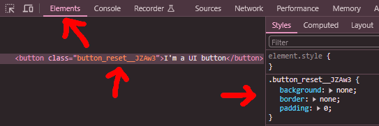

%toc%

<article>

## Styling and CSS libraries

Spoiler alert! I will use [CSS Modules](https://github.com/css-modules/css-modules) in this tutorial, for the simple reason that a lot of CSS libraries had problems with **Server** components but even with **Client** components and I did NOT want to add an experimental library to my project. When I started writing this tutorial CSS Modules where one of the few choices that worked well with Next.js 13 and Server Components, which is the main reason I decided to give it a try. Some CSS libraries that were very popular did not work with Next.js 13 which is why the Next.js team has put up a [Next.js "CSS-in-JS" documentation](https://nextjs.org/docs/app/building-your-application/styling/css-in-js) page that lists those who work with client components, but it doesn't mean they work with server components (actually a lot of them still don't), for more details keep an eye on the [Emotion support for App Router Issue #2928](https://github.com/emotion-js/emotion/issues/2928)) or the [styled components for Next.js 13 Issue #3856](https://github.com/styled-components/styled-components/issues/3856) if those are libraries you are interested in

I'm glad I choose to use CSS Modules and write vanilla CSS, because it was very enjoyable to be able to write vanilla CSS without having to spend a lot of time reading a documentation to understand how a certain CSS library works. On the other hand it is true that I spent a lot of time reading MDN documentation about modern CSS features, like using [custom properties (CSS variables)](https://developer.mozilla.org/en-US/docs/Web/CSS/Using_CSS_custom_properties), navtive [CSS nesting](https://developer.mozilla.org/en-US/docs/Web/CSS/CSS_nesting) (it is great to see this feature that you might know from pre-processors like SASS coming to CSS, but for this one I decided to not use it yet as it is maybe still a bit early in terms of [browsers that support it](https://caniuse.com/?search=css%20nesting)), [calc()](https://developer.mozilla.org/en-US/docs/Web/CSS/calc) and [color-mix()](https://developer.chrome.com/docs/css-ui/css-color-mix) functions, pure CSS [on scroll animations](https://developer.chrome.com/docs/css-ui/scroll-driven-animations) and a bunch more, but I feel like it was time well invested

Why did I not use Tailwind? I'm sorry, but for this tutorial I wanted to try out CSS Modules to see if writing vanilla CSS in CSS Modules is a good alternative or not, I know buuuh me 😢. A lot of people indeed do like Tailwind and this is totally fine, I'm just not one of them. Feel free to skip the few chapters about styling in this tutorial if you already know CSS Modules and don't like them, if you haven't used CSS Modules yet then maybe use this tutorial to get an introduction and then later decide for yourself if you like that solution or not

If you like Tailwind and want to use it with Next.js 13 / 14 the good news is that because Tailwind introduced a new just-in-time [(JIT) compiler in version 2.1](https://v2.tailwindcss.com/docs/just-in-time-mode) and then used JIT by default starting with [version 3](https://tailwindcss.com/blog/tailwindcss-v3#just-in-time-all-the-time), Tailwind will not have problems in regards to server components compared to a lot of other CSS libraries that did or still do have problems. So if you prefer Tailwind then using Tailwind (instead of the CSS Modules I will use here) then yes go ahead, it is good alternative. If you want to use an UI library instead, then maybe have a look at [Next UI](https://github.com/nextui-org/nextui) which is a beautiful UI based on Tailwind CSS

> [!MORE]  
> [Next.js "CSS-in-JS" documentation](https://nextjs.org/docs/app/building-your-application/styling/css-in-js)  
> [Tailwind CSS "with Next.js" documentation](https://tailwindcss.com/docs/guides/nextjs)  

### Getting started with CSS Modules

Next.js supports [CSS Modules](https://github.com/css-modules/css-modules) out of the box, which means there is NO need to install any extra packages and CSS Modules are **React Server Components (RSC)** compatible which these days should be a requirement for CSS libraries that you intend to use with Next.js 13 / 14

**CSS Modules** let you write vanilla CSS in `*.module.css` files that you then import into your components

Let's start with a simple example, go into the `/components/tutorial_examples` folder and create a new `UI` folder

Next in the `UI` folder we create a new `button.module.css` file and add the following content:

```css title="/components/tutorial_examples/UI/button.module.css"
.reset {
    background: none;
    border: none;
    padding: 0;
}
```

And then a second `Button.tsx` file (also in the `UI` folder), with the following content:

```tsx title="/components/tutorial_examples/UI/Button.tsx" showLineNumbers
import styles from './button.module.css'

const UIButton: React.FC = (): JSX.Element => {

    return (
        <button className={styles.reset}>
            I&apos;m a UI button
        </button>
    )
}

export default UIButton
```

Line 1 we import the CSS module

Line 6 we apply the `.reset` class we did add in our `button.module.css` CSS module to the button

Then we go into the `/app/tutorial_examples` folder and create a new `styling` folder

Then in the `styling` folder we create a new `page.tsx` file and paste the following content into it:

```tsx title="/app/tutorial_examples/styling/page.tsx" showLineNumbers
import UIButton from '@/components/tutorial_examples/UI/Button'

export default function StylingExamplePage() {

    return (
        <>
            <UIButton />
        </>
    )

}
```

Line 1 we import our custom button component that is styled using a CSS module

Line 7 we use the button

Tada 🎉 we now know how to use CSS Modules

#### CSS Modules features

What I like about CSS Modules is that they are fairly simple, which means you won't spend days reading documentation to understand how they work, yet they have some very interesting and powerful features, in this chapter we will have a look at some of them

> [!TIP]  
> For [naming](https://github.com/css-modules/css-modules#naming) classes the css modules team recommends using camelcase, a class name with a hyphen (kebab-case) is possible but you will need to put the name into square brackets, if for example you have a class named `.foo-bar{:css}`, then in your component you use it like this `className={styles['foo-bar']}{:jsx}`  

A big advantage of CSS Modules is that you don't have to worry about unique names, the library makes them unique for you by adding a hash to the name, meaning you can have two classes named **button** in two different files as they are **component scoped** by default and hence will be unique after compilation. The disadvantage with CSS Modules is that when you look at their name using the developer tools, the class and animation names won't be exactly what you have defined, instead the format for names will be: `[filename]\_[classname]\_\_[hash]`, so they will still be recognizable. If you don't want the css modules to create unique class names for you, you have the option to set a [stable** class name](https://www.gatsbyjs.com/docs/how-to/styling/css-modules/#enabling-user-stylesheets-with-a-stable-class-name).

Open your browser and navigate to homepage at [http://localhost:3000/](http://localhost:3000/)

Then right click, chose **Inspect** or press `F12` to open the dev tools, then open the **Elements** tab, to see an example of what the class name looks like after compilation:



If you want to add more than one class, either use a package like [classnames](https://www.npmjs.com/package/classnames) or just use [native javascript template literals](https://developer.mozilla.org/en-US/docs/Web/JavaScript/Reference/Template_literals) like so:

```tsx title="/components/tutorial_examples/UI/Button.tsx" showLineNumbers "&#x60;${styles.reset} ${styles.core}&#x60;"
import styles from './button.module.css'

const UIButton: React.FC = (): JSX.Element => {

    return (
        <button className={`${styles.reset} ${styles.core}`}>
            I&apos;m a UI button
        </button>
    )
}

export default UIButton
```

Line 6 we use a javascript template literal to add two classes to the button (instead of just one)

Then we add the second class to our CSS Module:

```css title="/components/tutorial_examples/UI/button.module.css"
.reset {
    background: none;
    border: none;
    padding: 0;
}

.core {
    --button-padding: 6px;

    padding: var(--button-padding);
    border: 2px dashed magenta;
}
```

If you want to use the element **id** instead of a **class** to style an element, you can do it like this:

```tsx title="/components/tutorial_examples/UI/Button.tsx"  showLineNumbers{6} /styles.myIdStyle/#special
<button id={styles.myIdStyle} className={`${styles.reset} ${styles.core}`}>
```

and in the css module file you add the corresponding css like this:

```css title="/components/tutorial_examples/UI/button.module.css"
#myIdStyle {
    color: white;
    background-color: black;
    cursor:pointer;
}


#myIdStyle:hover {
    color: black;
    background-color: white;
}
```

A few more things about CSS Modules worth knowing:

* CSS modules allow you to do composition by using the compose keyword, this works like an import in javascript and allows you to include one css module into another css module
* you can change to first part of the CSS Modules style files (*.module.css) to what ever you want (I usually use the same name as the component)
* you can use CSS modules everywhere, they are not just for components, you can use them for pages and layouts and you can place them anywhere, here we put them into the components folder but you can also place them in the app folder if you prefer

> [!MORE]  
> [Next.js "CSS Modules and Global Styles" documentation](https://nextjs.org/docs/app/building-your-application/styling/css-modules)  
> [CSS Modules "composition" documentation](https://github.com/css-modules/css-modules#composition)  
> [CSS Modules "naming" documentation](https://github.com/css-modules/css-modules#naming)  

#### Improved UI Button

The UI button we just created is an oversimplified version of a button component, in a real project we would probably write something a little more useful like this:

```tsx title="/components/tutorial_examples/UI/Button.tsx" showLineNumbers
'use client'

import type { PropsWithChildren } from 'react'
import styles from './button.module.css'
import { useRouter } from 'next/navigation'

interface IProps extends PropsWithChildren {
    url?: string
}

const UIButton: React.FC<IProps> = (props): JSX.Element => {

    const { url, children, ...rest } = props
    const router = useRouter()

    const clickHandler = () => {
        if (url) {
            router.push(url)
        }
    }

    return (
        <button onClick={clickHandler} id={styles.myIdStyle} className={`${styles.reset} ${styles.core}`} {...rest}>
            {children}
        </button>
    )
}

export default UIButton
```

Line 1 we use the `'use client'` directive as we are going to add a click handler, if we don't explicitly mark it as client component Next.js will throw a runtime error like this one:

```log
Error: Event handlers cannot be passed to Client Component props.
<button onClick={function clickHandler} className=... id=... children=...>
                ^^^^^^^^^^^^^^^^^^^^^^^
If you need interactivity, consider converting part of this to a Client Component.
```

Line 3 we import the `PropsWithChildren` type from react and line 7 to 9 we extend the default props type by adding an entry for our `url` prop, the **url** is followed by a question which indicates we want this to be an optional prop

Line 5 we import the Next.js [useRouter](https://nextjs.org/docs/app/api-reference/functions/use-router) hook, which will allow us to programmatically trigger a client side navigation

Line 11 because React.FC is a [generic function](https://www.typescriptlang.org/docs/handbook/2/generics.html) it makes it easy for us to use our `IProps` interface which will add type safety for the props

Line 13 we use the [destructuring assignment](https://developer.mozilla.org/en-US/docs/Web/JavaScript/Reference/Operators/Destructuring_assignment) to extract the variables we will use from the props object

Line 14 we create an app router instance

Line 16-20 we create a click handler using an arrow function, it will check if the url prop is defined, if it is defined we use the app router **push** method to perform a client-side navigation to the provided url

Line 23 we pass our our event handler function to onClick

Line 24 we use the children prop to make our button component more flexible, so that who ever uses the button can define what the button text should be instead of having a hardcoded text like before, this of course makes it more reusable

> [!NOTE]  
> Of course you should never overengineer a component early without knowing if the added flexibility will ever be useful to anyone, for example in this case you could have made the button a bit simpler by not checking if the url exists and just assume the button will always get used to navigate to a page
> 
> But on the other hand it is also important to not end up having dozens of button components in a project that are all very similar, this is why in this case, we need it to navigate to a page another developer that will use the button somewhere else might not need that feature, which is why we made the feature optional
>
> Reusing components will avoid having dozens of button components in your project that for example look the same but do different things, this matters as more components will probably lead to higher maintenance costs and maybe even increase technical dept

Of course now that we added a bit of reusability to our button we also need to update the page in which we use component, to this:

```tsx title="/app/tutorial_examples/styling/page.tsx" showLineNumbers {9}
import UIButton from '@/components/tutorial_examples/UI/Button'

export default function StylingExamplePage() {

    const goTo = '/'

    return (
        <>
            <UIButton url={goTo}>I&apos;m a UI button, that will open the homepage</UIButton>
        </>
    )

}
```

Line 9 the UIButton **text** is now defined between the opening and closing tag (and not hardcoded in the button itself anymore, making it more reusable) and we also pass it a url prop that we have set above in the page to activate the navigation feature

### Adding a global.css

CSS Modules are perfect to style components and even the content in your pages but at some point you might want to add a class that can be used everywhere in your app, like for example have a global style for links, this is when you use the **global.css**

As we saw in the previous chapter you can add classes and use the id in CSS Modules, but there is one thing you can't use in CSS Modules and that's the [Element type selectors](https://developer.mozilla.org/en-US/docs/Web/CSS/Type_selectors)

Let's (re-)open the CSS Module (that we created for our button) and add some styling for the button by using the **`button` type selector**, like so:

```css title="/components/tutorial_examples/UI/button.module.css" {14-16}
.reset {
    background: none;
    border: none;
    padding: 0;
}

.core {
    --button-padding: 6px;

    padding: var(--button-padding);
    border: 1px dashed orange;
}

button {
    color: blue;
}
```

Then make sure your dev server is running (using the `npm run dev` command) and you will see that you get an error in your terminal:

> Syntax error: Selector "button" is not pure (pure selectors must contain at least one local class or id)

So instead if you want to style all Elements that match a certain type, or if you want to add universal selectors (`*`), or set global css variables using the [:root](https://developer.mozilla.org/en-US/docs/Web/CSS/:root) pseudo class, then you do it in the `global.css`, which we will create in the `/app` folder, with the following content:

```css title="/app/global.css" showLineNumbers
:root {
    /* colors */
    --background-dark-value: 288 23% 20%;
    --background-dark-color: hsl(var(--background-dark-value));
    --text-dark-value: 19 71% 97%;
    --text-dark-color: hsl(var(--text-dark-value));
    --primary-dark-value: 315 60% 82%;
    --primary-dark-color: hsl(var(--primary-dark-value));
    --secondary-dark-value: 211 63% 83%;
    --secondary-dark-color: hsl(var(--secondary-dark-value));
    /* sizes */
    --spacing: 16px;
    --maxWidth: 1120px;
}

*,
*::after,
*::before {
    box-sizing: border-box;
}

html {
    -webkit-font-smoothing: antialiased;
    -moz-osx-font-smoothing: grayscale;
    -webkit-text-size-adjust: 100%;
    text-size-adjust: 100%;
    tab-size: 4;
    background-color: var(--background-dark-color);
    color: var(--text-dark-color);
    font-size: 100%;
}

body {
    /* remove any margin that browsers add to body */
    margin: 0;
    /* compensate for the fixed navigation height */
    padding-top: 60px;
}

header {
    margin-bottom: var(--spacing);
}

footer {
    margin-top: var(--spacing);
    min-height: calc(var(--spacing) * 2);
}

main {
    display: flex;
    max-width: var(--maxWidth);
    margin-left: auto;
    margin-right: auto;
    margin-bottom: calc(var(--spacing) * 4);
}

/* on small screens */
@media all and (max-width: 768px) {
    main {
        margin-bottom: calc(var(--spacing) * 2);
        /* place one under the other */
        flex-flow: column;
    }
}

article,
section {
    padding: var(--spacing);
    width: 100%;
}

p {
    margin-block: 1em;
}

a {
    color: var(--primary-dark-color);
}

a:hover {
    color: var(--secondary-dark-color);
}

h1 {
    font-size: 6rem;
    line-height: 1.167;
}

h2 {
    font-size: 3.75rem;
    line-height: 1.2;
}

h3 {
    font-size: 3rem;
    line-height: 1.167;
}

h4 {
    font-size: 2.125rem;
    line-height: 1.235;
}

h5 {
    font-size: 1.5rem;
    line-height: 1.334;
}

h6 {
    font-size: 1.25rem;
    line-height: 1.6;
}

h1 {
    margin-block: 0 1em;
}

h2,
h3,
h4,
h5,
h6 {
    margin-block: 1.5em 1em;
}
```

This is our base `global.css` which now contains a basic [CSS (Cascading Style Sheet)](https://developer.mozilla.org/en-US/docs/Web/CSS) used to style and layout our app:

Line 1 to 14 we set some variables (inside of the [:root](https://developer.mozilla.org/en-US/docs/Web/CSS/:root) pseudo class) that can be used everywhere (even in any of our CSS Modules), it is recommended to use CSS variables when ever possible as in the future it will be faster to change the value of a variable in the globall css instead of having to go into every file where that variable gets used and change the value there

Line 16 to 20 we use a technique seen in a lot of **reset stylesheets**, we using the asterisk to target all elements of our HTML document and then also include their [::before](https://developer.mozilla.org/en-US/docs/Web/CSS/::before) and [::after](https://developer.mozilla.org/en-US/docs/Web/CSS/::after) pseudo elements, we set their [box-sizing CSS property](https://developer.mozilla.org/en-US/docs/Web/CSS/box-sizing) to **border-box**, this has an impact on how the browser calculates the width and height of elements, by default **box-sizing** is set to **content-box**, in which case the width and height only include the content but NOT the border padding or margin, however as we change it **border-box** the width and height will now also include the border and padding but still not the margin, this way of calculating the width and height seems more intuitive then the default behavior to a lot of developers, which is why this is something you will often see in stylesheets (if however you prefer the default behavior, then feel free to not include this part in your own global.css stylesheet)

> [!TIP]  
> In CSS3 pseudo elements like **before** and **after** have two colons, so `::before` and `::after` (in CSS2 they only had one colon), check out the [MDN ::before page](https://developer.mozilla.org/en-US/docs/Web/CSS/::before) for further details

Line 22 to 31 we use the **html** [type selector](https://developer.mozilla.org/en-US/docs/Web/CSS/Type_selectors) and do several things:

* first set the [font-smoothing](https://developer.mozilla.org/en-US/docs/Web/CSS/font-smooth) CSS property to tell the browser to apply **anti-aliasing** to our fonts, if you have a dark background and light text (which we do in this example) then **anti-aliasing** can prevent the text from looking overly bold and instead makes it look lighter, but be aware that on the [caniuse CSS font-smooth](https://caniuse.com/font-smooth) page they say that this property is not part of the CSS standard, however both webkit and firefox implement their own non standard property, as explained the article ["stop-fixing-font-smoothing"](https://usabilitypost.com/2012/11/05/stop-fixing-font-smoothing/) this feature should only get used for light fonts on dark backgrounds but not for dark text on a light background, I recommend reading that article if you want to learn more about font smoothing
* then we also set the [text-size-adjust](https://developer.mozilla.org/en-US/docs/Web/CSS/text-size-adjust) CSS property, this feature makes sure that on mobile browsers the text size is the exactly the one we set and not inflated by the browser, this helps to avoid weird placement bugs where modified text size moves other elements around, however if you use this feature make sure that your text is easy to read on mobile devies and tablets, if the text is too small I recommend using a bigger font-size and always keep the **text-size-adjust** set to 100%, text-size-adjust is however only support on chrome (as of now), you can check out what browser support it on [caniuse "text-size-adjust"](https://caniuse.com/text-size-adjust)
* we also use the [tab-size](https://developer.mozilla.org/en-US/docs/Web/CSS/tab-size) CSS property, which is useful if for example you have codeblocks in your content, as codeblocks often contain tabs for code indentation, which means this feature is similar to setting the indent size in your [.editorconfig](https://editorconfig.org/) file, if you use just a number without a unit (like in this example) then tab size will be that number multiplied by the **width of one space** (this is not the font-size, which is the height of your characters), so setting it to **4** and assuming a space character is 9px wide then this gives us a tab size of 4 x 9 = 36px
* then we set the color for our background and the default color for our text using the CSS [var()](https://developer.mozilla.org/en-US/docs/Web/CSS/var) function and as value we use the colors we previously defined in the `:root` pseudo element
* finally we set the font-size to 100%, which is good for accessibility as it lets the user change the font-size via the browser settings, as we will also use the [CSS rem unit](https://developer.mozilla.org/en-US/docs/Learn/CSS/Building_blocks/Values_and_units) for all font related sizes, this means that setting the font-size of the HTML element will have an impact on all other font-sizes in our CSS, for example we use the CSS rem unit for the font-size of all our headings, if the user now changes the default font-size via the browser settings then all our text will adapt to that change, if however you set a value like 16px as font-size to your `<html>` element (or the `<body>` element) then the user will not be able to change the font-size via the browser settings

To make a test you can set the font-size to 100% in the global.css, then save the file and launch the development server, then open the [http://localhost:3000/tutorial_examples/mdx-components_playground](http://localhost:3000/tutorial_examples/mdx-components_playground) playground page in your browser, then open the settings, in chrome you have to click on **appearance** in the menu on the left and then you on the right you have options where you can change the browsers default font-size setting to **large** (in Firefox it is also in the settings but in the general section, in Safari it is also in settings, then Advanced and then change the font-site where it says "Never use font sizes smaller than")


Line 33 to 36 we use the **body type selector** and use a reset the margin value(s) that a browser might set by default to zero

Line 38 to 45 we add some margin to the **footer** and **header** using the respective type selectors, we also add a minimum height to the footer which will create a bit of space at the end of our pages, this is useful as on mobile and tablet you sometimes have device or browser UIs putting something on the bottom that would cover your last bit of content, by adding a bit of space you ensure that the user will always see everything when the page is fully scrolled down
 
Line 47 to 53 we use the **main type selector** to tell the browser that we want to use the [CSS Flexbox layout](https://developer.mozilla.org/en-US/docs/Learn/CSS/CSS_layout/Flexbox) by setting the display property to [flex](https://developer.mozilla.org/en-US/docs/Web/CSS/display#flex), for this element we set a maximum width using the CSS variable we created in the `:root`, the maximum width is 1120px to ensure that even on very large viewports (screens) the main element will not stretch to the full width that is available, this is important for the text we will place inside of our main section, because if chapters of text are very wide if makes them hard to read, we set both the margin-left and margin-left to auto to make sure that our `<main>` element will get centered if the viewport is wider than the **max-width** we just set, finally we also add a little bit of margin to the bottom to make sure our content has a bit of space before the footer starts

When chosing to use the **CSS Flexbox layout** as we did for the main element, the browser automatically assumes that the [flex-flow](https://developer.mozilla.org/en-US/docs/Web/CSS/flex-flow) is set to row, which means that if we put an `<article>` into our `<main>` as well as an `<aside>` then both will get displayed as two columns next to each other (yes flex-flow row creates "columns", that's because using flex-flow row all elements get put in a row and then expand twowards the bottom, with flexbox flex-flow column they all elements are in a column and expand towards the right)

Line 55 to 62 here we change the flex-flow of the `<main>` element to column, which means that this time if we put an `<article>` into our `<main>` as well as an `<aside>` then both will get displayed as two rows, we do this because on devices with a viewport smaller than the maximum width of 768px we are targetting with our `@media all and (max-width: 768px){:css}` [media query](https://developer.mozilla.org/en-US/docs/Web/CSS/CSS_media_queries/Using_media_queries)  we want the `<aside>` element will get placed below the `<article>`

Line 64 to 68 we add a padding to sections and articles on each side using our `--spacing` CSS variable (16 pixels), because we also added maximum width to the main element this means that article content (if we don't have an aside) will be a maximum 1120 - 32 = 1088 pixels wide, this will matter in a later chapter when we start adding images to our cotnent, finally we set the width to 100% to make sure that the article always uses the full width of the parent main element

Line 70 to 72 we use the [margin-block](https://developer.mozilla.org/en-US/docs/Web/CSS/margin-block) CSS property (which is a shorthand for [margin-block-start](https://developer.mozilla.org/en-US/docs/Web/CSS/margin-block-start) and [margin-block-end](https://developer.mozilla.org/en-US/docs/Web/CSS/margin-block-end)) and define the size using **em** units, which will result in a margin on the top and bottom, the size of the margin will be relative to the font-size used by the paragraph as the unit we use is **em** (1em is 1 time the elements font-size), be aware that [caniuse states that margin-block](https://caniuse.com/mdn-css_properties_margin-block) is supported by all modern browsers but NOT supported by IE11

Line 74 to 80 we add some color to all our links using the CSS `var()` function to use the variables we set earlier in the  and we also use the [:hover](https://developer.mozilla.org/en-US/docs/Web/CSS/:hover) pseudo class to change the color of links on hover

Line 82 to 110 we use the font-size and line-height properties to set a custom height for our headings (like any other values in this CSS stylesheet, those are just my examples, feel free to tweak those values to your liking)

Line 112 to 122 we set the margin for the headings, same as for the paragraph(s) we use the [margin-block](https://developer.mozilla.org/en-US/docs/Web/CSS/margin-block) CSS property and **em** units, meaning the margins will be relative to the headings font-size (the bigger the font-size of the heading the bigger the margin will be)
 
Now to apply the global styles to our content we our going to import the `global.css` inside of our **root layout** (located in the `/app` folder), like so:

```tsx title="/app/layout.tsx" showLineNumbers {1}
import './global.css'
import { Metadata } from 'next'

export const metadata: Metadata = {
    title: 'Next.js',
    description: 'Generated by Next.js',
}

export default function RootLayout({
    children,
}: {
    children: React.ReactNode
}) {
    return (
        <html lang="en">
            <body>
                <header>
                    <p>My Header</p>
                </header>
                <main>{children}</main>
                <footer>
                    <p>My Footer</p>
                </footer>
            </body>
        </html>
    )
}
```

Line 1 we import our `global.css` stylesheet and that's already it

Congratulations 🎉 you now know how to use CSS modules and global.css to add styling to your project

> [!MORE]  
> [Next.js "global styles" documentation](https://nextjs.org/docs/app/building-your-application/styling/css-modules#global-styles)  
> [MDN "CSS" documentation](https://developer.mozilla.org/en-US/docs/Web/CSS)  
> [MDN "Using CSS custom properties (variables)" documentation](https://developer.mozilla.org/en-US/docs/Web/CSS/Using_CSS_custom_properties)  
> [MDN "Flexbox" documentation](https://developer.mozilla.org/en-US/docs/Learn/CSS/CSS_layout/Flexbox)

</article>
