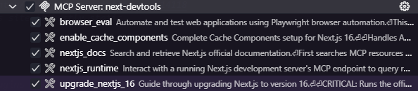

import { sharedMetaDataArticle } from '@/shared/metadata-article'

export const metadata = {
    title: frontmatter.title,
    keywords: frontmatter.keywords,
    alternates: {
        canonical: frontmatter.permalink,
    },
    openGraph: {
        ...sharedMetaDataArticle.openGraph,
        images: [{
          type: "image/png",
          width: 1200,
          height: 630,
          url: '/web_development/og/tutorials_next-js_16_devtools_mcp/opengraph-image'
        }],
        url: frontmatter.permalink,
        section: frontmatter.section,
        publishedTime: frontmatter.published,
        modifiedTime: frontmatter.modified,
        tags: frontmatter.keywords,
    },
}

%toc%

<article>

# Next.js 16 Devtools MCP in VSCode

<video autoPlay muted playsInline width="100%" poster="/assets/images/app/web_development/tutorials/next-js_16_devtools_mcp/banner.png">
  <source src="/assets/video/app/web_development/tutorials/next-js_16_devtools_mcp/banner.mp4" type="video/mp4" />
  Your browser does not support the video tag.
</video>

## VSCode MCP file

TLDR: When using VSCode, the most important part, is to create a new `mcp.json` file in your `.vscode` folder, you can either use a command or do it manually.

### Using the VSCode command

The fastest way is to use the following command:

```shell
code --add-mcp '{"name":"next-devtools","command":"npx","args":["-y","next-devtools-mcp@latest"]}'
```

If you are using **PowerShell**, it will strip the double quotes from the command, so you need to escape them first:

```shell
code --add-mcp '{\"name\":\"next-devtools\",\"command\":\"npx\",\"args\":[\"-y\",\"next-devtools-mcp@latest\"]}'
```

### Manually adding an MCP file  

Some IDEs or AI coding tools have an `.mcp.json` in the root of the project, but that does not work when using VSCode.

VSCode historically has stored files in a hidden `.vscode` folder, instead of using hidden files like `.mcp.json` at the root of a project. This means that in our case the file itself does not start with a dot (the folder is already hidden) the filename is only `mcp.json`.

To add the Next.js 16 Devtools MCP in VSCode, create or edit your mcp.json file:

```json title=".vscode/mcp.json"
{
    "servers": {
        "next-devtools": {
            "command": "npx",
            "args": [
                "-y",
                "next-devtools-mcp@latest"
            ],
            "type": "stdio"
        }
    },
    "inputs": []
}
```

Also note how VSCode uses "servers" and not "mcpServers".

### Other ways to add an MCP server (optional)

The **third option** is to open the VSCode command palette, use the keyboard shortcut `Ctrl+Shift+p` (macOS: `⇧⌘P`, Linux: `Ctrl+Shift+P`) to do so, then type "MCP" and choose "MCP: Add Server"

The **fourth option** to add MCP servers, but its a bit hidden...

As soon as you have an mcp.json file in VSCode, after you open that file, there will be a "Add Server..." button in the bottom left.

What is great about those two options is that they allow you to add other MCP servers from sources like NPM, or really any other remote MCP server via a HTTP connection.

### Configure Tools

If you followed the above steps you should now be able to see the new Tools in VSCode.

To open the tools list click on the **tools icon** below the copilot prompt input.

You can enable or disable tools, make sure the "MCP Server: Next Devtools" is enabled:



## Upgrading to Next.js 16 using the Next.js 16 Devtools MCP

If you have already upgraded your project's packages to Next.js 16, but haven't done a full upgrade of your own code yet, then you will want to try out the Next.js 16 MCP upgrade tool.

> [!NOTE]
> AIs can be slow especially when refactoring an existing project, a more efficient and faster way to update some parts of your project is to use the [Next.js 16 codemod](https://nextjs.org/docs/app/guides/upgrading/codemods) for Next.js 16 and use it first, after the codemod is done you can still run the MCP upgrade tool. The AI will notice that some things are already done and skip them, at the end it will give you a recap about the state of your project in regards to Next.js 16.

To trigger the tool, make sure Github Copilot is set to Agent Mode, choose your favorite Agent (like Claude Sonnet 4.5)

I recommend using the slash commands as they guarantee that the right tool will be used, type `/mcp` and then select `/mcp.next-devtools.upgrade-nextjs-16` , this will trigger the tool

Or you can use a prompt like this instead, which if lucky will trigger the upgrade-nextjs-16 tool too:

```txt
Next Devtools, help me upgrade my Next.js app to version 16
```

## Use the MCP Devtools to start using cache components in your Next.js 16 project

The easiest way is to use the slash command `/mcp` into the copilot input field, and then select `/mcp.next-devtools.enable-cache-components`, this will trigger the tool

This command will make use of a bunch of resources that are bundled in the Next.js devtools MCP, it will try to only use the ones that apply to your project. After the initial run feel free to keep asking the agent about certain "cache components" features to learn more about them, even if your project does not use them yet, like the new "updateTag()" and refresh().

## Next.js 16 MCP server

When you are done upgrading your codebase to Next.js 16 I recommend enabling the built in (local) Next.js 16 MCP server.

Wait didn't we just install Next.js 16 MCP?

What we did so far is add the Next.js 16 Devtools MCP to VSCode. Those are new tools that your AI agents can now use. What we are about to enable now is an MCP server inside of the Next.js dev server, that will give us access to a series other tools.

### Configuring Next.js experimental MCP server

To enable the MCP dev server you need to do two things, enabled it in the config and then start the Next.js dev server.

First we edit our next.config.ts file:

```mjs title=".vscode/mcp.json" showLineNumbers {8-9}
const nextConfig: NextConfig = {
    reactStrictMode: true,
    typedRoutes: true,
    reactCompiler: true,
    // enable "use cache" directive and PPR (previously dynamicIO)
    cacheComponents: true,
    experimental: {
        // MCP server
        mcpServer: true
    },
}
```

### start the dev server

then we start the dev server:

```shell
npm run dev
```

That's it, the MCP server is now running alongside your dev server, meaning you can try out a prompt like this (make sure you are in agent mode):

```shell
what tools does the nextjs mcp server expose
```

My copilot AI Agent is quite lazy, it rarely checks if something is already running in the terminal and instead opens a new one, to fix this you have two options:

Either make sure you have no terminal running the dev server

Or change you do change the prompt to this:

```shell
what tools does the nextjs mcp server expose (dev server is already running on port 3000)
```

## Debugging Next.js using its own MCP tool(s)

We can use the new tools to debug server errors.

First edit a page in a your project, for example the homepage, add the following bug:

```tsx
// i want the ai to find the following code 
throw new Error('this is a bug')
```

then make sure the dev server is running:

```shell
npm run dev
```

Finally we ask the AI for help, using the following prompt (make sure you are in agent mode):

```txt
Next Devtools: there is a bug on the server side, help me find it or my boss will get angry (dev server is already running on port 3000)
```

producing a query like this:

```json
{
  "action": "list_tools",
  "port": 3000
}
```

and if successful it will make a list of tools, it will identify the "get_errors" tool as the most suitable (based on the wording in your prompt, asking to find an error)

finally it will call the get_errors tools and get a response like this:

```json
{"success":true,"port":3000,"toolName":"get_errors","result":[...]}
```

After that it will hopefully find the bug and fix it, as the dev server is running, HMR will kick in and display the fixed page in the browser

> [!MORE]  
> [Next Devtools MCP repository](https://github.com/vercel/next-devtools-mcp)  
> [VSCode Copilot mcp-servers docs](https://code.visualstudio.com/docs/copilot/customization/mcp-servers)  
> [Next.js 16 MCP docs](https://nextjs.org/docs/app/guides/mcp)  

</article>
